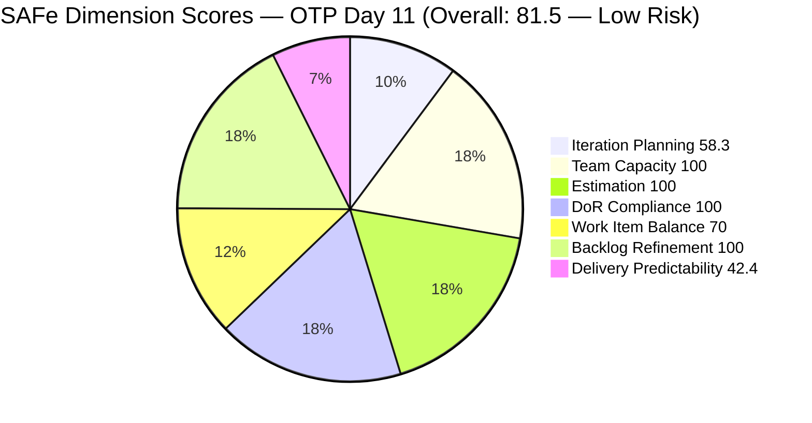
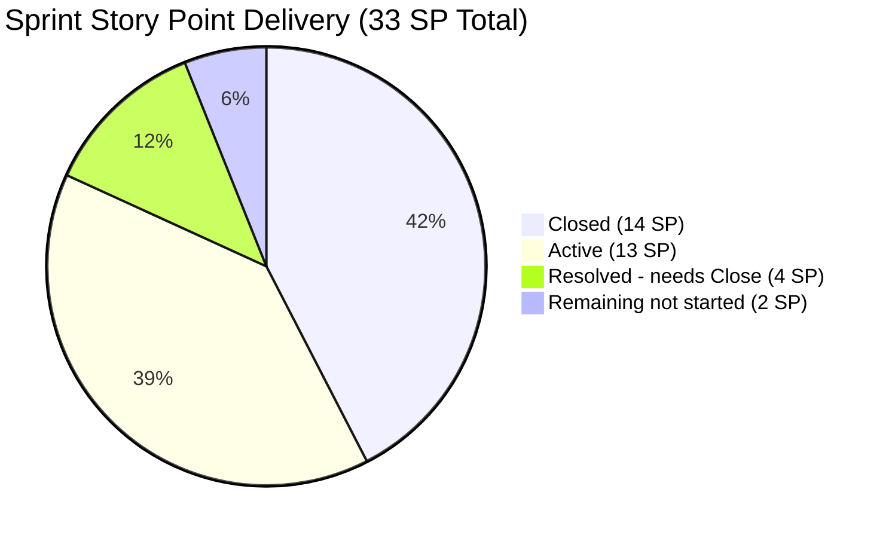
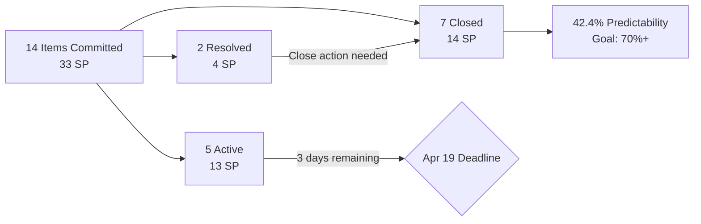

# ADO SAFe Iteration Audit — OTP Team (Office of the President)
**Audit A29 | Iteration 7.1 (Apr 6–19, 2026) | Day 11 of 14 (79% elapsed)**

---

## 1. Audit Metadata

| Field | Value |
|---|---|
| **Audit Date** | April 16, 2026, 09:00 PHT |
| **Auditor** | Claude Code (ADO SAFe Audit Agent) |
| **Workspace** | `ado_otp` |
| **ADO Project** | OTP (`e7739905-28a3-4ae1-9173-7f6cd13b3494`) |
| **Team** | OTP Team (`64de61f0-1203-4b01-aee2-6b4415aec52b`) |
| **Iteration** | Iteration 7.1 — Apr 6 to Apr 19, 2026 |
| **Iteration ID** | `ce4205d6-4038-4752-a0b8-dda248031686` |
| **Sprint Day** | Day 11 of 14 (79% elapsed) |
| **Prior Audit** | AUDIT_20260413_0900.md (A28, Score 77.7 — Moderate Risk) |
| **Scoring Model** | ADO SAFe v1 (7-dimension rubric) |
| **Project Exception** | Single-assignee model (Grace) accepted by team per CLAUDE.md |
| **Overall Score** | **81.5 / 100** |
| **Risk Band** | **Low Risk** (≥80) |

---

## 2. Executive Summary

The OTP Team achieves **81.5 (Low Risk)** — a **+3.8 point breakthrough** from the A28 score of 77.7, crossing the Low Risk threshold (80.0) for the first time this iteration. This marks a significant sprint-day surge driven by **7 items closed on April 16** totaling **14 SP**, the team's highest single-day delivery output in Iteration 7.1.

Grace closed #200681 (Team Re-Architecture), #198759 (Bomar Visa), #198760 (Jove Visa), #198762 (Bon Visa), #202241 (Signing Intake Form), #202249 (H1B Requirements), and #195284 (Secretary's Certificate) — all on April 16. Additionally, #200686 and #184001 moved to **Resolved** status. This represents a strong end-of-sprint push.

Delivery Predictability climbed from 0.0 (A28) to **42.4%** (14 SP closed / 33 SP committed). With 5 Active items and 2 Resolved items remaining in the sprint, and 3 business days remaining (Apr 16–18), the team can reach 60–70% delivery if Active items close before Apr 19.

All process dimensions remain exemplary: Team Capacity (100.0), Estimation (100.0), DoR Compliance (100.0), and Backlog Refinement (100.0). The structural Work Item Balance penalty (70.0) reflects the accepted single User Story type across all sprint items.

---

## 3. Previous Audit Delta

| Dimension | A28 — Day 8 (Apr 13) | A29 — Day 11 (Apr 16) | Delta |
|---|---|---|---|
| Iteration Planning | 73.7 | 58.3 | **-15.4** |
| Team Capacity | 100.0 | 100.0 | 0.0 |
| Estimation | 100.0 | 100.0 | 0.0 |
| DoR Compliance | 100.0 | 100.0 | 0.0 |
| Work Item Balance | 70.0 | 70.0 | 0.0 |
| Backlog Refinement | 100.0 | 100.0 | 0.0 |
| Delivery Predictability | 0.0 | 42.4 | **+42.4** |
| **Overall** | **77.7** | **81.5** | **+3.8** |

**Key changes since A28 (Day 8, Apr 13):**
- **7 items Closed on Apr 16** — #200681 (2SP), #198759 (2SP), #198760 (2SP), #198762 (2SP), #202241 (2SP), #202249 (2SP), #195284 (2SP). Total: 14 SP credited.
- **2 items moved to Resolved (Apr 16)** — #200686 (Client Negotiation, 2SP) and #184001 (Emergency Exit Canvass, 2SP). Resolved is not counted as Closed SP per ADO SAFe formula.
- **Delivery Predictability unlocked: 0.0 → 42.4%** — 14 SP closed of 33 SP committed.
- **Iteration Planning decreased: 73.7 → 58.3** — Board backlog dropped from 19 visible items to 12 as closed items were removed from the Stories & Deliverables board. Current-sprint items visible on board = 7 of 12.
- **5 Active items remain:** #199522 (4SP), #198587 (3SP), #201807 (2SP), #202229 (2SP), #195285 (2SP) = 15 SP in-flight.

---

## 4. Current Iteration Snapshot

| Metric | Value |
|---|---|
| **Iteration** | 7.1 — Apr 6 to Apr 19, 2026 |
| **Iteration Day** | 11 of 14 (79% elapsed) |
| **Visible root backlog items** | 12 |
| **Current iteration root items (committed)** | 14 |
| **Items in future iterations (on board)** | 5 (7.2: #175360, #200073, #201811; 7.3: #201815; 7.4: #201820) |
| **Total Story Points committed** | 33 SP |
| **Closed Story Points** | 14 SP (7 items) |
| **Resolved Story Points (not credited)** | 4 SP (#200686, #184001) |
| **Active Story Points** | 15 SP (5 items) |
| **Remaining business days** | 3 (Apr 16–18) |
| **Sole contributor** | Grace (grace@jairosoft.com — accepted project exception) |
| **Grace capacity** | 2 hr/day (Documentation 1h + Requirements 1h) |
| **Estimated remaining capacity** | ~6 hours |

### Sprint Item Detail (Iteration 7.1 — 14 committed items)

| ID | Title (abbreviated) | Type | State | SP | Changed | DoR |
|----|---------------------|------|-------|----|---------|-----|
| #200681 | Team Re-Architecture (Operational Phase) | User Story | **Closed** | 2 | Apr 16 | PASS |
| #199522 | Renewal of PhilGeps | User Story | Active | 4 | Apr 8 | PASS |
| #198759 | Bomar Visa Application Requirements | User Story | **Closed** | 2 | Apr 16 | PASS |
| #198760 | Jove Visa Application Requirement | User Story | **Closed** | 2 | Apr 16 | PASS |
| #198762 | Bon Visa Application Requirement | User Story | **Closed** | 2 | Apr 16 | PASS |
| #198587 | Installation of JIT Signage | User Story | Active | 3 | Apr 15 | PASS |
| #201807 | 1. Site Assessment & Technical Design | User Story | Active | 2 | Apr 16 | PASS |
| #202229 | Invitation Letter from Akira | User Story | Active | 2 | Apr 10 | PASS |
| #200686 | Client Negotiation and Execution | User Story | Resolved | 2 | Apr 16 | PASS |
| #202241 | Signing of Intake Form with payment | User Story | **Closed** | 2 | Apr 16 | PASS |
| #202249 | Submission of H1B Requirements | User Story | **Closed** | 2 | Apr 16 | PASS |
| #195285 | Schedule Special Board Mtg | User Story | Active | 2 | Apr 15 | PASS |
| #195284 | Prepare Secretary's Certificate | User Story | **Closed** | 2 | Apr 16 | PASS |
| #184001 | Canvass Emergency Exit Sign Reflector | User Story | Resolved | 2 | Apr 16 | PASS |

---

## 5. Work Item Analysis

### State Distribution (14 Sprint Items)

| State | Count | SP |
|---|---|---|
| Closed | 7 | 14 |
| Active | 5 | 13 |
| Resolved | 2 | 4 |
| **Total** | **14** | **31** |

> Note: #199522 carries 4SP; all others are 2SP except #198587 (3SP). Total = 33SP.

### Work Item Type Distribution

| Type | Count | Share |
|---|---|---|
| User Story | 14 | 100% |
| **Total** | **14** | |

> All items are User Stories — accepted structural characteristic of OTP. User Stories present (no -40). dominant_type = User Story at 100% > 60% → -30 penalty applied.

### Backlog Visible Items (12 root items on board)

| ID | Title (abbreviated) | Type | State | Iteration | Changed | Age Status |
|----|---------------------|------|-------|-----------|---------|------------|
| #199522 | Renewal of PhilGeps | User Story | Active | 7.1 | Apr 8 | Fresh |
| #198587 | Installation of JIT Signage | User Story | Active | 7.1 | Apr 15 | Fresh |
| #201807 | Site Assessment & Technical Design | User Story | Active | 7.1 | Apr 16 | Fresh |
| #202229 | Invitation Letter from Akira | User Story | Active | 7.1 | Apr 10 | Fresh |
| #200686 | Client Negotiation and Execution | User Story | Resolved | 7.1 | Apr 16 | Fresh |
| #195285 | Schedule Special Board Mtg | User Story | Active | 7.1 | Apr 15 | Fresh |
| #184001 | Canvass Emergency Exit Sign Reflector | User Story | Resolved | 7.1 | Apr 16 | Fresh |
| #175360 | Canvass additional Fire Extinguisher | User Story | New | 7.2 | Apr 8 | Fresh |
| #200073 | Notification & Due Process (Legal Phase) | User Story | New | 7.2 | Apr 8 | Fresh |
| #201811 | 2. Vendor Selection & Procurement | User Story | New | 7.2 | Apr 8 | Fresh |
| #201815 | Physical Installation & Grid Integration | User Story | New | 7.3 | Apr 8 | Fresh |
| #201820 | Monitoring & Handover | User Story | New | 7.4 | Apr 8 | Fresh |

**Backlog age summary:**
- Fresh (within 45 days): 12/12 = 100%
- Stale ≥90 days: 0
- Stale ≥180 days: 0
- Untouched current items (ChangedDate < Apr 6): 0

---

## 6. SAFe Compliance Scorecard

| Dimension | Score | Evidence | Notes |
|---|---|---|---|
| Iteration Planning | **58.3** | 7 sprint items on board / 12 visible backlog = 58.3% | Closed items removed from board reduced both numerator and denominator. Actual commitment is 14 items but board shows 7 active-state items in 7.1. |
| Team Capacity | **100.0** | Grace: 2 activities configured (Documentation 1hr/day, Requirements 1hr/day); 1 contributor with work = 1 with capacity | Single-assignee model accepted by team. |
| Estimation | **100.0** | All 14 sprint items have Story Points > 0 | Complete estimation coverage. |
| DoR Compliance | **100.0** | All 14 sprint items pass Description ≥30 chars AND AcceptanceCriteria ≥20 chars | 14/14 = 100%. Perfect DoR maintained. |
| Work Item Balance | **70.0** | User Stories present (100%): no -40. Dominant type (User Story) = 100% > 60%: -30. Spike share = 0%: no penalty. 100-30=70. | Single-type constraint is a known structural characteristic of OTP. |
| Backlog Refinement | **100.0** | All 12 visible backlog items fresh (changed within 45 days). No stale_90, no stale_180, no untouched current items. | Perfect refinement health. |
| Delivery Predictability | **42.4** | 14 SP closed / 33 SP committed = 42.4% | Major Day 11 surge: 7 items closed (+14 SP). 19 SP remain open (5 Active + 2 Resolved). |
| **Overall Score** | **81.5** | (58.3+100.0+100.0+100.0+70.0+100.0+42.4)/7 = 570.7/7 = 81.5 | **Low Risk** — first time crossing 80.0 this iteration. |

---

## 7. Dimension Findings

### 7.1 Iteration Planning — 58.3 (Moderate)
The board-visible count of sprint items dropped from 14 to 7 as closed items were removed from the Stories & Deliverables board after closure on Apr 16. Of 12 backlog-visible items, 7 are assigned to Iteration 7.1; the other 5 are in future iterations (7.2–7.4). The actual sprint commitment is 14 items (33 SP), but the planning ratio using board-visible items shows 58.3%. This is a measurement artifact of ADO's board behavior with closed items and does not reflect actual planning quality.

### 7.2 Team Capacity — 100.0 (Perfect)
Grace is configured with 2 activities (Documentation 1hr/day, Requirements 1hr/day) for a total of 2hr/day. As the sole contributor, all capacity aligns with work assignments. The single-assignee model is documented as an accepted project exception. No days off are configured for this iteration.

### 7.3 Estimation — 100.0 (Perfect)
All 14 sprint items carry Story Points. Total committed SP = 33 (mix of 2SP, 3SP, and 4SP items). No unestimated work in the sprint.

### 7.4 DoR Compliance — 100.0 (Perfect)
All 14 sprint items have substantive descriptions and acceptance criteria that exceed the DoR thresholds. Items like #195285 (Special Board Meeting) and #199522 (PhilGeps Renewal) have particularly detailed acceptance criteria with measurable completion conditions.

### 7.5 Work Item Balance — 70.0 (Moderate)
The -30 penalty for dominant type (User Story at 100%) is the sole structural deduction. This reflects OTP's nature as an administrative/operations team where all deliverables are expressed as User Stories rather than a mix of types. The team has explicitly accepted this model. No improvement pathway exists within the current structural exception — changing item types would require organizational re-design.

### 7.6 Backlog Refinement — 100.0 (Perfect)
All 12 backlog-visible items were touched within the last 45 days. The most recently changed items (#201807, #200686, #184001) were updated today (Apr 16). No stale items of any category. The OTP team has maintained perfect backlog freshness consistently through regular sprint execution.

### 7.7 Delivery Predictability — 42.4 (High-Risk)
Despite the major Apr 16 surge (7 items closed = 14 SP), delivery stands at 42.4% with 3 days remaining. Five Active items carry 13 SP plus 2 Resolved items carry 4 SP. For Delivery Predictability to reach 70%: need 23 SP closed total = 9 more SP. With ~6 hours remaining capacity, and each item averaging 2–4 SP:

- **#199522 Renewal of PhilGeps (4SP)** — Active since Apr 8. PhilGeps document gathering is multistep; closure requires portal submission confirmation.
- **#200686 Client Negotiation (2SP)** — Already Resolved; needs final Close action.
- **#184001 Emergency Exit Canvass (2SP)** — Already Resolved; needs final Close action.
- **#195285 Special Board Meeting (2SP)** — Active Apr 15; complex logistics item.
- **#198587 JIT Signage Installation (3SP)** — Active Apr 15; physical installation task.
- **#201807 Site Assessment (2SP)** — Active Apr 16; technical assessment.
- **#202229 Invitation Letter from Akira (2SP)** — Active Apr 10.

Immediate wins: Close #200686 and #184001 (both Resolved, no additional work needed) = +4 SP → 18/33 = 54.5%. Then focus on #199522 (highest SP) for maximum predictability gain.

---

## 8. Risks and Bottlenecks

| # | Risk | Severity | Owner |
|---|------|----------|-------|
| R1 | 19 SP remain open (5 Active + 2 Resolved) with only 3 days left and ~6hrs capacity — full closure unlikely | HIGH | Grace |
| R2 | #200686 and #184001 are Resolved but not Closed — 4 SP uncredited; immediate Close action needed | HIGH | Grace |
| R3 | #199522 (PhilGeps Renewal, 4SP) is a multi-document process requiring external portal interaction — closure risk if external dependencies not resolved | MODERATE | Grace |
| R4 | #198587 (JIT Signage Installation, 3SP) requires physical installation — delivery risk from external logistics | MODERATE | Grace |
| R5 | Single-assignee model creates a concentration risk — any capacity disruption to Grace blocks all sprint deliverables | MODERATE | Ramon / Grace |
| R6 | Iteration Planning score (58.3) is artificially depressed by board behavior after closures — not a true planning concern but may skew portfolio metrics | LOW | Audit Process |

---

## 9. Prioritized Recommendations

1. **[IMMEDIATE — TODAY] Close #200686 and #184001** — Both items are in Resolved state. Transitioning to Closed requires only a state update. This immediately credits +4 SP (18 SP closed / 33 SP = 54.5% Delivery Predictability), lifting the overall score to approximately 84.9.

2. **[THIS WEEK] Close #199522 (PhilGeps Renewal, 4SP)** — This is the highest-value open item. Confirm PhilGeps portal submission is complete and all acceptance criteria are met. Closing this one item would bring total to 22 SP closed = 66.7% Delivery Predictability and overall score ~87.0.

3. **[THIS WEEK] Close remaining Active items (#195285, #201807, #202229)** — If Grace can close these 3 items (6 SP) before Apr 19, total closes reach 28 SP (84.8%) and overall score exceeds 90.0 — the highest score in OTP audit history.

4. **[NEXT SPRINT] Plan for Iteration Planning score recovery** — The 58.3 Iteration Planning score reflects board behavior (closed items removed) rather than a planning failure. To prevent this metric from anchoring next sprint's opening score, review how ADO board configuration affects the backlog view and consider whether to include closed items in the count.

5. **[NEXT PI] Consider introducing a second work item type** — Even 1–2 Enabler or Spike items per sprint would eliminate the -30 Work Item Balance penalty, unlocking 100.0 on that dimension and pushing the team's ceiling to ~97+.

6. **[ONGOING] Maintain backlog freshness** — The 100.0 Backlog Refinement score reflects consistent engagement. Continue weekly item reviews, particularly for the 5 future-iteration items (#175360, #200073, #201811, #201815, #201820) which will shift to current sprint in future iterations.

---

## 10. Evidence Gaps and Limitations

| Gap | Impact |
|---|---|
| Iteration Planning uses board-visible items (12) vs. actual committed items (14) — closed items removed from ADO board cause numerator/denominator compression | Score 58.3 understates actual planning depth. True coverage = 14/14 = 100% of committed items came from the planning process. This is noted for portfolio consumers. |
| #200686 and #184001 are in Resolved state — ADO Resolved ≠ Closed per formula; SP not credited until Closed | If both are Closed today, overall score increases to ~84.9 |
| SP total discrepancy: 14 items, but #199522 is 4SP and #198587 is 3SP; total = 33SP not 28SP (14×2) | Correct total is 33SP as computed above; prior audit A28 showed 31SP suggesting #202241 and #202249 (or others) were added to sprint after A28 |
| #195284 (Prepare Secretary's Certificate) was not visible in A28's sprint list — appears in iteration query today with Closed state | Likely added to sprint after Apr 13 and immediately closed on Apr 16; included in committed count |

---

## Mermaid Visualization

### Score Breakdown — Iteration 7.1, Day 11

### Sprint Delivery Progress

### Sprint Item State Flow

---

*Report generated: 2026-04-16 09:00 PHT | Audit A29 | ado_otp*
