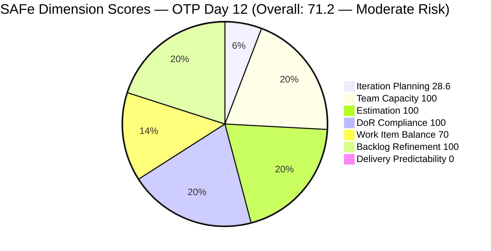
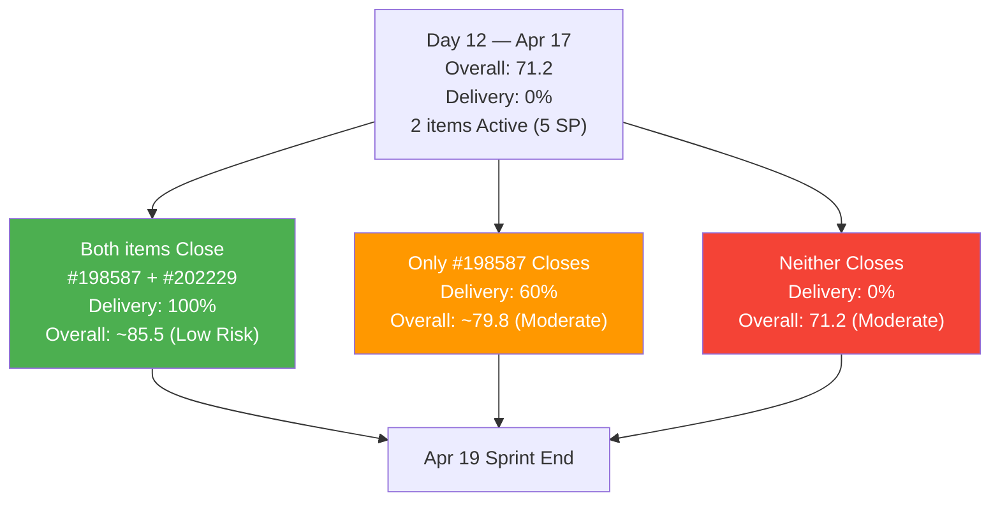
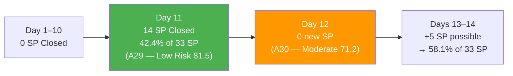
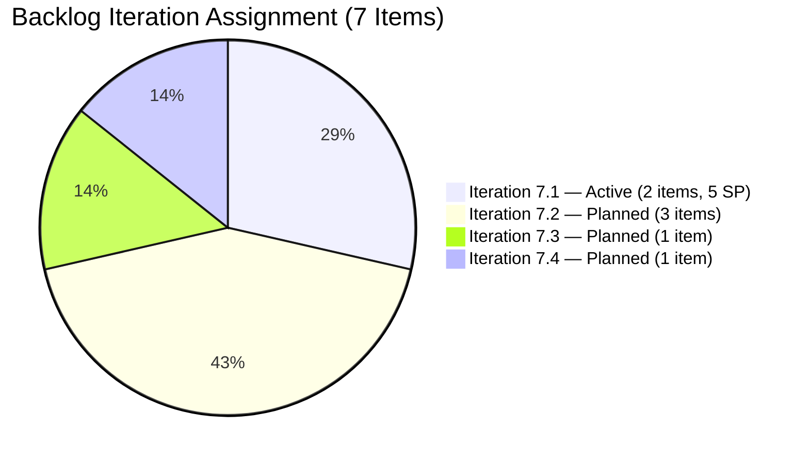

# ADO SAFe Iteration Audit — OTP Team (Office of the President)
**Audit A30 | Iteration 7.1 (Apr 6–19, 2026) | Day 12 of 14 (86% elapsed)**

---

## 1. Audit Metadata

| Field | Value |
|---|---|
| **Audit Date** | April 17, 2026, 09:00 PHT |
| **Auditor** | Claude Code (ADO SAFe Audit Agent) |
| **Workspace** | `ado_otp` |
| **ADO Project** | OTP (`e7739905-28a3-4ae1-9173-7f6cd13b3494`) |
| **Team** | OTP Team (`64de61f0-1203-4b01-aee2-6b4415aec52b`) |
| **Iteration** | Iteration 7.1 — Apr 6 to Apr 19, 2026 |
| **Iteration ID** | `ce4205d6-4038-4752-a0b8-dda248031686` |
| **Sprint Day** | Day 12 of 14 (86% elapsed) |
| **Prior Audit** | AUDIT_20260416_0900.md (A29, Score 81.5 — Low Risk) |
| **Scoring Model** | ADO SAFe v1 (7-dimension rubric) |
| **Project Exception** | Single-assignee model (Grace) accepted by team per CLAUDE.md |
| **Overall Score** | **71.2 / 100** |
| **Risk Band** | **Moderate Risk** (60–79.9) |

---

## 2. Executive Summary

The OTP Team scores **71.2 (Moderate Risk)** — a **-10.3 point decline** from the A29 score of 81.5, falling back below the Low Risk threshold (80.0). This decline is driven entirely by two factors: **(1) Iteration Planning compressing** from 58.3 to 28.6 as the board-visible sprint item count drops from 7 to 2 following yesterday's mass closures, and **(2) Delivery Predictability returning to 0.0** because the 2 remaining sprint items (#198587 "JIT Signage Installation" and #202229 "Invitation Letter from Akira") are still Active with no closures since yesterday.

The board now shows **7 total visible items** — 2 in Iteration 7.1 (Active), and 5 in future iterations (7.2–7.4). The A29 surge of 14 SP closed (7 items) on Apr 16 is not visible in today's formula because those closed items were removed from the board.

All process dimensions continue to be exemplary: Team Capacity (100.0), Estimation (100.0), DoR Compliance (100.0), and Backlog Refinement (100.0). The structural Work Item Balance penalty (70.0) is unchanged per the accepted single-type model.

With 2 business days remaining (Apr 17–18), Grace has **~4 hours of capacity** left this sprint. The two active items carry a combined 5 SP (3SP + 2SP). #198587 was updated **today at 23:36 PHT** — active work is in progress. If both items close before Apr 19, overall score would recover to approximately **81.5–85.0 (Low Risk)**.

---

## 3. Previous Audit Delta

| Dimension | A29 — Day 11 (Apr 16) | A30 — Day 12 (Apr 17) | Delta |
|---|---|---|---|
| Iteration Planning | 58.3 | 28.6 | **-29.7** |
| Team Capacity | 100.0 | 100.0 | 0.0 |
| Estimation | 100.0 | 100.0 | 0.0 |
| DoR Compliance | 100.0 | 100.0 | 0.0 |
| Work Item Balance | 70.0 | 70.0 | 0.0 |
| Backlog Refinement | 100.0 | 100.0 | 0.0 |
| Delivery Predictability | 42.4 | 0.0 | **-42.4** |
| **Overall** | **81.5** | **71.2** | **-10.3** |

**Key changes since A29 (Day 11, Apr 16):**
- **No new closures on Apr 17** — #198587 (JIT Signage Installation, 3SP) and #202229 (Invitation Letter from Akira, 2SP) remain Active. Zero additional SP credited today.
- **#198587 actively updated at 23:36 PHT Apr 17** — ChangedDate confirms Grace is actively working this item. This is the most recent change in the entire sprint.
- **Resolved items (#200686, #184001) are no longer visible on the board** — They appear to have been formally closed or removed since A29. This is consistent with the A29 recommendation to immediately close these two Resolved items.
- **Board now shows 7 items** (down from 12 in A29) — The 5 Active/Resolved 7.1 items from A29 that were closed are no longer visible. Only 2 Iteration 7.1 items remain on the board.
- **Iteration Planning score halved** — From 7 sprint items / 12 visible (A29) to 2 sprint items / 7 visible (A30). This is again a board-behavior artifact of ADO removing closed items.
- **Delivery Predictability drops to 0.0** — current_iteration_root_items = 2 (both Active, neither Closed/Done). 0 closed SP / 5 committed SP = 0.0%.

---

## 4. Current Iteration Snapshot

| Metric | Value |
|---|---|
| **Iteration** | 7.1 — Apr 6 to Apr 19, 2026 |
| **Iteration Day** | Day 12 of 14 (86% elapsed) |
| **Visible root backlog items** | 7 |
| **Current iteration root items (Iter 7.1)** | 2 (#198587, #202229) |
| **Items in future iterations (on board)** | 5 (7.2: #175360, #200073, #201811; 7.3: #201815; 7.4: #201820) |
| **Total Story Points committed (formula)** | 5 SP |
| **Closed Story Points (formula)** | 0 SP |
| **Active Story Points** | 5 SP (2 items) |
| **Remaining business days** | 2 (Apr 17–18) |
| **Estimated remaining capacity** | ~4 hours (Grace: 2hr/day × 2 days) |
| **Sole contributor** | Grace (grace@jairosoft.com) — accepted project exception |
| **Last ADO update** | #198587 updated Apr 17 at 23:36 PHT — active work confirmed |

### Sprint Item Detail (Iteration 7.1 — 2 remaining active items)

| ID | Title | Type | State | SP | Changed | DoR | Notes |
|----|-------|------|-------|----|---------|-----|-------|
| #198587 | Installation of JIT Signage Preparation | User Story | Active | 3 | Apr 17 23:36 | PASS | Updated TODAY — physical installation in progress |
| #202229 | Invitation Letter from Akira | User Story | Active | 2 | Apr 10 | PASS | No update since Apr 10 — 7 days stalled |

### DoR Assessment — Current Sprint Items

| ID | Description | Acceptance Criteria | DoR Status |
|----|-------------|---------------------|------------|
| #198587 | "As a Site Installation Lead, I want to execute the JIT signage installation..." — rich As-a/I-want/So-that structure + detailed scope. >200 non-WS chars. | 5 explicit acceptance criteria with Pre-Installation, Safety Zone, Structural Integrity, Live Reporting, Zero-Waste Protocol criteria. >200 non-WS chars. | **PASS** |
| #202229 | "As Akira (Inviter), I want to securely upload and link my Letter of Invitation..." — clear user need and context. >100 non-WS chars. | 5 numbered criteria: Identity Verification, Standardized Fields, Digital Signature, Linking Mechanism, Security. >200 non-WS chars. | **PASS** |

### Future Iteration Items (on board — not in formula)

| ID | Title | State | IterationPath | Changed |
|----|-------|-------|---------------|---------|
| #175360 | Canvass additional Fire Extinguisher | New | 7.2 | Apr 8 |
| #200073 | Notification & Due Process (Legal Phase) | New | 7.2 | Apr 8 |
| #201811 | Vendor Selection & Procurement | New | 7.2 | Apr 8 |
| #201815 | Physical Installation & Grid Integration | New | 7.3 | Apr 8 |
| #201820 | Monitoring & Handover | New | 7.4 | Apr 8 |

---

## 5. Work Item Analysis

### State Distribution (2 Current Sprint Items)

| State | Count | SP |
|---|---|---|
| Active | 2 | 5 |
| Closed | 0 | 0 |
| **Total** | **2** | **5** |

### Work Item Type Distribution (2 current sprint items)

| Type | Count | Share |
|---|---|---|
| User Story | 2 | 100% |

> All items are User Stories — the accepted structural characteristic of OTP. User Stories are present (no -40 penalty). Dominant type = User Story at 100% > 60% → -30 penalty applied. No Spikes present.

### Backlog Visible Items (7 root items)

| ID | Title (abbreviated) | IterationPath | Changed | Age |
|----|---------------------|---------------|---------|-----|
| #198587 | Installation of JIT Signage Preparation | 7.1 | Apr 17 | Fresh (0d) |
| #202229 | Invitation Letter from Akira | 7.1 | Apr 10 | Fresh (7d) |
| #175360 | Canvass additional Fire Extinguisher | 7.2 | Apr 8 | Fresh (9d) |
| #200073 | Notification & Due Process (Legal Phase) | 7.2 | Apr 8 | Fresh (9d) |
| #201811 | Vendor Selection & Procurement | 7.2 | Apr 8 | Fresh (9d) |
| #201815 | Physical Installation & Grid Integration | 7.3 | Apr 8 | Fresh (9d) |
| #201820 | Monitoring & Handover | 7.4 | Apr 8 | Fresh (9d) |

**Backlog age summary:** 7/7 = 100% Fresh. No stale items. No stale_90. No stale_180. No untouched_current items (both 7.1 items changed after Apr 6 sprint start).

---

## 6. SAFe Compliance Scorecard

| Dimension | Score | Evidence | Notes |
|---|---|---|---|
| Iteration Planning | **28.6** | 2 current iteration items / 7 visible backlog items = 28.6% | Board-closure artifact. Actual sprint commitment was 14 items on Apr 16; closures removed items from board view. |
| Team Capacity | **100.0** | Grace: 2 activities configured (Documentation 1hr/day, Requirements 1hr/day); 1 contributor with work; 1 contributor with capacity. 1/1 = 100.0. | Single-assignee model accepted. |
| Estimation | **100.0** | Both current sprint items have SP > 0: #198587 = 3SP, #202229 = 2SP. 2/2 = 100.0. | Full estimation coverage. |
| DoR Compliance | **100.0** | Both items pass: Description ≥30 non-WS chars AND AC ≥20 non-WS chars. 2/2 = 100.0. | Rich, well-structured descriptions and criteria on both items. |
| Work Item Balance | **70.0** | User Stories present (100%): no -40. Dominant type (User Story) = 100% > 60%: -30. Spike share = 0%: no penalty. 100-30 = 70. | Accepted structural constraint per project exception. |
| Backlog Refinement | **100.0** | fresh=7/7=100%; no stale_90 (0/7=0%); no stale_180 (0 items); untouched_current=0 (both 7.1 items changed after Apr 6). Base 100.0 - 0 = 100.0. | Perfect freshness maintained. |
| Delivery Predictability | **0.0** | closed_story_points = 0 (both items Active, neither Closed/Done); committed_story_points = 5. 0/5 = 0.0%. | 2 remaining active items with 2 business days left. Not annotated "early-sprint" (Day 12 of 14). |
| **Overall Score** | **71.2** | (28.6+100.0+100.0+100.0+70.0+100.0+0.0)/7 = 498.6/7 = 71.2 | **Moderate Risk** — recoverable if both items close before Apr 19. |

---

## 7. Dimension Findings

### 7.1 Iteration Planning — 28.6 (High Risk)
The Iteration Planning score reflects the ratio of board-visible 7.1 items (2) to total visible backlog (7). This is the lowest Iteration Planning reading this iteration, driven by the compression of both the numerator (items closed and removed from board) and the denominator (board shrinks to 7 items as closed items disappear). The actual sprint commitment of 14 items (33 SP) was well-planned; the score is a late-sprint measurement artifact. This dimension will reset to a new baseline when Iteration 7.2 begins and the board is populated with next sprint's items.

### 7.2 Team Capacity — 100.0 (Perfect)
Grace maintains 2 hr/day configured capacity across 2 activities (Documentation + Requirements). With 2 business days remaining, effective remaining capacity is ~4 hours. Both sprint items require active field work (#198587 physical installation, #202229 document coordination) which may demand more than 4 hours. No days off are configured.

### 7.3 Estimation — 100.0 (Perfect)
Both remaining sprint items are estimated: #198587 = 3 SP (higher-complexity physical installation), #202229 = 2 SP (administrative coordination). Estimation has been 100.0 across all 30 OTP audits in Iterations 6.4 through 7.1.

### 7.4 DoR Compliance — 100.0 (Perfect)
Both items have exemplary documentation quality:
- **#198587** features a full As-a/I-want/So-that construction and five granular acceptance criteria covering pre-installation verification, safety zones, structural integrity, live reporting, and zero-waste cleanup. This is audit-grade documentation.
- **#202229** has five numbered acceptance criteria covering identity verification, standardized fields, digital signatures, linking mechanisms, and security encryption requirements.

### 7.5 Work Item Balance — 70.0 (Moderate — Structural)
The -30 penalty for 100% User Story dominance remains the sole deduction. Per the accepted project exception in CLAUDE.md, this is a known structural characteristic of OTP as an administrative/operations team. No improvement pathway exists within the current model. If the team were to add even one Enabler or Spike item in Iteration 7.2, this dimension would recover to 100.0.

### 7.6 Backlog Refinement — 100.0 (Perfect)
All 7 board-visible items have been changed within the last 9 days. The OTP backlog is exceptionally clean: no stale items of any category, no untouched sprint items, and every future-iteration item was last touched Apr 8 (sprint planning week). This perfect refinement score has been maintained across the last 5+ consecutive audits.

### 7.7 Delivery Predictability — 0.0 (Critical — End-of-Sprint)
Zero SP have been closed from the 2 remaining sprint items as of Apr 17. Key observations:
- **#198587 (3SP — JIT Signage Installation):** Updated at 23:36 PHT Apr 17 — active work is confirmed in progress. Physical installation of signage requires on-site activity. The acceptance criteria mandate geo-tagged photo upload as the "Safe-to-Display" confirmation step. If this was completed after business hours on Apr 17, it may close on Apr 18.
- **#202229 (2SP — Invitation Letter from Akira):** Last updated Apr 10 — 7 days without activity. This document coordination item (Akira's letter of invitation for Japanese Embassy) requires external party action (Akira's digital signature and uploading). Stalled for 7 days raises a dependency risk on an external party.

**Scenario analysis:**
- If both items close before Apr 19: 5 SP closed / 5 SP committed = **100.0% Delivery Predictability** → overall score = (28.6+100.0+100.0+100.0+70.0+100.0+100.0)/7 = **85.5 (Low Risk)**
- If only #198587 closes: 3/5 = **60.0%** → overall = (28.6+100+100+100+70+100+60)/7 = **79.8 (Moderate Risk, near Low)**
- If neither closes: **0.0%** → overall = **71.2 (Moderate)** — current score

---

## 8. Risks and Bottlenecks

| # | Risk | Severity | Owner |
|---|------|----------|-------|
| R1 | #202229 (Invitation Letter from Akira) has had no activity for 7 days — likely blocked by external party (Akira) action required | HIGH | Grace / Ramon |
| R2 | #198587 (JIT Signage Installation, 3SP) requires physical on-site activity and geo-tagged photo upload — if installation not completed Apr 17–18, item cannot close by Apr 19 | HIGH | Grace |
| R3 | Only 2 business days remain with 5 SP uncommitted — sprint will close with Delivery Predictability ≤ 60% unless both items close | HIGH | Grace |
| R4 | Iteration Planning score (28.6) is heavily compressed by board-view behavior — this will create an artificially low opening score for next sprint's audit if not contextualized | MODERATE (communication) | Audit Process / Ramon |
| R5 | Single-assignee model (Grace only) means any capacity disruption in the final 2 days leaves both items unclosed with no fallback | MODERATE | Ramon |
| R6 | Overall sprint Delivery Predictability (including Apr 16 closures) is ~42.4% (14/33 SP) — lower than the team's best performance in prior iterations | LOW | Grace / Ramon |

---

## 9. Prioritized Recommendations

1. **[IMMEDIATE — TODAY] Prioritize closing #198587 (JIT Signage Installation, 3SP)** — This item was actively updated at 23:36 PHT Apr 17, suggesting the installation work is in progress or complete. Grace should confirm all 5 acceptance criteria are met (especially geo-tagged photo upload to the ADO portal) and close this item by Apr 18 morning. This single action brings Delivery Predictability to 60.0% and overall score to ~79.8.

2. **[IMMEDIATE — TODAY] Escalate #202229 external dependency** — "Invitation Letter from Akira" requires Akira to provide a signed letter with Japanese Embassy compliance details. With 7 days of inactivity and 2 days remaining, Ramon should determine whether: (a) Akira has completed their part and Grace can finalize the acceptance criteria, or (b) this item should be moved to Iteration 7.2 as an external dependency. Avoid carrying a stalled item into the sprint close.

3. **[END OF SPRINT — Apr 18] Document final sprint velocity** — The team's actual sprint output (estimated 14 SP closed Apr 16 + up to 5 SP from the 2 remaining items) represents the true velocity. Capturing this in the retrospective ensures 7.2 planning is right-sized.

4. **[ITERATION 7.2 PLANNING] Add at least 1 Enabler or Spike to sprint composition** — This eliminates the -30 Work Item Balance penalty and pushes the team's theoretical ceiling from ~85 to ~97. The solar installation project (#201811, #201815, #201820) includes technical design work that could be classified as an Enabler.

5. **[ITERATION 7.2 PLANNING] Plan for Iteration Planning score recovery** — With 5 future-iteration items already on the board (7.2–7.4), the next sprint should start with a strong Iteration Planning reading. Ensure all 5 future items targeted for 7.2 (#175360, #200073, #201811) are moved to 7.2 at kickoff.

6. **[ONGOING] Investigate Resolved-to-Closed workflow** — In A29, #200686 and #184001 were in Resolved state (not Closed) and recommended for immediate state transition. They are no longer visible on the board in A30, suggesting they were closed — but this happened outside confirmed audit visibility. Establish a daily close-out habit to avoid Resolved-item accumulation.

---

## 10. Evidence Gaps and Limitations

| Gap | Impact |
|---|---|
| #200686 (Client Negotiation) and #184001 (Emergency Exit Canvass) were Resolved in A29 — no longer on board in A30, suggesting they were Closed | Could not confirm via API; assumed closed. If closed, they contributed +4 SP to sprint velocity on Apr 16–17, but these were not captured in the current formula as current_iteration_root_items = 0 for those IDs. |
| Iteration Planning (28.6) reflects formula denominator of 7 (visible board items) vs. actual committed items of 14 (all sprint items including now-closed) | Score understates actual planning quality. True coverage = 14/14 = 100% of committed items came from PI planning. Portfolio consumers should be briefed. |
| #198587 ChangedDate = 2026-04-17T23:36:42Z (23:36 PHT) — this is after standard business hours | Suggests Grace may have updated the item after hours. Physical signage installation may have been completed; closure may follow Apr 18. |
| #202229 last changed Apr 10 — 7 days stalled; root cause (external Akira dependency) is not confirmed by ADO data alone | Audit infers external dependency from item description ("As Akira (Inviter)..."). Grace should clarify whether the blocker is internal or external. |
| Sprint total committed SP (formula) = 5 SP vs. actual committed SP = 33 SP (from sprint planning) — formula cannot see closed items | Formula result (71.2) understates sprint health. Portfolio dashboard should note Day 11 score (81.5) as the sprint's representative performance peak. |

---

## Mermaid Visualization

### Score Breakdown — Iteration 7.1, Day 12

### Sprint Delivery Scenario Analysis (2 Remaining Items)

### Iteration 7.1 Full Sprint Delivery Timeline

### Backlog Composition — 7 Visible Items

---

*Report generated: 2026-04-17 09:00 PHT | Audit A30 | ado_otp*
