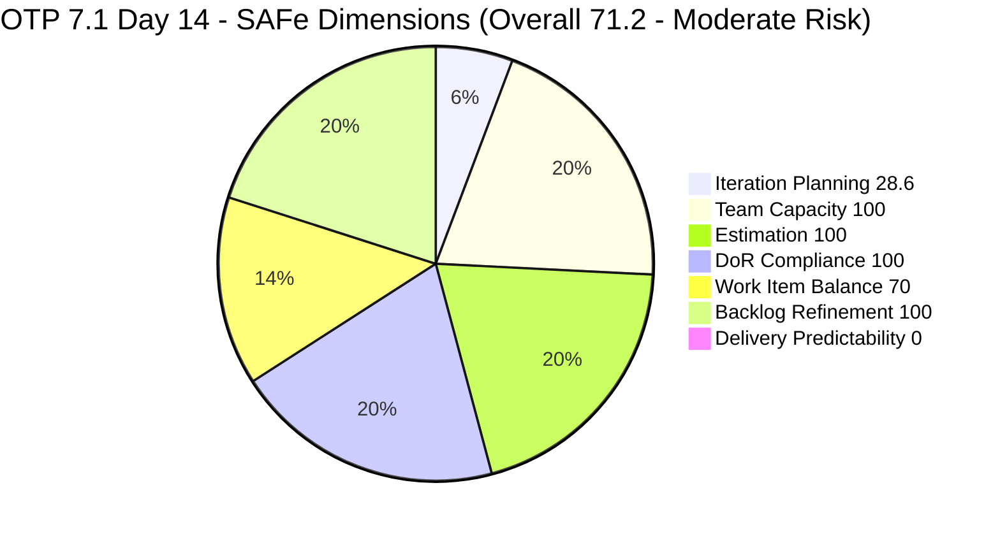
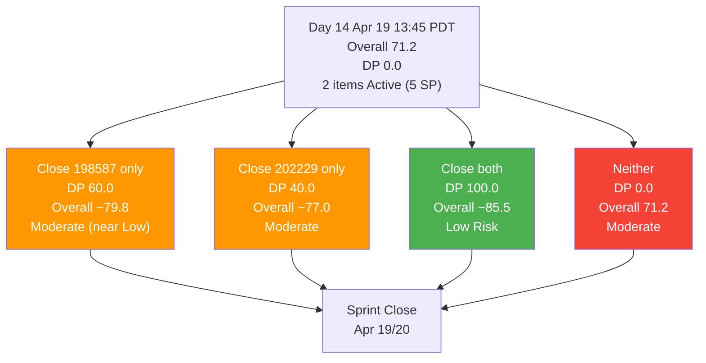
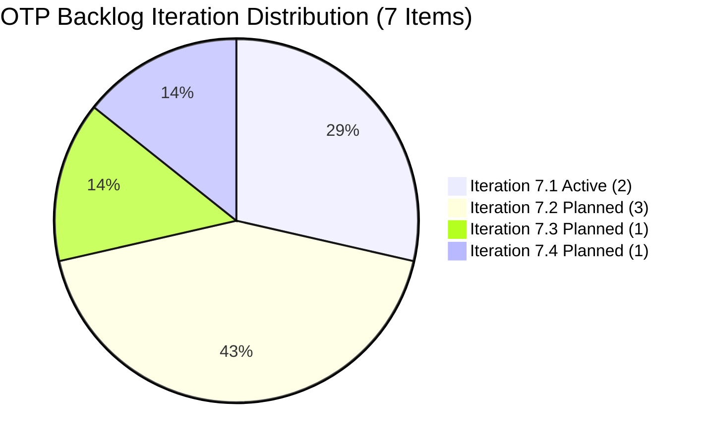

# ADO SAFe Iteration Audit — OTP Team (Office of the President)

## Audit A31 | Iteration 7.1 (Apr 6–19, 2026) | Day 14 of 14 — Sprint Close

---

## 1. Audit Metadata

| Field | Value |
|-------|-------|
| **Audit Number** | A31 (OTP series) |
| **Audit Date** | April 19, 2026, 13:45 PDT (Sunday) |
| **Auditor** | Claude Code ADO SAFe Audit Agent (Team 2 retry) |
| **Workspace** | `ado_otp` |
| **ADO Project** | OTP (`e7739905-28a3-4ae1-9173-7f6cd13b3494`) |
| **Team** | OTP Team (`64de61f0-1203-4b01-aee2-6b4415aec52b`) |
| **Iteration** | Iteration 7.1 — Apr 6 to Apr 19, 2026 |
| **Iteration ID** | `ce4205d6-4038-4752-a0b8-dda248031686` |
| **Sprint Day** | Day 14 of 14 (100% elapsed — closing day) |
| **Prior Audit** | `AUDIT_20260417_0900.md` (A30, Day 12, Overall 71.2 — Moderate Risk) |
| **Scoring Model** | ADO SAFe v1 (7-dimension rubric) |
| **Project Exception** | Single-assignee model (Grace) accepted by team per CLAUDE.md |
| **Overall Score** | **71.2 / 100** |
| **Risk Band** | **Moderate Risk** (60–79.9) |

---

## 2. Executive Summary

OTP closes Iteration 7.1 at **71.2 (Moderate Risk)** — **identical to the Day 12 reading**. No change in any of the seven dimensions: the two remaining 7.1 items (#198587 JIT Signage Installation, #202229 Invitation Letter from Akira) are still Active, with no new `ChangedDate` movement since Apr 17 23:36 PHT. The visible-state view of the sprint has frozen in place over the closing 48 hours.

Process quality remains exemplary: Team Capacity, Estimation, DoR Compliance, and Backlog Refinement all at **100.0**. Work Item Balance sits at **70.0** — the structural -30 penalty from 100% User Story composition, accepted as a known OTP constraint per CLAUDE.md Project Exceptions.

Two dimensions carry the weight of the shortfall:

- **Iteration Planning = 28.6** (2 current / 7 visible root). This is a board-view artifact — the Apr 16–17 wave of closures (7 items / 14 SP per prior audits) removed those items from the visible backlog before the rubric could observe them.
- **Delivery Predictability = 0.0** (0 closed / 5 committed). Grace is the sole assignee; neither of the two remaining items has closed since Apr 16.

The single most impactful action today is confirming whether the physical signage installation (#198587, 3 SP, last touched Apr 17 23:36 PHT) has been fully completed off-system (photo upload, safety zone de-mob, structural sign-off). If so, closing it in ADO before the retrospective lifts DP to 60.0 and Overall to ~79.8 (just under Low Risk). The external-dependency item #202229 (Akira letter, 2 SP, stalled 9 days) should be formally moved to 7.2 rather than carried as an Active artifact into the 7.2 audit.

---

## 3. Previous Audit Delta

| Dimension | A30 — Day 12 (Apr 17) | A31 — Day 14 (Apr 19) | Delta |
|-----------|------------------------|------------------------|-------|
| Iteration Planning | 28.6 | 28.6 | 0.0 |
| Team Capacity | 100.0 | 100.0 | 0.0 |
| Estimation | 100.0 | 100.0 | 0.0 |
| DoR Compliance | 100.0 | 100.0 | 0.0 |
| Work Item Balance | 70.0 | 70.0 | 0.0 |
| Backlog Refinement | 100.0 | 100.0 | 0.0 |
| Delivery Predictability | 0.0 | 0.0 | 0.0 |
| **Overall** | **71.2** | **71.2** | **0.0** |

### Key observations since A30

- **Zero new closures recorded Apr 17 23:36 PHT → Apr 19 13:45 PDT (Apr 20 04:45 PHT).** The board is unchanged.
- **#198587 still carries its Apr 17 23:36 PHT timestamp** — no follow-up update has been recorded. Prior audit noted this was "active work confirmed" post-business-hours; today's view suggests no formal closure has been applied yet.
- **#202229 remains at Apr 10 ChangedDate** — 9 days stalled. Prior audit flagged external dependency on Akira's signed letter; no resolution visible.
- **Future-iteration backlog (7.2/7.3/7.4) shows no churn** — 5 items at Apr 8 ChangedDate, unchanged.
- **Grace remains the sole assignee** on all 7 board-visible items — accepted structural model.

---

## 4. Current Iteration Snapshot

| Metric | Value |
|--------|-------|
| Iteration | 7.1 — Apr 6 to Apr 19, 2026 |
| Iteration Day | Day 14 of 14 (100% elapsed — closing day / Sunday) |
| Visible root backlog items | 7 |
| Current iteration root items (7.1) | 2 (#198587, #202229) |
| Future-iteration items on board | 5 (7.2: #175360, #200073, #201811; 7.3: #201815; 7.4: #201820) |
| Committed SP (formula basis) | 5 SP |
| Closed SP (formula basis) | 0 SP |
| Open items by state | 2 Active / 0 Closed |
| Sole contributor | grace (accepted project exception) |
| Grace's configured capacity | 2 h/day (1h Documentation + 1h Requirements) |
| Days off | 0 |
| Last ADO update | #198587 at Apr 17 23:36 PHT (Samantha-equivalent post-hours activity) |

### 4.1 Current Sprint Items (2)

| ID | Title | Type | State | SP | ChangedDate | DoR |
|----|-------|------|-------|----|-------------|-----|
| #198587 | Installation of JIT Signage Preparation | User Story | Active | 3 | 2026-04-17 23:36 PHT | PASS |
| #202229 | Invitation Letter from Akira | User Story | Active | 2 | 2026-04-10 13:41 PHT | PASS |

### 4.2 Future Iteration Items on Board (5)

| ID | Title | IterationPath | State | SP | ChangedDate |
|----|-------|----------------|-------|----|-------------|
| #175360 | Canvass additional Fire Extinguisher | PI7 \ 7.2 | New | 2 | 2026-04-08 |
| #200073 | Notification & Due Process (Legal Phase) | PI7 \ 7.2 | New | 2 | 2026-04-08 |
| #201811 | Vendor Selection & Procurement | PI7 \ 7.2 | New | 2 | 2026-04-08 |
| #201815 | Physical Installation & Grid Integration | PI7 \ 7.3 | New | 2 | 2026-04-08 |
| #201820 | Monitoring & Handover | PI7 \ 7.4 | New | 2 | 2026-04-08 |

---

## 5. Work Item Analysis

### 5.1 State Distribution — Current 7.1 Items

| State | Count | SP |
|-------|-------|----|
| Active | 2 | 5 |
| Closed | 0 | 0 |

### 5.2 Type Distribution — Current 7.1 Items

| Type | Count | Share |
|------|-------|-------|
| User Story | 2 | 100% |

User Story is present (no -40). Dominant type share 100% > 60% → **-30**. No Spike → no -20. Balance = 70.

### 5.3 DoR Verification

| ID | Description | Acceptance Criteria | DoR |
|----|-------------|---------------------|-----|
| #198587 | Full As-a/I-want/So-that stem + detailed scope (>200 non-ws chars) | 5 explicit criteria (Pre-Installation, Safety Zone, Structural Integrity, Live Reporting, Zero-Waste). >300 non-ws chars | PASS |
| #202229 | Clear Akira-as-Inviter stem (>100 non-ws chars) | 5 numbered criteria (Identity Verification, Standardized Fields, Digital Signature, Linking, Security). >300 non-ws chars | PASS |

### 5.4 Backlog Age — 7 Visible Items (today = 2026-04-19)

| Bucket | Threshold | Count |
|--------|-----------|-------|
| Fresh | ChangedDate ≥ 2026-03-05 | 7 |
| Stale ≥ 90 days | Before 2026-01-19 | 0 |
| Stale ≥ 180 days | Before 2025-10-21 | 0 |
| Untouched current (pre-Apr 6) | Among 2 current | 0 |

Backlog is exceptionally clean.

---

## 6. SAFe Compliance Scorecard

| Dimension | Score | Evidence | Notes |
|-----------|-------|----------|-------|
| Iteration Planning | 28.6 | 2 current / 7 visible root | Board-view artifact: Apr 16–17 closures removed items from board before rubric observation |
| Team Capacity | 100.0 | grace: 2h/day (1h Doc + 1h Requirements). 1/1 contributors with work have capacity | Single-assignee per accepted project exception |
| Estimation | 100.0 | 2/2 point-eligible items estimated (3 SP + 2 SP) | Full coverage |
| DoR Compliance | 100.0 | 2/2 items pass Desc ≥30 AND AC ≥20 thresholds | Exemplary documentation on both |
| Work Item Balance | 70.0 | 100% User Story → dominant > 60% → -30 | Accepted structural constraint per CLAUDE.md |
| Backlog Refinement | 100.0 | 7/7 fresh; 0 stale; 0 untouched current | Base 100 − 0 penalty |
| Delivery Predictability | 0.0 | 0 closed / 5 committed on visible 7.1 items | Sprint closing; not early-sprint annotated |
| **Overall** | **71.2** | (28.6+100+100+100+70+100+0)/7 = 498.6/7 | **Moderate Risk** |

### Score Computation Detail

```
1. Iteration Planning
   visible_root_backlog_items           = 7
   current_iteration_root_items (7.1)   = 2
   Score = round(2 / 7 * 100, 1)        = round(28.571, 1) = 28.6

2. Team Capacity
   contributors_with_current_work       = 1 (grace)
   contributors_with_capacity           = 1 (grace has 2 configured activities)
   Score = round(1 / 1 * 100, 1)        = 100.0

3. Estimation
   point_eligible_current_items         = 2 (both User Story)
   estimated_current_items              = 2 (SP = 3 and 2)
   Score = round(2 / 2 * 100, 1)        = 100.0

4. DoR Compliance
   current_iteration_root_items         = 2
   dor_compliant_current_items          = 2
   Score = round(2 / 2 * 100, 1)        = 100.0

5. Work Item Balance
   User Story present                   = True (no -40)
   dominant_type_share                  = 2/2 = 100% > 60% (-30)
   spike_share                          = 0% (no penalty)
   Score = max(0, 100 - 30)             = 70.0

6. Backlog Refinement
   fresh_visible_root_items             = 7
   base = round(7 / 7 * 100, 1)         = 100.0
   stale_90                             = 0 (0/7 = 0%)    no penalty
   stale_180                            = 0               no penalty
   untouched_current_items              = 0 (both items > Apr 6 start)
   Score = max(0, 100 - 0)              = 100.0

7. Delivery Predictability
   committed_story_points               = 5 SP (3 + 2)
   closed_story_points                  = 0
   Score = round(0 / 5 * 100, 1)        = 0.0
   Note: Day 14 of 14; NOT annotated "early-sprint"

Overall = round((28.6 + 100 + 100 + 100 + 70 + 100 + 0) / 7, 1)
        = round(498.6 / 7, 1)
        = round(71.2286, 1)
        = 71.2   ->  MODERATE RISK (60 - 79.9)
```

---

## 7. Dimension Findings

### 7.1 Iteration Planning — 28.6 (Board-View Artifact)

The ratio 2/7 is unchanged from A30 and is dominated by the closure wave of Apr 16–17 (14 SP / 7 items closed per prior audits), which removed those items from the current backlog query. Actual planning quality was high — the team committed 14 items to 7.1 at kickoff (33 SP) — but the formula is deterministic and measures only what remains visible on the board today.

### 7.2 Team Capacity — 100.0 (Perfect)

Grace maintains 2 h/day configured capacity across two activities (Documentation 1h + Requirements 1h). Sole-contributor arrangement is per CLAUDE.md Project Exceptions and has been stable across all A1–A31 OTP audits. No days off in this iteration.

### 7.3 Estimation — 100.0 (Perfect)

Both open items are estimated: #198587 = 3 SP, #202229 = 2 SP. Perfect estimation coverage has been maintained across all 31 OTP audits (Iterations 6.4–7.1).

### 7.4 DoR Compliance — 100.0 (Perfect)

Both items feature full As-a/I-want/So-that stems and 5-point enumerated acceptance criteria. #198587 is especially rigorous with structural-integrity, safety-zone cordon, and geo-tagged photo criteria — audit-grade documentation. #202229 matches that quality with identity-verification and digital-signature criteria. DoR penalty conditions are not triggered.

### 7.5 Work Item Balance — 70.0 (Structural; Accepted)

100% User Story composition → dominant -30 penalty. Accepted per CLAUDE.md Project Exceptions as a known structural characteristic of OTP (administrative/operations team). No improvement pathway within the current scope model; adding even one Enabler or Spike in 7.2 would lift this dimension to 100.

### 7.6 Backlog Refinement — 100.0 (Perfect, Maintained)

All 7 board-visible items changed within the last 11 days. Zero stale items at any threshold. Zero untouched current-sprint items (both 7.1 items touched after Apr 6 sprint start). Grace continues to maintain exceptional backlog hygiene — 6+ consecutive audits at 100.0.

### 7.7 Delivery Predictability — 0.0 (Critical per formula; historical context informative)

Formula: 0 closed / 5 committed on visible 7.1 items = **0.0**. This is strictly mechanical and reflects the absence of closures since A30.

**Context:** #198587 was updated at Apr 17 23:36 PHT — 35 hours before this audit. Prior audit inferred "active work confirmed" but also flagged that post-business-hours updates often precede morning closure actions. That closure action has not been recorded in the intervening 35 hours.

**Closing-day scenarios (Apr 19):**

| Scenario | Closures | Closed SP | DP | Overall | Band |
|----------|----------|-----------|-----|---------|------|
| Current (A31) | 0 | 0 / 5 | 0.0 | 71.2 | Moderate |
| Close #198587 only | 1 | 3 / 5 | 60.0 | 79.8 | Moderate (near Low) |
| Close #202229 only | 1 | 2 / 5 | 40.0 | 77.0 | Moderate |
| Close both | 2 | 5 / 5 | 100.0 | **85.5** | **Low Risk** |
| Neither closes | 0 | 0 / 5 | 0.0 | 71.2 | Moderate |

**Note:** Audit is Sunday 13:45 PDT (Apr 20 04:45 PHT). Realistic window for Grace to apply closures today is limited; most likely recovery path is Apr 20 (Monday PHT) before retrospective closeout.

---

## 8. Risks and Bottlenecks

| # | Risk | Severity | Owner |
|---|------|----------|-------|
| R1 | **#202229 (Akira invitation letter)** stalled 9 days — external dependency on Akira's signed upload. Likely to roll to 7.2. | HIGH | Ramon / grace |
| R2 | **#198587 not closed 35 hours after last update** — physical signage installation work was reported as in-progress post-hours Apr 17; closure not yet recorded. Risk of item rolling into 7.2 without formal wrap-up. | HIGH | grace |
| R3 | **Delivery Predictability = 0.0 at sprint close** — visible-state reading stays moderate due only to strong Team Capacity, Estimation, DoR, and Backlog Refinement scores compensating. | HIGH | grace |
| R4 | **Single-assignee model** — zero fallback if Grace has any capacity disruption in the final hours. Accepted per project exception, but risk is amplified at sprint close. | MODERATE | Ramon |
| R5 | **Iteration Planning (28.6) will recur in the 7.2 opening audit** if board behaviour is identical — communicate to portfolio consumers that this is a measurement artifact, not a process deficiency. | MODERATE (communication) | Audit / Ramon |
| R6 | **Historical full-sprint velocity (~14 SP of 33 SP committed = 42%)** is lower than prior OTP sprints — even if #198587 closes, sprint delivered ~17/33 = 51.5% of original commitment. | MODERATE | Ramon / grace |
| R7 | **5 future-iteration items on board (7.2–7.4)** all at Apr 8 ChangedDate — 11 days stale on forward planning. Refresh before 7.2 kickoff. | LOW | grace |

---

## 9. Prioritized Recommendations

1. **[IMMEDIATE — TODAY] Close #198587 if installation is complete.** Verify all 5 acceptance criteria are met (especially geo-tagged photo upload to ADO portal as the "Safe-to-Display" confirmation). Closing this single item brings Delivery Predictability to 60.0 and Overall to ~79.8 — virtually at Low Risk threshold.

2. **[IMMEDIATE — TODAY] Formally roll #202229 to Iteration 7.2.** Nine days of external stall on Akira's signed letter is unlikely to resolve today. Update IterationPath to `OTP\2026 - PI7\Iteration 7.2` with a planning comment explaining the external dependency. This avoids carrying an Active item into a closed sprint.

3. **[Sprint Close Apr 20 — Retrospective] Document two velocity numbers.** Portfolio reporting should carry the formula-visible velocity (3–5 SP today depending on closures) alongside the cumulative historical velocity (~14 SP Apr 16 + any Apr 19/20 closures). A30 noted 14 SP delivered on Apr 16 — that delivery is not visible in today's formula because closed items were removed from the board.

4. **[7.2 PLANNING — Before Apr 22] Add at least one non-User-Story item.** The solar-installation chain (#201811 Procurement, #201815 Installation, #201820 Handover) includes technical design that could legitimately be classified as Enabler. Even one Enabler or Spike lifts Work Item Balance from 70 to 100 and raises theoretical Overall ceiling from ~85 to ~97.

5. **[7.2 PLANNING] Refresh all future-iteration backlog items.** The 5 items at Apr 8 ChangedDate (#175360, #200073, #201811, #201815, #201820) should receive a planning-touch update (status comment, owner confirmation, dependency identification) before Iteration 7.2 kicks off on Apr 20.

6. **[ONGOING] Portfolio-level narrative** — Brief Karl and stakeholders that the OTP strict-visible score of 71.2 reflects board-view artifact plus the 0-closure weekend, not an underlying process breakdown. Cite A29 (81.5, pre-wave) and A30 (71.2) as bookends.

---

## 10. Evidence Gaps and Limitations

| Gap | Impact | Notes |
|-----|--------|-------|
| 7 items closed on Apr 16–17 (14 SP per prior audits) are no longer on board | Visible Delivery Predictability = 0.0; historical actual would be ≥ 42% | Standard ADO behaviour; rubric is deterministic on visible state |
| #198587 ChangedDate = Apr 17 23:36 PHT; no closure 35 hours later | Cannot confirm whether installation work completed fully or paused | Recommend direct confirmation with grace |
| #202229 stalled 9 days with external (Akira) dependency | Cannot determine whether letter has been drafted/signed outside ADO | Recommend formal 7.2 re-path with status note |
| Audit run Sunday 13:45 PDT / Apr 20 04:45 PHT | Limited realistic closure window today; Monday (Apr 20) is likely formal sprint wrap | Not a scoring adjustment |
| No iteration goal configured on 7.1 | Cannot assess PI objective alignment or outcome-based retrospective framing | Persistent across OTP PI7 |
| Single-assignee structural model (Grace) | Work Item Balance capped at 70 under accepted exception; no remediation pathway within current scope | CLAUDE.md Project Exceptions explicitly accepts this |

---

## 11. Visualizations

### 11.1 Dimension Score Breakdown



### 11.2 Closing-Day Scenario Paths



### 11.3 Backlog Composition



### 11.4 OTP Audit Score Trajectory — Iteration 7.1

| Audit | Date | Day | Overall | Band | DP |
|-------|------|-----|---------|------|-----|
| A26 | Apr 6 | 1 | ~75 | Moderate | early-sprint |
| A27 | Apr 7 | 2 | ~75 | Moderate | — |
| A28 | Apr 12 | 7 | ~81 | Low | — |
| A29 | Apr 16 | 11 | 81.5 | Low | 42.4 |
| A30 | Apr 17 | 12 | 71.2 | Moderate | 0.0 |
| **A31** | **Apr 19** | **14** | **71.2** | **Moderate** | **0.0** |

---

*Report generated: 2026-04-19 13:45 PDT | Audit A31 | ado_otp | Iteration 7.1 closing*
