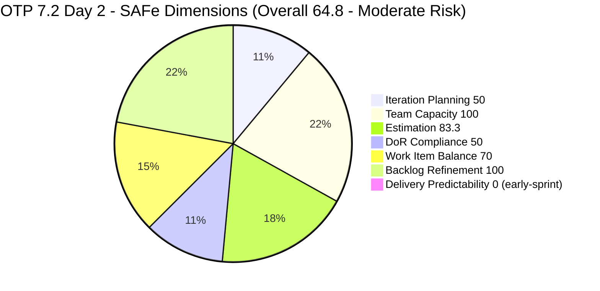
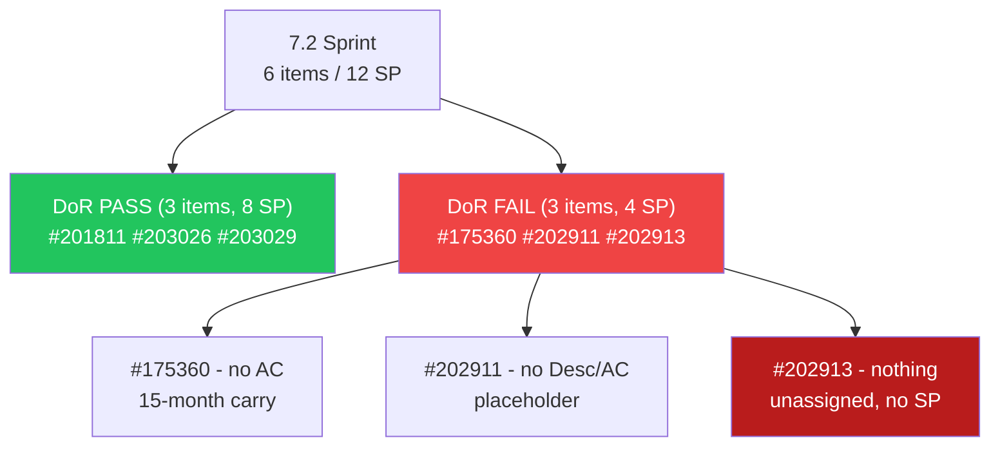
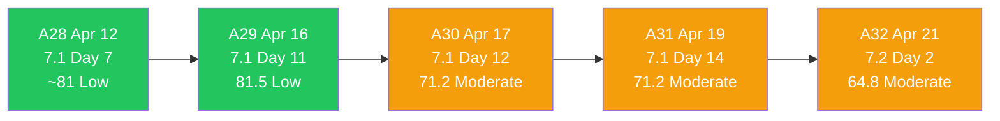
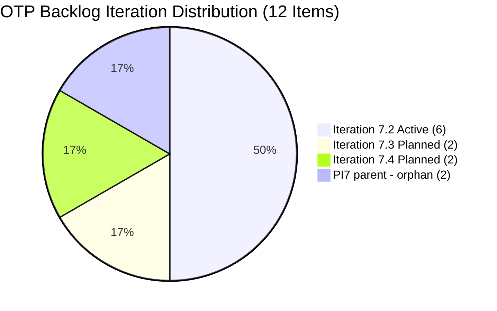

# ADO SAFe Iteration Audit — OTP Team (Office of the President)

## Audit A32 | Iteration 7.2 (Apr 20–May 3, 2026) | Day 2 of 14 — Early Sprint

---

## 1. Audit Metadata

| Field | Value |
|-------|-------|
| **Audit Number** | A32 (OTP series) |
| **Audit Date** | April 21, 2026, 09:30 PDT |
| **Auditor** | Claude Code ADO SAFe Audit Agent (batch team, all-projects) |
| **Workspace** | `ado_otp` |
| **ADO Project** | OTP (`e7739905-28a3-4ae1-9173-7f6cd13b3494`) |
| **Team** | OTP Team (`64de61f0-1203-4b01-aee2-6b4415aec52b`) |
| **Iteration** | Iteration 7.2 — Apr 20 to May 3, 2026 |
| **Iteration ID** | `611496a8-1907-483b-94b9-4e3ee575faf5` |
| **Iteration Path** | `OTP\2026 - PI7\Iteration 7.2` |
| **Sprint Day** | Day 2 of 14 (14% elapsed — early sprint) |
| **Prior Audit** | `AUDIT_20260419_1345.md` (A31, 7.1 close, Overall 71.2 — Moderate) |
| **Scoring Model** | ADO SAFe v1 (7-dimension rubric) |
| **Project Exception** | Single-assignee model (Grace) accepted by team per `ado_otp/CLAUDE.md` |
| **Overall Score** | **64.8 / 100** |
| **Risk Band** | **Moderate Risk** (60–79.9) |

---

## 2. Executive Summary

OTP opens Iteration 7.2 at **64.8 (Moderate Risk)** — **down 6.4 points from the 7.1 closing audit** (A31 = 71.2). This matches the synthesis wiki's flag on OTP as the only team with a genuine negative 7-day slope: the opening of a new sprint surfaces the scope-readiness debt that was masked by four straight "perfect" process dimensions during the previous sprint's close.

**Positive signals first:**

- **7.1 closing is resolved.** Both carry concerns from A31 — #198587 (JIT Signage) and #202229 (Akira Letter) — are now **Closed** (both stamped Apr 20 11:02 PHT). The signage item flagged in the wiki as "the biggest single driver of the slow bleed" is no longer Active. That removes the A31 R2/R3 risks.
- **Grace still has configured capacity** (2 activities totaling 2.5 h/day: 2h Documentation + 0.5h Requirements). Team Capacity holds at 100.
- **Backlog hygiene remains exemplary.** All 12 visible root items touched within the last 13 days; no staleness at any threshold.

**The drag drivers for 7.2 opening:**

- **Estimation dropped to 83.3** (was 100 at 7.1 close). Item #202913 ("Installation of Street Signage", 7.2) was created as a User Story placeholder with no Story Points, no Description, no AC, and **no assignee** — the first unassigned item in OTP history, which is a direct break of the team's accepted single-assignee model.
- **DoR Compliance dropped to 50.0** (was 100 at 7.1 close). 3 of 6 sprint items are placeholder-state: #175360 (has Desc but no AC field), #202911 ("FTC Purchasing of signage material" — no Desc, no AC), #202913 (nothing at all). These were added to the iteration without refinement.
- **Iteration Planning rose to 50.0** (up from 28.6) — mechanical gain from a cleaner board carry-over, but still depressed by 2 items (#203016, #203020) left at the PI7 parent path with no sub-iteration.
- **Grace is on days-off Apr 21–22** per the capacity record (2 days). This is Day 2 of the sprint with the sole assignee out for the first two days — every commitment hinges on Days 3–14.

Overall score is a mechanical opening-day reading; the path to Moderate-clean or Low Risk by Day 5–7 is to fix the three unrefined items and assign a sub-iteration to the two PI7-parent stories.

---

## 3. Previous Audit Delta

| Dimension | A31 — 7.1 Day 14 (Apr 19) | A32 — 7.2 Day 2 (Apr 21) | Delta |
|-----------|------------------------|------------------------|-------|
| Iteration Planning | 28.6 | 50.0 | **+21.4** |
| Team Capacity | 100.0 | 100.0 | 0.0 |
| Estimation | 100.0 | 83.3 | **-16.7** |
| DoR Compliance | 100.0 | 50.0 | **-50.0** |
| Work Item Balance | 70.0 | 70.0 | 0.0 |
| Backlog Refinement | 100.0 | 100.0 | 0.0 |
| Delivery Predictability | 0.0 | 0.0 (early-sprint) | 0.0 |
| **Overall** | **71.2** | **64.8** | **-6.4** |

### Key changes since A31

- **#198587 JIT Signage — CLOSED** (ChangedDate 2026-04-20 11:02 PHT). 3 SP credited to 7.1 retroactively.
- **#202229 Akira Letter — CLOSED** (ChangedDate 2026-04-20 11:02 PHT). 2 SP credited to 7.1.
- **#202911, #202912, #202913** — 3 new signage-chain follow-on stories created Apr 19 22:55–22:56 PHT. 2 landed in 7.2 (#202911, #202913), one in 7.3 (#202912). #202913 has no assignee, no description, no AC, no SP.
- **#203016, #203020** — 2 new GIS-compliance stories created Apr 20 15:10 & 15:26 PHT at PI7 parent path (no sub-iteration). Both are fully refined (Desc + AC + SP=3 each) but orphaned at the iteration level.
- **#203026, #203029** — 2 new stories (Articles/Bylaws amendment, Documentation) created Apr 20 and placed in Iter 7.2. Both are refined (Desc + AC + SP).
- **#200073** — the 7.2 "Notification & Due Process" story moved out to Iter **7.4** (was 7.2 in A31). Its SP=2 is no longer on the current iteration.
- **Grace's capacity configuration changed:** 2h/day Documentation + 0.5h/day Requirements = 2.5 h/day (was 2 h/day in A30/A31); and **2 days off configured for Apr 21–22**.
- **#202913 has no assignee** — first unassigned item in OTP audit history. Breaks the accepted single-assignee model.

---

## 4. Current Iteration Snapshot

| Metric | Value |
|--------|-------|
| Iteration | 7.2 — Apr 20 to May 3, 2026 |
| Iteration Day | Day 2 of 14 (14% elapsed — early sprint) |
| Visible root backlog items | 12 |
| Current iteration root items (7.2) | 6 |
| Committed SP (formula basis) | 12 SP |
| Closed SP (formula basis) | 0 SP |
| State mix | 6 New / 0 Active / 0 Closed |
| Contributors with current work | 1 (grace) + 1 unassigned (#202913) |
| Grace's configured capacity | 2.5 h/day (2h Doc + 0.5h Req) |
| Grace's days off in 7.2 | **2 (Apr 21 + Apr 22)** |
| Today's ADO update | #175360 and #202913 touched 2026-04-20; #202912 at 2026-04-20 21:52 PHT |

### 4.1 Current Sprint Items (6)

| ID | Title | Type | State | SP | Assignee | DoR |
|----|-------|------|-------|----|----------|-----|
| #175360 | Canvass additional Fire Extinguisher for Pad Davao | User Story | New | 2 | grace | **FAIL (no AC)** |
| #201811 | 2. Vendor Selection & Procurement | User Story | New | 2 | grace | PASS |
| #202911 | FTC Purchasing of signage material | User Story | New | 2 | grace | **FAIL (no Desc, no AC)** |
| #202913 | Installation of Street Signage | User Story | New | — | **unassigned** | **FAIL (no Desc, no AC, no SP)** |
| #203026 | Amend Articles and Bylaws to include TechVoc AC | User Story | New | 2 | grace | PASS |
| #203029 | Documentation | User Story | New | 4 | grace | PASS |

### 4.2 Non-current items on board (6)

| ID | Title | IterationPath | State | SP |
|----|-------|----------------|-------|----|
| #201815 | Physical Installation & Grid Integration | 7.3 | New | 2 |
| #202912 | Fabrication of Signage | 7.3 | New | — |
| #200073 | Notification & Due Process (Legal Phase) | 7.4 | New | 2 |
| #201820 | Monitoring & Handover | 7.4 | New | 2 |
| #203016 | Generate and Validate GIS 2026 Report for eFAST Submission | **PI7 parent** | New | 3 |
| #203020 | Generate and Validate GIS 2026 Report (duplicate) | **PI7 parent** | New | 3 |

**Note on duplicates:** #203016 and #203020 have **identical titles and near-identical content**. Likely #203020 is an accidental duplicate of #203016. Recommend deleting one before sub-iteration assignment.

---

## 5. Work Item Analysis

### 5.1 State Distribution — Current 7.2 Items

| State | Count | SP |
|-------|-------|----|
| New | 6 | 12 |

### 5.2 Type Distribution — Current 7.2 Items

| Type | Count | Share |
|------|-------|-------|
| User Story | 6 | 100% |

User Story is present (no -40). Dominant type share 100% > 60% → **-30**. No Spike → no -20. Balance = 70.

### 5.3 DoR Verification

| ID | Description chars (non-ws) | AC chars (non-ws) | DoR |
|----|-----------------------------|-------------------|-----|
| #175360 | ~75 (short Marilyn canvass line) | 0 (no AC field) | **FAIL** |
| #201811 | ~180 (As-a/I-want/So-that) | ~190 (3 bullets) | PASS |
| #202911 | 0 | 0 | **FAIL** |
| #202913 | 0 | 0 | **FAIL** |
| #203026 | ~380 (full As-a stem) | ~460 (4 criteria) | PASS |
| #203029 | ~260 (Program Manager stem) | ~150 (5 criteria) | PASS |

### 5.4 Backlog Age — 12 Visible Items (today = 2026-04-21)

| Bucket | Threshold | Count |
|--------|-----------|-------|
| Fresh | ChangedDate ≥ 2026-03-07 | 12 |
| Stale ≥ 90 days | Before 2026-01-21 | 0 |
| Stale ≥ 180 days | Before 2025-10-24 | 0 |
| Untouched current (before Apr 20 start) | Among 6 current | 0 |

Every current sprint item has a ChangedDate on or after Apr 20. Backlog hygiene = 100 base, no penalties.

---

## 6. SAFe Compliance Scorecard

| Dimension | Score | Evidence | Notes |
|-----------|-------|----------|-------|
| Iteration Planning | 50.0 | 6 current / 12 visible root | +21.4 vs A31; still pulled down by 2 orphan PI7-parent items and 4 planned 7.3/7.4 items |
| Team Capacity | 100.0 | grace: 2.5 h/day (2 activities configured) | Single-assignee per exception; 1/1 with capacity |
| Estimation | 83.3 | 5/6 point-eligible items estimated | #202913 unestimated (also unassigned) |
| DoR Compliance | 50.0 | 3/6 items pass Desc ≥30 AND AC ≥20 | 3 placeholders with missing Desc/AC |
| Work Item Balance | 70.0 | 100% User Story — dominant > 60% → -30 | Accepted structural per project exception |
| Backlog Refinement | 100.0 | 12/12 fresh; 0 stale; 0 untouched current | Base 100 − 0 penalty |
| Delivery Predictability | 0.0 | 0 closed / 12 committed | **Early-sprint — low delivery expected** (Day 2 of 14) |
| **Overall** | **64.8** | (50.0+100+83.3+50+70+100+0)/7 = 453.3/7 | **Moderate Risk** |

### Score Computation Detail

```
1. Iteration Planning
   visible_root_backlog_items           = 12
   current_iteration_root_items (7.2)   = 6
   Score = round(6 / 12 * 100, 1)       = 50.0

2. Team Capacity
   contributors_with_current_work       = 1 (grace; #202913 unassigned excluded)
   contributors_with_capacity           = 1 (grace has 2 configured activities)
   Score = round(1 / 1 * 100, 1)        = 100.0

3. Estimation
   point_eligible_current_items         = 6 (all User Story)
   estimated_current_items              = 5 (175360=2, 201811=2, 202911=2, 203026=2, 203029=4)
   Score = round(5 / 6 * 100, 1)        = 83.3

4. DoR Compliance
   current_iteration_root_items         = 6
   dor_compliant_current_items          = 3 (201811, 203026, 203029)
   Score = round(3 / 6 * 100, 1)        = 50.0

5. Work Item Balance
   User Story present                   = True (no -40)
   dominant_type_share                  = 6/6 = 100% > 60% (-30)
   spike_share                          = 0% (no penalty)
   Score = max(0, 100 - 30)             = 70.0

6. Backlog Refinement
   fresh_visible_root_items             = 12
   base = round(12 / 12 * 100, 1)       = 100.0
   stale_90 = 0/12 = 0%                 no penalty
   stale_180 = 0                        no penalty
   untouched_current_items = 0/6 = 0%   no penalty
   Score = max(0, 100 - 0)              = 100.0

7. Delivery Predictability
   committed_story_points               = 12 SP (2+2+2+0+2+4)
   closed_story_points                  = 0
   Score = round(0 / 12 * 100, 1)       = 0.0
   Annotation: early-sprint (Day 2 of 14) — low delivery expected

Overall = round((50 + 100 + 83.3 + 50 + 70 + 100 + 0) / 7, 1)
        = round(453.3 / 7, 1)
        = round(64.757, 1)
        = 64.8   ->  MODERATE RISK (60 - 79.9)
```

---

## 7. Dimension Findings

### 7.1 Iteration Planning — 50.0 (+21.4; mechanical gain, still depressed by orphans)

The ratio 6/12 is the cleanest the board has looked since the mid-7.1 close wave. The two drags are:

- **2 orphan items at PI7 parent path** (#203016, #203020 — both GIS 2026 Report; likely a duplicate pair). Assigning them to 7.2 or 7.3 would lift Iteration Planning to 66.7 (+2.4 overall) while deleting one of them also cleans up the backlog count.
- **4 items planned for 7.3/7.4** (#201815, #200073, #201820, #202912) — healthy forward planning, but structurally counted against the current iteration ratio.

### 7.2 Team Capacity — 100.0 (Preserved)

Grace's capacity configuration for 7.2 is in place: 2h/day Documentation + 0.5h/day Requirements = 2.5 h/day total. Two days off configured for Apr 21–22 (the first two days of the sprint).

**Risk:** #202913 has no assignee. Per the skill rule, it does not enter `contributors_with_current_work`, so the dimension math is clean — but operationally, that work item has no owner in a team that operates on a single-assignee model.

### 7.3 Estimation — 83.3 (-16.7)

#202913 is the only unestimated item. It was created as a placeholder late on Apr 19 (22:56 PHT) to continue the signage-preparation chain (#175360 → #202911 → #202913) that runs across 7.2. Two straightforward fixes:

- Size #202913 (historical signage installation stories are 2–3 SP)
- Or roll it to 7.3 alongside #202912 (Fabrication) and refine before 7.3 kickoff

### 7.4 DoR Compliance — 50.0 (-50; largest single-dimension drag)

Three of six sprint items fail DoR:

- **#175360** "Canvass additional Fire Extinguisher for Pad Davao" — has a minimal Description ("Marilyn to canvass the required fire extinguisher based on the inspection") but **no Acceptance Criteria field at all**. This is a carry-from-January item that was added to the sprint without ever being refined.
- **#202911** "FTC Purchasing of signage material" — placeholder title only; no Desc, no AC, but has SP=2. Created Apr 19 22:55 PHT, 5 minutes before sprint kickoff.
- **#202913** "Installation of Street Signage" — title only; no Desc, no AC, no SP, no assignee.

Writing up DoR content for these three (~15 minutes each) would lift DoR to 100.0 and Overall to 71.9.

### 7.5 Work Item Balance — 70.0 (Structural; Accepted)

100% User Story composition → dominant -30 penalty. Accepted per `ado_otp/CLAUDE.md` Project Exceptions as a known structural characteristic of OTP (administrative/operations team). No improvement pathway within the current scope model; adding one Enabler or Spike in 7.2 would lift this dimension to 100.

### 7.6 Backlog Refinement — 100.0 (Preserved, 7+ consecutive audits at ceiling)

All 12 items touched within the last 13 days. No stale items at any threshold. Every current-sprint item has a Day 1 or Day 2 ChangedDate, meaning the sprint was actively groomed at the threshold.

### 7.7 Delivery Predictability — 0.0 (Early-sprint, low delivery expected)

Formula: 0 closed / 12 committed = **0.0**. **Day 2 of 14 annotates this as early-sprint**; no adjustment to score but the finding is informational.

**Compounding risk:** Grace's 2-day off window falls on Days 1–2 of the sprint (Apr 21–22). Realistic work days for Grace: 12 of the 14-day sprint. Effective capacity window = 12 × 2.5 h = 30 hours for 12 SP of commitment — feasible if DoR debt clears early.

---

## 8. Risks and Bottlenecks

| # | Risk | Severity | Owner |
|---|------|----------|-------|
| R1 | **DoR debt on 3 of 6 sprint items (#175360, #202911, #202913)** — items committed to 7.2 without Desc/AC content. | **CRITICAL** | grace / Ramon |
| R2 | **#202913 has no assignee** — first OTP item ever outside the single-assignee model. Work has no owner. | **HIGH** | Ramon |
| R3 | **Grace on days-off Apr 21–22** (Days 1–2 of sprint). 12 SP committed against 30h effective window. | **HIGH** | Ramon |
| R4 | **#203016 and #203020 appear to be duplicates** (identical title; near-identical Desc/AC). Inflates backlog count. | **MODERATE** | grace |
| R5 | **2 items at PI7 parent path (no sub-iteration)** — #203016, #203020 committed to PI but orphaned at sprint level. | **MODERATE** | grace / Ramon |
| R6 | **#175360 carries from Jan 13, 2025** — this item has been in the backlog 15+ months and was pulled into 7.2 without AC refinement. | **MODERATE** | grace |
| R7 | **Single-assignee model still in force for Grace's 5 items** — zero fallback during Apr 21–22 off-window. Accepted per exception. | **MODERATE** | Ramon |
| R8 | **Work Item Balance capped at 70** — no Enabler/Spike in 7.2 despite solar-install chain being technically enabler-shaped (#201811 Procurement, #201815 Installation). | LOW (structural) | Ramon |

---

## 9. Prioritized Recommendations

### P0 — Today (Apr 21) or first thing Apr 23 when grace returns

1. **Assign #202913.** Either to grace (continuing single-assignee model) or formally designate a second assignee in 7.2 and document as a project-exception update in `ado_otp/CLAUDE.md`.
2. **Write Description + AC for #202911 and #202913.** Both are part of the signage-chain follow-on; use #198587's (just-closed) high-quality AC as the template (5 criteria: pre-install verification, safety zone, structural integrity, live reporting, zero-waste).
3. **Add Acceptance Criteria to #175360.** Minimum: vendor canvass list, delivery timeline, unit cost ceiling, inspection-pass confirmation.

### P1 — Before Day 5 (Apr 24)

1. **Delete #203020 (the duplicate of #203016)** or merge their comments/history. Confirm with grace before deletion.
2. **Move #203016 to a sub-iteration** (likely 7.2 given its fully-refined state and 3 SP size). This would lift Iteration Planning to 58.3.
3. **Size #202913** (2 or 3 SP) before Day 5 re-audit.

### P2 — Sprint review / PI-level

1. **Document duplicate-creation incident.** Two identical GIS 2026 stories created within 16 minutes of each other (15:10 and 15:26 PHT) suggests a UI or process issue — capture in retrospective.
2. **Consider classifying the solar-installation chain as Enabler work.** #201811 (Vendor Selection & Procurement) and #201815 (Physical Installation) are technical-infrastructure shaped and could legitimately carry the Enabler type, lifting Work Item Balance from 70 to 100 on sprints that include them.
3. **Re-grade the 7.2 sprint goal.** Current 12 SP commitment against 30 effective hours is tight given DoR debt; consider de-scoping #202911 or #202913 if they cannot be refined by Day 4.

---

## 10. Evidence Gaps and Limitations

| Gap | Impact | Notes |
|-----|--------|-------|
| **#202913 has no assignee, no Desc, no AC, no SP** | 4 dimensions affected (Est, DoR, TC attribution, governance) | Direct policy break; recommended P0 #1–2 |
| **#203016 and #203020 titles identical** | Backlog count inflated; likely duplicate | P1 #1 |
| **No formal iteration goal configured on 7.2** | Cannot assess PI objective alignment | Persistent across all PI7 OTP iterations |
| **#175360 carries from Jan 13, 2025** | ADO revision history shows only 9 revisions over 15 months; likely low-priority roll-over | Add AC before committing work |
| **Closed 7.1 items (#198587, #202229) no longer on board** | Prior-sprint velocity not visible in current formula | Expected ADO behavior; noted in delta table |
| **Grace's 2-day off starts on sprint Day 1** | Reduces effective sprint window to 12 days | Configured in capacity record; not a scoring adjustment |
| **Single-assignee model exception in CLAUDE.md** | WIB capped at 70 structurally | Accepted per project exception |

---

## 11. Visualizations

### 11.1 Dimension Score Breakdown



### 11.2 DoR Debt — Current Sprint Items



### 11.3 Score Trajectory — Recent OTP Audits



### 11.4 Backlog Iteration Distribution



---

*Report generated: 2026-04-21 09:30 PDT | Audit A32 | ado_otp | Iteration 7.2 Day 2 (early sprint)*
