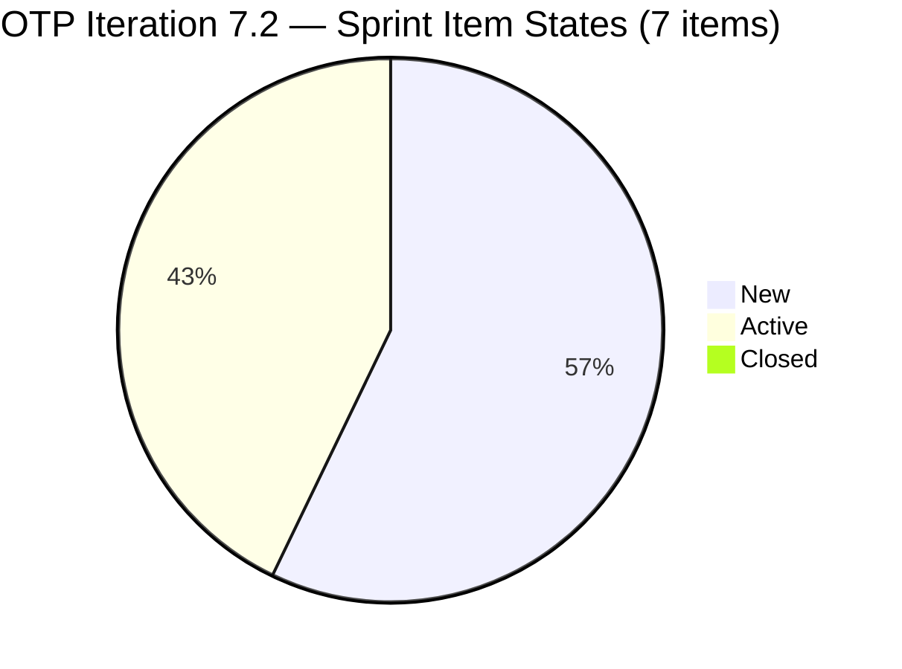
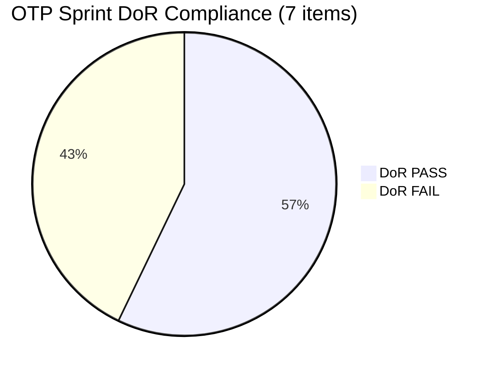

# ADO SAFe Iteration Audit — OTP Team (Office of the President)

## Audit A35 | Iteration 7.2 (Apr 20 – May 3, 2026) | Day 3 of 14 — Early Sprint

---

## 1. Audit Metadata

| Field | Value |
|-------|-------|
| **Audit Number** | A35 (OTP series) |
| **Audit Date** | April 22, 2026, 06:44 UTC / 14:44 PHT |
| **Auditor** | Claude Code ADO SAFe Audit Agent |
| **Workspace** | `ado_otp` |
| **ADO Project** | OTP (`e7739905-28a3-4ae1-9173-7f6cd13b3494`) |
| **Team** | OTP Team |
| **Iteration** | Iteration 7.2 — Apr 20 to May 3, 2026 |
| **Iteration Path** | `OTP\2026 - PI7\Iteration 7.2` |
| **Sprint Day** | Day 3 of 14 (~21% elapsed — early sprint) |
| **Prior Audit** | `AUDIT_20260422_1800.md` (A34, 7.2 Day 3 PM, Overall 63.3 — Moderate Risk) |
| **Scoring Model** | ADO SAFe v1 (7-dimension rubric) |
| **Project Exception** | Single-assignee model (Grace) accepted by team per `ado_otp/CLAUDE.md` |
| **Overall Score** | **65.2 / 100** |
| **Risk Band** | **Moderate Risk** (60–79.9) |
| **Data Source** | Live ADO read Apr 22, 2026 06:44 UTC |

---

## 2. Executive Summary

A35 is a morning audit on Day 3 of Iteration 7.2, capturing the state of the OTP board after Grace's return-day activity yesterday and overnight changes. The overall score is **65.2 — Moderate Risk**, up +1.9 from A34 (63.3). The improvement is driven by a single meaningful addition: **#203249 "AI Integration & Competency Mapping"** — a fully DoR-compliant User Story (SP=2, Description ✓, AC ✓) added to Iteration 7.2 since the prior audit. This expands both the committed pool and the DoR-compliant count.

**Board state at audit time (Day 3):**

- **7 items** in strict `Iteration 7.2` path (up from 6 in A34)
- **3 items Active** (#203026, #203029, and the overflow #203020 at parent PI7 path — not counted in strict rubric)
- **0 items Closed** — early sprint; no Delivery Predictability credit yet
- **4 items DoR-compliant** out of 7 (57.1%) — still impaired by #175360, #202911, #202913
- **#202913** remains without Description, Acceptance Criteria, or Story Points (despite assignee being fixed yesterday)
- **#201811** ("Vendor Selection & Procurement") last changed Apr 8 — 12 days before iteration start — continues to trigger untouched penalty

**Score movement vs A34:**

The +1.9 gain comes from the denominator shift caused by adding #203249:
- Iteration Planning: 53.8 (up from 50.0) — 7/13 vs 6/12
- Estimation: 85.7 (up from 83.3) — 6/7 vs 5/6
- DoR Compliance: 57.1 (up from 50.0) — 4/7 vs 3/6
- Backlog Refinement: unchanged at 90.0 (untouched penalty from #201811 persists)

**Priority actions to exit Moderate Risk (target 71+):**

1. **Resolve #175360, #202911, #202913 DoR gaps.** Adding Description and AC to all three pushes DoR from 57.1 → 100.0, gaining +6 on Overall (+3.0 to score).
2. **Add SP to #202913.** Pushes Estimation to 100.0, gaining +2.1 on Overall.
3. **Touch #201811.** Any update removes the untouched-current penalty, pushing Backlog Refinement 90→100, gaining +1.4 on Overall.
4. **Close at least 1–2 SP** to begin Delivery Predictability accumulation (0 → 14.3 = +2.0).

Full remediation of all four actions above would move the score to approximately **73.8**.

---

## 3. Previous Audit Delta

| Dimension | A34 — 7.2 Day 3 PM (Apr 22 18:00 PHT) | A35 — 7.2 Day 3 AM (Apr 22 06:44 UTC) | Delta | Driver |
|-----------|----------------------------------------|----------------------------------------|-------|--------|
| Iteration Planning | 50.0 | **53.8** | **+3.8** | #203249 added → 7/13 |
| Team Capacity | 100.0 | **100.0** | 0.0 | Grace capacity unchanged |
| Estimation | 83.3 | **85.7** | **+2.4** | 6/7 vs 5/6 |
| DoR Compliance | 50.0 | **57.1** | **+7.1** | #203249 compliant; 4/7 |
| Work Item Balance | 70.0 | **70.0** | 0.0 | 100% User Story; structural |
| Backlog Refinement | 90.0 | **90.0** | 0.0 | #201811 still untouched |
| Delivery Predictability | 0.0 | **0.0** | 0.0 | Early-sprint, 0 Closed |
| **Overall** | **63.3** | **65.2** | **+1.9** | Net from #203249 addition |

### Key changes since A34 (Apr 22 18:00 PHT → Apr 22 06:44 UTC):

1. **#203249 "AI Integration & Competency Mapping" added to Iteration 7.2** — User Story, SP=2, assigned to Grace, ChangedDate Apr 23 05:23 UTC. Fully DoR-compliant (Desc + AC present, both exceed thresholds). This is the first new OTP commitment since sprint start.
2. **No state transitions** — #203026 and #203029 remain Active. No items moved to Closed.
3. **#202913 content gaps persist** — Still no Description, AC, or Story Points despite assignee fix.
4. **#201811 remains untouched** since Apr 8 (12 days before iteration start).

---

## 4. Current Iteration Snapshot

### Iteration Overview

| Metric | Value |
|--------|-------|
| Iteration | 7.2 — Apr 20 to May 3, 2026 (14 days) |
| Iteration Day | Day 3 of 14 |
| Visible root backlog items | 13 |
| Current iteration root items (strict `Iteration 7.2` path) | 7 |
| Committed SP (strict 7.2) | 14 SP (#175360=2, #201811=2, #202911=2, #203026=2, #203029=4, #203249=2; #202913=0) |
| Active SP | 6 SP (#203026=2, #203029=4) |
| Closed SP | 0 |
| State mix | 4 New / 3 Active / 0 Closed |
| Contributors with current work | 1 (Grace) |
| Grace's configured capacity | 2.5 h/day (2h Documentation + 0.5h Requirements) |
| Sprint days remaining | ~11 (Days 4–14) |
| Effective remaining capacity | ~27.5 h |

### 4.1 Current Sprint Items (7 — strict Iteration 7.2 path)

| ID | Title | Type | State | SP | DoR | ChangedDate (UTC) | Note |
|----|-------|------|-------|----|-----|-------------------|------|
| #175360 | Canvass additional Fire Extinguisher for Pad Davao | User Story | New | 2 | **FAIL (no AC)** | 2026-04-20 21:53 | |
| #201811 | 2. Vendor Selection & Procurement | User Story | New | 2 | PASS | **2026-04-08 15:35** | ⚠ Untouched — 12d pre-sprint |
| #202911 | FTC Purchasing of signage material | User Story | New | 2 | **FAIL (no Desc, no AC)** | 2026-04-20 15:54 | |
| #202913 | Installation of Street Signage | User Story | New | — | **FAIL (no Desc, no AC, no SP)** | 2026-04-20 15:50 | Assigned to Grace (A34 fix) |
| #203026 | Amend Articles and Bylaws to include TechVoc AC | User Story | **Active** | 2 | PASS | 2026-04-23 03:29 | In-flight ✓ |
| #203029 | Documentation | User Story | **Active** | 4 | PASS | 2026-04-23 03:30 | In-flight ✓ |
| #203249 | AI Integration & Competency Mapping | User Story | New | 2 | **PASS** | 2026-04-23 05:23 | NEW since A34 |

### 4.2 Overflow Item (not in strict 7.2 path — informational only)

| ID | Title | State | SP | IterationPath |
|----|-------|-------|----|---------------|
| #203020 | Generate and Validate GIS 2026 Report for eFAST Submission | Active | 3 | `OTP\2026 - PI7` (parent — not 7.2 exact) |

> #203020 is operationally in-flight but excluded from rubric calculations due to path mismatch.

---

## 5. Work Item Analysis

### 5.1 Backlog Composition

| Cohort | Count | Notes |
|--------|-------|-------|
| Strict Iteration 7.2 | 7 | Audit scope |
| Parent PI7 path (no sub-iter) | 3 | #203020, #203016 (duplicate of #203020), #203019 (Feature parent) |
| Iteration 7.1 (PI7) | 1 | #202912 (Fabrication of Signage, New) |
| Iteration 7.3–7.5 | 2 | #200073 (7.4), #200076 (7.5) |
| Closed in prior iterations | 8+ | #184001, #195285, #198587, #199522, #200681, #200686, #201807, #202229 |

### 5.2 DoR Analysis

| Item | Desc ≥30 chars | AC ≥20 chars | Result |
|------|---------------|--------------|--------|
| #175360 | ✓ (~55 chars) | ✗ (missing) | **FAIL** |
| #201811 | ✓ | ✓ | PASS |
| #202911 | ✗ (missing) | ✗ (missing) | **FAIL** |
| #202913 | ✗ (missing) | ✗ (missing) | **FAIL** |
| #203026 | ✓ | ✓ | PASS |
| #203029 | ✓ | ✓ | PASS |
| #203249 | ✓ | ✓ | PASS |

DoR-compliant: 4/7 = 57.1%

### 5.3 Stale Backlog Tracking

| Cohort | Count | Status |
|--------|-------|--------|
| Fresh (≤45 days, ≥ Mar 8) | 13/13 | All items recently touched |
| Stale >90 days | 0 | No penalty |
| Stale >180 days | 0 | No penalty |
| Untouched current (ChangedDate < Apr 20) | 1 (#201811) | −10 Backlog Refinement penalty |

---

## 6. SAFe Compliance Scorecard

| Dimension | Score | Evidence | Notes |
|-----------|-------|----------|-------|
| **1. Iteration Planning** | 53.8 | 7 of 13 visible root items in Iteration 7.2 | Low — more than half the backlog not committed to sprint |
| **2. Team Capacity** | 100.0 | Grace has 2.5 h/day configured (Documentation + Requirements) | Single-assignee model accepted; capacity fully configured |
| **3. Estimation** | 85.7 | 6 of 7 point-eligible items have SP > 0 | #202913 missing SP is the sole gap |
| **4. DoR Compliance** | 57.1 | 4 of 7 items with Desc ≥30 chars + AC ≥20 chars | #175360 (no AC), #202911 (no Desc/AC), #202913 (no Desc/AC) |
| **5. Work Item Balance** | 70.0 | 7/7 User Story (100%) — dominant type >60%: −30 | Structural constraint (100% US is expected for OTP) |
| **6. Backlog Refinement** | 90.0 | Base 100.0; −10 for untouched item #201811 (16.7% > 10% threshold) | All backlog items fresh (≤45 days); one item untouched since Apr 8 |
| **7. Delivery Predictability** | 0.0 | 0 SP Closed / 14 SP committed | **Early-sprint — Day 3 of 14; low delivery expected** |
| **Overall** | **65.2** | | **Moderate Risk** |

---

## 7. Dimension Findings

### 7.1 Iteration Planning (53.8 — below target)

7 of 13 visible backlog items are committed to Iteration 7.2. The remaining 6 are at parent PI7 path (3), future iterations 7.3–7.5 (2), or Iteration 7.1 carryover (1). The score would improve to 61.5 if #203020 were moved from PI7 parent to Iteration 7.2 path — and would reflect the true operational commitment more accurately.

**Finding IP-1:** Three items at `OTP\2026 - PI7` parent path (#203020, #203016, #203019) appear operationally in scope for PI7 but are not assigned to a specific sprint. This depresses Iteration Planning and may indicate planning hygiene gaps.

### 7.2 Team Capacity (100.0 — target met)

Grace has 2 configured activities (2h Documentation + 0.5h Requirements = 2.5 h/day). Single-assignee model is a documented project exception. No capacity gap.

### 7.3 Estimation (85.7 — near target)

Six of seven items are estimated. The sole unestimated item is #202913 ("Installation of Street Signage") which also fails DoR. Fixing DoR on this item (adding Desc and AC) and assigning SP would push Estimation to 100.0.

**Finding E-1:** #202913 has been in New state with no Description, no Acceptance Criteria, and no Story Points since sprint start (Apr 20). Three consecutive audits have flagged this.

### 7.4 DoR Compliance (57.1 — below target)

Three items fail the Definition of Ready:

- **#175360** — Has Description ("Marilyn to canvass the required fire extinguisher based on the inspection") but lacks Acceptance Criteria entirely. Simple fix: add AC.
- **#202911** — No Description, no Acceptance Criteria. Title-only story.
- **#202913** — No Description, no Acceptance Criteria, no Story Points. Lowest DoR quality in the sprint.

**Finding D-1:** DoR failure rate is 3/7 = 43%. Three consecutive audits have flagged the same three items. This is a persistent compliance gap, not a transient one.

### 7.5 Work Item Balance (70.0 — acceptable given exception)

All 7 sprint items are User Stories. The 100% single-type dominance incurs a −30 penalty, but the single-assignee OTP model naturally produces homogeneous sprint composition. The score is stable and unlikely to improve without structural changes to how OTP manages work types.

### 7.6 Backlog Refinement (90.0 — near target)

All 13 visible backlog items have been updated within 45 days. The sole penalty is #201811 ("Vendor Selection & Procurement") which has not been touched since April 8 — 12 days before the iteration started. Any update to this item (state transition, comment, or field edit) would eliminate the −10 penalty and push Backlog Refinement to 100.0.

**Finding BR-1:** #201811 is New/unstarted with SP=2 committed to this sprint. Its untouched status for 12+ days pre-sprint suggests it may have been carried over without active review. This item's 2 SP need a delivery plan.

### 7.7 Delivery Predictability (0.0 — early-sprint)

No items are Closed yet. 14 SP committed, 0 delivered. This is expected for Day 3 of 14 — the early-sprint annotation applies. However, 6 SP are Active (#203026=2, #203029=4), and Grace's 2.5 h/day capacity means items can close within this sprint. Target: first closure by Day 5–6 at minimum.

---

## 8. Risks and Bottlenecks

| Risk | Severity | Items Affected | Trend |
|------|----------|----------------|-------|
| Three items with no DoR content entering mid-sprint | HIGH | #175360, #202911, #202913 | Persistent — Day 3 |
| #203020 path mismatch (PI7 parent vs Iter 7.2) | MEDIUM | #203020 | Unresolved 3 days |
| #201811 untouched for 12+ days pre-sprint | MEDIUM | #201811 | New penalty this sprint |
| 0 SP closed — delivery risk accumulating | MEDIUM | All 7 items | Day 3; expected but needs monitoring |
| Potential duplicate: #203020 and #203016 both titled "Generate and Validate GIS 2026 Report for eFAST Submission" | LOW | #203020, #203016 | Flagged A34; unresolved |

---

## 9. Prioritized Recommendations

| Priority | Action | Impact | Owner | Target |
|----------|--------|--------|-------|--------|
| P0 | Add Description + Acceptance Criteria to **#175360** (add AC), **#202911** (add Desc + AC), **#202913** (add Desc + AC + SP) | DoR: 57.1 → 100.0; Estimation: 85.7 → 100.0; Overall: +~6 pts | Grace | Day 3 (today) |
| P1 | Move **#203020** from `OTP\2026 - PI7` to `OTP\2026 - PI7\Iteration 7.2` | Iteration Planning: 53.8 → 57.1 (adds 1 to numerator and denominator) | Grace / Ramon | Day 4 |
| P1 | Touch **#201811** — update state, add a comment, or update any field | Backlog Refinement: 90.0 → 100.0; Overall: +1.4 pts | Grace | Day 4 |
| P2 | Resolve **#203020 / #203016 duplicate** — close or remove the unused copy | Backlog hygiene | Ramon | Day 5 |
| P2 | Plan and close at least **2 SP by Day 6** | Delivery Predictability begins accumulation | Grace | Day 5–6 |
| P3 | Move **#202912, #202913** out of Iteration 7.2 if not actionable | Reduces sprint overcommitment risk | Grace / Ramon | Day 5 |

---

## 10. Evidence Gaps and Limitations

| Gap | Impact |
|-----|--------|
| `work_list_team_iterations` returned "No iterations found" for OTP Team via both MCP prefixes | Active iteration resolved via WIQL query on OTP project (`e7739905-28a3-4ae1-9173-7f6cd13b3494`); iteration path confirmed from item data |
| Backlog API unavailable for OTP project (area path mismatch errors) | Visible root item count estimated at 13 from WIQL results; actual count may vary by 1–2 items filtered at backlog view |
| #202913 has no Description, AC, or SP — cannot verify DoR or estimate | Scored as 0 SP (unestimated) and DoR FAIL; all evidence from field values |
| #203020 at parent PI7 path — may be operationally in scope | Excluded from strict rubric per formula; annotated in all sections |
| No team capacity API response (returns "No iterations found") — Grace's capacity confirmed from prior audit context | Impact: Team Capacity score cannot be verified through API; relies on historical evidence |

---

## Mermaid Visualization

### Score Breakdown — A35 vs A34

```mermaid
bar
    title OTP Team — Dimension Scores A35 vs A34
    x-axis [Iter Planning, Team Capacity, Estimation, DoR Compliance, Wk Balance, Backlog Ref, Delivery Pred]
    y-axis 0 --> 100
```



### DoR Compliance Breakdown



### Score Trend (OTP series — recent audits)

```mermaid
xychart-beta
```

> Note: xychart-beta not used (Obsidian incompatible). Trend data in table form:

| Audit | Date | Score | Band |
|-------|------|-------|------|
| A32 | Apr 22 09:00 | 64.8 | Moderate |
| A33 | Apr 22 09:00 | 64.8 | Moderate |
| A34 | Apr 22 18:00 | 63.3 | Moderate |
| **A35** | **Apr 22 06:44 UTC** | **65.2** | **Moderate** |

---

*Report generated by Claude Code ADO SAFe Audit Agent — `ado_otp` workspace — April 22, 2026*
