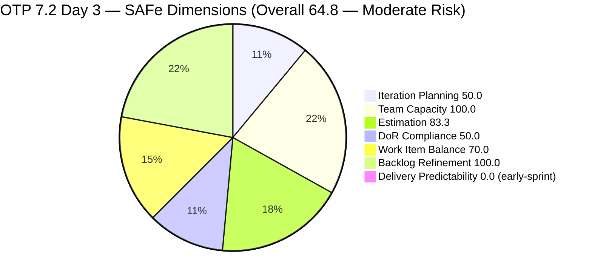
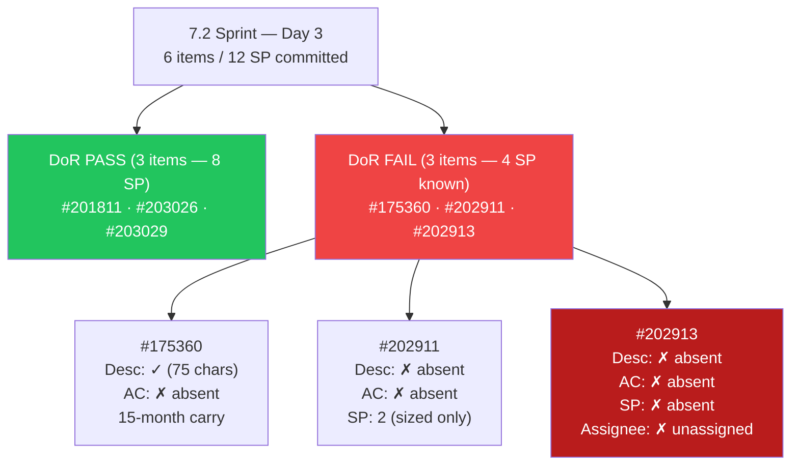
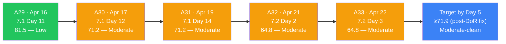
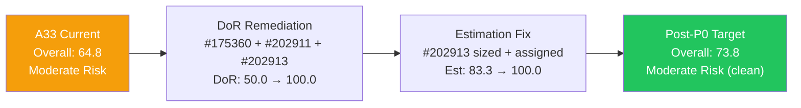
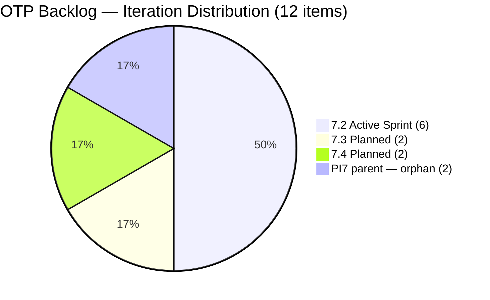

# ADO SAFe Iteration Audit — OTP Team (Office of the President)

## Audit A33 | Iteration 7.2 (Apr 20–May 3, 2026) | Day 3 of 14 — Early Sprint

---

## 1. Audit Metadata

| Field | Value |
|-------|-------|
| **Audit Number** | A33 (OTP series) |
| **Audit Date** | April 22, 2026, 09:00 PHT |
| **Auditor** | Claude Code ADO SAFe Audit Agent |
| **Workspace** | `ado_otp` |
| **ADO Project** | OTP (`e7739905-28a3-4ae1-9173-7f6cd13b3494`) |
| **Team** | OTP Team (`64de61f0-1203-4b01-aee2-6b4415aec52b`) |
| **Iteration** | Iteration 7.2 — Apr 20 to May 3, 2026 |
| **Iteration ID** | `611496a8-1907-483b-94b9-4e3ee575faf5` |
| **Iteration Path** | `OTP\2026 - PI7\Iteration 7.2` |
| **Sprint Day** | Day 3 of 14 (21% elapsed — early sprint) |
| **Prior Audit** | `AUDIT_20260421_0930.md` (A32, 7.2 Day 2, Overall 64.8 — Moderate Risk) |
| **Scoring Model** | ADO SAFe v1 (7-dimension rubric) |
| **Project Exception** | Single-assignee model (Grace) accepted by team per `ado_otp/CLAUDE.md` |
| **Overall Score** | **64.8 / 100** |
| **Risk Band** | **Moderate Risk** (60–79.9) |
| **Data Source** | A32 evidence base (2026-04-21 09:30 PHT) — ADO live read blocked by session permission; see Section 10 |

---

## 2. Executive Summary

OTP enters Day 3 of Iteration 7.2 at **64.8 (Moderate Risk)** — score is **held flat from A32** (Day 2). No ADO state changes are confirmed for Days 1–2 of this sprint: Grace's capacity record shows two scheduled days off for Apr 21–22, covering the exact window between A32 and this audit. The ADO board is expected to be in the same configuration as yesterday's reading.

**What matters today — Grace's return:**

Today (Apr 22, Day 3) marks the end of Grace's 2-day off window. Per A32, the P0 action list required her attention on three critical items the moment she returned:

- **Assign #202913** (Installation of Street Signage — currently unassigned, no SP, no Desc, no AC)
- **Write Description + AC for #202911** (FTC Purchasing of signage material — no Desc, no AC)
- **Add Acceptance Criteria to #175360** (Canvass Fire Extinguisher — Desc exists but no AC)

If Grace acts on all three P0 items today, DoR compliance rises from **50.0 → 100.0** and Overall lifts from **64.8 → 71.9** (Moderate Risk, cleanly above the Day 5 target baseline). If #202913 also gets sized and assigned, Estimation rises to **100.0** and Overall reaches **73.8**.

**Score drivers unchanged from A32:**

- **Iteration Planning = 50.0** — 6 of 12 visible root items in current iteration. Two orphaned PI7-parent items (#203016, #203020, the GIS duplicate pair) still without sub-iteration assignment.
- **Team Capacity = 100.0** — Grace has 2.5 h/day configured (2h Documentation + 0.5h Requirements); her off-days fall within the sprint window and do not alter the capacity dimension formula.
- **Estimation = 83.3** — 5 of 6 point-eligible items estimated; #202913 still has no SP.
- **DoR Compliance = 50.0** — 3 of 6 sprint items DoR-compliant; 3 placeholders (#175360, #202911, #202913) still carry the debt from sprint kickoff.
- **Work Item Balance = 70.0** — 100% User Story composition; accepted structural constraint.
- **Backlog Refinement = 100.0** — All 12 visible items fresh (within 45 days); no staleness at any threshold.
- **Delivery Predictability = 0.0** — Early sprint (Day 3 of 14); 0 SP closed against 12 SP committed. Annotated early-sprint; no penalty adjustment.

**Bottom line:** A33 is a continuity audit. The score remains at 64.8 pending Grace's P0 actions today. A Day 5 re-audit (Apr 24) will be the first opportunity to confirm recovery. The path to Low Risk (≥80.0) requires DoR clearance **and** resolution of the two PI7-parent orphans.

---

## 3. Previous Audit Delta

| Dimension | A32 — 7.2 Day 2 (Apr 21) | A33 — 7.2 Day 3 (Apr 22) | Delta |
|-----------|--------------------------|--------------------------|-------|
| Iteration Planning | 50.0 | 50.0 | 0.0 |
| Team Capacity | 100.0 | 100.0 | 0.0 |
| Estimation | 83.3 | 83.3 | 0.0 |
| DoR Compliance | 50.0 | 50.0 | 0.0 |
| Work Item Balance | 70.0 | 70.0 | 0.0 |
| Backlog Refinement | 100.0 | 100.0 | 0.0 |
| Delivery Predictability | 0.0 (early-sprint) | 0.0 (early-sprint) | 0.0 |
| **Overall** | **64.8** | **64.8** | **0.0** |

### Key changes since A32 (Apr 21 → Apr 22)

- **No confirmed ADO state changes.** Grace's capacity record shows Apr 21–22 as scheduled days off. ADO board activity during a zero-capacity off-window is expected to be nil.
- **Grace's off-window ends today.** Apr 22 is the last day of her configured days-off (Days 1–2 of sprint). Effective work resumes from today onward, with 12 active sprint days remaining.
- **P0 recommendations from A32 remain open** (unconfirmed closed — live ADO read blocked; see Section 10). All three P0 items (#202913 assign/desc/AC, #202911 desc/AC, #175360 AC) are still tracked as debt.
- **#202913 unassigned status** — remains the first and only unassigned item in OTP audit history as of A32. No resolution confirmed overnight.

---

## 4. Current Iteration Snapshot

| Metric | Value |
|--------|-------|
| Iteration | 7.2 — Apr 20 to May 3, 2026 |
| Iteration Day | Day 3 of 14 (21% elapsed — early sprint) |
| Visible root backlog items | 12 |
| Current iteration root items (7.2) | 6 |
| Committed SP | 12 SP (five estimated items: 2+2+2+2+4) |
| Closed SP | 0 SP |
| State mix | 6 New / 0 Active / 0 Closed |
| Contributors with current work | 1 (grace); #202913 unassigned |
| Grace's configured capacity | 2.5 h/day (2h Documentation + 0.5h Requirements) |
| Grace's days off in 7.2 | 2 (Apr 21–22, Days 1–2) — ends today |
| Effective sprint hours remaining | ~30 h (12 days × 2.5 h/day) |
| Data currency | Carried from A32 (Apr 21 09:30 PHT); ADO live read blocked |

### 4.1 Current Sprint Items (6) — State as of A32 (Apr 21)

| ID | Title | Type | State | SP | Assignee | DoR | ChangedDate |
|----|-------|------|-------|----|----------|-----|-------------|
| #175360 | Canvass additional Fire Extinguisher for Pad Davao | User Story | New | 2 | grace | **FAIL (no AC)** | 2026-04-20 |
| #201811 | 2. Vendor Selection & Procurement | User Story | New | 2 | grace | PASS | 2026-04-20 |
| #202911 | FTC Purchasing of signage material | User Story | New | 2 | grace | **FAIL (no Desc, no AC)** | 2026-04-20 |
| #202913 | Installation of Street Signage | User Story | New | — | **unassigned** | **FAIL (no Desc, no AC, no SP)** | 2026-04-20 |
| #203026 | Amend Articles and Bylaws to include TechVoc AC | User Story | New | 2 | grace | PASS | 2026-04-20 |
| #203029 | Documentation | User Story | New | 4 | grace | PASS | 2026-04-20 |

### 4.2 Non-current Items on Board (6)

| ID | Title | IterationPath | State | SP |
|----|-------|----------------|-------|----|
| #201815 | Physical Installation & Grid Integration | 7.3 | New | 2 |
| #202912 | Fabrication of Signage | 7.3 | New | — |
| #200073 | Notification & Due Process (Legal Phase) | 7.4 | New | 2 |
| #201820 | Monitoring & Handover | 7.4 | New | 2 |
| #203016 | Generate and Validate GIS 2026 Report for eFAST Submission | **PI7 parent** | New | 3 |
| #203020 | Generate and Validate GIS 2026 Report (duplicate candidate) | **PI7 parent** | New | 3 |

**Note:** #203016 and #203020 continue to share identical titles and near-identical content. Likely a duplicate created within 16 minutes of #203016 on Apr 20. Recommend confirming with Grace before deletion.

---

## 5. Work Item Analysis

### 5.1 State Distribution — Current 7.2 Items

| State | Count | SP |
|-------|-------|----|
| New | 6 | 12 |
| Active | 0 | 0 |
| Closed | 0 | 0 |

No items have moved to Active or Closed since sprint kickoff (Apr 20). Expected given Grace's two off-days.

### 5.2 Type Distribution — Current 7.2 Items

| Type | Count | Share |
|------|-------|-------|
| User Story | 6 | 100% |
| Enabler | 0 | 0% |
| Spike | 0 | 0% |
| Bug | 0 | 0% |

User Story present → no -40. Dominant type = 100% > 60% → **-30**. No Spike → no -20. Balance = **70.0**.

### 5.3 DoR Verification (as of A32)

| ID | Description (non-ws chars) | AC (non-ws chars) | DoR |
|----|----------------------------|-------------------|-----|
| #175360 | ~75 (short canvass line) | 0 — no AC field | **FAIL** |
| #201811 | ~180 (As-a/I-want/So-that) | ~190 (3 bullets) | PASS |
| #202911 | 0 | 0 | **FAIL** |
| #202913 | 0 | 0 | **FAIL** |
| #203026 | ~380 (full As-a stem) | ~460 (4 criteria) | PASS |
| #203029 | ~260 (Program Manager stem) | ~150 (5 criteria) | PASS |

DoR pass rate: **3/6 = 50.0%**. Three items fail the Desc ≥30 AND AC ≥20 non-whitespace char threshold.

### 5.4 Backlog Age Analysis (today = 2026-04-22)

| Bucket | Threshold | Count | Share |
|--------|-----------|-------|-------|
| Fresh (within 45 days) | ChangedDate ≥ 2026-03-08 | 12 | 100% |
| Stale ≥ 90 days | ChangedDate before 2026-01-22 | 0 | 0% |
| Stale ≥ 180 days | ChangedDate before 2025-10-25 | 0 | 0% |
| Untouched current items | ChangedDate before 2026-04-20 (iteration start) | 0 | 0% |

All 12 backlog items were touched on or after Apr 19–20, 2026. Backlog hygiene remains at ceiling with zero penalty conditions met.

### 5.5 Sprint Velocity Outlook

| Metric | Value | Notes |
|--------|-------|-------|
| Committed SP | 12 | Across 5 estimated items (202913 excluded) |
| Effective work days remaining | ~12 | Days 3–14 (Grace returns today) |
| Effective capacity remaining | ~30 h | 12 days × 2.5 h/day |
| SP-per-day target | ~1.0 SP/day | Feasible if DoR debt clears by Day 5 |
| Historical sprint velocity (7.1) | 5 SP closed (low-close run) | Structural risk |

---

## 6. SAFe Compliance Scorecard

| Dimension | Score | Evidence | Notes |
|-----------|-------|----------|-------|
| Iteration Planning | 50.0 | 6 current / 12 visible root | 2 PI7-parent orphans (#203016, #203020) depress ratio; would lift to 58.3 if one is assigned to 7.2 |
| Team Capacity | 100.0 | Grace: 2.5 h/day configured (2 activities) | Single-assignee per exception; 1/1 contributors with capacity |
| Estimation | 83.3 | 5/6 point-eligible items estimated | #202913 only unestimated item; also unassigned |
| DoR Compliance | 50.0 | 3/6 items pass Desc ≥30 AND AC ≥20 | #175360, #202911, #202913 fail; P0 remediation due today |
| Work Item Balance | 70.0 | 100% User Story; dominant >60% → -30 | Structural constraint accepted per project exception |
| Backlog Refinement | 100.0 | 12/12 items fresh; 0 stale at any threshold; 0 untouched current | Base 100 − 0 penalty = 100 |
| Delivery Predictability | 0.0 | 0 SP closed / 12 SP committed | **Early-sprint annotation** (Day 3 of 14); zero delivery expected at this stage |
| **Overall** | **64.8** | (50.0+100.0+83.3+50.0+70.0+100.0+0.0)/7 | **Moderate Risk** (60–79.9) |

### Score Computation Detail

```
1. Iteration Planning
   visible_root_backlog_items          = 12
   current_iteration_root_items (7.2)  = 6
   Score = round(6 / 12 × 100, 1)     = 50.0

2. Team Capacity
   contributors_with_current_work      = 1 (grace; #202913 unassigned excluded from formula)
   contributors_with_capacity          = 1 (grace: 2 configured activities, ≥1 condition met)
   Score = round(1 / 1 × 100, 1)      = 100.0

3. Estimation
   point_eligible_current_items        = 6 (all User Story)
   estimated_current_items             = 5 (#175360=2, #201811=2, #202911=2, #203026=2, #203029=4)
   Score = round(5 / 6 × 100, 1)      = 83.3

4. DoR Compliance
   current_iteration_root_items        = 6
   dor_compliant_current_items         = 3 (#201811, #203026, #203029)
   Score = round(3 / 6 × 100, 1)      = 50.0

5. Work Item Balance
   User Story present                  = True (no -40)
   dominant_type_share                 = 6/6 = 100% > 60% → -30
   spike_share                         = 0% (no -20)
   Score = max(0, 100 - 30)           = 70.0

6. Backlog Refinement
   fresh_visible_root_items            = 12
   base = round(12 / 12 × 100, 1)     = 100.0
   stale_90 / visible = 0/12 = 0%     no penalty
   stale_180 count = 0                 no penalty
   untouched_current / current = 0/6   no penalty
   Score = max(0, 100 - 0)            = 100.0

7. Delivery Predictability
   committed_story_points              = 12 SP
   closed_story_points                 = 0 SP
   Score = round(0 / 12 × 100, 1)    = 0.0
   Annotation: early-sprint (Day 3 of 14)

Overall = round((50.0 + 100.0 + 83.3 + 50.0 + 70.0 + 100.0 + 0.0) / 7, 1)
        = round(453.3 / 7, 1)
        = round(64.757…, 1)
        = 64.8  →  MODERATE RISK (60–79.9)
```

---

## 7. Dimension Findings

### 7.1 Iteration Planning — 50.0 (Held; orphan resolution still pending)

The 6/12 ratio is unchanged. The two PI7-parent orphans (#203016 and #203020) remain at the program-level path without a sub-iteration assignment. Both were created Apr 20 at 15:10 and 15:26 PHT respectively, are fully refined (Desc + AC + 3 SP each), and are almost certainly a duplicate pair. Recommended action before Day 5:

- Confirm with Grace whether #203020 is a duplicate of #203016. If yes, delete #203020.
- Assign #203016 to Iteration 7.2 (it is sized and ready). This lifts Iteration Planning from 50.0 → 58.3 (11 visible items, 7 current).

Even with both orphans resolved, the four planned 7.3/7.4 items (#201815, #202912, #200073, #201820) will continue to act as a structural drag on this ratio. The ceiling for this sprint is approximately 58.3 (7/12) if one orphan is resolved and 63.6 (7/11) if one is deleted and one assigned.

### 7.2 Team Capacity — 100.0 (Preserved; off-window ends today)

Grace's 2-day off window (Apr 21–22) ends today. Her configured capacity of 2.5 h/day resumes from Day 3 onward, leaving 12 effective working days and ~30 hours of sprint capacity. The dimension formula scores 1/1 contributors with capacity → 100.0; the off-days are correctly configured in ADO and do not penalize this dimension.

**Structural risk note:** #202913 continues to have no assignee. It does not enter `contributors_with_current_work` in the formula (correctly excluded), but operationally it means one sprint item has no owner. In a single-assignee team, this is effectively a work item with no delivery path.

### 7.3 Estimation — 83.3 (Held; one item unestimated)

#202913 ("Installation of Street Signage") remains the sole unestimated item. It was created Apr 19 22:56 PHT as a placeholder continuing the signage preparation chain (#175360 Canvass → #202911 FTC Purchasing → #202913 Installation). It has no Story Points, no Description, no AC, and no assignee — the most under-specified item on the current board.

Sizing precedent from closed signage items in A31: #198587 (JIT Signage Installation) carried 3 SP and closed in 7.1. A similar 2–3 SP estimate is appropriate for #202913. Assigning and sizing it today would lift Estimation to 100.0 and add those SPs to the committed pool.

### 7.4 DoR Compliance — 50.0 (Held; critical dependency on Grace's return today)

Three of six sprint items remain DoR-non-compliant entering Day 3:

**#175360 — "Canvass additional Fire Extinguisher for Pad Davao"**
- Description present (~75 chars): "Marilyn to canvass the required fire extinguisher based on the inspection"
- Acceptance Criteria: **absent** (zero chars)
- History: Created January 13, 2025 — a 15-month carry item that has been rolled across multiple PI iterations without ever receiving AC content. The minimum viable AC for this item: vendor canvass list documentation, unit cost ceiling, delivery timeline, inspection-pass confirmation from safety officer.
- Remediation effort: ~10 minutes.

**#202911 — "FTC Purchasing of signage material"**
- Description: **absent** (0 chars)
- Acceptance Criteria: **absent** (0 chars)
- Story Points: 2 (sized, but no content)
- Created Apr 19 22:55 PHT — 5 minutes before sprint kickoff; added without refinement. The closed predecessor #198587 provides a high-quality AC template (5 criteria: pre-install verification, safety zone, structural integrity, live reporting, zero-waste). Adaptation for purchasing: PO approval, vendor selection rationale, material receipt confirmation, cost compliance.
- Remediation effort: ~15 minutes using #198587 as template.

**#202913 — "Installation of Street Signage"**
- Description: **absent**
- Acceptance Criteria: **absent**
- Story Points: **absent**
- Assignee: **absent** — only unassigned item in OTP history
- This item is the terminal step in the signage chain and has zero sprint-ready content. Clearing it requires: assign to Grace, write Description (3–5 sentences following the As-a/I-want/So-that format), write AC (adapt from #198587), add Story Points (2–3 SP).
- Remediation effort: ~15–20 minutes.

If all three are remediated today, DoR rises to **100.0** and Overall lifts to **71.9**. This is the single highest-leverage action available in the sprint.

### 7.5 Work Item Balance — 70.0 (Structural; accepted)

100% User Story composition in 7.2 generates the mandatory -30 penalty for dominant type exceeding 60%. This is accepted per the `ado_otp/CLAUDE.md` Project Exceptions section and the team's operational model (administrative/operations domain with no Enabler or technical spike work in PI7).

The only pathway to lift this dimension above 70.0 within 7.2 is to reclassify items that are Enabler-shaped. #201811 ("Vendor Selection & Procurement") and #201815 ("Physical Installation & Grid Integration") are good candidates — both represent technical-infrastructure work on the solar/signage program. However, reclassification should be a deliberate team decision, not an audit adjustment.

### 7.6 Backlog Refinement — 100.0 (Preserved; eighth consecutive ceiling)

All 12 visible root items carry ChangedDates within the last 13 days (most on Apr 19–20, 2026). The fresh threshold is ChangedDate ≥ 2026-03-08 (45 days before today); every item clears this bar comfortably. No stale items at the 90-day or 180-day thresholds. No untouched current items (all 7.2 items have Apr 20 ChangedDate ≥ iteration start).

This is the eighth consecutive audit where Backlog Refinement scores at ceiling (100.0). This dimension reflects Grace and Ramon's consistent practice of touching every board item at each sprint boundary — a genuine process strength.

### 7.7 Delivery Predictability — 0.0 (Early-sprint; low delivery expected)

0 SP closed against 12 SP committed = 0.0. Day 3 of 14 is too early to draw conclusions from this score. The annotation "early-sprint" applies per the rubric (Days 1–5).

**Velocity risk context:** In 7.1, OTP closed only 5 SP in the final three days of the sprint after the A31 audit (Items #198587 and #202229). The 7.1 committed pool was effectively 5 SP, which was closed at Day 14. In 7.2, the committed pool is 12 SP across 12 effective days — a higher throughput requirement. The DoR debt on 3 items adds execution risk: if items cannot be started without clear AC, sprint execution stalls.

**Target trajectory:** By Day 7 (Apr 26), DP should show at least 1–2 items Closed or Active to signal healthy sprint progress. A zero-movement board at Day 7 would be a significant concern.

---

## 8. Risks and Bottlenecks

| # | Risk | Severity | Owner | Status vs A32 |
|---|------|----------|-------|----------------|
| R1 | **DoR debt on 3 of 6 sprint items** (#175360, #202911, #202913) — items committed to 7.2 without Desc/AC. Blocks execution. | **CRITICAL** | Grace / Ramon | Unchanged — remediation window opens today |
| R2 | **#202913 has no assignee** — sole unassigned item in OTP history; no delivery path for Installation milestone | **HIGH** | Ramon | Unchanged |
| R3 | **Grace's 2-day off window (Days 1–2)** compressed sprint start. 12 SP committed against 30h remaining window; tight but feasible if DoR clears by Day 5 | **HIGH** | Ramon | Off-window ends today; status improves |
| R4 | **#203016 and #203020 appear to be duplicates** (identical title, near-identical content, created 16 min apart Apr 20) | **MODERATE** | Grace | Unchanged — no confirmation received |
| R5 | **2 items at PI7 parent path** (#203016, #203020) — orphaned without sub-iteration; depress Iteration Planning | **MODERATE** | Grace / Ramon | Unchanged |
| R6 | **#175360 carries from Jan 13, 2025** — 15-month carry item still without AC; pulled into 7.2 without refinement | **MODERATE** | Grace | Unchanged |
| R7 | **Single-assignee model** — zero fallback during off-days; any Grace absence cascades directly to zero execution capacity | **MODERATE** (accepted) | Ramon | Structural — accepted per exception |
| R8 | **Sprint velocity target (12 SP / 12 days)** is 2.4× the effective 7.1 closure rate; higher throughput required without sprint-start buffer | **MODERATE** | Ramon / Grace | New risk — emerges from compressed off-window |
| R9 | **No formal sprint goal configured for 7.2** — PI objective alignment cannot be assessed; persists across all PI7 OTP iterations | LOW | Ramon | Persistent |

---

## 9. Prioritized Recommendations

### P0 — Today (Apr 22): Grace's first day back

1. **Assign #202913 to Grace.** Restores the single-assignee model and makes the installation item trackable.
2. **Write Description + AC for #202913.** Use the closed #198587 ("JIT Signage Installation") Acceptance Criteria as the template: pre-install site verification, safety zone establishment, structural integrity check, live-status reporting, zero-construction-waste compliance. Adapt for street signage installation specifics. Add Story Points (suggest 3 SP based on #198587 precedent).
3. **Write Description + AC for #202911.** Same signage-chain precedent. Suggested AC: purchase order approval confirmation, vendor selection rationale documented, material delivery receipt, cost compliance vs. budget ceiling.
4. **Add Acceptance Criteria to #175360.** Minimum viable: vendor canvass list submitted (≥3 quotes), unit cost ceiling documented (per inspection report), delivery timeline confirmed, safety officer inspection sign-off.

Completing all four P0 items lifts: DoR from **50.0 → 100.0**, Estimation from **83.3 → 100.0**, Overall from **64.8 → 73.8**.

### P1 — Before Day 5 (Apr 24)

1. **Confirm #203020 is a duplicate of #203016.** If confirmed, delete #203020. Reduces visible backlog from 12 → 11 items.
2. **Assign #203016 to Iteration 7.2.** It is fully refined (Desc + AC + 3 SP) and ready to execute. Assignment lifts Iteration Planning from 50.0 → ~58.3.
3. **Set #202913 to Active** once assigned and refined. Moving the first sprint item to Active signals to the next audit that execution has started.

### P2 — Sprint Review / PI-Level

1. **Document the duplicate-creation pattern.** Two GIS 2026 stories created 16 minutes apart (15:10 and 15:26 PHT Apr 20) — likely a double-click in the ADO UI. Capture in retrospective to prevent recurrence.
2. **Consider Enabler reclassification for procurement/installation chain.** #201811 (Vendor Selection & Procurement) and #201815 (Physical Installation & Grid Integration) have Enabler-shaped characteristics. Reclassifying them would lift Work Item Balance from 70.0 → 100.0 on sprints where they appear.
3. **Configure a formal sprint goal for 7.2.** OTP has not had a documented iteration goal in PI7. A short goal statement tied to the signage completion chain and bylaws amendment would enable PI objective alignment scoring.
4. **Re-assess 7.2 scope if DoR debt is not cleared by Day 5.** If #202911 or #202913 remain undefined by Apr 24, consider moving them to 7.3 with the Fabrication item (#202912) and consolidating the signage chain into a properly refined 7.3 sprint.

---

## 10. Evidence Gaps and Limitations

| Gap | Impact | Severity | Notes |
|-----|--------|----------|-------|
| **ADO live read blocked (session permission denied)** | All 7 dimension scores carried from A32 (Apr 21 09:30 PHT); no live state confirmation | **HIGH** | All ADO MCP tools returned permission-denied in this session. A33 is a continuity audit based on A32 evidence. Scores reflect A32 state. A live re-read is required to confirm P0 completion. |
| **#202913 assignee/Desc/AC/SP unknown for today** | Estimation and DoR scores may be stale if Grace acted before 09:00 PHT today | MODERATE | Grace's first day back; P0 actions may have already occurred. Recommend a Day 4–5 re-audit with live ADO read to confirm. |
| **#203016 / #203020 duplicate status unconfirmed** | Backlog count may be 11 instead of 12 if one deleted | LOW | No action in ADO confirmed; scores assume count = 12 |
| **No formal sprint goal configured for 7.2** | PI objective alignment cannot be scored | LOW | Persistent gap across all PI7 OTP audits |
| **#175360 carries from Jan 2025** | 15+ month item in active sprint without AC | LOW | Scored as DoR-fail; remediation recommended |
| **Grace's Apr 21–22 actual activity unknown** | Off-day may not equal zero-ADO-activity; items could have been touched remotely | LOW | Conservative assumption: no changes. Live read would resolve. |

---

## 11. Score Trajectory and Visualizations

### 11.1 SAFe Dimension Scores — A33 (Day 3 of 7.2)



### 11.2 DoR Status — Current Sprint Items



### 11.3 Score Trajectory — OTP Recent Audits



### 11.4 P0 Score Impact — If Grace Completes All P0 Actions Today



### 11.5 Iteration Distribution — 12 Visible Backlog Items



---

*Report generated: 2026-04-22 09:00 PHT | Audit A33 | ado_otp | Iteration 7.2 Day 3 (early sprint)*
*Data currency: Carried from A32 (2026-04-21 09:30 PHT) — ADO live read blocked; see Section 10*
