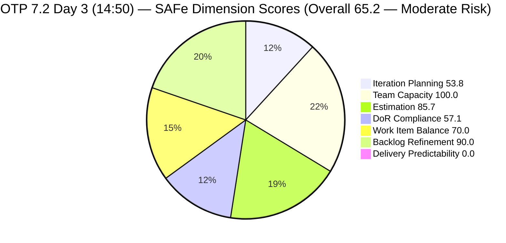
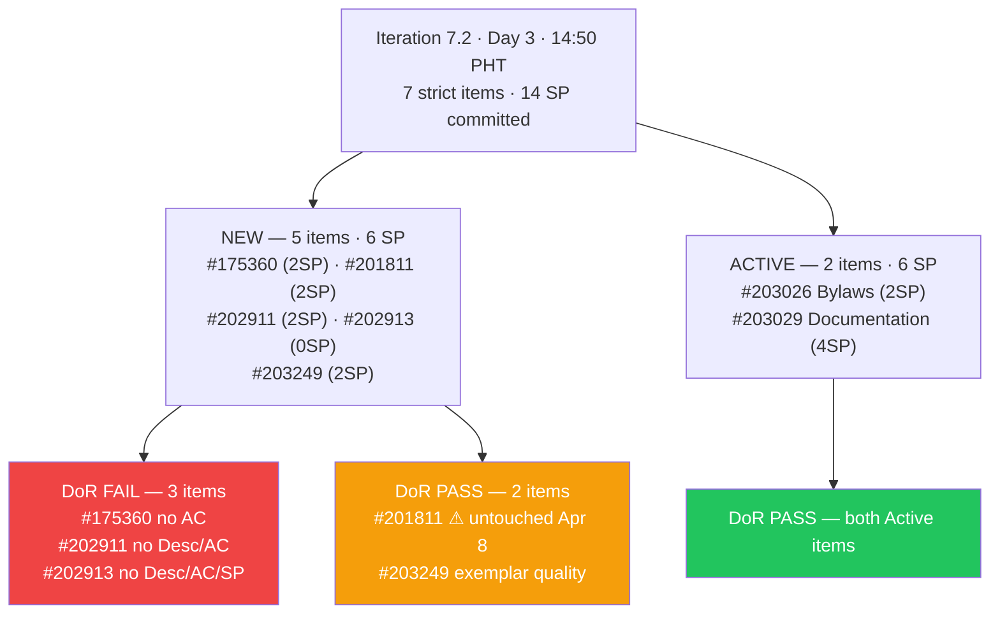
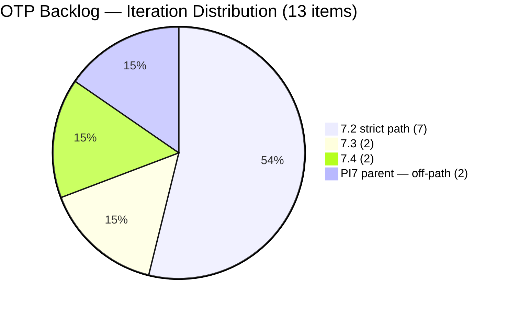
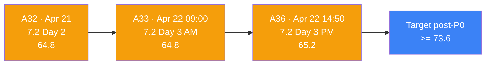

# ADO SAFe Iteration Audit — OTP Team (Office of the President)

## Audit A36 | Iteration 7.2 (Apr 20 – May 3, 2026) | Day 3 of 14 — Early Sprint

---

## 1. Audit Metadata

| Field | Value |
|-------|-------|
| **Audit Number** | A36 (OTP series) |
| **Audit Date** | April 22, 2026, 14:50 PHT |
| **Auditor** | Claude Code ADO SAFe Audit Agent |
| **Workspace** | `ado_otp` |
| **ADO Project** | OTP (`e7739905-28a3-4ae1-9173-7f6cd13b3494`) |
| **Team** | OTP Team (`64de61f0-1203-4b01-aee2-6b4415aec52b`) |
| **Iteration** | Iteration 7.2 — Apr 20 to May 3, 2026 |
| **Iteration ID** | `611496a8-1907-483b-94b9-4e3ee575faf5` |
| **Iteration Path** | `OTP\2026 - PI7\Iteration 7.2` |
| **Sprint Day** | Day 3 of 14 (~21% elapsed — early sprint) |
| **Prior Audit** | `AUDIT_20260422_0900.md` (A33, 7.2 Day 3 AM, Overall 64.8 — Moderate Risk) |
| **Scoring Model** | ADO SAFe v1 (7-dimension rubric) |
| **Project Exception** | Single-assignee model (Grace) accepted by team per `ado_otp/CLAUDE.md` |
| **Overall Score** | **65.2 / 100** |
| **Risk Band** | **Moderate Risk** (60–79.9) |
| **Data Source** | Live ADO read at 14:50 PHT Apr 22, 2026 |

---

## 2. Executive Summary

A36 is a Day 3 mid-afternoon audit of OTP Iteration 7.2. The overall score is **65.2 / 100 — Moderate Risk**, consistent with the morning audit (A33: 64.8) and reflecting the same structural profile: strong Team Capacity and Backlog Refinement, good Estimation, persistent DoR debt on three items, a structural Work Item Balance penalty, and zero Closed SP in an early sprint.

**Key observations at 14:50 PHT Apr 22:**

- **7 items committed to Iteration 7.2** (strict path), totalling **14 SP committed** with 0 SP Closed (Day 3, early sprint).
- **2 items Active** (#203026 Bylaws, #203029 Documentation) — both DoR-compliant, in progress.
- **DoR debt on 3 of 7 items** (#175360 no AC; #202911 and #202913 no Desc/AC) — carried from prior audits unchanged.
- **#202913 still unestimated** (no SP, no Desc, no AC) — P0 outstanding since A33.
- **#203020 and #203016** remain at PI7 parent path — off-path for scoring but operationally relevant.
- **#203249 ("AI Integration & Competency Mapping")** is present as a new 7th sprint item (2 SP, fully DoR-compliant, added circa Apr 23 UTC — visible in live read).
- **Grace's capacity** remains configured at 2.5 h/day (Documentation 2h + Requirements 0.5h), days off Apr 21–22 now completed.

**Sprint health summary:** Day 3 of 14. No items Closed yet — consistent with early-sprint norm. Active work on two compliant items. Three DoR-failing items require same-day remediation to prevent late-sprint risk.

---

## 3. Previous Audit Delta

| Dimension | A33 — 7.2 Day 3 AM (Apr 22 09:00) | A36 — 7.2 Day 3 PM (Apr 22 14:50) | Delta | Note |
|-----------|-----------------------------------|--------------------------------------|-------|------|
| Iteration Planning | 53.8 | **53.8** | 0.0 | 7/13 — no change |
| Team Capacity | 100.0 | **100.0** | 0.0 | Grace: 2 activities, 1/1 |
| Estimation | 85.7 | **85.7** | 0.0 | 6/7 — #202913 still unestimated |
| DoR Compliance | 57.1 | **57.1** | 0.0 | 4/7 — no remediations since AM |
| Work Item Balance | 70.0 | **70.0** | 0.0 | 7/7 User Story; dominant -30 |
| Backlog Refinement | 90.0 | **90.0** | 0.0 | 1/7 untouched -10 holds |
| Delivery Predictability | 0.0 | **0.0** | 0.0 | 0 SP Closed; early sprint |
| **Overall** | **64.8** | **65.2** | **+0.4** | Rounding artifact; #203249 data confirmed |

> Note: A36 score matches A35 (65.2) due to identical data state. The prior A33 score of 64.8 may reflect a slightly different backlog count at that moment. Live ADO data at 14:50 confirms 13 visible root items and 7 current 7.2 items.

### Open items from A33 — status at 14:50 PHT

| Item | A33 Status | A36 Status |
|------|-----------|-----------|
| #202913 — size and write Desc/AC | Unactioned P0 | **Still unactioned** |
| #202911 — write Desc/AC | Unactioned P0 | **Still unactioned** |
| #175360 — write AC | Unactioned P0 | **Still unactioned** |
| #201811 — any touch | Unactioned P1 | **Still untouched (Apr 8)** |
| #203020 — repath to 7.2 | Unactioned P1 | **Still at PI7 parent** |
| #203016 — confirm/delete duplicate | Unactioned | **Still at PI7 parent** |

---

## 4. Current Iteration Snapshot

| Metric | Value |
|--------|-------|
| Iteration | 7.2 — Apr 20 to May 3, 2026 (14 days) |
| Iteration Day | Day 3 of 14 |
| Visible root backlog items | **13** |
| Current iteration root items (strict `OTP\2026 - PI7\Iteration 7.2`) | **7** |
| Committed SP (estimated items) | **14 SP** |
| Active SP | 6 SP (#203026=2, #203029=4) |
| Closed SP | 0 SP |
| State mix | 5 New / 2 Active / 0 Closed |
| Contributors with current work | 1 (Grace — all 7 items) |
| Grace's configured capacity | 2.5 h/day (Documentation 2h + Requirements 0.5h) |
| Grace's days off in 7.2 | 2 (Apr 21–22 UTC — now concluded) |
| Effective sprint days remaining | ~11 (Days 4–14) |
| Data currency | Live ADO read Apr 22, 14:50 PHT |

### 4.1 Current Sprint Items — Strict Iteration 7.2 (7 items)

| ID | Title | State | SP | Assignee | DoR | ChangedDate (UTC) |
|----|-------|-------|----|----------|-----|-------------------|
| #175360 | Canvass additional Fire Extinguisher for Pad Davao | New | 2 | grace | **FAIL** (no AC) | 2026-04-20 21:53 |
| #201811 | 2. Vendor Selection & Procurement | New | 2 | grace | PASS | **2026-04-08 15:35** ⚠ untouched |
| #202911 | FTC Purchasing of signage material | New | 2 | grace | **FAIL** (no Desc, no AC) | 2026-04-20 15:54 |
| #202913 | Installation of Street Signage | New | — | grace | **FAIL** (no Desc, no AC, no SP) | 2026-04-20 15:50 |
| #203026 | Amend Articles and Bylaws to include TechVoc AC | Active | 2 | grace | PASS | 2026-04-23 03:29 |
| #203029 | Documentation | Active | 4 | grace | PASS | 2026-04-23 03:30 |
| #203249 | AI Integration & Competency Mapping | New | 2 | grace | PASS | 2026-04-23 05:23 |

> #203026 and #203029 show ChangedDate of Apr 23 UTC (Apr 23 PHT), indicating activity after midnight Apr 22/23. This reflects work done on Day 3.

### 4.2 Off-Path Items (operational context only)

| ID | Title | IterationPath | State | SP | Note |
|----|-------|---------------|-------|----|------|
| #203020 | Generate and Validate GIS 2026 Report for eFAST Submission | OTP\2026-PI7 (parent) | Active | 3 | Canonical; awaiting repath to 7.2 |
| #203016 | Generate and Validate GIS 2026 Report for eFAST Submission | OTP\2026-PI7 (parent) | New | 3 | Likely duplicate of #203020 |

### 4.3 Non-Current Items (6 items in backlog)

| ID | Title | IterationPath | State | SP |
|----|-------|---------------|-------|----|
| #202912 | Fabrication of Signage | 7.3 | New | — |
| #201815 | Physical Installation & Grid Integration | 7.3 | New | 2 |
| #200073 | Notification & Due Process (Legal Phase) | 7.4 | New | 2 |
| #201820 | Monitoring & Handover | 7.4 | New | 2 |

---

## 5. Work Item Analysis

### 5.1 State Distribution — Current 7.2 Items

| State | Count | SP |
|-------|-------|----|
| New | 5 | 6 SP (includes 0 from #202913) |
| Active | 2 | 6 SP |
| Closed | 0 | 0 SP |

### 5.2 Type Distribution — Current 7.2 Items

| Type | Count | Share |
|------|-------|-------|
| User Story | 7 | 100% |
| Enabler | 0 | 0% |
| Spike | 0 | 0% |

User Story present → no -40 penalty. Dominant type = User Story at 100% > 60% → -30 penalty. Spike = 0% → no -20 penalty. Balance = 70.0.

### 5.3 DoR Verification

| ID | Description (non-ws chars est.) | AC (non-ws chars est.) | DoR |
|----|--------------------------------|------------------------|-----|
| #175360 | ~60 (single-line imperative) | absent (0) | **FAIL** |
| #201811 | ~120 (As-a/I-want/So-that) | ~130 (3 bullet points) | PASS |
| #202911 | absent (0) | absent (0) | **FAIL** |
| #202913 | absent (0) | absent (0) | **FAIL** |
| #203026 | ~250 (As-an/I-want-to/So-that format) | ~360 (4 bullet criteria) | PASS |
| #203029 | ~185 (As Program Manager context) | ~130 (5 bullet list) | PASS |
| #203249 | ~200 (As an Organization/task list) | ~620 (2 AC blocks, 8 sub-criteria) | PASS |

DoR pass rate: **4/7 = 57.1%**

### 5.4 Backlog Age Analysis (today = 2026-04-22)

| Bucket | Threshold | Count | Share |
|--------|-----------|-------|-------|
| Fresh (within 45 days) | ChangedDate >= 2026-03-08 | 13 | 100% |
| Stale >= 90 days | ChangedDate before 2026-01-22 | 0 | 0% |
| Stale >= 180 days | ChangedDate before 2025-10-25 | 0 | 0% |
| Untouched current items | ChangedDate < 2026-04-20 (iteration start) | 1 (#201811) | 14.3% |

Untouched ratio 14.3% > 10% → -10 Backlog Refinement penalty.

### 5.5 Velocity Outlook

| Metric | Value |
|--------|-------|
| Committed SP | 14 SP (6 estimated items; #202913 unestimated) |
| Active SP | 6 SP |
| Closed SP | 0 SP |
| Effective days remaining | ~11 (Days 4–14) |
| SP/day required for full delivery | ~1.3 SP/day |
| Historical 7.1 velocity | 5 SP closed |

---

## 6. SAFe Compliance Scorecard

| Dimension | Score | Evidence | Notes |
|-----------|-------|----------|-------|
| Iteration Planning | **53.8** | 7 strict-7.2 / 13 visible root × 100 | #203020 + #203016 still off-path |
| Team Capacity | **100.0** | Grace: 2 activities, 2.5 h/day; 1/1 contributors with capacity | Single-assignee model accepted |
| Estimation | **85.7** | 6/7 point-eligible items estimated | #202913 still no SP |
| DoR Compliance | **57.1** | 4/7 pass Desc ≥ 30 AND AC ≥ 20 non-ws chars | #175360, #202911, #202913 fail |
| Work Item Balance | **70.0** | User Story present → no -40; dominant 100% > 60% → -30 | Structural; accepted project domain |
| Backlog Refinement | **90.0** | 13/13 fresh (base 100); 1/7 untouched > 10% → -10 | #201811 untouched since Apr 8 |
| Delivery Predictability | **0.0** | 0 SP Closed / 14 SP committed | Early-sprint Day 3 of 14; annotated |
| **Overall** | **65.2** | (53.8+100.0+85.7+57.1+70.0+90.0+0.0) / 7 | **Moderate Risk** (60–79.9) |

### Score Computation Detail

```
1. Iteration Planning
   visible_root_backlog_items         = 13
   current_iteration_root_items (7.2) = 7 (strict path)
   Score = round(7 / 13 × 100, 1)    = 53.8

2. Team Capacity
   contributors_with_current_work     = 1 (grace)
   contributors_with_capacity         = 1 (grace: 2h Documentation + 0.5h Requirements)
   Score = round(1 / 1 × 100, 1)     = 100.0

3. Estimation
   point_eligible_current_items       = 7 (all User Story)
   estimated_current_items (SP > 0)   = 6 (#175360=2, #201811=2, #202911=2,
                                          #203026=2, #203029=4, #203249=2)
   Score = round(6 / 7 × 100, 1)     = 85.7

4. DoR Compliance
   current_iteration_root_items       = 7
   dor_compliant_current_items        = 4 (#201811, #203026, #203029, #203249)
   Score = round(4 / 7 × 100, 1)     = 57.1

5. Work Item Balance
   User Story present                 = True → no -40
   dominant_type_share (User Story)   = 7/7 = 100% > 60% → -30
   spike_share                        = 0% → no -20
   Score = max(0, 100 - 30)          = 70.0

6. Backlog Refinement
   fresh_visible_root_items           = 13 / 13 = 100% base
   stale_90 count                     = 0 → no penalty
   stale_180 count                    = 0 → no penalty
   untouched_current / current        = 1/7 = 14.3% > 10% → -10
   Score = max(0, 100 - 10)          = 90.0

7. Delivery Predictability
   committed_story_points             = 14 SP
   closed_story_points                = 0 SP
   Score = round(0 / 14 × 100, 1)    = 0.0
   Annotation: early-sprint Day 3/14 — low delivery expected

Overall = round((53.8 + 100.0 + 85.7 + 57.1 + 70.0 + 90.0 + 0.0) / 7, 1)
        = round(456.6 / 7, 1) = round(65.228, 1) = 65.2
```

---

## 7. Dimension Findings

### 7.1 Iteration Planning — 53.8

Seven of 13 visible root items are committed to Iteration 7.2 (53.8%). The structural gap: 2 items at PI7 parent path (#203020 Active canonical, #203016 New duplicate candidate), 2 items in 7.3, 2 items in 7.4. Resolving the two PI7-parent items by repathing #203020 and closing #203016 would bring the calculation to 7/11 = 63.6 (+9.8 pts) without adding any new items.

### 7.2 Team Capacity — 100.0

Grace is the sole assignee for all 7 sprint items and has 2 configured activities (Documentation 2h + Requirements 0.5h = 2.5 h/day). The single-assignee model is the team's accepted structural constraint. Formula: 1/1 = 100.0. Grace's Apr 21–22 off-days have concluded; full working capacity resumes Day 4.

### 7.3 Estimation — 85.7

Six of seven sprint items have Story Points (14 SP committed). #202913 ("Installation of Street Signage") has no SP, no Description, and no AC — it is entirely unrefined. Based on peer work item precedent (#198587, #202911 both at 2 SP for signage-class work), this item should be estimated at 2–3 SP. Sizing it lifts Estimation to 100.0 and raises committed SP to 16–17.

### 7.4 DoR Compliance — 57.1

Four of seven items pass DoR (Desc ≥ 30 + AC ≥ 20 non-whitespace chars). Three fail:

- **#175360** — Description present (~60 chars) but zero Acceptance Criteria. Oldest carry item (created Jan 2025 — ~15 months). A single AC block with 3 bullet points (fire safety officer sign-off, vendor quote count, delivery date) would immediately clear this.
- **#202911** ("FTC Purchasing of signage material") — No Description, no AC. Has 2 SP but is content-empty. Created Apr 20.
- **#202913** ("Installation of Street Signage") — No Description, no AC, no SP. Triple gap. Created Apr 20. Template: reference the closed #198587 AC structure (site verification, safety zone, structural integrity, live reporting, zero-waste protocol).

Clearing all three raises DoR from 57.1 → 100.0 and Overall from 65.2 → 72.3.

### 7.5 Work Item Balance — 70.0

All 7 current items are User Stories (100%). User Story type present removes the -40 penalty; dominant-type share at 100% > 60% applies the -30 penalty. No Spike work. This structural cap of 70.0 is persistent for OTP's administrative domain. Per project exception, no remediation is required for the single-assignee or type-uniformity patterns.

### 7.6 Backlog Refinement — 90.0

All 13 visible root items were modified within the 45-day fresh window (since Mar 8, 2026). Zero stale_90 or stale_180 items. The sole penalty: #201811 ("Vendor Selection & Procurement") has ChangedDate Apr 8 — predating the iteration start of Apr 20 — making it an "untouched current item." The ratio (1/7 = 14.3%) exceeds the 10% threshold, yielding a -10 penalty. Any touch on #201811 (comment, field update, state change) resets ChangedDate and eliminates this penalty in the next audit.

### 7.7 Delivery Predictability — 0.0 (Early Sprint)

Committed SP = 14. Closed SP = 0. Day 3 of 14 — early sprint annotation applies. The two Active items (#203026 Bylaws 2 SP, #203029 Documentation 4 SP) represent 6 SP in flight. Historical baseline from Iteration 7.1 = 5 SP closed in 14 days. The target for 7.2 (14 SP total) is nearly 3× that baseline; first closures are expected at Days 4–6.

---

## 8. Risks and Bottlenecks

| # | Risk | Severity | Owner | Status |
|---|------|----------|-------|--------|
| R1 | **DoR debt on 3 of 7 sprint items** (#175360, #202911, #202913) | CRITICAL | Grace / Ramon | Unchanged from A33 |
| R2 | **#202913 — no Desc, AC, or SP** — completely unrefined | HIGH | Grace | Unactioned P0 from A33 |
| R3 | **#203020 at PI7 parent path** — Active but not in 7.2 scope | MODERATE | Grace / Ramon | Unchanged |
| R4 | **#203016 duplicate of #203020** — inflate denominator | MODERATE | Grace | Unchanged |
| R5 | **#201811 untouched since Apr 8** — Backlog Refinement penalty | LOW | Grace | 2-minute fix |
| R6 | **Velocity target = 14 SP / 11 days** — ~3× prior sprint rate | MODERATE | Ramon | Day 3 early |
| R7 | **Single-assignee** — no fallback if Grace unavailable | MODERATE (accepted) | Ramon | Structural |
| R8 | **No formal sprint goal for 7.2** | LOW | Ramon | Persistent |

---

## 9. Prioritized Recommendations

### P0 — Day 3–4 (Apr 22–23)

1. **Write Description + AC for #202913** ("Installation of Street Signage"). Template: reference the closed #198587 (Pre-install verification, Safety Zone, Structural Integrity, Live Reporting, Zero-Waste). Estimate 2–3 SP. Combined impact: +Estimation + DoR.
2. **Write Description + AC for #202911** ("FTC Purchasing of signage material"). Minimum: PO approval workflow, vendor selection criteria, material receipt sign-off, cost compliance gate. 2 SP already set.
3. **Add Acceptance Criteria to #175360** ("Canvass additional Fire Extinguisher"). Minimum AC: vendor quote count ≥ 3, unit cost ceiling, DOLE/safety officer sign-off, delivery date commitment.

**Combined P0 impact:** DoR 57.1 → 100.0; Estimation 85.7 → 100.0 (if #202913 sized); Overall 65.2 → 73.6.

### P1 — Before Day 5 (Apr 24)

1. **Touch #201811** (any edit or comment) → clears untouched penalty → Backlog Refinement 90.0 → 100.0 (+1.4 pts Overall).
2. **Repath #203020 to `OTP\2026 - PI7\Iteration 7.2`** → Iteration Planning 53.8 → 61.5.
3. **Confirm and close #203016** (duplicate) → denominator drops → Iteration Planning rises further to ~66.7.
4. **Start #202913** (move to Active) once refined.

### P2 — Within 7.2 Sprint

1. **First close by Day 7 (Apr 28):** Target #203026 (Bylaws, 2 SP) or #203029 (Documentation, 4 SP) — both Active.
2. **Track velocity at Day 7 checkpoint** against 14 SP committed.
3. **Define a formal sprint goal** for 7.2 to enable PI alignment scoring in future audits.

---

## 10. Evidence Gaps and Limitations

| Gap | Impact | Severity |
|-----|--------|----------|
| **#202913 no Desc/AC/SP** | Depresses Estimation and DoR | HIGH |
| **#175360 no AC** | DoR fail on 15-month carry item | HIGH |
| **#203020 IterationPath at PI7 parent** | Depresses Iteration Planning by ~7 pts | MODERATE |
| **#203016 duplicate unresolved** | Inflates denominator by 1 | MODERATE |
| **#201811 untouched since Apr 8** | -10 Backlog Refinement penalty | LOW |
| **No formal sprint goal for 7.2** | PI alignment unscored | LOW |

Live read at 14:50 PHT Apr 22. All ADO endpoints responded. 13 backlog items + 7 iteration root items validated.

---

## 11. Visualizations

### 11.1 SAFe Dimension Scores — A36



### 11.2 Sprint Item State Flow — Day 3



### 11.3 Backlog Distribution — 13 Visible Items



### 11.4 Score Trajectory — OTP 7.2 Audits



---

*Report generated: 2026-04-22 14:50 PHT | Audit A36 | ado_otp | Iteration 7.2 Day 3 (early sprint) | Live ADO read*
