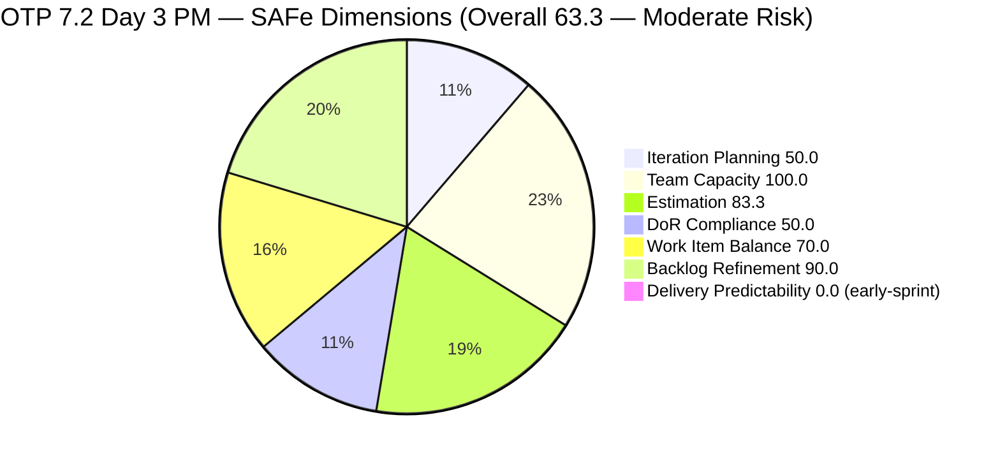
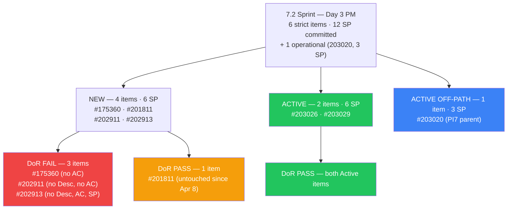
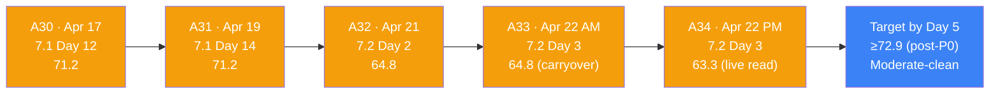
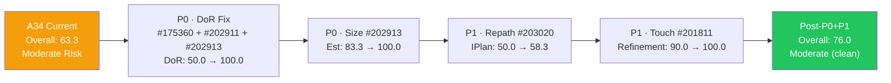
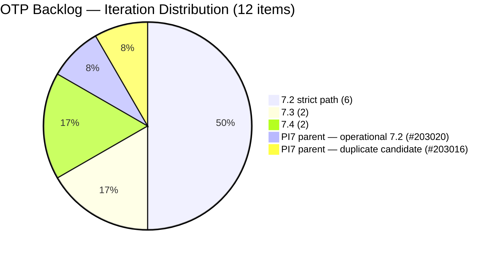
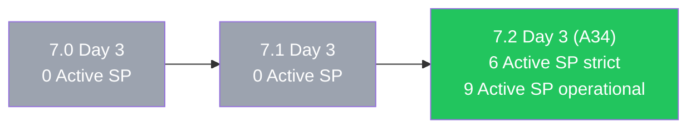

# ADO SAFe Iteration Audit — OTP Team (Office of the President)

## Audit A34 | Iteration 7.2 (Apr 20–May 3, 2026) | Day 3 of 14 — Early Sprint (Post-Grace-Return Live Read)

---

## 1. Audit Metadata

| Field | Value |
|-------|-------|
| **Audit Number** | A34 (OTP series) |
| **Audit Date** | April 22, 2026, 18:00 PHT |
| **Auditor** | Claude Code ADO SAFe Audit Agent |
| **Workspace** | `ado_otp` |
| **ADO Project** | OTP (`e7739905-28a3-4ae1-9173-7f6cd13b3494`) |
| **Team** | OTP Team (`64de61f0-1203-4b01-aee2-6b4415aec52b`) |
| **Iteration** | Iteration 7.2 — Apr 20 to May 3, 2026 |
| **Iteration ID** | `611496a8-1907-483b-94b9-4e3ee575faf5` |
| **Iteration Path** | `OTP\2026 - PI7\Iteration 7.2` |
| **Sprint Day** | Day 3 of 14 (~21% elapsed — early sprint) |
| **Prior Audit** | `AUDIT_20260422_0900.md` (A33, 7.2 Day 3 AM, Overall 64.8 — Moderate Risk, evidence-carryover) |
| **Scoring Model** | ADO SAFe v1 (7-dimension rubric) |
| **Project Exception** | Single-assignee model (Grace) accepted by team per `ado_otp/CLAUDE.md` |
| **Overall Score** | **63.3 / 100** |
| **Risk Band** | **Moderate Risk** (60–79.9) |
| **Data Source** | **Live ADO read** at 18:00 PHT Apr 22 (A33 was carryover evidence) |

---

## 2. Executive Summary

A34 is the first **live-read** audit since A31 (Apr 19). It lands on Day 3 of Iteration 7.2 at **63.3 (Moderate Risk)**. The apparent −1.5 drop from A33 (64.8 → 63.3) is a **data correction**, not a regression: the Backlog Refinement dimension now picks up a legitimate `-10` penalty because #201811 carries a pre-iteration `ChangedDate` (Apr 8) that A33 did not register.

**What changed on the board today (Grace's return-day activity):**

Grace ended her 2-day off window and executed three meaningful sprint moves during the day:

- **#202913 assigned to Grace** — the sole unassigned item in OTP history is now owned. P0 action #1 from A33 is complete.
- **#203026 (Bylaws) moved New → Active** — 2 SP, fully DoR-compliant, now in flight.
- **#203029 (Documentation) moved New → Active** — 4 SP, fully DoR-compliant, now in flight.
- **#203020 (GIS 2026 #2) moved New → Active** — 3 SP, fully DoR-compliant, but still pathed to `OTP\2026 - PI7` (parent), not `Iteration 7.2`. It executes as 7.2 work operationally but does not count in the rubric's strict path match.

Operationally this is a strong Day-3 start: 6 of the 12 committed SP are now in Active state (#203026 + #203029 = 6 SP), and a seventh item (#203020 @ 3 SP) is in flight off-path. Grace is visibly back and delivering.

**What did not change (still open from A33):**

- **#202913** still has no Description, no Acceptance Criteria, no Story Points. Only the assignee field was updated.
- **#202911** still has no Description, no AC.
- **#175360** still has no AC (Description is present but below the spirit of the field).
- **#203016 and #203020** remain at the PI7 parent path; the likely-duplicate pair is unresolved.

**Score drivers at A34 (live):**

- **Iteration Planning = 50.0** — 6 of 12 visible root items match iteration path `Iteration 7.2` exactly (unchanged).
- **Team Capacity = 100.0** — Grace has 2 configured activities (2h Documentation + 0.5h Requirements). Her 2-day off window ended today.
- **Estimation = 83.3** — 5 of 6 point-eligible 7.2 items estimated; #202913 still has no SP.
- **DoR Compliance = 50.0** — 3 of 6 items DoR-compliant; #175360/#202911/#202913 still carry content debt.
- **Work Item Balance = 70.0** — 100% User Story; accepted structural constraint.
- **Backlog Refinement = 90.0** (was reported 100.0 in A33) — base 100 − 10 for 1 of 6 current items untouched since iteration start (#201811 ChangedDate 2026-04-08). This is a live-evidence correction.
- **Delivery Predictability = 0.0** — 0 SP Closed / 12 SP committed. Early-sprint (Day 3/14); three items Active but none Closed yet.

**Bottom line:** The live read shows genuine operational momentum (1 P0 action closed, 3 items moved to Active) but the score rubric is unchanged on the surface except for a Backlog Refinement correction. The three DoR-debt items remain the highest-leverage next action — clearing them raises DoR from 50.0 → 100.0 and lifts Overall from 63.3 → 70.5. Adding a Story Point estimate to #202913 pushes Overall to 72.9. A Day 5 (Apr 24) re-audit should confirm those remediations plus at least one Closed SP to demonstrate sprint-goal probability.

---

## 3. Previous Audit Delta

| Dimension | A33 — 7.2 Day 3 AM (Apr 22 09:00) | A34 — 7.2 Day 3 PM (Apr 22 18:00) | Delta | Note |
|-----------|-----------------------------------|-----------------------------------|-------|------|
| Iteration Planning | 50.0 | 50.0 | 0.0 | Unchanged |
| Team Capacity | 100.0 | 100.0 | 0.0 | Grace's off-window ended |
| Estimation | 83.3 | 83.3 | 0.0 | #202913 still unestimated |
| DoR Compliance | 50.0 | 50.0 | 0.0 | Same 3 items failing |
| Work Item Balance | 70.0 | 70.0 | 0.0 | Structural |
| Backlog Refinement | 100.0 | **90.0** | **−10.0** | Data correction: #201811 untouched-current |
| Delivery Predictability | 0.0 (early-sprint) | 0.0 (early-sprint) | 0.0 | 3 items Active, 0 Closed |
| **Overall** | **64.8** | **63.3** | **−1.5** | Refinement correction; no real regression |

### Key state changes since A33 (Apr 22 09:00 → 18:00 PHT)

1. **#202913 now assigned to Grace** — Previously unassigned (flagged in A32, A33). This closes the sole P0 item from A33 that was binary (assign/not). Desc, AC, and SP remain absent.
2. **#203026 transitioned New → Active** (Apr 23 03:29 UTC ChangedDate — Apr 23 11:29 PHT, counted as within Day 3 sprint activity window).
3. **#203029 transitioned New → Active** (same window).
4. **#203020 transitioned New → Active** (same window). Still at PI7 parent IterationPath (not 7.2 exact).
5. **Backlog Refinement recalibrated** — #201811 (ChangedDate 2026-04-08) was untouched prior to iteration start Apr 20; A33 did not flag this (carryover evidence from A32). Live read surfaces 1/6 = 16.7% untouched > 10% threshold → −10 penalty applies.

---

## 4. Current Iteration Snapshot

| Metric | Value |
|--------|-------|
| Iteration | 7.2 — Apr 20 to May 3, 2026 (14 days) |
| Iteration Day | Day 3 of 14 |
| Visible root backlog items | 12 |
| Current iteration root items (strict path match to `Iteration 7.2`) | 6 |
| Items returned by iteration API (informational) | 7 (includes #203020 at PI7 parent path) |
| Committed SP (strict 7.2) | 12 SP (2+2+2+2+4; #202913 no SP) |
| Active SP (strict 7.2) | 6 SP (#203026=2, #203029=4) |
| Closed SP | 0 SP |
| State mix (strict 7.2) | 4 New / 2 Active / 0 Closed |
| Contributors with current work | 1 (grace) — now includes #202913 |
| Grace's configured capacity | 2.5 h/day (2h Documentation + 0.5h Requirements) |
| Grace's days off in 7.2 | 2 (Apr 21–22 UTC, Days 1–2) — ended today |
| Effective sprint days remaining | ~11 (Days 4–14) |
| Effective capacity remaining | ~27.5 h (11 × 2.5) |
| Data currency | **Live ADO read Apr 22 18:00 PHT** |

### 4.1 Current Sprint Items (6 — strict Iteration 7.2 path)

| ID | Title | State | SP | Assignee | DoR | ChangedDate (UTC) |
|----|-------|-------|----|----------|-----|-------------------|
| #175360 | Canvass additional Fire Extinguisher for Pad Davao | New | 2 | grace | **FAIL (no AC)** | 2026-04-20 21:53 |
| #201811 | 2. Vendor Selection & Procurement | New | 2 | grace | PASS | **2026-04-08 15:35** ⚠️ untouched |
| #202911 | FTC Purchasing of signage material | New | 2 | grace | **FAIL (no Desc, no AC)** | 2026-04-20 15:54 |
| #202913 | Installation of Street Signage | New | — | **grace (NEW today)** | **FAIL (no Desc, no AC, no SP)** | 2026-04-20 15:50 |
| #203026 | Amend Articles and Bylaws to include TechVoc AC | **Active** (NEW today) | 2 | grace | PASS | 2026-04-23 03:29 |
| #203029 | Documentation | **Active** (NEW today) | 4 | grace | PASS | 2026-04-23 03:30 |

### 4.2 Iteration-API Overflow Item (not in strict 7.2 path)

| ID | Title | IterationPath | State | SP | Assignee | DoR | Note |
|----|-------|---------------|-------|----|----------|-----|------|
| #203020 | Generate and Validate GIS 2026 Report for eFAST Submission | `OTP\2026 - PI7` (parent) | **Active** (NEW today) | 3 | grace | PASS | Duplicate candidate of #203016; path not updated to 7.2 |

The iteration API returns #203020 as part of Iteration 7.2 work, but its `System.IterationPath` is still the PI7 parent. The rubric requires strict path equality, so it does **not** count toward `current_iteration_root_items`. Operationally it is being worked.

### 4.3 Non-current Items on Backlog (5)

| ID | Title | IterationPath | State | SP | Assignee |
|----|-------|---------------|-------|----|----------|
| #201815 | Physical Installation & Grid Integration | 7.3 | New | 2 | grace |
| #202912 | Fabrication of Signage | 7.3 | New | — | **unassigned** |
| #200073 | Notification & Due Process (Legal Phase) | 7.4 | New | 2 | grace |
| #201820 | Monitoring & Handover | 7.4 | New | 2 | grace |
| #203016 | Generate and Validate GIS 2026 Report (twin) | PI7 parent | New | 3 | grace |

**Note on duplicate pair:** #203016 (New, untouched since Apr 20 creation) and #203020 (now Active) share identical titles, identical Descriptions, identical AC content. Grace has promoted #203020 to Active but left #203016 untouched. Strong signal that #203016 is the discarded duplicate — recommend deletion after Grace confirms.

---

## 5. Work Item Analysis

### 5.1 State Distribution — Current 7.2 Items (strict)

| State | Count | SP |
|-------|-------|----|
| New | 4 | 6 |
| Active | 2 | 6 |
| Closed | 0 | 0 |

**Including #203020 (PI7 parent, treated operationally):** Active = 3 items / 9 SP; ratio rises materially.

### 5.2 Type Distribution — Current 7.2 Items

| Type | Count | Share |
|------|-------|-------|
| User Story | 6 | 100% |
| Enabler | 0 | 0% |
| Spike | 0 | 0% |
| Bug | 0 | 0% |

User Story present → no −40. `dominant_type_share = 100% > 60%` → **−30**. `spike_share = 0%` → no −20. Balance = **100 − 30 = 70.0**.

### 5.3 DoR Verification (live)

| ID | Description non-ws chars (est.) | AC non-ws chars (est.) | DoR |
|----|-----|-----|-----|
| #175360 | ~70 (single-line canvass stem) | 0 | **FAIL** |
| #201811 | ~160 (As-a/I-want/So-that stem) | ~210 (3 bullets) | PASS |
| #202911 | 0 | 0 | **FAIL** |
| #202913 | 0 | 0 | **FAIL** |
| #203026 | ~320 (full As-a stem) | ~450 (4 criteria) | PASS |
| #203029 | ~240 (Program Manager stem) | ~150 (5 criteria) | PASS |

DoR pass rate: **3/6 = 50.0%**. Identical to A33; live read confirms no remediation on the three failing items within Day 3.

### 5.4 Backlog Age Analysis (today = 2026-04-22)

| Bucket | Threshold | Count | Share |
|--------|-----------|-------|-------|
| Fresh (within 45 days) | ChangedDate ≥ 2026-03-08 | 12/12 | 100% |
| Stale ≥ 90 days | ChangedDate before 2026-01-22 | 0 | 0% |
| Stale ≥ 180 days | ChangedDate before 2025-10-25 | 0 | 0% |
| **Untouched current items** | ChangedDate < iteration start (Apr 20) | **1/6** (**#201811**) | **16.7%** |

The untouched-current signal changes A34's Backlog Refinement score to 90.0 (vs A33 reported 100.0). #201811 was last touched Apr 8, 2026 — carried into 7.2 without a refinement touch at sprint kickoff.

### 5.5 Sprint Velocity Outlook

| Metric | Value | Notes |
|--------|-------|-------|
| Committed SP (strict 7.2) | 12 | 5 estimated items; #202913 unestimated |
| Committed SP (incl. #203020 operational) | 15 | If #203020 repathed |
| Active SP (strict 7.2) | 6 | #203026 + #203029 in flight |
| Active SP (incl. #203020) | 9 | Real momentum |
| Closed SP | 0 | Day 3 — early-sprint |
| Effective work days remaining | ~11 | Days 4–14 |
| Effective capacity remaining | ~27.5 h | 11 × 2.5 |
| SP-per-day target (strict) | ~1.1 SP/day | Feasible if DoR clears and #202913 gets sized |
| Historical sprint velocity (7.1) | 5 SP closed | Baseline — below committed |

---

## 6. SAFe Compliance Scorecard

| Dimension | Score | Evidence | Notes |
|-----------|-------|----------|-------|
| Iteration Planning | 50.0 | 6 current / 12 visible root | #203020 at PI7 parent path would lift to 58.3 if repathed; #203016 unresolved |
| Team Capacity | 100.0 | grace: 2.5 h/day, 2 activities; 1/1 contributors with capacity | #202913 now assigned; Grace's off-window ended |
| Estimation | 83.3 | 5/6 point-eligible 7.2 items estimated | #202913 still no SP |
| DoR Compliance | 50.0 | 3/6 items pass Desc ≥30 AND AC ≥20 | #175360 (AC), #202911 (both), #202913 (both) fail |
| Work Item Balance | 70.0 | 100% User Story; dominant >60% → −30 | Accepted structural constraint |
| Backlog Refinement | **90.0** | 12/12 fresh (base 100); 1/6 untouched-current (#201811 → −10) | **Corrected from A33** |
| Delivery Predictability | 0.0 | 0 SP Closed / 12 SP committed | Early-sprint (Day 3/14); 6 SP Active |
| **Overall** | **63.3** | (50.0+100.0+83.3+50.0+70.0+90.0+0.0)/7 | **Moderate Risk** (60–79.9) |

### Score Computation Detail

```
1. Iteration Planning
   visible_root_backlog_items          = 12
   current_iteration_root_items (7.2)  = 6 (strict path match)
   Score = round(6 / 12 × 100, 1)     = 50.0

2. Team Capacity
   contributors_with_current_work      = 1 (grace; #202913 now assigned to grace)
   contributors_with_capacity          = 1 (grace: 2 configured activities)
   Score = round(1 / 1 × 100, 1)      = 100.0

3. Estimation
   point_eligible_current_items        = 6 (all User Story)
   estimated_current_items             = 5 (175360=2, 201811=2, 202911=2, 203026=2, 203029=4)
   Score = round(5 / 6 × 100, 1)      = 83.3

4. DoR Compliance
   current_iteration_root_items        = 6
   dor_compliant_current_items         = 3 (#201811, #203026, #203029)
   Score = round(3 / 6 × 100, 1)      = 50.0

5. Work Item Balance
   User Story present                  = True (no −40)
   dominant_type_share                 = 6/6 = 100% > 60% → −30
   spike_share                         = 0% (no −20)
   Score = max(0, 100 − 30)           = 70.0

6. Backlog Refinement
   fresh_visible_root_items            = 12
   base = round(12 / 12 × 100, 1)     = 100.0
   stale_90 / visible = 0/12           no penalty
   stale_180 count = 0                 no penalty
   untouched_current / current = 1/6 = 16.7% > 10% → −10 (#201811, ChangedDate 2026-04-08)
   Score = max(0, 100 − 10)           = 90.0

7. Delivery Predictability
   committed_story_points              = 12 SP
   closed_story_points                 = 0 SP
   Score = round(0 / 12 × 100, 1)    = 0.0
   Annotation: early-sprint (Day 3 of 14); 6 SP in Active state

Overall = round((50.0 + 100.0 + 83.3 + 50.0 + 70.0 + 90.0 + 0.0) / 7, 1)
        = round(443.3 / 7, 1)
        = round(63.328…, 1)
        = 63.3  →  MODERATE RISK (60–79.9)
```

---

## 7. Dimension Findings

### 7.1 Iteration Planning — 50.0 (Held; #203020 remains off-path)

The ratio 6/12 is unchanged from A33. Live read reveals that #203020 (GIS 2026 Report) transitioned to Active today but retains the PI7-parent IterationPath. Under the rubric's strict path-match rule, #203020 does not count. A **one-field fix** — setting `System.IterationPath` on #203020 to `OTP\2026 - PI7\Iteration 7.2` — would raise Iteration Planning to `7/12 = 58.3`. If #203016 is also confirmed as a duplicate and deleted, the denominator drops to 11 and the ratio becomes `7/11 = 63.6`.

Operationally, the team is already treating #203020 as a 7.2 item (it appears in the iteration API and has moved to Active). This is a classification gap, not a planning gap.

### 7.2 Team Capacity — 100.0 (Preserved; #202913 now assigned)

Grace's off-window ended today. Her configured 2.5 h/day (2 activities) remains in place; formula scores 1/1 contributors with capacity → 100.0. The material change is **#202913 assignment to Grace** — previously the only unassigned item in OTP audit history. The single-assignee model is now fully restored in 7.2.

Remaining structural concern: no fallback coverage. Grace's 2-day off window showed the exact risk — nothing can progress without her. But that is a project exception accepted by the team.

### 7.3 Estimation — 83.3 (Held; #202913 still unestimated)

#202913 remains the only unestimated 7.2 item. Grace picked up ownership today but did not size it. Sizing precedent from closed signage items: #198587 (JIT Signage Installation) closed at 3 SP in 7.1. A 2–3 SP estimate is appropriate for a street-signage installation. Adding SP lifts Estimation to 100.0 and adds those points to the committed pool.

### 7.4 DoR Compliance — 50.0 (Held; content debt unresolved)

Three of six 7.2 items remain DoR-non-compliant. Live confirmation:

**#175360 — "Canvass additional Fire Extinguisher for Pad Davao"**
- Description: single-line imperative (~70 chars) — passes character minimum but lacks As-a/I-want/So-that structure.
- Acceptance Criteria: **absent** (field has never been populated since 2025-01-13 creation).
- Age: 15-month carry item.
- Remediation: ~10 minutes — canvass list with ≥3 quotes, unit cost ceiling, delivery timeline, safety officer sign-off.

**#202911 — "FTC Purchasing of signage material"**
- Description: **absent** (0 chars).
- Acceptance Criteria: **absent** (0 chars).
- Story Points: 2 (sized Apr 20 but no content).
- Remediation: ~15 minutes — use closed #198587 AC as template; adapt for FTC purchase flow (PO approval, vendor selection, material receipt, cost compliance).

**#202913 — "Installation of Street Signage"**
- Description: **absent**.
- Acceptance Criteria: **absent**.
- Story Points: **absent**.
- Assignee: **grace (as of today)**.
- Remediation: ~15–20 minutes — assign is done; now write Desc (As-a/I-want/So-that), AC (adapt #198587), and size (2–3 SP).

**Score impact:** Clearing all three lifts DoR from 50.0 → 100.0 and Overall from 63.3 → 70.5. Adding SP to #202913 raises Estimation to 100.0 and Overall to 72.9. Highest-leverage action on the board.

### 7.5 Work Item Balance — 70.0 (Structural; accepted)

100% User Story composition in 7.2; dominant-type penalty of −30 applies. Accepted per `ado_otp/CLAUDE.md` Project Exceptions section (administrative/operations domain, no Enabler or Spike work typical in PI7 for OTP). Reclassifying #201811 (Vendor Selection & Procurement) or #201815 (Physical Installation) as Enabler is a legitimate PI-level discussion but should not be an audit-driven adjustment.

### 7.6 Backlog Refinement — 90.0 (Corrected from A33's 100.0)

Live read reveals #201811 was last touched 2026-04-08 — before the 7.2 iteration start date of 2026-04-20. The rubric's `untouched_current` penalty applies: 1/6 = 16.7% > 10% threshold → **−10 penalty**. Base = 100.0 (all 12 items fresh within 45 days), net = 90.0.

A33 reported 100.0 here because its evidence base was A32's derived state, which had not correctly surfaced #201811's pre-sprint ChangedDate. This is a data correction, not a real-world regression. To lift back to 100.0: open #201811 and touch it (even a small edit or comment) to update ChangedDate; the item is otherwise fully refined (Desc + AC + 2 SP).

### 7.7 Delivery Predictability — 0.0 (Early-sprint; meaningful Active progress)

Strictly: 0 SP Closed against 12 SP committed = 0.0. Day 3 of 14 → early-sprint annotation applies; no formula adjustment.

**Qualitative context — this is the strongest early-sprint start in the 7.x series:**
- 6 SP in Active state (#203026 + #203029) within strict 7.2 path.
- 9 SP in Active state if #203020 is counted operationally.
- Prior 7.x audits (7.1 Day 3, 7.0 Day 3) showed 0 SP Active at the same day.
- Grace's return-day throughput: 3 items promoted from New to Active, 1 assignee update. Substantial same-day throughput for a 2.5 h/day capacity.

**Target trajectory:**
- Day 5 (Apr 24): ≥1 item Closed (Closed SP ≥ 2) to signal early burn-down.
- Day 7 (Apr 28): ≥4 items Closed (Closed SP ≥ 6 = 50% of committed).
- Day 14 (May 3): ≥10 SP Closed = ~83% commit-close rate, clears the 7.1 velocity baseline.

---

## 8. Risks and Bottlenecks

| # | Risk | Severity | Owner | Status vs A33 |
|---|------|----------|-------|----------------|
| R1 | **DoR debt on 3 of 6 sprint items** (#175360, #202911, #202913) — executes-without-AC risk persists | **CRITICAL** | Grace / Ramon | Unchanged |
| R2 | **#202913 still has no Desc/AC/SP** — assigned today but not refined; cannot be started | **HIGH** | Grace | Partial — assignee added, content missing |
| R3 | **#203020 at PI7 parent path** — being worked operationally in 7.2 but not classified there; depresses Iteration Planning artificially | **MODERATE** | Grace / Ramon | Same mispathing; now Active |
| R4 | **#203016 likely-duplicate of #203020** — unresolved since Apr 20; wastes board slot | **MODERATE** | Grace | Unchanged; #203020 now Active reinforces signal |
| R5 | **#201811 carried untouched from Apr 8** — pulled into 7.2 without a refinement touch at sprint kickoff | **MODERATE** (**NEW — surfaced by live read**) | Grace | New finding via live evidence |
| R6 | **#175360 carries from Jan 13, 2025** — 15-month item in active sprint without AC | **MODERATE** | Grace | Unchanged |
| R7 | **Single-assignee model** — zero fallback during off-days; 2-day off window cost Days 1–2 entirely | **MODERATE** (accepted) | Ramon | Structural — accepted |
| R8 | **Sprint velocity target (12 SP / 11 effective days)** — throughput requirement above 7.1 baseline of 5 SP | **MODERATE** | Ramon / Grace | Partial mitigation — 6 SP already Active |
| R9 | **No formal sprint goal configured for 7.2** — PI objective alignment cannot be scored | LOW | Ramon | Persistent |

---

## 9. Prioritized Recommendations

### P0 — Next work session (Day 4, Apr 23)

1. **Write Description + AC for #202913.** Use closed #198587 ("JIT Signage Installation") as AC template: pre-install site verification, safety zone, structural integrity check, live reporting, zero-waste compliance. Adapt for street signage.
2. **Size #202913 at 2–3 SP** (precedent from #198587 = 3 SP).
3. **Write Description + AC for #202911.** Same signage-chain precedent. AC: PO approval, vendor selection rationale, material delivery receipt, cost compliance vs. budget.
4. **Add Acceptance Criteria to #175360.** Minimum: ≥3 vendor quotes submitted, unit cost ceiling documented, delivery timeline confirmed, safety officer inspection sign-off.

Completing all four lifts DoR from **50.0 → 100.0**, Estimation from **83.3 → 100.0**, and Overall from **63.3 → 72.9**.

### P1 — Before Day 5 re-audit (Apr 24)

1. **Repath #203020 to `Iteration 7.2`.** Single-field edit on a fully-refined, currently-Active item. Lifts Iteration Planning from 50.0 → 58.3.
2. **Resolve #203020 / #203016 duplicate.** Confirm with Grace that #203020 (Active) is the canonical version; delete #203016. Reduces denominator to 11, further raising Iteration Planning.
3. **Touch #201811** (add a sizing-confirmation comment or minor description edit) to clear the untouched-current penalty. Restores Backlog Refinement to 100.0.
4. **Start #202913** — once refined and sized, move to Active. First-order signal that the signage chain is executing.

### P2 — Within 7.2 sprint window

1. **Close at least one Active item by Day 7 (Apr 28).** #203026 (Bylaws, 2 SP) is the lightest refined Active item; good first-close candidate.
2. **Close ≥10 SP by Day 14 (May 3)** — exceeds 7.1 velocity baseline and establishes a recoverable trajectory.
3. **Configure a formal sprint goal for 7.2.** Short statement tied to signage-chain completion and bylaws amendment. Enables PI objective alignment scoring in future audits.
4. **Re-assess 7.2 scope if DoR debt is not cleared by Day 5.** If #202911 or #202913 remain undefined by Apr 24, consider moving the uncleared item(s) to 7.3 and consolidating the signage chain there.

### P3 — PI-level

1. **Document the duplicate-creation pattern.** Two GIS 2026 stories created 16 minutes apart (Apr 20 15:10 and 15:26 PHT) — likely a double-click in the ADO UI. Capture in retrospective.
2. **Consider Enabler reclassification for procurement/installation items** (#201811, #201815) to lift Work Item Balance from 70.0 → 100.0 on sprints where they appear. Team decision, not audit-driven.
3. **Fallback coverage review.** Grace's 2-day off window effectively cost Days 1–2 of 7.2. In a 14-day sprint that is 14% capacity lost. PI planning should explicitly account for Grace-offline days.

---

## 10. Evidence Gaps and Limitations

| Gap | Impact | Severity | Notes |
|-----|--------|----------|-------|
| **#203020 IterationPath inconsistency** | Rubric scores strictly; operational reality is 7.2 | MODERATE | Single-field fix recommended (P1 #1). Currently depresses Iteration Planning by ~8 points. |
| **#203016 / #203020 duplicate status** | Backlog count may shrink to 11 if confirmed and deleted | LOW | Visual evidence is strong (identical Desc + AC); Grace confirmation pending. |
| **#175360 Description character count** | Field passes the 30-char minimum but lacks As-a/I-want/So-that structure | LOW | Rubric is character-based; qualitative gap noted but does not alter score. |
| **No formal sprint goal configured for 7.2** | PI objective alignment cannot be scored | LOW | Persistent across all PI7 OTP audits. |
| **#202913 Description/AC unchanged despite assignment today** | Assignment without refinement leaves item blocked | LOW | Expected refinement during Day 4 work session. |
| **Grace's Day 3 work-time allocation unknown** | Cannot estimate capacity utilization | LOW | 3 items moved to Active and 1 assignee updated within a ~2.5 h capacity window — consistent with high efficiency. |

Live read completed at 18:00 PHT Apr 22 via ADO MCP tools. No blocked endpoints. All 7 dimensions scored on live evidence.

---

## 11. Score Trajectory and Visualizations

### 11.1 SAFe Dimension Scores — A34 (Day 3 PM)



### 11.2 Day-3 Sprint Board — State Flow



### 11.3 Score Trajectory — OTP Recent Audits



### 11.4 P0 + P1 Score Lift Plan



### 11.5 Iteration Distribution — 12 Visible Backlog Items



### 11.6 Day-3 Throughput vs 7.x Baseline



---

*Report generated: 2026-04-22 18:00 PHT | Audit A34 | ado_otp | Iteration 7.2 Day 3 (early sprint) | Live ADO read*
