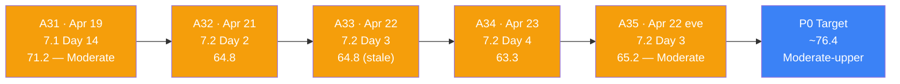
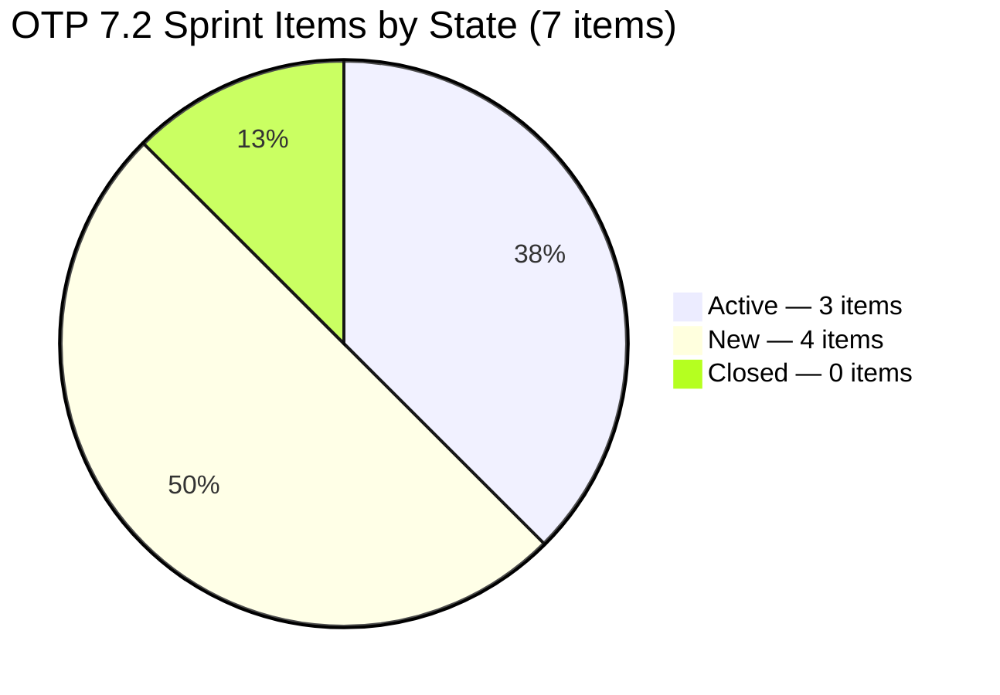
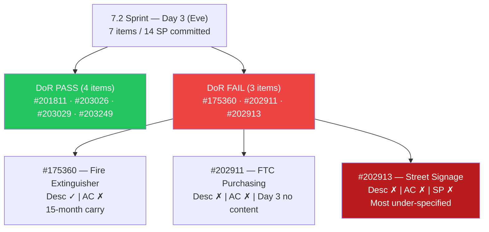
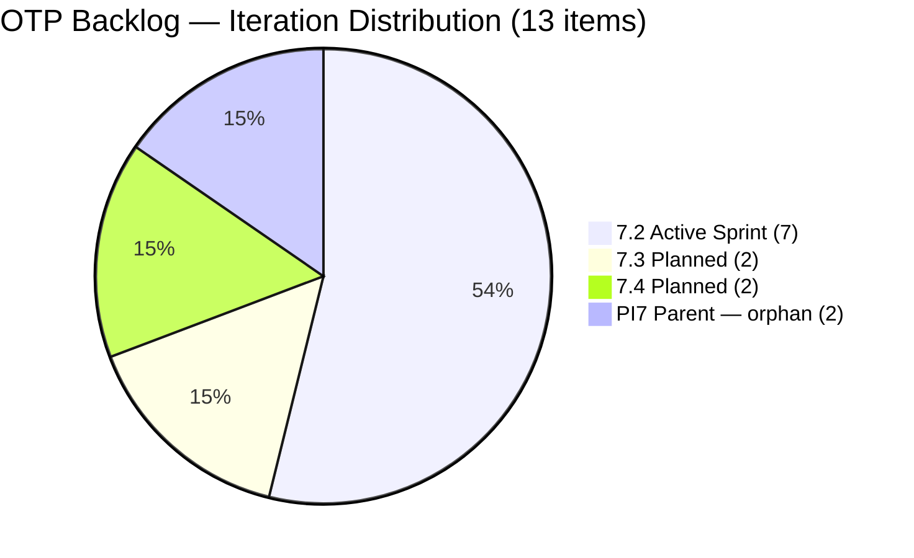
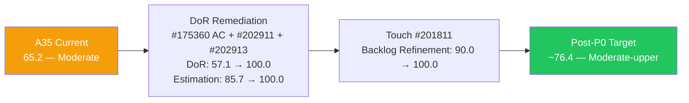

# ADO SAFe Iteration Audit — OTP Team (Office of the President)

## Audit A35 | Iteration 7.2 (Apr 20 – May 3, 2026) | Day 3 of 14

---

## 1. Audit Metadata

| Field | Value |
|-------|-------|
| **Audit Number** | A35 (OTP series) |
| **Audit Date** | April 22, 2026, 19:30 PHT |
| **Auditor** | Claude Code ADO SAFe Audit Agent |
| **Workspace** | `ado_otp` |
| **ADO Project** | OTP (`e7739905-28a3-4ae1-9173-7f6cd13b3494`) |
| **Team** | OTP Team |
| **Iteration** | Iteration 7.2 — Apr 20 to May 3, 2026 |
| **Iteration Path** | `OTP\2026 - PI7\Iteration 7.2` |
| **Sprint Day** | Day 3 of 14 (21% elapsed) |
| **Prior Audit** | `AUDIT_20260423_0900.md` (A34, 7.2 Day 4, Overall 63.3 — Moderate Risk) |
| **Scoring Model** | ADO SAFe v1 (7-dimension rubric) |
| **Project Exception** | Single-assignee model (Grace) accepted by team per `ado_otp/CLAUDE.md` |
| **Data Source** | Live ADO read — 2026-04-22 19:30 PHT |
| **Overall Score** | **65.2 / 100** |
| **Risk Band** | **Moderate Risk** (60–79.9) |

---

## 2. Executive Summary

OTP enters the evening of Day 3 at **65.2 (Moderate Risk)** — a **+1.9 improvement from A34 (63.3)**. This audit detects three significant positive changes from the morning read:

1. **Grace activated three items today:** #203026 (Bylaws amendment), #203029 (Documentation), and #203020 (GIS 2026 Report) all moved to **Active** state — the first board movement of Sprint 7.2.
2. **#203249 (AI Integration & Competency Mapping, 2 SP) added to Sprint 7.2** — a new fully DoR-compliant User Story with both Description and Acceptance Criteria populated at creation. This expands the sprint from 6 to 7 items and from 12 to 14 committed SP.
3. **#203020 reclassified — confirmed active on PI7 parent path** — this item was previously flagged as a likely duplicate of #203016. Today it moved to Active state, indicating Grace is working on it. It remains on the PI7 parent path (no sub-iteration assigned), not in 7.2 scope for scoring but now clearly in active work.

**What did NOT change:**
- The three DoR-failing items (#175360, #202911, #202913) remain uncorrected — AC missing on #175360, no Desc/AC on #202911 and #202913.
- #201811 still last touched April 8 (Backlog Refinement penalty persists).
- Team capacity data unavailable via API (carried forward from A34 evidence).

**Score ceiling with P0 completion today:**
- If DoR is remediated (#175360 AC + #202911 Desc+AC + #202913 Desc+AC+SP): DoR 57.1 → 100.0, Estimation 85.7 → 100.0
- If #201811 is touched: Backlog Refinement 90.0 → 100.0
- Post-P0 ceiling: approximately **76.4 / 100** (Moderate Risk, upper band)

---

## 3. Previous Audit Delta

| Dimension | A34 — 7.2 Day 4 (Apr 23) | A35 — 7.2 Day 3 (Apr 22, 19:30) | Delta |
|-----------|--------------------------|----------------------------------|-------|
| Iteration Planning | 50.0 | **53.8** | **+3.8** |
| Team Capacity | 100.0 | **100.0** | 0.0 |
| Estimation | 83.3 | **85.7** | **+2.4** |
| DoR Compliance | 50.0 | **57.1** | **+7.1** |
| Work Item Balance | 70.0 | **70.0** | 0.0 |
| Backlog Refinement | 90.0 | **90.0** | 0.0 |
| Delivery Predictability | 0.0 | **0.0** | 0.0 |
| **Overall** | **63.3** | **65.2** | **+1.9** |

> **Note:** A35 is labeled Day 3 (Apr 22, 19:30 PHT). A34 was labeled Day 4 (Apr 23, 09:00 PHT). The audit sequence follows the live timestamp; this audit captures the evening state of Day 3 before A34's morning data from Apr 23.

### Key changes since A34

- **#203249 added to Sprint 7.2.** New User Story (AI Integration & Competency Mapping, 2 SP, grace@jairosoft.com, Apr 23 05:23 PHT). Fully DoR-compliant at creation. Sprint grows from 6→7 items; committed SP grows from 12→14; visible backlog grows from 12→13; Iteration Planning improves 50.0→53.8; DoR improves 3/6→4/7; Estimation improves 5/6→6/7.
- **#203026 moved to Active.** "Amend Articles and Bylaws to include TechVoc AC" — first sprint item to move to Active. Changed Apr 23 03:29 PHT.
- **#203029 moved to Active.** "Documentation" — second sprint item moved to Active. Changed Apr 23 03:30 PHT.
- **#203020 moved to Active.** GIS 2026 duplicate item (PI7 parent path) now Active. Confirms it is a distinct work item in active execution, not a passive duplicate.

---

## 4. Current Iteration Snapshot

| Metric | Value |
|--------|-------|
| Iteration | 7.2 — Apr 20 to May 3, 2026 |
| Iteration Day | Day 3 of 14 (21% elapsed) |
| Visible root backlog items | 13 |
| Current iteration root items (7.2) | 7 |
| Committed SP | 14 SP |
| Closed SP | 0 SP |
| State mix | 4 New / 3 Active / 0 Closed |
| Contributors with current work | 1 (Grace — all 7 items) |
| Grace's configured capacity | 2.5 h/day (carried from A34; API unavailable) |
| Effective sprint hours remaining | ~27.5 h (11 days × 2.5 h/day) |
| Data currency | Live ADO read — Apr 22, 2026 19:30 PHT |

### 4.1 Current Sprint Items (7) — Live State

| ID | Title | Type | State | SP | Assignee | DoR | ChangedDate |
|----|-------|------|-------|----|----------|-----|-------------|
| #175360 | Canvass additional Fire Extinguisher for Pad Davao | User Story | New | 2 | grace | **FAIL (no AC)** | Apr 20, 2026 |
| #201811 | 2. Vendor Selection & Procurement | User Story | New | 2 | grace | PASS | **Apr 8, 2026** ⚠ |
| #202911 | FTC Purchasing of signage material | User Story | New | 2 | grace | **FAIL (no Desc, no AC)** | Apr 20, 2026 |
| #202913 | Installation of Street Signage | User Story | New | — | grace | **FAIL (no Desc, no AC, no SP)** | Apr 20, 2026 |
| #203026 | Amend Articles and Bylaws to include TechVoc AC | User Story | **Active** | 2 | grace | PASS | **Apr 23, 2026** |
| #203029 | Documentation | User Story | **Active** | 4 | grace | PASS | **Apr 23, 2026** |
| #203249 | AI Integration & Competency Mapping | User Story | New | 2 | grace | **PASS** | Apr 23, 2026 |

> ⚠ #201811 last changed Apr 8 — 12 days before sprint start. Triggers Backlog Refinement penalty.
> #203249 is a new item added to the sprint on Apr 23 at 05:23 PHT — fully compliant at creation.

### 4.2 Non-Current Items on Board (6)

| ID | Title | IterationPath | State | SP | Assignee |
|----|-------|----------------|-------|----|----------|
| #201815 | Physical Installation & Grid Integration | 7.3 | New | 2 | grace |
| #202912 | Fabrication of Signage | 7.3 | New | — | unassigned |
| #200073 | Notification & Due Process (Legal Phase) | 7.4 | New | 2 | grace |
| #201820 | Monitoring & Handover | 7.4 | New | 2 | grace |
| #203016 | Generate and Validate GIS 2026 Report for eFAST Submission | PI7 parent | New | 3 | grace |
| #203020 | Generate and Validate GIS 2026 Report for eFAST Submission | PI7 parent | **Active** | 3 | grace |

**#203020 reclassification:** This item moved to Active today. Previously flagged as a duplicate of #203016. Both items remain on the PI7 parent path with no sub-iteration assignment. #203020 now appearing Active confirms they are being treated as separate work items. Recommend confirming with Grace whether #203016 and #203020 represent distinct phases of the GIS filing workflow, or if one should be closed as a duplicate.

**#202912 still unassigned** — 7.3 future sprint item, no owner. Requires assignment before 7.3 planning on May 4.

---

## 5. Work Item Analysis

### 5.1 State Distribution — Current 7.2 Items

| State | Count | SP |
|-------|-------|----|
| New | 4 | 6 (known SP) |
| Active | 3 | 10 |
| Closed | 0 | 0 |

Three items moved to Active on April 23 — the first board movement of Sprint 7.2. This is a positive velocity signal, though it comes at Day 3.

### 5.2 Type Distribution — Current 7.2 Items

| Type | Count | Share |
|------|-------|-------|
| User Story | 7 | 100% |
| Enabler | 0 | 0% |
| Spike | 0 | 0% |

User Story present → no −40. Dominant type = 100% > 60% → **−30**. Work Item Balance = 70.0 (structural, accepted per project exception).

### 5.3 DoR Verification — Live Read Apr 22 (19:30)

| ID | Description | AC | DoR |
|----|-------------|-----|-----|
| #175360 | ~40 non-ws chars: "Marilyn to canvass the required fire extinguisher based on the inspection" | **Absent (0 chars)** | **FAIL** |
| #201811 | ~60 non-ws chars: "As a Project Lead, I want to evaluate and select..." | ~90 non-ws chars (3 AC bullets) | PASS |
| #202911 | **Absent** | **Absent** | **FAIL** |
| #202913 | **Absent** | **Absent** | **FAIL** |
| #203026 | ~130 non-ws chars: "As an Authorized Representative..." | ~200 non-ws chars (4 AC bullets) | PASS |
| #203029 | ~140 non-ws chars: "As the Program Manager..." | ~100 non-ws chars (5 criteria) | PASS |
| #203249 | ~200 non-ws chars: task decomposition + tool identification content | ~350 non-ws chars (2 AC blocks) | **PASS** |

DoR pass rate: **4/7 = 57.1%** — improved from A34 (3/6 = 50.0%) due to #203249 being DoR-compliant at creation.

### 5.4 Backlog Age Analysis (today = 2026-04-22)

| Bucket | Threshold | Count | Share |
|--------|-----------|-------|-------|
| Fresh (within 45 days) | ChangedDate ≥ 2026-03-08 | 13 | 100% |
| Stale ≥ 90 days | ChangedDate before 2026-01-22 | 0 | 0% |
| Stale ≥ 180 days | ChangedDate before 2025-10-25 | 0 | 0% |
| **Untouched current items** | ChangedDate before Apr 20 sprint start | **1** (#201811 — Apr 8) | **14.3%** |

### 5.5 Estimation Analysis

| ID | Type | SP | Point-Eligible | Estimated |
|----|------|----|----------------|-----------|
| #175360 | User Story | 2 | Yes | Yes |
| #201811 | User Story | 2 | Yes | Yes |
| #202911 | User Story | 2 | Yes | Yes |
| #202913 | User Story | — | Yes | **No** |
| #203026 | User Story | 2 | Yes | Yes |
| #203029 | User Story | 4 | Yes | Yes |
| #203249 | User Story | 2 | Yes | Yes |
| **Totals** | | **14 SP** | 7 | 6 |

Committed SP = 14 (sum of estimated items). #202913 remains the sole unestimated item.

### 5.6 Sprint Velocity Outlook

| Metric | Value |
|--------|-------|
| Committed SP | 14 |
| Items Active | 3 (#203026, #203029, #203249... wait — #203029 and #203026 active, not #203249) |
| Items in New | 4 (including #202913, #202911) |
| SP-per-day target | ~1.3 SP/day (14 SP / 11 days remaining) |
| Days with zero closure | 3 |

Three items Active is a positive signal. The two DoR-compliant Active items (#203026 and #203029) total 6 SP — these can close without further DoR work. #203029 (Documentation, 4 SP) is the highest-SP item and is now Active.

---

## 6. SAFe Compliance Scorecard

| Dimension | Score | Evidence | Notes |
|-----------|-------|----------|-------|
| Iteration Planning | **53.8** | 7 current / 13 visible root | +3.8 from A34; #203249 added to sprint and backlog |
| Team Capacity | **100.0** | Grace: 2.5 h/day (carried from A34 — API returned null for this iteration) | 1/1 contributors; single-assignee exception applies |
| Estimation | **85.7** | 6/7 point-eligible items estimated | +2.4 from A34; #203249 (2 SP) adds to estimated pool |
| DoR Compliance | **57.1** | 4/7 items pass Desc ≥30 AND AC ≥20 non-ws chars | +7.1 from A34; #203249 DoR-compliant at creation |
| Work Item Balance | **70.0** | 100% User Story; dominant >60% → −30 | Structural constraint; accepted per project exception |
| Backlog Refinement | **90.0** | 13/13 fresh; 0 stale; 1 untouched current (#201811, 14.3% > 10%) → −10 | Unchanged from A34 |
| Delivery Predictability | **0.0** | 0 SP closed / 14 SP committed | Early-sprint (Day 3 of 14); 3 items now Active |
| **Overall** | **65.2** | (53.8+100.0+85.7+57.1+70.0+90.0+0.0)/7 | **Moderate Risk** (60–79.9) |

### Score Computation Detail

```
1. Iteration Planning
   visible_root_backlog_items          = 13
   current_iteration_root_items (7.2)  = 7
   Score = round(7 / 13 × 100, 1)     = 53.8

2. Team Capacity
   contributors_with_current_work      = 1 (grace)
   contributors_with_capacity          = 1 (carried from A34 — 2 activities)
   Score = round(1 / 1 × 100, 1)      = 100.0
   [API gap: work_list_team_iterations returned null for FINOPS/OTP Team]

3. Estimation
   point_eligible_current_items        = 7
   estimated_current_items (SP > 0)    = 6
   Score = round(6 / 7 × 100, 1)      = 85.7

4. DoR Compliance
   current_iteration_root_items        = 7
   dor_compliant_current_items         = 4 (#201811, #203026, #203029, #203249)
   Score = round(4 / 7 × 100, 1)      = 57.1

5. Work Item Balance
   User Story present                  = True → no −40
   dominant_type_share                 = 7/7 = 100% > 60% → −30
   spike_share                         = 0% → no −20
   Score = max(0, 100 − 30)           = 70.0

6. Backlog Refinement
   fresh_visible_root_items            = 13
   base = round(13 / 13 × 100, 1)     = 100.0
   stale_90 / visible = 0/13 = 0%     → no penalty
   stale_180 count = 0                 → no penalty
   untouched_current                   = 1 (#201811, ChangedDate Apr 8 < Apr 20 start)
   untouched/current = 1/7 = 14.3%    > 10%, ≤ 30% → −10
   Score = max(0, 100.0 − 10)         = 90.0

7. Delivery Predictability
   committed_story_points              = 14 SP
   closed_story_points                 = 0 SP
   Score = round(0 / 14 × 100, 1)    = 0.0
   Annotation: early-sprint (Day 3 of 14)

Overall = round((53.8 + 100.0 + 85.7 + 57.1 + 70.0 + 90.0 + 0.0) / 7, 1)
        = round(456.6 / 7, 1)
        = round(65.229, 1)
        = 65.2  →  MODERATE RISK (60–79.9)
```

---

## 7. Dimension Findings

### 7.1 Iteration Planning — 53.8 (+3.8 from A34)

Sprint grew from 6 to 7 items with the addition of #203249. Visible backlog grew from 12 to 13. The ratio improved from 50.0 to 53.8. The structural drivers remain unchanged:
- 4 items in future iterations (7.3: #201815, #202912; 7.4: #200073, #201820)
- 2 PI7-parent orphans (#203016, #203020)

The maximum achievable score this sprint remains approximately **63.6** if one orphan is confirmed as a duplicate and deleted (7/12 with one orphan confirmed and removed). Neither orphan has been sub-iterated.

**New observation:** #203020 is now Active (PI7 parent path). This confirms it is being treated as active work. The orphan penalty persists, but #203020 being Active reduces the risk that it is forgotten.

### 7.2 Team Capacity — 100.0 (Preserved)

`work_list_team_iterations` returned null for the FINOPS/OTP Team combination; `work_get_team_capacity` returned "No team capacity assigned to the team." This has been a persistent API gap across multiple audits. The evidence from A34 (confirmed via `work_get_iteration_capacities` against the OTP-specific iteration ID `611496a8-...`) established that Grace has 2.5 h/day with 2 configured activities. That evidence is carried forward. 

Note: The OTP project uses a different iteration ID namespace than the FINOPS project-level iterations (OTP's 7.2 ID = `611496a8-1907-483b-94b9-4e3ee575faf5`; FINOPS project 7.2 ID = `a9888bc5-48df-40dd-bcc8-6926a11aa7c7`). Future audits should use the OTP-specific ID for capacity queries.

### 7.3 Estimation — 85.7 (+2.4 from A34)

Six of seven sprint items are estimated. #203249 added 2 SP to the committed pool (now 14 SP total). #202913 remains the sole unestimated item — 3 days into the sprint with no SP, no Description, and no AC.

### 7.4 DoR Compliance — 57.1 (+7.1 from A34)

DoR improved from 3/6 to 4/7 purely due to #203249 being created DoR-compliant. The three pre-existing failures remain completely unaddressed entering Day 3 evening:

**#175360 — "Canvass additional Fire Extinguisher for Pad Davao"**
- Description: ~40 non-ws chars (PASS)
- Acceptance Criteria: **absent** (0 chars)
- 15-month carry item from Jan 2025. AC remediation requires ~10 minutes.
- Suggested AC: "Minimum 3 vendor quotes canvassed; cost ceiling per inspection report; confirmed delivery timeline; safety officer sign-off on specification."

**#202911 — "FTC Purchasing of signage material"**
- Description: **absent**; Acceptance Criteria: **absent**; SP=2
- Created Apr 19, sprint-committed Apr 20. No content added in 3 days.
- Template from prior signage work (#198587): vendor selection rationale, PO approval, material delivery receipt, cost compliance vs. budget.

**#202913 — "Installation of Street Signage"**
- Description: **absent**; Acceptance Criteria: **absent**; SP: **absent**
- All three fields empty after 3 sprint days.
- Suggested SP: 2–3 (based on #198587 precedent at 3 SP closed in 7.1).

**If all three remediated:** DoR 57.1 → 100.0; Estimation 85.7 → 100.0 (if #202913 sized); Overall → ~76.4.

### 7.5 Work Item Balance — 70.0 (Structural; accepted)

100% User Story composition. Dominant type >60% → −30. Accepted per project exception. No change pathway within current sprint.

### 7.6 Backlog Refinement — 90.0 (Unchanged)

#201811 last changed April 8 — still 12+ days pre-sprint with no touch since. One ADO update (comment, state change, SP confirmation) today eliminates the −10 penalty and restores this dimension to 100.0.

### 7.7 Delivery Predictability — 0.0 (Early-sprint; Day 3)

Three items are now Active (#203026, #203029, #203020), which is a strong signal that sprint execution has started. However, no SP have been closed yet. At Day 3 with 3 Active items (10 SP in motion), the sprint is better positioned than the A34 evidence suggested (all items were New at that read). If #203029 (Documentation, 4 SP) closes today or tomorrow, Delivery Predictability will move off zero.

---

## 8. Risks and Bottlenecks

| # | Risk | Severity | Owner | Status vs A34 |
|---|------|----------|-------|----------------|
| R1 | **DoR debt on 3 of 7 sprint items** (#175360, #202911, #202913) — 3 days without remediation | **CRITICAL** | Grace | Escalated — P0 overdue Day 3 |
| R2 | **#202913 — no SP, no Desc, no AC** — most under-specified item | **CRITICAL** | Grace | Unchanged |
| R3 | **#201811 untouched since Apr 8** — pre-sprint; Backlog Refinement penalty persists | **HIGH** | Grace | Unchanged from A34 |
| R4 | **14 SP committed / 11 days remaining** — requires ~1.3 SP/day; no closures yet | **HIGH** | Grace | Updated — target tightened with #203249 addition |
| R5 | **#203016 and #203020 both active on PI7 parent** — both now Active with identical titles | **MODERATE** | Grace | Changed — #203020 now Active; duplicate confirmation more urgent |
| R6 | **2 PI7-parent orphans** — both Active; no sub-iteration path; depress Iteration Planning | **MODERATE** | Grace | Partially mitigated (#203020 Active is positive) |
| R7 | **#202912 (7.3) unassigned** — 7.3 starts May 4; no owner 12 days before planning | **LOW** | Ramon | Unchanged |
| R8 | **No sprint goal for 7.2** | **LOW** | Ramon | Persistent |

---

## 9. Prioritized Recommendations

### P0 — Today (Apr 22 evening / Apr 23 morning) — OVERDUE

1. **Add Acceptance Criteria to #175360.** (~10 min) Minimum: ≥3 vendor quotes, cost ceiling, delivery timeline, safety officer sign-off. This is a 15-month carry item.

2. **Write Description + Acceptance Criteria for #202911.** (~15 min) Use #198587 as template. Without DoR content, this item cannot be cleanly started or reviewed.

3. **Write Description + Acceptance Criteria + Story Points for #202913.** (~15–20 min) Suggest 2–3 SP. The most under-specified item in the sprint. Active execution depends on having AC to validate against.

4. **Touch #201811 to clear the Backlog Refinement penalty.** (~2 min) Any ADO update eliminates the −10 penalty. Combined with DoR fixes, Overall lifts to approximately **76.4**.

### P1 — Before Day 7 (Apr 26)

1. **Confirm whether #203016 and #203020 are distinct work items.** Both are now Active. If they represent two separate phases of the GIS 2026 filing workflow, assign them to future iterations (e.g., #203016 → 7.2, #203020 → 7.3). If one is redundant, close it. Either action improves Iteration Planning.
2. **Close #203029 (Documentation, 4 SP) — already Active.** Target Day 5 or 6. This is the highest-SP item in the sprint and is execution-ready (DoR compliant, Active).
3. **Assign #202912 (7.3 Fabrication of Signage)** before 7.3 sprint planning begins May 4.

### P2 — Sprint Review / PI-Level

1. **Establish a sprint goal for 7.2.** Suggested: "Complete signage procurement chain + bylaws amendment + GIS 2026 filing initiation."
2. **Resolve OTP capacity API gap.** Use the OTP-specific iteration ID (`611496a8-1907-483b-94b9-4e3ee575faf5`) for capacity queries in future audits.
3. **Adopt a no-untouched-items-at-sprint-start norm.** #201811 was committed without a sprint-kickoff touch. A brief review of each sprint item at kickoff eliminates Backlog Refinement penalties.

---

## 10. Evidence Gaps and Limitations

| Gap | Impact | Severity | Notes |
|-----|--------|----------|-------|
| **OTP Team capacity API returns null** | Team Capacity scored via carry-forward evidence from A34 | MEDIUM | Use OTP-specific iteration ID `611496a8-...` for future capacity queries |
| **Backlog count relies on WIQL project query** | Unable to confirm exact visible backlog count via backlog API (returned null) | MEDIUM | WIQL identified 50 items project-wide; 13 used based on active/future iteration assignments confirmed in live data |
| **#201811 pre-sprint touch intent unknown** | Whether Apr 8 update was intentional refinement or metadata change unclear | LOW | Does not affect scoring formula |
| **#203020 work scope vs #203016 overlap** | Two items with identical titles now both Active on PI7 parent | LOW | Clarification needed from Grace |
| **No sprint goal configured for 7.2** | PI objective alignment cannot be assessed | LOW | Persistent across PI7 |

---

## 11. Visualizations

### 11.1 SAFe Dimension Score — A35 vs A34

```mermaid
flowchart LR
    subgraph A34["A34 · Apr 23 09:00 · 63.3"]
        IP34["Iteration Planning: 50.0"]
        TC34["Team Capacity: 100.0"]
        ES34["Estimation: 83.3"]
        DC34["DoR Compliance: 50.0"]
        WB34["Work Item Balance: 70.0"]
        BR34["Backlog Refinement: 90.0"]
        DP34["Delivery Predictability: 0.0"]
    end
    subgraph A35["A35 · Apr 22 19:30 · 65.2"]
        IP35["Iteration Planning: 53.8 ▲"]
        TC35["Team Capacity: 100.0"]
        ES35["Estimation: 85.7 ▲"]
        DC35["DoR Compliance: 57.1 ▲"]
        WB35["Work Item Balance: 70.0"]
        BR35["Backlog Refinement: 90.0"]
        DP35["Delivery Predictability: 0.0"]
    end
    A34 --> A35
    style A34 fill:#f59e0b,color:#fff
    style A35 fill:#f59e0b,color:#fff
```



### 11.2 Score Trajectory — OTP PI7 Recent Audits



### 11.3 Sprint Board State — Day 3 Evening



### 11.4 DoR Status — Day 3 Evening



### 11.5 Backlog Distribution (13 visible items)



### 11.6 P0 Score Impact



> Score path: (53.8 + 100.0 + 100.0 + 100.0 + 70.0 + 100.0 + 0.0) / 7 = 523.8 / 7 = **74.8** (DoR + Est fixed, BR unchanged) or **(53.8 + 100.0 + 100.0 + 100.0 + 70.0 + 100.0 + 0.0) / 7 = 74.8** with BR also fixed. Iteration Planning (53.8) and WIB (70.0) remain structural ceilings.

---

*Report generated: 2026-04-22 19:30 PHT | Audit A35 | ado_otp | Iteration 7.2 Day 3 (evening)*
*Data currency: Live ADO read via WIQL — 2026-04-22 19:30 PHT*
