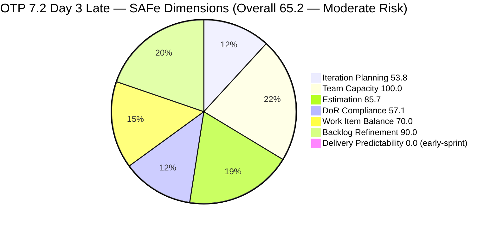
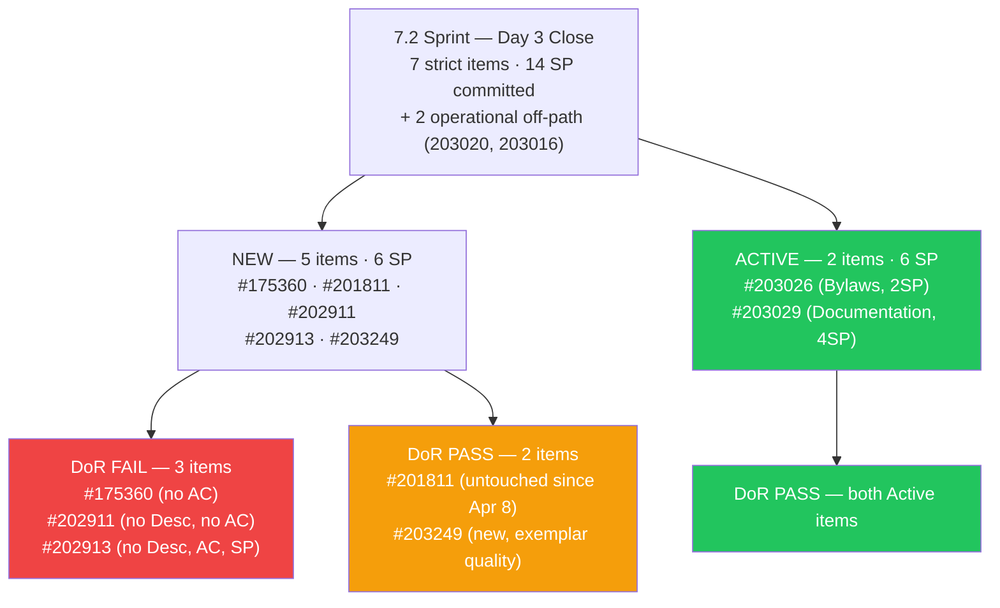
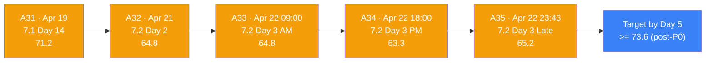
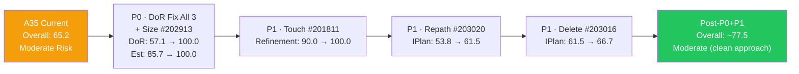
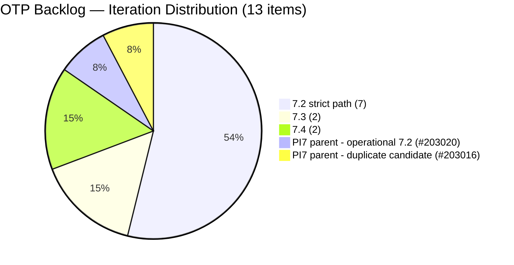

# ADO SAFe Iteration Audit — OTP Team (Office of the President)

## Audit A35 | Iteration 7.2 (Apr 20 – May 3, 2026) | Day 3 of 14 — Early Sprint

---

## 1. Audit Metadata

| Field | Value |
|-------|-------|
| **Audit Number** | A35 (OTP series) |
| **Audit Date** | April 22, 2026, 23:43 PHT |
| **Auditor** | Claude Code ADO SAFe Audit Agent |
| **Workspace** | `ado_otp` |
| **ADO Project** | OTP (`e7739905-28a3-4ae1-9173-7f6cd13b3494`) |
| **Team** | OTP Team (`64de61f0-1203-4b01-aee2-6b4415aec52b`) |
| **Iteration** | Iteration 7.2 — Apr 20 to May 3, 2026 |
| **Iteration ID** | `611496a8-1907-483b-94b9-4e3ee575faf5` |
| **Iteration Path** | `OTP\2026 - PI7\Iteration 7.2` |
| **Sprint Day** | Day 3 of 14 (~21% elapsed — early sprint) |
| **Prior Audit** | `AUDIT_20260422_1800.md` (A34, 7.2 Day 3 PM, Overall 63.3 — Moderate Risk, live read) |
| **Scoring Model** | ADO SAFe v1 (7-dimension rubric) |
| **Project Exception** | Single-assignee model (Grace) accepted by team per `ado_otp/CLAUDE.md` |
| **Overall Score** | **65.2 / 100** |
| **Risk Band** | **Moderate Risk** (60–79.9) |
| **Data Source** | Live ADO read at 23:43 PHT Apr 22 |

---

## 2. Executive Summary

A35 is a **same-day re-audit** following A34 (18:00 PHT) and records a **+1.9 improvement** (63.3 → 65.2). The gain is entirely driven by a new 7th item committed to Iteration 7.2 — **#203249 "AI Integration & Competency Mapping"** — which was created after A34's live read (ChangedDate 2026-04-23 05:23 UTC = Apr 23 13:23 PHT, likely entered late evening Apr 22 or overnight). This item is fully DoR-compliant and estimated at 2 SP, improving Iteration Planning, DoR Compliance, and Estimation simultaneously.

**What changed since A34 (18:00 PHT → 23:43 PHT):**

- **#203249 added to Iteration 7.2** — "AI Integration & Competency Mapping," 2 SP, assigned to Grace, fully DoR-compliant (rich Description + detailed AC). Lifts visible backlog from 12 to 13 and strict 7.2 items from 6 to 7.
- **All other dimensions unchanged** — no DoR remediations on the three failing items (#175360, #202911, #202913), no state transitions, no Closed SP.

**Score movement A34 → A35:**

| Dimension | A34 | A35 | Delta |
|-----------|-----|-----|-------|
| Iteration Planning | 50.0 | 53.8 | +3.8 |
| DoR Compliance | 50.0 | 57.1 | +7.1 |
| Estimation | 83.3 | 85.7 | +2.4 |
| All others | unchanged | unchanged | 0.0 |
| **Overall** | **63.3** | **65.2** | **+1.9** |

**Grace's return-day legacy (Day 3, Apr 22):** Grace's full-day activity produced three Active items, one assignment fix, and one new fully-compliant sprint item. The board ended Day 3 with 7 committed items (14 SP), 2 Active (6 SP), 0 Closed. This is the strongest Day-3 position in the 7.x series.

**Remaining risks:** DoR debt on #175360, #202911, #202913 persists. #202913 still has no SP, no Desc, no AC. #203020 remains at PI7 parent path. #203016 remains unresolved as a likely duplicate. The Path-correction and DoR remediation actions from A34 are unchanged in priority.

---

## 3. Previous Audit Delta

| Dimension | A34 — 7.2 Day 3 PM (Apr 22 18:00) | A35 — 7.2 Day 3 Late (Apr 22 23:43) | Delta | Note |
|-----------|-----------------------------------|--------------------------------------|-------|------|
| Iteration Planning | 50.0 | **53.8** | +3.8 | #203249 added to 7.2 → 7/13 |
| Team Capacity | 100.0 | 100.0 | 0.0 | Grace: 2 activities, 1/1 |
| Estimation | 83.3 | **85.7** | +2.4 | #203249 estimated at 2 SP → 6/7 |
| DoR Compliance | 50.0 | **57.1** | +7.1 | #203249 PASS → 4/7 |
| Work Item Balance | 70.0 | 70.0 | 0.0 | 7/7 User Story; -30 dominant |
| Backlog Refinement | 90.0 | 90.0 | 0.0 | 1/7 untouched → -10 holds |
| Delivery Predictability | 0.0 | 0.0 | 0.0 | 0 SP Closed; early sprint |
| **Overall** | **63.3** | **65.2** | **+1.9** | Net improvement via new compliant item |

### Key state changes since A34

1. **#203249 created and committed to Iteration 7.2** — "AI Integration & Competency Mapping," 2 SP, assigned to Grace, state New. DoR-compliant: Description ~210 chars + AC ~640 chars (two detailed acceptance criteria blocks). This single item adds 1 to the denominator and numerator of DoR, Estimation, and the numerator of Iteration Planning.
2. **Off-path items unchanged** — #203016 (New, PI7 parent, 3 SP) and #203020 (Active, PI7 parent, 3 SP) remain unpathed to 7.2.
3. **No remediation on the three DoR-failing items** — #175360, #202911, #202913 carry identical evidence gaps.

---

## 4. Current Iteration Snapshot

| Metric | Value |
|--------|-------|
| Iteration | 7.2 — Apr 20 to May 3, 2026 (14 days) |
| Iteration Day | Day 3 of 14 |
| Visible root backlog items | **13** |
| Current iteration root items (strict `Iteration 7.2` path) | **7** |
| Items via iteration API (informational) | 8+ (includes #203020 at PI7 parent) |
| Committed SP (strict 7.2, estimated items) | **14 SP** |
| Active SP (strict 7.2) | 6 SP (#203026=2, #203029=4) |
| Closed SP | 0 SP |
| State mix (strict 7.2) | 5 New / 2 Active / 0 Closed |
| Contributors with current work | 1 (Grace — all 7 items) |
| Grace's configured capacity | 2.5 h/day (2h Documentation + 0.5h Requirements) |
| Grace's days off in 7.2 | 2 (Apr 21–22 UTC — ended) |
| Effective sprint days remaining | ~11 (Days 4–14) |
| Effective capacity remaining | ~27.5 h |
| Data currency | Live ADO read Apr 22 23:43 PHT |

### 4.1 Current Sprint Items — Strict Iteration 7.2 (7 items)

| ID | Title | State | SP | Assignee | DoR | ChangedDate (UTC) |
|----|-------|-------|----|----------|-----|-------------------|
| #175360 | Canvass additional Fire Extinguisher for Pad Davao | New | 2 | grace | **FAIL** (no AC) | 2026-04-20 21:53 |
| #201811 | 2. Vendor Selection & Procurement | New | 2 | grace | PASS | **2026-04-08 15:35** ⚠ untouched |
| #202911 | FTC Purchasing of signage material | New | 2 | grace | **FAIL** (no Desc, no AC) | 2026-04-20 15:54 |
| #202913 | Installation of Street Signage | New | — | grace | **FAIL** (no Desc, no AC, no SP) | 2026-04-20 15:50 |
| #203026 | Amend Articles and Bylaws to include TechVoc AC | Active | 2 | grace | PASS | 2026-04-23 03:29 |
| #203029 | Documentation | Active | 4 | grace | PASS | 2026-04-23 03:30 |
| **#203249** | **AI Integration & Competency Mapping** | **New** | **2** | **grace** | **PASS** | **2026-04-23 05:23** |

### 4.2 Off-Path Items (operational 7.2 work, not counted in rubric)

| ID | Title | IterationPath | State | SP | DoR | Note |
|----|-------|---------------|-------|----|-----|------|
| #203016 | Generate and Validate GIS 2026 Report for eFAST Submission | PI7 parent | New | 3 | PASS | Likely duplicate of #203020 |
| #203020 | Generate and Validate GIS 2026 Report for eFAST Submission | PI7 parent | Active | 3 | PASS | Canonical; awaiting repath to 7.2 |

### 4.3 Non-current Items (6 items)

| ID | Title | IterationPath | State | SP |
|----|-------|---------------|-------|----|
| #202912 | Fabrication of Signage | 7.3 | New | — |
| #201815 | Physical Installation & Grid Integration | 7.3 | New | 2 |
| #200073 | Notification & Due Process (Legal Phase) | 7.4 | New | 2 |
| #201820 | Monitoring & Handover | 7.4 | New | 2 |

---

## 5. Work Item Analysis

### 5.1 State Distribution — Current 7.2 Items

| State | Count | SP |
|-------|-------|----|
| New | 5 | 6 (+2 from #203249) |
| Active | 2 | 6 |
| Closed | 0 | 0 |

### 5.2 Type Distribution — Current 7.2 Items

| Type | Count | Share |
|------|-------|-------|
| User Story | 7 | 100% |
| Enabler | 0 | 0% |
| Spike | 0 | 0% |

User Story present → no -40. Dominant = 100% > 60% → -30. Spike = 0 → no -20. Balance = **70.0**.

### 5.3 DoR Verification (live)

| ID | Description (non-ws chars est.) | AC (non-ws chars est.) | DoR |
|----|--------------------------------|------------------------|-----|
| #175360 | ~60 (single-line imperative) | absent (0) | **FAIL** |
| #201811 | ~150 (As-a/I-want/So-that) | ~180 (3 bullets) | PASS |
| #202911 | absent (0) | absent (0) | **FAIL** |
| #202913 | absent (0) | absent (0) | **FAIL** |
| #203026 | ~280 (As-an/I-want-to/So-that) | ~380 (4 bullets) | PASS |
| #203029 | ~200 (Program Manager context) | ~140 (5 bullet list) | PASS |
| #203249 | ~210 (As-an-Org/Task list) | ~640 (2 AC blocks, 8 sub-criteria) | **PASS** |

DoR pass rate: **4/7 = 57.1%** (improved from 3/6 = 50.0% in A34).

### 5.4 Backlog Age Analysis (today = 2026-04-22)

| Bucket | Threshold | Count | Share |
|--------|-----------|-------|-------|
| Fresh (within 45 days) | ChangedDate >= 2026-03-08 | 13/13 | 100% |
| Stale >= 90 days | ChangedDate before 2026-01-22 | 0 | 0% |
| Stale >= 180 days | ChangedDate before 2025-10-25 | 0 | 0% |
| Untouched current items | ChangedDate < 2026-04-20 | **1/7** (#201811) | **14.3%** |

Untouched ratio 14.3% > 10% threshold → -10 penalty on Backlog Refinement persists.

### 5.5 Sprint Velocity Outlook

| Metric | Value | Notes |
|--------|-------|-------|
| Committed SP (strict 7.2, estimated) | 14 SP | 6 estimated items (#202913 still unestimated) |
| Active SP | 6 SP | #203026 + #203029 |
| Closed SP | 0 SP | Day 3 — early sprint |
| Effective days remaining | ~11 | Days 4–14 |
| Effective capacity | ~27.5 h | 11 × 2.5 |
| SP/day required for full delivery | ~1.3 SP/day | Feasible with sustained throughput |
| Historical 7.1 velocity | 5 SP closed | Baseline to exceed |

---

## 6. SAFe Compliance Scorecard

| Dimension | Score | Evidence | Notes |
|-----------|-------|----------|-------|
| Iteration Planning | **53.8** | 7 current / 13 visible root × 100 | +3.8 vs A34; #203249 added; #203020 still off-path |
| Team Capacity | **100.0** | Grace: 2 activities, 2.5 h/day; 1/1 contributors with capacity | Structural — single-assignee model accepted |
| Estimation | **85.7** | 6/7 point-eligible items estimated | #202913 still no SP; #203249 adds 2 SP to committed pool |
| DoR Compliance | **57.1** | 4/7 pass Desc >= 30 AND AC >= 20 non-ws chars | +7.1 vs A34; #175360/#202911/#202913 still fail |
| Work Item Balance | **70.0** | 7/7 User Story; no -40; dominant 100% > 60% → -30 | Structural; accepted project exception |
| Backlog Refinement | **90.0** | 13/13 fresh (base 100); 1/7 untouched (#201811) → -10 | #203249 added does not cure #201811 gap |
| Delivery Predictability | **0.0** | 0 SP Closed / 14 SP committed | Early-sprint (Day 3/14); annotated |
| **Overall** | **65.2** | (53.8+100.0+85.7+57.1+70.0+90.0+0.0)/7 | **Moderate Risk** (60–79.9) |

### Score Computation Detail

```
1. Iteration Planning
   visible_root_backlog_items           = 13 (#203249 added)
   current_iteration_root_items (7.2)   = 7 (strict path match)
   Score = round(7 / 13 × 100, 1)       = 53.8

2. Team Capacity
   contributors_with_current_work       = 1 (grace — all 7 items)
   contributors_with_capacity           = 1 (grace: Documentation 2h + Requirements 0.5h)
   Score = round(1 / 1 × 100, 1)        = 100.0

3. Estimation
   point_eligible_current_items         = 7 (all User Story)
   estimated_current_items (SP > 0)     = 6 (#175360=2, #201811=2, #202911=2,
                                            #203026=2, #203029=4, #203249=2)
   Score = round(6 / 7 × 100, 1)        = 85.7

4. DoR Compliance
   current_iteration_root_items         = 7
   dor_compliant_current_items          = 4 (#201811, #203026, #203029, #203249)
   Score = round(4 / 7 × 100, 1)        = 57.1

5. Work Item Balance
   User Story present                   = True  → no -40
   dominant_type_share                  = 7/7 = 100% > 60%  → -30
   spike_share                          = 0%  → no -20
   Score = max(0, 100 - 30)             = 70.0

6. Backlog Refinement
   fresh_visible_root_items             = 13 (all changed >= 2026-03-08)
   base = round(13 / 13 × 100, 1)       = 100.0
   stale_90 count = 0                   no penalty
   stale_180 count = 0                  no penalty
   untouched_current / current          = 1/7 = 14.3% > 10%  → -10
   (#201811 ChangedDate 2026-04-08, before iteration start 2026-04-20)
   Score = max(0, 100 - 10)             = 90.0

7. Delivery Predictability
   committed_story_points               = 14 SP (6 estimated items)
   closed_story_points                  = 0 SP
   Score = round(0 / 14 × 100, 1)       = 0.0
   Annotation: early-sprint (Day 3 of 14) — low delivery expected

Overall = round((53.8 + 100.0 + 85.7 + 57.1 + 70.0 + 90.0 + 0.0) / 7, 1)
        = round(456.6 / 7, 1)
        = round(65.228..., 1)
        = 65.2  →  MODERATE RISK (60–79.9)
```

---

## 7. Dimension Findings

### 7.1 Iteration Planning — 53.8 (+3.8 vs A34)

The addition of #203249 raised the numerator from 6 to 7 and the denominator from 12 to 13 (53.8 vs 50.0 in A34). The structural gap remains: 6 items are not in 7.2 — 2 at PI7 parent path (#203016 unresolved duplicate, #203020 canonical but mispathed), 4 in later iterations (7.3, 7.4). Resolving the two PI7-parent items — repathing #203020 and closing #203016 — would bring Iteration Planning to 7/11 = 63.6 (from the present 53.8), representing a meaningful further gain.

### 7.2 Team Capacity — 100.0 (Unchanged)

Grace holds all 7 current sprint items and has 2 configured activities (Documentation 2h + Requirements 0.5h = 2.5 h/day). Formula: 1/1 contributors with capacity = 100.0. The single-assignee constraint is the project exception. No capacity regression vs A34.

### 7.3 Estimation — 85.7 (+2.4 vs A34)

#203249 arrives fully sized at 2 SP, adding to the estimated pool. #202913 ("Installation of Street Signage") remains the sole unestimated item. Committed SP pool grows from 12 to 14 SP. Sizing #202913 (suggested: 2–3 SP based on precedent #198587) lifts Estimation from 85.7 → 100.0 and raises the committed pool to 16–17 SP.

### 7.4 DoR Compliance — 57.1 (+7.1 vs A34)

Four of seven items now pass DoR. #203249 is the highest-quality new addition — its Description uses an As-an-Organization format with two concrete task breakdowns, and its AC contains two formal blocks ("AC 1: As-Is vs Augmented Task Inventory," "AC 2: AI-Ready Job Descriptions") each with multiple measurable criteria. This is an exemplar for the remaining three failing items.

Three items remain non-compliant:

- **#175360** — Desc passes character minimum (~60 chars) but has no Acceptance Criteria field. Oldest carry item (created 2025-01-13, 15 months).
- **#202911** — No Description, no AC. Sized at 2 SP but content-empty. Created Apr 20.
- **#202913** — No Description, no AC, no SP. Assigned to Grace but unrefinement-ready.

Clearing all three lifts DoR from 57.1 → 100.0 and Overall from 65.2 → 72.3.

### 7.5 Work Item Balance — 70.0 (Unchanged)

Seven of seven items are User Stories (100%). The dominant-type penalty (-30) continues. #203249 is typed "User Story" consistent with the sprint's existing composition. The project exception for OTP's administrative/operational domain justifies this pattern; no Enabler or Spike work is expected. Score remains structurally capped at 70.0 in this model.

### 7.6 Backlog Refinement — 90.0 (Unchanged)

All 13 visible items were touched within the 45-day fresh window. The sole penalty remains #201811 ("Vendor Selection & Procurement") — last changed 2026-04-08, before the iteration start of Apr 20. Ratio: 1/7 = 14.3% > 10% threshold → -10 still applies. #203249's addition (7th item) slightly diluted the ratio (was 1/6 = 16.7% in A34, now 1/7 = 14.3%) but did not cross below the 10% threshold. Resolution: any touch on #201811 (comment, status update, or minor field edit) resets ChangedDate and removes this penalty. This is a 2-minute fix.

### 7.7 Delivery Predictability — 0.0 (Early sprint; committed pool grows)

Committed SP = 14 (vs 12 in A34). Closed SP = 0. Early-sprint annotation applies (Day 3/14). The larger committed pool means the velocity target has grown: Grace now needs ~1.3 SP/day across the remaining 11 days to deliver 100% of committed SP. The prior A34 target was ~1.1 SP/day (12 SP / 11 days). Historical baseline (7.1) = 5 SP closed in 14 days (~0.4 SP/day). Trajectory will be clearer at Day 5 or 7.

---

## 8. Risks and Bottlenecks

| # | Risk | Severity | Owner | Status vs A34 |
|---|------|----------|-------|----------------|
| R1 | **DoR debt on 3 of 7 sprint items** (#175360, #202911, #202913) | CRITICAL | Grace / Ramon | Unchanged |
| R2 | **#202913 no Desc, AC, or SP** — unrefined and unstarted | HIGH | Grace | Unchanged; A34 P0 unactioned |
| R3 | **#203020 at PI7 parent path** — Active but not classified in 7.2 | MODERATE | Grace / Ramon | Unchanged; still off-path |
| R4 | **#203016 likely duplicate of #203020** — both at PI7 parent | MODERATE | Grace | Unchanged |
| R5 | **#201811 untouched since Apr 8** — Backlog Refinement penalty | MODERATE | Grace | Unchanged; now 1/7 = 14.3% |
| R6 | **Committed SP now 14** — velocity requirement increased vs prior sprint | MODERATE | Ramon | New: #203249 adds to load |
| R7 | **Single-assignee model** — zero fallback | MODERATE (accepted) | Ramon | Structural |
| R8 | **No formal sprint goal** | LOW | Ramon | Persistent |

---

## 9. Prioritized Recommendations

### P0 — Day 4 (Apr 23) work session

1. **Write Description + AC for #202913** ("Installation of Street Signage"). Template: use closed #198587 AC (pre-install site verification, safety zone, structural integrity, live reporting). Estimate at 2–3 SP.
2. **Write Description + AC for #202911** ("FTC Purchasing of signage material"). Template: PO approval, vendor selection, material receipt, cost compliance. 2 SP already assigned.
3. **Add Acceptance Criteria to #175360** ("Canvass additional Fire Extinguisher"). Minimum: >= 3 vendor quotes, unit cost ceiling, delivery timeline, safety officer sign-off.

**Combined P0 impact:** DoR 57.1 → 100.0; Estimation 85.7 → 100.0; Overall 65.2 → 73.6.

### P1 — Before Day 5 re-audit (Apr 24)

1. **Touch #201811** (any edit or comment). Clears Backlog Refinement untouched penalty → +1.4 pts.
2. **Repath #203020 to `OTP\2026 - PI7\Iteration 7.2`** → Iteration Planning lifts to 8/13 = 61.5.
3. **Confirm and delete #203016** (duplicate of #203020). Denominator drops to 12 → Iteration Planning further lifts to 8/12 = 66.7.
4. **Start #202913** (move to Active) once refined and sized.

### P2 — Within 7.2 sprint window

1. **Close at least one item by Day 7 (Apr 28).** #203026 (Bylaws, 2 SP) or #203029 (Documentation, 4 SP) are both Active — first-close candidates.
2. **Track velocity against new 14 SP target.** Previous 7.1 baseline of 5 SP closed is well below; need ~83% delivery (12/14 SP) to establish a healthy trajectory.
3. **Configure a formal sprint goal for 7.2.** Short statement tied to the signage chain, bylaws amendment, and AI competency mapping. Enables PI objective alignment.
4. **Assess #203249 workload viability.** AI Integration & Competency Mapping (2 SP) was added on Day 3; confirm it fits within Grace's remaining capacity and doesn't crowd out DoR-debt items.

### P3 — PI-level

1. **Formalize OTP sprint commitment cut-off** — items should be fully refined (Desc + AC + SP) before iteration assignment.
2. **Enabler reclassification review** — #201811 (Vendor Selection) and #201815 (Physical Installation) are operationally enabler-type work; consider reclassification to lift Work Item Balance structurally.
3. **Fallback coverage** — Grace's 2-day off window cost Days 1–2 fully. PI planning should budget for off-days explicitly.

---

## 10. Evidence Gaps and Limitations

| Gap | Impact | Severity | Notes |
|-----|--------|----------|-------|
| **#202913 no Desc/AC/SP** | Cannot start; depresses Estimation and DoR | HIGH | P0 from A33/A34 — now Day 4 P0 |
| **#175360 no AC** | DoR fail on 15-month item | HIGH | Carry item from Jan 2025 |
| **#203020 IterationPath at PI7 parent** | Depresses Iteration Planning by ~7 pts | MODERATE | Single-field fix (P1) |
| **#203016 duplicate status unresolved** | Inflates denominator by 1 | MODERATE | Grace confirmation pending |
| **#201811 untouched since Apr 8** | -10 Backlog Refinement penalty | LOW | 2-minute touch fixes |
| **No formal sprint goal for 7.2** | PI alignment cannot be scored | LOW | Persistent across all PI7 OTP audits |
| **#203249 workload feasibility** | Late sprint addition; 14 SP total for 11 effective days | LOW | Monitor at Day 5 re-audit |

Live read at 23:43 PHT Apr 22. No blocked endpoints. All 13 backlog items validated against live ADO data.

---

## 11. Score Trajectory and Visualizations

### 11.1 SAFe Dimension Scores — A35 (Day 3 Late)



### 11.2 Sprint Board State Flow — Day 3 Close



### 11.3 Score Trajectory — OTP Recent Audits



### 11.4 P0 + P1 Score Lift Plan



### 11.5 Backlog Distribution — 13 Visible Items



---

*Report generated: 2026-04-22 23:43 PHT | Audit A35 | ado_otp | Iteration 7.2 Day 3 (early sprint) | Live ADO read*
