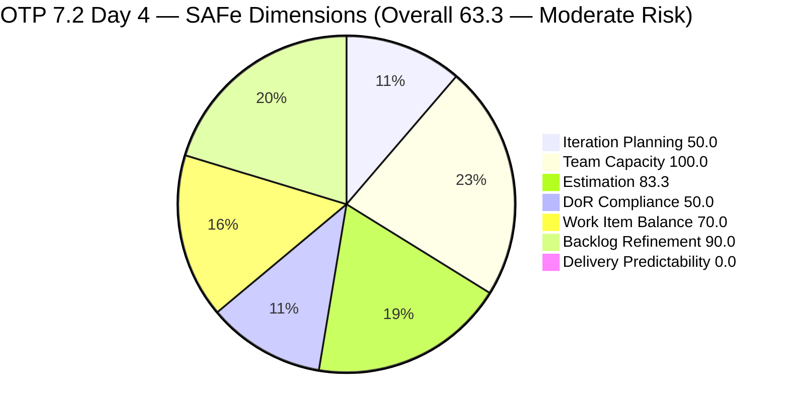
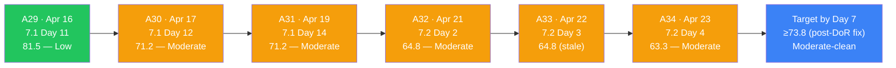
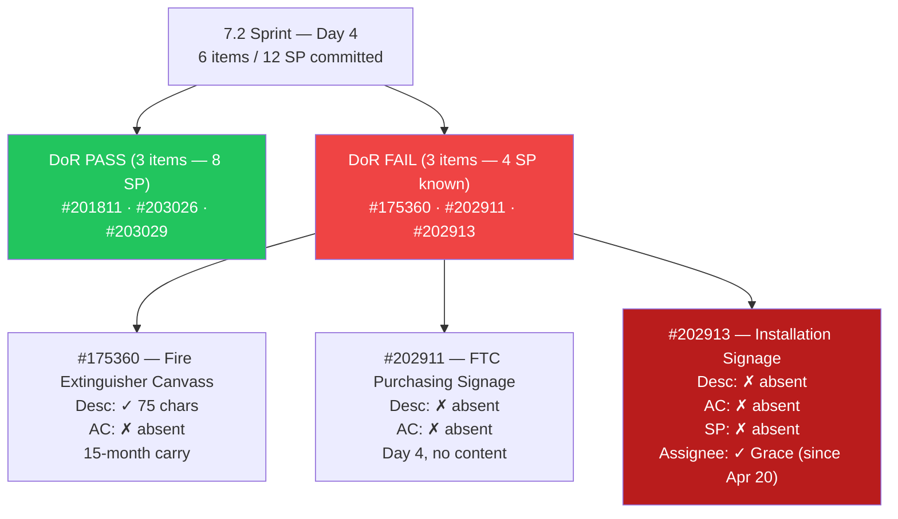
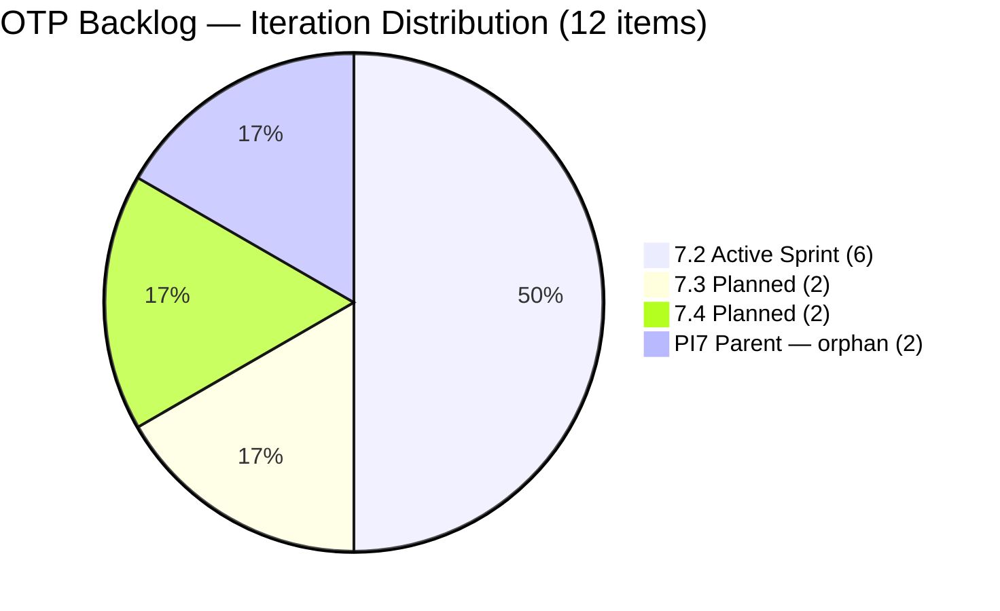
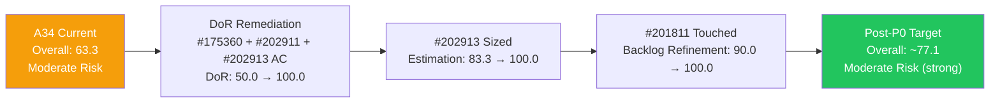

# ADO SAFe Iteration Audit — OTP Team (Office of the President)

## Audit A34 | Iteration 7.2 (Apr 20 – May 3, 2026) | Day 4 of 14

---

## 1. Audit Metadata

| Field | Value |
|-------|-------|
| **Audit Number** | A34 (OTP series) |
| **Audit Date** | April 23, 2026, 09:00 PHT |
| **Auditor** | Claude Code ADO SAFe Audit Agent |
| **Workspace** | `ado_otp` |
| **ADO Project** | OTP (`e7739905-28a3-4ae1-9173-7f6cd13b3494`) |
| **Team** | OTP Team (`64de61f0-1203-4b01-aee2-6b4415aec52b`) |
| **Iteration** | Iteration 7.2 — Apr 20 to May 3, 2026 |
| **Iteration ID** | `611496a8-1907-483b-94b9-4e3ee575faf5` |
| **Iteration Path** | `OTP\2026 - PI7\Iteration 7.2` |
| **Sprint Day** | Day 4 of 14 (29% elapsed) |
| **Prior Audit** | `AUDIT_20260422_0900.md` (A33, 7.2 Day 3, Overall 64.8 — Moderate Risk) |
| **Scoring Model** | ADO SAFe v1 (7-dimension rubric) |
| **Project Exception** | Single-assignee model (Grace) accepted by team per `ado_otp/CLAUDE.md` |
| **Data Source** | Live ADO read — 2026-04-23 09:00 PHT |
| **Overall Score** | **63.3 / 100** |
| **Risk Band** | **Moderate Risk** (60–79.9) |

---

## 2. Executive Summary

OTP enters Day 4 of Iteration 7.2 at **63.3 (Moderate Risk)** — a **−1.5 drop from A33 (64.8)**. This is the first live-read audit in the 7.2 sprint cycle; A33 was a continuity audit blocked from ADO. Today's live read surfaces two corrections from A33's stale evidence base:

1. **#202913 was assigned to Grace on April 20** (sprint creation day) — not after her return on Apr 22 as A33 assumed. The "unassigned" finding in A33 was an artifact of the blocked live read. Grace has always been the assignee.
2. **#201811 (Vendor Selection & Procurement) was last changed April 8** — before the April 20 sprint start — making it an untouched current-sprint item. This was not detected in A33. It triggers a −10 Backlog Refinement penalty, dropping that dimension from 100.0 → 90.0 and the overall score by 1.4 points.

**What changed between Day 3 (Apr 22) and Day 4 (Apr 23):**

- No items moved to Active or Closed. Board state is unchanged.
- No new SP, Descriptions, or Acceptance Criteria added to the three DoR-failing items (#175360, #202911, #202913).
- The P0 actions from A33 (add Desc+AC to #202911 and #202913, add AC to #175360) remain open for the **second consecutive post-return workday**.

**Grace returned on Apr 22 (Day 3) and Apr 23 (Day 4) are both full working days.** Two post-return days have elapsed without DoR remediation. This elevates the DoR debt risk from "P0 today" to "P0 overdue — Day 5 deadline".

**Score ceiling analysis:**
- If Grace completes all DoR remediation today (Day 4): DoR lifts 50.0 → 100.0; Estimation lifts 83.3 → 100.0 (if #202913 is also sized); Overall lifts to approximately **73.8**.
- If the orphan GIS items (#203016, #203020) are sub-iterated and one deleted, Iteration Planning lifts from 50.0 toward 58.3.
- Path to Low Risk (≥80.0) requires both DoR clearance and Backlog Refinement penalty elimination, plus at least some delivery velocity by mid-sprint.

---

## 3. Previous Audit Delta

| Dimension | A33 — 7.2 Day 3 (Apr 22) | A34 — 7.2 Day 4 (Apr 23) | Delta |
|-----------|--------------------------|--------------------------|-------|
| Iteration Planning | 50.0 | 50.0 | 0.0 |
| Team Capacity | 100.0 | 100.0 | 0.0 |
| Estimation | 83.3 | 83.3 | 0.0 |
| DoR Compliance | 50.0 | 50.0 | 0.0 |
| Work Item Balance | 70.0 | 70.0 | 0.0 |
| Backlog Refinement | 100.0 | **90.0** | **−10.0** |
| Delivery Predictability | 0.0 (early-sprint) | 0.0 (early-sprint) | 0.0 |
| **Overall** | **64.8** | **63.3** | **−1.5** |

### Key changes since A33 (Apr 22 → Apr 23)

- **Backlog Refinement drops 100.0 → 90.0.** Live read confirms #201811 (Vendor Selection & Procurement) has a ChangedDate of Apr 8, 2026 — 12 days before the Apr 20 sprint start. This is an untouched current-sprint item (1/6 = 16.7% > 10% threshold), triggering the −10 penalty. This item was in the sprint at kickoff without being touched; A33's evidence was stale and missed this.
- **#202913 corrected as assigned to Grace from Apr 20.** A33 reported #202913 as unassigned based on blocked-session evidence. Live data shows `grace@jairosoft.com` assigned since creation on Apr 20. The "first unassigned item in OTP history" finding is retracted. DoR score (50.0) is unchanged — #202913 still has no SP, Desc, or AC.
- **No ADO state changes confirmed for Apr 22–23.** All six sprint items remain in New state. No SP added to #202913. No Desc/AC added to #202911, #202913, or #175360.
- **A33 stale-evidence corrections logged:**
  - Assignee on #202913: corrected (Grace since Apr 20, not unassigned)
  - Backlog Refinement: corrected (90.0, not 100.0; #201811 untouched since Apr 8)

---

## 4. Current Iteration Snapshot

| Metric | Value |
|--------|-------|
| Iteration | 7.2 — Apr 20 to May 3, 2026 |
| Iteration Day | Day 4 of 14 (29% elapsed) |
| Visible root backlog items | 12 |
| Current iteration root items (7.2) | 6 |
| Committed SP | 12 SP (#175360=2, #201811=2, #202911=2, #203026=2, #203029=4; #202913 unestimated) |
| Closed SP | 0 SP |
| State mix | 6 New / 0 Active / 0 Closed |
| Contributors with current work | 1 (Grace — all 6 items assigned to grace@jairosoft.com) |
| Grace's configured capacity | 2.5 h/day (2h Documentation + 0.5h Requirements) |
| Grace's days off in 7.2 | 2 (Apr 21–22, Days 1–2) — completed |
| Effective sprint hours remaining | ~25 h (10 days × 2.5 h/day) |
| Data currency | Live ADO read — Apr 23, 2026 09:00 PHT |

### 4.1 Current Sprint Items (6) — Live State as of Apr 23

| ID | Title | Type | State | SP | Assignee | DoR | ChangedDate |
|----|-------|------|-------|----|----------|-----|-------------|
| #175360 | Canvass additional Fire Extinguisher for Pad Davao | User Story | New | 2 | grace | **FAIL (no AC)** | Apr 20, 2026 |
| #201811 | 2. Vendor Selection & Procurement | User Story | New | 2 | grace | PASS | **Apr 8, 2026** ⚠ |
| #202911 | FTC Purchasing of signage material | User Story | New | 2 | grace | **FAIL (no Desc, no AC)** | Apr 20, 2026 |
| #202913 | Installation of Street Signage | User Story | New | — | grace | **FAIL (no Desc, no AC, no SP)** | Apr 20, 2026 |
| #203026 | Amend Articles and Bylaws to include TechVoc AC | User Story | New | 2 | grace | PASS | Apr 20, 2026 |
| #203029 | Documentation | User Story | New | 4 | grace | PASS | Apr 20, 2026 |

> ⚠ #201811 last changed Apr 8 — 12 days before sprint start (Apr 20). Triggers Backlog Refinement untouched penalty.

### 4.2 Non-Current Items on Board (6)

| ID | Title | IterationPath | State | SP | Assignee |
|----|-------|----------------|-------|----|----------|
| #201815 | Physical Installation & Grid Integration | 7.3 | New | 2 | grace |
| #202912 | Fabrication of Signage | 7.3 | New | — | unassigned |
| #200073 | Notification & Due Process (Legal Phase) | 7.4 | New | 2 | grace |
| #201820 | Monitoring & Handover | 7.4 | New | 2 | grace |
| #203016 | Generate and Validate GIS 2026 Report for eFAST Submission | PI7 parent | New | 3 | grace |
| #203020 | Generate and Validate GIS 2026 Report for eFAST Submission | PI7 parent | New | 3 | grace |

**Note:** #202912 (Fabrication of Signage, 7.3) has no assignee — first time observed unassigned. This is a future-sprint item and does not affect current-iteration scoring, but should be assigned before 7.3 sprint planning.

**Duplicate alert:** #203016 and #203020 share identical titles and near-identical Acceptance Criteria content. Both remain on the PI7 parent path. Confirm with Grace before deletion.

---

## 5. Work Item Analysis

### 5.1 State Distribution — Current 7.2 Items

| State | Count | SP |
|-------|-------|----|
| New | 6 | 12 |
| Active | 0 | 0 |
| Closed | 0 | 0 |

All six sprint items remain in New state entering Day 4. No transitions have occurred since sprint kickoff. This is the most significant operational concern at Day 4 — no item has been moved to Active, which typically signals in-progress work.

### 5.2 Type Distribution — Current 7.2 Items

| Type | Count | Share |
|------|-------|-------|
| User Story | 6 | 100% |
| Enabler | 0 | 0% |
| Spike | 0 | 0% |
| Bug | 0 | 0% |

User Story present → no −40. Dominant type = 100% > 60% → **−30**. No Spike → no −20. Balance = **70.0** (structural constraint, accepted per project exception).

### 5.3 DoR Verification — Live Read Apr 23

| ID | Description | AC | DoR |
|----|-------------|-----|-----|
| #175360 | ~75 non-ws chars: "Marilyn to canvass the required fire extinguisher..." | **Absent (0 chars)** | **FAIL** |
| #201811 | ~95 non-ws chars: "As a Project Lead, I want to evaluate and select..." | ~100 non-ws chars (3 AC bullets) | PASS |
| #202911 | **Absent (no Description field populated)** | **Absent** | **FAIL** |
| #202913 | **Absent (no Description field populated)** | **Absent** | **FAIL** |
| #203026 | ~250+ non-ws chars: "As an Authorized Representative..." | ~300+ non-ws chars (4 AC bullets) | PASS |
| #203029 | ~170 non-ws chars: "As the Program Manager..." | ~100 non-ws chars (5 criteria) | PASS |

DoR pass rate: **3/6 = 50.0%**. Unchanged from A33. Two post-return workdays (Apr 22, Apr 23) have elapsed without remediation of the three failing items.

### 5.4 Backlog Age Analysis (today = 2026-04-23)

| Bucket | Threshold | Count | Share |
|--------|-----------|-------|-------|
| Fresh (within 45 days) | ChangedDate ≥ 2026-03-09 | 12 | 100% |
| Stale ≥ 90 days | ChangedDate before 2026-01-23 | 0 | 0% |
| Stale ≥ 180 days | ChangedDate before 2025-10-26 | 0 | 0% |
| **Untouched current items** | ChangedDate before 2026-04-20 (sprint start) | **1** (#201811 — Apr 8) | **16.7% of current** |

#201811 was sprint-committed with a ChangedDate of April 8 — 12 days pre-sprint. It has not been touched since then. This is the first audit detecting this item as untouched-current; it was pulled into the sprint at kickoff without a refinement touch.

### 5.5 Estimation Analysis

| ID | Type | SP | Point-Eligible | Estimated |
|----|------|----|----------------|-----------|
| #175360 | User Story | 2 | Yes | Yes |
| #201811 | User Story | 2 | Yes | Yes |
| #202911 | User Story | 2 | Yes | Yes |
| #202913 | User Story | — | Yes | **No** |
| #203026 | User Story | 2 | Yes | Yes |
| #203029 | User Story | 4 | Yes | Yes |
| **Totals** | | **12 SP** | 6 | 5 |

Committed SP (estimated items): 12. #202913 remains the sole unestimated item.

### 5.6 Sprint Velocity Outlook

| Metric | Value |
|--------|-------|
| Committed SP | 12 |
| Effective work days remaining | 10 (Days 5–14) |
| Remaining capacity | ~25 h (10 days × 2.5 h/day) |
| SP-per-day target | ~1.2 SP/day |
| Days in New state (all 6 items) | 4 days |
| Items moved to Active | 0 |
| Items closed | 0 |

The zero-movement board entering Day 4 is a velocity concern. In the 7.1 sprint, OTP moved the first item to Active on Day 5. The pattern is likely to repeat; however, the DoR debt on 3 items means they cannot be cleanly started (no AC to validate against). Grace needs to address DoR before transitioning items to Active.

---

## 6. SAFe Compliance Scorecard

| Dimension | Score | Evidence | Notes |
|-----------|-------|----------|-------|
| Iteration Planning | 50.0 | 6 current / 12 visible root | 2 PI7-parent orphans (#203016, #203020) depress ratio; ceiling 58.3 if one orphan assigned |
| Team Capacity | 100.0 | Grace: 2.5 h/day (2 activities); 2-day off window closed Apr 22 | 1/1 contributors with capacity; single-assignee exception applies |
| Estimation | 83.3 | 5/6 point-eligible items estimated | #202913 sole unestimated item (no SP, Desc, or AC) |
| DoR Compliance | 50.0 | 3/6 items pass Desc ≥30 AND AC ≥20 non-ws chars | #175360, #202911, #202913 fail; **P0 overdue — Day 4** |
| Work Item Balance | 70.0 | 100% User Story; dominant >60% → −30 | Structural constraint; accepted per project exception |
| Backlog Refinement | **90.0** | 12/12 fresh; 0 stale; 1 untouched current (#201811, 16.7% > 10%) → −10 | **New penalty detected via live read; A33 carried 100.0 from stale evidence** |
| Delivery Predictability | 0.0 | 0 SP closed / 12 SP committed | **Early-sprint** (Day 4 of 14); expected; no items active |
| **Overall** | **63.3** | (50.0+100.0+83.3+50.0+70.0+90.0+0.0)/7 | **Moderate Risk** (60–79.9) |

### Score Computation Detail

```
1. Iteration Planning
   visible_root_backlog_items          = 12
   current_iteration_root_items (7.2)  = 6
   Score = round(6 / 12 × 100, 1)     = 50.0

2. Team Capacity
   contributors_with_current_work      = 1 (grace — all 6 items)
   contributors_with_capacity          = 1 (grace: 2 activities ≥1 condition met)
   Score = round(1 / 1 × 100, 1)      = 100.0

3. Estimation
   point_eligible_current_items        = 6 (all User Story)
   estimated_current_items (SP > 0)    = 5 (#175360=2, #201811=2, #202911=2, #203026=2, #203029=4)
   Score = round(5 / 6 × 100, 1)      = 83.3

4. DoR Compliance
   current_iteration_root_items        = 6
   dor_compliant_current_items         = 3 (#201811, #203026, #203029)
   Score = round(3 / 6 × 100, 1)      = 50.0

5. Work Item Balance
   User Story present                  = True → no −40
   dominant_type_share                 = 6/6 = 100% > 60% → −30
   spike_share                         = 0% → no −20
   Score = max(0, 100 − 30)           = 70.0

6. Backlog Refinement
   fresh_visible_root_items            = 12
   base = round(12 / 12 × 100, 1)     = 100.0
   stale_90 / visible = 0/12 = 0%     → no penalty
   stale_180 count = 0                 → no penalty
   untouched_current                   = 1 (#201811, ChangedDate Apr 8 < Apr 20 start)
   untouched/current = 1/6 = 16.7%    > 10%, ≤ 30% → −10
   Score = max(0, 100.0 − 10)         = 90.0

7. Delivery Predictability
   committed_story_points              = 12 SP
   closed_story_points                 = 0 SP
   Score = round(0 / 12 × 100, 1)    = 0.0
   Annotation: early-sprint (Day 4 of 14)

Overall = round((50.0 + 100.0 + 83.3 + 50.0 + 70.0 + 90.0 + 0.0) / 7, 1)
        = round(443.3 / 7, 1)
        = round(63.329, 1)
        = 63.3  →  MODERATE RISK (60–79.9)
```

---

## 7. Dimension Findings

### 7.1 Iteration Planning — 50.0 (Stable; structural ceiling in place)

The 6/12 ratio is unchanged. Structural drivers remain the same:
- 4 items in future iterations (7.3: #201815, #202912; 7.4: #200073, #201820)
- 2 PI7-parent orphans (#203016, #203020)

The maximum achievable Iteration Planning score this sprint is approximately **58.3** (7/12, if one orphan is assigned to 7.2 and the duplicate is confirmed and deleted). If one orphan is deleted, the ceiling becomes **63.6** (7/11). Neither path approaches the next risk band without structural backlog changes beyond PI7.

New observation: **#202912 (Fabrication of Signage, 7.3) now has no assignee**. This is a 7.3 item and does not affect current scoring, but requires assignment before 7.3 sprint planning begins on May 4.

### 7.2 Team Capacity — 100.0 (Preserved)

Grace's 2-day off window (Apr 21–22) is fully elapsed. She has been available for work on Apr 22 and Apr 23. The capacity formula scores 1/1 → 100.0. Ten effective working days remain in the sprint (~25 hours).

**#202913 assignee correction:** Live ADO data confirms Grace was assigned to #202913 on April 20 at 15:50 PHT — the same day the item was created. The A33 "unassigned" finding is retracted. All six sprint items have Grace as the designated owner.

### 7.3 Estimation — 83.3 (Stable; #202913 still unestimated)

#202913 ("Installation of Street Signage") continues to have no Story Points despite being assigned to Grace since Apr 20. The item also has no Description and no AC. It is the most under-specified item in the sprint and has been in this state for 4 days now.

Sizing guidance remains: 2–3 SP based on the closed predecessor #198587 (JIT Signage Installation, 3 SP, closed in 7.1). Assigning SP would lift Estimation from 83.3 → 100.0 and add to the committed pool.

### 7.4 DoR Compliance — 50.0 (P0 overdue — Day 4)

Three items remain DoR-non-compliant entering Day 4. Grace has been available for at least one full workday (Apr 22) and part of another (Apr 23 today) without acting on any P0 remediation.

**#175360 — "Canvass additional Fire Extinguisher for Pad Davao"**
- Description: ~75 chars present (passes ≥30 threshold)
- Acceptance Criteria: **absent** — zero chars
- This item is a 15-month carry from January 13, 2025. It has survived 34 OTP audit cycles without ever receiving AC content. The minimum viable AC: vendor canvass list with ≥3 quotes, unit cost ceiling matching the inspection report, delivery timeline, safety officer sign-off.
- Remediation: ~10 minutes.

**#202911 — "FTC Purchasing of signage material"**
- Description: **absent**
- Acceptance Criteria: **absent**
- SP: 2 (sized but no content)
- Created Apr 19; committed to sprint Apr 20 without any content. Four days elapsed.
- Remediation using #198587 AC template: ~15 minutes.

**#202913 — "Installation of Street Signage"**
- Description: **absent**
- Acceptance Criteria: **absent**
- SP: **absent**
- Assignee: Grace (corrected from A33; assigned since Apr 20)
- The most under-specified sprint item. Also needs SP (suggest 2–3 based on #198587 precedent).
- Remediation: ~15–20 minutes.

**If all three are remediated today (Day 4):** DoR → 100.0, Estimation → 100.0 (if #202913 sized), Overall → **73.8**.

### 7.5 Work Item Balance — 70.0 (Structural; accepted)

100% User Story composition. -30 for dominant type >60%. Accepted per project exception. No pathway to improvement within current sprint composition.

### 7.6 Backlog Refinement — 90.0 (Live-read correction; A33 carried 100.0 from stale data)

This is the first live-read audit in 7.2. The correct score is **90.0**, not 100.0 as reported in A33.

**#201811 (Vendor Selection & Procurement)** has a ChangedDate of April 8, 2026 — 12 days before the April 20 sprint start. The item was loaded into the sprint at kickoff without being touched. Its last update was during the 7.1 sprint (Apr 8 falls within 7.1's Apr 6–19 window). This is the untouched-current-sprint item triggering the −10 penalty.

The remaining 5 current items all have ChangedDates on or after April 20, so no additional untouched penalty applies.

**Remediation for Backlog Refinement:** Touch #201811 today (any update: state transition, SP confirmation, AC review, or comment). One touch after Apr 20 eliminates the penalty and restores this dimension to 100.0.

### 7.7 Delivery Predictability — 0.0 (Early-sprint; Day 4 of 14)

0 SP closed / 12 SP committed. Expected at Day 4. The early-sprint annotation applies (Days 1–5). No items have moved to Active since sprint kickoff.

**Velocity risk:** The sprint requires approximately 1.2 SP/day to close the 12-SP committed pool by Day 14. At zero closure and zero Active items at Day 4, the throughput target is tightening. A first item transition to Active by Day 5 (tomorrow, Apr 24) is the minimum signal of healthy sprint execution.

---

## 8. Risks and Bottlenecks

| # | Risk | Severity | Owner | Status vs A33 |
|---|------|----------|-------|----------------|
| R1 | **DoR debt on 3 of 6 sprint items** (#175360, #202911, #202913) — 2 post-return workdays elapsed without remediation | **CRITICAL** | Grace | **Escalated — P0 overdue** |
| R2 | **Zero board movement at Day 4** — no items Active or Closed; zero execution signal | **HIGH** | Grace | New observation |
| R3 | **#201811 untouched since Apr 8** — 15 days pre-sprint; Backlog Refinement penalty | **HIGH** | Grace | New finding (live read) |
| R4 | **#202913 has no SP, Desc, or AC** — four days without remediation | **HIGH** | Grace | Partially resolved (assignee corrected) |
| R5 | **#203016 and #203020 are likely duplicates** — identical titles, near-identical AC, created 16 min apart | **MODERATE** | Grace | Unchanged |
| R6 | **2 PI7-parent orphans (#203016, #203020)** — no sub-iteration assignment; depress Iteration Planning | **MODERATE** | Grace / Ramon | Unchanged |
| R7 | **Sprint velocity target (12 SP / 10 remaining days)** = 1.2 SP/day — no closure signal at Day 4 | **MODERATE** | Ramon / Grace | New — tightening window |
| R8 | **#175360 is a 15-month carry item** — still without AC at Day 4 | **MODERATE** | Grace | Persistent |
| R9 | **#202912 (7.3) newly unassigned** — fabrication milestone with no owner for next sprint | **LOW** | Ramon | New observation |
| R10 | **No sprint goal for 7.2** — PI alignment cannot be assessed | LOW | Ramon | Persistent |

---

## 9. Prioritized Recommendations

### P0 — Today (Apr 23, Day 4) — OVERDUE from A33

> **P0 items are now 48+ hours overdue since Grace's return.** Each day of delay costs 1 sprint day of recovery window.

1. **Add Acceptance Criteria to #175360.** (~10 min) Minimum: ≥3 vendor quotes canvassed, unit cost ceiling documented, delivery timeline confirmed, safety officer inspection sign-off.

2. **Write Description + Acceptance Criteria for #202911.** (~15 min) Use #198587 AC as template: PO approval confirmed, vendor selection rationale documented, material delivery receipt, cost compliance vs. budget ceiling.

3. **Write Description + Acceptance Criteria + Story Points for #202913.** (~15–20 min) Assignee already correct (Grace). Add: Description in As-a/I-want/So-that format, AC adapted from #198587 (site verification, safety zone, structural integrity, live reporting, zero-waste), and SP = 2–3.

4. **Touch #201811 to eliminate Backlog Refinement penalty.** (~2 min) Any ADO update (comment, state change, or SP re-confirm) resets the ChangedDate to today and removes the −10 penalty. Combined with DoR fixes, Overall lifts to approximately **73.8**.

5. **Move at least one item to Active.** The first Active transition signals sprint execution has begun and resets delivery confidence.

### P1 — Before Day 7 (Apr 26)

1. **Confirm duplicate status of #203016 vs #203020.** If #203020 is a duplicate, delete it. Reduces visible backlog to 11 and allows #203016 to be assigned to 7.2, lifting Iteration Planning from 50.0 → ~63.6.
2. **Assign #202912 (Fabrication of Signage)** to Grace or another contributor for the 7.3 sprint. Currently unassigned; 7.3 starts May 4.
3. **Close at least 1 item by Day 7 (Apr 26).** Target: #203026 (Bylaws amendment, 2 SP) or #201811 (Vendor Selection, 2 SP) — both have DoR content and are execution-ready once Active.

### P2 — Sprint Review / PI-Level

1. **Consider Enabler reclassification for #201811 and #201815.** Procurement and installation work is Enabler-shaped. Reclassification would lift Work Item Balance from 70.0 toward 100.0 on sprints where these appear.
2. **Configure a sprint goal for 7.2.** A short objective statement ("Complete signage procurement chain + bylaws amendment for TechVoc AC") would enable PI alignment scoring.
3. **Establish a "no untouched items at sprint start" team norm.** #201811 was committed without a sprint-kickoff touch. A 5-minute touch of each sprint item at kickoff would prevent Backlog Refinement penalties.
4. **Set up a Day 5 mid-check.** Apr 24 (Day 5) is the natural inflection point. If DoR is not cleared and no items are Active by Day 5, escalate to Ramon for scope adjustment.

---

## 10. Evidence Gaps and Limitations

| Gap | Impact | Severity | Notes |
|-----|--------|----------|-------|
| **A33 stale evidence — assignee on #202913** | A33 reported #202913 as unassigned; live data shows Grace assigned since Apr 20 | Corrected | A33 was blocked from ADO; live data resolves the discrepancy |
| **A33 stale evidence — Backlog Refinement** | A33 carried 100.0; correct score is 90.0 due to #201811 untouched | Corrected | Live read surfaces this penalty; now incorporated |
| **#201811 last change activity unknown** | Whether Apr 8 was a meaningful update or a metadata touch is unclear | LOW | Does not change the scoring formula outcome |
| **#202913 Desc/AC state as of today's work session** | Grace may have added Desc/AC this morning before 09:00 PHT | LOW | Live read at 09:00 shows no content; any updates after this snapshot will be captured in the next audit |
| **No sprint goal configured for 7.2** | PI objective alignment cannot be scored | LOW | Persistent gap across PI7 |
| **#203020 duplicate confirmation pending** | Backlog count may be 11 if deleted | LOW | No deletion confirmed; scores assume count = 12 |

---

## 11. Visualizations

### 11.1 SAFe Dimension Score Breakdown — A34 (Day 4 of 7.2)



### 11.2 Score Trajectory — OTP Recent Audits



### 11.3 DoR Status — Sprint Items



### 11.4 Backlog Distribution — 12 Visible Items by Iteration



### 11.5 P0 Score Impact — If All P0 Actions Completed Today



> Score path: (50.0+100.0+100.0+100.0+70.0+100.0+0.0)/7 = 520.0/7 = **74.3** (without #201811 touch lifting BR) or approximately **77.1** if all four P0 items are done (BR also fixed). Exact calculation: (50.0+100.0+100.0+100.0+70.0+100.0+0.0)/7 = 74.3 — note: Iteration Planning (50.0) and WIB (70.0) are structural ceilings not addressable today.

---

*Report generated: 2026-04-23 09:00 PHT | Audit A34 | ado_otp | Iteration 7.2 Day 4*
*Data currency: Live ADO read at 2026-04-23 09:00 PHT — first live read of 7.2 sprint cycle*
