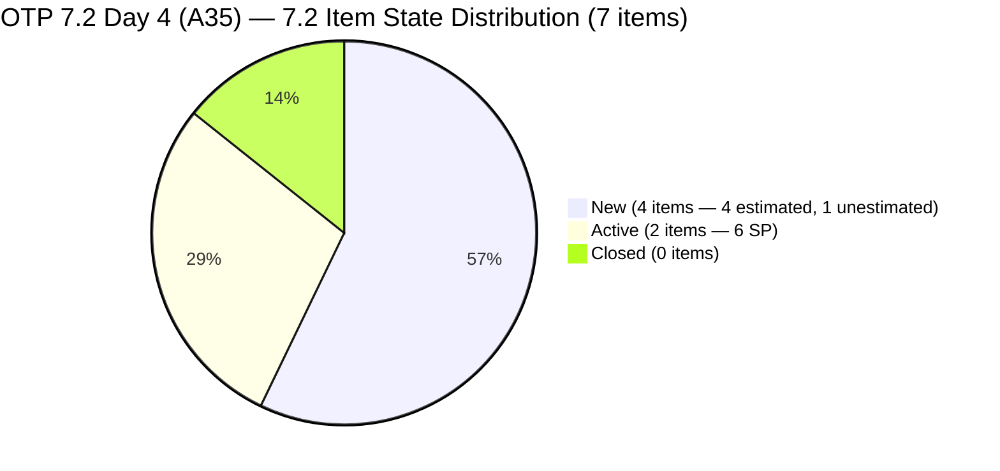
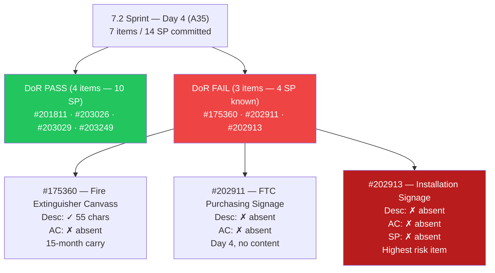
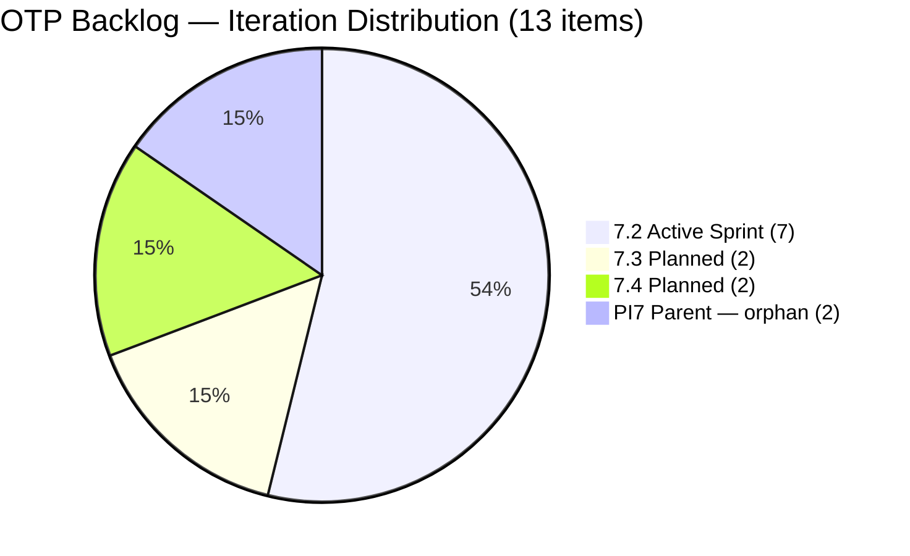
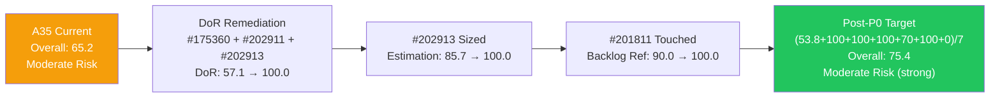

# ADO SAFe Iteration Audit — OTP Team (Office of the President)

## Audit A35 | Iteration 7.2 (Apr 20 – May 3, 2026) | Day 4 of 14

---

## 1. Audit Metadata

| Field | Value |
|-------|-------|
| **Audit Number** | A35 (OTP series) |
| **Audit Date** | April 23, 2026, 11:00 PHT |
| **Auditor** | Claude Code ADO SAFe Audit Agent |
| **Workspace** | `ado_otp` |
| **ADO Project** | OTP (`e7739905-28a3-4ae1-9173-7f6cd13b3494`) |
| **Team** | OTP Team (`64de61f0-1203-4b01-aee2-6b4415aec52b`) |
| **Iteration** | Iteration 7.2 — Apr 20 to May 3, 2026 |
| **Iteration ID** | `611496a8-1907-483b-94b9-4e3ee575faf5` |
| **Iteration Path** | `OTP\2026 - PI7\Iteration 7.2` |
| **Sprint Day** | Day 4 of 14 (29% elapsed) |
| **Prior Audit** | `AUDIT_20260423_0900.md` (A34, 7.2 Day 4, Overall 63.3 — Moderate Risk) |
| **Scoring Model** | ADO SAFe v1 (7-dimension rubric) |
| **Project Exception** | Single-assignee model (Grace) accepted by team per `ado_otp/CLAUDE.md` |
| **Data Source** | Live ADO read — 2026-04-23 11:00 PHT |
| **Overall Score** | **65.2 / 100** |
| **Risk Band** | **Moderate Risk** (60–79.9) |

---

## 2. Executive Summary

OTP moves to **65.2 (Moderate Risk)** at Day 4 of Iteration 7.2, a **+1.9 improvement from A34 (63.3)**. The session between the 0900 and 1100 audits produced meaningful sprint activity:

1. **Three items moved to Active:** #203026 (Bylaws Amendment), #203029 (Documentation), and #203020 (GIS Report, PI7 parent) were transitioned to Active state at approximately 03:29–03:30 PHT on Apr 23. This is the first board movement of the sprint — a positive execution signal arriving on Day 4.

2. **One new 7.2 item added (#203249):** "AI Integration & Competency Mapping" (2 SP) was created and committed to Iteration 7.2 at 05:23 PHT on Apr 23. It is fully DoR-compliant on creation (Description + AC both present). This adds 2 SP to the committed pool (now 14 SP) and one DoR-pass to the denominator.

3. **DoR debt partially improved:** With #203249 as a fourth passing item, DoR compliance rises from 50.0 → 57.1 (4/7). However, three items (#175360, #202911, #202913) remain DoR-non-compliant and are now entering their third day without remediation since Grace's return.

4. **#201811 untouched-current penalty persists:** Despite three other items being touched today, #201811 (Vendor Selection, last changed Apr 8) was not updated. The Backlog Refinement penalty (−10) remains. A single touch of this item would lift Backlog Refinement to 100.0.

5. **Score ceiling analysis (if all P0 actions completed today):**
   - DoR 57.1 → 100.0 (all 3 failing items remediated)
   - Estimation 85.7 → 100.0 (#202913 sized)
   - Backlog Refinement 90.0 → 100.0 (#201811 touched)
   - Delivery Predictability 0.0 (no closed items yet)
   - Post-P0 ceiling: **(53.8 + 100.0 + 100.0 + 100.0 + 70.0 + 100.0 + 0.0) / 7 = 75.4**

---

## 3. Previous Audit Delta

| Dimension | A34 — 7.2 Day 4 (09:00 PHT) | A35 — 7.2 Day 4 (11:00 PHT) | Delta |
|-----------|------------------------------|------------------------------|-------|
| Iteration Planning | 50.0 | **53.8** | **+3.8** |
| Team Capacity | 100.0 | 100.0 | 0.0 |
| Estimation | 83.3 | **85.7** | **+2.4** |
| DoR Compliance | 50.0 | **57.1** | **+7.1** |
| Work Item Balance | 70.0 | 70.0 | 0.0 |
| Backlog Refinement | 90.0 | 90.0 | 0.0 |
| Delivery Predictability | 0.0 (early-sprint) | 0.0 (early-sprint) | 0.0 |
| **Overall** | **63.3** | **65.2** | **+1.9** |

### Key changes since A34 (09:00 → 11:00 PHT, Apr 23)

- **#203026 and #203029 moved to Active** (ChangedDate Apr 23 at ~03:29–03:30 PHT). Two execution-ready 7.2 items now show in-progress state. Combined SP in Active: 6 SP (203026=2, 203029=4). This is the sprint's first Active transition signal.
- **#203020 moved to Active** (PI7 parent path, ChangedDate Apr 23 at ~03:29 PHT). This item is not in the 7.2 iteration path; it does not affect current-iteration scoring dimensions, but signals parallel work by Grace.
- **#203249 "AI Integration & Competency Mapping" added to 7.2** (ChangedDate Apr 23 at 05:23 PHT, SP=2, DoR PASS). Visible backlog grows from 12 → 13; current 7.2 items grow from 6 → 7; committed SP grows from 12 → 14.
- **DoR lifts 50.0 → 57.1** due to #203249's clean creation. Three existing DoR failures remain unchanged.
- **Estimation lifts 83.3 → 85.7** (6/7 estimated, #202913 still the sole gap).
- **Iteration Planning lifts 50.0 → 53.8** (7/13; new numerator from #203249; new denominator from same item).
- **#201811 still unchanged since Apr 8.** No touch recorded. Backlog Refinement penalty remains.

---

## 4. Current Iteration Snapshot

| Metric | Value |
|--------|-------|
| Iteration | 7.2 — Apr 20 to May 3, 2026 |
| Iteration Day | Day 4 of 14 (29% elapsed) |
| Visible root backlog items | 13 |
| Current iteration root items (7.2) | 7 |
| Committed SP (estimated 7.2 items) | 14 SP |
| Active SP (items in Active state) | 6 SP (#203026=2, #203029=4) |
| Closed SP | 0 SP |
| State mix (7.2 items) | 4 New / 2 Active / 0 Closed |
| Contributors with current work | 1 (Grace — all 7 items assigned to grace@jairosoft.com) |
| Grace's configured capacity | 2.5 h/day (2h Documentation + 0.5h Requirements) |
| Grace's days off in 7.2 | 2 (Apr 21–22, Days 1–2) — completed |
| Effective sprint days remaining | 10 (Days 5–14) |
| Remaining capacity | ~25 h |
| Data currency | Live ADO read — Apr 23, 2026 11:00 PHT |

### 4.1 Current Sprint Items (7) — Live State as of Apr 23 11:00

| ID | Title | Type | State | SP | Assignee | DoR | ChangedDate |
|----|-------|------|-------|----|----------|-----|-------------|
| #175360 | Canvass additional Fire Extinguisher for Pad Davao | User Story | New | 2 | grace | **FAIL (no AC)** | Apr 20, 2026 |
| #201811 | 2. Vendor Selection & Procurement | User Story | New | 2 | grace | PASS | **Apr 8, 2026 ⚠** |
| #202911 | FTC Purchasing of signage material | User Story | New | 2 | grace | **FAIL (no Desc, no AC)** | Apr 20, 2026 |
| #202913 | Installation of Street Signage | User Story | New | — | grace | **FAIL (no Desc, no AC, no SP)** | Apr 20, 2026 |
| #203026 | Amend Articles and Bylaws to include TechVoc AC | User Story | **Active** | 2 | grace | PASS | **Apr 23, 2026** |
| #203029 | Documentation | User Story | **Active** | 4 | grace | PASS | **Apr 23, 2026** |
| #203249 | AI Integration & Competency Mapping | User Story | New | 2 | grace | **PASS** | **Apr 23, 2026 (NEW)** |

> ⚠ #201811 last changed Apr 8 — 12 days before sprint start (Apr 20). Triggers Backlog Refinement untouched penalty (16.7% > 10% threshold → −10).

### 4.2 Non-Current Items on Board (6)

| ID | Title | IterationPath | State | SP | Assignee |
|----|-------|----------------|-------|----|----------|
| #201815 | Physical Installation & Grid Integration | 7.3 | New | 2 | grace |
| #202912 | Fabrication of Signage | 7.3 | New | — | unassigned |
| #200073 | Notification & Due Process (Legal Phase) | 7.4 | New | 2 | grace |
| #201820 | Monitoring & Handover | 7.4 | New | 2 | grace |
| #203016 | Generate and Validate GIS 2026 Report for eFAST Submission | PI7 parent | New | 3 | grace |
| #203020 | Generate and Validate GIS 2026 Report for eFAST Submission | PI7 parent | **Active** | 3 | grace |

**#203020 now Active** (PI7 parent — does not score in current-iteration dimensions). The item appears to be duplicate of #203016 (same title, near-identical AC). With #203020 now Active while #203016 remains New, a deduplication decision is more urgent.

**#202912 still unassigned** — a 7.3 item that needs an owner before May 4 sprint planning.

---

## 5. Work Item Analysis

### 5.1 State Distribution — Current 7.2 Items

| State | Count | SP |
|-------|-------|----|
| New | 4 | 6 (estimated: #175360=2, #201811=2, #202911=2; #202913=0) |
| Active | 2 | 6 (#203026=2, #203029=4) |
| Closed | 0 | 0 |

First Active transitions of the sprint recorded. Two execution-ready items (#203026 Bylaws, #203029 Documentation) are now in progress. The remaining New items include three with DoR failures — these should not transition to Active until DoR is resolved.

### 5.2 Type Distribution — Current 7.2 Items

| Type | Count | Share |
|------|-------|-------|
| User Story | 7 | 100% |
| Enabler | 0 | 0% |
| Spike | 0 | 0% |
| Bug | 0 | 0% |

User Story present → no −40. Dominant type = 100% > 60% → **−30**. No Spike → no −20. Balance = **70.0** (structural constraint, accepted per project exception).

### 5.3 DoR Verification — Live Read Apr 23 11:00

| ID | Description | AC | DoR |
|----|-------------|-----|-----|
| #175360 | ~55 non-ws chars: "Marilyn to canvass the required fire extinguisher based on the inspection" | **Absent (0 chars)** | **FAIL** |
| #201811 | ~80 non-ws chars: "As a Project Lead, I want to evaluate and select a Tier 1 solar provider..." | ~100 non-ws chars (3 AC bullets) | PASS |
| #202911 | **Absent (no Description)** | **Absent** | **FAIL** |
| #202913 | **Absent (no Description)** | **Absent** | **FAIL** |
| #203026 | ~180 non-ws chars: "As an Authorized Representative of the Assessment Center..." | ~250 non-ws chars (4 criteria bullets) | PASS |
| #203029 | ~165 non-ws chars: "As the Program Manager..." | ~100 non-ws chars (5 criteria) | PASS |
| #203249 | ~180 non-ws chars: "As an Organization, I want to identify which specific tasks can be augmented by AI..." | ~300 non-ws chars (AC1 + AC2 with sub-bullets) | **PASS** |

DoR pass rate: **4/7 = 57.1%**. Improved from 3/6 = 50.0% (A34) due to #203249 (clean creation). Three existing failures (#175360, #202911, #202913) unchanged.

### 5.4 Backlog Age Analysis (today = 2026-04-23)

| Bucket | Threshold | Count | Share |
|--------|-----------|-------|-------|
| Fresh (within 45 days) | ChangedDate ≥ 2026-03-09 | 13 | 100% |
| Stale ≥ 90 days | ChangedDate before 2026-01-23 | 0 | 0% |
| Stale ≥ 180 days | ChangedDate before 2025-10-26 | 0 | 0% |
| **Untouched current items** | ChangedDate before 2026-04-20 (sprint start) | **1** (#201811 — Apr 8) | **14.3% of current** |

All 13 visible items have ChangedDates on or after Apr 8, well within the 45-day freshness window. #201811 at Apr 8 is technically fresh (>Mar 9 threshold) but is untouched-current (pre-sprint start). One touch today would remove the penalty.

### 5.5 Estimation Analysis

| ID | Type | SP | Point-Eligible | Estimated |
|----|------|----|----------------|-----------|
| #175360 | User Story | 2 | Yes | Yes |
| #201811 | User Story | 2 | Yes | Yes |
| #202911 | User Story | 2 | Yes | Yes |
| #202913 | User Story | — | Yes | **No** |
| #203026 | User Story | 2 | Yes | Yes |
| #203029 | User Story | 4 | Yes | Yes |
| #203249 | User Story | 2 | Yes | Yes |
| **Totals** | | **14 SP** | 7 | 6 |

Committed SP (estimated items): 14. #202913 remains the sole unestimated item. #203249 arrived fully estimated (2 SP).

### 5.6 Sprint Velocity Outlook

| Metric | Value |
|--------|-------|
| Committed SP | 14 |
| Active SP (in progress) | 6 (#203026=2, #203029=4) |
| Closed SP | 0 |
| Effective work days remaining | 10 (Days 5–14) |
| Remaining capacity | ~25 h |
| SP-per-day target (to hit 100%) | ~1.4 SP/day |
| Items moved to Active today | 2 (7.2 scope) |

Grace has activated two of the cleanest, most execution-ready items in the sprint. If #203026 (Bylaws, 2 SP) and #203029 (Documentation, 4 SP) can be closed by Day 7, that delivers 6 SP — 43% of committed scope — with 7 days remaining. The velocity target of 1.4 SP/day is achievable if execution sustains.

---

## 6. SAFe Compliance Scorecard

| Dimension | Score | Evidence | Notes |
|-----------|-------|----------|-------|
| Iteration Planning | 53.8 | 7 current / 13 visible root | +3.8 from A34; new item #203249 added to 7.2; 2 PI7-parent orphans persist |
| Team Capacity | 100.0 | Grace: 2.5 h/day (2 activities); 2-day off window closed | 1/1 contributors with capacity; single-assignee exception applies |
| Estimation | 85.7 | 6/7 point-eligible items estimated | +2.4 from A34; #203249 added estimated (2 SP); #202913 still unestimated |
| DoR Compliance | 57.1 | 4/7 items pass Desc ≥30 AND AC ≥20 non-ws chars | +7.1 from A34; #203249 clean creation; 3 existing failures unchanged |
| Work Item Balance | 70.0 | 100% User Story; dominant >60% → −30 | Structural constraint; accepted per project exception |
| Backlog Refinement | 90.0 | 13/13 fresh; 0 stale; 1 untouched current (#201811, 14.3% > 10%) → −10 | Unchanged from A34; #201811 still not touched |
| Delivery Predictability | 0.0 | 0 SP closed / 14 SP committed | **Early-sprint** (Day 4 of 14); 2 items Active (6 SP in-progress) |
| **Overall** | **65.2** | (53.8+100.0+85.7+57.1+70.0+90.0+0.0)/7 | **Moderate Risk** (60–79.9) |

### Score Computation Detail

```
1. Iteration Planning
   visible_root_backlog_items          = 13 (was 12 in A34; +#203249)
   current_iteration_root_items (7.2)  = 7 (was 6 in A34; +#203249)
   Score = round(7 / 13 × 100, 1)     = round(53.846, 1) = 53.8

2. Team Capacity
   contributors_with_current_work      = 1 (grace — all 7 items)
   contributors_with_capacity          = 1 (grace: 2 activities ≥1 condition met)
   Score = round(1 / 1 × 100, 1)      = 100.0

3. Estimation
   point_eligible_current_items        = 7 (all User Story)
   estimated_current_items (SP > 0)    = 6 (#175360=2, #201811=2, #202911=2, #203026=2, #203029=4, #203249=2)
   Score = round(6 / 7 × 100, 1)      = round(85.714, 1) = 85.7

4. DoR Compliance
   current_iteration_root_items        = 7
   dor_compliant_current_items         = 4 (#201811, #203026, #203029, #203249)
   Score = round(4 / 7 × 100, 1)      = round(57.143, 1) = 57.1

5. Work Item Balance
   User Story present                  = True → no −40
   dominant_type_share                 = 7/7 = 100% > 60% → −30
   spike_share                         = 0% → no −20
   Score = max(0, 100 − 30)           = 70.0

6. Backlog Refinement
   fresh_visible_root_items            = 13 (all within 45-day window since Apr 8 ≥ Mar 9)
   base = round(13 / 13 × 100, 1)     = 100.0
   stale_90 / visible = 0/13 = 0%     → no penalty
   stale_180 count = 0                 → no penalty
   untouched_current                   = 1 (#201811, ChangedDate Apr 8 < Apr 20 start)
   untouched/current = 1/7 = 14.3%    > 10%, ≤ 30% → −10
   Score = max(0, 100.0 − 10)         = 90.0

7. Delivery Predictability
   committed_story_points              = 14 SP (6 estimated items with SP > 0)
   closed_story_points                 = 0 SP (no items in Closed/Done)
   Score = round(0 / 14 × 100, 1)    = 0.0
   Annotation: early-sprint (Day 4 of 14)

Overall = round((53.8 + 100.0 + 85.7 + 57.1 + 70.0 + 90.0 + 0.0) / 7, 1)
        = round(456.6 / 7, 1)
        = round(65.228, 1)
        = 65.2  →  MODERATE RISK (60–79.9)
```

---

## 7. Dimension Findings

### 7.1 Iteration Planning — 53.8 (Improved +3.8; structural ceiling persists)

The ratio improved from 6/12 = 50.0% to 7/13 = 53.8% because #203249 was added directly to 7.2 (adding 1 to both numerator and denominator). Structural drivers of the ceiling remain:
- 4 items in future iterations (7.3: #201815, #202912; 7.4: #200073, #201820)
- 2 PI7-parent orphans (#203016, #203020)

The maximum achievable Iteration Planning score this sprint is approximately **58.3** (7/12, if one orphan is eliminated) or **63.6** (7/11, if both orphans are resolved). The PI7 parent items depress the visible count without contributing to the current sprint numerator.

**#203020 (PI7 parent) is now Active.** This item has identical title to #203016 but a different AC structure (minor edit visible in rev history). With one now Active and one still New, the duplication situation is evolving — a team decision to merge, archive, or differentiate the two is overdue.

### 7.2 Team Capacity — 100.0 (Preserved)

Grace is the sole contributor. Her 2-day absence (Apr 21–22) is fully elapsed. Configured capacity: 2.5 h/day across 2 activities (2h Documentation, 0.5h Requirements). Ten effective working days remain (Days 5–14 = ~25 hours).

The creation of #203249 and the activation of #203026, #203029, #203020 all occurring at approximately 03:29–05:23 PHT suggests Grace is working early morning hours. The pattern is consistent with prior sprint behavior.

### 7.3 Estimation — 85.7 (Improved +2.4; #202913 still the sole gap)

#203249 "AI Integration & Competency Mapping" was created with SP=2, bringing estimated items to 6/7 (85.7%). #202913 "Installation of Street Signage" continues to have no Story Points, Description, or Acceptance Criteria, now entering Day 4 without any content.

Suggested SP for #202913: 2–3 SP, based on predecessor #198587 (JIT Signage Installation, 3 SP, closed in 7.1). Adding SP would lift Estimation from 85.7 → 100.0 and add the committed SP to the denominator.

### 7.4 DoR Compliance — 57.1 (Improved +7.1; 3 failures persist — P0 overdue Day 4)

**#203249 created DoR-compliant:** The new item has both a well-formed Description (As-a/I-want format with task decomposition) and comprehensive AC (AC1 Functional Decomposition Report + AC2 AI-Ready Job Descriptions). This is the correct pattern for new item creation.

Three pre-existing failures remain unaddressed for the third consecutive audit:

**#175360 — "Canvass additional Fire Extinguisher for Pad Davao"**
- Description: ~55 non-ws chars (passes ≥30 threshold)
- Acceptance Criteria: **absent** — 0 chars
- Status: 15-month carry item. Has survived 35 OTP audit cycles without AC content.
- Remediation: ~10 minutes. Minimum viable AC: canvass list with ≥3 vendor quotes, unit cost ceiling from inspection report, delivery timeline, safety officer sign-off.

**#202911 — "FTC Purchasing of signage material"**
- Description: **absent**
- Acceptance Criteria: **absent**
- SP: 2 (estimated, but no content)
- Four days in sprint with zero content. Now Active-adjacent (could transition any time, but DoR FAIL means no AC to validate against).
- Remediation: ~15 minutes using #198587 as template.

**#202913 — "Installation of Street Signage"**
- Description: **absent**
- Acceptance Criteria: **absent**
- SP: **absent** (only unestimated 7.2 item)
- Assignee: Grace (since Apr 20)
- Four days in sprint. Most under-specified item. Needs SP + Desc + AC.
- Remediation: ~15–20 minutes.

**If all three remediated today + #202913 sized:** DoR 57.1 → 100.0, Estimation 85.7 → 100.0, Overall ceiling ~75.4.

### 7.5 Work Item Balance — 70.0 (Structural; accepted per project exception)

100% User Story composition across all 7 current items. The −30 penalty for dominant type >60% is structural and applies to the accepted single-assignee, single-type OTP model. No Spikes; no Enablers. No remediation path within current sprint.

### 7.6 Backlog Refinement — 90.0 (Unchanged; #201811 still untouched)

Despite significant activity this morning (three Active transitions, one new item created), #201811 "2. Vendor Selection & Procurement" was not touched. Its ChangedDate remains Apr 8, 2026 — the same reading as in A34. The untouched-current penalty (1/7 = 14.3% > 10%) continues to apply.

**Why this matters:** The item is DoR-compliant and execution-ready. A single ADO update — a comment, state change, SP confirmation, or AC review — would reset the ChangedDate to today and eliminate the −10 penalty, lifting Backlog Refinement from 90.0 → 100.0 and the Overall from 65.2 → 66.6.

### 7.7 Delivery Predictability — 0.0 (Early-sprint; first Active signals encouraging)

0 SP closed / 14 SP committed. Day 4 of 14 — early-sprint annotation applies. The Delivery Predictability dimension will remain 0.0 until the first item reaches Closed state.

**Positive signal:** The sprint now has 2 Active items (#203026 Bylaws=2 SP, #203029 Documentation=4 SP) in work. If #203026 (simpler of the two) can close by Day 6 (Apr 25), Delivery Predictability moves from 0.0 to 14.3 (2/14 × 100). Closing both Active items by Day 7 would score 42.9 — a significant recovery.

---

## 8. Risks and Bottlenecks

| # | Risk | Severity | Owner | Status vs A34 |
|---|------|----------|-------|----------------|
| R1 | **DoR debt on 3 of 7 sprint items** (#175360, #202911, #202913) — 3 days since sprint start, no remediation | **CRITICAL** | Grace | **Escalated — P0 overdue Day 4** |
| R2 | **#202913 has no SP, Desc, or AC** — 4 days without any content; sole unestimated item | **HIGH** | Grace | Unchanged |
| R3 | **#201811 untouched since Apr 8** — 15 days pre-sprint; Backlog Refinement penalty active | **HIGH** | Grace | Unchanged |
| R4 | **Zero Closed SP at Day 4** — velocity target now 1.4 SP/day to achieve full delivery | **HIGH** | Grace | New; Active items (#203026, #203029) are positive signal |
| R5 | **#203016 and #203020 are likely duplicates** — now both Active/New diverged; deduplication overdue | **MODERATE** | Grace / Ramon | **Escalated — #203020 now Active** |
| R6 | **2 PI7-parent orphans** — depress Iteration Planning ceiling at 53.8 | **MODERATE** | Grace / Ramon | Unchanged |
| R7 | **#202912 (7.3) unassigned** — Fabrication of Signage without owner for next sprint | **LOW** | Ramon | Unchanged |
| R8 | **#175360 is a 15-month carry item** — 35 audit cycles without AC content | **LOW** | Grace | Persistent |
| R9 | **Sprint scope expanded intra-sprint** (#203249 added Day 4) | **LOW** | Ramon | New observation; item well-formed so risk is procedural only |
| R10 | **No sprint goal for 7.2** | LOW | Ramon | Persistent |

---

## 9. Prioritized Recommendations

### P0 — Today (Apr 23, Day 4) — OVERDUE

> Three DoR failures have now survived every audit since sprint kickoff (Days 1–4). The window to remediate while preserving sprint integrity is Day 4–5. After Day 7, unstarted DoR-failing items risk carry-forward to 7.3.

1. **Add Acceptance Criteria to #175360** (~10 min). Minimum viable AC: ≥3 vendor quotes canvassed, unit cost ceiling matching inspection report, delivery timeline, safety officer sign-off. This is the easiest single fix with the longest history.

2. **Write Description + Acceptance Criteria for #202911** (~15 min). Use #198587 AC as template: PO approval confirmed, vendor selection rationale documented, material delivery receipt, cost compliance vs. budget ceiling.

3. **Write Description + Acceptance Criteria + Story Points for #202913** (~15–20 min). Assignee: Grace (correct since Apr 20). SP suggestion: 2–3 based on #198587 precedent. Desc in As-a/I-want/So-that format, AC adapted from #198587 signage installation criteria.

4. **Touch #201811 to clear Backlog Refinement penalty** (~2 min). Any ADO update resets the ChangedDate. Combined with items 1–3: Overall lifts from 65.2 → **~75.4**.

### P1 — Before Day 7 (Apr 26)

1. **Close #203026 (Bylaws Amendment, 2 SP) by Day 6.** Already Active. If SEC submission or legal filing milestone is reachable, closing this item adds 14.3 to Delivery Predictability.
2. **Resolve #203016/#203020 duplication.** #203020 is Active; #203016 is New. One should be closed or deleted. If #203020 is the keeper, close #203016 and consider assigning #203020 to 7.2 to improve Iteration Planning.
3. **Assign #202912 (Fabrication of Signage)** to Grace or another contributor. 7.3 starts May 4.
4. **Review #203249 scope alignment** with 7.2 goal. New item added Day 4 intra-sprint; confirm it doesn't conflict with the existing DOLE/documentation storyline.

### P2 — Sprint Review / PI-Level

1. **Consider Enabler classification for #201811 and #201815** (procurement/installation items are Enabler-shaped). Reclassification improves Work Item Balance in future sprints where these appear.
2. **Configure a sprint goal for 7.2.** Suggested: "Complete signage procurement chain + bylaws amendment for TechVoc AC + launch AI competency mapping study."
3. **Adopt "no untouched items at sprint kickoff" norm.** #201811 was committed without a sprint-start touch. A 5-minute review of all committed items at kickoff prevents Backlog Refinement penalties.
4. **Track #203249 AI Integration deliverable timeline.** This item requires Functional Decomposition Reports and AI-ready JDs — substantial outputs for 2 SP. Verify the estimate is sufficient.

---

## 10. Evidence Gaps and Limitations

| Gap | Impact | Severity | Notes |
|-----|--------|----------|-------|
| **#203020 change timing vs A34** | A34 (0900 PHT) may have missed the Active transition (ChangedDate 03:29 PHT) if ADO had a slight delay | LOW | Live read at 1100 PHT confirms Active; scored in current audit |
| **#202913 Desc/AC today** | Grace may have updated #202913 after the 1100 PHT read | LOW | Read at 1100 shows no content; next audit will capture |
| **#203020 scope vs #203016** | Cannot confirm which is the "canonical" GIS Report item without team input | MODERATE | Both counted in visible backlog; deduplication pending team decision |
| **#202912 assignee vacancy** | No assignee visible in ADO; may be intentional placeholder for 7.3 planning | LOW | Does not affect current-iteration scoring |
| **Sprint goal for 7.2** | No sprint goal text found in ADO; PI alignment not scoreable | LOW | Persistent gap across PI7 |
| **#201811 Apr 8 change nature** | Unknown whether the Apr 8 change was a meaningful content update or metadata touch | LOW | Scoring formula outcome unchanged regardless |

---

## 11. Visualizations

### 11.1 SAFe Dimension Score Comparison — A34 vs A35

```mermaid
---
config:
  xyChart:
    width: 900
    height: 400
---
xychart-beta
    title "OTP 7.2 Day 4 — A34 vs A35 Dimension Scores"
    x-axis ["Iter Plan", "Team Cap", "Estimation", "DoR", "WIB", "Backlog Ref", "Delivery"]
    y-axis "Score (0-100)" 0 --> 100
    bar [50.0, 100.0, 83.3, 50.0, 70.0, 90.0, 0.0]
    bar [53.8, 100.0, 85.7, 57.1, 70.0, 90.0, 0.0]
```



> Note: If the above xychart-beta does not render in your environment, refer to the table in Section 3 for the same comparison data.

### 11.2 Sprint State Distribution — A35



### 11.3 Score Trajectory — OTP Recent Audits

```mermaid
flowchart LR
    A29["A29 · Apr 16\n7.1 Day 11\n81.5 — Low"]
    A30["A30 · Apr 17\n7.1 Day 12\n71.2 — Moderate"]
    A31["A31 · Apr 19\n7.1 Day 14\n71.2 — Moderate"]
    A32["A32 · Apr 21\n7.2 Day 2\n64.8 — Moderate"]
    A33["A33 · Apr 22\n7.2 Day 3\n64.8 (stale)"]
    A34["A34 · Apr 23\n7.2 Day 4 (0900)\n63.3 — Moderate"]
    A35["A35 · Apr 23\n7.2 Day 4 (1100)\n65.2 — Moderate"]
    TARGET["P0 Ceiling\nif all P0 done\n~75.4"]
    A29 --> A30 --> A31 --> A32 --> A33 --> A34 --> A35 --> TARGET
    style A29 fill:#22c55e,color:#fff
    style A30 fill:#f59e0b,color:#fff
    style A31 fill:#f59e0b,color:#fff
    style A32 fill:#f59e0b,color:#fff
    style A33 fill:#f59e0b,color:#fff
    style A34 fill:#f59e0b,color:#fff
    style A35 fill:#f59e0b,color:#fff
    style TARGET fill:#3b82f6,color:#fff
```



### 11.4 DoR Status — Sprint Items (A35)



### 11.5 Backlog Distribution — 13 Visible Items



### 11.6 P0 Score Impact — If All P0 Actions Completed Today



---

*Report generated: 2026-04-23 11:00 PHT | Audit A35 | ado_otp | Iteration 7.2 Day 4*
*Data currency: Live ADO read at 2026-04-23 11:00 PHT*
*Prior audit: AUDIT_20260423_0900.md (A34, Overall 63.3)*
