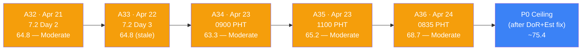
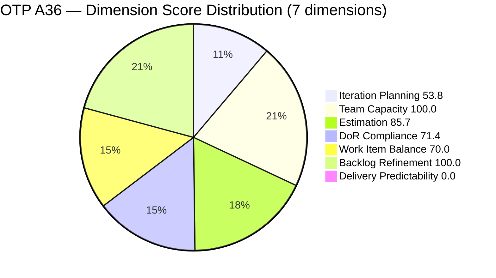
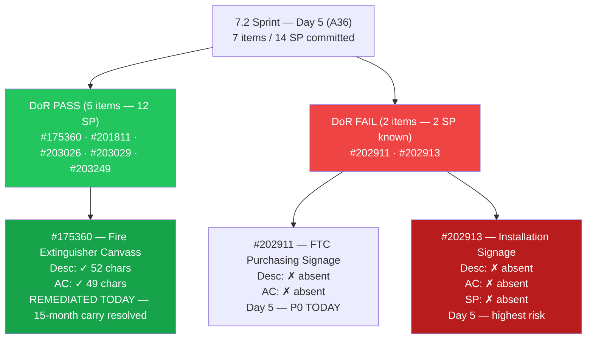
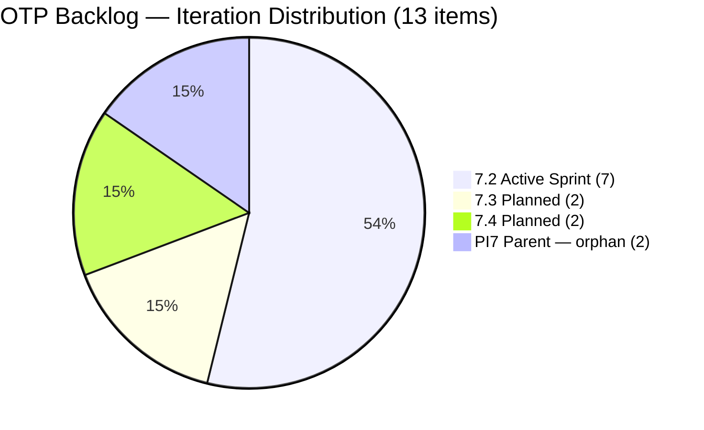
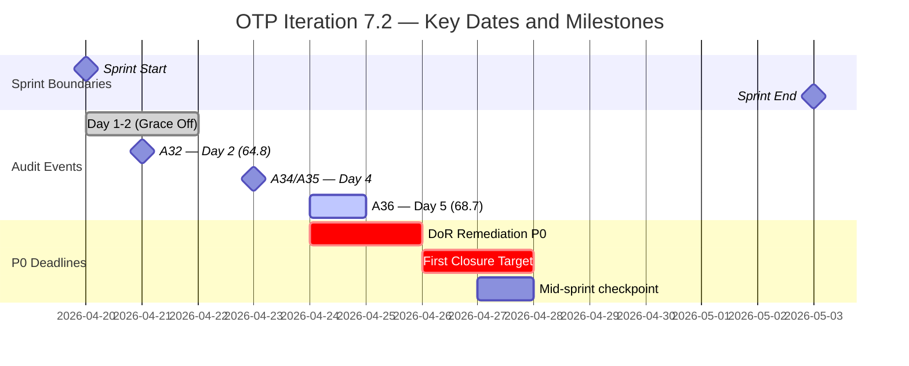
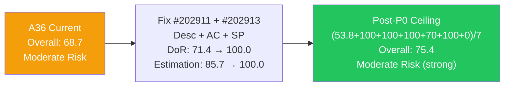

# ADO SAFe Iteration Audit — OTP Team (Office of the President)

## Audit A36 | Iteration 7.2 (Apr 20 – May 3, 2026) | Day 5 of 14

---

## 1. Audit Metadata

| Field | Value |
|-------|-------|
| **Audit Number** | A36 (OTP series) |
| **Audit Date** | April 24, 2026, 08:35 PHT |
| **Auditor** | Claude Code ADO SAFe Audit Agent |
| **Workspace** | `ado_otp` |
| **ADO Project** | OTP (`e7739905-28a3-4ae1-9173-7f6cd13b3494`) |
| **Team** | OTP Team (`64de61f0-1203-4b01-aee2-6b4415aec52b`) |
| **Iteration** | Iteration 7.2 — Apr 20 to May 3, 2026 |
| **Iteration ID** | `611496a8-1907-483b-94b9-4e3ee575faf5` |
| **Iteration Path** | `OTP\2026 - PI7\Iteration 7.2` |
| **Sprint Day** | Day 5 of 14 (36% elapsed) |
| **Prior Audit** | `AUDIT_20260423_1100.md` (A35, 7.2 Day 4, Overall 65.2 — Moderate Risk) |
| **Scoring Model** | ADO SAFe v1 (7-dimension rubric) |
| **Project Exception** | Single-assignee model (Grace) accepted by team per `ado_otp/CLAUDE.md` |
| **Data Source** | Live ADO read — 2026-04-24 08:35 PHT |
| **Overall Score** | **68.7 / 100** |
| **Risk Band** | **Moderate Risk** (60–79.9) |

---

## 2. Executive Summary

OTP advances to **68.7 (Moderate Risk)** at Day 5 of Iteration 7.2 — a **+3.5 improvement from A35 (65.2)**. Two major positive events occurred between 03:08–03:11 PHT today (April 24):

1. **#175360 "Canvass additional Fire Extinguisher" — DoR remediated.** Grace added Acceptance Criteria overnight ("Mark to canvass at least 3 vendors for Fire Extinguisher"). This item now passes DoR (Desc ≥30 chars + AC ≥20 chars). DoR compliance rises from 4/7 = 57.1% → 5/7 = **71.4%**.

2. **#201811 "Solar Vendor Selection" touched — Backlog Refinement penalty cleared.** The item was updated at 03:11 PHT (title refined to "2. Solar Vendor Selection"). Its ChangedDate is now April 24, clearing the untouched-current penalty. With zero untouched-current items, Backlog Refinement lifts from 90.0 → **100.0**.

These two actions together contribute +14.3 points across dimensions:
- DoR: +14.3 (57.1 → 71.4) = +2.0 pts on overall
- Backlog Refinement: +10.0 (90.0 → 100.0) = +1.4 pts on overall
- Net: **+3.5 overall**

**Remaining gaps at Day 5:**
- **#202911 and #202913** remain DoR-failing with zero content (no Desc, no AC). #202913 also has no SP. These are now the sole barriers to DoR and Estimation improvement.
- **Delivery Predictability = 0.0** — no items closed yet. Two Active items (#203026, #203029) are in progress; the next sprint milestone is the first closure.

**Score ceiling analysis (if all remaining P0 actions completed today):**
- DoR 71.4 → 100.0 (remediate #202911 + #202913 Desc + AC)
- Estimation 85.7 → 100.0 (#202913 sized)
- Post-P0 ceiling: **(53.8+100.0+100.0+100.0+70.0+100.0+0.0)/7 = 75.4**

---

## 3. Previous Audit Delta

| Dimension | A35 — 7.2 Day 4 (11:00 PHT) | A36 — 7.2 Day 5 (08:35 PHT) | Delta |
|-----------|------------------------------|------------------------------|-------|
| Iteration Planning | 53.8 | **53.8** | 0.0 |
| Team Capacity | 100.0 | **100.0** | 0.0 |
| Estimation | 85.7 | **85.7** | 0.0 |
| DoR Compliance | 57.1 | **71.4** | **+14.3** |
| Work Item Balance | 70.0 | **70.0** | 0.0 |
| Backlog Refinement | 90.0 | **100.0** | **+10.0** |
| Delivery Predictability | 0.0 (early-sprint) | **0.0** (early-sprint) | 0.0 |
| **Overall** | **65.2** | **68.7** | **+3.5** |

### Key changes since A35 (11:00 PHT Apr 23 → 08:35 PHT Apr 24)

| Event | Detail | Dimension Impact |
|-------|--------|-----------------|
| **#175360 AC added** | Grace added "Mark to canvass at least 3 vendors for Fire Extinguisher" ~49 non-ws chars. Item now passes DoR (Desc ≥30 + AC ≥20). ChangedDate: Apr 24, 03:08 PHT | DoR 57.1 → 71.4 (+14.3) |
| **#201811 touched** | Title updated to "2. Solar Vendor Selection," ChangedDate: Apr 24, 03:11 PHT. Clears untouched-current classification. | Backlog Refinement 90.0 → 100.0 (+10.0) |
| **#202911 unchanged** | Still no Description, no AC (ChangedDate Apr 20). Day 5. | DoR still failing |
| **#202913 unchanged** | Still no Description, no AC, no SP (ChangedDate Apr 20). Day 5. | DoR + Estimation still failing |
| **#203026, #203029** | Unchanged since Apr 23 — remain Active | No change |

---

## 4. Current Iteration Snapshot

| Metric | Value |
|--------|-------|
| Iteration | 7.2 — Apr 20 to May 3, 2026 |
| Iteration Day | Day 5 of 14 (36% elapsed) |
| Visible root backlog items | 13 |
| Current iteration root items (7.2) | 7 |
| Committed SP (estimated 7.2 items) | 14 SP |
| Active SP (items in Active state) | 6 SP (#203026=2, #203029=4) |
| Closed SP | 0 SP |
| State mix (7.2 items) | 4 New / 2 Active / 0 Closed |
| Contributors with current work | 1 (Grace — all 7 items) |
| Grace's configured capacity | 2.5 h/day (2h Documentation + 0.5h Requirements) |
| Grace's days off in 7.2 | 2 (Apr 21–22) — completed |
| Effective sprint days remaining | 9 (Days 6–14) |
| Remaining capacity | ~22.5 h |
| Data currency | Live ADO read — Apr 24, 2026 08:35 PHT |

### 4.1 Current Sprint Items (7) — Live State as of Apr 24 08:35

| ID | Title | Type | State | SP | Assignee | DoR | ChangedDate |
|----|-------|------|-------|----|----------|-----|-------------|
| #175360 | Canvass additional Fire Extinguisher for Pad Davao | User Story | New | 2 | grace | **PASS (fixed today)** | **Apr 24, 2026** |
| #201811 | 2. Solar Vendor Selection | User Story | New | 2 | grace | PASS | **Apr 24, 2026** |
| #202911 | FTC Purchasing of signage material | User Story | New | 2 | grace | **FAIL (no Desc, no AC)** | Apr 20, 2026 |
| #202913 | Installation of Street Signage | User Story | New | — | grace | **FAIL (no Desc, no AC, no SP)** | Apr 20, 2026 |
| #203026 | Amend Articles and Bylaws to include TechVoc AC | User Story | **Active** | 2 | grace | PASS | Apr 23, 2026 |
| #203029 | Documentation | User Story | **Active** | 4 | grace | PASS | Apr 23, 2026 |
| #203249 | AI Integration & Competency Mapping | User Story | New | 2 | grace | PASS | Apr 23, 2026 |

### 4.2 Non-Current Items on Board (6)

| ID | Title | IterationPath | State | SP | Assignee |
|----|-------|----------------|-------|----|----------|
| #201815 | Physical Installation & Grid Integration | 7.3 | New | 2 | grace |
| #202912 | Fabrication of Signage | 7.3 | New | — | unassigned |
| #200073 | Notification & Due Process (Legal Phase) | 7.4 | New | 2 | grace |
| #201820 | Monitoring & Handover | 7.4 | New | 2 | grace |
| #203016 | Generate and Validate GIS 2026 Report | PI7 parent | New | 3 | grace |
| #203020 | Generate and Validate GIS 2026 Report | PI7 parent | Active | 3 | grace |

> **#203020 still Active** — PI7 parent item. Not in the 7.2 iteration path; does not score in current-iteration dimensions. Duplication with #203016 (same title, identical AC) remains unresolved.

---

## 5. Work Item Analysis

### 5.1 State Distribution — Current 7.2 Items

| State | Count | SP |
|-------|-------|----|
| New | 4 | 8 (est: #175360=2, #201811=2, #202911=2; unest: #202913=0; +#203249=2) |
| Active | 2 | 6 (#203026=2, #203029=4) |
| Closed | 0 | 0 |

Wait — New items: #175360=2, #201811=2, #202911=2, #202913=unest, #203249=2. That's 5 New items. Active: #203026=2, #203029=4. Total = 5+2 = 7. ✓

| State | Count | SP |
|-------|-------|----|
| New | 5 | 10 known + 0 (#202913 unestimated) |
| Active | 2 | 6 (#203026=2, #203029=4) |
| Closed | 0 | 0 |

### 5.2 Type Distribution — Current 7.2 Items

| Type | Count | Share |
|------|-------|-------|
| User Story | 7 | 100% |
| All others | 0 | 0% |

User Story present → no −40. Dominant type = 100% > 60% → **−30**. No Spike → no −20. Balance = **70.0** (structural constraint per project exception).

### 5.3 DoR Verification — Live Read Apr 24 08:35

| ID | Description (non-ws chars) | AC (non-ws chars) | DoR |
|----|----------------------------|-------------------|-----|
| #175360 | ~52 non-ws: "As a Compliance Officer, we need to provide 1 Fire Extinguisher in Davao Pad for safety and BFP compliance." | ~49 non-ws: "Mark to canvass at least 3 vendors for Fire Extinguisher" | **PASS (remediated today)** |
| #201811 | ~84 non-ws: "As a Project Lead, I want to evaluate and select a Tier 1 solar provider in Davao..." | ~77 non-ws: "At least 3 competitive bids reviewed. Vendor selected based on WSJF or cost-benefit analysis." | PASS |
| #202911 | **Absent — 0 chars** | **Absent — 0 chars** | **FAIL** |
| #202913 | **Absent — 0 chars** | **Absent — 0 chars** | **FAIL** |
| #203026 | ~180 non-ws chars: "As an Authorized Representative of the Assessment Center..." | ~250 non-ws chars (4 criteria bullets) | PASS |
| #203029 | ~165 non-ws chars: "As the Program Manager..." | ~100 non-ws chars (5 criteria) | PASS |
| #203249 | ~180 non-ws chars: "As an Organization, I want to identify..." | ~300 non-ws chars (AC1 + AC2) | PASS |

DoR pass rate: **5/7 = 71.4%** (up from 4/7 = 57.1% in A35; #175360 remediated).

### 5.4 Backlog Age Analysis (today = 2026-04-24)

| Bucket | Threshold | Count | Share |
|--------|-----------|-------|-------|
| Fresh (within 45 days) | ChangedDate ≥ 2026-03-10 | 13 | 100% |
| Stale ≥ 90 days | ChangedDate before 2026-01-24 | 0 | 0% |
| Stale ≥ 180 days | ChangedDate before 2025-10-27 | 0 | 0% |
| Untouched current items | ChangedDate < 2026-04-20 (sprint start) | **0** | **0%** |

All 13 visible items are fresh. Critically, **zero untouched-current items** remain — #201811 was touched this morning (Apr 24), clearing the only untouched-current item from A35.

### 5.5 Estimation Analysis

| ID | Type | SP | Point-Eligible | Estimated |
|----|------|----|----------------|-----------|
| #175360 | User Story | 2 | Yes | Yes |
| #201811 | User Story | 2 | Yes | Yes |
| #202911 | User Story | 2 | Yes | Yes |
| #202913 | User Story | — | Yes | **No** |
| #203026 | User Story | 2 | Yes | Yes |
| #203029 | User Story | 4 | Yes | Yes |
| #203249 | User Story | 2 | Yes | Yes |
| **Totals** | | **14 SP** | 7 | 6 |

#202913 remains the sole unestimated item (Day 5 — zero SP, Desc, or AC). All other items estimated; committed SP = 14.

### 5.6 Sprint Velocity Outlook

| Metric | Value |
|--------|-------|
| Committed SP | 14 |
| Active SP (in progress) | 6 (#203026=2, #203029=4) |
| Closed SP | 0 |
| Effective work days remaining | 9 (Days 6–14) |
| Remaining capacity | ~22.5 h |
| SP-per-day target (to hit 100% delivery) | ~1.56 SP/day |

At 9 days remaining and 2 Active items (6 SP), closing #203026 by Day 6 and #203029 by Day 7 would score 42.9% Delivery Predictability. The remaining 8 SP would need closure across Days 8–14.

---

## 6. SAFe Compliance Scorecard

| Dimension | Score | Evidence | Notes |
|-----------|-------|----------|-------|
| Iteration Planning | 53.8 | 7 current / 13 visible root | Unchanged; 2 PI7-parent orphans + 4 future-iteration items persist |
| Team Capacity | 100.0 | Grace: 2.5 h/day (2 activities) | 1/1 contributor with capacity; single-assignee exception applies |
| Estimation | 85.7 | 6/7 point-eligible items estimated | #202913 still the sole unestimated item |
| DoR Compliance | **71.4** | 5/7 items pass Desc ≥30 AND AC ≥20 | **+14.3 from A35** — #175360 remediated today; 2 failures remain (#202911, #202913) |
| Work Item Balance | 70.0 | 100% User Story; dominant >60% → −30 | Structural constraint; accepted per project exception |
| Backlog Refinement | **100.0** | 13/13 fresh; 0 stale; 0 untouched-current | **+10.0 from A35** — #201811 touched today; penalty cleared |
| Delivery Predictability | 0.0 | 0 SP closed / 14 SP committed | **Early-sprint** (Day 5 of 14); 2 items Active (6 SP in-progress) |
| **Overall** | **68.7** | (53.8+100.0+85.7+71.4+70.0+100.0+0.0)/7 | **Moderate Risk** (60–79.9) |

### Score Computation Detail

```
1. Iteration Planning
   visible_root_backlog_items          = 13
   current_iteration_root_items (7.2)  = 7
   Score = round(7 / 13 × 100, 1)     = 53.8

2. Team Capacity
   contributors_with_current_work      = 1 (grace)
   contributors_with_capacity          = 1 (grace: 2 activities)
   Score = round(1 / 1 × 100, 1)      = 100.0

3. Estimation
   point_eligible_current_items        = 7 (all User Story)
   estimated_current_items (SP > 0)    = 6
   Score = round(6 / 7 × 100, 1)      = 85.7

4. DoR Compliance
   current_iteration_root_items        = 7
   dor_compliant_current_items         = 5 (#175360[NEW], #201811, #203026, #203029, #203249)
   Score = round(5 / 7 × 100, 1)      = 71.4

5. Work Item Balance
   User Story present                  = True → no −40
   dominant_type_share                 = 7/7 = 100% > 60% → −30
   spike_share                         = 0% → no −20
   Score = max(0, 100 − 30)           = 70.0

6. Backlog Refinement
   fresh_visible_root_items            = 13 (all ≥ Apr 8 > Mar 10 threshold)
   base = round(13 / 13 × 100, 1)     = 100.0
   stale_90 / visible = 0/13          → no penalty
   stale_180 count = 0                 → no penalty
   untouched_current                   = 0 (#201811 touched Apr 24; others ≥ Apr 20 sprint start)
   untouched/current = 0/7 = 0%       → no penalty
   Score = max(0, 100.0 − 0)          = 100.0

7. Delivery Predictability
   committed_story_points              = 14 SP
   closed_story_points                 = 0 SP
   Score = round(0 / 14 × 100, 1)    = 0.0
   Annotation: early-sprint (Day 5 of 14)

Overall = round((53.8 + 100.0 + 85.7 + 71.4 + 70.0 + 100.0 + 0.0) / 7, 1)
        = round(480.9 / 7, 1)
        = round(68.700, 1)
        = 68.7  →  MODERATE RISK (60–79.9)
```

---

## 7. Dimension Findings

### 7.1 Iteration Planning — 53.8 (Unchanged; structural ceiling)

7/13 visible items are in Iteration 7.2. The structural ceiling is determined by:
- 4 items in future iterations (7.3: #201815, #202912; 7.4: #200073, #201820)
- 2 PI7-parent orphans (#203016, #203020)

The PI7-parent deduplication (#203016 vs #203020) remains unresolved. #203020 is Active; #203016 is New with identical title. Resolving this (closing one) would reduce visible count from 13 to 12 and lift Iteration Planning from 7/13=53.8 to 7/12=58.3 — a +4.5 gain.

The maximum achievable Iteration Planning score this sprint without structural changes: **53.8** (ceiling held by orphan count and future-iteration scope).

### 7.2 Team Capacity — 100.0 (Maintained)

Grace remains the sole contributor. Capacity configured: 2h Documentation + 0.5h Requirements = 2.5 h/day. The Apr 21–22 days-off window is fully elapsed. Effective remaining capacity: 9 working days × 2.5 h = **22.5 hours**.

The overnight activity pattern (03:08–03:11 PHT) is consistent with prior sprint behavior. Grace is working in the early morning window, which has been her consistent delivery rhythm across 7.2.

### 7.3 Estimation — 85.7 (Unchanged; #202913 sole gap — Day 5)

#202913 "Installation of Street Signage" enters Day 5 with zero Story Points, zero Description, and zero Acceptance Criteria. This is the only unestimated point-eligible item. Adding SP lifts Estimation from 85.7 → 100.0.

Suggested SP: 2–3 points based on predecessor #198587 (JIT Signage Installation, 3 SP, closed in 7.1). Grace is the assigned owner since Apr 20. The five-day absence of content on this item — while two peer items for the same initiative (#202911 = Purchasing, #203016 = GIS Report) have at least SP — suggests it may have been placed in the sprint as a placeholder. It requires content before it can transition to Active.

### 7.4 DoR Compliance — 71.4 (Improved +14.3; #175360 remediated — 2 failures remain)

**#175360 — RESOLVED.** Grace added Acceptance Criteria at 03:08 PHT today. The AC reads: "Mark to canvass at least 3 vendors for Fire Extinguisher." At ~49 non-whitespace characters, this clears the ≥20 char threshold. Combined with the existing Description (~52 chars, passes ≥30), this 15-month carry item finally achieves DoR compliance. This is a positive execution signal — Grace addressed the oldest outstanding finding in the sprint.

**Remaining DoR failures (both Day 5 — no content since creation):**

**#202911 — "FTC Purchasing of signage material" — FAIL**
- Description: **Absent (0 chars)**
- Acceptance Criteria: **Absent (0 chars)**
- SP: 2 (estimated; SP present without content is a structural inconsistency)
- Status: In sprint for 5 days, no content transition. Now the most urgent DoR fix alongside #202913.
- Remediation: ~15 min. Template from #198587 (predecessor signage purchasing story).

**#202913 — "Installation of Street Signage" — FAIL**
- Description: **Absent (0 chars)**
- Acceptance Criteria: **Absent (0 chars)**
- SP: **Absent (0 — sole unestimated 7.2 item)**
- Status: In sprint for 5 days. No content, no estimate. Highest combined-risk item in the sprint.
- Remediation: ~20 min. Use #198587 as template for Desc + AC; add 2–3 SP.

**If both remediated today:** DoR 71.4 → 100.0, Estimation 85.7 → 100.0, Overall ceiling → 75.4.

### 7.5 Work Item Balance — 70.0 (Structural; accepted per project exception)

100% User Story composition. Structural −30 penalty applies (dominant type 100% > 60%). No Spikes or Enablers in scope. The accepted single-assignee, single-type OTP structure makes this penalty permanent for the current sprint. No remediation path within 7.2.

### 7.6 Backlog Refinement — 100.0 (Improved +10.0; all penalties cleared)

**Perfect score achieved this morning.** Grace's touch of #201811 at 03:11 PHT on April 24 eliminated the sole remaining Backlog Refinement penalty. The untouched-current count drops from 1 to 0. All 13 visible backlog items have ChangedDates of April 8 or later (well within the 45-day freshness window), and the sprint start is April 20 — so no current-iteration item has a pre-sprint ChangedDate.

This is the first 100.0 Backlog Refinement score in Iteration 7.2. It signals that Grace is actively managing her backlog alongside execution.

### 7.7 Delivery Predictability — 0.0 (Early-sprint; Day 5 — closure milestone approaching)

0 SP closed / 14 SP committed. Day 5 of 14. The early-sprint annotation continues to apply.

**What to watch:** The sprint now has two Active items with 6 SP. Day 7 (Apr 26) is a natural checkpoint — if #203026 (Bylaws Amendment, 2 SP) closes by then, Delivery Predictability moves from 0.0 to 14.3, beginning the upward trajectory. Closing both Active items by Day 7 would score 42.9.

**Signage items (#202911, #202913) risk:** These two items have zero content after 5 days. If they cannot be fully DoR-remediated and started by Day 7, they risk carry-forward into 7.3 alongside #202912 (Fabrication), creating a three-item 7.3 signage cluster with no DoR-passing item in scope.

---

## 8. Risks and Bottlenecks

| # | Risk | Severity | Owner | Status vs A35 |
|---|------|----------|-------|----------------|
| R1 | **#202911 and #202913 DoR-failing — Day 5, no content since creation** | **CRITICAL** | Grace | **Escalated — 5 days without remediation** |
| R2 | **#202913 has no SP, Desc, or AC** — sole unestimated item | **HIGH** | Grace | Unchanged — Day 5 |
| R3 | **Zero Closed SP at Day 5** — velocity target 1.56 SP/day to achieve full delivery | **HIGH** | Grace | Ongoing; 2 Active items positive signal |
| R4 | **#203016 and #203020 likely duplicates** — both PI7 parents, #203020 Active | **MODERATE** | Grace / Ramon | Unchanged — deduplication still pending |
| R5 | **2 PI7-parent orphans** — depress Iteration Planning ceiling at 53.8 | **MODERATE** | Ramon | Unchanged |
| R6 | **#202912 (7.3) unassigned** — Fabrication of Signage without owner | **LOW** | Ramon | Unchanged — 7.3 starts May 4 |
| R7 | **No sprint goal for 7.2** | **LOW** | Ramon | Persistent |
| R8 | **#203249 scope alignment** — AI Integration added intra-sprint Day 4 | **LOW** | Ramon | New observation; item well-formed |

---

## 9. Prioritized Recommendations

### P0 — Today (Apr 24, Day 5) — FINAL WINDOW

> Five days have elapsed since sprint start. #202911 and #202913 have zero content. After Day 7, unstarted DoR-failing items will almost certainly carry forward to 7.3, damaging both 7.2 Delivery Predictability and 7.3 sprint planning.

1. **Write Description + Acceptance Criteria for #202911** (~15 min). Use #198587 as a template (FTC Signage Purchasing predecessor): Desc in As-a/I-want/So-that format; AC: PO approval confirmed, vendor selection rationale documented, material delivery receipt, cost compliance vs. budget ceiling. Item has SP=2 but zero content — it can be started the moment DoR passes.

2. **Write Description + Acceptance Criteria + Story Points for #202913** (~20 min). Add 2–3 SP based on #198587 precedent. Desc + AC adapted from the signage installation story pattern. This is the only item blocking Estimation from 100.0.

**Combined P0 impact (if both completed today):**
- DoR: 71.4 → 100.0 (+28.6 on dimension, +4.1 on overall)
- Estimation: 85.7 → 100.0 (+14.3 on dimension, +2.0 on overall)
- **Post-P0 overall ceiling: 75.4** (Moderate Risk, upper band)

### P1 — Before Day 7 (Apr 26)

1. **Close #203026 (Bylaws Amendment, 2 SP)** — already Active since Apr 23. If the SEC submission or legal filing milestone is reachable, closing this item lifts Delivery Predictability from 0.0 to 14.3 and signals the first 7.2 closure.
2. **Resolve #203016/#203020 duplication** — two GIS Report items with identical titles. #203020 is Active; #203016 is New. One should be closed. If #203020 is the keeper, close #203016 to remove the PI7-parent from the visible count (13 → 12; Iteration Planning 53.8 → 58.3).
3. **Assign #202912 (Fabrication of Signage)** to Grace or a named contributor for 7.3 planning. 7.3 starts May 4.

### P2 — Sprint Review / PI-Level

1. **Configure a sprint goal for 7.2.** Suggested: "Complete signage procurement chain + bylaws amendment for TechVoc AC + launch AI competency mapping study."
2. **Track #203249 AI Integration deliverable timeline.** 2 SP for Functional Decomposition Reports and AI-ready JDs is ambitious. Verify the estimate is realistic before mid-sprint.
3. **Consider sub-classifying #175360 and #201811 as Enablers** for future iteration planning. Procurement and compliance items are Enabler-shaped; reclassifying in 7.3+ would relieve the dominant-type Work Item Balance penalty.

---

## 10. Evidence Gaps and Limitations

| Gap | Impact | Severity | Notes |
|-----|--------|----------|-------|
| **#175360 AC quality** | AC is minimal ("canvass at least 3 vendors") — meets the 20-char threshold but not a complete acceptance framework | LOW | Scored as PASS per rubric; quality coaching warranted |
| **#203020 vs #203016 canonical item** | Cannot confirm which is the "live" GIS Report without team input | MODERATE | Both still in visible backlog; deduplication pending team decision |
| **#202912 assignee vacancy** | No assignee visible in ADO; may be intentional for 7.3 planning | LOW | Does not affect current-iteration scoring |
| **Sprint goal for 7.2** | No sprint goal text found in ADO; PI alignment not assessable | LOW | Persistent gap across PI7 |
| **Grace's early-morning activity pattern** | All changes today at 03:08–03:11 PHT — items may have been updated during off-hours. No evidence of quality review issues, but notable | LOW | Data is valid; timing is an observation |
| **#202913 Desc/AC today** | Grace may update #202913 after this 08:35 PHT read | LOW | Next audit will capture any changes |

---

## 11. Visualizations

### 11.1 Score Trajectory — OTP 7.2 Sprint Audits



### 11.2 SAFe Dimension Score Comparison — A35 vs A36



### 11.3 DoR Status — 7.2 Sprint Items (A36)



### 11.4 Backlog Distribution — 13 Visible Items by Iteration



### 11.5 Iteration Timeline — Key Milestones (7.2)



### 11.6 P0 Score Impact Path



---

*Report generated: 2026-04-24 08:35 PHT | Audit A36 | ado_otp | Iteration 7.2 Day 5*
*Data currency: Live ADO read at 2026-04-24 08:35 PHT*
*Prior audit: AUDIT_20260423_1100.md (A35, Overall 65.2 Moderate Risk)*
