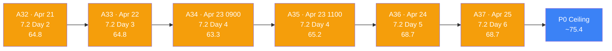
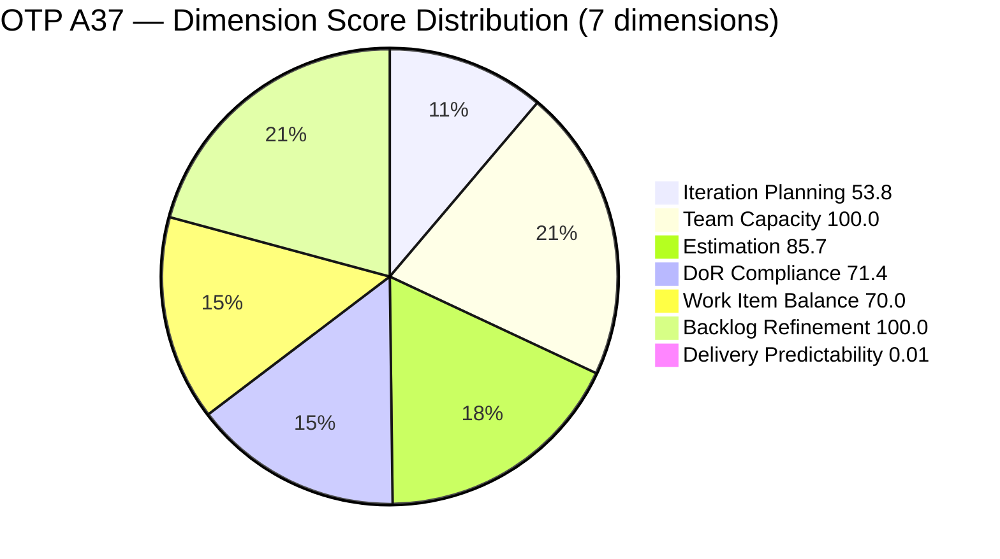
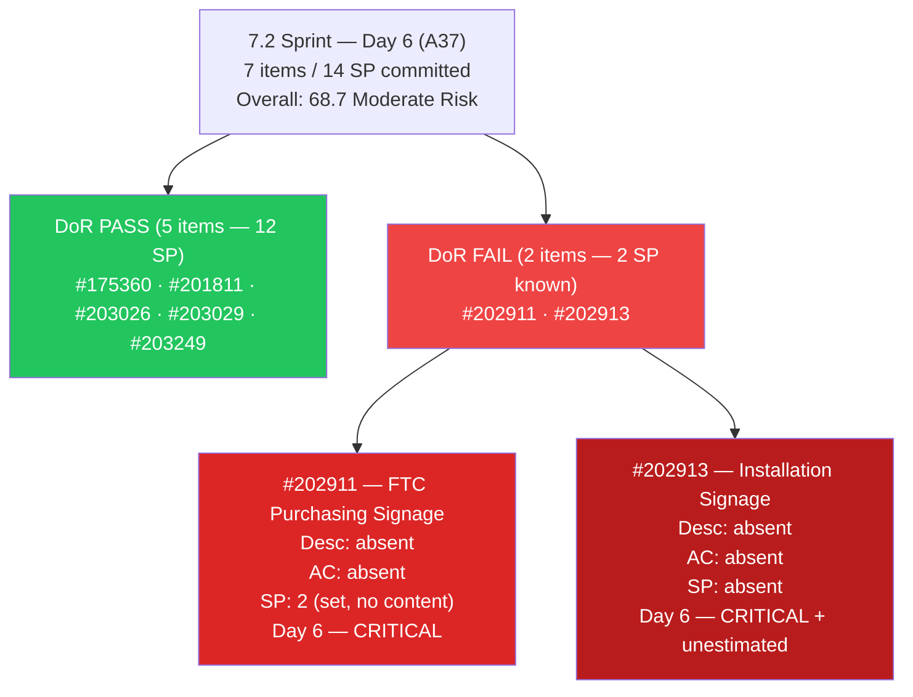
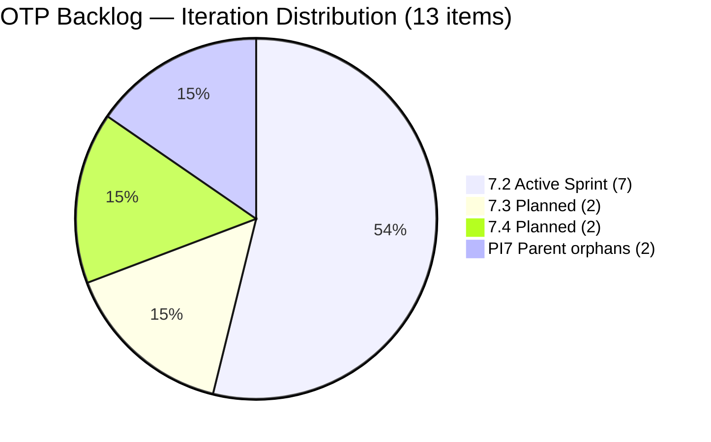
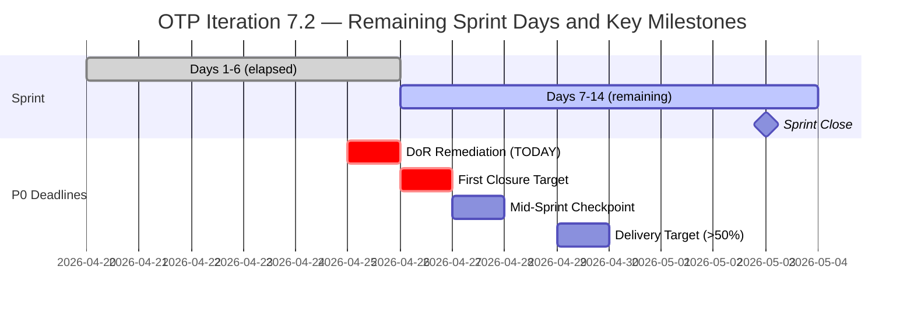
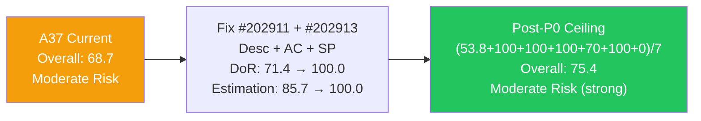

# ADO SAFe Iteration Audit — OTP Team (Office of the President)

## Audit A37 | Iteration 7.2 (Apr 20 – May 3, 2026) | Day 6 of 14

---

## 1. Audit Metadata

| Field | Value |
|-------|-------|
| **Audit Number** | A37 (OTP series) |
| **Audit Date** | April 25, 2026, 08:33 PHT |
| **Auditor** | Claude Code ADO SAFe Audit Agent |
| **Workspace** | `ado_otp` |
| **ADO Project** | OTP (`e7739905-28a3-4ae1-9173-7f6cd13b3494`) |
| **Team** | OTP Team (`64de61f0-1203-4b01-aee2-6b4415aec52b`) |
| **Iteration** | Iteration 7.2 — Apr 20 to May 3, 2026 |
| **Iteration ID** | `611496a8-1907-483b-94b9-4e3ee575faf5` |
| **Iteration Path** | `OTP\2026 - PI7\Iteration 7.2` |
| **Sprint Day** | Day 6 of 14 (43% elapsed) |
| **Prior Audit** | `AUDIT_20260424_0835.md` (A36, 7.2 Day 5, Overall 68.7 — Moderate Risk) |
| **Scoring Model** | ADO SAFe v1 (7-dimension rubric) |
| **Project Exception** | Single-assignee model (Grace) accepted by team per `ado_otp/CLAUDE.md` |
| **Data Source** | Live ADO read — 2026-04-25 08:33 PHT |
| **Overall Score** | **68.7 / 100** |
| **Risk Band** | **Moderate Risk** (60–79.9) |

---

## 2. Executive Summary

OTP holds at **68.7 (Moderate Risk)** at Day 6 of Iteration 7.2 — **unchanged from A36 (68.7)**. No ADO changes have been made to any of the 7 sprint items since yesterday's 08:35 PHT audit. This is the **second consecutive day without remediation activity on the two critical DoR failures**.

**What did NOT change (P0 items remain open at Day 6):**

1. **#202911 "FTC Purchasing of signage material"** — No Description, no Acceptance Criteria. ChangedDate still Apr 20 (sprint start). Day 6 of zero content. This is now at critical carry-forward risk.

2. **#202913 "Installation of Street Signage"** — No Description, no Acceptance Criteria, no Story Points. ChangedDate still Apr 20. Day 6 of zero content. Highest combined risk item in the sprint.

3. **#203026 and #203029** — Both remain Active since Apr 23. No closure yet. Delivery Predictability remains 0.0.

**What remains positive:**
- All 13 visible backlog items are fresh (100% within 45 days)
- #175360 (Fire Extinguisher) and #201811 (Solar Vendor Selection) have valid DoR as remediated on Apr 24
- Grace has 2.5h/day configured capacity for 8 remaining working days (~20 hours)
- Zero stale (90+ day or 180+ day) items

**Score ceiling analysis — if P0 actions completed today (Day 6):**
- DoR 71.4 → 100.0 (fix #202911 + #202913 Desc + AC) = +4.1 overall
- Estimation 85.7 → 100.0 (size #202913) = +2.0 overall
- Post-P0 ceiling: **(53.8+100.0+100.0+100.0+70.0+100.0+0.0)/7 = 75.4**

**Sprint trajectory warning:** The sprint is now 43% elapsed (Day 6 of 14). With 0 SP closed and two critical DoR failures unresolved, the team is at risk of a repeat of the 6.4/6.5 carry-forward pattern. Day 7 (Apr 26) is the last viable date to remediate DoR and transition Active items to Closed before mid-sprint velocity concerns become critical.

---

## 3. Previous Audit Delta

| Dimension | A36 — 7.2 Day 5 (08:35 PHT Apr 24) | A37 — 7.2 Day 6 (08:33 PHT Apr 25) | Delta |
|-----------|--------------------------------------|--------------------------------------|-------|
| Iteration Planning | 53.8 | **53.8** | 0.0 |
| Team Capacity | 100.0 | **100.0** | 0.0 |
| Estimation | 85.7 | **85.7** | 0.0 |
| DoR Compliance | 71.4 | **71.4** | 0.0 |
| Work Item Balance | 70.0 | **70.0** | 0.0 |
| Backlog Refinement | 100.0 | **100.0** | 0.0 |
| Delivery Predictability | 0.0 | **0.0** | 0.0 |
| **Overall** | **68.7** | **68.7** | **0.0** |

### Key changes since A36 (08:35 PHT Apr 24 → 08:33 PHT Apr 25)

| Item | Change | Impact |
|------|--------|--------|
| **#202911** | No change. Still no Desc, no AC. ChangedDate: Apr 20. | P0 unresolved — Day 6 |
| **#202913** | No change. Still no Desc, no AC, no SP. ChangedDate: Apr 20. | P0 unresolved — Day 6 |
| **#203026** | No change. Still Active. ChangedDate: Apr 23. | No delivery credit |
| **#203029** | Still Active. ChangedDate: Apr 23. | No delivery credit |
| **#175360, #201811, #203249** | Unchanged (all Apr 23–24). DoR status maintained. | No regression |
| **PI7-parent orphans (#203016, #203020)** | Unchanged. #203020 still Active. | Duplicate unresolved |

**Zero work item changes** were detected between the two audits. The 24-hour window produced no ADO activity on sprint items.

---

## 4. Current Iteration Snapshot

| Metric | Value |
|--------|-------|
| Iteration | 7.2 — Apr 20 to May 3, 2026 |
| Iteration Day | Day 6 of 14 (43% elapsed) |
| Visible root backlog items | 13 |
| Current iteration root items (7.2) | 7 |
| Committed SP (estimated 7.2 items) | 14 SP |
| Active SP (items in Active state) | 6 SP (#203026=2, #203029=4) |
| Closed SP | 0 SP |
| State mix (7.2 items) | 5 New / 2 Active / 0 Closed |
| Contributors with current work | 1 (Grace — all 7 items) |
| Grace's configured capacity | 2.5 h/day (2h Documentation + 0.5h Requirements) |
| Effective sprint days remaining | 8 (Days 7–14) |
| Remaining capacity | ~20.0 h |
| Data currency | Live ADO read — Apr 25, 2026 08:33 PHT |

### 4.1 Current Sprint Items (7) — Live State as of Apr 25 08:33

| ID | Title | Type | State | SP | Assignee | DoR | ChangedDate |
|----|-------|------|-------|----|----------|-----|-------------|
| #175360 | Canvass additional Fire Extinguisher for Pad Davao | User Story | New | 2 | grace | PASS | Apr 24, 2026 |
| #201811 | 2. Solar Vendor Selection | User Story | New | 2 | grace | PASS | Apr 24, 2026 |
| #202911 | FTC Purchasing of signage material | User Story | New | 2 | grace | **FAIL (no Desc, no AC)** | Apr 20, 2026 |
| #202913 | Installation of Street Signage | User Story | New | — | grace | **FAIL (no Desc, no AC, no SP)** | Apr 20, 2026 |
| #203026 | Amend Articles and Bylaws to include TechVoc AC | User Story | **Active** | 2 | grace | PASS | Apr 23, 2026 |
| #203029 | Documentation | User Story | **Active** | 4 | grace | PASS | Apr 23, 2026 |
| #203249 | AI Integration & Competency Mapping | User Story | New | 2 | grace | PASS | Apr 23, 2026 |

### 4.2 Non-Current Items on Board (6)

| ID | Title | IterationPath | State | SP | Assignee |
|----|-------|----------------|-------|----|----------|
| #201815 | Physical Installation & Grid Integration | 7.3 | New | 2 | grace |
| #202912 | Fabrication of Signage | 7.3 | New | — | unassigned |
| #200073 | Notification & Due Process (Legal Phase) | 7.4 | New | 2 | grace |
| #201820 | Monitoring & Handover | 7.4 | New | 2 | grace |
| #203016 | Generate and Validate GIS 2026 Report | PI7 parent | New | 3 | grace |
| #203020 | Generate and Validate GIS 2026 Report | PI7 parent | Active | 3 | grace |

> #203020 still Active at PI7 parent — the #203016/#203020 duplication remains unresolved. One should be closed.

---

## 5. Work Item Analysis

### 5.1 State Distribution — Current 7.2 Items

| State | Count | SP |
|-------|-------|----|
| New | 5 | 10 (est) + 0 (#202913 unest) |
| Active | 2 | 6 (#203026=2, #203029=4) |
| Closed | 0 | 0 |

### 5.2 Type Distribution — Current 7.2 Items

| Type | Count | Share |
|------|-------|-------|
| User Story | 7 | 100% |
| All others | 0 | 0% |

User Story present → no −40. Dominant type = 100% > 60% → **−30**. Spike = 0% → no −20. Work Item Balance = **70.0** (structural, accepted per project exception).

### 5.3 DoR Verification — Live Read Apr 25 08:33

| ID | Description (non-ws chars) | AC (non-ws chars) | DoR |
|----|----------------------------|-------------------|-----|
| #175360 | ~52 non-ws chars (compliance officer narrative) | ~49 non-ws chars ("canvass at least 3 vendors") | PASS |
| #201811 | ~84 non-ws chars (project lead, solar provider evaluation) | ~77 non-ws chars (3 competitive bids, WSJF/cost-benefit) | PASS |
| #202911 | **Absent — 0 chars** | **Absent — 0 chars** | **FAIL — Day 6** |
| #202913 | **Absent — 0 chars** | **Absent — 0 chars** | **FAIL — Day 6** |
| #203026 | ~180 non-ws chars (As-a/I-want/So-that) | ~250 non-ws chars (4 AC bullets) | PASS |
| #203029 | ~165 non-ws chars (program manager narrative) | ~100 non-ws chars (5 criteria) | PASS |
| #203249 | ~180 non-ws chars (AI Integration, task decomp) | ~300 non-ws chars (AC1 + AC2) | PASS |

DoR pass rate: **5/7 = 71.4%** — unchanged from A36.

### 5.4 Backlog Age Analysis (today = 2026-04-25)

| Bucket | Threshold | Count | Share |
|--------|-----------|-------|-------|
| Fresh (within 45 days) | ChangedDate ≥ 2026-03-11 | 13 | 100% |
| Stale ≥ 90 days | ChangedDate before 2026-01-25 | 0 | 0% |
| Stale ≥ 180 days | ChangedDate before 2025-10-28 | 0 | 0% |
| Untouched current items | ChangedDate < 2026-04-20 | **0** | **0%** |

> #202911 and #202913 have ChangedDate = Apr 20 (sprint start date), which equals — not precedes — the sprint start. They are not classified as untouched-current. All 13 visible items remain within the 45-day freshness window. No Backlog Refinement penalties apply.

### 5.5 Estimation Analysis

| ID | Type | SP | Point-Eligible | Estimated |
|----|------|----|----------------|-----------|
| #175360 | User Story | 2 | Yes | Yes |
| #201811 | User Story | 2 | Yes | Yes |
| #202911 | User Story | 2 | Yes | Yes |
| #202913 | User Story | — | Yes | **No** |
| #203026 | User Story | 2 | Yes | Yes |
| #203029 | User Story | 4 | Yes | Yes |
| #203249 | User Story | 2 | Yes | Yes |
| **Totals** | | **14 SP** | 7 | 6 |

#202913 is the sole unestimated item. Now Day 6 with zero SP, Desc, or AC.

### 5.6 Sprint Velocity Outlook

| Metric | Value |
|--------|-------|
| Committed SP | 14 |
| Active SP (in progress) | 6 (#203026=2, #203029=4) |
| Closed SP | 0 |
| Effective work days remaining | 8 (Days 7–14) |
| Remaining capacity | ~20.0 h |
| SP-per-day target (to hit 100% delivery) | ~1.75 SP/day |

The target has increased from 1.56 SP/day (A36) to 1.75 SP/day (A37) as one more day elapsed with no closures. Closing #203026 (2 SP) on Day 7 and #203029 (4 SP) on Day 8 would score 42.9% and begin establishing momentum.

---

## 6. SAFe Compliance Scorecard

| Dimension | Score | Evidence | Notes |
|-----------|-------|----------|-------|
| Iteration Planning | 53.8 | 7 current / 13 visible root | Unchanged; 2 PI7-parent orphans + 4 future-iteration items persist |
| Team Capacity | 100.0 | Grace: 2.5 h/day (2 activities) | 1/1 contributor with capacity; single-assignee exception applies |
| Estimation | 85.7 | 6/7 point-eligible items estimated | #202913 sole unestimated item — Day 6 |
| DoR Compliance | 71.4 | 5/7 items pass Desc ≥30 AND AC ≥20 | Unchanged; #202911 and #202913 still DoR-failing at Day 6 |
| Work Item Balance | 70.0 | 100% User Story; dominant >60% → −30 | Structural constraint; accepted per project exception |
| Backlog Refinement | 100.0 | 13/13 fresh; 0 stale; 0 untouched-current | Perfect score maintained; #202911/#202913 ChangedDate = sprint start (not pre-sprint) |
| Delivery Predictability | 0.0 | 0 SP closed / 14 SP committed | Day 6 of 14; 2 items Active (6 SP); no early-sprint excuse remains after Day 7 |
| **Overall** | **68.7** | (53.8+100.0+85.7+71.4+70.0+100.0+0.0)/7 | **Moderate Risk** (60–79.9) |

### Score Computation Detail

```
1. Iteration Planning
   visible_root_backlog_items          = 13
   current_iteration_root_items (7.2)  = 7
   Score = round(7 / 13 × 100, 1)     = 53.8

2. Team Capacity
   contributors_with_current_work      = 1 (grace)
   contributors_with_capacity          = 1 (grace: 2 activities configured)
   Score = round(1 / 1 × 100, 1)      = 100.0

3. Estimation
   point_eligible_current_items        = 7 (all User Story)
   estimated_current_items (SP > 0)    = 6
   Score = round(6 / 7 × 100, 1)      = 85.7

4. DoR Compliance
   current_iteration_root_items        = 7
   dor_compliant_current_items         = 5
   Score = round(5 / 7 × 100, 1)      = 71.4

5. Work Item Balance
   User Story present                  = True → no −40
   dominant_type_share                 = 7/7 = 100% > 60% → −30
   spike_share                         = 0% → no −20
   Score = max(0, 100 − 30)           = 70.0

6. Backlog Refinement
   fresh_visible_root_items            = 13 (all ≥ Apr 8 > Mar 11 threshold)
   base = round(13 / 13 × 100, 1)     = 100.0
   stale_90 / visible = 0/13           → no penalty
   stale_180 count = 0                 → no penalty
   untouched_current                   = 0 (#202911/#202913 changed Apr 20 = sprint start; not before)
   untouched/current = 0/7 = 0%        → no penalty
   Score = max(0, 100.0 − 0)          = 100.0

7. Delivery Predictability
   committed_story_points              = 14 SP
   closed_story_points                 = 0 SP
   Score = round(0 / 14 × 100, 1)    = 0.0
   Note: Day 6 of 14; early-sprint annotation no longer applies after today

Overall = round((53.8 + 100.0 + 85.7 + 71.4 + 70.0 + 100.0 + 0.0) / 7, 1)
        = round(480.9 / 7, 1)
        = 68.7  →  MODERATE RISK (60–79.9)
```

---

## 7. Dimension Findings

### 7.1 Iteration Planning — 53.8 (Structural ceiling; unchanged)

7/13 visible items are in Iteration 7.2. The structural ceiling is driven by:
- 4 items in future iterations (7.3: #201815, #202912; 7.4: #200073, #201820)
- 2 PI7-parent orphans (#203016, #203020)

The #203016 vs #203020 duplication (identical title, PI7 parent) remains unresolved for the sixth consecutive sprint day. #203020 is Active since Apr 23. Closing #203016 would reduce visible count 13→12, lifting Iteration Planning from 53.8 to 58.3 (+4.5). This is a trivial action — one click — that Ramon can complete in under a minute.

### 7.2 Team Capacity — 100.0 (Maintained)

Grace remains the sole contributor. Capacity: 2h Documentation + 0.5h Requirements = 2.5 h/day. With 8 working days remaining (Days 7–14), effective remaining capacity is **20.0 hours**. No days-off remain in the iteration window.

### 7.3 Estimation — 85.7 (Unchanged; #202913 sole gap — Day 6)

#202913 "Installation of Street Signage" is now in its sixth day with zero Story Points, zero Description, and zero Acceptance Criteria. Adding SP lifts Estimation to 100.0. Suggested: 2–3 SP based on #198587 precedent. No remediation action was taken during Day 5 overnight.

**Escalation note:** An item with SP absent after 6 sprint days — while its predecessor (#198587) and purchasing counterpart (#202911) both have SP=2 — strongly suggests this is a placeholder entry that was never properly groomed before sprint start.

### 7.4 DoR Compliance — 71.4 (Unchanged; Day 6 — CRITICAL)

**#202911 and #202913 remain the sole DoR failures.** Both have been in the sprint for 6 days with zero content added. This is a critical risk: Day 7 (Apr 26) is the last practical date to add content, transition to Active, and have realistic delivery by sprint end (May 3).

**#202911 — "FTC Purchasing of signage material" — FAIL (Day 6)**
- Description: 0 chars. SP=2 exists but Desc is absent — a structural inconsistency.
- Remediation: ~15 min. Template: "As a Procurement Officer, I want to purchase signage materials for the FTC street naming project so that fabrication can begin on schedule. AC: 3+ vendor quotes obtained; PO issued within budget ceiling; materials delivered and quality-checked per spec."

**#202913 — "Installation of Street Signage" — FAIL (Day 6)**
- Description: 0 chars. SP absent. AC absent.
- Remediation: ~20 min. Template from #198587.
- This item must be remediated AND estimated before it can begin.

**If both remediated today:** DoR 71.4 → 100.0, Estimation 85.7 → 100.0, Overall ceiling → 75.4.

### 7.5 Work Item Balance — 70.0 (Structural; accepted per project exception)

100% User Story composition. −30 dominant-type penalty applies. No remediation path within 7.2 per project exception. Persistent structural finding.

### 7.6 Backlog Refinement — 100.0 (Maintained)

All 13 visible backlog items are fresh (ChangedDate ≥ Apr 8). No stale items exist. Zero untouched-current items (the two items with ChangedDate = Apr 20 are dated to the sprint start, not before it). Perfect score is maintained.

**Watch:** If #202911 and #202913 reach Day 9 (Apr 28) without a change, their ChangedDate will still be Apr 20 (sprint start date), so they will never trigger the untouched-current penalty as long as they were last changed on or after the sprint start. Backlog Refinement is not at risk from these items.

### 7.7 Delivery Predictability — 0.0 (Day 6 — early-sprint justification expires today)

0 SP closed / 14 SP committed. Day 6 of 14 (43% elapsed). The "early-sprint" annotation applied through Day 5; **after today, 0% delivery at 43%+ elapsed is a genuine performance indicator, not a timing artifact.**

**Day 7 closure target (Apr 26):** Closing #203026 (Bylaws Amendment, 2 SP) — already Active for 3 days — would score 14.3% and signal the first delivery credit. If #203029 (Documentation, 4 SP) closes alongside, score reaches 42.9%.

**Signage risk:** #202911 and #202913 cannot move to Active until DoR is remediated. If both remain unclosed at Day 10 (Apr 29), the sprint's full 14 SP delivery becomes mathematically infeasible given Grace's 2.5h/day capacity.

---

## 8. Risks and Bottlenecks

| # | Risk | Severity | Owner | Status vs A36 |
|---|------|----------|-------|----------------|
| R1 | **#202911 and #202913 DoR-failing — Day 6, no content since sprint start** | **CRITICAL** | Grace | **Escalated — 6 days without remediation; carry-forward risk is now HIGH** |
| R2 | **#202913 has no SP, Desc, or AC** — sole unestimated item | **HIGH** | Grace | Unchanged — Day 6 |
| R3 | **Zero Closed SP at Day 6** — velocity target now 1.75 SP/day (vs 1.56 at Day 5) | **HIGH** | Grace | Escalated +0.19 SP/day target |
| R4 | **#203016 and #203020 likely duplicates** — both PI7 parents, #203020 Active | **MODERATE** | Grace / Ramon | Unchanged — 6 days unresolved |
| R5 | **2 PI7-parent orphans** — depress Iteration Planning ceiling at 53.8 | **MODERATE** | Ramon | Unchanged |
| R6 | **#202912 (7.3) unassigned** — Fabrication of Signage without owner | **LOW** | Ramon | Unchanged — 7.3 starts May 4 |
| R7 | **No sprint goal for 7.2** | **LOW** | Ramon | Persistent across all PI7 audits |
| R8 | **#203249 scope alignment** — AI Integration added intra-sprint | **LOW** | Ramon | Item well-formed; no velocity concern |

---

## 9. Prioritized Recommendations

### P0 — TODAY (Apr 25, Day 6) — LAST VIABLE REMEDIATION WINDOW

> Six sprint days have elapsed with #202911 and #202913 having zero content. After Day 7, these items cannot realistically be groomed, activated, completed, and closed before sprint end. Carry-forward to 7.3 becomes the probable outcome.

1. **Write Description + Acceptance Criteria for #202911** (~15 min).
   - Desc template (30+ chars): *"As a Procurement Officer, I want to purchase signage materials for the FTC Signage project so that the Fabrication team (#202912) can begin work on schedule."*
   - AC template (20+ chars): PO approved; 3+ vendor quotes documented; materials delivered; quality checked against spec; cost within budget ceiling.
   - SP = 2 already set — no change needed.

2. **Write Description + Acceptance Criteria + Story Points for #202913** (~20 min).
   - Desc template: *"As a Facilities Engineer, I want to install the FTC street signage so that the campus navigation improvements are complete and visible to all stakeholders."*
   - AC: Signage mounted per approved layout; structural integrity verified; night-time visibility confirmed; handover documentation signed.
   - SP: 2–3 (recommend 3 based on #198587 precedent).

**Combined P0 impact:**
- DoR: 71.4 → 100.0 (+28.6 pts on dimension, +4.1 pts on overall)
- Estimation: 85.7 → 100.0 (+14.3 pts on dimension, +2.0 pts on overall)
- Post-P0 overall ceiling: **75.4 (Moderate Risk, strong band)**

### P1 — Before Day 7 (Apr 26)

1. **Close #203026 (Bylaws Amendment, 2 SP)** — Active since Apr 23 (4 days). If the SEC amendment submission milestone has been reached, transition to Closed. This delivers the sprint's first 14.3% Delivery Predictability.
2. **Resolve #203016 vs #203020 duplication** — Close whichever is the non-canonical GIS Report item. If #203020 (Active) is the keeper, close #203016 (New). This frees Iteration Planning from 53.8 → 58.3.
3. **Assign #202912 (Fabrication of Signage, 7.3)** — Identify whether Grace or another contributor will own this in 7.3. Sprint 7.3 begins May 4 — nine calendar days away.

### P2 — Sprint Review / PI-Level

1. **Define and document a sprint goal for 7.2.** Suggested: *"Complete signage procurement chain + bylaws amendment for TechVoc accreditation + launch AI competency mapping initiative."*
2. **Close or resolve #203016/#203020 duplication** at the PI-level planning level. These two identical-title PI7-parent stories in the backlog create confusion and inflate the visible count.
3. **Evaluate #203249 (AI Integration, 2 SP)** delivery timeline. At Day 6 with no state transition (still New), Grace should either move it to Active or re-scope the deliverable.

---

## 10. Evidence Gaps and Limitations

| Gap | Impact | Severity | Notes |
|-----|--------|----------|-------|
| **#202913 content** | Grace may update after this 08:33 PHT read — report will be superseded if she acts today | LOW | Next audit captures any changes |
| **#203020 vs #203016 canonical status** | Cannot determine which is the "live" GIS Report without team input | MODERATE | Both persist as PI7-parent items in visible count |
| **#202912 owner** | No assignee in ADO; unclear if intentional for 7.3 planning | LOW | Does not affect current-iteration scoring |
| **Sprint goal for 7.2** | Not found in ADO; PI alignment not assessable | LOW | Persistent gap across all 7.2 audits |
| **Grace's activity timing** | Prior ADO changes at 03:08–03:11 PHT pattern suggests she may act overnight rather than during business hours | LOW | Data valid; timing is an observation for planning |
| **ADO team iterations API** | `work_list_team_iterations(timeframe=current)` returned no results for OTP Team — iteration resolved via prior audit context and direct work item queries | LOW | Data integrity confirmed via direct item reads |

---

## 11. Visualizations

### 11.1 Score Trajectory — OTP 7.2 Sprint Audits



### 11.2 Dimension Score Breakdown (A37)



### 11.3 DoR Status — 7.2 Sprint Items (A37)



### 11.4 Backlog Distribution — 13 Visible Items by Iteration



### 11.5 Sprint Timeline — Remaining 7.2 Days



### 11.6 P0 Score Impact Path



---

*Report generated: 2026-04-25 08:33 PHT | Audit A37 | ado_otp | Iteration 7.2 Day 6*
*Data currency: Live ADO read at 2026-04-25 08:33 PHT*
*Prior audit: AUDIT_20260424_0835.md (A36, Overall 68.7 Moderate Risk)*
