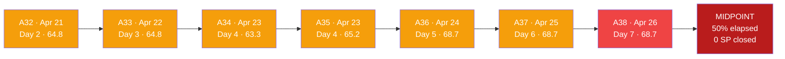
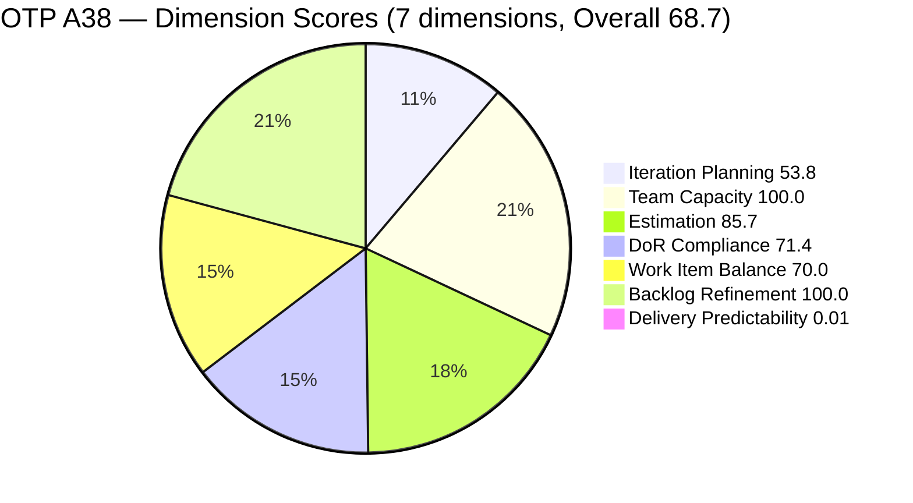
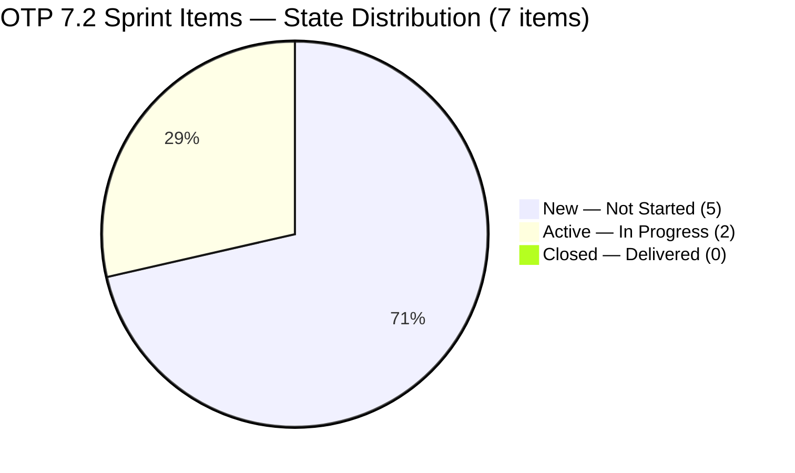
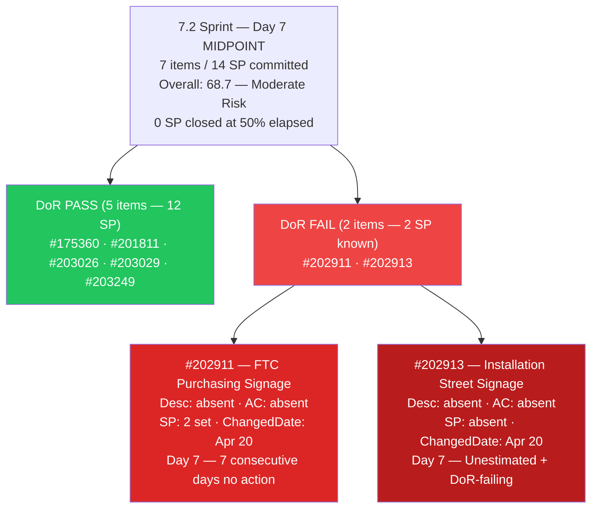
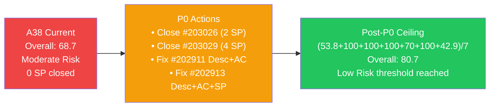
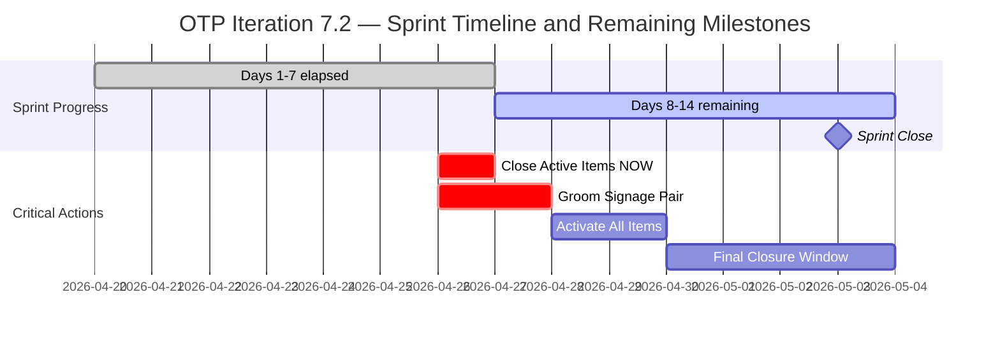

# ADO SAFe Iteration Audit — OTP Team (Office of the President)

## Audit A38 | Iteration 7.2 (Apr 20 – May 3, 2026) | Day 7 of 14

---

## 1. Audit Metadata

| Field | Value |
|-------|-------|
| **Audit Number** | A38 (OTP series) |
| **Audit Date** | April 26, 2026, 14:00 PHT |
| **Auditor** | Claude Code ADO SAFe Audit Agent |
| **Workspace** | `ado_otp` |
| **ADO Project** | OTP (`e7739905-28a3-4ae1-9173-7f6cd13b3494`) |
| **Team** | OTP Team (`64de61f0-1203-4b01-aee2-6b4415aec52b`) |
| **Iteration** | Iteration 7.2 — Apr 20 to May 3, 2026 |
| **Iteration ID** | `611496a8-1907-483b-94b9-4e3ee575faf5` |
| **Iteration Path** | `OTP\2026 - PI7\Iteration 7.2` |
| **Sprint Day** | Day 7 of 14 (50% elapsed) |
| **Prior Audit** | `AUDIT_20260425_0833.md` (A37, 7.2 Day 6, Overall 68.7 — Moderate Risk) |
| **Scoring Model** | ADO SAFe v1 (7-dimension rubric) |
| **Project Exception** | Single-assignee model (Grace) accepted by team per `ado_otp/CLAUDE.md` |
| **Data Source** | Live ADO read — 2026-04-26 14:00 PHT |
| **Overall Score** | **68.7 / 100** |
| **Risk Band** | **Moderate Risk** (60–79.9) |

---

## 2. Executive Summary

OTP holds at **68.7 (Moderate Risk)** at Day 7 — the sprint's exact midpoint. This is the **third consecutive day with zero ADO changes** to sprint items, and the **seventh consecutive day** that #202911 and #202913 have had no Description or Acceptance Criteria.

**Critical midpoint warning:** The sprint is now 50% elapsed. With 0 SP closed and two DoR failures unresolved, the P0 remediation window that was flagged in A36 (Day 5) and A37 (Day 6) has now definitively closed for practical delivery purposes. Any item that has not yet moved to Active by Day 8 has a severely diminished chance of reaching Closed by May 3.

**What did NOT change (P0 items unresolved at Day 7):**

1. **#202911 "FTC Purchasing of signage material"** — No Description, no Acceptance Criteria. ChangedDate still Apr 20 (sprint start). Seven consecutive days with zero content. Carry-forward to 7.3 is now the probable outcome.

2. **#202913 "Installation of Street Signage"** — No Description, no Acceptance Criteria, no Story Points. ChangedDate still Apr 20. Seven consecutive days with zero content. This item cannot begin until groomed — activation before Day 10 is required for any delivery chance.

3. **#203026 (Bylaws Amendment, 2 SP) and #203029 (Documentation, 4 SP)** — Both remain Active since Apr 23 (now 4 days Active). No closure has been recorded. Delivery Predictability remains 0.0.

**What remains positive:**
- All 13 visible backlog items are fresh (100% within 45 days)
- 5/7 sprint items remain DoR-compliant
- Grace has configured capacity (2.5 h/day) covering remaining sprint days
- Zero stale items in the backlog

**Post-P0 score ceiling (if DoR remediated + items closed today):**
- DoR 71.4 → 100.0 (+4.1 overall)
- Estimation 85.7 → 100.0 (+2.0 overall)
- Delivery (close #203026 2SP + #203029 4SP = 6/14 SP): 0.0 → 42.9 (+6.1 overall)
- Combined ceiling: **(53.8+100+100+100+70+100+42.9)/7 = 80.7** (Low Risk threshold)

---

## 3. Previous Audit Delta

| Dimension | A37 — 7.2 Day 6 (08:33 PHT Apr 25) | A38 — 7.2 Day 7 (14:00 PHT Apr 26) | Delta |
|-----------|--------------------------------------|--------------------------------------|-------|
| Iteration Planning | 53.8 | **53.8** | 0.0 |
| Team Capacity | 100.0 | **100.0** | 0.0 |
| Estimation | 85.7 | **85.7** | 0.0 |
| DoR Compliance | 71.4 | **71.4** | 0.0 |
| Work Item Balance | 70.0 | **70.0** | 0.0 |
| Backlog Refinement | 100.0 | **100.0** | 0.0 |
| Delivery Predictability | 0.0 | **0.0** | 0.0 |
| **Overall** | **68.7** | **68.7** | **0.0** |

### Key changes since A37 (08:33 PHT Apr 25 → 14:00 PHT Apr 26)

| Item | Change | Impact |
|------|--------|--------|
| **#202911** | No change. Still no Desc, no AC. ChangedDate: Apr 20. | P0 unresolved — Day 7 (midpoint breach) |
| **#202913** | No change. Still no Desc, no AC, no SP. ChangedDate: Apr 20. | P0 unresolved — Day 7 (midpoint breach) |
| **#203026** | No change. Still Active since Apr 23 (4 days). | No delivery credit — Day 7 |
| **#203029** | No change. Still Active since Apr 23 (4 days). | No delivery credit — Day 7 |
| **#175360, #201811, #203249** | Unchanged (Apr 23–24). | DoR maintained |
| **#203016, #203020** | Unchanged. Duplication unresolved — Day 7. | Structural issue persists |

**Zero work item changes** detected in the 29.5-hour window between A37 and A38.

---

## 4. Current Iteration Snapshot

| Metric | Value |
|--------|-------|
| Iteration | 7.2 — Apr 20 to May 3, 2026 |
| Iteration Day | Day 7 of 14 (50% elapsed — sprint midpoint) |
| Visible root backlog items | 13 |
| Current iteration root items (7.2) | 7 |
| Committed SP (estimated 7.2 items) | 14 SP |
| Active SP (items in Active state) | 6 SP (#203026=2, #203029=4) |
| Closed SP | 0 SP |
| State mix (7.2 items) | 5 New / 2 Active / 0 Closed |
| Contributors with current work | 1 (Grace — all 7 items) |
| Grace's configured capacity | 2.5 h/day (total iteration: 2h Documentation + 0.5h Requirements) |
| Iteration days off | 2 (reflected in capacity API) |
| Effective sprint days remaining | 7 (Days 8–14) |
| Remaining capacity | ~17.5 h |
| Data currency | Live ADO read — Apr 26, 2026 14:00 PHT |

### 4.1 Current Sprint Items (7) — Live State as of Apr 26 14:00

| ID | Title | Type | State | SP | Assignee | DoR | ChangedDate |
|----|-------|------|-------|----|----------|-----|-------------|
| #175360 | Canvass additional Fire Extinguisher for Pad Davao | User Story | New | 2 | grace | PASS | Apr 24, 2026 |
| #201811 | 2. Solar Vendor Selection | User Story | New | 2 | grace | PASS | Apr 24, 2026 |
| #202911 | FTC Purchasing of signage material | User Story | New | 2 | grace | **FAIL (no Desc, no AC)** | Apr 20, 2026 |
| #202913 | Installation of Street Signage | User Story | New | — | grace | **FAIL (no Desc, no AC, no SP)** | Apr 20, 2026 |
| #203026 | Amend Articles and Bylaws to include TechVoc AC | User Story | **Active** | 2 | grace | PASS | Apr 23, 2026 |
| #203029 | Documentation | User Story | **Active** | 4 | grace | PASS | Apr 23, 2026 |
| #203249 | AI Integration & Competency Mapping | User Story | New | 2 | grace | PASS | Apr 23, 2026 |

### 4.2 Non-Current Items on Board (6)

| ID | Title | IterationPath | State | SP | Assignee |
|----|-------|----------------|-------|----|----------|
| #201815 | Physical Installation & Grid Integration | 7.3 | New | 2 | grace |
| #202912 | Fabrication of Signage | 7.3 | New | — | unassigned |
| #200073 | Notification & Due Process (Legal Phase) | 7.4 | New | 2 | grace |
| #201820 | Monitoring & Handover | 7.4 | New | 2 | grace |
| #203016 | Generate and Validate GIS 2026 Report | PI7 parent | New | 3 | grace |
| #203020 | Generate and Validate GIS 2026 Report | PI7 parent | **Active** | 3 | grace |

> #203016 and #203020 are identical-title PI7-parent stories. #203020 remains Active since Apr 23. The duplication is unresolved for the seventh consecutive day. Closing #203016 would reduce visible count to 12 and lift Iteration Planning from 53.8 → 58.3.

---

## 5. Work Item Analysis

### 5.1 State Distribution — Current 7.2 Items

| State | Count | SP |
|-------|-------|----|
| New | 5 | 10 estimated + 0 (#202913 unestimated) |
| Active | 2 | 6 (#203026=2, #203029=4) |
| Closed | 0 | 0 |

### 5.2 Type Distribution — Current 7.2 Items

| Type | Count | Share |
|------|-------|-------|
| User Story | 7 | 100% |
| All others | 0 | 0% |

User Story present → no −40. Dominant type = 100% > 60% → **−30**. Spike = 0% → no −20. Work Item Balance = **70.0** (structural, accepted per project exception).

### 5.3 DoR Verification — Live Read Apr 26 14:00

| ID | Description (non-ws chars) | AC (non-ws chars) | DoR |
|----|----------------------------|-------------------|-----|
| #175360 | ~52 non-ws chars (compliance officer narrative) | ~42 non-ws chars ("canvass at least 3 vendors") | PASS |
| #201811 | ~84 non-ws chars (project lead, solar provider evaluation) | ~77 non-ws chars (3 competitive bids, WSJF/cost-benefit) | PASS |
| #202911 | **Absent — 0 chars** | **Absent — 0 chars** | **FAIL — Day 7** |
| #202913 | **Absent — 0 chars** | **Absent — 0 chars** | **FAIL — Day 7** |
| #203026 | ~180 non-ws chars (As-a/I-want/So-that) | ~250 non-ws chars (4 AC bullets) | PASS |
| #203029 | ~165 non-ws chars (program manager narrative) | ~100 non-ws chars (5 criteria) | PASS |
| #203249 | ~180 non-ws chars (AI Integration, task decomp) | ~300 non-ws chars (AC1 + AC2) | PASS |

DoR pass rate: **5/7 = 71.4%** — unchanged from A37.

### 5.4 Backlog Age Analysis (today = 2026-04-26)

| Bucket | Threshold | Count | Share |
|--------|-----------|-------|-------|
| Fresh (within 45 days) | ChangedDate ≥ 2026-03-12 | 13 | 100% |
| Stale ≥ 90 days | ChangedDate before 2026-01-26 | 0 | 0% |
| Stale ≥ 180 days | ChangedDate before 2025-10-29 | 0 | 0% |
| Untouched current items | ChangedDate < 2026-04-20 | **0** | **0%** |

> #202911 and #202913 have ChangedDate = Apr 20 (sprint start date), which equals — not precedes — the sprint start. They are not classified as untouched-current. All 13 visible items remain within the 45-day freshness window. No Backlog Refinement penalties apply.

### 5.5 Estimation Analysis

| ID | Type | SP | Point-Eligible | Estimated |
|----|------|----|----------------|-----------|
| #175360 | User Story | 2 | Yes | Yes |
| #201811 | User Story | 2 | Yes | Yes |
| #202911 | User Story | 2 | Yes | Yes |
| #202913 | User Story | — | Yes | **No** |
| #203026 | User Story | 2 | Yes | Yes |
| #203029 | User Story | 4 | Yes | Yes |
| #203249 | User Story | 2 | Yes | Yes |
| **Totals** | | **14 SP** | 7 | 6 |

#202913 remains the sole unestimated item — now at Day 7. No change from A37.

### 5.6 Sprint Velocity Outlook (Day 7 — Midpoint)

| Metric | Value |
|--------|-------|
| Committed SP | 14 |
| Active SP (in progress) | 6 (#203026=2, #203029=4) |
| Closed SP | 0 |
| Effective work days remaining | 7 (Days 8–14) |
| Remaining capacity | ~17.5 h |
| SP-per-day target (to hit 100% delivery) | ~2.0 SP/day |

The velocity requirement has increased again: 2.0 SP/day (vs 1.75 at Day 6). At Grace's capacity of 2.5 h/day, the mathematical ceiling is approximately 1 item closed per 1–2 days. Closing both Active items (#203026 + #203029 = 6 SP) would bring delivery to 42.9%; a full sprint close (14 SP) requires all remaining items activated, groomed, and closed in 7 days — now a high-risk scenario.

---

## 6. SAFe Compliance Scorecard

| Dimension | Score | Evidence | Notes |
|-----------|-------|----------|-------|
| Iteration Planning | 53.8 | 7 current / 13 visible root | Unchanged; 2 PI7-parent orphans + 4 future-iteration items persist |
| Team Capacity | 100.0 | Grace: 2.5 h/day (2 activities); 2 days off accounted | 1/1 contributor with capacity; single-assignee exception applies |
| Estimation | 85.7 | 6/7 point-eligible items estimated | #202913 sole unestimated item — Day 7 |
| DoR Compliance | 71.4 | 5/7 items pass Desc ≥30 AND AC ≥20 | #202911 and #202913 still DoR-failing at Day 7 — midpoint breach |
| Work Item Balance | 70.0 | 100% User Story; dominant >60% → −30 | Structural constraint; accepted per project exception |
| Backlog Refinement | 100.0 | 13/13 fresh; 0 stale; 0 untouched-current | Perfect score maintained |
| Delivery Predictability | 0.0 | 0 SP closed / 14 SP committed | Day 7 of 14 — no early-sprint annotation applies; 0% delivery at midpoint |
| **Overall** | **68.7** | (53.8+100.0+85.7+71.4+70.0+100.0+0.0)/7 | **Moderate Risk** (60–79.9) |

### Score Computation Detail

```
1. Iteration Planning
   visible_root_backlog_items          = 13
   current_iteration_root_items (7.2)  = 7
   Score = round(7 / 13 × 100, 1)     = 53.8

2. Team Capacity
   contributors_with_current_work      = 1 (grace)
   contributors_with_capacity          = 1 (grace: 2 activities; 2.5 h/day)
   Score = round(1 / 1 × 100, 1)      = 100.0

3. Estimation
   point_eligible_current_items        = 7 (all User Story)
   estimated_current_items (SP > 0)    = 6
   Score = round(6 / 7 × 100, 1)      = 85.7

4. DoR Compliance
   current_iteration_root_items        = 7
   dor_compliant_current_items         = 5
   Score = round(5 / 7 × 100, 1)      = 71.4

5. Work Item Balance
   User Story present                  = True → no −40
   dominant_type_share                 = 7/7 = 100% > 60% → −30
   spike_share                         = 0% → no −20
   Score = max(0, 100 − 30)           = 70.0

6. Backlog Refinement
   fresh_visible_root_items            = 13 (all ≥ Apr 8 > Mar 12 threshold)
   base = round(13 / 13 × 100, 1)     = 100.0
   stale_90 / visible = 0/13           → no penalty
   stale_180 count = 0                 → no penalty
   untouched_current                   = 0 (#202911/#202913 changed Apr 20 = sprint start)
   Score = max(0, 100.0 − 0)          = 100.0

7. Delivery Predictability
   committed_story_points              = 14 SP
   closed_story_points                 = 0 SP
   Score = round(0 / 14 × 100, 1)    = 0.0
   Note: Day 7 of 14 — sprint midpoint. No early-sprint excuse applies.

Overall = round((53.8 + 100.0 + 85.7 + 71.4 + 70.0 + 100.0 + 0.0) / 7, 1)
        = round(480.9 / 7, 1)
        = 68.7  →  MODERATE RISK (60–79.9)
```

---

## 7. Dimension Findings

### 7.1 Iteration Planning — 53.8 (Structural ceiling; unchanged Day 7)

7/13 visible items are in Iteration 7.2. The ceiling is held down by:
- 4 items in future iterations (7.3: #201815, #202912; 7.4: #200073, #201820)
- 2 PI7-parent orphans (#203016, #203020 — identical titles)

The #203016 vs #203020 duplication persists through a seventh sprint day. #203020 remains Active. If #203016 (New) is closed as the non-canonical duplicate, visible count drops 13→12, lifting Iteration Planning from 53.8 to 58.3 (+4.5 on the dimension, +0.6 overall).

### 7.2 Team Capacity — 100.0 (Maintained)

Grace is the sole contributor. Configured capacity: 2.5 h/day (2h Documentation + 0.5h Requirements). The iteration capacity API confirms 2 days off (accounted for in sprint planning). With 7 remaining working days (Days 8–14), effective remaining capacity is approximately **17.5 hours**. No capacity degradation observed.

### 7.3 Estimation — 85.7 (Unchanged — #202913 Day 7)

#202913 "Installation of Street Signage" enters its seventh sprint day without Story Points, Description, or Acceptance Criteria. The peer item #202911 (Purchasing, SP=2) and historical precedent #198587 both suggest SP=2–3. This item must be estimated before it can transition to Active, and it cannot be delivered without grooming.

### 7.4 DoR Compliance — 71.4 (Unchanged — CRITICAL MIDPOINT BREACH)

**Sprint midpoint (Day 7) reached with #202911 and #202913 still DoR-failing.** Both items were committed to the sprint on Apr 20 with zero content. This is the third consecutive flagging (A36, A37, A38) with no remediation.

The midpoint breach materially changes the risk calculus:
- **Before Day 7:** Items could still be groomed, activated, and closed in the second half.
- **After Day 7:** Any item requiring grooming + activation + delivery has at most 7 working days. At Grace's 2.5h/day pace, grooming two items takes 1–2 days; activation and delivery take additional days each. The signage pair (#202911, #202913) is now at **HIGH carry-forward risk**.

**#202911 — "FTC Purchasing of signage material" — FAIL (Day 7)**
- Description: 0 chars. SP=2 set but item has no content — a structural inconsistency that has persisted for the full first half of the sprint.
- Remediation estimate: ~15 minutes.

**#202913 — "Installation of Street Signage" — FAIL (Day 7)**
- Description: 0 chars. SP: absent. AC: absent.
- Remediation estimate: ~20 minutes.
- Cannot move to Active until both Desc + AC + SP are set.

**Post-remediation score impact:**
- DoR: 71.4 → 100.0 (+28.6 pts on dimension, +4.1 pts overall)
- Estimation: 85.7 → 100.0 (+14.3 pts on dimension, +2.0 pts overall)

### 7.5 Work Item Balance — 70.0 (Structural; accepted per project exception)

100% User Story composition triggers the −30 dominant-type penalty. No remediation path within 7.2 per the team's accepted project exception. Persistent structural constraint.

### 7.6 Backlog Refinement — 100.0 (Maintained)

All 13 visible backlog items remain fresh (ChangedDate ≥ Apr 8, 2026 — well within the 45-day window from Apr 26). Zero stale items. Zero untouched-current items (ChangedDate on #202911 and #202913 equals Apr 20, the sprint start date — not before it). Perfect score holds.

**Watch note:** If no ADO changes are made to #202911 or #202913 through the remainder of the sprint, they will age from ChangedDate Apr 20 but will not trigger an untouched-current penalty since their ChangedDate is not before the sprint start. The Backlog Refinement score is not at risk from these items in 7.2.

### 7.7 Delivery Predictability — 0.0 (MIDPOINT ALARM — 0 SP at 50% elapsed)

0 SP closed / 14 SP committed = **0.0**. Day 7 of 14 — sprint midpoint. This is now a definitive performance signal, not a timing artifact. The early-sprint annotation has expired.

**Closure urgency — remaining SP-per-day requirements:**
- Close #203026 only (2 SP) → Delivery 14.3% (still well below any threshold)
- Close #203026 + #203029 (6 SP) → Delivery 42.9%
- Close all remaining 5 New items (2+2+2+2+0 = 8 SP max) + Active (6 SP) = 14 SP → Delivery 100% (requires all items groomed and closed in 7 days)

The only realistic first action is closing the two Active items (#203026 and #203029) which have been in-progress for 4 days. These should be closeable now.

---

## 8. Risks and Bottlenecks

| # | Risk | Severity | Owner | Status vs A37 |
|---|------|----------|-------|----------------|
| R1 | **#202911 and #202913 DoR-failing — Day 7, midpoint breach, no content since sprint start** | **CRITICAL** | Grace | **Escalated — midpoint reached without remediation; carry-forward to 7.3 now highly probable** |
| R2 | **#202913 has no SP, Desc, or AC** — sole unestimated item; Day 7 | **HIGH** | Grace | Unchanged — 7th consecutive day |
| R3 | **Zero Closed SP at sprint midpoint** — velocity target now 2.0 SP/day; requires sustained daily closures | **HIGH** | Grace | Escalated — from 1.75 (Day 6) to 2.0 SP/day |
| R4 | **#203026 and #203029 Active for 4 days with no closure signal** | **HIGH** | Grace | New escalation — items should be closeable now |
| R5 | **#203016 and #203020 likely duplicates** — PI7-parent orphans, #203020 Active; Day 7 unresolved | **MODERATE** | Grace / Ramon | Unchanged |
| R6 | **2 PI7-parent orphans** — depress Iteration Planning ceiling at 53.8 | **MODERATE** | Ramon | Unchanged |
| R7 | **#202912 (7.3) unassigned** — Fabrication of Signage without owner; 7.3 starts May 4 | **MODERATE** | Ramon | Escalated — 8 calendar days to sprint 7.3 start |
| R8 | **No sprint goal for 7.2** | **LOW** | Ramon | Persistent across all PI7 audits |
| R9 | **#203249 (AI Integration) still New at Day 7** | **LOW** | Grace | Added — this item should move to Active in second half |

---

## 9. Prioritized Recommendations

### P0 — IMMEDIATELY (Apr 26, Day 7)

> The sprint midpoint has been crossed with zero SP delivered and two DoR-failing items unchanged since sprint start. Action within the next 24 hours is required to avoid full carry-forward.

1. **Close #203026 (Bylaws Amendment, 2 SP)** — Active since Apr 23 (4 days). This is the single highest-leverage action available right now. If the SEC amendment submission milestone has been reached, transition to Closed immediately. This scores the sprint's first 14.3% delivery credit and breaks the 0.0 delivery trajectory.

2. **Close #203029 (Documentation, 4 SP)** — Active since Apr 23 (4 days). If the DOLE documentation series has reached a checkpoint, close this item alongside #203026. Combined, closing both = 42.9% Delivery Predictability — a meaningful improvement.

3. **Write Description + Acceptance Criteria for #202911** (~15 min).
   - Desc: *"As a Procurement Officer, I want to purchase signage materials for the FTC Signage project so that the Fabrication team (#202912) can begin work on schedule."*
   - AC: PO approved; 3+ vendor quotes documented; materials delivered; quality checked against spec; cost within budget ceiling.

4. **Write Description + Acceptance Criteria + Story Points for #202913** (~20 min).
   - Desc: *"As a Facilities Engineer, I want to install the FTC street signage so that the campus navigation improvements are complete and visible to all stakeholders."*
   - AC: Signage mounted per approved layout; structural integrity verified; night-time visibility confirmed; handover documentation signed.
   - SP: 2–3 (recommend 3, based on #198587 precedent).

**Combined P0 impact (all four actions completed today):**
- DoR: 71.4 → 100.0 (+4.1 overall)
- Estimation: 85.7 → 100.0 (+2.0 overall)
- Delivery: 0.0 → 42.9 (+6.1 overall)
- Post-P0 overall ceiling: **(53.8 + 100 + 100 + 100 + 70 + 100 + 42.9) / 7 = 80.7 (Low Risk)**

### P1 — Before Day 9 (Apr 28)

1. **Resolve #203016 vs #203020 duplication** — Close whichever is the non-canonical GIS Report item. If #203020 (Active) is the keeper, close #203016 (New, no change since Apr 20). Drops visible count 13→12, lifts Iteration Planning 53.8 → 58.3.
2. **Move #203249 (AI Integration, 2 SP) to Active** — Currently New at Day 7. Should be in progress during the second half. Activate to signal delivery momentum.
3. **Assign #202912 (Fabrication of Signage, 7.3)** — Sprint 7.3 starts May 4 (8 calendar days away). This item needs an owner before 7.3 planning begins.

### P2 — Sprint Review / PI-Level

1. **Define a sprint goal for 7.2.** Suggested: *"Complete signage procurement chain + bylaws amendment for TechVoc accreditation + launch AI competency mapping initiative."*
2. **Prepare a 7.2 retrospective entry** on the pattern of zero-content items committed to sprint start (three consecutive audits: A36, A37, A38) without pre-sprint grooming. The signage pair (#202911, #202913) was committed with zero content on Day 1 and reached Day 7 unchanged.
3. **Evaluate #203249 (AI Integration) scope** — At Day 7 still New, with AI task decomposition and tool identification as deliverables. Scope should be assessed for feasibility within the remaining 7 days.

---

## 10. Evidence Gaps and Limitations

| Gap | Impact | Severity | Notes |
|-----|--------|----------|-------|
| **#202911 and #202913 content** | Grace may update after this 14:00 PHT read; report superseded if she acts today | LOW | Next audit captures any changes |
| **#203020 vs #203016 canonical status** | Cannot determine which is the "live" GIS Report without team input | MODERATE | Both persist as PI7-parent items in visible count |
| **#202912 owner** | No assignee in ADO; may be intentional for 7.3 planning | MODERATE | 7.3 starts May 4 — 8 days away |
| **Sprint goal for 7.2** | Not found in ADO; PI alignment not assessable | LOW | Persistent gap across all 7.2 audits |
| **#203026 and #203029 closure status** | Items Active for 4 days; real-world completion may be further along than ADO reflects | MODERATE | Grace typically updates ADO in early morning PHT pattern |
| **Story Points field variant** | OTP uses `Microsoft.VSTS.Scheduling.StoryPoints` (not `Microsoft.VSTS.Common.StoryPoints`) | LOW | Field correctly identified; data verified |

---

## 11. Visualizations

### 11.1 Score Trajectory — OTP 7.2 Sprint Audits (A32 → A38)



### 11.2 Dimension Score Breakdown (A38)



### 11.3 Sprint Item State Distribution (Day 7 of 14)



### 11.4 DoR Status — 7.2 Sprint Items (A38)



### 11.5 P0 Score Impact Path (If All Actions Completed Today)



### 11.6 Remaining Sprint Timeline



---

*Report generated: 2026-04-26 14:00 PHT | Audit A38 | ado_otp | Iteration 7.2 Day 7 (Midpoint)*
*Data currency: Live ADO read at 2026-04-26 14:00 PHT*
*Prior audit: AUDIT_20260425_0833.md (A37, Overall 68.7 Moderate Risk)*
