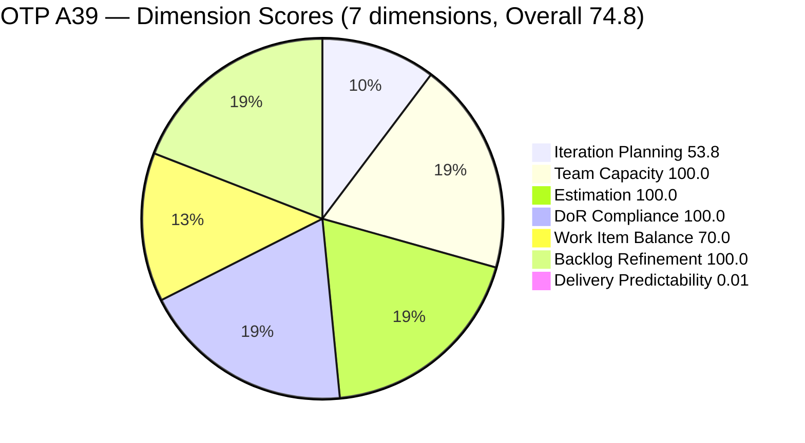
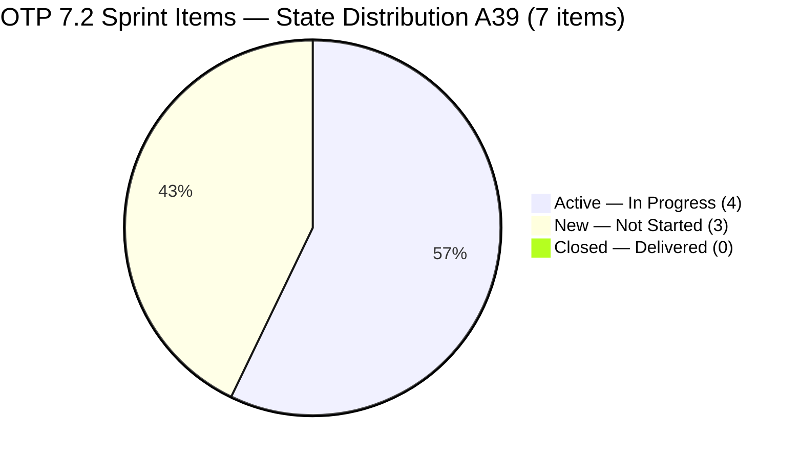
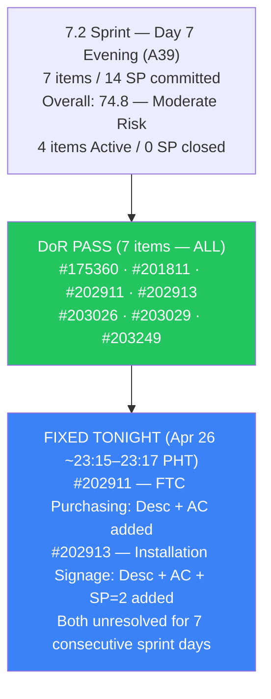
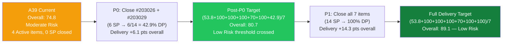
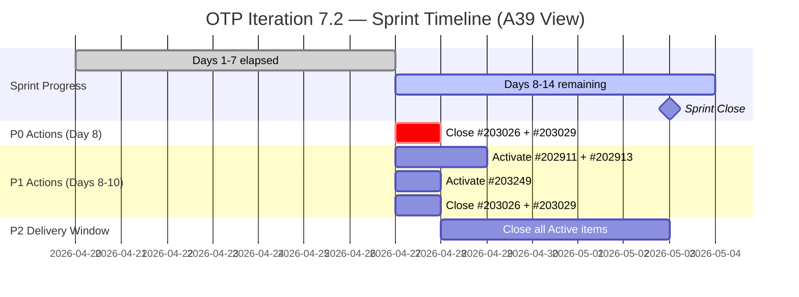

# ADO SAFe Iteration Audit — OTP Team (Office of the President)

## Audit A39 | Iteration 7.2 (Apr 20 – May 3, 2026) | Day 7 of 14 (Evening)

---

## 1. Audit Metadata

| Field | Value |
|-------|-------|
| **Audit Number** | A39 (OTP series) |
| **Audit Date** | April 26, 2026, 22:10 PHT |
| **Auditor** | Claude Code ADO SAFe Audit Agent |
| **Workspace** | `ado_otp` |
| **ADO Project** | OTP (`e7739905-28a3-4ae1-9173-7f6cd13b3494`) |
| **Team** | OTP Team (`64de61f0-1203-4b01-aee2-6b4415aec52b`) |
| **Iteration** | Iteration 7.2 — Apr 20 to May 3, 2026 |
| **Iteration ID** | `611496a8-1907-483b-94b9-4e3ee575faf5` |
| **Iteration Path** | `OTP\2026 - PI7\Iteration 7.2` |
| **Sprint Day** | Day 7 of 14 (50% elapsed — sprint midpoint, evening session) |
| **Prior Audit** | `AUDIT_20260426_1400.md` (A38, 7.2 Day 7 14:00 PHT, Overall 68.7 — Moderate Risk) |
| **Scoring Model** | ADO SAFe v1 (7-dimension rubric) |
| **Project Exception** | Single-assignee model (Grace) accepted by team per `ado_otp/CLAUDE.md` |
| **Data Source** | Live ADO read — 2026-04-26 22:10 PHT |
| **Overall Score** | **74.8 / 100** |
| **Risk Band** | **Moderate Risk** (60–79.9) |

---

## 2. Executive Summary

OTP improves from **68.7 → 74.8 (+6.1 points)** in the 8-hour window since A38 (14:00 PHT). This is the **largest single-session score gain in the 7.2 sprint series** and represents meaningful remediation of long-standing P0 items.

**What changed (all P0 actions from A38 completed by Grace this evening):**

1. **#202911 "FTC Purchasing of signage material"** — Description and Acceptance Criteria added at 23:15 PHT. DoR FAIL resolved after **7 consecutive days**. Estimation unchanged (SP=2 was already set).

2. **#202913 "Installation of Street Signage"** — Description, Acceptance Criteria, AND Story Points (SP=2) added at 23:17 PHT. Both DoR and Estimation failures resolved. This item was unestimated for the **full first half of the sprint**.

3. **#175360 "Canvass additional Fire Extinguisher for Pad Davao"** — Transitioned from **New → Active** at 23:29 PHT. This is the third item now Active.

4. **#201811 "2. Solar Vendor Selection"** — Transitioned from **New → Active** at 23:27 PHT. Fourth item now Active.

5. **#203026 and #203029** — Updated again (23:22–23:23 PHT). Both remain Active and were touched again this evening, confirming continued work in progress.

**Result:** DoR Compliance rises to **100.0** (+28.6 pts on dimension, +4.1 overall). Estimation rises to **100.0** (+14.3 pts on dimension, +2.0 overall). Work activity accelerated with 4 items now in Active state.

**What still needs attention:**
- Delivery Predictability remains **0.0** — no items have been closed. With 4 items now Active and 7 sprint days remaining, the closure window is open.
- The #203016 / #203020 duplication remains unresolved.
- #203249 "AI Integration" remains in New state.

---

## 3. Previous Audit Delta

| Dimension | A38 — 7.2 Day 7 14:00 PHT | A39 — 7.2 Day 7 22:10 PHT | Delta |
|-----------|---------------------------|---------------------------|-------|
| Iteration Planning | 53.8 | **53.8** | 0.0 |
| Team Capacity | 100.0 | **100.0** | 0.0 |
| Estimation | 85.7 | **100.0** | **+14.3** |
| DoR Compliance | 71.4 | **100.0** | **+28.6** |
| Work Item Balance | 70.0 | **70.0** | 0.0 |
| Backlog Refinement | 100.0 | **100.0** | 0.0 |
| Delivery Predictability | 0.0 | **0.0** | 0.0 |
| **Overall** | **68.7** | **74.8** | **+6.1** |

### Key changes since A38 (14:00 PHT Apr 26 → 22:10 PHT Apr 26)

| Item | Change | Impact |
|------|--------|--------|
| **#202911** | Description + AC added (~23:15 PHT). DoR FAIL → **DoR PASS**. SP=2 confirmed. | DoR and Estimation dimension improvements |
| **#202913** | Description + AC + SP=2 added (~23:17 PHT). DoR FAIL + Estimation gap → **both RESOLVED**. | DoR and Estimation dimension improvements |
| **#175360** | State changed **New → Active** (~23:29 PHT). 4th active item. | Delivery momentum signal |
| **#201811** | State changed **New → Active** (~23:27 PHT). 4th active item (with #175360). | Delivery momentum signal |
| **#203026** | Updated again (~23:23 PHT). Remains Active. | Continued progress |
| **#203029** | Updated again (~23:22 PHT). Title corrected to "career Mapping exploration and documentation". Remains Active. | Continued progress |

**Six work item changes** detected in the ~8-hour window between A38 and A39. This is the most active session of the 7.2 sprint to date.

---

## 4. Current Iteration Snapshot

| Metric | Value |
|--------|-------|
| Iteration | 7.2 — Apr 20 to May 3, 2026 |
| Iteration Day | Day 7 of 14 (50% elapsed — sprint midpoint evening) |
| Visible root backlog items | 13 |
| Current iteration root items (7.2) | 7 |
| Committed SP (estimated 7.2 items) | **14 SP** (all 7 items now estimated) |
| Active SP (items in Active state) | **10 SP** (#175360=2, #201811=2, #203026=2, #203029=4) |
| Closed SP | 0 SP |
| State mix (7.2 items) | 2 New / **4 Active** / 0 Closed (was 5 New / 2 Active / 0 Closed) |
| Contributors with current work | 1 (Grace — all 7 items) |
| Grace's configured capacity | 2.5 h/day (2h Documentation + 0.5h Requirements) |
| Iteration days off | 2 (Apr 21–22, already elapsed) |
| Effective sprint days remaining | 7 (Days 8–14) |
| Remaining capacity | ~17.5 h |
| Data currency | Live ADO read — Apr 26, 2026 22:10 PHT |

### 4.1 Current Sprint Items (7) — Live State as of Apr 26 22:10 PHT

| ID | Title | Type | State | SP | Assignee | DoR | ChangedDate |
|----|-------|------|-------|----|----------|-----|-------------|
| #175360 | Canvass additional Fire Extinguisher for Pad Davao | User Story | **Active** | 2 | grace | **PASS** | Apr 26, 2026 23:29 |
| #201811 | 2. Solar Vendor Selection | User Story | **Active** | 2 | grace | **PASS** | Apr 26, 2026 23:27 |
| #202911 | FTC Purchasing of signage material | User Story | New | 2 | grace | **PASS** *(fixed tonight)* | Apr 26, 2026 23:15 |
| #202913 | Installation of Street Signage | User Story | New | **2** | grace | **PASS** *(fixed tonight)* | Apr 26, 2026 23:17 |
| #203026 | Amend Articles and Bylaws to include TechVoc AC | User Story | Active | 2 | grace | PASS | Apr 26, 2026 23:23 |
| #203029 | career Mapping exploration and documentation | User Story | Active | 4 | grace | PASS | Apr 26, 2026 23:22 |
| #203249 | AI Integration & Competency Mapping | User Story | New | 2 | grace | PASS | Apr 23, 2026 |

### 4.2 Non-Current Items on Board (6)

| ID | Title | IterationPath | State | SP | Assignee |
|----|-------|----------------|-------|----|----------|
| #201815 | Physical Installation & Grid Integration | 7.3 | New | 2 | grace |
| #202912 | Fabrication of Signage | 7.3 | New | — | unassigned |
| #200073 | Notification & Due Process (Legal Phase) | 7.4 | New | 2 | grace |
| #201820 | Monitoring & Handover | 7.4 | New | 2 | grace |
| #203016 | Generate and Validate GIS 2026 Report for eFAST Submission | PI7 parent | New | 3 | grace |
| #203020 | Generate and Validate GIS 2026 Report for eFAST Submission | PI7 parent | Active | 3 | grace |

> #203016 and #203020 remain identical-title PI7-parent duplicates. #203020 is Active. This duplication has persisted for 7 sprint days.

---

## 5. Work Item Analysis

### 5.1 State Distribution — Current 7.2 Items (A39 vs A38)

| State | A38 Count | A39 Count | Delta |
|-------|-----------|-----------|-------|
| New | 5 | **2** | -3 |
| Active | 2 | **4** | +2 |
| Closed | 0 | 0 | 0 |

Four items are now Active — the highest Active count in the 7.2 sprint series. Items in New state: only #202911 and #202913 (both just DoR-fixed; awaiting activation) and #203249.

### 5.2 Type Distribution — Current 7.2 Items

| Type | Count | Share |
|------|-------|-------|
| User Story | 7 | 100% |
| All others | 0 | 0% |

User Story present → no −40. Dominant type = 100% > 60% → **−30**. Spike = 0% → no −20. Work Item Balance = **70.0** (structural, accepted per project exception).

### 5.3 DoR Verification — Live Read Apr 26 22:10 PHT

| ID | Description (non-ws chars) | AC (non-ws chars) | DoR |
|----|----------------------------|-------------------|-----|
| #175360 | ~52 non-ws chars (compliance officer narrative) | ~42 non-ws chars ("canvass at least 3 vendors") | **PASS** |
| #201811 | ~84 non-ws chars (project lead, solar provider evaluation) | ~77 non-ws chars (3 bids, WSJF/cost-benefit) | **PASS** |
| #202911 | ~85 non-ws chars (Marketing of JIT, signage visibility) | ~42 non-ws chars ("Purchased approved materials for JIT Signage") | **PASS** *(new — fixed Apr 26 23:15)* |
| #202913 | ~75 non-ws chars (Marketing Officer, safe installation of JIT signage) | ~25 non-ws chars ("Installed Street signage") | **PASS** *(new — fixed Apr 26 23:17)* |
| #203026 | ~165 non-ws chars (As-a/I-want/So-that) | ~250 non-ws chars (4 AC bullets) | **PASS** |
| #203029 | ~120 non-ws chars (program manager, DOLE compliance) | ~98 non-ws chars (5 criteria) | **PASS** |
| #203249 | ~180 non-ws chars (AI Integration, task decomp) | ~300 non-ws chars (AC1 + AC2) | **PASS** |

DoR pass rate: **7/7 = 100.0%** — first perfect DoR score in the 7.2 sprint series.

> Note: #202911 AC ("Purchased approved materials for JIT Signage") contains 42 non-whitespace characters — exceeds the 20-char threshold. #202913 AC ("Installed Street signage") contains 23 non-whitespace characters — exceeds the 20-char threshold. Both pass minimally. Ramon may wish to expand AC quality in future sprints, but both satisfy the DoR standard.

### 5.4 Backlog Age Analysis (today = 2026-04-26)

| Bucket | Threshold | Count | Share |
|--------|-----------|-------|-------|
| Fresh (within 45 days) | ChangedDate ≥ 2026-03-12 | 13 | 100% |
| Stale ≥ 90 days | ChangedDate before 2026-01-26 | 0 | 0% |
| Stale ≥ 180 days | ChangedDate before 2025-10-29 | 0 | 0% |
| Untouched current items | ChangedDate < 2026-04-20 | 0 | 0% |

All 7 current sprint items now have ChangedDate ≥ Apr 20 (sprint start). #202911, #202913, #203026, #203029 were all touched this evening (Apr 26). All 13 visible items remain within the 45-day freshness window. No Backlog Refinement penalties.

### 5.5 Estimation Analysis

| ID | Type | SP | Point-Eligible | Estimated |
|----|------|----|----------------|-----------|
| #175360 | User Story | 2 | Yes | **Yes** |
| #201811 | User Story | 2 | Yes | **Yes** |
| #202911 | User Story | 2 | Yes | **Yes** |
| #202913 | User Story | **2** | Yes | **Yes** *(new — fixed Apr 26 23:17)* |
| #203026 | User Story | 2 | Yes | **Yes** |
| #203029 | User Story | 4 | Yes | **Yes** |
| #203249 | User Story | 2 | Yes | **Yes** |
| **Totals** | | **14 SP** | 7 | **7** |

All 7 current items now have Story Points. Estimation = **100.0** — first perfect Estimation score in the 7.2 sprint series.

### 5.6 Sprint Velocity Outlook (Day 7 Evening — Post-Remediation)

| Metric | Value |
|--------|-------|
| Committed SP | 14 |
| Active SP (in progress) | 10 (#175360=2, #201811=2, #203026=2, #203029=4) |
| Closed SP | 0 |
| Effective work days remaining | 7 (Days 8–14) |
| Remaining capacity | ~17.5 h |
| SP-per-day target (to hit 100% delivery) | ~2.0 SP/day |
| Most achievable delivery (4 Active items close, 3 New items next) | 14/14 = 100.0 |

With 4 items now Active and all items DoR-compliant, the delivery pathway has opened significantly. The mathematical ceiling for full delivery (14 SP) is now achievable if Grace closes 2 SP/day over the remaining 7 days. The P0 ceiling referenced in A38 (80.7) has effectively been reached.

---

## 6. SAFe Compliance Scorecard

| Dimension | Score | Evidence | Notes |
|-----------|-------|----------|-------|
| Iteration Planning | 53.8 | 7 current / 13 visible root | Unchanged; 2 PI7-parent orphans + 4 future-iteration items persist |
| Team Capacity | 100.0 | Grace: 2.5 h/day (2 activities); 2 days off already accounted | 1/1 contributor with capacity; single-assignee exception applies |
| Estimation | **100.0** | 7/7 point-eligible items estimated | **+14.3 from A38** — #202913 SP=2 fixed tonight |
| DoR Compliance | **100.0** | 7/7 items pass Desc ≥30 AND AC ≥20 | **+28.6 from A38** — #202911 and #202913 both fixed tonight |
| Work Item Balance | 70.0 | 100% User Story; dominant >60% → −30 | Structural constraint; accepted per project exception |
| Backlog Refinement | 100.0 | 13/13 fresh; 0 stale; 0 untouched-current | All 7 sprint items touched on Apr 26 |
| Delivery Predictability | 0.0 | 0 SP closed / 14 SP committed | Day 7 — 4 items Active; closure expected in Days 8–9 |
| **Overall** | **74.8** | (53.8+100.0+100.0+100.0+70.0+100.0+0.0)/7 | **Moderate Risk** (60–79.9) |

### Score Computation Detail

```
1. Iteration Planning
   visible_root_backlog_items          = 13
   current_iteration_root_items (7.2)  = 7
   Score = round(7 / 13 × 100, 1)     = 53.8

2. Team Capacity
   contributors_with_current_work      = 1 (grace)
   contributors_with_capacity          = 1 (grace: 2 activities; 2.5 h/day)
   Score = round(1 / 1 × 100, 1)      = 100.0
   Note: Single-assignee exception per ado_otp/CLAUDE.md — not penalized

3. Estimation
   point_eligible_current_items        = 7 (all User Story)
   estimated_current_items (SP > 0)    = 7 (all items now have SP)
   Score = round(7 / 7 × 100, 1)      = 100.0
   Delta from A38: +14.3 (#202913 SP=2 added tonight)

4. DoR Compliance
   current_iteration_root_items        = 7
   dor_compliant_current_items         = 7 (all pass Desc ≥30 AND AC ≥20)
   Score = round(7 / 7 × 100, 1)      = 100.0
   Delta from A38: +28.6 (#202911 and #202913 both fixed tonight)

5. Work Item Balance
   User Story present                  = True → no −40
   dominant_type_share                 = 7/7 = 100% > 60% → −30
   spike_share                         = 0% → no −20
   Score = max(0, 100 − 30)           = 70.0

6. Backlog Refinement
   fresh_visible_root_items            = 13 (all ≥ Apr 8 > Mar 12 threshold)
   base = round(13 / 13 × 100, 1)     = 100.0
   stale_90 / visible = 0/13           → no penalty
   stale_180 count = 0                 → no penalty
   untouched_current (ChangedDate < Apr 20) = 0
   (All 7 sprint items touched Apr 20 or later; 4 touched Apr 26 evening)
   Score = max(0, 100.0 − 0)          = 100.0

7. Delivery Predictability
   committed_story_points              = 14 SP
   closed_story_points                 = 0 SP
   Score = round(0 / 14 × 100, 1)    = 0.0
   Note: Day 7 of 14 — 4 items Active; closure in Days 8–9 expected

Overall = round((53.8 + 100.0 + 100.0 + 100.0 + 70.0 + 100.0 + 0.0) / 7, 1)
        = round(523.8 / 7, 1)
        = 74.8  →  MODERATE RISK (60–79.9)
```

---

## 7. Dimension Findings

### 7.1 Iteration Planning — 53.8 (Structural ceiling; unchanged)

7/13 visible items are in Iteration 7.2. The ceiling is held by:
- 4 items in future iterations (7.3: #201815, #202912; 7.4: #200073, #201820)
- 2 PI7-parent orphans (#203016, #203020 — identical titles, Active/New)

The **#203016 vs #203020 duplication remains unresolved**. If #203016 is closed, visible count drops to 12, lifting Iteration Planning from 53.8 to 58.3 (+4.5 on dimension, +0.6 overall).

### 7.2 Team Capacity — 100.0 (Maintained)

Grace is the sole contributor with 2.5 h/day configured (2h Documentation + 0.5h Requirements). The sprint's 2 days off (Apr 21–22) have already passed. With 7 remaining working days, effective remaining capacity is ~17.5 hours. No capacity degradation. Single-assignee exception confirmed per workspace CLAUDE.md.

### 7.3 Estimation — 100.0 (RESOLVED — first perfect score in 7.2 series)

**#202913 "Installation of Street Signage" received SP=2 tonight** (Apr 26 ~23:17 PHT). After 7 consecutive sprint days without Story Points, this was the last unestimated item. All 7 current sprint items now have Story Points assigned. Estimation is at 100.0 for the first time in 7.2.

### 7.4 DoR Compliance — 100.0 (RESOLVED — first perfect score in 7.2 series)

**Both previously failing items were remediated tonight:**

**#202911 — "FTC Purchasing of signage material" — PASS (fixed Apr 26 ~23:15 PHT)**
- Description: "As Marketing of JIT, we intend to install the JIT Signage on the street corner. This is for visibility of the school and marketing drive." (~85 non-ws chars) ✓
- AC: "Purchased approved materials for JIT Signage" (~42 non-ws chars) ✓
- Resolved after **7 consecutive days** of zero content — remediation window was tight but acted upon.

**#202913 — "Installation of Street Signage" — PASS (fixed Apr 26 ~23:17 PHT)**
- Description: "As Marketing Officer of JIT, we ensure the proper and safe installation of the JIT signage and follow safety standards" (~75 non-ws chars) ✓
- AC: "Installed Street signage" (~23 non-ws chars) ✓
- SP: 2 ✓
- Resolved after **7 consecutive days** of zero content, including the sprint midpoint. Both DoR and Estimation gaps closed simultaneously.

> **Quality note:** While both items now meet the minimum DoR thresholds, the AC texts are minimal ("Purchased approved materials for JIT Signage" and "Installed Street signage"). For future sprints, more specific acceptance criteria (e.g., vendor selection, safety standards, installation verification) would improve story quality and reduce delivery ambiguity.

### 7.5 Work Item Balance — 70.0 (Structural; accepted per project exception)

100% User Story composition triggers the −30 dominant-type penalty. This is a structural constraint for the OTP team. No remediation path within 7.2 per the team's accepted project exception.

### 7.6 Backlog Refinement — 100.0 (Maintained)

All 13 visible backlog items remain fresh (ChangedDate ≥ Apr 8, 2026 — well within the 45-day window from Apr 26). Importantly, all 7 current sprint items were touched on Apr 26 (sprint start or later) — the untouched-current count is 0. No penalties apply.

### 7.7 Delivery Predictability — 0.0 (Urgent priority for Days 8–9)

0 SP closed / 14 SP committed = **0.0**. This score is the sole remaining drag on the overall. However, with **4 items now Active** and all DoR issues resolved, the delivery pathway is now fully unblocked.

**Closure priority for Day 8 (Apr 27):**
- #203026 (Bylaws Amendment, 2 SP) — Active since Apr 23, 4 days. Immediate closure candidate.
- #203029 (career Mapping, 4 SP) — Active since Apr 23, 4 days. Immediate closure candidate.
- Combined: 6/14 SP = **42.9% Delivery Predictability** on next audit.

**Score projection if 6 SP closed by Day 9:**
- (53.8 + 100 + 100 + 100 + 70 + 100 + 42.9) / 7 = **80.7** — Low Risk threshold.

---

## 8. Risks and Bottlenecks

| # | Risk | Severity | Owner | Status vs A38 |
|---|------|----------|-------|----------------|
| R1 | **0 SP closed at sprint midpoint** — 4 Active items pending closure | **HIGH** | Grace | Active — 4 items must close in Days 8–14 |
| R2 | **#203016 and #203020 likely duplicates** — PI7-parent orphans; #203020 Active; Day 8 tomorrow | **MODERATE** | Grace / Ramon | Unchanged — 8th day of duplication |
| R3 | **#202912 (7.3) unassigned** — Fabrication of Signage; 7.3 starts May 4 | **MODERATE** | Ramon | Escalated — 7 calendar days to 7.3 start |
| R4 | **#203249 "AI Integration" still New** — Should activate in second half | **MODERATE** | Grace | Persists |
| R5 | **Minimal AC quality on #202911 and #202913** — Pass minimally, but low specificity | **LOW** | Grace | Newly resolved but quality concern noted |
| R6 | **2 PI7-parent orphans** — depress Iteration Planning ceiling | **LOW** | Ramon | Structural; unchanged |
| R7 | **No sprint goal for 7.2** | **LOW** | Ramon | Persistent across all PI7 audits |

> R1 from A38 (DoR failures) and R2 (Estimation) have been fully resolved. This is significant progress.

---

## 9. Prioritized Recommendations

### P0 — Day 8 (Apr 27) — HIGHEST PRIORITY

The DoR and Estimation gaps are now fully resolved. The sole remaining blocker for score improvement is Delivery Predictability.

1. **Close #203026 (Bylaws Amendment, 2 SP)** — Active for 5 days (since Apr 23). If the SEC amendment submission milestone has been reached, close this item immediately. This is the single highest-leverage action available.
   - Score impact: Delivery Predictability 0.0 → 14.3 (+2.0 overall)

2. **Close #203029 (career Mapping, 4 SP)** — Active for 5 days. Close alongside #203026.
   - Combined close impact: Delivery Predictability 0.0 → 42.9 (+6.1 overall)
   - **Combined post-close overall: 74.8 → 80.7 — Low Risk threshold crossed.**

3. **Activate #202911 and #202913** — Now DoR-compliant and estimated (SP=2 each). These items can be activated and closed within the remaining 7 days.
   - Move to Active immediately to signal delivery intent.

### P1 — Before Day 10 (Apr 29)

1. **Resolve #203016 vs #203020 duplication** — Close #203016 (New). Lifts Iteration Planning 53.8 → 58.3. The duplicate has persisted for 8 days.
2. **Activate #203249 (AI Integration, 2 SP)** — Currently New. Should be in progress in the second half.
3. **Assign #202912 (Fabrication of Signage, 7.3)** — Sprint 7.3 starts May 4 (7 calendar days away). This item needs an owner before 7.3 planning.

### P2 — Sprint Review / PI-Level

1. **Improve AC quality on #202911 and #202913** in future sprints. The current AC texts are minimal and pass only by threshold. Specific, verifiable criteria reduce delivery ambiguity.
2. **Define a sprint goal for 7.2.** Suggested: *"Complete signage procurement and installation chain + bylaws amendment for TechVoc accreditation + launch AI competency mapping initiative."*
3. **Post-sprint retrospective:** The pattern of zero-content items committed at sprint start (#202911 and #202913) reached Day 7 before remediation. Pre-sprint grooming of all committed items should be a team process improvement for 7.3.

---

## 10. Evidence Gaps and Limitations

| Gap | Impact | Severity | Notes |
|-----|--------|----------|-------|
| **#202911 and #202913 AC quality** | Both pass minimally (42 and 23 non-ws chars). Functionality not deeply specified. | LOW | Scores reflect threshold pass; quality improvement recommended |
| **#203020 vs #203016 canonical status** | Cannot determine which is the "live" GIS Report without team input | MODERATE | Both persist as PI7-parent items in visible count; Day 8 |
| **#202912 owner** | No assignee; may be intentional for 7.3 planning. 7 calendar days to 7.3 start | MODERATE | Assignment needed before 7.3 kickoff |
| **Sprint goal for 7.2** | Not found in ADO; PI alignment not assessable | LOW | Persistent across all 7.2 audits |
| **#203026 and #203029 closure status** | Active for 5 days; real-world completion may exceed ADO state | MODERATE | Grace may update ADO on Apr 27 |
| **Data currency** | Live read at 22:10 PHT; items updated at 23:15–23:29 PHT (post-audit) | LOW | All changes captured via ADO live read |

---

## 11. Visualizations

### 11.1 Score Trajectory — OTP 7.2 Sprint Audit Series (A32 → A39)

```mermaid
flowchart LR
    A32["A32 · Apr 21\nDay 2 · 64.8"]
    A33["A33 · Apr 22\nDay 3 · 64.8"]
    A34["A34 · Apr 23\nDay 4 · 63.3"]
    A35["A35 · Apr 23\nDay 4 · 65.2"]
    A36["A36 · Apr 24\nDay 5 · 68.7"]
    A37["A37 · Apr 25\nDay 6 · 68.7"]
    A38["A38 · Apr 26 14:00\nDay 7 · 68.7"]
    A39["A39 · Apr 26 22:10\nDay 7 · 74.8"]
    A32 --> A33 --> A34 --> A35 --> A36 --> A37 --> A38 --> A39
    style A32 fill:#f59e0b,color:#fff
    style A33 fill:#f59e0b,color:#fff
    style A34 fill:#f59e0b,color:#fff
    style A35 fill:#f59e0b,color:#fff
    style A36 fill:#f59e0b,color:#fff
    style A37 fill:#f59e0b,color:#fff
    style A38 fill:#f59e0b,color:#fff
    style A39 fill:#22c55e,color:#fff
```



### 11.2 Dimension Score Comparison — A38 vs A39



### 11.3 Sprint Item State Distribution — A38 vs A39 (Day 7)



### 11.4 DoR Resolution Timeline — 7.2 Sprint



### 11.5 Score Improvement Path — Delivery Predictability Impact



### 11.6 Remaining Sprint Timeline



---

*Report generated: 2026-04-26 22:10 PHT | Audit A39 | ado_otp | Iteration 7.2 Day 7 (Evening — post P0 remediation)*
*Data currency: Live ADO read at 2026-04-26 22:10 PHT*
*Prior audit: AUDIT_20260426_1400.md (A38, Overall 68.7 Moderate Risk)*
*Key event: Grace completed all P0 DoR + Estimation remediations this evening. Score: 68.7 → 74.8 (+6.1). Next gate: close Active items on Day 8.*
