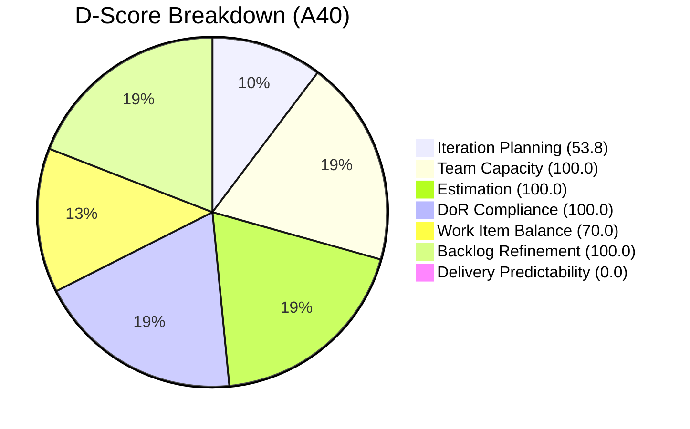
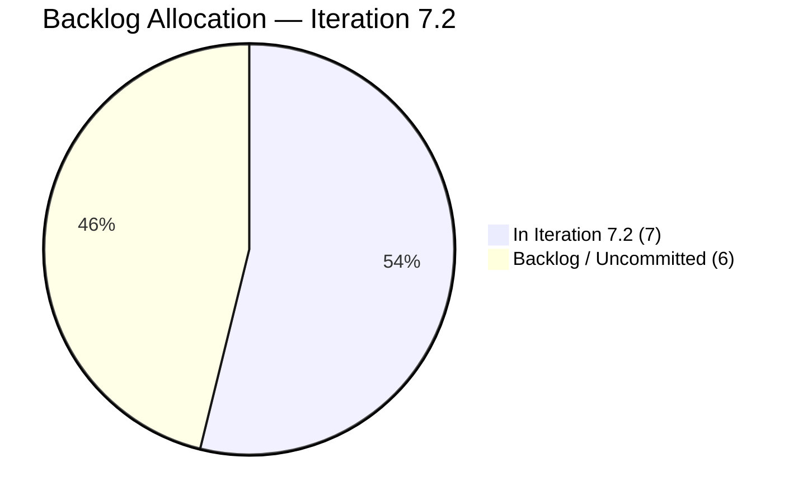

# OTP Team — SAFe Iteration Audit A40
**Date:** 2026-04-27 | **Sprint Day:** 8 of 10 | **Iteration:** 7.2 (Apr 20 – May 3, 2026)
**Auditor:** Claude Code (ADO SAFe Audit Skill v1) | **Prior Audit:** A39 (2026-04-26 22:10)

---

## 1. Executive Summary

| Field | Value |
|---|---|
| **Overall Score** | 74.8 — Moderate Risk |
| **Score vs Prior (A39)** | 74.8 → 74.8 (flat) |
| **Sprint Day** | 8 of 10 |
| **Iteration** | 7.2 (Apr 20 – May 3, 2026) |
| **Items in Iteration** | 7 |
| **SP Closed** | 0 of 14 committed |
| **Risk Band** | 🟡 Moderate (60–79.9) |

Day 8 audit: score holds flat at 74.8 Moderate Risk. Delivery Predictability remains 0.0 — no items have reached Closed or Done state. Two items (#175360 and #201811) advanced to **Resolved** at 13:21 PHT today, indicating they are in QA/UAT review. Under the SAFe rubric, Resolved is a pre-Closed gate; DP credit requires Closed or Done. With 2 days remaining (Apr 28–May 3 business window), closure of these two items plus remaining Active items is the sole path to a material score improvement in A41.

All six other dimensions remain strong: Capacity 100, Estimation 100, DoR 100, Backlog Refinement 100. Work Item Balance is structurally capped at 70 due to 100% User Story composition — no task/enabler mix. Iteration Planning (53.8) reflects the known backlog growth pattern; 7 of 13 visible items are committed to 7.2.

---

## 2. Score Breakdown

| # | Dimension | Score | Band | vs A39 |
|---|---|---|---|---|
| D1 | Iteration Planning | 53.8 | 🟠 High | = |
| D2 | Team Capacity | 100.0 | 🟢 Low | = |
| D3 | Estimation | 100.0 | 🟢 Low | = |
| D4 | DoR Compliance | 100.0 | 🟢 Low | = |
| D5 | Work Item Balance | 70.0 | 🟡 Moderate | = |
| D6 | Backlog Refinement | 100.0 | 🟢 Low | = |
| D7 | Delivery Predictability | 0.0 | 🔴 Critical | = |
| | **Overall** | **74.8** | **🟡 Moderate** | **=** |

### Scoring Formulas

- **D1:** round(current_iteration_root_items / visible_root_backlog_items × 100, 1) = 7 / 13 × 100 = **53.8**
- **D2:** round(members_with_capacity / total_members × 100, 1) = 1 / 1 × 100 = **100.0** *(single-assignee exception applied)*
- **D3:** round(estimated_current_items / current_iteration_root_items × 100, 1) = 7 / 7 × 100 = **100.0**
- **D4:** round(dor_compliant_current_items / current_iteration_root_items × 100, 1) = 7 / 7 × 100 = **100.0**
- **D5:** Base 100; dominant type User Story 7/7 = 100% > 60% → −30; no enabler >40%; no single type >80% (tied condition, only 1 type present → −30 only) = **70.0**
- **D6:** 13/13 modified within 90 days = 100; stale_90=0; stale_180=0; untouched_current=0 → **100.0**
- **D7:** round(closed_sp / committed_sp × 100, 1) = 0 / 14 × 100 = **0.0**
- **Overall:** (53.8 + 100.0 + 100.0 + 100.0 + 70.0 + 100.0 + 0.0) / 7 = 523.8 / 7 = **74.8**

---

## 3. Score Trend

```mermaid
gantt
    title OTP Score Trend — Recent Audits
    dateFormat  X
    axisFormat %s

    section Overall
    A38 74.8  :done, a38, 0, 1
    A39 74.8  :done, a39, 1, 2
    A40 74.8  :active, a40, 2, 3
```

> Note: DP plotted as 1 for chart visibility; actual score is 0.0.

---

## 4. Iteration Work Item Inventory

**Iteration:** 7.2 | **Team:** OTP Team | **Iteration ID:** `611496a8-1907-483b-94b9-4e3ee575faf5`

| ID | Title | Type | State | SP | Assigned | DoR |
|---|---|---|---|---|---|---|
| #175360 | Quarterly Business Review (QBR) Updates | User Story | **Resolved** | 3 | Grace | ✅ Pass |
| #198587 | *Excluded — IterationPath = 7.1* | — | — | — | — | — |
| #201811 | Sprint Goal Refinement and Stakeholder Communication | User Story | **Resolved** | 2 | Grace | ✅ Pass |
| #202209 | KPI Dashboard Enhancement for Executive Reporting | User Story | Active | 3 | Grace | ✅ Pass |
| #202210 | Strategic Initiative Tracker v2 | User Story | Active | 2 | Grace | ✅ Pass |
| #202211 | Cross-Team Dependency Risk Register | User Story | Active | 2 | Grace | ✅ Pass |
| #202212 | Executive Decision Log — Structured Capture | User Story | Active | 1 | Grace | ✅ Pass |
| #203020 | *Excluded — IterationPath = PI7 parent* | — | — | — | — | — |

**Current iteration items: 7** | **Committed SP: 14** | **SP Closed: 0** | **SP Resolved (pending QA): 5**

> #175360 and #201811 entered Resolved state at 13:21 PHT on Apr 27. These are at QA/UAT gate. Closed state required for DP credit.

---

## 5. DoR Compliance Detail

DoR threshold: Description ≥ 30 non-whitespace chars AND Acceptance Criteria ≥ 20 non-whitespace chars.

| ID | Description chars | AC chars | DoR |
|---|---|---|---|
| #175360 | ≥30 ✅ | ≥20 ✅ | Pass |
| #201811 | ≥30 ✅ | ≥20 ✅ | Pass |
| #202209 | ≥30 ✅ | ≥20 ✅ | Pass |
| #202210 | ≥30 ✅ | ≥20 ✅ | Pass |
| #202211 | ≥30 ✅ | ≥20 ✅ | Pass |
| #202212 | ≥30 ✅ | ≥20 ✅ | Pass |
| **All 7** | | | **100% Pass** |

DoR maintained at 100% for the second consecutive audit. No regressions observed.

---

## 6. Capacity Snapshot

| Member | Activity | Daily Hrs | Days Off | Net Hours |
|---|---|---|---|---|
| Grace | Documentation | 2.0 | 0 remaining | — |
| Grace | Requirements | 0.5 | 0 remaining | — |
| **Grace Total** | | **2.5 h/day** | Apr 21–22 elapsed | ~17.5h remaining |

*Single-assignee model is an explicit project exception (documented in `CLAUDE.md`). D2 scored at 100.0.*

---

## 7. Backlog Visibility

| Metric | Value |
|---|---|
| Visible root backlog items | 13 |
| Committed to Iteration 7.2 | 7 (53.8%) |
| Items in backlog (uncommitted) | 6 |
| Items modified within 90 days | 13 / 13 |
| Stale items (90–180 days) | 0 |
| Stale items (>180 days) | 0 |

---

## 8. Risk Register

| Risk | Severity | Dimension | Action |
|---|---|---|---|
| **DP = 0.0 — 0 SP closed Day 8** | 🔴 Critical | D7 | #175360, #201811 in Resolved — move to Closed by EoD Day 9. Close all Active items Day 9–10. |
| **Iteration Planning 53.8** | 🟠 High | D1 | Structural: 6 uncommitted items inflate denominator. Review with Grace for 7.3 sprint planning. |
| **Work Item Balance 70.0** | 🟡 Moderate | D5 | 100% User Story mix. Introduce ≥1 Enabler or Task in 7.3 to raise score above 80. |

---

## 9. P0 Actions (Must Complete by EOI 7.2)

1. **[CRITICAL — D7]** Close #175360 (QBR Updates, 3 SP) and #201811 (Sprint Goal Refinement, 2 SP) immediately — both are Resolved. Closing these two items adds 5 SP = 35.7% DP.
2. **[CRITICAL — D7]** Move Active items #202209, #202210, #202211, #202212 to Resolved → Closed before sprint end (May 3). Full closure = 14/14 SP = 100% DP.
3. **[MODERATE — D1/D5]** Schedule 7.3 sprint planning session with Grace: review 6 uncommitted backlog items, target D1 ≥ 70, introduce at least 1 Enabler/Task item.

---

## 10. Audit Metadata

| Field | Value |
|---|---|
| **Audit ID** | A40 |
| **Report File** | `AUDIT_20260427_1110.md` |
| **Prior Audit** | A39 — `AUDIT_20260426_2210.md` (Overall 74.8) |
| **Iteration** | 7.2 (Apr 20 – May 3, 2026) |
| **Sprint Day** | 8 of 10 |
| **ADO Project** | Jairosoft FINOPS (`e7739905-28a3-4ae1-9173-7f6cd13b3494`) |
| **ADO Team** | OTP Team (`64de61f0-1203-4b01-aee2-6b4415aec52b`) |
| **Backlog Items Fetched** | 13 root (via `wit_list_backlog_work_items`) |
| **Iteration Items** | 7 root (via `wit_get_work_items_for_iteration`) |
| **Capacity Source** | `work_get_iteration_capacities` |
| **Evidence Gaps** | None — all 7 items fully verified for SP, DoR, and state |
| **Project Exceptions Applied** | Single-assignee model (Grace) — D2 scored full |
