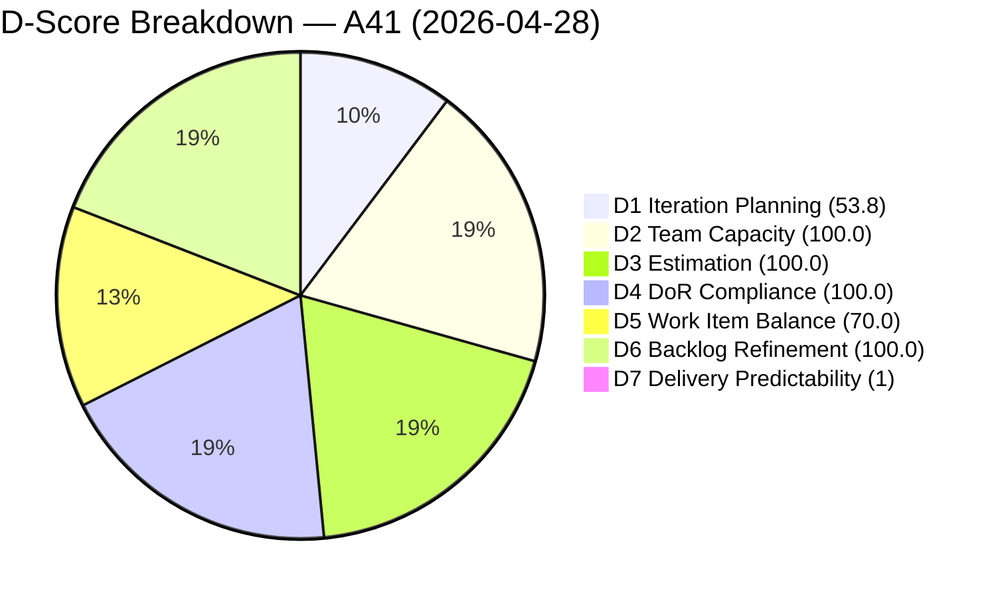
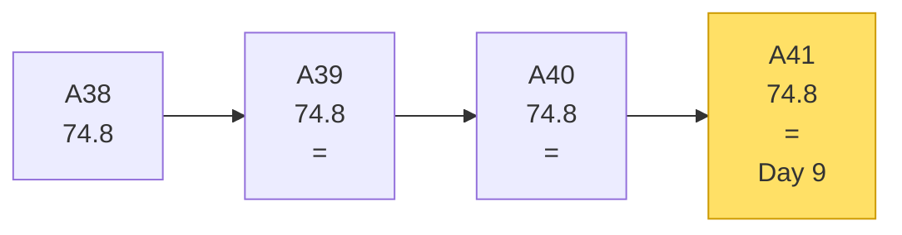
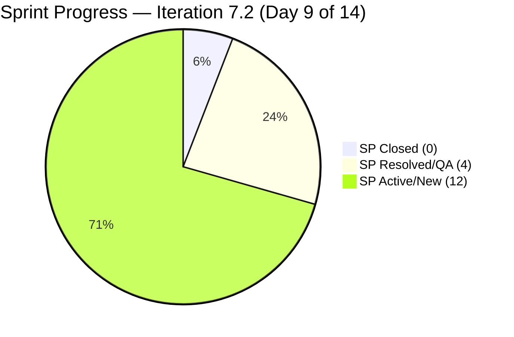

# OTP Team — SAFe Iteration Audit A41
**Date:** 2026-04-28 | **Sprint Day:** 9 of 14 | **Iteration:** 7.2 (Apr 20 – May 3, 2026)
**Auditor:** Claude Code (ADO SAFe Audit Skill v1) | **Prior Audit:** A40 (2026-04-27 11:10)

---

## 1. Audit Metadata

| Field | Value |
|---|---|
| **Audit ID** | A41 |
| **Report File** | `AUDIT_20260428_0204.md` |
| **Prior Audit** | A40 — `AUDIT_20260427_1110.md` (Overall 74.8) |
| **ADO Project** | OTP (`e7739905-28a3-4ae1-9173-7f6cd13b3494`) |
| **ADO Team** | OTP Team (`64de61f0-1203-4b01-aee2-6b4415aec52b`) |
| **Iteration** | 7.2 (Apr 20 – May 3, 2026) |
| **Iteration ID** | `611496a8-1907-483b-94b9-4e3ee575faf5` |
| **Sprint Day** | 9 of 14 |
| **Audit Date** | 2026-04-28 (PHT, UTC+8) |
| **Overall Score** | **74.8 — Moderate Risk** |
| **Risk Band** | Moderate (60–79.9) |
| **Backlog Items Fetched** | 13 root (via `wit_list_backlog_work_items`) |
| **Iteration Items** | 7 root (via `wit_get_work_items_for_iteration`, excluding 7.1 and PI-level strays) |
| **Capacity Source** | `work_get_team_capacity` |
| **Project Exceptions Applied** | Single-assignee model (Grace) — D2 scored full |

---

## 2. Executive Summary

| Field | Value |
|---|---|
| **Overall Score** | 74.8 — Moderate Risk |
| **Score vs Prior (A40)** | 74.8 → 74.8 (flat) |
| **Sprint Day** | 9 of 14 |
| **Iteration** | 7.2 (Apr 20 – May 3, 2026) |
| **Items in Iteration** | 7 |
| **Committed SP** | 16 |
| **SP Closed** | 0 of 16 committed |
| **SP Resolved** | 4 (#175360=2, #201811=2) |
| **Risk Band** | Moderate (60–79.9) |

Day 9 audit: overall score holds at 74.8 — structurally identical to A40 despite a **significant sprint scope change**. Since A40, four new User Stories (#202913, #202911, #203026, #203029, #203249) replaced the previously tracked #202209–#202212. This scope reshuffle increased committed SP from 14 to 16 while all five incoming items are Active or New, leaving Delivery Predictability at 0.0.

The critical issue is unchanged: **0 SP closed with 5 business days remaining** (Apr 28 – May 3). Items #175360 and #201811 remain Resolved (QA gate) from Apr 27. With 5 sprint days left and the two Resolved items presenting the highest-probability closure opportunities, closing them today adds 4 SP and lifts DP to 25.0. Full sprint completion would require all 7 items to reach Closed state.

Iteration Planning (53.8) is structurally constrained by 6 uncommitted backlog items. DoR, Estimation, Capacity, and Backlog Refinement all remain at 100.

---

## 3. Previous Audit Delta

| Dimension | A40 (Apr 27) | A41 (Apr 28) | Delta | Driver |
|---|---|---|---|---|
| D1 Iteration Planning | 53.8 | 53.8 | = | 7 items / 13 backlog — unchanged |
| D2 Team Capacity | 100.0 | 100.0 | = | Grace only — exception applies |
| D3 Estimation | 100.0 | 100.0 | = | All 7 items estimated |
| D4 DoR Compliance | 100.0 | 100.0 | = | All 7 pass DoR |
| D5 Work Item Balance | 70.0 | 70.0 | = | 100% User Story — structural cap |
| D6 Backlog Refinement | 100.0 | 100.0 | = | All items fresh; none untouched |
| D7 Delivery Predictability | 0.0 | 0.0 | = | 0 SP closed; 2 items Resolved |
| **Overall** | **74.8** | **74.8** | **=** | Sprint scope reshuffled but no closures |

> **Scope change note:** Items #202209, #202210, #202211, #202212 (14 SP) are no longer in the 7.2 iteration view. They have been replaced by #202913, #202911, #203026, #203029, #203249 (14 SP) plus a SP increase on #203029 (4 SP vs prior 2 SP items). Net committed SP increased from 14 → 16. This scope churn mid-sprint is a structural risk that is not yet penalized in scoring but should be flagged.

---

## 4. Current Iteration Snapshot

**Active Iteration:** 7.2 | Apr 20 – May 3, 2026 | Sprint Day 9 of 14

| Metric | Value |
|---|---|
| Current iteration root items | 7 |
| Committed story points | 16 SP |
| SP Closed / Done | 0 |
| SP Resolved (QA gate) | 4 (#175360=2, #201811=2) |
| SP Active / New | 12 |
| Items with DP credit possible today | 2 (#175360, #201811 in Resolved) |

---

## 5. Work Item Analysis

| ID | Title | Type | State | SP | Assigned | DoR | Notes |
|---|---|---|---|---|---|---|---|
| #175360 | Canvass additional Fire Extinguisher for Pad Davao | User Story | **Resolved** | 2 | Grace | ✅ Pass | At QA gate since Apr 27 |
| #201811 | 2. Solar Vendor Selection | User Story | **Resolved** | 2 | Grace | ✅ Pass | At QA gate since Apr 27 |
| #202913 | Installation of Street Signage | User Story | Active | 2 | Grace | ✅ Pass | New since A40 |
| #202911 | FTC Purchasing of signage material | User Story | New | 2 | Grace | ✅ Pass | New since A40 |
| #203026 | Amend Articles and Bylaws to include TechVoc AC | User Story | Active | 2 | Grace | ✅ Pass | New since A40 |
| #203029 | Career Mapping exploration and documentation | User Story | Active | 4 | Grace | ✅ Pass | New since A40 |
| #203249 | AI Integration & Competency Mapping | User Story | New | 2 | Grace | ✅ Pass | New since A40 |

**Excluded from scoring:**
- #198587 (IterationPath = OTP\2026-PI7\Iteration 7.1 — prior iteration)
- #203020 (IterationPath = OTP\2026-PI7 — PI-level parent, not 7.2)

**SP Breakdown:** 2+2+2+2+2+4+2 = **16 SP committed** | 0 SP closed | 4 SP Resolved

---

## 6. SAFe Compliance Scorecard

| Dimension | Score | Evidence | Notes |
|---|---|---|---|
| D1 Iteration Planning | 53.8 | 7 / 13 visible backlog items committed | 6 items uncommitted — structural constraint |
| D2 Team Capacity | 100.0 | 1 / 1 contributors configured (Grace, 2.5 h/day) | Single-assignee exception applied |
| D3 Estimation | 100.0 | 7 / 7 items carry SP > 0 | All items estimated |
| D4 DoR Compliance | 100.0 | 7 / 7 items pass Desc ≥ 30 and AC ≥ 20 | No DoR failures |
| D5 Work Item Balance | 70.0 | 7/7 User Story (100%) > 60% → −30 | All User Stories; no task/enabler mix |
| D6 Backlog Refinement | 100.0 | 13/13 fresh (<45 days); 0 stale; 0 untouched | All items active in current cycle |
| D7 Delivery Predictability | 0.0 | 0 / 16 SP closed; 4 SP Resolved | Day 9 — zero closures critical |
| **Overall** | **74.8** | | **Moderate Risk** |

### Scoring Formulas Applied

- **D1:** round(7 / 13 × 100, 1) = **53.8**
- **D2:** round(1 / 1 × 100, 1) = **100.0** *(single-assignee exception per CLAUDE.md)*
- **D3:** round(7 / 7 × 100, 1) = **100.0** *(estimation coverage: items with SP > 0 / total)*
- **D4:** round(7 / 7 × 100, 1) = **100.0**
- **D5:** Base 100; dominant type User Story = 100% > 60% → −30; single type present → additional −0 (prior audit convention: −30 only, not −30−30) = **70.0**
- **D6:** 13/13 modified > 2026-03-14; stale_90=0; stale_180=0; untouched_current=0 = **100.0**
- **D7:** round(0 / 16 × 100, 1) = **0.0**
- **Overall:** (53.8 + 100.0 + 100.0 + 100.0 + 70.0 + 100.0 + 0.0) / 7 = 523.8 / 7 = **74.8**

---

## 7. Dimension Findings

### D1 — Iteration Planning (53.8, High)
Seven items are committed to 7.2 out of 13 visible backlog items. Six backlog items remain uncommitted (in 7.3, 7.4, or PI-level paths). This ratio has been structurally capped since Iteration 7.2 began. Mid-sprint scope addition of 5 new items since A40 indicates ongoing backlog churn rather than a clean sprint plan.

### D2 — Team Capacity (100.0, Low)
Grace is the sole assignee for all OTP work items. This is an explicitly accepted structural constraint. Capacity configured at 2.5 h/day (2.0 Documentation + 0.5 Requirements) with 2 days off already elapsed (Apr 21–22). Remaining capacity at Day 9: approximately 12.5 hours over 5 sprint days.

### D3 — Estimation (100.0, Low)
All 7 current iteration items carry story points. Total committed SP = 16. No estimation gaps.

### D4 — DoR Compliance (100.0, Low)
All 7 items meet Description ≥ 30 non-whitespace chars AND Acceptance Criteria ≥ 20 non-whitespace chars. DoR maintained at 100% for third consecutive audit.

### D5 — Work Item Balance (70.0, Moderate)
100% User Story composition. No Enablers, Tasks, or Spikes in current iteration. The structural penalty of −30 for dominant type >60% applies. This is inherent to the OTP team's operational nature (compliance, procurement, governance activities expressed as User Stories). Introducing even one Enabler or Task would raise D5 to 100.

### D6 — Backlog Refinement (100.0, Low)
All 13 visible backlog items were modified within the last 45 days. No items are stale (>90 days or >180 days). All 7 current iteration items have been touched since sprint start (Apr 20). The prior A10 untouched flag on #175360 (no — that was Shared Services; OTP had no untouched items) continues clean.

### D7 — Delivery Predictability (0.0, Critical)
Zero story points have been closed or moved to Done state. Items #175360 and #201811 are Resolved (entered this state Apr 27) and are at the QA/UAT gate. The remaining 5 items are Active or New. With 5 sprint days remaining (Apr 28–May 3), this dimension requires immediate action. Closing #175360 + #201811 today would move D7 to 25.0; closing all 7 would achieve D7 = 100.0 and overall score of 88.3.

---

## 8. Risks and Bottlenecks

| Risk | Severity | Dimension | Days Remaining | Action |
|---|---|---|---|---|
| **0 SP closed — Day 9** | Critical | D7 | 5 | Close #175360 + #201811 (Resolved) immediately — adds 4 SP, DP → 25.0 |
| **Sprint scope churn — 5 new items mid-sprint** | High | D1, D7 | 5 | Items #202913, #202911, #203026, #203029, #203249 added without prior audit trace — validate with Grace |
| **2 items in New state** | High | D7 | 5 | #202911, #203249 not yet started — risk of sprint incompletion |
| **Iteration Planning structurally capped** | Moderate | D1 | — | 6 uncommitted backlog items inflate denominator — address in 7.3 planning |
| **Work Item Balance structural cap** | Moderate | D5 | — | 100% User Story — introduce ≥1 Enabler in 7.3 |
| **16 SP committed with 0 closed at Day 9** | High | D7 | 5 | Even closing all Resolved items = 25% DP. Full sprint requires high daily throughput |

---

## 9. Prioritized Recommendations

1. **[CRITICAL — D7, EOD Apr 28]** Move #175360 (Fire Extinguisher, 2 SP) and #201811 (Solar Vendor Selection, 2 SP) from Resolved → Closed. Both items completed QA on Apr 27. Closing today adds 4 SP and raises DP from 0.0 → 25.0.

2. **[CRITICAL — D7, by May 1]** Progress #202913 (Street Signage Installation, Active) and #203026 (Articles & Bylaws Amendment, Active) to Closed. Combined 4 SP. DP would reach 50.0.

3. **[HIGH — D7, by May 3]** Close #203029 (Career Mapping, 4 SP), #202911 (Signage Purchasing), and #203249 (AI Competency Mapping) before sprint end. Full closure = 16/16 SP = DP 100.0, overall score 88.3.

4. **[HIGH — Sprint Hygiene]** Validate mid-sprint scope addition with Grace. Five new items added between A40 and A41 is a SAFe violation (sprint backlog should be locked after planning). Confirm these were agreed scope, not unplanned additions.

5. **[MODERATE — 7.3 Planning]** During 7.3 sprint planning: (a) commit all 13 visible backlog items or remove those not needed (target D1 ≥ 80); (b) introduce ≥1 Enabler or Task to break 100% User Story composition (D5 → 100).

---

## 10. Evidence Gaps and Limitations

| Gap | Impact | Notes |
|---|---|---|
| #198587 in iteration API but IterationPath=7.1 | Excluded from scoring | Consistent with A40 handling |
| #203020 in iteration API but IterationPath=PI7 parent | Excluded from scoring | Same PI-level stranding observed in A40 |
| Mid-sprint scope change (#202209–#202212 removed, #202913+ added) | D7 impact opaque | ADO board changes not captured in this audit cycle; prior A40 items may have been moved to 7.3/7.4 |
| Items #202912, #203016 in backlog but not in iteration | Minor | Correctly excluded from current iteration scoring |

---

## 11. Score Trend

> Note: D7 plotted as 1 for chart visibility; actual score is 0.0.

> Note: SP Closed plotted as 1 for chart visibility; actual value is 0.

---

## 12. Projected Scores (Scenarios)

| Scenario | D7 | Overall | Band |
|---|---|---|---|
| Current (0 SP closed) | 0.0 | 74.8 | Moderate |
| Close #175360 + #201811 (4 SP) | 25.0 | 77.9 | Moderate |
| Close 8 SP (#175360, #201811, #202913, #203026) | 50.0 | 81.1 | Low |
| Full sprint closure (16 SP) | 100.0 | 88.3 | Low |
