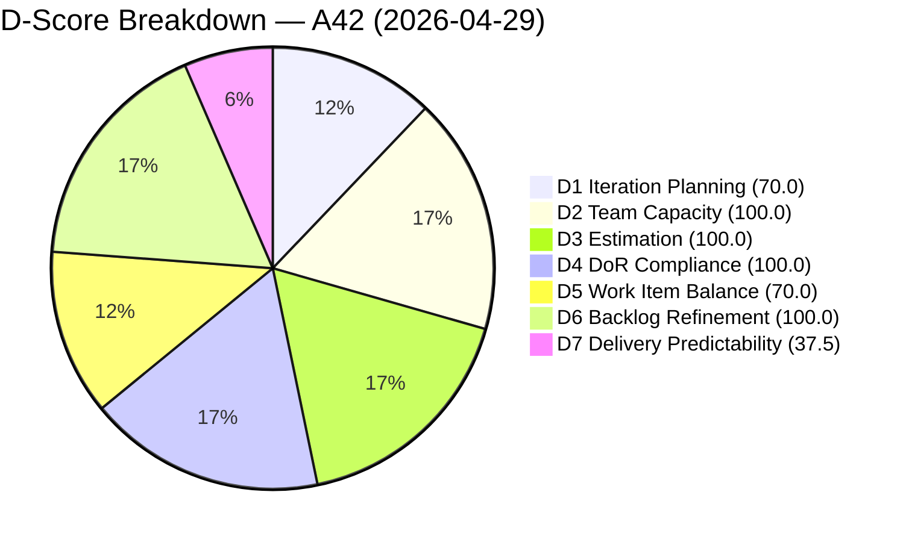
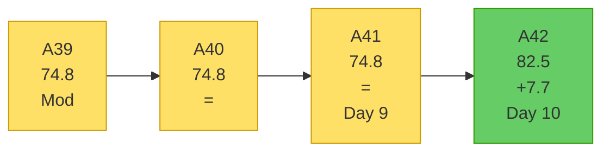
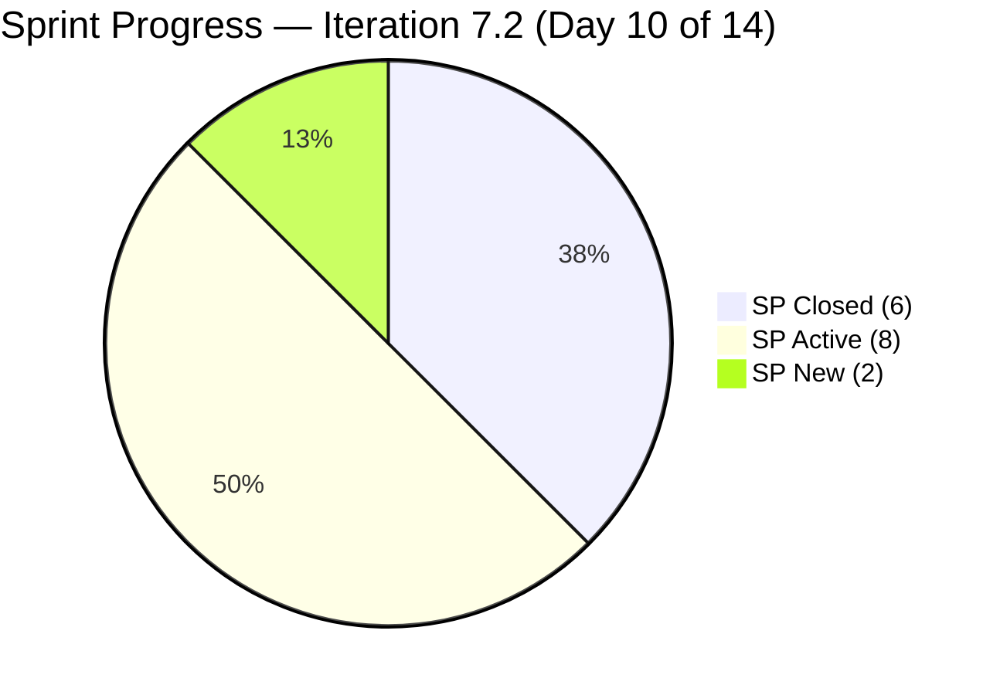

# OTP Team — SAFe Iteration Audit A42
**Date:** 2026-04-29 | **Sprint Day:** 10 of 14 | **Iteration:** 7.2 (Apr 20 – May 3, 2026)
**Auditor:** Claude Code (ADO SAFe Audit Skill v1) | **Prior Audit:** A41 (2026-04-28 02:04)

---

## 1. Audit Metadata

| Field | Value |
|---|---|
| **Audit ID** | A42 |
| **Report File** | `AUDIT_20260429_0206.md` |
| **Prior Audit** | A41 — `AUDIT_20260428_0204.md` (Overall 74.8) |
| **ADO Project** | OTP (`e7739905-28a3-4ae1-9173-7f6cd13b3494`) |
| **ADO Team** | OTP Team (`64de61f0-1203-4b01-aee2-6b4415aec52b`) |
| **Iteration** | 7.2 (Apr 20 – May 3, 2026) |
| **Iteration ID** | `611496a8-1907-483b-94b9-4e3ee575faf5` |
| **Sprint Day** | 10 of 14 |
| **Audit Date** | 2026-04-29 (PHT, UTC+8) |
| **Overall Score** | **82.5 — Low Risk** |
| **Risk Band** | Low (≥ 80) |
| **Visible Backlog Items** | 10 root (via `wit_list_backlog_work_items`) |
| **Iteration Items** | 7 root (via `wit_get_work_items_for_iteration`, IterationPath=7.2) |
| **Capacity Source** | `work_get_team_capacity` |
| **Project Exceptions Applied** | Single-assignee model (Grace) — D2 scored full |

---

## 2. Executive Summary

| Field | Value |
|---|---|
| **Overall Score** | 82.5 — Low Risk |
| **Score vs Prior (A41)** | 74.8 → 82.5 (**+7.7**) |
| **Sprint Day** | 10 of 14 |
| **Iteration** | 7.2 (Apr 20 – May 3, 2026) |
| **Items in Iteration** | 7 |
| **Committed SP** | 16 |
| **SP Closed** | 6 (#175360=2, #201811=2, #203026=2) |
| **SP Remaining** | 10 |
| **Risk Band** | Low (≥ 80) — **first Low Risk OTP audit in Iteration 7.2** |

**A42 is the first Low Risk audit for OTP in Iteration 7.2**, rising +7.7 points from A41. Three items closed on April 28 — #175360 (Fire Extinguisher, 2 SP), #201811 (Solar Vendor Selection, 2 SP), and #203026 (Amend Articles and Bylaws, 2 SP) — delivering 6 SP and lifting D7 from 0.0 → 37.5.

D1 also improved sharply from 53.8 to 70.0: the visible backlog shrank from 13 to 10 items as closed stories dropped off the backlog view, and the 7 committed iteration items now represent 70% of the visible pool. This combination pushed OTP into the Low Risk band.

The critical remaining risk is **D7 at 37.5 (High Risk)**. With 4 sprint days left (Apr 29–May 3) and 10 SP uncommitted across 4 Active/New items, the team must achieve 100% closure to reach full sprint predictability. The two highest-probability closure targets are #202913 (Active, 2 SP) and #203249 (Active, 2 SP).

---

## 3. Previous Audit Delta

| Dimension | A41 (Apr 28) | A42 (Apr 29) | Delta | Driver |
|---|---|---|---|---|
| D1 Iteration Planning | 53.8 | 70.0 | **+16.2** | Backlog shrank 13→10 (closed items removed); ratio 7/10 |
| D2 Team Capacity | 100.0 | 100.0 | = | Grace only — single-assignee exception applies |
| D3 Estimation | 100.0 | 100.0 | = | All 7 items estimated |
| D4 DoR Compliance | 100.0 | 100.0 | = | All 7 pass DoR |
| D5 Work Item Balance | 70.0 | 70.0 | = | 100% User Story — structural cap |
| D6 Backlog Refinement | 100.0 | 100.0 | = | All 10 backlog items fresh; 0 untouched |
| D7 Delivery Predictability | 0.0 | 37.5 | **+37.5** | #175360+#201811+#203026 closed Apr 28 = 6 SP |
| **Overall** | **74.8** | **82.5** | **+7.7** | **Entered Low Risk band** |

---

## 4. Current Iteration Snapshot

**Active Iteration:** 7.2 | Apr 20 – May 3, 2026 | Sprint Day 10 of 14 (4 days remaining: Apr 29–May 3)

| Metric | Value |
|---|---|
| Current iteration root items | 7 |
| Visible backlog root items | 10 |
| Committed ratio | 70.0% |
| Committed story points | 16 SP |
| SP Closed | 6 SP (3 items: #175360, #201811, #203026) |
| SP Active/New | 10 SP (4 items remaining) |
| Delivery velocity (Day 10) | 6/16 = 37.5% |
| Grace remaining capacity | ~10 hours over 4 sprint days (2.5 h/day) |

---

## 5. Work Item Analysis

| ID | Title | Type | State | SP | Assigned | DoR | Notes |
|---|---|---|---|---|---|---|---|
| #175360 | Canvass additional Fire Extinguisher for Pad Davao | User Story | **Closed** | 2 | Grace | ✅ | Closed Apr 28 — DP credit |
| #201811 | 2. Solar Vendor Selection | User Story | **Closed** | 2 | Grace | ✅ | Closed Apr 28 — DP credit |
| #203026 | Amend Articles and Bylaws to include TechVoc AC | User Story | **Closed** | 2 | Grace | ✅ | Closed Apr 28 — DP credit |
| #202913 | Installation of Street Signage | User Story | Active | 2 | Grace | ✅ | Highest-priority closure target |
| #203249 | AI Integration & Competency Mapping | User Story | Active | 2 | Grace | ✅ | Active since Apr 28 |
| #203029 | Career Mapping exploration and documentation | User Story | Active | 4 | Grace | ✅ | Largest remaining item |
| #202911 | FTC Purchasing of signage material | User Story | New | 2 | Grace | ✅ | Not yet started |

**Excluded from scoring (not IterationPath=7.2):**
- #198587 (IterationPath = OTP\2026-PI7\Iteration 7.1 — prior sprint)
- #203020 (IterationPath = OTP\2026-PI7 — PI-level parent)

**SP Breakdown:** Closed=6 (3 items) | Active=8 (#202913=2, #203249=2, #203029=4) | New=2 (#202911=2) | **Total=16**

---

## 6. SAFe Compliance Scorecard

| Dimension | Score | Evidence | Notes |
|---|---|---|---|
| D1 Iteration Planning | 70.0 | 7 / 10 visible backlog items committed | Backlog shrunk from 13→10 as closed items removed; improvement from 53.8 |
| D2 Team Capacity | 100.0 | 1 / 1 contributors configured (Grace, 2.5 h/day) | Single-assignee exception applied per CLAUDE.md |
| D3 Estimation | 100.0 | 7 / 7 items carry SP > 0 | No estimation gaps |
| D4 DoR Compliance | 100.0 | 7 / 7 items pass Desc ≥ 30 and AC ≥ 20 | No DoR failures |
| D5 Work Item Balance | 70.0 | 7/7 User Story (100%) > 60% → −30 | Structural cap; 100% User Story composition |
| D6 Backlog Refinement | 100.0 | 10/10 fresh (<45 days); 0 stale; 0 untouched | All backlog items active in current cycle |
| D7 Delivery Predictability | 37.5 | 6 / 16 SP closed | Day 10 — 3 closures achieved; 10 SP remaining in 4 days |
| **Overall** | **82.5** | | **Low Risk — first Low Risk in Iteration 7.2** |

### Scoring Formulas Applied

- **D1:** round(7 / 10 × 100, 1) = **70.0** *(visible backlog = 10, down from 13 as closed items removed)*
- **D2:** round(1 / 1 × 100, 1) = **100.0** *(single-assignee exception per CLAUDE.md)*
- **D3:** round(7 / 7 × 100, 1) = **100.0**
- **D4:** round(7 / 7 × 100, 1) = **100.0**
- **D5:** Base 100; dominant type User Story = 100% > 60% → −30; no other penalties = **70.0**
- **D6:** 10/10 fresh (all ChangedDates ≥ Apr 8, well within 45-day window); stale_90=0; stale_180=0; untouched_current=0 = **100.0**
- **D7:** round(6 / 16 × 100, 1) = **37.5**
- **Overall:** (70.0 + 100.0 + 100.0 + 100.0 + 70.0 + 100.0 + 37.5) / 7 = 577.5 / 7 = **82.5**

---

## 7. Dimension Findings

### D1 — Iteration Planning (70.0, Moderate)
Seven items are committed to 7.2. The visible backlog has contracted from 13 items in A41 to 10 items today, as three Closed items (#175360, #201811, #203026) dropped off the backlog view. This mechanical improvement lifted D1 from 53.8 to 70.0 without requiring additional planning work. The remaining 3 uncommitted backlog items (#201815 in 7.3, #200073/#201820 in 7.4) represent future-sprint planning horizon and should be reviewed during 7.3 planning. Achieving D1 ≥ 80 in 7.3 would require committing all 10 visible items — achievable if the backlog is appropriately sized.

### D2 — Team Capacity (100.0, Low)
Grace is the sole assignee for all OTP work items, an explicitly accepted structural constraint per CLAUDE.md. Capacity configured at 2.5 h/day (2.0 Documentation + 0.5 Requirements) with 2 days off already elapsed (Apr 21–22). Remaining capacity at Day 10: approximately 10 hours over 4 sprint days. With 10 SP of work remaining and ~10 hours of capacity, the work-to-capacity ratio is tight — velocity must sustain to close remaining items.

### D3 — Estimation (100.0, Low)
All 7 current iteration items carry story points. Total committed SP = 16. No estimation gaps. Consistent at 100.0 for third consecutive audit.

### D4 — DoR Compliance (100.0, Low)
All 7 items meet Description ≥ 30 non-whitespace chars AND Acceptance Criteria ≥ 20 non-whitespace chars. The AC for #202913 ("Installed Street signage" = 22 non-whitespace chars) clears the 20-char threshold. DoR maintained at 100% for the fourth consecutive audit.

### D5 — Work Item Balance (70.0, Moderate)
100% User Story composition. The structural penalty of −30 for dominant type >60% applies. This is an inherent characteristic of OTP's operational nature (compliance, procurement, governance activities all expressed as User Stories). To achieve D5 = 100.0, at least one Enabler or Task would need to be introduced in 7.3.

### D6 — Backlog Refinement (100.0, Low)
All 10 visible backlog items were modified within the last 45 days (most recent: Apr 8 for #201815 and #201820; all others Apr 20+). No items are stale at 90 or 180 days. No current iteration items are untouched since sprint start (Apr 20). Clean for the fifth consecutive audit.

### D7 — Delivery Predictability (37.5, High)
Three story closures on April 28 moved 6 SP to the Closed bucket, lifting D7 from 0.0 to 37.5. However, with 10 SP remaining across 4 active/new items and only 4 sprint days left, full sprint completion (D7=100.0) requires all 4 remaining items to close before May 3.

Priority targets by probability:
1. **#202913** (Installation of Street Signage, 2 SP, Active) — physical installation work, completion depends on site logistics
2. **#203249** (AI Integration & Competency Mapping, 2 SP, Active) — analysis/documentation task
3. **#203029** (Career Mapping, 4 SP, Active) — largest item, documentation-heavy
4. **#202911** (FTC Purchasing of signage material, 2 SP, New) — not yet started, highest risk of spill

Closing items 1–3 (8 SP) would raise D7 to 87.5 and overall to 91.1. Full closure = D7 100.0, overall 89.3.

---

## 8. Risks and Bottlenecks

| Risk | Severity | Dimension | Days Remaining | Action |
|---|---|---|---|---|
| **10 SP open with 4 days left — Day 10** | High | D7 | 4 | Focus on #202913 and #203249 today; complete #203029 by Apr 30 |
| **#202911 not yet started (New state)** | High | D7 | 4 | Initiate immediately or defer to 7.3 — risk of spill if unstarted |
| **10 hours Grace capacity vs 10 SP remaining** | High | D7 | 4 | Capacity–scope balance is tight; communicate progress daily |
| **Work Item Balance structural cap** | Moderate | D5 | — | 100% User Story — introduce ≥1 Enabler in 7.3 planning |
| **D1 structurally capped at Moderate** | Low | D1 | — | 3 uncommitted items in 7.3/7.4 — review in 7.3 planning |

---

## 9. Prioritized Recommendations

1. **[HIGH — D7, today Apr 29]** Close #202913 (Installation of Street Signage, 2 SP, Active). Item is Active since Apr 28 — confirm installation completion with Grace and transition to Closed. D7 rises to 50.0.

2. **[HIGH — D7, by Apr 30]** Close #203249 (AI Integration & Competency Mapping, 2 SP, Active). Documentation deliverable — push to completion. D7 reaches 62.5 if combined with #202913.

3. **[HIGH — D7, by May 1]** Complete and close #203029 (Career Mapping exploration and documentation, 4 SP, Active). This is the highest-SP remaining item. D7 reaches 87.5 with all three above closed.

4. **[MODERATE — D7, by May 3]** Close #202911 (FTC Purchasing of signage material, 2 SP, New). Currently unstarted — assess whether Grace can start today. If capacity is exhausted, defer to 7.3 planning and note as sprint spill.

5. **[PLANNING — 7.3 Sprint]** During 7.3 planning: (a) introduce ≥1 Enabler to break 100% User Story composition and lift D5 to 100; (b) commit as many visible backlog items as feasible to target D1 ≥ 80.

---

## 10. Evidence Gaps and Limitations

| Gap | Impact | Notes |
|---|---|---|
| #198587 in iteration API but IterationPath=7.1 | Excluded from scoring | Consistent with all prior audits since A39 |
| #203020 in iteration API but IterationPath=PI7 parent | Excluded from scoring | PI-level item — not committable to 7.2 |
| Visible backlog count decreased 13→10 | D1 mechanical improvement | Closed items (#175360, #201811, #203026) removed from backlog view — expected behavior |

---

## 11. Score Visualizations

---

## 12. Projected Scores (Scenarios)

| Scenario | D7 | Overall | Band |
|---|---|---|---|
| Current — Day 10 (6 SP closed) | 37.5 | 82.5 | Low |
| Close #202913 + #203249 (+4 SP → 10 total) | 62.5 | 85.4 | Low |
| Close #202913 + #203249 + #203029 (+8 SP → 14 total) | 87.5 | 91.1 | Low |
| Full sprint closure (16 SP) | 100.0 | 89.3 | Low |

> Note: Full closure (100.0 D7) yields 89.3 overall vs the 3-item scenario (91.1) because D1 = 70.0 caps the ceiling regardless.
