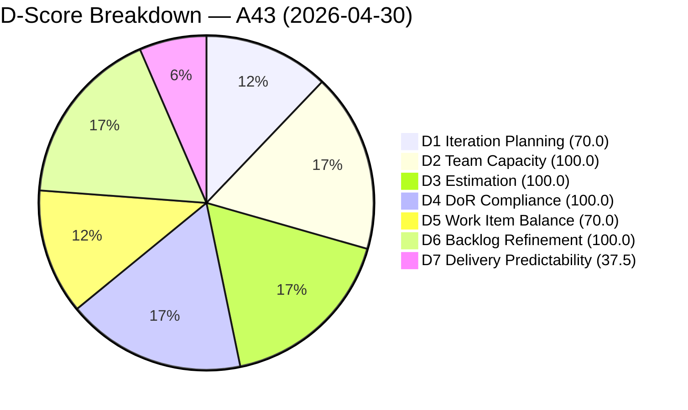
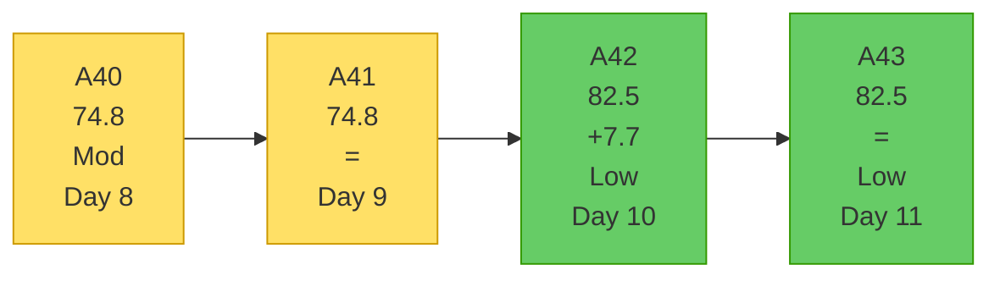
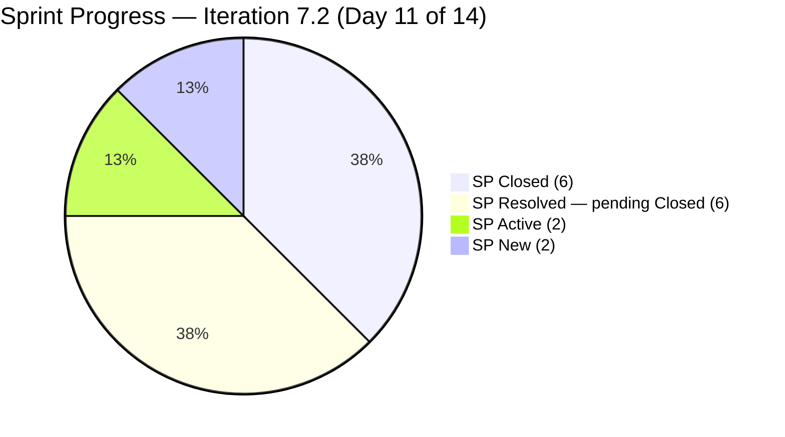
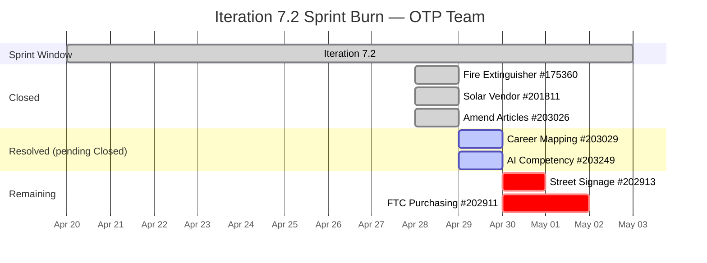

# OTP Team — SAFe Iteration Audit A43
**Date:** 2026-04-30 | **Sprint Day:** 11 of 14 | **Iteration:** 7.2 (Apr 20 – May 3, 2026)
**Auditor:** Claude Code (ADO SAFe Audit Skill v1) | **Prior Audit:** A42 (2026-04-29 02:06)

---

## 1. Audit Metadata

| Field | Value |
|---|---|
| **Audit ID** | A43 |
| **Report File** | `AUDIT_20260430_0903.md` |
| **Prior Audit** | A42 — `AUDIT_20260429_0206.md` (Overall 82.5) |
| **ADO Project** | OTP (`e7739905-28a3-4ae1-9173-7f6cd13b3494`) |
| **ADO Team** | OTP Team (`64de61f0-1203-4b01-aee2-6b4415aec52b`) |
| **Iteration** | 7.2 (Apr 20 – May 3, 2026) |
| **Iteration ID** | `611496a8-1907-483b-94b9-4e3ee575faf5` |
| **Sprint Day** | 11 of 14 |
| **Audit Date** | 2026-04-30 (PHT, UTC+8) |
| **Overall Score** | **82.5 — Low Risk** |
| **Risk Band** | Low (≥ 80) |
| **Visible Backlog Items** | 10 root (via `wit_list_backlog_work_items`) |
| **Iteration Items** | 7 root (via `wit_get_work_items_for_iteration`, IterationPath=7.2) |
| **Capacity Source** | `work_get_team_capacity` |
| **Project Exceptions Applied** | Single-assignee model (Grace) — D2 scored full |

---

## 2. Executive Summary

| Field | Value |
|---|---|
| **Overall Score** | 82.5 — Low Risk |
| **Score vs Prior (A42)** | 82.5 → 82.5 (**=**) |
| **Sprint Day** | 11 of 14 |
| **Iteration** | 7.2 (Apr 20 – May 3, 2026) |
| **Items in Iteration** | 7 |
| **Committed SP** | 16 |
| **SP Closed** | 6 (#175360=2, #201811=2, #203026=2) |
| **SP Resolved (not yet Closed)** | 6 (#203029=4, #203249=2) |
| **SP Remaining (Active/New)** | 4 (#202913=2, #202911=2) |
| **Risk Band** | Low (≥ 80) — second consecutive Low Risk audit |

A43 holds steady at 82.5 overall. The headline development is that **#203029 (Career Mapping, 4 SP) and #203249 (AI Integration & Competency Mapping, 2 SP) both moved to Resolved on April 29**, reducing the Active/New pool from 4 items to 2 items. However, ADO state "Resolved" does not count as "Closed" or "Done" under the scoring rubric, so D7 remains at 37.5.

With only 3 sprint days remaining (Apr 30–May 3), the path to improving D7 is clear: the two Resolved items must be transitioned to Closed, and #202913 (Active) needs closure. If all three close, D7 reaches 75.0 and overall rises to ~87.0.

---

## 3. Previous Audit Delta

| Dimension | A42 (Apr 29) | A43 (Apr 30) | Delta | Driver |
|---|---|---|---|---|
| D1 Iteration Planning | 70.0 | 70.0 | = | 7/10 — no backlog changes |
| D2 Team Capacity | 100.0 | 100.0 | = | Grace only — single-assignee exception |
| D3 Estimation | 100.0 | 100.0 | = | All 7 items estimated |
| D4 DoR Compliance | 100.0 | 100.0 | = | All 7 pass DoR |
| D5 Work Item Balance | 70.0 | 70.0 | = | 100% User Story — structural cap |
| D6 Backlog Refinement | 100.0 | 100.0 | = | All 10 backlog items fresh; 0 untouched |
| D7 Delivery Predictability | 37.5 | 37.5 | = | #203029 + #203249 Resolved (not Closed) — no new SP credit |
| **Overall** | **82.5** | **82.5** | **=** | **Score held; progress visible in Resolved states** |

**Notable change not reflected in score:** #203029 and #203249 both moved from Active → Resolved on Apr 29. These 6 SP are pending final closure confirmation (code review, UAT, or Grace's sign-off). Once transitioned to Closed, D7 jumps to 75.0.

---

## 4. Current Iteration Snapshot

**Active Iteration:** 7.2 | Apr 20 – May 3, 2026 | Sprint Day 11 of 14 (3 days remaining: Apr 30–May 3)

| Metric | Value |
|---|---|
| Current iteration root items | 7 |
| Visible backlog root items | 10 |
| Committed ratio | 70.0% |
| Committed story points | 16 SP |
| SP Closed | 6 SP (3 items: #175360, #201811, #203026) |
| SP Resolved (pending Closed) | 6 SP (#203029=4, #203249=2) |
| SP Active | 2 SP (#202913) |
| SP New | 2 SP (#202911) |
| Delivery velocity (Day 11) | 6/16 = 37.5% (Closed only) |
| Effective progress (incl. Resolved) | 12/16 = 75.0% (pending sign-off) |
| Grace remaining capacity | ~7.5 hours over 3 sprint days (2.5 h/day) |

---

## 5. Work Item Analysis

| ID | Title | Type | State | SP | Assigned | DoR | Notes |
|---|---|---|---|---|---|---|---|
| #175360 | Canvass additional Fire Extinguisher for Pad Davao | User Story | **Closed** | 2 | Grace | ✅ | Closed Apr 28 — DP credit |
| #201811 | 2. Solar Vendor Selection | User Story | **Closed** | 2 | Grace | ✅ | Closed Apr 28 — DP credit |
| #203026 | Amend Articles and Bylaws to include TechVoc AC | User Story | **Closed** | 2 | Grace | ✅ | Closed Apr 28 — DP credit |
| #203029 | career Mapping exploration and documentation | User Story | **Resolved** | 4 | Grace | ✅ | Resolved Apr 29 13:43 — awaiting Closed transition |
| #203249 | AI Integration & Competency Mapping | User Story | **Resolved** | 2 | Grace | ✅ | Resolved Apr 29 13:44 — awaiting Closed transition |
| #202913 | Installation of Street Signage | User Story | Active | 2 | Grace | ✅ | Physical installation — active since Apr 28 |
| #202911 | FTC Purchasing of signage material | User Story | New | 2 | Grace | ✅ | Not started — highest spill risk |

**Excluded from scoring (not IterationPath=7.2):**
- #198587 (IterationPath = OTP\2026-PI7\Iteration 7.1 — prior sprint, Closed)
- #203020 (IterationPath = OTP\2026-PI7 — PI-level parent, Active)

**SP Breakdown:** Closed=6 | Resolved=6 (#203029=4, #203249=2) | Active=2 (#202913) | New=2 (#202911) | **Total=16**

---

## 6. SAFe Compliance Scorecard

| Dimension | Score | Evidence | Notes |
|---|---|---|---|
| D1 Iteration Planning | 70.0 | 7 / 10 visible backlog items committed | 3 uncommitted: #202912 (7.3), #201815 (7.3), #200073/#201820 (7.4) |
| D2 Team Capacity | 100.0 | 1 / 1 contributors configured (Grace, 2.5 h/day) | Single-assignee exception applied per CLAUDE.md |
| D3 Estimation | 100.0 | 7 / 7 items carry SP > 0 | No estimation gaps — consistent for 4th consecutive audit |
| D4 DoR Compliance | 100.0 | 7 / 7 items pass Desc ≥ 30 and AC ≥ 20 | No DoR failures — 5th consecutive 100% |
| D5 Work Item Balance | 70.0 | 7/7 User Story (100%) > 60% → −30 | Structural cap; OTP operational nature |
| D6 Backlog Refinement | 100.0 | 10/10 fresh (<45 days); 0 stale; 0 untouched | All items active Apr 8+ — well within 45-day window |
| D7 Delivery Predictability | 37.5 | 6 / 16 SP Closed | #203029 + #203249 Resolved but not Closed — 6 SP in pending state |
| **Overall** | **82.5** | | **Low Risk — stable** |

### Scoring Formulas Applied

- **D1:** round(7 / 10 × 100, 1) = **70.0**
- **D2:** round(1 / 1 × 100, 1) = **100.0** *(single-assignee exception)*
- **D3:** round(7 / 7 × 100, 1) = **100.0**
- **D4:** round(7 / 7 × 100, 1) = **100.0**
- **D5:** Base 100; dominant type User Story = 100% > 60% → −30; no spike or US-absence penalty = **70.0**
- **D6:** 10/10 fresh (all ChangedDates ≥ Apr 8); stale_90=0; stale_180=0; untouched_current=0 = **100.0**
- **D7:** round(6 / 16 × 100, 1) = **37.5**
- **Overall:** (70.0 + 100.0 + 100.0 + 100.0 + 70.0 + 100.0 + 37.5) / 7 = 577.5 / 7 = **82.5**

---

## 7. Dimension Findings

### D1 — Iteration Planning (70.0, Moderate)

Seven items are committed to 7.2 against a visible backlog of 10. The three uncommitted items (202912 in 7.3, 201815 in 7.3, 200073/201820 in 7.4) represent the planned future-sprint horizon. No new backlog items were added since A42. The D1 score is structurally capped at 70.0 for the remainder of iteration 7.2 unless new eligible backlog items are committed. Planning for 7.3 should prioritize committing 201815 and 202912 from the start to target D1 ≥ 80.

### D2 — Team Capacity (100.0, Low)

Grace remains the sole configured team member at 2.5 h/day (2.0 Documentation + 0.5 Requirements), with 2 days off already elapsed (Apr 21–22). Remaining capacity at Day 11 is approximately 7.5 hours across 3 sprint days. With 4 SP of Active/New work (#202913=2, #202911=2) and 6 SP of Resolved work awaiting formal Closed state, the remaining capacity is adequate if sign-offs are expedited.

### D3 — Estimation (100.0, Low)

All 7 current iteration items carry story points. Total committed SP = 16. Consistent at 100.0 for the 4th consecutive audit.

### D4 — DoR Compliance (100.0, Low)

All 7 items meet the DoR threshold (Description ≥ 30 non-whitespace chars AND Acceptance Criteria ≥ 20 non-whitespace chars). #202913 AC ("Installed Street signage" = 22 chars) remains above the 20-char floor. D4 maintained at 100% for the 5th consecutive audit.

### D5 — Work Item Balance (70.0, Moderate)

100% User Story composition. The −30 dominant-type penalty applies. This is a structural characteristic of OTP's operational nature (compliance, procurement, governance items are all expressed as User Stories). To improve D5 in 7.3, at least one Enabler or Spike should be introduced during sprint planning.

### D6 — Backlog Refinement (100.0, Low)

All 10 visible backlog items were modified within the 45-day fresh window. The oldest items are #201815 and #201820 (ChangedDate Apr 8, 2026 — 22 days ago). No stale_90 or stale_180 items. No current iteration items have a ChangedDate prior to sprint start (Apr 20). D6 has been 100.0 for 6 consecutive audits.

### D7 — Delivery Predictability (37.5, High)

D7 holds at 37.5. The session highlight is that two items transitioned to Resolved on Apr 29:
- **#203029** (Career Mapping, 4 SP) → Resolved at 13:43 UTC Apr 29
- **#203249** (AI Integration & Competency Mapping, 2 SP) → Resolved at 13:44 UTC Apr 29

These items are effectively complete but await formal Closed state. ADO workflow requires a final state transition from Resolved → Closed (typically after review or acceptance). Once both transition to Closed, D7 jumps to round(12/16×100,1) = **75.0** and overall rises to ~87.0.

The remaining Active item (#202913, Installation of Street Signage, 2 SP) and New item (#202911, FTC Purchasing, 2 SP) represent the true residual sprint risk.

**D7 Scenarios from current position (Day 11):**

| Scenario | Closed SP | D7 | Overall |
|---|---|---|---|
| Current (6 SP Closed) | 6 | 37.5 | 82.5 |
| #203029 + #203249 → Closed (+6 SP) | 12 | 75.0 | 87.0 |
| Above + #202913 → Closed (+2 SP) | 14 | 87.5 | 91.1 |
| Full sprint closure (all 16 SP) | 16 | 100.0 | 89.3 |

---

## 8. Risks and Bottlenecks

| Risk | Severity | Dimension | Days Remaining | Action |
|---|---|---|---|---|
| **#203029 + #203249 in Resolved — not yet Closed** | High | D7 | 3 | Confirm sign-off with Grace today; transition to Closed to unlock 6 SP credit |
| **#202913 Active (physical installation) — 3 days left** | High | D7 | 3 | Confirm installation completion and close today; 2 SP addition |
| **#202911 New (FTC Purchasing) — not started at Day 11** | High | D7 | 3 | Assess immediately: if Grace cannot start today, defer to 7.3 and document as sprint spill |
| **Grace remaining capacity: ~7.5h for remaining work** | Moderate | D7 | 3 | Prioritize Resolved → Closed transitions first (minimal effort); then #202913 closure |
| **D5 structural 70.0 cap** | Low | D5 | — | Introduce ≥1 Enabler during 7.3 planning to break 100% US composition |

---

## 9. Prioritized Recommendations

1. **[CRITICAL — D7, today Apr 30]** Transition #203029 (Career Mapping, 4 SP) and #203249 (AI Integration & Competency Mapping, 2 SP) from Resolved → Closed. Both moved to Resolved Apr 29 — the work is complete. Confirm acceptance with Grace and close. D7 jumps from 37.5 to 75.0; overall rises from 82.5 to 87.0.

2. **[HIGH — D7, today Apr 30]** Close #202913 (Installation of Street Signage, 2 SP, Active). Physical installation — confirm with Grace that installation occurred and transition to Closed. Combined with Rec. 1, D7 reaches 87.5 and overall 91.1.

3. **[HIGH — D7, by May 1]** Make a go/no-go decision on #202911 (FTC Purchasing, 2 SP, New). Item has not been started at Day 11. If Grace cannot initiate procurement today, formally defer to 7.3 and capture as sprint spill. Deferring is preferable to a stalled New item that drags the next sprint's opening DoR score.

4. **[PLANNING — D5/7.3]** During 7.3 sprint planning, introduce at least one Enabler (e.g., a DevOps or infrastructure task) to break the 100% User Story composition and lift D5 to 100.0.

5. **[PLANNING — D1/7.3]** Commit #201815 (Physical Installation & Grid Integration) and #202912 (Fabrication of Signage) from the visible backlog at 7.3 planning start. With 10 visible items and targeting 8+ committed, D1 reaches ≥ 80 in 7.3.

---

## 10. Evidence Gaps and Limitations

| Gap | Impact | Notes |
|---|---|---|
| #198587 in iteration API but IterationPath=7.1 | Excluded from scoring | Consistent across all audits since A39 — Closed item from prior sprint |
| #203020 in iteration API but IterationPath=PI7 parent | Excluded from scoring | PI-level item, not committable to 7.2 |
| "Resolved" state not credited in D7 | D7 understates effective progress | #203029 + #203249 are functionally complete (6 SP) but await ADO Closed transition |
| #202912 in backlog but no description/SP in ADO | D6 minor | Item created Apr 20 with no description or SP configured — should be refined before 7.3 planning |

---

## 11. Score Visualizations

---

## 12. Projected Scores

| Scenario | SP Closed | D7 | Overall | Band |
|---|---|---|---|---|
| Current — Day 11 (6 SP Closed) | 6 | 37.5 | 82.5 | Low |
| Close #203029 + #203249 (+6 SP Resolved → Closed) | 12 | 75.0 | 87.0 | Low |
| Above + #202913 Closed (+2 SP) | 14 | 87.5 | 91.1 | Low |
| Full sprint closure (all 16 SP) | 16 | 100.0 | 89.3 | Low |

> Note: Full closure (16 SP, D7=100.0) yields overall 89.3 because D1=70.0 caps the ceiling. The 14 SP scenario (D7=87.5) yields 91.1 overall — the highest achievable score given current D1 and D5 constraints.
