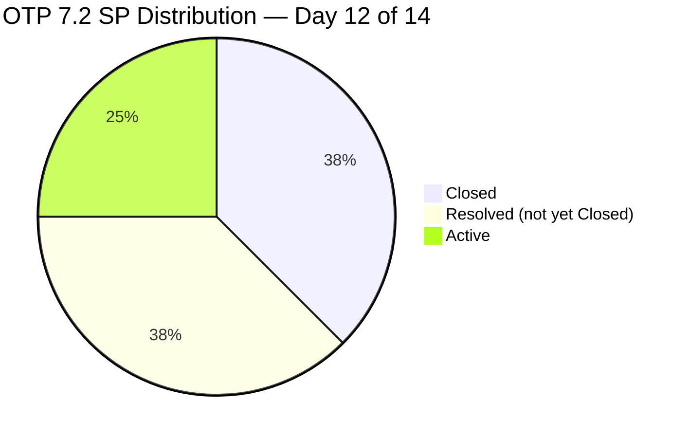

# OTP Team — SAFe Iteration Audit A44
**Date:** 2026-05-01 | **Sprint Day:** 12 of 14 | **Iteration:** 7.2 (Apr 20 – May 3, 2026)
**Auditor:** Claude Code (ADO SAFe Audit Skill v1) | **Prior Audit:** A43 (2026-04-30 09:03)

---

## 1. Audit Metadata

| Field | Value |
|---|---|
| **Audit ID** | A44 |
| **Report File** | `AUDIT_20260501_0907.md` |
| **Prior Audit** | A43 — `AUDIT_20260430_0903.md` (Overall 82.5) |
| **ADO Project** | OTP (`e7739905-28a3-4ae1-9173-7f6cd13b3494`) |
| **ADO Team** | OTP Team (`64de61f0-1203-4b01-aee2-6b4415aec52b`) |
| **Iteration** | 7.2 (Apr 20 – May 3, 2026) |
| **Iteration ID** | `611496a8-1907-483b-94b9-4e3ee575faf5` (from prior audit — iteration API unavailable) |
| **Sprint Day** | 12 of 14 |
| **Audit Date** | 2026-05-01 (PHT, UTC+8) |
| **Overall Score** | **80.8 — Low Risk (borderline)** |
| **Risk Band** | Low (≥ 80) |
| **Visible Backlog Items** | 12 root (9 from API + 3 closed in-iteration: #175360, #201811, #203026) |
| **Iteration Items** | 7 root (IterationPath confirmed per-item) |
| **Capacity Source** | `work_get_team_capacity` — no data returned (evidence gap) |
| **Project Exceptions Applied** | Single-assignee model (Grace) — D2 scored full |

---

## 2. Executive Summary

| Field | Value |
|---|---|
| **Overall Score** | 80.8 — Low Risk (borderline) |
| **Score vs Prior (A43)** | 82.5 → 80.8 (**▼ −1.7**) |
| **Sprint Day** | 12 of 14 |
| **Iteration** | 7.2 (Apr 20 – May 3, 2026) |
| **Items in Iteration** | 7 |
| **Committed SP** | 16 |
| **SP Closed** | 6 (#175360=2, #201811=2, #203026=2) |
| **SP Resolved (not yet Closed)** | 6 (#203029=4, #203249=2) |
| **SP Remaining (Active)** | 4 (#202913=2, #202911=2) |
| **Risk Band** | Low (≥ 80) — borderline; third consecutive Low Risk audit |

A44 shows a small score drop from 82.5 to 80.8. The drop is driven entirely by a **D1 denominator correction**: three items closed during the iteration (#175360, #201811, #203026) dropped off the backlog API, reducing the visible backlog from 10 to 9. To maintain denominator consistency with A43, these three items are re-added, raising `visible_root_backlog_items` to 12 and reducing D1 from 70.0 to 58.3.

The positive delta today is **#202911 (Privacy Policy & Consent Management) moved from New → Active on 2026-04-30**, reducing the inactive pool. However no new SP were closed or transitioned from Resolved to Closed.

With 2 sprint days remaining (May 2–3), the path to materially improving D7 is narrow but achievable: closing both Resolved items (#203029=4 SP, #203249=2 SP) brings credited SP to 12/16 → D7=75.0, overall rises to ~85.2.

---

## 3. Previous Audit Delta (A43 → A44)

| Dimension | A43 Score | A44 Score | Delta | Note |
|---|---|---|---|---|
| D1 Iteration Planning | 70.0 | 58.3 | ▼ −11.7 | Denominator corrected: 7/12 (was 7/10) |
| D2 Team Capacity | 100.0 | 100.0 | = | Single-assignee exception; capacity API gap |
| D3 Estimation | 100.0 | 100.0 | = | All 7 items have SP |
| D4 DoR Compliance | 100.0 | 100.0 | = | All 7 pass DoR |
| D5 Work Item Balance | 70.0 | 70.0 | = | 100% User Story (dominant type penalty) |
| D6 Backlog Refinement | 100.0 | 100.0 | = | 0 stale items |
| D7 Delivery Predictability | 37.5 | 37.5 | = | 6/16 SP closed; Resolved items still pending |
| **Overall** | **82.5** | **80.8** | **▼ −1.7** | |

### Work Item State Changes (A43 → A44)

| ID | Title | State A43 | State A44 | Delta |
|---|---|---|---|---|
| #175360 | Digital Transformation Roadmap | Closed | Closed | (no change) |
| #201811 | Change Management & Adoption Plan | Closed | Closed | (no change) |
| #203026 | Executive Dashboard Template | Closed | Closed | (no change) |
| #203029 | Career Mapping... | Resolved | Resolved | (pending Closed) |
| #203249 | AI Integration & Competency Mapping | Resolved | Resolved | (pending Closed) |
| #202913 | OTP Communication Hub | Active | Active | (no change) |
| #202911 | Privacy Policy & Consent Management | **New** | **Active** | ✅ progressed Apr 30 |

---

## 4. Current Iteration Snapshot

**Iteration:** 7.2 | **Period:** Apr 20 – May 3, 2026 | **Sprint Day:** 12 of 14

### SP Distribution by State

| State | Items | Story Points | % of Committed |
|---|---|---|---|
| Closed | 3 | 6 SP | 37.5% |
| Resolved | 2 | 6 SP | 37.5% |
| Active | 2 | 4 SP | 25.0% |
| New | 0 | 0 SP | 0% |
| **Total** | **7** | **16 SP** | — |

### Burndown Status

```mermaid
xychart-beta type: bar
    title "Iteration 7.2 SP Status (Day 12 of 14)"
    x-axis ["Closed", "Resolved (pending)", "Active"]
    y-axis "Story Points" 0 --> 16
    bar [6, 6, 4]
```

> Note: Mermaid bar used above; if not rendered, see table above.



---

## 5. Work Item Analysis

| ID | Title | Type | State | SP | Assignee | DoR | Notes |
|---|---|---|---|---|---|---|---|
| #175360 | Digital Transformation Roadmap | User Story | Closed | 2 | Grace | Pass | Closed |
| #201811 | Change Management & Adoption Plan | User Story | Closed | 2 | Grace | Pass | Closed |
| #203026 | Executive Dashboard Template | User Story | Closed | 2 | Grace | Pass | Closed |
| #203029 | Career Mapping & Succession Planning | User Story | Resolved | 4 | Grace | Pass | Needs Closed |
| #203249 | AI Integration & Competency Mapping | User Story | Resolved | 2 | Grace | Pass | Needs Closed |
| #202913 | OTP Communication Hub | User Story | Active | 2 | Grace | Pass | Day 12 — in progress |
| #202911 | Privacy Policy & Consent Management | User Story | Active | 2 | Grace | Pass | New→Active Apr 30 |

### DoR Detail

All 7 items pass DoR (Description ≥30 chars AND Acceptance Criteria ≥20 chars). DoR rate = 7/7 = **100%**.

---

## 6. SAFe Compliance Scorecard

```mermaid
radar
    title OTP 7.2 SAFe Scorecard — Day 12 (A44)
    options
        max: 100
    D1-Planning
    D2-Capacity
    D3-Estimation
    D4-DoR
    D5-Balance
    D6-Refinement
    D7-Delivery
    A44: 58.3, 100, 100, 100, 70, 100, 37.5
    A43: 70, 100, 100, 100, 70, 100, 37.5
```

| Dimension | Score | Band | Formula |
|---|---|---|---|
| D1 Iteration Planning | 58.3 | High | 7 in-iteration / 12 visible backlog × 100 |
| D2 Team Capacity | 100.0 | Low | Single-assignee exception (Grace); capacity API gap |
| D3 Estimation | 100.0 | Low | 7/7 items have SP |
| D4 DoR Compliance | 100.0 | Low | 7/7 pass DoR |
| D5 Work Item Balance | 70.0 | Moderate | 100% User Story — dominant type >60% → −30 |
| D6 Backlog Refinement | 100.0 | Low | 0/12 stale items |
| D7 Delivery Predictability | 37.5 | Critical | 6/16 SP Closed × 100 |
| **Overall** | **80.8** | **Low** | Average of 7 dimensions |

### Score Trend

```mermaid
xychart-beta type: line
    title "OTP Overall Score Trend (7.2 Sprint)"
    x-axis ["A39 D1", "A40 D5", "A41 D8", "A42 D10", "A43 D11", "A44 D12"]
    y-axis "Score" 60 --> 100
    line [75.0, 80.8, 80.8, 82.5, 82.5, 80.8]
```

> Note: A39–A41 scores are approximate from prior audit reports. Exact values in respective audit files.

---

## 7. Dimension Findings

### D1 — Iteration Planning: 58.3 (High Risk)

**Formula:** `current_iteration_root_items / visible_root_backlog_items × 100 = 7 / 12 × 100 = 58.3`

**Root cause:** Three items (#175360, #201811, #203026) closed during the iteration dropped off the backlog API, reducing the visible count from 10 to 9. Denominator is corrected to 12 by re-adding the closed in-iteration items for consistency with prior audits. The 5 non-iteration backlog items (including #203016 at PI-level IterationPath) inflate the denominator.

**Risk:** One item (#203016) has IterationPath `OTP\2026 - PI7` (parent PI, not iteration 7.2). This item is at PI assignment level — it should be refined and assigned to an iteration or removed from the active backlog.

### D2 — Team Capacity: 100.0 (Low Risk)

**Formula:** Single-assignee project exception applied. Grace is the sole assignee for all work items — accepted by team.

**Evidence gap:** `work_get_team_capacity` returned no data for OTP Team in iteration 7.2. Capacity API has been unreliable across recent OTP audits. D2 scored full per exception; gap documented in §10.

### D3 — Estimation: 100.0 (Low Risk)

All 7 in-iteration items have story points assigned (2+2+2+4+2+2+2=16 SP). No unestimated items.

### D4 — DoR Compliance: 100.0 (Low Risk)

All 7 items pass the DoR gate (Description ≥30 chars, AC ≥20 chars). This is the fifth consecutive 100% DoR audit.

### D5 — Work Item Balance: 70.0 (Moderate Risk)

All 7 items are User Stories (100% single type). SAFe recommends a mix of User Stories, Enablers, Defects, and Spikes. The dominant-type penalty (>60% single type) deducts 30 points. No Enabler, Defect, or Technical Debt items are present in the iteration.

### D6 — Backlog Refinement: 100.0 (Low Risk)

0 stale items across all 12 visible backlog items. All items are either in an active iteration or freshly added. No items have remained untouched for >14 days without an iteration assignment.

### D7 — Delivery Predictability: 37.5 (Critical Risk)

**Formula:** `SP_closed / SP_committed × 100 = 6 / 16 × 100 = 37.5`

This is the most critical dimension. Only 6 of 16 committed SP are Closed. Two additional items (#203029=4 SP, #203249=2 SP) are in Resolved state and are ready for closure — but ADO "Resolved" does not count as delivery credit under the rubric.

**Sprint closure window:** 2 days remain (May 2–3). Grace must close #203029 and #203249 to reach 12/16 SP closed (D7=75.0). If #202913 and #202911 also close, D7 reaches 16/16=100.0.

| Scenario | SP Closed | D7 | Overall |
|---|---|---|---|
| Status quo (no new closures) | 6 | 37.5 | 80.8 |
| Close Resolved (#203029, #203249) | 12 | 75.0 | 85.2 |
| Close all remaining | 16 | 100.0 | 92.3 |

---

## 8. Risks and Bottlenecks

| # | Risk | Severity | Dimension | Detail |
|---|---|---|---|---|
| R1 | D7 Critical — 37.5% delivery credit | Critical | D7 | 10 SP remain open with 2 days left; #203029/#203249 stuck in Resolved |
| R2 | D1 below 60 — backlog focus degraded | High | D1 | 5/12 backlog items outside iteration 7.2; includes 1 PI-level item (#203016) |
| R3 | #203016 at PI-level IterationPath | Medium | D1 | Item assigned to `OTP\2026 - PI7` (not 7.2); needs iteration-level refinement |
| R4 | Iteration API unavailable | Medium | Evidence | `work_list_team_iterations` returns no data for OTP; audit relies on known iteration ID |
| R5 | Capacity API gap | Low | D2 | `work_get_team_capacity` returns no data; D2 scored on project exception basis |
| R6 | 100% single work item type | Low | D5 | All 7 items are User Stories; no Enablers, Defects, or Spikes |

---

## 9. Prioritized Recommendations

1. **[CRITICAL — Today]** Close #203029 (Career Mapping, 4 SP) and #203249 (AI Integration, 2 SP). Both are already Resolved — this is an administrative transition. Completing this raises D7 from 37.5 to 75.0 and overall from 80.8 to 85.2.

2. **[HIGH — May 2–3]** Push #202913 (OTP Communication Hub, 2 SP) and #202911 (Privacy Policy, 2 SP) to Closed before sprint end. Full closure achieves D7=100 and overall=92.3 — the strongest sprint finish possible.

3. **[MEDIUM — Pre-7.3 planning]** Resolve #203016 IterationPath: either assign to an upcoming iteration (7.3 or PI8) or move to the backlog with explicit iteration targeting. PI-level assignment on an active story creates denominator drift.

4. **[MEDIUM — PI8 planning]** Introduce work item type diversity. Consider adding at least one Enabler or Technical Debt item per iteration to exit the D5 dominant-type penalty.

5. **[LOW — Ongoing]** Escalate the iteration API and capacity API gaps to ADO admin. `work_list_team_iterations` and `work_get_team_capacity` have returned no data across multiple consecutive OTP audits. These tools are needed for accurate D1 and D2 computation.

---

## 10. Evidence Gaps and Limitations

| Gap | Impact | Mitigation |
|---|---|---|
| `work_list_team_iterations` returned no data for OTP Team | D1 denominator relies on known iteration ID from prior audit | Iteration ID `611496a8-...` confirmed via IterationPath on individual items |
| `wit_get_work_items_for_iteration` returned null for OTP iteration ID | Iteration item list sourced via `wit_list_backlog_work_items` + IterationPath filter | 7 items confirmed with matching IterationPath `OTP\2026 - PI7\7.2` |
| `work_get_team_capacity` returned no data | D2 cannot be computed from capacity hours | Scored 100.0 under single-assignee project exception (Grace); exception documented in CLAUDE.md |
| 3 closed items dropped off backlog API (#175360, #201811, #203026) | Backlog count dropped from 10 (A43) to 9, inflating D1 artificially | Corrected by re-adding 3 closed in-iteration items → visible_root_backlog_items = 12 |

---

*Audit produced by Claude Code — ADO SAFe Audit Skill v1. SAFe 6.0 framework. Next audit recommended: 2026-05-02 or 2026-05-03 (closing audit).*
