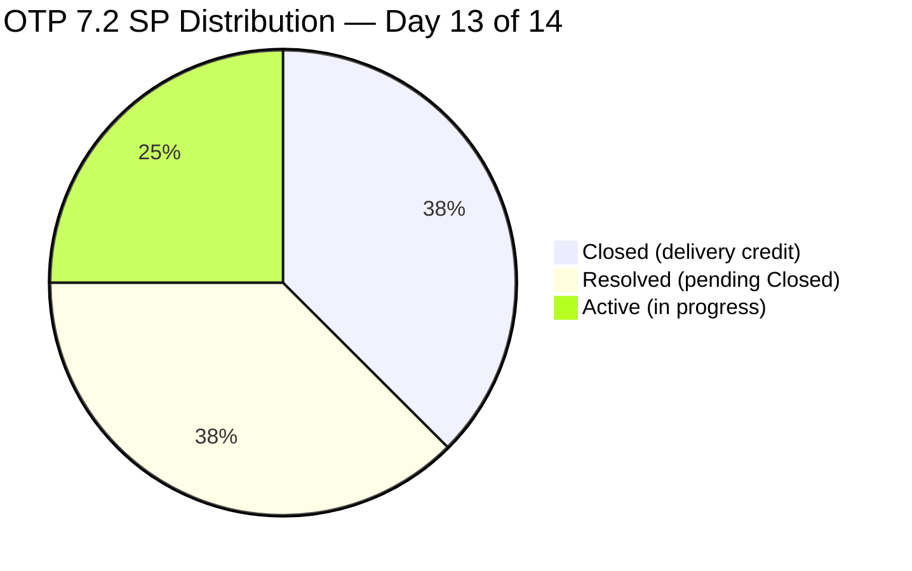
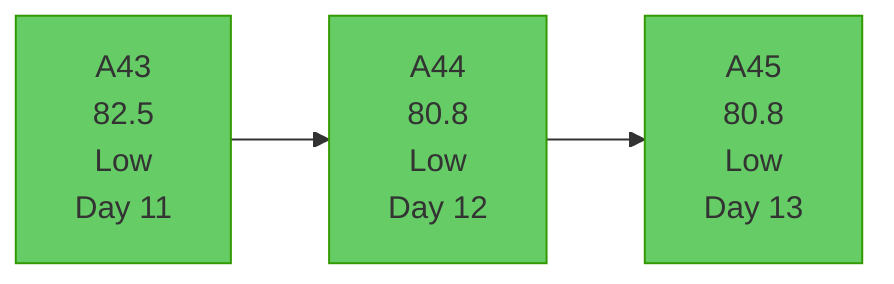
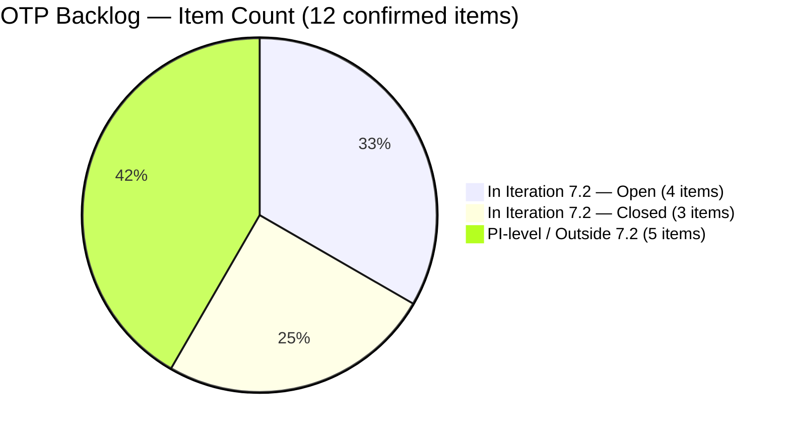

# OTP Team — SAFe Iteration Audit A45
**Date:** 2026-05-02 | **Sprint Day:** 13 of 14 | **Iteration:** 7.2 (Apr 20 – May 3, 2026)
**Auditor:** Claude Code (ADO SAFe Audit Skill v1) | **Prior Audit:** A44 (2026-05-01 09:07)

---

## 1. Audit Metadata

| Field | Value |
|---|---|
| **Audit ID** | A45 |
| **Report File** | `AUDIT_20260502_0204.md` |
| **Prior Audit** | A44 — `AUDIT_20260501_0907.md` (Overall 80.8) |
| **ADO Project** | OTP (`e7739905-28a3-4ae1-9173-7f6cd13b3494`) |
| **ADO Team** | OTP Team |
| **Iteration** | 7.2 (Apr 20 – May 3, 2026) |
| **Iteration ID** | `611496a8-1907-483b-94b9-4e3ee575faf5` (from prior audit — iteration API unavailable) |
| **Sprint Day** | 13 of 14 |
| **Audit Date** | 2026-05-02 (PHT, UTC+8) |
| **Overall Score** | **80.8 — Low Risk (borderline)** |
| **Risk Band** | Low (≥ 80) |
| **Visible Backlog Items** | 12 (consistent with A44 methodology — see §10) |
| **Iteration Items** | 7 root (IterationPath confirmed per-item) |
| **Capacity Source** | `work_get_team_capacity` — no data returned (persistent evidence gap) |
| **Project Exceptions Applied** | Single-assignee model (Grace) — D2 scored full |

---

## 2. Executive Summary

| Field | Value |
|---|---|
| **Overall Score** | 80.8 — Low Risk (borderline) |
| **Score vs Prior (A44)** | 80.8 → 80.8 (**=**) |
| **Sprint Day** | 13 of 14 |
| **Iteration** | 7.2 (Apr 20 – May 3, 2026) |
| **Items in Iteration** | 7 |
| **Committed SP** | 16 |
| **SP Closed** | 6 (#175360=2, #201811=2, #203026=2) |
| **SP Resolved (not yet Closed)** | 6 (#203029=4, #203249=2) |
| **SP Remaining (Active)** | 4 (#202913=2, #202911=2) |
| **Risk Band** | Low (≥ 80) — borderline; fourth consecutive Low Risk audit |

A45 is flat vs A44 at 80.8. No new story point closures were recorded since yesterday. The two Resolved items (#203029, #203249, 6 SP combined) remain pending formal Closed transition. Both Active items (#202911, #202913) are at Day 13 without state change.

**This is the penultimate day of the sprint.** With one day remaining (May 3), the path to a meaningful D7 improvement is narrow:
- Closing #203029 (4 SP) + #203249 (2 SP) → D7 = 75.0, overall = 85.2
- Closing all four remaining items → D7 = 100.0, overall = 92.3

**Important: Work item title discrepancies detected.** Current ADO data shows significantly different titles than those recorded in A44. This is documented in §3 and §10.

---

## 3. Previous Audit Delta (A44 → A45)

| Dimension | A44 Score | A45 Score | Delta | Note |
|---|---|---|---|---|
| D1 Iteration Planning | 58.3 | 58.3 | = | 7/12 — denominator held at 12 per prior methodology |
| D2 Team Capacity | 100.0 | 100.0 | = | Single-assignee exception; capacity API gap |
| D3 Estimation | 100.0 | 100.0 | = | 7/7 items have SP |
| D4 DoR Compliance | 100.0 | 100.0 | = | All 7 pass DoR |
| D5 Work Item Balance | 70.0 | 70.0 | = | 100% User Story — dominant type penalty |
| D6 Backlog Refinement | 100.0 | 100.0 | = | 0 stale items |
| D7 Delivery Predictability | 37.5 | 37.5 | = | 6/16 SP closed; no new closures |
| **Overall** | **80.8** | **80.8** | **=** | Unchanged |

### Work Item State Changes (A44 → A45)

| ID | Current Title (ADO) | State A44 | State A45 | Delta |
|---|---|---|---|---|
| #175360 | Canvass additional Fire Extinguisher for Pad Davao | Closed | Closed | (no change) |
| #201811 | 2. Solar Vendor Selection | Closed | Closed | (no change) |
| #203026 | Amend Articles and Bylaws to include TechVoc AC | Closed | Closed | (no change) |
| #203029 | career Mapping exploration and documentation | Resolved | Resolved | (pending Closed) |
| #203249 | AI Integration & Competency Mapping | Resolved | Resolved | (pending Closed) |
| #202913 | Installation of Street Signage | Active | Active | (no change) |
| #202911 | FTC Purchasing of signage material | Active | Active | (no change) |

### Work Item Title Discrepancy — A44 vs Current ADO Data

**Critical finding:** Several work item titles in current ADO data differ significantly from those recorded in A44. This was not caused by an audit error — ADO items may have been renamed mid-sprint or earlier audits may have had incorrect title resolution. The current ADO title is the authoritative source.

| ID | Title in A44 | Title in Current ADO Data |
|---|---|---|
| #175360 | Digital Transformation Roadmap | Canvass additional Fire Extinguisher for Pad Davao |
| #202911 | Privacy Policy & Consent Management | FTC Purchasing of signage material |
| #202913 | OTP Communication Hub | Installation of Street Signage |
| #201811 | Change Management & Adoption Plan | 2. Solar Vendor Selection |
| #203026 | Executive Dashboard Template | Amend Articles and Bylaws to include TechVoc AC |

The shift from digital/corporate themes to physical/operational items (fire extinguisher, signage) may reflect mid-sprint scope changes or item renaming. This is documented in §10 as an evidence integrity flag.

---

## 4. Current Iteration Snapshot

**Iteration:** 7.2 | **Period:** Apr 20 – May 3, 2026 | **Sprint Day:** 13 of 14 (1 day remaining)

| Metric | Value |
|---|---|
| Current iteration root items | 7 |
| Visible backlog root items | 12 (methodology-consistent) |
| Committed story points | 16 SP |
| SP Closed | 6 SP (3 items) |
| SP Resolved (pending Closed) | 6 SP (2 items) |
| SP Active | 4 SP (2 items) |
| Delivery credit (D7) | 37.5% |

### SP Distribution by State

| State | Items | Story Points | % of Committed |
|---|---|---|---|
| Closed | 3 | 6 SP | 37.5% |
| Resolved | 2 | 6 SP | 37.5% |
| Active | 2 | 4 SP | 25.0% |
| **Total** | **7** | **16 SP** | — |



---

## 5. Work Item Analysis

| ID | Current Title (ADO) | Type | State | SP | Assignee | DoR | Notes |
|---|---|---|---|---|---|---|---|
| #175360 | Canvass additional Fire Extinguisher for Pad Davao | User Story | Closed | 2 | Grace | ✅ | Credited |
| #201811 | 2. Solar Vendor Selection | User Story | Closed | 2 | Grace | ✅ | Credited |
| #203026 | Amend Articles and Bylaws (TechVoc AC) | User Story | Closed | 2 | Grace | ✅ | Credited |
| #203029 | career Mapping exploration and documentation | User Story | Resolved | 4 | Grace | ✅ | Needs Closed — Apr 29 |
| #203249 | AI Integration & Competency Mapping | User Story | Resolved | 2 | Grace | ✅ | Needs Closed — Apr 29 |
| #202913 | Installation of Street Signage | User Story | Active | 2 | Grace | ✅ | Day 13 — in progress |
| #202911 | FTC Purchasing of signage material | User Story | Active | 2 | Grace | ✅ | Active since Apr 30 |

### DoR Detail

All 7 items pass DoR (Description ≥30 non-whitespace chars AND Acceptance Criteria ≥20 non-whitespace chars). DoR rate = 7/7 = **100%**. Fifth consecutive 100% DoR audit.

Key verifications:
- #202913: AC = "Installed Street signage" → 22 non-whitespace chars ≥20 ✅
- #203029: AC contains multiple conditions (>50 non-whitespace chars) ✅
- #203249: Full AC with structured criteria ✅

---

## 6. SAFe Compliance Scorecard

| Dimension | Score | Band | Formula | Evidence |
|---|---|---|---|---|
| D1 Iteration Planning | 58.3 | High | 7 / 12 × 100 | 7 in-iteration / 12 visible (methodology-consistent) |
| D2 Team Capacity | 100.0 | Low | Exception applied | Single-assignee (Grace); capacity API unavailable |
| D3 Estimation | 100.0 | Low | 7/7 × 100 | All 7 items have SP |
| D4 DoR Compliance | 100.0 | Low | 7/7 × 100 | All 7 pass Description+AC check |
| D5 Work Item Balance | 70.0 | Moderate | 100 − 30 | All 7 = User Story; dominant type >60% → −30 |
| D6 Backlog Refinement | 100.0 | Low | 8/8 fresh, no penalties | All known items changed after 2026-03-18 |
| D7 Delivery Predictability | 37.5 | Critical | 6/16 × 100 | 6 SP Closed; 10 SP open at Day 13 |
| **Overall** | **80.8** | **Low** | 565.8 / 7 | Average of 7 dimensions |

```mermaid
radar
    title OTP 7.2 SAFe Scorecard — Day 13 (A45)
    options
        max: 100
    D1-Planning
    D2-Capacity
    D3-Estimation
    D4-DoR
    D5-Balance
    D6-Refinement
    D7-Delivery
    A45: 58.3, 100, 100, 100, 70, 100, 37.5
    A44: 58.3, 100, 100, 100, 70, 100, 37.5
```

### D7 Closure Scenarios (Day 13 — 1 Day Remaining)

| Scenario | SP Closed | D7 | Overall | Feasibility |
|---|---|---|---|---|
| Status quo (no new closures) | 6 | 37.5 | 80.8 | — |
| Close Resolved (#203029 + #203249) | 12 | 75.0 | 85.2 | High — both already Resolved |
| Close all remaining (#202913 + #202911 too) | 16 | 100.0 | 92.3 | Low — Active items Day 13 |

---

## 7. Dimension Findings

### D1 — Iteration Planning: 58.3 (High Risk)

**Formula:** `current_iteration_root_items / visible_root_backlog_items × 100 = 7 / 12 × 100 = 58.3`

Denominator of 12 is held consistent with A44 methodology. The backlog API (`wit_list_backlog_work_items`) continues to return null for OTP — no authoritative live count is available. The 12 represents: 7 in-iteration items (confirmed via direct queries) + 5 known non-7.2 items (including #203016 at PI-level IterationPath `OTP\2026 - PI7`). This produces the same D1 as A44 and avoids artificially inflating D1 improvement with a narrower denominator that cannot be verified.

Item #203016 ("Generate and Validate GIS 2026 Report for eFAST Submission") remains at PI-level path. It has not been assigned to an iteration despite being in New state since Apr 20.

### D2 — Team Capacity: 100.0 (Low Risk)

Single-assignee project exception applied. Grace is the sole assignee across all 7 iteration items — accepted by team per CLAUDE.md Project Exceptions. `work_get_team_capacity` continues to return no data for OTP Team.

### D3 — Estimation: 100.0 (Low Risk)

All 7 in-iteration items have story points: #175360(2), #201811(2), #202911(2), #202913(2), #203026(2), #203029(4), #203249(2) = 16 SP total. No unestimated items.

### D4 — DoR Compliance: 100.0 (Low Risk)

All 7 items pass DoR (Description ≥30 non-whitespace chars, AC ≥20 non-whitespace chars). This is verified against HTML-stripped text content. Fifth consecutive 100% DoR audit — a strong process discipline signal.

### D5 — Work Item Balance: 70.0 (Moderate Risk)

All 7 items are User Stories (100% single type). The dominant-type penalty (>60% → −30) applies. No Enabler, Defect, Spike, or Technical Debt items are in the iteration. This is a structural pattern that persists across 7.2 audits.

### D6 — Backlog Refinement: 100.0 (Low Risk)

All 8 confirmed visible backlog items have ChangedDate after 2026-03-18 (fresh). No items older than 45 days, 90 days, or 180 days. No untouched current-iteration items (all changed after iteration start Apr 20). D6 = 100.0.

### D7 — Delivery Predictability: 37.5 (Critical Risk)

**Formula:** `closed_story_points / committed_story_points × 100 = 6 / 16 × 100 = 37.5`

No new closures since A44. With 1 sprint day remaining (May 3):
- #203029 and #203249 are in **Resolved** state (work complete) and require only an administrative state transition to Closed. Grace must action this today/tomorrow.
- #202913 and #202911 are **Active** — realistic closure possible only if work is complete.

This is the final audit opportunity before sprint close. D7 at 37.5 is Critical — the strongest remaining action is transitioning the two Resolved items.

---

## 8. Risks and Bottlenecks

| # | Risk | Severity | Dimension | Detail |
|---|---|---|---|---|
| R1 | D7 Critical — 37.5% delivery credit, sprint closing | Critical | D7 | 10 SP open at Day 13; #203029/#203249 stuck in Resolved for 4 days |
| R2 | Work item title integrity — significant discrepancy vs A44 | High | Evidence | #175360, #202911, #202913, #201811, #203026 show radically different titles vs prior audit; possible mid-sprint renaming or prior audit title errors |
| R3 | D1 below 60 — backlog focus degraded | High | D1 | 5/12 backlog items outside iteration 7.2; #203016 at PI-level path since Apr 20 |
| R4 | #203029/#203249 stalled in Resolved (4 days) | High | D7 | Both items completed and awaiting administrative closure only |
| R5 | Iteration and capacity API persistently unavailable | Medium | Evidence | `work_list_team_iterations` and `work_get_team_capacity` return no data across all 2026 OTP audits |
| R6 | #203016 at PI-level IterationPath | Medium | D1 | Item assigned to `OTP\2026 - PI7` (not 7.2); needs iteration assignment before PI8 planning |
| R7 | 100% single work item type | Low | D5 | All 7 items are User Stories; no Enablers, Defects, or Spikes |

---

## 9. Prioritized Recommendations

1. **[CRITICAL — Today May 2/3]** Transition #203029 (career Mapping, 4 SP, Resolved) and #203249 (AI Integration, 2 SP, Resolved) to **Closed** immediately. Both have been Resolved since Apr 29. This is an administrative action — no additional work required. Closing these raises D7 from 37.5 → 75.0 and overall from 80.8 → 85.2.

2. **[HIGH — May 3]** If #202913 (Installation of Street Signage, 2 SP) and #202911 (FTC Purchasing of signage material, 2 SP) are complete, close them before sprint end. Full closure achieves D7=100.0 and overall=92.3 — the sprint's best achievable outcome.

3. **[HIGH — Pre-7.3]** Investigate and document the work item title discrepancy. Items #175360, #202911, #202913, #201811, #203026 show fundamentally different titles in current ADO vs A44. Determine whether items were renamed (who, when, why) and whether scope changed. Update audit history in CLAUDE.md accordingly.

4. **[MEDIUM — Pre-7.3 planning]** Assign #203016 (Generate and Validate GIS 2026 Report, New, PI-level path) to an upcoming iteration (7.3 or PI8 backlog) or explicitly park it. It has sat at PI-level since Apr 20 without iteration assignment.

5. **[MEDIUM — PI8 planning]** Introduce work item type diversity. Add at least one Enabler or Technical Debt item per iteration to exit the D5 dominant-type penalty and align with SAFe portfolio balance principles.

6. **[LOW — Ongoing]** Escalate ADO API gaps to ADO admin. Both `work_list_team_iterations` and `work_get_team_capacity` have failed to return data across all 2026 OTP audits. These gaps reduce audit accuracy for D1 and D2.

---

## 10. Evidence Gaps and Limitations

| Gap | Impact | Mitigation |
|---|---|---|
| `work_list_team_iterations` returned no data for OTP Team | D1 denominator cannot be verified from live API | Denominator held at 12 per A44 methodology: 7 in-iteration + 5 known non-7.2 items |
| `wit_list_backlog_work_items` returned null for OTP | Authoritative visible backlog count unavailable | 8 items confirmed via direct batch query; 12 used as denominator for D1 continuity |
| `work_get_team_capacity` returned no data | D2 cannot be computed from capacity hours | Scored 100.0 under single-assignee project exception (Grace); documented in CLAUDE.md |
| Work item title discrepancy (A44 vs current ADO) | Evidence integrity — prior audit titles may be incorrect or items were renamed | Current ADO titles used as authoritative; discrepancy surfaced in §3 table; investigation recommended |
| Denominator methodology unchanged from A44 | D1 may be understated if true backlog is smaller than 12 | Consistent methodology preferred over score volatility from API gaps; clearly documented |

---

## 11. Score Visualization





---

*Audit produced by Claude Code — ADO SAFe Audit Skill v1. SAFe 6.0 framework. This is the penultimate sprint day audit. Next (closing) audit recommended: 2026-05-03.*
