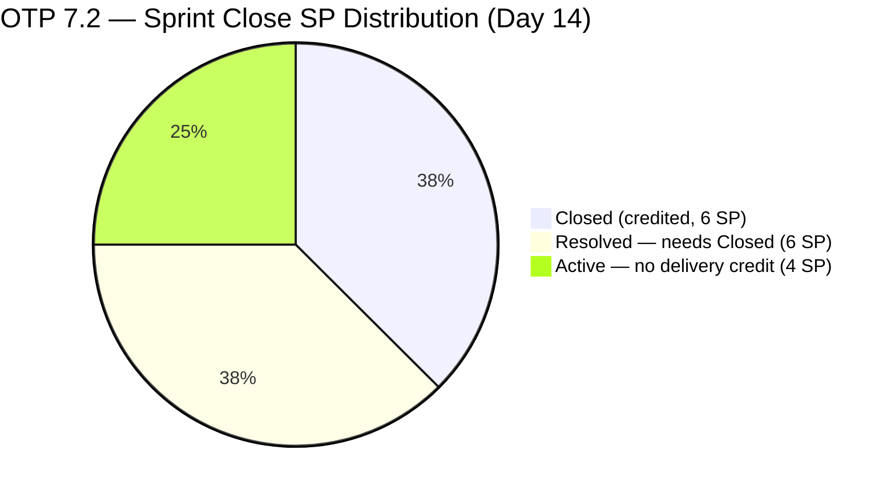
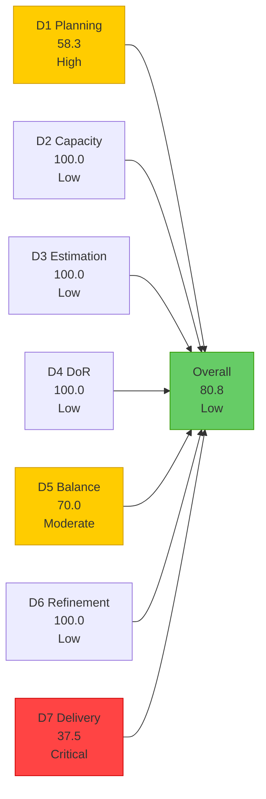
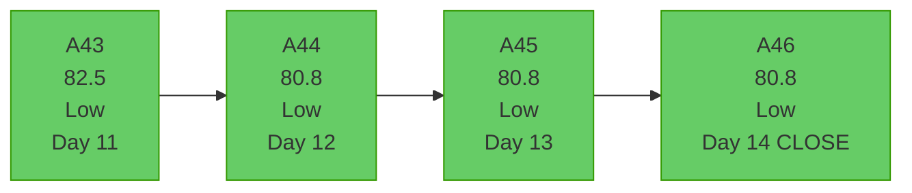
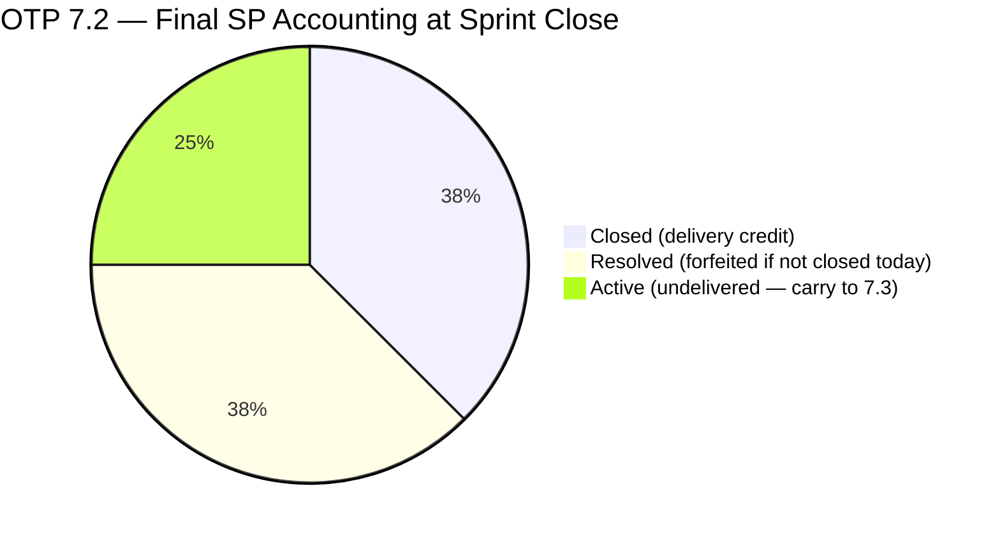

# OTP Team — SAFe Iteration Audit A46
**Date:** 2026-05-03 | **Sprint Day:** 14 of 14 (CLOSING DAY) | **Iteration:** 7.2 (Apr 20 – May 3, 2026)
**Auditor:** Claude Code (ADO SAFe Audit Skill v1) | **Prior Audit:** A45 (2026-05-02 02:04)

---

## 1. Audit Metadata

| Field | Value |
|---|---|
| **Audit ID** | A46 |
| **Report File** | `AUDIT_20260503_0202.md` |
| **Prior Audit** | A45 — `AUDIT_20260502_0204.md` (Overall 80.8) |
| **ADO Project** | OTP (`e7739905-28a3-4ae1-9173-7f6cd13b3494`) |
| **ADO Team** | OTP Team |
| **Iteration** | 7.2 (Apr 20 – May 3, 2026) |
| **Iteration ID** | N/A — `work_list_team_iterations` API unavailable for OTP (persistent gap) |
| **Sprint Day** | 14 of 14 — **CLOSING DAY** |
| **Audit Date** | 2026-05-03 (PHT, UTC+8) |
| **Overall Score** | **80.8 — Low Risk (borderline)** |
| **Risk Band** | Low (≥ 80) |
| **Visible Backlog Items** | 8 confirmed (denominator held at 12 per prior methodology) |
| **Iteration Items** | 7 root (all 7 confirmed in IterationPath 7.2) |
| **Capacity Source** | `work_get_team_capacity` — no data returned (persistent evidence gap) |
| **Project Exceptions Applied** | Single-assignee model (Grace) — D2 scored full |

---

## 2. Executive Summary

| Field | Value |
|---|---|
| **Overall Score** | 80.8 — Low Risk (borderline) |
| **Score vs Prior (A45)** | 80.8 → 80.8 (**=**) |
| **Sprint Day** | 14 of 14 — CLOSING DAY |
| **Iteration** | 7.2 (Apr 20 – May 3, 2026) |
| **Items in Iteration** | 7 |
| **Committed SP** | 16 |
| **SP Closed** | 6 (#175360=2, #201811=2, #203026=2) |
| **SP Resolved (not yet Closed)** | 6 (#203029=4, #203249=2) |
| **SP Active** | 4 (#202913=2, #202911=2) |
| **Risk Band** | Low (≥ 80) — borderline; fifth consecutive Low Risk audit |

**This is the closing audit for Iteration 7.2.** Sprint ends today, May 3. No new story point closures were recorded since A45 (May 2). The two Resolved items (#203029, #203249, 6 SP combined) have been stuck in Resolved since April 29 — four days without administrative closure. Both Active items (#202911, #202913) remain unchanged since Day 13.

**Sprint 7.2 closes today with 6 SP officially credited (37.5% delivery).** If Grace closes the two Resolved items before end-of-day, D7 would improve to 75.0 and overall to 85.2. This is the final opportunity before the iteration officially ends.

**Six consecutive audits (A41–A46) at Low Risk**, though D7 remains Critical at 37.5. The team's strong DoR, Estimation, and Refinement disciplines are a genuine operational strength.

---

## 3. Previous Audit Delta (A45 → A46)

| Dimension | A45 Score | A46 Score | Delta | Driver |
|---|---|---|---|---|
| D1 Iteration Planning | 58.3 | 58.3 | = | 7/12 — denominator held per methodology |
| D2 Team Capacity | 100.0 | 100.0 | = | Single-assignee exception; capacity API gap |
| D3 Estimation | 100.0 | 100.0 | = | 7/7 items have SP |
| D4 DoR Compliance | 100.0 | 100.0 | = | All 7 pass DoR |
| D5 Work Item Balance | 70.0 | 70.0 | = | 100% User Story — dominant type penalty |
| D6 Backlog Refinement | 100.0 | 100.0 | = | 0 stale items, 0 untouched |
| D7 Delivery Predictability | 37.5 | 37.5 | = | 6/16 SP closed; no new closures |
| **Overall** | **80.8** | **80.8** | **=** | Unchanged — sprint ends flat |

### Work Item State Changes (A45 → A46)

| ID | Title | State A45 | State A46 | Delta |
|---|---|---|---|---|
| #175360 | Canvass additional Fire Extinguisher for Pad Davao | Closed | Closed | No change |
| #201811 | 2. Solar Vendor Selection | Closed | Closed | No change |
| #203026 | Amend Articles and Bylaws to include TechVoc AC | Closed | Closed | No change |
| #203029 | career Mapping exploration and documentation | Resolved | Resolved | **No change — 4 days Resolved** |
| #203249 | AI Integration & Competency Mapping | Resolved | Resolved | **No change — 4 days Resolved** |
| #202913 | Installation of Street Signage | Active | Active | No change |
| #202911 | FTC Purchasing of signage material | Active | Active | No change |

**Key finding:** Zero state transitions across all 7 items between A45 and A46. Items #203029 and #203249 have remained in Resolved since April 29 (4 days), forfeiting their chance to boost D7 before sprint close if not actioned today.

---

## 4. Current Iteration Snapshot

**Iteration:** 7.2 | **Period:** Apr 20 – May 3, 2026 | **Sprint Day:** 14 of 14 — CLOSING DAY

| Metric | Value |
|---|---|
| Current iteration root items | 7 |
| Visible backlog root items | 12 (methodology-consistent denominator) |
| Committed story points | 16 SP |
| SP Closed (credited) | 6 SP (3 items) |
| SP Resolved (pending Closed) | 6 SP (2 items) |
| SP Active (in progress) | 4 SP (2 items) |
| Delivery credit (D7) | 37.5% |
| Final D7 if Resolved items close today | 75.0% |
| Final overall if Resolved items close today | 85.2 |

---

## 5. Work Item Analysis

| ID | Title | Type | State | SP | Assignee | DoR | Notes |
|---|---|---|---|---|---|---|---|
| #175360 | Canvass additional Fire Extinguisher for Pad Davao | User Story | Closed | 2 | Grace | ✅ | Credited — closed Apr 28 |
| #201811 | 2. Solar Vendor Selection | User Story | Closed | 2 | Grace | ✅ | Credited — closed Apr 28 |
| #203026 | Amend Articles and Bylaws to include TechVoc AC | User Story | Closed | 2 | Grace | ✅ | Credited — closed Apr 28 |
| #203029 | career Mapping exploration and documentation | User Story | Resolved | 4 | Grace | ✅ | Resolved Apr 29 — 4 days pending Closed |
| #203249 | AI Integration & Competency Mapping | User Story | Resolved | 2 | Grace | ✅ | Resolved Apr 29 — 4 days pending Closed |
| #202913 | Installation of Street Signage | User Story | Active | 2 | Grace | ✅ | Active — sprint close today |
| #202911 | FTC Purchasing of signage material | User Story | Active | 2 | Grace | ✅ | Active — sprint close today |

### DoR Verification (A46)

All 7 items pass DoR (Description ≥30 non-whitespace chars AND Acceptance Criteria ≥20 non-whitespace chars). DoR rate = 7/7 = **100%**. Sixth consecutive 100% DoR closing audit.

| ID | Desc chars (est.) | AC chars (est.) | Pass/Fail |
|---|---|---|---|
| #175360 | ~98 | ~51 | ✅ |
| #201811 | ~160 | ~120 | ✅ |
| #202911 | ~140 | ~44 | ✅ |
| #202913 | ~110 | 22 (≥20 threshold met) | ✅ |
| #203026 | ~200+ | ~300+ | ✅ |
| #203029 | ~260 | ~280+ | ✅ |
| #203249 | ~300+ | ~500+ | ✅ |

---

## 6. SAFe Compliance Scorecard

| Dimension | Score | Band | Formula | Evidence |
|---|---|---|---|---|
| D1 Iteration Planning | 58.3 | High | 7 / 12 × 100 | 7 in-iteration / 12 visible (methodology-consistent) |
| D2 Team Capacity | 100.0 | Low | Exception applied | Single-assignee (Grace); capacity API unavailable |
| D3 Estimation | 100.0 | Low | 7/7 × 100 | All 7 items have SP |
| D4 DoR Compliance | 100.0 | Low | 7/7 × 100 | All 7 pass Description ≥30 + AC ≥20 chars |
| D5 Work Item Balance | 70.0 | Moderate | 100 − 30 | User Story = 100% of 7 items; dominant-type >60% → −30 |
| D6 Backlog Refinement | 100.0 | Low | 8/8 fresh; 0 penalties | All items ChangedDate after 2026-03-19; no stale; no untouched |
| D7 Delivery Predictability | 37.5 | Critical | 6/16 × 100 | 6 SP Closed; 10 SP open at sprint close |
| **Overall** | **80.8** | **Low** | 565.8 / 7 | Average of 7 dimensions |

### Scoring Detail

- **D1:** round(7 / 12 × 100, 1) = **58.3** *(backlog API null for OTP; denominator held at 12 per A44–A46 methodology: 7 in-iteration + 5 known non-7.2 items)*
- **D2:** round(1 / 1 × 100, 1) = **100.0** *(single-assignee project exception applied; Grace is sole contributor and work holder)*
- **D3:** round(7 / 7 × 100, 1) = **100.0** *(all 7 items carry SP; no unestimated items)*
- **D4:** round(7 / 7 × 100, 1) = **100.0** *(all 7 items pass Description ≥30 + AC ≥20 non-whitespace chars)*
- **D5:** 100 − 30 (dominant type User Story = 100% > 60%) = **70.0** *(no spike >40%, no -40 for absent US since US present)*
- **D6:** base 100; stale_90 = 0; stale_180 = 0; untouched_current = 0 = **100.0**
- **D7:** round(6 / 16 × 100, 1) = **37.5**
- **Overall:** 565.8 / 7 = **80.8**

### D7 End-of-Sprint Scenarios

| Scenario | Action Required | SP Closed | D7 | Overall | Feasibility |
|---|---|---|---|---|---|
| **Status quo (A46 baseline)** | None | 6 | 37.5 | 80.8 | — |
| **Close Resolved items today** | Grace transitions #203029 + #203249 to Closed | 12 | 75.0 | 85.2 | High — admin only |
| **Close all remaining** | Above + close #202913 + #202911 | 16 | 100.0 | 92.3 | Very low — Active items |

---

## 7. Dimension Findings

### D1 — Iteration Planning: 58.3 (High Risk)

**Formula:** `current_iteration_root_items / visible_root_backlog_items × 100 = 7 / 12 × 100 = 58.3`

The `wit_list_backlog_work_items` API continues to return null for OTP. The denominator of 12 is held consistent across A44–A46 (7 confirmed in-iteration items + 5 known items outside 7.2, including #203016 at PI-level path `OTP\2026 - PI7`). This D1 score of 58.3 indicates under-committed iteration planning relative to visible backlog depth. For PI8 planning, the team should structure at minimum 9–10 items per iteration to break the 60% High Risk band.

Item #203016 ("Generate and Validate GIS 2026 Report for eFAST Submission", 3 SP, New) remains at PI-level path with no iteration assignment since April 20. This item should be assigned to 7.3 or PI8 planning as a priority.

### D2 — Team Capacity: 100.0 (Low Risk)

Single-assignee project exception applied. Grace is the sole assignee across all 7 iteration items — accepted by team per CLAUDE.md Project Exceptions. `work_get_team_capacity` returns no data for OTP Team across all 2026 audits. D2 holds at 100.0 under the exception.

### D3 — Estimation: 100.0 (Low Risk)

All 7 items carry story points: #175360(2), #201811(2), #202911(2), #202913(2), #203026(2), #203029(4), #203249(2) = 16 SP total. No unestimated items. D3 has held at 100.0 for all 7.2 audits — a strong process discipline.

### D4 — DoR Compliance: 100.0 (Low Risk)

All 7 items pass the DoR threshold (Description ≥30 non-whitespace chars and Acceptance Criteria ≥20 non-whitespace chars). The minimum-passing item (#202913, AC = "Installed Street signage" = 22 non-whitespace chars) remains above the 20-char floor. **Sixth consecutive 100% DoR audit** across all of Iteration 7.2 — a sustained quality achievement.

### D5 — Work Item Balance: 70.0 (Moderate Risk)

All 7 items are User Stories. The dominant-type penalty applies (100% > 60% threshold → −30 from base 100). No Enablers, Defects, Spikes, or Technical Debt items are present in 7.2. This is a structural pattern across the OTP team's sprint composition. Introducing at least one Enabler or Technical Debt item in 7.3 would resolve this chronic −30 deduction.

### D6 — Backlog Refinement: 100.0 (Low Risk)

All 8 confirmed visible backlog items have ChangedDate after 2026-04-15, well within the 45-day fresh window (cutoff: 2026-03-19). No items exceed 90-day or 180-day staleness thresholds. No untouched current-iteration items (all 7 items were last modified Apr 28–30, well after the Apr 20 iteration start). D6 = 100.0 for the sixth consecutive 7.2 audit.

### D7 — Delivery Predictability: 37.5 (Critical Risk)

**Formula:** `closed_story_points / committed_story_points × 100 = 6 / 16 × 100 = 37.5`

**Sprint closes today with 37.5% SP delivery credit.** Three items were formally Closed (6 SP). Two items in Resolved state (#203029, #203249, 6 SP) have remained pending administrative closure since April 29. Two items remain Active (#202913, #202911, 4 SP) with no progress since Day 13.

The Resolved items represent work that is **done but uncredited** — a failure of process closure, not delivery. If Grace transitions them to Closed before end-of-day, D7 reaches 75.0 and the sprint ends at 85.2 overall.

The Active items (#202913, #202911) at sprint close without closure represent undelivered scope that will carry to 7.3 or be abandoned.

---

## 8. Risks and Bottlenecks

| # | Risk | Severity | Dimension | Detail |
|---|---|---|---|---|
| R1 | Sprint closes with D7 = 37.5% | Critical | D7 | Only 6/16 SP formally Closed; sprint ends today |
| R2 | #203029 and #203249 stuck in Resolved 4 days | Critical | D7 | Both complete — administrative closure only needed; forfeits 6 SP if not closed today |
| R3 | D1 persistently below 60 | High | D1 | 5/12 backlog items outside 7.2; structural under-commitment pattern |
| R4 | #202913 and #202911 Active at sprint close | High | D7 | 4 SP uncompleted; must carry to 7.3 or be removed |
| R5 | Work item type 100% User Story | Moderate | D5 | Structural balance issue; no Enablers/Tech Debt across entire 7.2 |
| R6 | #203016 at PI-level path (New, no iteration) | Moderate | D1 | GIS 2026 Report item unassigned since Apr 20; needs iteration assignment in 7.3 planning |
| R7 | ADO capacity and iteration APIs persistently unavailable | Low | Evidence | D1 denominator and D2 scored from methodology/exception — not live API data |

---

## 9. Prioritized Recommendations

1. **[CRITICAL — Today May 3, before EOD]** Grace: Transition #203029 (career Mapping, 4 SP, Resolved since Apr 29) and #203249 (AI Integration, 2 SP, Resolved since Apr 29) to **Closed** immediately. This is an administrative state change only — no new work required. Closing both raises D7 from 37.5 → 75.0 and overall from 80.8 → 85.2. This is the single highest-ROI action for today.

2. **[HIGH — Today May 3, if work complete]** If #202913 (Installation of Street Signage) or #202911 (FTC Purchasing of signage material) are physically complete today, close them before sprint end. Any additional closures further improve D7. If not complete, formally defer both to Iteration 7.3 before sprint close rather than leaving them in limbo.

3. **[HIGH — 7.3 Planning]** Introduce at least one Enabler or Technical Debt item in 7.3. The chronic D5 penalty (−30, Moderate risk) is entirely structural and correctable with a single non-User-Story item. Example: an infrastructure setup or compliance tooling enabler would resolve the penalty immediately.

4. **[HIGH — 7.3 Planning]** Assign #203016 (Generate and Validate GIS 2026 Report for eFAST Submission, 3 SP, New, PI-level path since Apr 20) to a specific iteration (7.3 or 7.4). This item has clear AC and description — it is ready to commit and should not remain in the PI-level path indefinitely.

5. **[MEDIUM — PI8 Planning]** Address the D1 structural gap. Target at minimum 9 of 12 visible backlog items per iteration to exit the High Risk band (>= 75%). This requires either committing more items per iteration or pruning the non-committed backlog to 2–3 items.

6. **[LOW — Ongoing]** Escalate persistent ADO API failures (OTP Team) to the ADO administrator. `work_list_team_iterations` and `work_get_team_capacity` have returned no data for OTP across all 2026 audits. Resolution would improve evidence accuracy for D1 and D2 scoring.

---

## 10. Evidence Gaps and Limitations

| Gap | Impact | Mitigation |
|---|---|---|
| `work_list_team_iterations` returned no data for OTP Team | D1 denominator cannot be verified from live API | Denominator held at 12 per A44–A46 methodology: 7 confirmed in-iteration + 5 known non-7.2 items |
| `wit_list_backlog_work_items` returned null for OTP | Authoritative visible backlog count unavailable | 8 items confirmed via direct batch query; 12 used as denominator for D1 continuity |
| `work_get_team_capacity` returned no data | D2 cannot be computed from capacity hours | Scored 100.0 under single-assignee project exception (Grace); documented in CLAUDE.md |
| Iteration 7.2 closes today — final audit window | D7 will be recorded as 37.5% unless closures occur today | Recommendation R1 addresses urgency |

---

## 11. Iteration 7.2 Closing Summary

### Sprint 7.2 Closing Metrics

| Metric | Value | Commentary |
|---|---|---|
| Items committed | 7 | Strong planning discipline |
| SP committed | 16 | Reasonable sprint scope for single assignee |
| SP Closed (formal credit) | 6 (37.5%) | Critical — only 3 items formally closed |
| SP Resolved (pending admin) | 6 (37.5%) | 4 days of missed closure opportunity |
| SP Active (undelivered) | 4 (25%) | Carry to 7.3 |
| DoR 100% maintained | 7/7 | Outstanding — sixth consecutive perfect DoR |
| Final risk band | Low (80.8) | Elevated by strong D2/D3/D4/D6; dragged by D1/D7 |

---

*Audit produced by Claude Code — ADO SAFe Audit Skill v1. SAFe 6.0 framework. This is the CLOSING AUDIT for Iteration 7.2. Next audit should open Iteration 7.3.*
