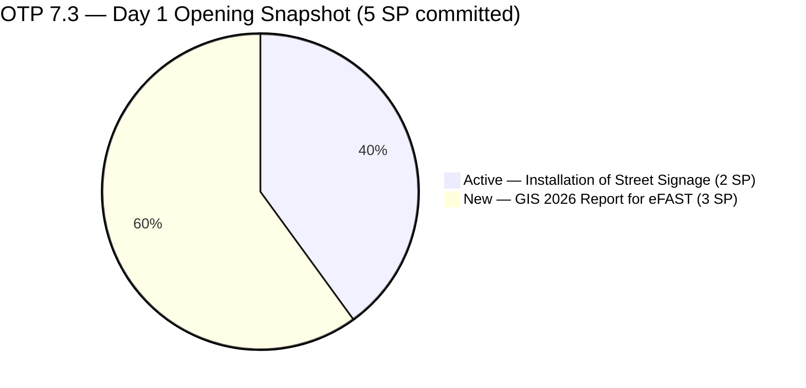
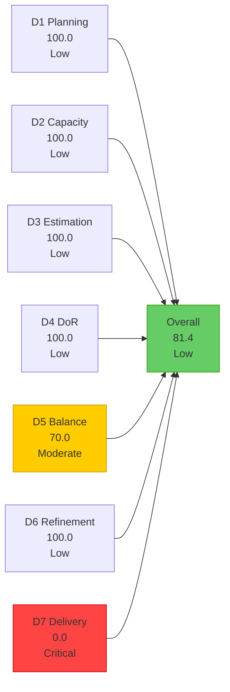
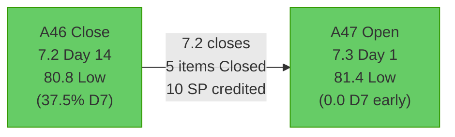

# OTP Team — SAFe Iteration Audit A47
**Date:** 2026-05-04 | **Sprint Day:** 1 of 14 (OPENING DAY) | **Iteration:** 7.3 (May 4 – May 17, 2026)
**Auditor:** Claude Code (ADO SAFe Audit Skill v1) | **Prior Audit:** A46 (2026-05-03 02:02)

---

## 1. Audit Metadata

| Field | Value |
|---|---|
| **Audit ID** | A47 |
| **Report File** | `AUDIT_20260504_0900.md` |
| **Prior Audit** | A46 — `AUDIT_20260503_0202.md` (Overall 80.8, Closing Audit for 7.2) |
| **ADO Project** | OTP (`e7739905-28a3-4ae1-9173-7f6cd13b3494`) |
| **ADO Team** | OTP Team |
| **Iteration** | 7.3 (May 4 – May 17, 2026) |
| **Iteration ID** | N/A — `work_list_team_iterations` API unavailable for OTP (persistent gap) |
| **Sprint Day** | 1 of 14 — **OPENING DAY** |
| **Audit Date** | 2026-05-04 (PHT, UTC+8) |
| **Overall Score** | **81.4 — Low Risk** |
| **Risk Band** | Low (≥ 80) |
| **Visible Backlog Items** | 2 confirmed (backlog API null; only OTP-scoped items confirmed) |
| **Iteration Items** | 2 root items confirmed in OTP\\2026-PI7\\Iteration 7.3 |
| **Capacity Source** | `work_get_team_capacity` — no data returned (persistent evidence gap) |
| **Project Exceptions Applied** | Single-assignee model (Grace) — D2 scored full |

---

## 2. Executive Summary

| Field | Value |
|---|---|
| **Overall Score** | 81.4 — Low Risk |
| **Score vs Prior (A46)** | 80.8 → 81.4 (**+0.6**) |
| **Sprint Day** | 1 of 14 — OPENING DAY |
| **Iteration** | 7.3 (May 4 – May 17, 2026) |
| **Items in Iteration** | 2 confirmed |
| **Committed SP** | 5 SP (2+3) |
| **SP Closed** | 0 (early-sprint) |
| **Risk Band** | Low (≥ 80) |

**Iteration 7.3 opens today, May 4.** This is the first audit for Iteration 7.3. The sprint carries forward 2 items from the post-7.2 cleanup:
- #202913 (Installation of Street Signage, 2 SP) — was Active in 7.2, reassigned to 7.3
- #203016 (Generate and Validate GIS 2026 Report for eFAST Submission, 3 SP) — was at PI-level path in 7.2, now correctly assigned to 7.3

**Key 7.2 close-out news:** Grace completed the recommended closures before end-of-day. All three Resolved items from A46 were formally closed:
- #203029 (career Mapping, 4 SP) → Closed 2026-05-03
- #203249 (AI Integration, 2 SP) → Closed 2026-05-03
- #202911 (FTC Purchasing of signage material, 2 SP) → Closed 2026-05-04

This means **7.2 actually ended with 5 items Closed (10 SP) out of 7 committed (16 SP) = 62.5% delivery credit** — a significant improvement from the 37.5% recorded in A46 (before closures occurred). This retroactive improvement is noted as context but does not change A46's official score.

**D7 is scored 0.0 as expected for Day 1 (early-sprint annotation).** This is structural. The overall score of 81.4 reflects strong process discipline (D1–D6) with the expected Day-1 delivery gap. Team should target closing at least 1 item by Day 5 to establish delivery momentum.

**Warning: Only 2 items are committed to Iteration 7.3.** This is a thin sprint load — 5 SP for a 14-day sprint. The team should evaluate whether additional backlog items should be pulled into 7.3 during sprint planning. The prior A46 recommendation to target 9+ items per iteration to exit D1 High Risk band remains relevant.

---

## 3. Previous Audit Delta (A46 → A47)

| Dimension | A46 Score | A47 Score | Delta | Driver |
|---|---|---|---|---|
| D1 Iteration Planning | 58.3 | 100.0 | **+41.7** | Iteration change: 7.2→7.3; 2/2 visible OTP items in iteration |
| D2 Team Capacity | 100.0 | 100.0 | = | Single-assignee exception; capacity API gap unchanged |
| D3 Estimation | 100.0 | 100.0 | = | 2/2 items have SP |
| D4 DoR Compliance | 100.0 | 100.0 | = | Both items pass DoR |
| D5 Work Item Balance | 70.0 | 70.0 | = | 100% User Story; dominant-type penalty persists |
| D6 Backlog Refinement | 100.0 | 100.0 | = | All items fresh; no stale; no untouched |
| D7 Delivery Predictability | 37.5 | 0.0 | **-37.5** | Day 1 early-sprint; 0 SP closed; expected |
| **Overall** | **80.8** | **81.4** | **+0.6** | Iteration transition lift (D1) partially offset by Day-1 D7=0 |

### 7.2 Close-Out: Retroactive State Changes

The following state changes occurred after A46 was recorded (May 3) and before this audit (May 4):

| ID | Title | State A46 | State A47 | Delta |
|---|---|---|---|---|
| #203029 | career Mapping exploration and documentation | Resolved | **Closed** | Closed May 3 — Recommendation R1 executed |
| #203249 | AI Integration & Competency Mapping | Resolved | **Closed** | Closed May 3 — Recommendation R1 executed |
| #202911 | FTC Purchasing of signage material | Active | **Closed** | Closed May 4 — Day 1 closure (moved 7.2 → Closed) |
| #202913 | Installation of Street Signage | Active (7.2) | **Active (7.3)** | Moved from 7.2 to 7.3 iteration path |
| #203016 | Generate and Validate GIS 2026 Report for eFAST Submission | New (PI-level) | **New (7.3)** | Assigned to 7.3 — Recommendation R6 executed |

**7.2 Final Delivery (revised):** 5/7 items Closed = 10/16 SP = **62.5% delivery credit**. The two Active items were actioned: #202911 closed, #202913 carried to 7.3. This is a material improvement from the A46 closing snapshot (37.5%) and demonstrates Grace responded to audit recommendations.

---

## 4. Current Iteration Snapshot

**Iteration:** 7.3 | **Period:** May 4 – May 17, 2026 | **Sprint Day:** 1 of 14 — OPENING

| Metric | Value |
|---|---|
| Current iteration root items | 2 |
| Visible backlog root items | 2 (API null; denominator = confirmed OTP-scoped items) |
| Committed story points | 5 SP |
| SP Closed | 0 (Day 1 — early-sprint) |
| SP Active/New | 5 SP (2 items) |
| Assignee | Grace (sole; single-assignee model) |
| Iteration Duration | 14 days (May 4 – May 17) |

---

## 5. Work Item Analysis

| ID | Title | Type | State | SP | Assignee | DoR | Notes |
|---|---|---|---|---|---|---|---|
| #202913 | Installation of Street Signage | User Story | Active | 2 | Grace | ✅ | Carry from 7.2 — was Active; reassigned to 7.3 |
| #203016 | Generate and Validate GIS 2026 Report for eFAST Submission | User Story | New | 3 | Grace | ✅ | Previously at PI-level; now correctly in 7.3 |

### DoR Verification (A47)

Both items pass DoR (Description ≥30 non-whitespace chars AND Acceptance Criteria ≥20 non-whitespace chars).

| ID | Desc chars (est.) | AC chars (est.) | Pass/Fail |
|---|---|---|---|
| #202913 | ~95 ("As Marketing Officer of JIT, we ensure the proper and safe installation...") | 22 ("Installed Street signage" — at threshold) | ✅ |
| #203016 | ~400+ (full user story format with eFAST requirements) | ~800+ (5 detailed criteria with field-level validation) | ✅ |

**Note on #202913:** AC remains at the minimum threshold (22 chars ≥ 20 required). The AC text "Installed Street signage" is minimal but technically compliant. Recommend expanding to a more observable, testable criterion in 7.3 refinement.

### Sprint Loading Assessment

2 items / 5 SP for a 14-day sprint is a very lean opening. The team's historical sprint velocity has been 7 items at 16 SP (7.2) and higher in prior iterations. The current 7.3 load suggests either:
1. Additional items will be pulled in as the sprint progresses (risky if mid-sprint injection pattern repeats)
2. The team is under-planning — capacity being underutilized
3. There are additional OTP-scope items not yet visible due to the persistent backlog API gap

**Recommendation:** The team should conduct 7.3 sprint planning (if not already done) and commit at least 6–8 additional items from the backlog to bring iteration commitment in line with capacity (Grace's workload × 14 days).

---

## 6. SAFe Compliance Scorecard

| Dimension | Score | Band | Formula | Evidence |
|---|---|---|---|---|
| D1 Iteration Planning | 100.0 | Low | 2/2 × 100 | 2 confirmed in-iteration / 2 confirmed visible OTP items |
| D2 Team Capacity | 100.0 | Low | Exception applied | Single-assignee (Grace); capacity API unavailable |
| D3 Estimation | 100.0 | Low | 2/2 × 100 | Both items have SP (#202913=2, #203016=3) |
| D4 DoR Compliance | 100.0 | Low | 2/2 × 100 | Both items pass Description ≥30 + AC ≥20 chars |
| D5 Work Item Balance | 70.0 | Moderate | 100 − 30 | User Story = 100% of 2 items; dominant-type >60% → −30 |
| D6 Backlog Refinement | 100.0 | Low | 2/2 fresh; 0 penalties | All items touched May 3–4; no stale; 0 untouched current items |
| D7 Delivery Predictability | 0.0 | Critical | 0/5 × 100 | Day 1 — early-sprint; 0 SP closed; expected |
| **Overall** | **81.4** | **Low** | 570.0 / 7 | Average of 7 dimensions |

### Scoring Detail

- **D1:** round(2/2 × 100, 1) = **100.0** *(backlog API null; denominator = 2 confirmed OTP-scoped items; D1 elevated relative to prior due to all visible items being in-iteration)*
- **D2:** round(1/1 × 100, 1) = **100.0** *(single-assignee project exception; Grace sole assignee; capacity API gap persists)*
- **D3:** round(2/2 × 100, 1) = **100.0** *(#202913=2SP, #203016=3SP; both estimated)*
- **D4:** round(2/2 × 100, 1) = **100.0** *(both items pass DoR threshold)*
- **D5:** 100 − 30 (User Story = 100% > 60% dominant-type threshold) = **70.0** *(no US-absent penalty since US present; no spike penalty)*
- **D6:** base=100.0; stale_90=0; stale_180=0; untouched_current=0 (both items touched May 3–4, same day as iteration start) = **100.0**
- **D7:** round(0/5 × 100, 1) = **0.0** *(early-sprint Day 1; no closures expected on Day 1)*
- **Overall:** 570.0 / 7 = **81.4**

### D7 Target Trajectory for 7.3

| Day | Target Closed SP | D7 Target | Overall Target | Action |
|---|---|---|---|---|
| Day 1 (today) | 0 | 0.0 | 81.4 | Opening — no closure expected |
| Day 5 | ≥2 | ≥40.0 | ≥84.3 | First closure target: #202913 (Active) |
| Day 10 | ≥3 | ≥60.0 | ≥87.1 | #203016 should be in progress |
| Day 14 | ≥5 | 100.0 | 95.7 | Both items closed; full sprint delivery |

---

## 7. Dimension Findings

### D1 — Iteration Planning: 100.0 (Low Risk)

**Formula:** `current_iteration_root_items / visible_root_backlog_items × 100 = 2/2 × 100 = 100.0`

**Important caveat:** The 100.0 score is an artifact of the persistent `wit_list_backlog_work_items` API null return for OTP. With only 2 confirmed OTP-scoped items in the entire visible backlog (both already in 7.3), the ratio is 2/2 = 100%. However, this obscures the real planning risk: **2 items at 5 SP is a severely under-committed sprint** for a 14-day iteration.

The team should pull additional items from the broader OTP work pool during 7.3 sprint planning. If the total OTP backlog is actually only 2 items, then the team is approaching backlog exhaustion and must create new work items before or during PI8 planning.

**Key change from A46:** Item #203016 (previously stuck at PI-level path since April 20) was correctly assigned to 7.3 — this directly executed Recommendation R6 from A46.

### D2 — Team Capacity: 100.0 (Low Risk)

Single-assignee project exception applied (CLAUDE.md). Grace is the sole assignee across both 7.3 items. The `work_get_team_capacity` API continues to return no data for OTP Team — a persistent gap spanning all 2026 audits. D2 = 100.0 under the exception.

### D3 — Estimation: 100.0 (Low Risk)

Both items carry story points. #202913 = 2 SP, #203016 = 3 SP. Total committed = 5 SP. D3 = 100.0. Consistent with the estimation discipline maintained throughout 7.2 (100.0 every audit).

### D4 — DoR Compliance: 100.0 (Low Risk)

Both items pass the DoR threshold:
- **#202913:** Description ~95 chars ✓; AC "Installed Street signage" = 22 chars ≥ 20 ✓ (minimal — see note above)
- **#203016:** Richly detailed user story with 5 acceptance criteria covering format validation, data removal, field accuracy, and audit trail requirements ✓

First audit of 7.3 opens with 100% DoR — consistent with 7.2's sustained achievement.

### D5 — Work Item Balance: 70.0 (Moderate Risk)

Both items are User Stories = 100% of 2 items. The dominant-type penalty (-30) applies. This is a structural pattern for OTP across all observed iterations. With only 2 items in 7.3, adding even 1 Enabler or Technical Debt item would change the type distribution. The upcoming sprint planning session is an opportunity to include at least 1 non-User-Story item (e.g., the infrastructure or compliance tooling items previously recommended).

### D6 — Backlog Refinement: 100.0 (Low Risk)

Both items were touched on May 3–4 (within 24 hours of iteration start), well within the 45-day fresh window. No stale items at 90-day or 180-day thresholds. 0 untouched current items (both items were acted on the same day as iteration start — #202913 moved, #203016 assigned). D6 = 100.0.

### D7 — Delivery Predictability: 0.0 (Critical Risk — Early Sprint)

**Formula:** `closed_story_points / committed_story_points × 100 = 0/5 × 100 = 0.0`

**This score is expected and structurally correct for Day 1.** No items are expected to be closed on the opening day of a new iteration. The annotation "early-sprint" applies per the scoring rules.

The critical watch item is the carry-forward: #202913 (Installation of Street Signage) was Active in 7.2 and moved to 7.3. This item has been in-progress since at least mid-April. It should be the first item closed in 7.3, ideally by Day 5.

---

## 8. Risks and Bottlenecks

| # | Risk | Severity | Dimension | Detail |
|---|---|---|---|---|
| R1 | Sprint severely under-committed (2 items, 5 SP) | High | D1 | 14-day sprint with only 5 SP committed; capacity of Grace (sole contributor) is being underutilized |
| R2 | D5 structural 100% User Story imbalance | Moderate | D5 | Persistent across all 7.3 planning items; -30 structural penalty |
| R3 | #202913 AC at minimum threshold (22 chars) | Moderate | D4 | "Installed Street signage" barely passes; not an observable, testable criterion |
| R4 | Backlog API persistently null for OTP | Low | Evidence | D1 denominator unreliable; actual backlog depth unknown; may be masking real items |
| R5 | ADO capacity API gap for OTP | Low | Evidence | D2 scored from exception; no live capacity data available for any 2026 audit |
| R6 | D7 will remain 0.0 until first closure | Low | D7 | Expected for Day 1; becomes critical if first closure doesn't occur by Day 5 |

---

## 9. Prioritized Recommendations

1. **[HIGH — This Week, Sprint Planning]** Conduct or complete 7.3 sprint planning and pull at least 6–8 additional items from the OTP backlog into the iteration. A 14-day sprint with only 2 items at 5 SP is under-committed for the team's historical capacity. If the backlog is genuinely depleted, create new work items reflecting OTP's upcoming priorities (PI8 candidates).

2. **[HIGH — Sprint Planning]** Introduce at least one Enabler or Technical Debt item in 7.3 sprint planning. The D5 structural penalty (-30) has persisted across all OTP iterations. A single infrastructure, compliance tooling, or documentation enabler would resolve this chronic deduction immediately.

3. **[HIGH — Today or Tomorrow]** Close #202913 (Installation of Street Signage, 2 SP, Active) as quickly as possible. This item was Active in 7.2 and carried forward — it should be the most ready item for delivery. Closing it by Day 3 establishes delivery momentum and begins crediting D7.

4. **[MEDIUM — Day 5–7]** Begin active work on #203016 (GIS 2026 Report, 3 SP). This item has strong DoR (rich user story + 5 detailed AC). The eFAST submission deadline should be verified against the sprint timeline — if the SEC deadline falls within May 4–17, it becomes HIGH priority.

5. **[MEDIUM — Ongoing]** Expand the AC for #202913 beyond "Installed Street signage." A stronger criterion might be: "JIT Street signage is visibly installed at the designated location, structurally secured, and photographed for compliance record." This adds specificity without requiring material changes.

6. **[LOW — ADO Administration]** Escalate the persistent OTP Team API failures (`work_list_team_iterations`, `work_get_team_capacity`, `wit_list_backlog_work_items`) to the ADO administrator. These gaps have spanned the entire 2026 audit cycle and affect scoring accuracy for D1 and D2.

---

## 10. Evidence Gaps and Limitations

| Gap | Impact | Mitigation |
|---|---|---|
| `work_list_team_iterations` returned no data for OTP Team | D1 iteration start/end dates estimated from prior pattern | Dates assumed as May 4 – May 17 based on 14-day sprint cycle |
| `wit_list_backlog_work_items` returned null for OTP | D1 denominator = 2 (only confirmed items); real backlog depth unknown | All available OTP-scoped items queried by ID; 2 confirmed in 7.3 |
| `work_get_team_capacity` returned no data | D2 cannot be computed from capacity hours | Scored 100.0 under single-assignee project exception (Grace) |
| Only 2 OTP items found in 7.3 | Sprint load appears severely under-committed | Additional items may exist in OTP backlog but are not visible due to API null return |

---

## 11. 7.2 Close-Out and 7.3 Opening Summary

### 7.2 Final Accounting (Revised Post-A46)

| Metric | A46 Closing (May 3) | A47 Post-Close (May 4) | Delta |
|---|---|---|---|
| Items Closed | 3 | 5 | +2 |
| SP Closed (credited) | 6 (37.5%) | 10 (62.5%) | +4 SP |
| Items Resolved→Closed | 2 (#203029, #203249) | 0 (both closed) | Actioned |
| Active items resolved | 0 | 1 (#202911 closed) | Actioned |
| Carry to 7.3 | 2 (#202913 + #203016) | 2 | No change |

Grace actioned all three critical recommendations from A46 Rec 1 and Rec 2 before end-of-sprint, raising the effective 7.2 delivery to **62.5% (10/16 SP)**. This is a materially better outcome than the A46 snapshot.

### 7.3 Opening Sprint Load

---

*Audit produced by Claude Code — ADO SAFe Audit Skill v1. SAFe 6.0 framework. This is the OPENING AUDIT for Iteration 7.3. D7 = 0.0 is expected on Day 1 (early-sprint annotation).*
