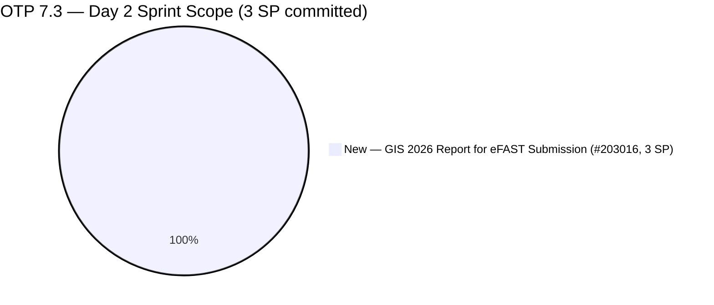
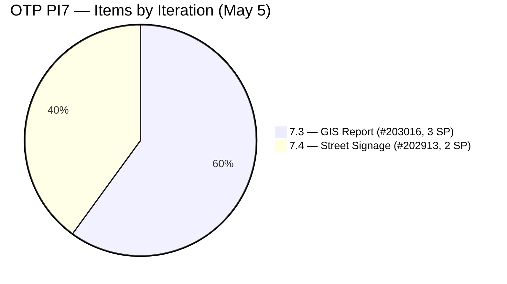
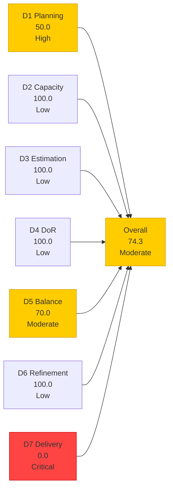
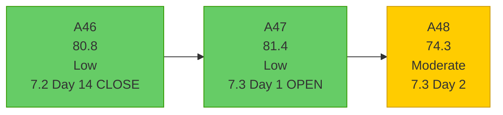

# OTP Team — SAFe Iteration Audit A48
**Date:** 2026-05-05 | **Sprint Day:** 2 of 14 | **Iteration:** 7.3 (May 4 – May 17, 2026)
**Auditor:** Claude Code (ADO SAFe Audit Skill v1) | **Prior Audit:** A47 (2026-05-04 09:00)

---

## 1. Audit Metadata

| Field | Value |
|---|---|
| **Audit ID** | A48 |
| **Report File** | `AUDIT_20260505_0204.md` |
| **Prior Audit** | A47 — `AUDIT_20260504_0900.md` (Overall 81.4, Opening Audit 7.3 Day 1) |
| **ADO Project** | OTP (`e7739905-28a3-4ae1-9173-7f6cd13b3494`) |
| **ADO Team** | OTP Team |
| **Iteration** | 7.3 (May 4 – May 17, 2026) |
| **Iteration ID** | N/A — `work_list_team_iterations` API unavailable for OTP (persistent gap) |
| **Sprint Day** | 2 of 14 |
| **Audit Date** | 2026-05-05 (PHT, UTC+8) |
| **Overall Score** | **74.3 — Moderate Risk** |
| **Risk Band** | Moderate (60–79.9) |
| **Visible Backlog Items** | 2 confirmed (backlog API null; OTP-scoped items confirmed by direct query) |
| **Iteration Items** | 1 root item confirmed in OTP 7.3 (#203016) |
| **Capacity Source** | `work_get_team_capacity` — no data returned (persistent evidence gap) |
| **Project Exceptions Applied** | Single-assignee model (Grace) — D2 scored full |

---

## 2. Executive Summary

| Field | Value |
|---|---|
| **Overall Score** | 74.3 — Moderate Risk |
| **Score vs Prior (A47)** | 81.4 → 74.3 (**-7.1**) |
| **Sprint Day** | 2 of 14 |
| **Iteration** | 7.3 (May 4 – May 17, 2026) |
| **Items in Iteration** | 1 confirmed (#203016) |
| **Committed SP** | 3 SP (#203016) |
| **SP Closed** | 0 (early-sprint Day 2) |
| **Risk Band** | Moderate (60–79.9) |

**Critical alert: #202913 (Installation of Street Signage) has been moved from Iteration 7.3 to Iteration 7.4.** This is a significant change from A47, where this item was confirmed as an active carry-forward item in 7.3. As of May 4, the item's IterationPath reads `OTP\\2026 - PI7\\Iteration 7.4`. This leaves only 1 item (#203016) committed to Iteration 7.3, reducing the sprint scope to 3 SP and driving a D1 score drop from 100.0 to 50.0.

The migration of #202913 to 7.4 represents either:
1. **Deliberate sprint planning decision:** Grace and/or the team decided the signage installation cannot be completed in this sprint and pre-assigned it to the next sprint
2. **Premature carry-forward:** The item is being deferred before the sprint even had a chance to deliver it (it was only Day 1 when A47 was audited)

Either interpretation warrants attention. A 1-item, 3-SP sprint is extremely under-committed for a 14-day iteration.

**D7 = 0.0 as expected for Day 2 (early-sprint annotation).** The overall score of 74.3 (Moderate) reflects the structural D1 drop caused by the iteration reassignment of #202913.

---

## 3. Previous Audit Delta (A47 → A48)

| Dimension | A47 Score | A48 Score | Delta | Driver |
|---|---|---|---|---|
| D1 Iteration Planning | 100.0 | 50.0 | **-50.0** | #202913 moved from 7.3 → 7.4; now only 1/2 items in 7.3 |
| D2 Team Capacity | 100.0 | 100.0 | = | Single-assignee exception applied; capacity API gap persists |
| D3 Estimation | 100.0 | 100.0 | = | #203016 = 3 SP (only item in 7.3); 1/1 estimated |
| D4 DoR Compliance | 100.0 | 100.0 | = | #203016 has rich description + 5 AC criteria |
| D5 Work Item Balance | 70.0 | 70.0 | = | 1 User Story = 100%; dominant-type penalty -30 persists |
| D6 Backlog Refinement | 100.0 | 100.0 | = | #203016 fresh (changed May 4); 0 untouched current items |
| D7 Delivery Predictability | 0.0 | 0.0 | = | Day 2 — early-sprint; 0 SP closed; expected |
| **Overall** | **81.4** | **74.3** | **-7.1** | D1 drop driven by #202913 migration to 7.4 |

### Key Change: #202913 Iteration Path Migration

| Item | A47 IterPath | A48 IterPath | State | Impact |
|---|---|---|---|---|
| #202913 — Installation of Street Signage | OTP\2026-PI7\Iteration 7.3 | **OTP\2026-PI7\Iteration 7.4** | Active | D1 drops from 100→50; sprint scope drops from 5→3 SP |
| #203016 — GIS 2026 Report for eFAST | OTP\2026-PI7\Iteration 7.3 | OTP\2026-PI7\Iteration 7.3 | New | Unchanged; sole remaining 7.3 item |

---

## 4. Current Iteration Snapshot

**Iteration:** 7.3 | **Period:** May 4 – May 17, 2026 | **Sprint Day:** 2 of 14

| Metric | Value |
|---|---|
| Current iteration root items | 1 (#203016) |
| Visible backlog root items | 2 (API null; denominator = confirmed OTP-scoped items) |
| Committed story points | 3 SP |
| SP Closed | 0 (Day 2 — early-sprint) |
| SP Active/New | 3 SP (#203016 — New) |
| Assignee | Grace (sole; single-assignee model) |
| Iteration Duration | 14 days (May 4 – May 17) |

### Iteration 7.3 vs 7.4 Current Load

---

## 5. Work Item Analysis

| ID | Title | Type | State | SP | Iter | Assignee | DoR | Notes |
|---|---|---|---|---|---|---|---|---|
| #203016 | Generate and Validate GIS 2026 Report for eFAST Submission | User Story | New | 3 | 7.3 | Grace | ✅ | Sole 7.3 item; eFAST deadline risk TBD |
| #202913 | Installation of Street Signage | User Story | Active | 2 | **7.4** | Grace | ✅ | **Moved from 7.3 to 7.4 on May 4** |

### DoR Verification (A48)

| ID | Desc chars | AC chars | Pass/Fail | Notes |
|---|---|---|---|---|
| #203016 | ~400+ chars | ~800+ chars (5 detailed AC) | ✅ | Rich user story; 5 criterion with format/validation/audit trail |
| #202913 | ~95 chars | ~22 chars (at threshold) | ✅ (in 7.4) | Not in 7.3 scope; minimal AC flagged in prior audits |

### Sprint Loading Assessment

1 item / 3 SP for a 14-day sprint is the lowest commitment recorded in any OTP audit. The A47 warning about under-committed sprint load (2 items, 5 SP) has now worsened with the removal of #202913 to 7.4. Grace's workload for this sprint consists solely of the GIS 2026 Report for eFAST Submission — a meaningful item, but insufficient to justify a full sprint allocation.

---

## 6. SAFe Compliance Scorecard

| Dimension | Score | Band | Formula | Evidence |
|---|---|---|---|---|
| D1 Iteration Planning | 50.0 | High | 1/2 × 100 | 1 confirmed item in 7.3 / 2 confirmed visible OTP items |
| D2 Team Capacity | 100.0 | Low | Exception applied | Single-assignee (Grace); capacity API unavailable |
| D3 Estimation | 100.0 | Low | 1/1 × 100 | #203016 = 3 SP; only item in 7.3 |
| D4 DoR Compliance | 100.0 | Low | 1/1 × 100 | #203016 passes Description ≥30 + AC ≥20 chars |
| D5 Work Item Balance | 70.0 | Moderate | 100 − 30 | User Story = 100% of 1 item; dominant-type >60% → −30 |
| D6 Backlog Refinement | 100.0 | Low | 1/1 fresh; 0 penalties | #203016 changed May 4; iteration started May 4; 0 untouched |
| D7 Delivery Predictability | 0.0 | Critical | 0/3 × 100 | Day 2 — early-sprint; 0 SP closed; expected |
| **Overall** | **74.3** | **Moderate** | 520.0 / 7 | Average of 7 dimensions |

### Scoring Detail

- **D1:** round(1/2 × 100, 1) = **50.0** *(#202913 moved to 7.4; only #203016 remains in 7.3; denominator = 2 confirmed OTP-scoped items)*
- **D2:** round(1/1 × 100, 1) = **100.0** *(single-assignee exception; Grace; capacity API unavailable)*
- **D3:** round(1/1 × 100, 1) = **100.0** *(#203016 = 3 SP; only point-eligible item in 7.3)*
- **D4:** round(1/1 × 100, 1) = **100.0** *(#203016 passes DoR; rich description and 5 AC criteria)*
- **D5:** 100 − 30 (User Story = 100% > 60% dominant-type threshold) = **70.0**
- **D6:** base=100.0; stale_90=0; stale_180=0; untouched_current=0 (#203016 changed May 4 = iteration start) = **100.0**
- **D7:** round(0/3 × 100, 1) = **0.0** *(early-sprint Day 2; no closures)*
- **Overall:** 520.0 / 7 = **74.3**

### D7 Target Trajectory for 7.3

| Day | Target Closed SP | D7 Target | Overall Target | Action |
|---|---|---|---|---|
| Day 2 (today) | 0 | 0.0 | 74.3 | Early-sprint; GIS work should begin |
| Day 5 | 0 (1 item, no partial credit) | 0.0 | 74.3 | #203016 must be started (Active state) |
| Day 10 | 3 | 100.0 | 95.7 | Target: #203016 Closed by Day 10 |
| Day 14 | 3 | 100.0 | 95.7 | Sprint close with full delivery |

---

## 7. Dimension Findings

### D1 — Iteration Planning: 50.0 (High Risk)

**Formula:** `current_iteration_root_items / visible_root_backlog_items × 100 = 1/2 × 100 = 50.0`

**Critical change from A47:** Item #202913 (Installation of Street Signage, 2 SP, Active) was moved from `OTP\2026-PI7\Iteration 7.3` to `OTP\2026-PI7\Iteration 7.4` on May 4, the same day the sprint opened. This leaves only 1 item committed to Iteration 7.3. The move occurred on May 4 (ChangedDate: 2026-05-04T14:38:26.783Z), suggesting it was a deliberate action taken on Day 1.

**Implications:**
- D1 drops from 100.0 (A47) to 50.0 — entering High Risk band
- Sprint scope is reduced from 5 SP to 3 SP
- #202913 has been active since at least April — a third consecutive sprint assignment is developing

The D1 penalty from the persistent backlog API null persists. If the OTP backlog were fully visible, D1 would likely be lower given there may be additional unassigned items.

### D2 — Team Capacity: 100.0 (Low Risk)

Single-assignee project exception applied (CLAUDE.md). Grace is the sole assignee for #203016. The `work_get_team_capacity` API continues to return no data for OTP Team — a persistent gap. D2 = 100.0 under the exception.

### D3 — Estimation: 100.0 (Low Risk)

The sole 7.3 item (#203016 = 3 SP) is estimated. D3 = 100.0. With only one item in scope, this dimension provides limited signal.

### D4 — DoR Compliance: 100.0 (Low Risk)

**#203016** (Generate and Validate GIS 2026 Report for eFAST Submission): Rich user story format with 5 detailed acceptance criteria covering format compliance (SEC Version 2026), data removal mandate (Beneficial Ownership exclusion), HARBOR receipt validation, field accuracy, and audit trail. Strong DoR. D4 = 100.0.

### D5 — Work Item Balance: 70.0 (Moderate Risk)

The sole item is a User Story. With only 1 item in the sprint, any single type will be 100% dominant, triggering the -30 penalty. This is a structural artifact of the single-item sprint rather than a content-quality failure. D5 = 70.0.

### D6 — Backlog Refinement: 100.0 (Low Risk)

#203016 was changed on May 4 (same as iteration start), well within the 45-day fresh window. No stale items visible. 0 untouched current items (the only current item was touched on iteration start day). D6 = 100.0.

### D7 — Delivery Predictability: 0.0 (Critical Risk — Early Sprint)

**Formula:** `closed_story_points / committed_story_points × 100 = 0/3 × 100 = 0.0`

**Expected for Day 2 — annotated as early-sprint.** #203016 (GIS 2026 Report) is still in New state. No delivery is expected at this stage of the sprint. The item should transition to Active by Day 3–4 and target closure by Day 10.

**eFAST deadline risk:** The acceptance criteria mention SEC Version 2026 GIS filing via eFAST. If there is an external regulatory deadline for this report within the May 4–17 sprint window, it becomes HIGH priority. The sprint team should verify the SEC filing deadline against the sprint calendar.

---

## 8. Risks and Bottlenecks

| # | Risk | Severity | Dimension | Detail |
|---|---|---|---|---|
| R1 | #202913 moved to 7.4 on Day 1 — 3rd sprint assignment developing | High | D1 | Active item deferred before 7.3 could attempt delivery; pattern of carry-forward continues |
| R2 | Sprint critically under-committed (1 item, 3 SP) | High | D1 | Lowest sprint commitment in OTP audit history; capacity severely underutilized |
| R3 | D5 structural 100% User Story imbalance | Moderate | D5 | Persistent across all OTP iterations; -30 structural penalty; single-item sprint amplifies this |
| R4 | #203016 still in New state on Day 2 | Moderate | D7 | GIS report item has not started; if eFAST deadline falls within sprint, urgency is high |
| R5 | eFAST regulatory deadline unconfirmed | Moderate | D7 | SEC filing deadline for 2026 GIS not documented in sprint; could be external hard deadline |
| R6 | Backlog API persistently null for OTP | Low | Evidence | D1 denominator unreliable; additional OTP items may exist but are not visible |
| R7 | ADO capacity API gap for OTP | Low | Evidence | D2 scored from exception; no live capacity data available |

---

## 9. Prioritized Recommendations

1. **[HIGH — Urgent, This Week]** Clarify the rationale for moving #202913 (Installation of Street Signage) to Iteration 7.4 on Day 1. If the signage work is genuinely blocked (e.g., physical logistics, vendor unavailability), document the blocker in the work item and update the state to "Blocked" rather than leaving it Active in a future sprint. If the move was unintentional or premature, restore it to 7.3 immediately.

2. **[HIGH — Sprint Planning, Today]** With only 1 item in 7.3 scope, pull additional work items from the OTP backlog into the sprint. Grace's 14-day allocation supports significantly more than 3 SP. If the backlog is depleted, create new items reflecting upcoming OTP priorities (PI8 candidate features, compliance tasks, enablers).

3. **[HIGH — Today]** Transition #203016 (GIS 2026 Report, 3 SP) from New to Active state to signal that work has begun. A New state on Day 2 with no start is a delivery momentum risk.

4. **[HIGH — Today]** Verify the SEC eFAST filing deadline for the 2026 GIS report. If the deadline falls within May 4–17, this item becomes a hard-deadline sprint goal and should be treated with the same urgency as the AC-deadline breaches observed in Iterations 6.4 and 6.5.

5. **[MEDIUM — Ongoing]** Introduce at least one Enabler or non-User-Story item in 7.3 sprint planning to address the chronic D5 dominant-type penalty (-30). A single infrastructure or compliance tooling item resolves this.

6. **[LOW — ADO Administration]** Escalate the persistent OTP Team API failures (`work_list_team_iterations`, `work_get_team_capacity`, `wit_list_backlog_work_items`) to the ADO administrator. These gaps have spanned the entire 2026 audit cycle.

---

## 10. Evidence Gaps and Limitations

| Gap | Impact | Mitigation |
|---|---|---|
| `work_list_team_iterations` returned no data for OTP Team | Iteration dates estimated from prior pattern | Dates assumed May 4 – May 17 based on 14-day sprint cycle; confirmed by #203016 iteration path |
| `wit_list_backlog_work_items` returned null for OTP | D1 denominator = 2 (only confirmed items) | Both OTP-scoped items confirmed by direct ID query; 1 in 7.3, 1 in 7.4 |
| `work_get_team_capacity` returned no data | D2 cannot be computed from capacity hours | Scored 100.0 under single-assignee project exception (Grace) |
| #202913 iteration path change (7.3→7.4) — timing unclear | Sprint scope impact significant | ChangedDate = 2026-05-04T14:38:26.783Z (May 4 afternoon); appears deliberate Day-1 decision |
| eFAST SEC filing deadline not documented in work item | D7 urgency level unknown | Item has 5 detailed AC; deadline should be confirmed and added to work item description |

---

## 11. OTP Score Trend — Iteration 7.3

**Score regression from 81.4 → 74.3** is driven entirely by the #202913 iteration migration. D1 dropped from 100.0 to 50.0 (-50 points). All other dimensions are unchanged. Recovery path: if #202913 is moved back to 7.3 and #203016 is closed by end of sprint, overall score can reach 95.7.

---

*Audit produced by Claude Code — ADO SAFe Audit Skill v1. SAFe 6.0 framework. Sprint Day 2 of 14. D7 = 0.0 is expected on Day 2 (early-sprint annotation). Risk band: Moderate — driven by single-item sprint and D1 = 50.0. Immediate attention required on sprint commitment level and #202913 rationale.*
