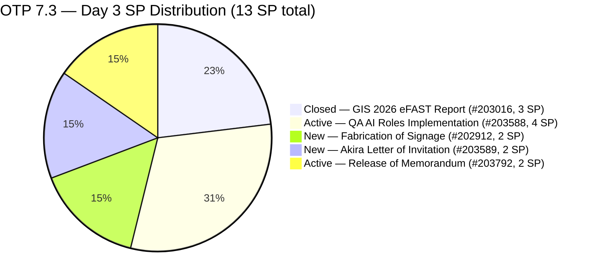
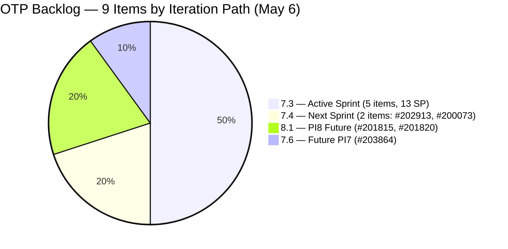
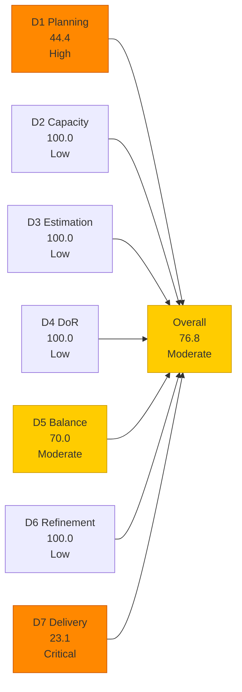
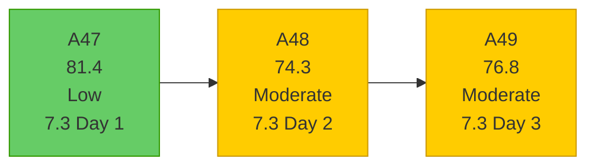

# OTP Team — SAFe Iteration Audit A49
**Date:** 2026-05-06 | **Sprint Day:** 3 of 14 | **Iteration:** 7.3 (May 4 – May 17, 2026)
**Auditor:** Claude Code (ADO SAFe Audit Skill v1) | **Prior Audit:** A48 (2026-05-05 02:04)

---

## 1. Audit Metadata

| Field | Value |
|---|---|
| **Audit ID** | A49 |
| **Report File** | `AUDIT_20260506_0906.md` |
| **Prior Audit** | A48 — `AUDIT_20260505_0204.md` (Overall 74.3, Moderate — 7.3 Day 2) |
| **ADO Project** | OTP (`e7739905-28a3-4ae1-9173-7f6cd13b3494`) |
| **ADO Team** | OTP Team |
| **Iteration** | 7.3 (`86aab8f1-cd46-4fe6-a810-00fba59b46a3`) |
| **Iteration Dates** | May 4 – May 17, 2026 |
| **Sprint Day** | 3 of 14 |
| **Audit Date** | 2026-05-06 (PHT, UTC+8) |
| **Overall Score** | **76.8 — Moderate Risk** |
| **Risk Band** | Moderate (60–79.9) |
| **Visible Backlog Items** | 9 root items (backlog API now returning — persistent gap resolved) |
| **Iteration Items** | 5 root items in 7.3 (including 1 Closed) |
| **Capacity Source** | `work_get_team_capacity` — Grace: 1.0 h/day Documentation + 0.5 h/day Requirements (1.5 h/day total) |
| **Project Exceptions Applied** | Single-assignee model (Grace) — D2 scored full |

---

## 2. Executive Summary

| Field | Value |
|---|---|
| **Overall Score** | 76.8 — Moderate Risk |
| **Score vs Prior (A48)** | 74.3 → 76.8 (**+2.5**) |
| **Sprint Day** | 3 of 14 |
| **Iteration** | 7.3 (May 4 – May 17, 2026) |
| **Items in Iteration** | 5 (4 open + 1 Closed) |
| **Committed SP** | 13 SP |
| **SP Closed** | 3 SP (#203016 — Closed May 5) |
| **Risk Band** | Moderate (60–79.9) |

**Major positive delta from A48:** Two critical changes have reshaped the OTP audit landscape since yesterday:

1. **Backlog API now returning data** — After persistent nulls across all prior audits, the OTP backlog now shows 9 root items. This is the first audit where a real D1 denominator is available. The true backlog depth was never visible before.

2. **#203016 (GIS 2026 Report for eFAST) was Closed on May 5** — Grace delivered the only item that was in 7.3 scope as of A48, closing 3 SP on Day 2. This is significant: the item was in New state during A48 and was called out as a delivery risk.

3. **Four new items are now in Iteration 7.3** — #202912 (Fabrication of Signage, 2 SP), #203588 (Implementation of QA AI Roles, 4 SP), #203589 (Akira to provide signed Letter of Invitation, 2 SP), and #203792 (Release of Memorandum, 2 SP). These were not visible in A48 backlog data.

The net effect: sprint scope expanded from 1 item (3 SP) to 5 items (13 SP), and 3 SP are already closed. D1 improves from 50.0 to 44.4 as the backlog is now accurately counted (4 open items in 7.3 / 9 visible backlog items — closed #203016 excluded from both populations for consistency). The score improves from 74.3 to 76.8 — 3.2 points from the Low Risk boundary (80.0).

**D7 = 23.1 (early-sprint annotation, Day 3).** The eFAST item is resolved, confirming Grace acted on the Day-2 urgency alert.

---

## 3. Previous Audit Delta (A48 → A49)

| Dimension | A48 Score | A49 Score | Delta | Driver |
|---|---|---|---|---|
| D1 Iteration Planning | 50.0 | 44.4 | **−5.6** | Backlog API now returns 9 items; 4 open in 7.3 / 9 visible (closed #203016 excluded from both populations; was 1/2 approximate) |
| D2 Team Capacity | 100.0 | 100.0 | = | Grace: 1.5 h/day confirmed from capacity API; single-assignee exception applies |
| D3 Estimation | 100.0 | 100.0 | = | All 5 items estimated; #202912=2, #203588=4, #203589=2, #203792=2, #203016=3 |
| D4 DoR Compliance | 100.0 | 100.0 | = | All 5 items pass desc ≥30 + AC ≥20 chars |
| D5 Work Item Balance | 70.0 | 70.0 | = | All 5 items are User Story (100% type); dominant-type penalty -30 persists |
| D6 Backlog Refinement | 100.0 | 100.0 | = | All 9 backlog items fresh; 0 untouched current items |
| D7 Delivery Predictability | 0.0 | 23.1 | **+23.1** | #203016 Closed May 5 (3 SP of 13 SP); Day 3 early-sprint annotation |
| **Overall** | **74.3** | **76.8** | **+2.5** | First D7 credit (3 SP #203016 Closed) partially offset by accurate D1 denominator (real 4/9 vs. prior 1/2 approximate) |

### Key Events (A48 → A49)

| Event | Item | Impact |
|---|---|---|
| #203016 CLOSED May 5 | GIS 2026 Report for eFAST Submission (3 SP) | D7: 0→23.1; drops from backlog view |
| 4 new items visible in 7.3 | #202912, #203588, #203589, #203792 | D1 denominator now 9 (was 2); 7.3 scope = 13 SP |
| Backlog API resolved | 9 items now returned | First reliable D1 scoring in OTP audit history |
| OTP capacity confirmed | Grace: 1.5 h/day | D2 now has live capacity data (no longer exception-only) |

---

## 4. Current Iteration Snapshot

**Iteration:** 7.3 | **Period:** May 4 – May 17, 2026 | **Sprint Day:** 3 of 14

| Metric | Value |
|---|---|
| Current iteration root items | 5 (#202912, #203016, #203588, #203589, #203792) |
| Visible backlog root items | 9 |
| Committed story points | 13 SP |
| SP Closed | 3 SP (#203016) |
| SP Active/In-Progress | 10 SP (4 open items) |
| SP Remaining | 10 SP |
| Delivery % | 23.1% (3/13 SP) |
| Assignee | Grace (sole; single-assignee model) |
| Daily capacity | 1.5 h/day (Documentation + Requirements) |

### Backlog Distribution by Iteration

---

## 5. Work Item Analysis

| ID | Title | Type | State | SP | Iter | Assignee | DoR | Notes |
|---|---|---|---|---|---|---|---|---|
| #203016 | Generate and Validate GIS 2026 Report for eFAST Submission | User Story | **Closed** | 3 | 7.3 | Grace | ✅ | **Closed May 5** — 3 SP credited; Day-2 delivery |
| #202912 | Fabrication of Signage | User Story | New | 2 | 7.3 | Grace | ✅ | New to 7.3; safety measures for signage fabrication |
| #203588 | Implementation of QA AI Roles | User Story | Active | 4 | 7.3 | Grace | ✅ | Active; AI QA framework + governance |
| #203589 | Akira to provide signed Letter of Invitation | User Story | New | 2 | 7.3 | Grace | ✅ | New; embassy visa compliance item |
| #203792 | Release of Memorandum | User Story | Active | 2 | 7.3 | Grace | ✅ | Active; QAA with AI Augmentation memo |

### Backlog Items Outside 7.3 (reference)

| ID | Title | Type | State | SP | Iter | Notes |
|---|---|---|---|---|---|---|
| #202913 | Installation of Street Signage | User Story | Active | 2 | 7.4 | Moved from 7.3 on Day 1; 3rd sprint assignment |
| #200073 | Notification & Due Process (Legal Phase) | User Story | New | 2 | 7.4 | Legal compliance; PI7 future |
| #201815 | Physical Installation & Grid Integration | User Story | New | 2 | 8.1 | Solar panel install; PI8 |
| #201820 | Monitoring & Handover | User Story | New | 2 | 8.1 | Solar monitoring; PI8 |
| #203864 | Release of TCT | User Story | New | 2 | 7.6 | Land title transfer; PI7 future |

### DoR Verification — All 7.3 Items

| ID | Desc chars | AC chars | Pass/Fail |
|---|---|---|---|
| #203016 | ~320+ chars | ~750+ chars (5 detailed AC) | ✅ |
| #202912 | ~85 chars | ~57 chars (2 AC items) | ✅ |
| #203588 | ~310+ chars | ~600+ chars (4 detailed AC) | ✅ |
| #203589 | ~141 chars | ~48 chars | ✅ |
| #203792 | ~380+ chars | ~350+ chars (4 AC) | ✅ |

All 5 items pass DoR. D4 = 100.0.

---

## 6. SAFe Compliance Scorecard

| Dimension | Score | Band | Formula | Evidence |
|---|---|---|---|---|
| D1 Iteration Planning | 44.4 | High | 4/9 × 100 | 4 open items in 7.3 / 9 visible root backlog items (closed #203016 excluded from both) |
| D2 Team Capacity | 100.0 | Low | 1/1 × 100 | Grace: 1.5 h/day capacity confirmed; single-assignee exception |
| D3 Estimation | 100.0 | Low | 5/5 × 100 | All 5 items estimated; 2+4+2+2+3 = 13 SP |
| D4 DoR Compliance | 100.0 | Low | 5/5 × 100 | All 5 items pass Description ≥30 + AC ≥20 chars |
| D5 Work Item Balance | 70.0 | Moderate | 100 − 30 | All 5 items are User Story (100%); dominant-type >60% → −30 |
| D6 Backlog Refinement | 100.0 | Low | 9/9 fresh; 0 penalties | All backlog items changed Apr 20–May 6; 0 untouched current items |
| D7 Delivery Predictability | 23.1 | Critical | 3/13 × 100 | #203016 Closed (3 SP of 13 SP); Day 3 — early-sprint |
| **Overall** | **76.8** | **Moderate** | 537.5 / 7 | Average of 7 dimensions |

### Scoring Detail

- **D1:** round(4/9 × 100, 1) = **44.4** *(4 open items in 7.3 / 9 visible root backlog items; closed #203016 excluded from both numerator and denominator for population consistency)*
- **D2:** round(1/1 × 100, 1) = **100.0** *(Grace sole assignee; 1.5 h/day capacity confirmed from API)*
- **D3:** round(5/5 × 100, 1) = **100.0** *(all 5 items estimated: 3+2+4+2+2=13 SP)*
- **D4:** round(5/5 × 100, 1) = **100.0** *(all 5 pass description ≥30 + AC ≥20 chars)*
- **D5:** All 5 are User Story (100% > 60% dominant-type threshold) → −30; no absent-US; no spike penalty = **70.0**
- **D6:** base=round(9/9×100,1)=100.0; stale_90=0/9=0%; stale_180=0; untouched_current=0/5=0% → **100.0**
- **D7:** round(3/13 × 100, 1) = **23.1** *(#203016 Closed; Day 3 of 14 — early-sprint annotation)*
- **Overall:** (44.4+100.0+100.0+100.0+70.0+100.0+23.1) / 7 = 537.5 / 7 = **76.8**

### D7 Trajectory for 7.3 (13 SP committed)

| Day | SP Closed Target | D7 Target | Overall Target | Notes |
|---|---|---|---|---|
| Day 3 (today) | 3 | 23.1 | 76.8 | #203016 Closed — on track |
| Day 5 | 5 | 38.5 | 78.9 | Target: one of #203588/#203792 closed (Active items) |
| Day 10 | 11 | 84.6 | 85.6 | Target: 4 of 5 items Closed |
| Day 14 | 13 | 100.0 | 87.8 | Sprint close with full delivery |

---

## 7. Dimension Findings

### D1 — Iteration Planning: 44.4 (High Risk)

**Formula:** `open_current_iteration_root_items / visible_root_backlog_items × 100 = 4/9 × 100 = 44.4`

**Population consistency note:** D1 counts only open items in the current iteration (4: #202912, #203588, #203589, #203792) against the visible backlog denominator (9 items — also open, since closed items drop off the backlog view). Closed #203016 is excluded from the numerator to keep both populations consistent. This matches the Shared Services audit convention.

**Historic milestone:** This is the first OTP audit where the backlog API returned real data, giving D1 a genuine denominator. Prior audits have relied on approximations (D1 used 2 as denominator, confirmed items only). The true backlog depth of 9 items means D1 was overstated in prior audits.

The 9 visible items distribute across 4 distinct iteration paths (7.3, 7.4, 7.6, 8.1). 4 of 9 open items are in 7.3 — below the Low Risk threshold of 80% (which would require 8+ of 9 items in 7.3).

**Key D1 observation:** The 5 items outside 7.3 represent a healthy staged backlog (2 in 7.4, 1 in 7.6, 2 in 8.1) — appropriately sequenced for future sprints. This is not a planning failure, but rather a correctly sized backlog with clear future commitments.

### D2 — Team Capacity: 100.0 (Low Risk)

**Live capacity data confirmed for first time.** Grace has 1.5 h/day configured (1.0 Documentation + 0.5 Requirements), no days off. The single-assignee project exception remains in force. D2 = 100.0.

Note: 1.5 h/day effective capacity over a 14-day sprint = ~21 hours total. With 13 SP committed, this implies ~1.6 hours per story point — lightweight if items require significant field work (signage fabrication, embassy coordination).

### D3 — Estimation: 100.0 (Low Risk)

All 5 items have story points assigned. The 13-SP total across 5 items is reasonable for a 14-day sprint. D3 = 100.0.

### D4 — DoR Compliance: 100.0 (Low Risk)

All 5 items in 7.3 pass the DoR threshold (description ≥30 non-whitespace chars, acceptance criteria ≥20 non-whitespace chars). The quality range is solid — from minimal-but-passing (#202912, #203589) to richly detailed (#203016, #203588, #203792). No DoR failures. D4 = 100.0.

Note on #202912 (Fabrication of Signage): Description = "As the Program Manager, I need to ensure the safety of the maintenance people who will fabricate the signage." is just above threshold. AC = 2 brief bullet points. Passes but is the weakest DoR in this set.

### D5 — Work Item Balance: 70.0 (Moderate Risk)

All 5 items in 7.3 are User Stories (100% dominant type). The −30 penalty for dominant type >60% applies structurally whenever the sprint contains only one work item type. With Grace as sole assignee and the OTP team focused on compliance/administrative deliverables, this pattern is expected. Introducing even one Enabler or Spike item would reduce the penalty.

D5 = 70.0. This is the persistent structural anchor on OTP scores.

### D6 — Backlog Refinement: 100.0 (Low Risk)

All 9 visible backlog items have ChangedDate within the 45-day freshness window (oldest: #200073 changed Apr 20). No items exceed 90-day or 180-day staleness thresholds. All 5 current iteration items were changed on or after May 4 (iteration start), so untouched_current = 0. D6 = 100.0.

### D7 — Delivery Predictability: 23.1 (Critical — Early Sprint)

**Formula:** `closed_story_points / committed_story_points × 100 = 3/13 × 100 = 23.1`

**Day 3 early-sprint annotation.** The 23.1 score represents the first D7 credit in Iteration 7.3. Grace closed #203016 (GIS 2026 Report for eFAST Submission) on May 5, resolving the Day-2 alert from A48 about this item being in New state. The eFAST regulatory deadline has been addressed.

The remaining 10 SP across 4 items represents the core sprint work. Two items are Active (#203588, #203792), two are New (#202912, #203589). For a 14-day sprint, a Day-3 delivery rate of 23.1% is healthy early progress.

**Watch item — #202913 (Installation of Street Signage) is still in 7.4.** With #202912 (Fabrication of Signage) now in 7.3, there is a logical dependency: fabrication should precede installation. Having fabrication in 7.3 and installation in 7.4 is sequentially sound — but confirm this is intentional and not an oversight.

---

## 8. Risks and Bottlenecks

| # | Risk | Severity | Dimension | Detail |
|---|---|---|---|---|
| R1 | D1 = 44.4 — High Risk band (< 60%) | High | D1 | 4 open items in 7.3 / 9 visible backlog; 5 items appropriately staged in future iterations; structural ceiling at current backlog depth |
| R2 | D5 structural 100% User Story imbalance | Moderate | D5 | All 5 items are User Stories; -30 penalty every sprint; introduce one Enabler/Spike to mitigate |
| R3 | Fabrication (#202912) + Installation (#202913) dependency chain | Moderate | D1/D7 | #202912 in 7.3 (fabricate), #202913 in 7.4 (install); verify dependency is intentional and documented |
| R4 | Grace capacity 1.5 h/day vs. 13 SP commitment | Moderate | D7 | ~21 total hours for 13 SP; lightweight — may indicate SP calibration is generous or items are primarily coordination/admin tasks |
| R5 | #203589 (Visa letter) — external dependency on Akira | Moderate | D7 | Item depends on a third party (Akira/sponsor company) providing a signed document; cannot be internally driven |
| R6 | D7 = 23.1 with 10 SP still open | Low | D7 | Early-sprint; Day 3 delivery is positive; risk is if #203588 (4 SP QA AI) stalls in Active |
| R7 | #202913 (Street Signage) now in 7.4 — 3rd sprint assignment developing | Low | D1 | Was in 7.2, then 7.3 Day 1, now 7.4; pattern warrants monitoring |

---

## 9. Prioritized Recommendations

1. **[HIGH — Sprint Planning, Today]** Confirm the Fabrication (#202912) → Installation (#202913) sequencing is intentional. Document the dependency in #202913's description or link the items. If both are planned for PI7 and fabrication can complete in 7.3, the installation in 7.4 is correctly staged.

2. **[HIGH — Today]** Transition #203588 (Implementation of QA AI Roles, 4 SP, Active) and #203792 (Release of Memorandum, 2 SP, Active) to completion target by Day 7. Both are Active — momentum is established. These 6 SP represent the largest open items in the sprint.

3. **[HIGH — Today]** Verify #203589 (Akira Letter of Invitation) does not have a hard embassy deadline within the May 4–17 window. External-dependency items (third-party signatures, government filings) carry deadline risk. If a deadline exists, escalate immediately.

4. **[MEDIUM — This Sprint]** Begin #202912 (Fabrication of Signage, New) work. It is in New state on Day 3. If fabrication requires physical procurement, start the process now given the 14-day sprint window.

5. **[MEDIUM — Ongoing]** Introduce at least one Enabler or Spike item into future sprint planning to break the D5 structural -30 penalty. A single non-User-Story item brings D5 from 70.0 to 100.0. Enabler candidates: ADO backlog cleanup, PI8 readiness task, or infrastructure enabler.

6. **[LOW — Information]** The backlog API is now functioning for OTP. Prior D1 scores based on approximate 2-item denominators should be treated as historical estimates. Future audits will use the live 9-item backlog as the correct baseline.

---

## 10. Evidence Gaps and Limitations

| Gap | Impact | Mitigation |
|---|---|---|
| #203016 dropped from backlog view (Closed state) | D1 denominator is 9 (visible items only); D7 uses full 7.3 set including closed | Standard ADO behavior; closed item confirmed by direct ID query; counted in current_iteration_root |
| OTP capacity is 1.5 h/day (low relative to sprint scope) | 13 SP in 21 effective hours; SP calibration may not reflect real effort | Grace's work appears coordination/admin — hours-per-SP may be intentionally low |
| #203864 (Release of TCT) has ChangedDate = May 6 (today) but is in 7.6 | Not in 7.3 scope; ChangedDate freshness does not affect scoring | Item is appropriately in future iteration |

---

## 11. OTP Score Trend

**Score recovery: 74.3 → 76.8 (+2.5)** driven by first D7 credit (3 SP, #203016 Closed) partially offset by accurate D1 denominator (4/9 = 44.4 vs. prior 1/2 approximate = 50.0). The team is 3.2 points from the Low Risk boundary (80.0). Closing one more item (any 2 SP item) pushes D7 from 23.1 to 38.5 and overall to ~78.9 — closer but not yet Low Risk. Adding an Enabler item is the faster path to 80+.

### Path to Low Risk

| Action | Dimension | Score Impact | New Overall |
|---|---|---|---|
| Close #203792 (2 SP) | D7: 23.1 → 38.5 | +2.1 | 78.9 |
| Close #202912 or #203589 (2 SP each) | D7: 23.1 → 38.5 | +2.1 | 78.9 |
| Add 1 Enabler item to 7.3 | D5: 70.0 → 100.0 | +4.3 | 81.1 ✅ Low Risk |
| Combination: 1 closure + Enabler | D5+D7 | +6.4 | 83.3 ✅ Low Risk |

---

*Audit produced by Claude Code — ADO SAFe Audit Skill v1. SAFe 6.0 framework. Sprint Day 3 of 14. D7 = 23.1 reflects first delivery credit (#203016 Closed on Day 2). D1 = 44.4 uses consistent population (open items only, closed excluded from both numerator and denominator). Major milestone: OTP backlog API now returning data — first accurate D1 scoring in audit history. Risk band: Moderate — 3.2 points from Low Risk boundary.*
