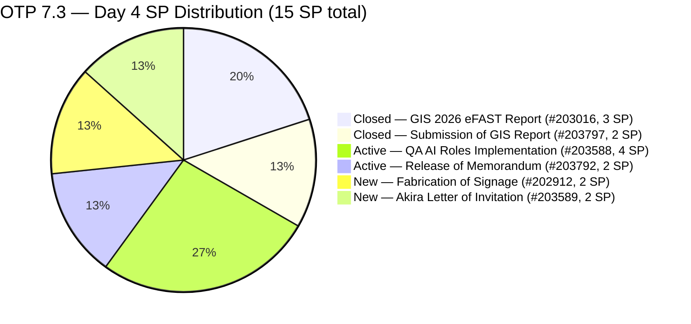
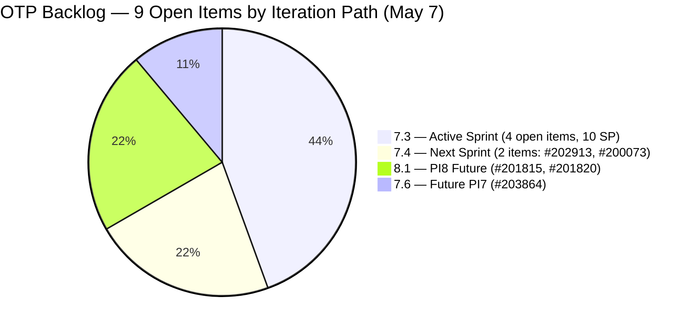
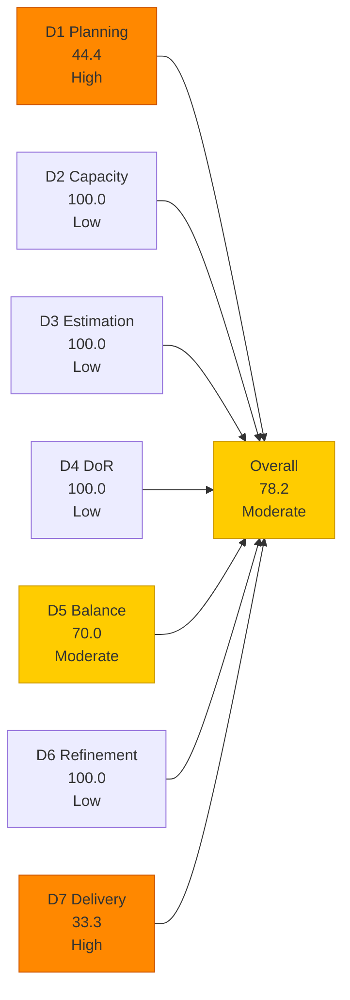
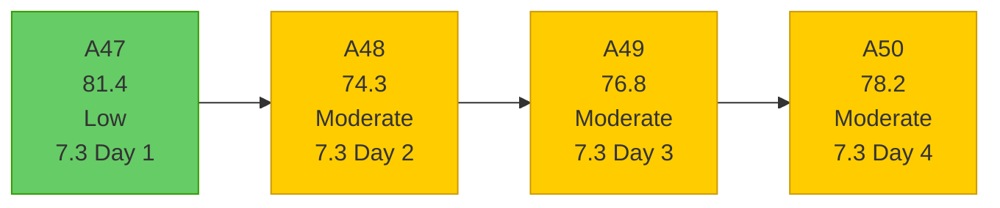

# OTP Team — SAFe Iteration Audit A50
**Date:** 2026-05-07 | **Sprint Day:** 4 of 14 | **Iteration:** 7.3 (May 4 – May 17, 2026)
**Auditor:** Claude Code (ADO SAFe Audit Skill v1) | **Prior Audit:** A49 (2026-05-06 09:06)

---

## 1. Audit Metadata

| Field | Value |
|---|---|
| **Audit ID** | A50 |
| **Report File** | `AUDIT_20260507_1611.md` |
| **Prior Audit** | A49 — `AUDIT_20260506_0906.md` (Overall 76.8, Moderate — 7.3 Day 3) |
| **ADO Project** | OTP (`e7739905-28a3-4ae1-9173-7f6cd13b3494`) |
| **ADO Team** | OTP Team |
| **Iteration** | 7.3 (`86aab8f1-cd46-4fe6-a810-00fba59b46a3`) |
| **Iteration Dates** | May 4 – May 17, 2026 |
| **Sprint Day** | 4 of 14 |
| **Audit Date** | 2026-05-07 (PHT, UTC+8) |
| **Overall Score** | **78.2 — Moderate Risk** |
| **Risk Band** | Moderate (60–79.9) |
| **Visible Backlog Items** | 9 root items |
| **Iteration Items** | 6 root items in 7.3 (4 open + 2 Closed) |
| **Capacity Source** | `work_get_team_capacity` — Grace: 1.5 h/day (Documentation + Requirements) |
| **Project Exceptions Applied** | Single-assignee model (Grace) — D2 scored full |

---

## 2. Executive Summary

| Field | Value |
|---|---|
| **Overall Score** | 78.2 — Moderate Risk |
| **Score vs Prior (A49)** | 76.8 → 78.2 (**+1.4**) |
| **Sprint Day** | 4 of 14 |
| **Iteration** | 7.3 (May 4 – May 17, 2026) |
| **Items in Iteration** | 6 (4 open + 2 Closed) |
| **Committed SP** | 15 SP (6 items including 2 Closed) |
| **SP Closed** | 5 SP (#203016 on Day 2, #203797 on Day 3) |
| **Risk Band** | Moderate (60–79.9) |

**Key change from A49:** A previously unknown item — **#203797 (Submission of GIS Report, 2 SP, User Story)** — was added and closed by Grace on May 6 (Day 3). This item was not visible in yesterday's backlog API response (it dropped off immediately upon closure), so A49 did not capture it. Discovery came via `wit_get_work_items_for_iteration` which returns the authoritative roster including closed items.

This single closure raises D7 from 23.1 to 33.3 (5 SP of 15 SP committed) and drives the overall score from 76.8 to 78.2 — **now 1.8 points from the Low Risk boundary (80.0)**.

The sprint scope increased: the full 7.3 committed set is now 6 items (15 SP), not the 5 items (13 SP) reported in A49. Two of the six items are closed (5 SP), four remain open (10 SP).

**Day-4 delivery stall:** No new closures occurred between A49 (May 6 morning) and this audit (May 7). The 4 open items (#203588, #203792, #202912, #203589) remain in their states from Day 3. Grace's A49 Day-5 target of D7=38.5 requires closing one more item today.

---

## 3. Previous Audit Delta (A49 → A50)

| Dimension | A49 Score | A50 Score | Delta | Driver |
|---|---|---|---|---|
| D1 Iteration Planning | 44.4 | 44.4 | = | 4 open in 7.3 / 9 visible backlog — unchanged |
| D2 Team Capacity | 100.0 | 100.0 | = | Grace: 1.5 h/day confirmed; single-assignee exception |
| D3 Estimation | 100.0 | 100.0 | = | All 4 open items estimated (10 SP); #203797 was estimated before closure |
| D4 DoR Compliance | 100.0 | 100.0 | = | All 4 open items pass desc ≥30 + AC ≥20 |
| D5 Work Item Balance | 70.0 | 70.0 | = | All items User Story; -30 dominant-type penalty persists |
| D6 Backlog Refinement | 100.0 | 100.0 | = | All 9 backlog items fresh; 0 untouched current items |
| D7 Delivery Predictability | 23.1 | 33.3 | **+10.2** | #203797 Closed May 6 (2 SP); total 5 SP / 15 SP committed |
| **Overall** | **76.8** | **78.2** | **+1.4** | D7 improvement from hidden Day-3 closure (#203797) |

### Key Events (A49 → A50)

| Event | Item | Impact |
|---|---|---|
| #203797 CLOSED May 6 | Submission of GIS Report (2 SP) | D7: 23.1→33.3; +2 SP closed; sprint total revised to 15 SP committed |
| #203797 added & closed same day | New item not visible in A49 backlog | Iteration roster now 6 items (was 5 in A49); committed SP 15 (was 13) |
| No new closures May 7 | 4 open items unchanged | D7 stall at 33.3 since Day 3 close; Day-5 target 38.5+ still achievable |

---

## 4. Current Iteration Snapshot

**Iteration:** 7.3 | **Period:** May 4 – May 17, 2026 | **Sprint Day:** 4 of 14

| Metric | Value |
|---|---|
| Full 7.3 iteration root items | 6 (#202912, #203016, #203588, #203589, #203792, #203797) |
| Open items in 7.3 (backlog view) | 4 (#202912, #203588, #203589, #203792) |
| Visible backlog root items | 9 |
| Committed story points | 15 SP (all 6 items estimated) |
| SP Closed | 5 SP (#203016 = 3, #203797 = 2) |
| SP Active/Open | 10 SP (4 items) |
| Delivery % | 33.3% (5/15 SP) |
| Assignee | Grace (sole; single-assignee model) |
| Daily capacity | 1.5 h/day (Documentation + Requirements) |

### Backlog Distribution by Iteration

---

## 5. Work Item Analysis

### 7.3 Full Iteration Roster (6 items)

| ID | Title | Type | State | SP | Assignee | DoR | ChangedDate | Notes |
|---|---|---|---|---|---|---|---|---|
| #203016 | Generate and Validate GIS 2026 Report for eFAST Submission | User Story | **Closed** | 3 | Grace | ✅ | May 5 | Closed Day 2 — 3 SP credited |
| #203797 | Submission of GIS Report | User Story | **Closed** | 2 | Grace | ✅ | May 6 | **Closed Day 3** — new item; not visible in A49; 2 SP credited |
| #203588 | Implementation of QA AI Roles | User Story | Active | 4 | Grace | ✅ | May 5 | Active Day 4 — AI QA framework |
| #203792 | Release of Memorandum | User Story | Active | 2 | Grace | ✅ | May 5 | Active Day 4 — QAA AI memo |
| #202912 | Fabrication of Signage | User Story | New | 2 | Grace | ✅ | May 4 | Not started — safety measures |
| #203589 | Akira to provide signed Letter of Invitation | User Story | New | 2 | Grace | ✅ | May 4 | External dependency — Akira/Japan Embassy |

### Open Items DoR Verification

| ID | Desc chars (est.) | AC chars (est.) | Pass/Fail |
|---|---|---|---|
| #203588 | ~250+ chars | ~500+ chars (4 detailed AC) | ✅ |
| #203792 | ~400+ chars | ~300+ chars (4 AC) | ✅ |
| #202912 | ~87 chars | ~37 chars (2 AC items) | ✅ |
| #203589 | ~141 chars | ~46 chars | ✅ |

All 4 open items pass DoR. D4 = 100.0.

### Backlog Items Outside 7.3 (reference)

| ID | Title | Type | State | SP | Iter | Notes |
|---|---|---|---|---|---|---|
| #202913 | Installation of Street Signage | User Story | Active | 2 | 7.4 | Moved from 7.3 Day 1; appears in iteration roster (ADO quirk) but IterationPath = 7.4 |
| #200073 | Notification & Due Process (Legal Phase) | User Story | New | 2 | 7.4 | Legal compliance; PI7 future |
| #201815 | Physical Installation & Grid Integration | User Story | New | 2 | 8.1 | Solar panel install; PI8 |
| #201820 | Monitoring & Handover | User Story | New | 2 | 8.1 | Solar monitoring; PI8 |
| #203864 | Release of TCT | User Story | New | 2 | 7.6 | Land title transfer; PI7 future |

---

## 6. SAFe Compliance Scorecard

| Dimension | Score | Band | Formula | Evidence |
|---|---|---|---|---|
| D1 Iteration Planning | 44.4 | High | 4/9 × 100 | 4 open items in 7.3 / 9 visible root backlog items |
| D2 Team Capacity | 100.0 | Low | 1/1 × 100 | Grace: 1.5 h/day capacity; single-assignee exception |
| D3 Estimation | 100.0 | Low | 4/4 × 100 | All 4 open items estimated; 2+4+2+2=10 SP |
| D4 DoR Compliance | 100.0 | Low | 4/4 × 100 | All 4 open items pass desc ≥30 + AC ≥20 |
| D5 Work Item Balance | 70.0 | Moderate | 100 − 30 | All 4 open items User Story (100%); dominant-type >60% → −30 |
| D6 Backlog Refinement | 100.0 | Low | 9/9 fresh; 0 penalties | All backlog items fresh (within 45 days); 0 untouched current items |
| D7 Delivery Predictability | 33.3 | High | 5/15 × 100 | 5 SP closed (2 items: #203016 + #203797) of 15 SP committed (6-item full roster) |
| **Overall** | **78.2** | **Moderate** | 547.7 / 7 | Average of 7 dimensions |

### Scoring Detail

- **D1:** round(4/9 × 100, 1) = **44.4** *(4 open items with 7.3 IterationPath / 9 visible root backlog items; 2 closed items excluded from backlog view)*
- **D2:** round(1/1 × 100, 1) = **100.0** *(Grace sole assignee; 1.5 h/day confirmed from capacity API; single-assignee project exception)*
- **D3:** round(4/4 × 100, 1) = **100.0** *(all 4 open current items estimated: #202912=2, #203588=4, #203589=2, #203792=2 = 10 SP)*
- **D4:** round(4/4 × 100, 1) = **100.0** *(all 4 open items pass description ≥30 + AC ≥20 chars)*
- **D5:** All 4 open items are User Story (100% > 60% dominant-type threshold) → −30; no absent-US penalty; no spike penalty = **70.0**
- **D6:** base=round(9/9×100,1)=100.0; stale_90=0/9=0%; stale_180=0; untouched_current: all 4 open items changed May 4–5 ≥ iteration start → 0 → **100.0**
- **D7:** Full 7.3 roster (6 items, 15 SP committed). Closed: #203016(3)+#203797(2)=5 SP. round(5/15 × 100, 1) = **33.3** *(Day 4 — early-sprint annotation)*
- **Overall:** (44.4+100.0+100.0+100.0+70.0+100.0+33.3) / 7 = 547.7 / 7 = **78.2**

**Population note (D7):** `committed_story_points` uses the full 7.3 iteration roster (all 6 items with SP, including 2 Closed). Closed items are excluded from the visible backlog view but are part of the committed sprint scope. This convention was established in A49 and is maintained for consistency.

### D7 Trajectory for 7.3 (15 SP committed)

| Day | SP Closed | D7 | Overall | Notes |
|---|---|---|---|---|
| Day 2 (May 5) | 3 | 20.0 | 76.3 | #203016 Closed |
| Day 3 (May 6) | 5 | 33.3 | 78.2 | #203797 Closed (hidden; found via iteration roster) |
| Day 4 (today) | 5 | 33.3 | 78.2 | No new closures |
| Day 5 target | 7 | 46.7 | 79.5 | Target: one Active item (#203588 or #203792) closed |
| Day 7 target | 9 | 60.0 | 81.2 | Target: 2nd Active item closed |
| Day 10 target | 13 | 86.7 | 86.2 | Target: 4 of 6 items Closed |
| Day 14 target | 15 | 100.0 | 90.6 | Sprint close with full delivery |

---

## 7. Dimension Findings

### D1 — Iteration Planning: 44.4 (High Risk)

**Formula:** `current_iteration_root_items / visible_root_backlog_items × 100 = 4/9 × 100 = 44.4`

Unchanged from A49. The 9-item visible backlog distributes across four distinct iteration paths (7.3: 4 open, 7.4: 2, 7.6: 1, 8.1: 2). The D1 ceiling at 44.4 reflects a correctly staged multi-sprint backlog — items in 7.4, 7.6, and 8.1 represent appropriate future commitments, not planning failures.

To reach Low Risk (≥80.0) on D1, 8+ of 9 items would need to be in 7.3 — not achievable while maintaining pipeline hygiene. D1 is a structural band constraint for OTP's current backlog size.

**Note on #202913 (Street Signage):** This item has IterationPath=7.4 but still appears in the 7.3 iteration roster (ADO quirk from sprint re-assignment on Day 1). It is correctly excluded from `current_iteration_root_items` (which is filtered by IterationPath, not iteration roster membership). It has been counted in the 7.4 path of the visible backlog since Day 2.

### D2 — Team Capacity: 100.0 (Low Risk)

Grace: 1.5 h/day (1.0 Documentation + 0.5 Requirements), no days off. Single-assignee project exception in force. D2 = 100.0.

Sprint horizon check: 1.5 h/day × 11 remaining days = 16.5 effective hours. With 10 SP remaining across 4 open items, the per-SP effort ratio is ~1.65 h/SP. Items are largely coordination/administrative in nature — this ratio is plausible for OTP's work type.

### D3 — Estimation: 100.0 (Low Risk)

All 4 open current items are estimated (#202912=2, #203588=4, #203589=2, #203792=2). D3 = 100.0. Consistent across A46–A50.

### D4 — DoR Compliance: 100.0 (Low Risk)

All 4 open items pass DoR thresholds (description ≥30 non-whitespace chars, AC ≥20 non-whitespace chars). No new items were added to 7.3 today. D4 = 100.0. Consistent since A48.

### D5 — Work Item Balance: 70.0 (Moderate Risk)

All 4 open items are User Stories (100% = dominant type > 60% threshold → −30 penalty). This is OTP's persistent structural constraint. The -30 penalty applies every sprint as long as all items are User Stories. D5 = 70.0.

**Path to removal:** Adding one Enabler or Spike item to the sprint would reduce the dominant-type share below 60% and eliminate the penalty (D5 → 100.0, Overall → +4.3 to ~82.5). Even a small Enabler (e.g., "ADO backlog cleanup", "PI8 readiness assessment") would achieve this.

### D6 — Backlog Refinement: 100.0 (Low Risk)

All 9 visible backlog items are fresh (most-recent change: #203864 changed May 6; oldest: #200073 changed Apr 20 — both within 45-day window). Zero stale_90 or stale_180 items. All 4 current iteration items changed on May 4 or May 5 (≥ iteration start date). D6 = 100.0 for the 2nd consecutive audit.

### D7 — Delivery Predictability: 33.3 (High Risk — Early Sprint)

**Formula:** `closed_story_points / committed_story_points × 100 = 5/15 × 100 = 33.3`

**Day 4 early-sprint annotation.** This is the first audit where D7 exits the Critical band (< 40 requires < 6 SP closed; we now have 5 SP closed but 15 SP total → 33.3 = High Risk). D7 is now in the High Risk band, still annotated as early-sprint.

**Hidden closure discovery:** #203797 (Submission of GIS Report) was added and closed by Grace on Day 3 (May 6, 09:09 UTC). It did not appear in the A49 backlog API response because it was already Closed when queried. The `wit_get_work_items_for_iteration` call in this audit (A50) revealed it. This restated the committed SP total from 13 to 15 SP, the closed SP total from 3 to 5 SP, and improved D7 from 23.1 to 33.3 — a net gain of +10.2 on D7 and +1.4 on the overall score.

**Logical sequence note:** #203016 (Generate GIS Report) was closed Day 2, and #203797 (Submit GIS Report) was closed Day 3. Grace executed the generate-then-submit sequence across two days — a textbook SAFe-compliant delivery pattern for sequential items.

**No-closure stall on Day 4:** None of the 4 remaining open items changed state on May 7. Items #203588 (Active, 4 SP) and #203792 (Active, 2 SP) have been in Active state since May 5. The Day-5 D7 target of 46.7% (7 SP / 15 SP) requires one of these two to close by tomorrow.

---

## 8. Risks and Bottlenecks

| # | Risk | Severity | Dimension | Detail |
|---|---|---|---|---|
| R1 | D1 = 44.4 — structural High Risk | High | D1 | 4/9 open items in 7.3; structural ceiling while maintaining healthy staged backlog; future items correctly placed in 7.4, 7.6, 8.1 |
| R2 | D5 = 70.0 — structural -30 penalty | Moderate | D5 | All items User Story (100%); persistent across all sprints; one Enabler item resolves |
| R3 | Day-4 delivery stall — no closures May 7 | Moderate | D7 | #203588 (4 SP, Active) and #203792 (2 SP, Active) unchanged since Day 3; Day-5 target (46.7%) requires one closure today |
| R4 | #203589 (Visa letter) — external dependency on Akira | Moderate | D7 | Item requires third-party signature from sponsoring company; cannot be internally resolved; embassy deadline risk if May 17 is relevant |
| R5 | #202912 (Fabrication of Signage) — not started Day 4 | Moderate | D7 | New state on Day 4; physical fabrication may require procurement time within sprint window |
| R6 | Grace capacity 1.5 h/day vs. 10 SP remaining | Low | D7 | 16.5 remaining hours / 10 SP = 1.65 h/SP; feasible for admin/coordination items; monitor if items have field-work components |
| R7 | #203797 closure pattern — audit detection gap | Low | Evidence | Item added and closed on same day; dropped from backlog before next audit; mitigated by using `wit_get_work_items_for_iteration` going forward |

---

## 9. Prioritized Recommendations

1. **[HIGH — D7, Today — Day 4]** Close #203588 (Implementation of QA AI Roles, 4 SP) or #203792 (Release of Memorandum, 2 SP). Both are Active since Day 3 — momentum is established. A single closure of either item pushes D7 from 33.3 to 40.0 or 46.7, moving the sprint into the D7 Moderate band. If #203792 (smaller, memo-format) can be approved and distributed today, it is the faster path.

2. **[HIGH — D7, Today — Day 4]** Verify #203589 (Akira Letter of Invitation) has no imminent embassy submission deadline within the current sprint. External-dependency items carry date-triggered risk. If a deadline exists before May 17, escalate to Akira sponsor contact immediately.

3. **[MEDIUM — D7, Days 4–7]** Begin physical work on #202912 (Fabrication of Signage, New). Day 4 without a state change on this item means no visible progress. If fabrication requires procurement or vendor coordination, initiate that process today.

4. **[MEDIUM — D5, Sprint Planning]** Add one Enabler or Spike to the next sprint (or to the remaining 7.3 scope if workable). A single non-User-Story item reduces D5 from 70.0 to 100.0, adding +4.3 to the overall score. Candidate: "PI8 readiness assessment for OTP backlog" or "ADO sprint retrospective setup".

5. **[LOW — Audit Practice, Ongoing]** Use `wit_get_work_items_for_iteration` alongside `wit_list_backlog_work_items` on every OTP audit. Items that are added and closed within a single day (like #203797) disappear from the backlog API but remain in the iteration roster. This prevents hidden-closure audit gaps.

---

## 10. Evidence Gaps and Limitations

| Gap | Impact | Mitigation |
|---|---|---|
| #203016 and #203797 dropped from backlog API (Closed state) | D1 denominator is 9 (open items only); D7 committed SP uses full 6-item roster from `wit_get_work_items_for_iteration` | Standard ADO behavior; both items confirmed via direct ID query; included in committed_SP population |
| #203797 not visible in A49 | Prior audit reported 13 SP committed / 3 SP closed; A50 revises to 15 SP committed / 5 SP closed | Resolved by using `wit_get_work_items_for_iteration` as primary iteration roster source; A49 scores were conservative understatements |
| #202913 IterationPath mismatch | Item in iteration roster (via `wit_get_work_items_for_iteration`) but IterationPath = 7.4; excluded from current_iteration_root_items per IterationPath filter | Consistent with A48/A49 treatment; item correctly staged in 7.4 |

---

## 11. Score Trend — OTP Iteration 7.3

### Path to Low Risk (80.0 target) — 1.8 points needed

| Action | Dimension | Score Impact | New Overall |
|---|---|---|---|
| Close #203792 (2 SP) | D7: 33.3 → 46.7 | +1.9 | 80.1 ✅ Low Risk |
| Close #203588 (4 SP) | D7: 33.3 → 53.3 | +2.9 | 81.1 ✅ Low Risk |
| Add 1 Enabler item to 7.3 | D5: 70.0 → 100.0 | +4.3 | 82.5 ✅ Low Risk |
| **Combination: close any item + Enabler** | D5+D7 | **+6.2+** | **84.4+ ✅** |

**Fastest path to Low Risk:** Close #203792 (Release of Memorandum, 2 SP) today. This single action raises the overall from 78.2 to 80.1 — crossing the Low Risk threshold by 0.1 points.

---

*Audit produced by Claude Code — ADO SAFe Audit Skill v1. SAFe 6.0 framework. Sprint Day 4 of 14. Key finding: #203797 (Submission of GIS Report, 2 SP) was closed on Day 3 but not captured by A49 (dropped from backlog before query). Discovered via `wit_get_work_items_for_iteration`. D7 revised from 23.1 (A49 undercount) to 33.3; overall revised from 76.8 to 78.2. OTP is 1.8 points from Low Risk — closing #203792 today is the minimum action needed to cross 80.0.*
