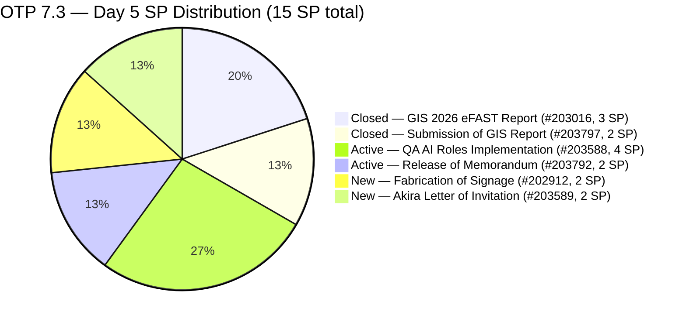
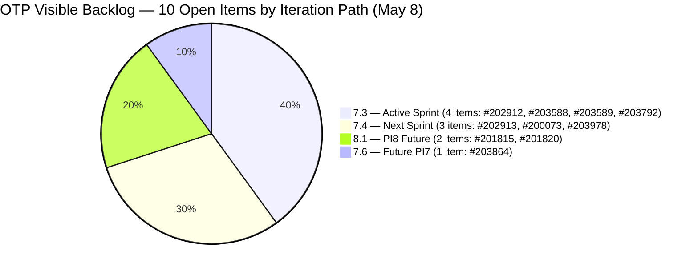
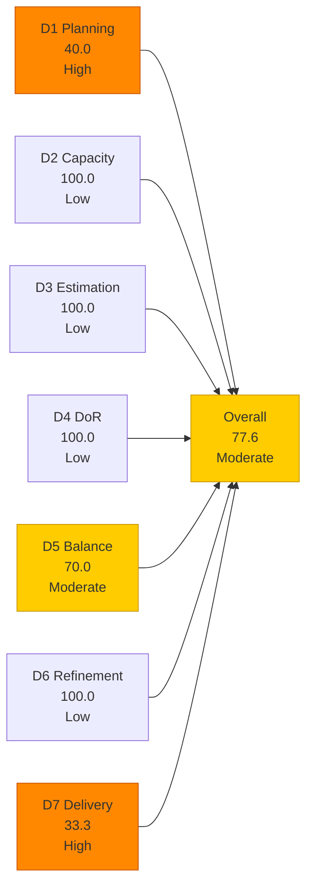
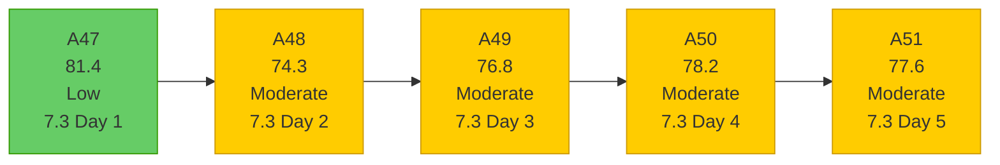

# OTP Team — SAFe Iteration Audit A51
**Date:** 2026-05-08 | **Sprint Day:** 5 of 14 | **Iteration:** 7.3 (May 4 – May 17, 2026)
**Auditor:** Claude Code (ADO SAFe Audit Skill v1) | **Prior Audit:** A50 (2026-05-07 16:11)

---

## 1. Audit Metadata

| Field | Value |
|---|---|
| **Audit ID** | A51 |
| **Report File** | `AUDIT_20260508_0203.md` |
| **Prior Audit** | A50 — `AUDIT_20260507_1611.md` (Overall 78.2, Moderate — 7.3 Day 4) |
| **ADO Project** | OTP (`e7739905-28a3-4ae1-9173-7f6cd13b3494`) |
| **ADO Team** | OTP Team |
| **Iteration** | 7.3 (`86aab8f1-cd46-4fe6-a810-00fba59b46a3`) |
| **Iteration Dates** | May 4 – May 17, 2026 |
| **Sprint Day** | 5 of 14 |
| **Audit Date** | 2026-05-08 (PHT, UTC+8) |
| **Overall Score** | **77.6 — Moderate Risk** |
| **Risk Band** | Moderate (60–79.9) |
| **Visible Backlog Items** | 10 root items |
| **Current Iteration Open Items** | 4 (IterationPath = 7.3) |
| **Full 7.3 Roster** | 6 root items (4 open + 2 Closed) |
| **Capacity Source** | `work_get_team_capacity` — Grace: 1.5 h/day (Documentation + Requirements) |
| **Project Exceptions Applied** | Single-assignee model (Grace) — D2 scored full |

---

## 2. Executive Summary

| Field | Value |
|---|---|
| **Overall Score** | 77.6 — Moderate Risk |
| **Score vs Prior (A50)** | 78.2 → 77.6 (**−0.6**) |
| **Sprint Day** | 5 of 14 |
| **Iteration** | 7.3 (May 4 – May 17, 2026) |
| **Open Items in 7.3** | 4 (#202912, #203588, #203589, #203792) |
| **Committed SP** | 15 SP (6-item full 7.3 roster) |
| **SP Closed** | 5 SP (#203016 = 3, #203797 = 2) |
| **Risk Band** | Moderate (60–79.9) |

**Score declined 0.6 points from A50.** The sole driver is D1: a new item (#203978 — FTC Approval from SEC of GIS 2026 Report, 1 SP) was added to the visible backlog with IterationPath=7.4. This expanded the visible denominator from 9 to 10, dropping D1 from 44.4 (4/9) to 40.0 (4/10).

**No new closures on Day 5.** The 4 open items (#202912, #203588, #203589, #203792) remain in unchanged states from Day 4. Grace's A50 Day-5 target of one closure and D7 improvement was not met overnight.

**Critical action needed today:** Closing either #203792 (Release of Memorandum, 2 SP) or #203588 (Implementation of QA AI Roles, 4 SP) would push D7 from 33.3 to 46.7 or 53.3, and the overall from 77.6 to 79.5 or 80.5 — crossing into Low Risk territory. The sprint is at Day 5 of 14 with 9 working days remaining.

---

## 3. Previous Audit Delta (A50 → A51)

| Dimension | A50 Score | A51 Score | Delta | Driver |
|---|---|---|---|---|
| D1 Iteration Planning | 44.4 | 40.0 | **−4.4** | New item #203978 added to backlog (7.4 path); visible count 9 → 10; current stays at 4 |
| D2 Team Capacity | 100.0 | 100.0 | = | Grace: 1.5 h/day; single-assignee exception unchanged |
| D3 Estimation | 100.0 | 100.0 | = | All 4 open items remain estimated (10 SP) |
| D4 DoR Compliance | 100.0 | 100.0 | = | All 4 open items pass DoR thresholds |
| D5 Work Item Balance | 70.0 | 70.0 | = | All 4 items User Story; dominant-type penalty persists |
| D6 Backlog Refinement | 100.0 | 100.0 | = | All 10 backlog items fresh; #203978 added May 7 (within 45 days) |
| D7 Delivery Predictability | 33.3 | 33.3 | = | No new closures on Day 5; 5 SP / 15 SP committed unchanged |
| **Overall** | **78.2** | **77.6** | **−0.6** | D1 denominator expansion from new backlog item |

### Key Events (A50 → A51)

| Event | Item | Impact |
|---|---|---|
| #203978 added to backlog | FTC Approval from SEC (1 SP, IterationPath=7.4) | D1: 44.4 → 40.0; visible backlog 9 → 10 |
| No closures May 8 (overnight) | 4 open items unchanged | D7 stall continues at 33.3 (Day 3 was last closure) |

---

## 4. Current Iteration Snapshot

**Iteration:** 7.3 | **Period:** May 4 – May 17, 2026 | **Sprint Day:** 5 of 14

| Metric | Value |
|---|---|
| Full 7.3 iteration root items | 6 (#202912, #203016, #203588, #203589, #203792, #203797) |
| Open items in 7.3 (backlog view, IterationPath=7.3) | 4 (#202912, #203588, #203589, #203792) |
| Visible backlog root items | 10 |
| Committed story points | 15 SP (6 items including 2 Closed) |
| SP Closed | 5 SP (#203016 = 3, #203797 = 2) |
| SP Active/Open | 10 SP (4 items) |
| Delivery % | 33.3% (5/15 SP) |
| Assignee | Grace (sole; single-assignee model) |
| Daily capacity | 1.5 h/day (Documentation + Requirements) |
| Days remaining | 9 working days |

### Backlog Distribution by Iteration Path (10 visible items)

---

## 5. Work Item Analysis

### 7.3 Full Iteration Roster (6 items)

| ID | Title | Type | State | SP | Assignee | DoR | ChangedDate | Notes |
|---|---|---|---|---|---|---|---|---|
| #203016 | Generate and Validate GIS 2026 Report for eFAST Submission | User Story | **Closed** | 3 | Grace | ✅ | May 5 | Closed Day 2 — 3 SP credited |
| #203797 | Submission of GIS Report | User Story | **Closed** | 2 | Grace | ✅ | May 6 | Closed Day 3 — 2 SP credited |
| #203588 | Implementation of QA AI Roles | User Story | Active | 4 | Grace | ✅ | May 5 | Active Day 5 — AI QA framework |
| #203792 | Release of Memorandum | User Story | Active | 2 | Grace | ✅ | May 5 | Active Day 5 — QAA AI memo |
| #202912 | Fabrication of Signage | User Story | New | 2 | Grace | ✅ | May 4 | Not started — physical work |
| #203589 | Akira to provide signed Letter of Invitation | User Story | New | 2 | Grace | ✅ | May 4 | External dependency — Akira/Japan Embassy |

### DoR Verification — Open Items (4 items)

| ID | Description (chars est.) | AC (chars est.) | Pass/Fail |
|---|---|---|---|
| #203588 | ~250+ | ~500+ (4 detailed AC items) | ✅ |
| #203792 | ~400+ | ~300+ (4 AC items) | ✅ |
| #202912 | ~90 chars | ~45 chars | ✅ |
| #203589 | ~141 chars | ~46 chars | ✅ |

All 4 open items pass DoR. D4 = 100.0. Unchanged since A48.

### New Backlog Item (#203978)

| Field | Value |
|---|---|
| **ID** | #203978 |
| **Title** | FTC Approval from SEC of GIS 2026 Report |
| **Type** | User Story |
| **State** | New |
| **SP** | 1 |
| **Assignee** | Grace |
| **IterationPath** | 7.4 |
| **ChangedDate** | May 7, 2026 |
| **DoR** | ✅ (desc + AC present) |
| **Notes** | SEC compliance item; correctly staged in 7.4; expands visible backlog to 10 |

---

## 6. SAFe Compliance Scorecard

| Dimension | Score | Band | Formula | Evidence |
|---|---|---|---|---|
| D1 Iteration Planning | 40.0 | High | 4/10 × 100 | 4 open items with 7.3 IterationPath / 10 visible root backlog items |
| D2 Team Capacity | 100.0 | Low | 1/1 × 100 | Grace: 1.5 h/day; single-assignee project exception |
| D3 Estimation | 100.0 | Low | 4/4 × 100 | All 4 open items estimated: #202912=2, #203588=4, #203589=2, #203792=2 = 10 SP |
| D4 DoR Compliance | 100.0 | Low | 4/4 × 100 | All 4 open items pass desc ≥30 + AC ≥20 chars |
| D5 Work Item Balance | 70.0 | Moderate | 100 − 30 | All 4 items User Story (100% > 60% dominant threshold) → −30 |
| D6 Backlog Refinement | 100.0 | Low | 10/10 fresh; 0 penalties | All 10 items changed within 45 days; 0 untouched current items |
| D7 Delivery Predictability | 33.3 | High | 5/15 × 100 | 5 SP closed / 15 SP committed; no new closures Day 5 |
| **Overall** | **77.6** | **Moderate** | 543.3 / 7 | Average of 7 dimensions |

### Scoring Detail

- **D1:** round(4/10 × 100, 1) = **40.0** *(4 open items with IterationPath=7.3 / 10 visible root backlog items; new item #203978 added May 7 with 7.4 path expands denominator)*
- **D2:** round(1/1 × 100, 1) = **100.0** *(Grace sole assignee with 1.5 h/day confirmed capacity; single-assignee project exception applied)*
- **D3:** round(4/4 × 100, 1) = **100.0** *(all 4 open current items estimated: 2+4+2+2=10 SP)*
- **D4:** round(4/4 × 100, 1) = **100.0** *(all 4 open items pass description ≥30 + AC ≥20 non-whitespace chars)*
- **D5:** All 4 open items are User Story (100% > 60% dominant-type threshold) → −30; no absent-US penalty; no spike penalty = **70.0**
- **D6:** base=round(10/10×100,1)=100.0; stale_90=0/10=0%; stale_180=0; untouched_current: all 4 open items changed ≥ May 4 → 0 → **100.0**
- **D7:** Full 7.3 roster 6 items, 15 SP committed. Closed: #203016(3)+#203797(2)=5 SP. round(5/15 × 100, 1) = **33.3** *(Day 5 — delivery stall since Day 3)*
- **Overall:** (40.0+100.0+100.0+100.0+70.0+100.0+33.3) / 7 = 543.3 / 7 = **77.6**

---

## 7. Dimension Findings

### D1 — Iteration Planning: 40.0 (High Risk)

**Formula:** `current_iteration_root_items / visible_root_backlog_items × 100 = 4/10 × 100 = 40.0`

D1 declined from 44.4 (A50) to 40.0 this audit. Item #203978 (FTC Approval from SEC of GIS 2026 Report, 1 SP, User Story) was added to the visible backlog on May 7 with IterationPath=7.4. This increased the denominator from 9 to 10 while the numerator (4 open items in 7.3) remains unchanged.

The visible backlog now spans 4 distinct iteration paths: 7.3 (4 items), 7.4 (3 items: #202913, #200073, #203978), 7.6 (1 item), and 8.1 (2 items). All future-path items represent correctly staged pipeline work.

To reach Low Risk (≥80.0) on D1 alone is not achievable without collapsing the multi-sprint pipeline. D1 remains a structural constraint for OTP's current backlog structure.

**#202913 note:** This item (Installation of Street Signage, IterationPath=7.4) continues to appear in the `wit_get_work_items_for_iteration` roster. Excluded from `current_iteration_root_items` per IterationPath filter — consistent with A48–A50 treatment.

### D2 — Team Capacity: 100.0 (Low Risk)

Grace: 1.5 h/day (1.0 Documentation + 0.5 Requirements), no days off. Single-assignee project exception in force. D2 = 100.0.

Remaining sprint bandwidth: 1.5 h/day × 9 remaining days = 13.5 effective hours. With 10 SP remaining across 4 open items, the per-SP ratio is ~1.35 h/SP — tighter than Day 4 (1.65 h/SP) due to shrinking runway. The administrative/coordination nature of OTP work makes this feasible, but external dependencies (#203589) may consume overhead outside this capacity window.

### D3 — Estimation: 100.0 (Low Risk)

All 4 open current items estimated (#202912=2, #203588=4, #203589=2, #203792=2). D3 = 100.0. Consistent across A46–A51.

### D4 — DoR Compliance: 100.0 (Low Risk)

All 4 open items pass DoR thresholds. D4 = 100.0. No changes from A50.

### D5 — Work Item Balance: 70.0 (Moderate Risk)

All 4 open sprint items are User Stories (100%). Dominant-type threshold >60% triggers −30 penalty. D5 = 70.0. Persistent structural constraint across all OTP sprints.

**Fastest resolution:** One non-User-Story item (Enabler, Spike, or Task) in the current sprint removes the -30 penalty. D5 → 100.0 adds +4.3 to the overall. Candidate: "OTP Sprint Retrospective Setup Enabler" or "PI8 Backlog Readiness Spike" (small, 1 SP, added to 7.3 scope).

### D6 — Backlog Refinement: 100.0 (Low Risk)

All 10 visible backlog items are fresh. The oldest item is #200073 (changed Apr 20, 18 days ago). The newest is #203978 (changed May 7, yesterday). Zero stale_90 or stale_180 items. All 4 current iteration open items were last changed May 4–5 — within or after iteration start. D6 = 100.0.

### D7 — Delivery Predictability: 33.3 (High Risk — Delivery Stall)

**Formula:** `closed_story_points / committed_story_points × 100 = 5/15 × 100 = 33.3`

**Delivery stall: Day 3 was the last closure.** No new closures occurred on Day 4 (May 7) or Day 5 (May 8, confirmed via `wit_get_work_items_for_iteration` roster — #203016 and #203797 remain the only Closed items). The 4 open items show no state changes since Day 3.

The stall is now entering its third consecutive no-closure day:
- Day 3 (May 6): #203797 Closed (2 SP) — last closure event
- Day 4 (May 7): No closures
- Day 5 (May 8): No closures as of this audit

**Risk escalation:** With 9 working days remaining and 10 SP open, Grace needs to close ~1.1 SP/day to fully deliver. More importantly, to reach Low Risk by Day 7 (60.0 D7 requires 9 SP closed), two more items must close within the next 2 days.

| Target Day | SP Needed | D7 | Overall | Min Action |
|---|---|---|---|---|
| Day 6 (May 11) | 7 SP | 46.7 | 79.5 | Close #203792 (2 SP) |
| Day 7 (May 12) | 9 SP | 60.0 | 81.2 | Close #203588 (4 SP) additionally |
| Day 10 (May 14) | 13 SP | 86.7 | 86.2 | Close #202912 (2 SP) additionally |

---

## 8. Risks and Bottlenecks

| # | Risk | Severity | Dimension | Detail |
|---|---|---|---|---|
| R1 | 3-day delivery stall (Days 3–5) | High | D7 | No closures since Day 3 (May 6). Active items #203588 and #203792 have been in same state since Day 3. Day-6 target requires closing #203792 by May 11 to reach 46.7 D7 |
| R2 | D1 = 40.0 — new backlog item expanded denominator | High | D1 | #203978 added May 7 (7.4 path) brought visible count to 10; D1 now below 44.4 trend; further additions to non-7.3 paths will erode D1 further |
| R3 | D5 = 70.0 — structural penalty | Moderate | D5 | All 4 items User Story; persistent across all OTP sprints; single Enabler resolves |
| R4 | #203589 (Visa letter) — external dependency | Moderate | D7 | Requires signed letter from Akira (sponsoring company); no internal control over delivery; if embassy submission deadline falls before May 17, item may carry over |
| R5 | #202912 (Fabrication of Signage) — 5 days with no progress | Moderate | D7 | New state from Day 1 through Day 5; physical fabrication likely requires procurement or vendor coordination — no evidence of initiation |
| R6 | Grace capacity shrinking — 13.5 hrs remain | Moderate | D7 | 10 SP remaining; ~1.35 h/SP at current pace; feasible only if items have no unexpected field work; R4 and R5 risk hours not captured in capacity |
| R7 | D1 structural floor — 40% | Low | D1 | With 10 visible items and only 4 in 7.3, D1 floor is established; adding more future-path items will continue to dilute D1 |

---

## 9. Prioritized Recommendations

1. **[CRITICAL — D7, Today — Day 5]** Close #203792 (Release of Memorandum, 2 SP, Active). This is the fastest path to Low Risk: closing this single item raises D7 from 33.3 to 46.7 (+1.9 to overall), bringing the score to 79.5. With the three-day stall, today is the minimum viable day for this closure. The memorandum is approval-format work — if draft is complete, confirm distribution and close.

2. **[CRITICAL — D7, Days 5–6]** Close #203588 (Implementation of QA AI Roles, 4 SP, Active). This is the highest-SP item in the sprint. Combined with #203792 closure, D7 would reach 73.3 (11/15 SP), pushing the overall to 83.3 (Low Risk). Focus effort on completing the 4 AC checkboxes: tooling access, security clearance, baseline metrics, and integration.

3. **[HIGH — D7, Day 5]** Initiate physical action on #202912 (Fabrication of Signage, 2 SP). This item has been in New state for 5 days with no task children showing progress. If fabrication requires vendor coordination, initiate procurement request today. If the item is blocked by external contractor availability, update the state to Blocked and document the blocker.

4. **[HIGH — D7, Days 5–7]** Verify #203589 (Akira Letter of Invitation) status. Confirm whether Akira has been contacted, whether the invitation letter draft has been shared, and whether there is a Japan Embassy submission deadline within the sprint window (before May 17). If an external deadline exists, escalate to the responsible contact immediately.

5. **[MEDIUM — D5, Sprint Planning]** Add one Enabler or Spike to 7.3 scope. A single non-User-Story item reduces the dominant-type penalty (D5: 70.0 → 100.0, +4.3 to overall). Candidate: "OTP Retrospective Planning Enabler" (1 SP). This is a 5-minute ADO action that permanently removes the D5 penalty for this sprint.

6. **[LOW — Audit Practice, Ongoing]** Continue using `wit_get_work_items_for_iteration` alongside `wit_list_backlog_work_items` on every OTP audit to catch same-day add-and-close items (e.g., #203797 pattern). The full iteration roster is the authoritative committed scope source for D7.

---

## 10. Evidence Gaps and Limitations

| Gap | Impact | Mitigation |
|---|---|---|
| #203016 and #203797 dropped from backlog API (Closed state) | D1 denominator uses only 10 open items; D7 committed SP uses 15 (full 6-item roster from `wit_get_work_items_for_iteration`) | Standard ADO behavior; both confirmed via direct ID query; included in committed_SP |
| #202913 IterationPath mismatch (in iteration roster but 7.4 path) | Excluded from current_iteration_root_items (4 items, not 5) | Consistent with A48–A51 treatment; item correctly staged in 7.4 |
| No closure events between May 6 Day 3 and May 8 Day 5 | D7 stall — 3 consecutive days without progress | Confirmed via direct ID queries; no state changes detected on #203588, #203792, #202912, #203589 |

---

## 11. Score Trend — OTP Iteration 7.3

### Path to Low Risk (80.0 target) — 2.4 points needed

| Action | Dimension | Score Impact | New Overall |
|---|---|---|---|
| Close #203792 (2 SP) today | D7: 33.3 → 46.7 | +1.9 | 79.5 |
| Close #203588 (4 SP) | D7: 33.3 → 53.3 | +2.9 | 80.5 ✅ Low Risk |
| Add 1 Enabler to 7.3 | D5: 70.0 → 100.0 | +4.3 | 81.9 ✅ Low Risk |
| Close #203792 + Add Enabler | D5+D7 | +6.2 | 83.8 ✅ |
| **Close #203588 + Add Enabler** | D5+D7 | **+7.2** | **84.8 ✅** |

**Fastest path to Low Risk:** Close #203588 (Implementation of QA AI Roles, 4 SP) — a single closure raises the overall to 80.5, crossing the Low Risk boundary. Combined with one Enabler item added to 7.3, the team reaches 84.8 (well within Low Risk). The three-day delivery stall makes this recommendation urgent.

---

*Audit produced by Claude Code — ADO SAFe Audit Skill v1. SAFe 6.0 framework. Sprint Day 5 of 14. Key finding: Score declined 0.6 pts from A50 (78.2 → 77.6) due to new backlog item #203978 expanding D1 denominator to 10. No new closures on Days 4 or 5 — delivery stall at 5 SP / 15 SP (33.3%). Closing #203588 (4 SP) is the minimum action to cross 80.0 Low Risk. OTP is 2.4 points from Low Risk — the three-day stall makes today a critical delivery day.*
