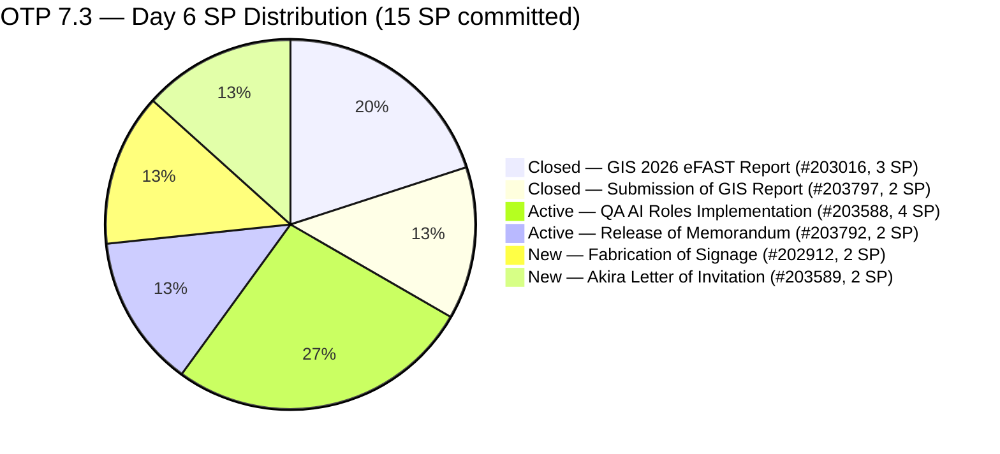
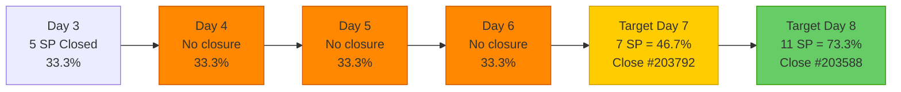
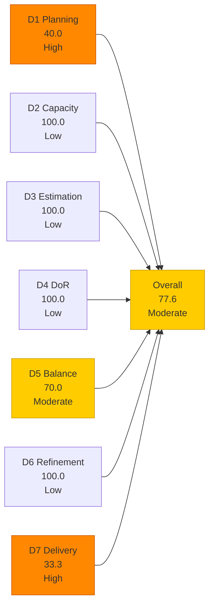
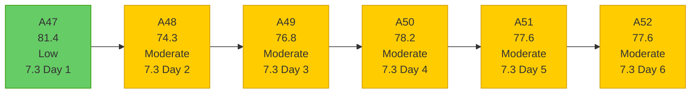

# OTP Team — SAFe Iteration Audit A52
**Date:** 2026-05-09 | **Sprint Day:** 6 of 14 | **Iteration:** 7.3 (May 4 – May 17, 2026)
**Auditor:** Claude Code (ADO SAFe Audit Skill v1) | **Prior Audit:** A51 (2026-05-08 02:03)

---

## 1. Audit Metadata

| Field | Value |
|---|---|
| **Audit ID** | A52 |
| **Report File** | `AUDIT_20260509_1703.md` |
| **Prior Audit** | A51 — `AUDIT_20260508_0203.md` (Overall 77.6, Moderate — 7.3 Day 5) |
| **ADO Project** | OTP (`e7739905-28a3-4ae1-9173-7f6cd13b3494`) |
| **ADO Team** | OTP Team |
| **Iteration** | 7.3 (`86aab8f1-cd46-4fe6-a810-00fba59b46a3`) |
| **Iteration Dates** | May 4 – May 17, 2026 |
| **Sprint Day** | 6 of 14 |
| **Audit Date** | 2026-05-09 17:03 PHT (UTC+8) |
| **Overall Score** | **77.6 — Moderate Risk** |
| **Risk Band** | Moderate (60–79.9) |
| **Visible Backlog Items** | 10 root items |
| **Current Iteration Open Items** | 4 (IterationPath = 7.3) |
| **Full 7.3 Roster** | 6 root items (4 open + 2 Closed) |
| **Capacity Source** | `work_get_team_capacity` — Grace: 1.5 h/day (Documentation 1.0 + Requirements 0.5) |
| **Project Exceptions Applied** | Single-assignee model (Grace) — D2 scored full |

---

## 2. Executive Summary

| Field | Value |
|---|---|
| **Overall Score** | 77.6 — Moderate Risk |
| **Score vs Prior (A51)** | 77.6 → 77.6 (**0.0 — flat**) |
| **Sprint Day** | 6 of 14 |
| **Iteration** | 7.3 (May 4 – May 17, 2026) |
| **Open Items in 7.3** | 4 (#202912, #203588, #203589, #203792) |
| **Committed SP** | 15 SP (6-item full 7.3 roster) |
| **SP Closed** | 5 SP (#203016 = 3, #203797 = 2) |
| **Risk Band** | Moderate (60–79.9) |

**Score is flat at 77.6 for Day 6.** No new closures occurred on Day 5 (May 8) or overnight into Day 6 (May 9). All four open items (#202912, #203588, #203589, #203792) remain in the same states as A50 (Day 4): Active, Active, New, New. This marks the **fourth consecutive day without a closure** — a deepening delivery stall since Day 3 (May 6).

**No backlog changes since A51.** The visible backlog remains at 10 items. Item #203978 (FTC Approval from SEC, 7.4 path) added May 7 is unchanged. No new items added.

**Critical context:** Today (Day 6) is the last day where a single item closure can realistically push the overall to 79.5 (Low Risk edge). Closing #203792 (2 SP) today would bring D7 to 46.7 and the overall to 79.5 — still within Moderate. Only closing #203588 (4 SP) would cross 80.0. With 8 working days remaining and 10 SP open, the burn rate needs to start today.

---

## 3. Previous Audit Delta (A51 → A52)

| Dimension | A51 Score | A52 Score | Delta | Driver |
|---|---|---|---|---|
| D1 Iteration Planning | 40.0 | 40.0 | = | No change: 4/10; backlog stable at 10 items |
| D2 Team Capacity | 100.0 | 100.0 | = | Grace: 1.5 h/day; single-assignee exception unchanged |
| D3 Estimation | 100.0 | 100.0 | = | All 4 open items estimated; no new items |
| D4 DoR Compliance | 100.0 | 100.0 | = | All 4 open items pass DoR; no new items |
| D5 Work Item Balance | 70.0 | 70.0 | = | All 4 User Story — structural penalty unchanged |
| D6 Backlog Refinement | 100.0 | 100.0 | = | All 10 items fresh; no stale items |
| D7 Delivery Predictability | 33.3 | 33.3 | = | No new closures Day 5 or Day 6; stall continues at 5/15 SP |
| **Overall** | **77.6** | **77.6** | **0.0** | All 7 dimensions unchanged |

### Key Events (A51 → A52)

| Event | Impact |
|---|---|
| No item closures (4th consecutive no-closure day, Days 3–6) | D7 stall persists at 33.3 (5/15 SP); sprint is 43% elapsed with 33% delivered |
| No new backlog items added | D1 stable at 40.0; visible backlog steady at 10 items |
| No state changes on open items | #203588, #203792 remain Active; #202912, #203589 remain New |

---

## 4. Current Iteration Snapshot

**Iteration:** 7.3 | **Period:** May 4 – May 17, 2026 | **Sprint Day:** 6 of 14

| Metric | Value |
|---|---|
| Full 7.3 iteration root items | 6 (#202912, #203016, #203588, #203589, #203792, #203797) |
| Open items in 7.3 (backlog view, IterationPath=7.3) | 4 (#202912, #203588, #203589, #203792) |
| Visible backlog root items | 10 |
| Committed story points | 15 SP |
| SP Closed | 5 SP (#203016 = 3, #203797 = 2) |
| SP Active/Open | 10 SP (4 items) |
| Delivery % | 33.3% (5/15 SP) |
| Assignee | Grace (sole; single-assignee model) |
| Daily capacity | 1.5 h/day (Documentation + Requirements) |
| Days remaining | 8 working days |

### Sprint Burn Rate Analysis

### Backlog Path Breakdown (10 visible items)

| IterationPath | Count | Items |
|---|---|---|
| 7.3 (current, open) | 4 | #202912, #203588, #203589, #203792 |
| 7.4 (next sprint) | 3 | #202913, #200073, #203978 |
| 7.6 (future PI7) | 1 | #203864 |
| 8.1 (PI8) | 2 | #201815, #201820 |

---

## 5. Work Item Analysis

### 7.3 Full Iteration Roster (6 items)

| ID | Title | Type | State | SP | Assignee | DoR | ChangedDate | Notes |
|---|---|---|---|---|---|---|---|---|
| #203016 | Generate and Validate GIS 2026 Report for eFAST Submission | User Story | **Closed** | 3 | Grace | ✅ | May 5 | Closed Day 2 — 3 SP credited |
| #203797 | Submission of GIS Report | User Story | **Closed** | 2 | Grace | ✅ | May 6 | Closed Day 3 — 2 SP credited |
| #203588 | Implementation of QA AI Roles | User Story | Active | 4 | Grace | ✅ | May 5 | Active — Day 6; 4 AC items pending |
| #203792 | Release of Memorandum | User Story | Active | 2 | Grace | ✅ | May 5 | Active — Day 6; memo approval pending |
| #202912 | Fabrication of Signage | User Story | New | 2 | Grace | ✅ | May 4 | New — Day 6; 6 days without progress |
| #203589 | Akira to provide signed Letter of Invitation | User Story | New | 2 | Grace | ✅ | May 4 | New — Day 6; external dependency (Akira/Japan Embassy) |

### DoR Verification — Open Items (4 items)

| ID | Description | AC | Status |
|---|---|---|---|
| #203588 | ≥30 chars ✅ (role definition + tooling framework) | ≥20 chars ✅ (4 AC checkboxes: tooling, security, baseline metrics, integration) | ✅ PASS |
| #203792 | ≥30 chars ✅ (memo scope + transition narrative) | ≥20 chars ✅ (4 AC items: role definition, tech stack, approval, distribution) | ✅ PASS |
| #202912 | ≥30 chars ✅ (safety role + maintenance scope) | ≥20 chars ✅ (safety measures, brgy compliance) | ✅ PASS |
| #203589 | ≥30 chars ✅ (embassy compliance requirement) | ≥20 chars ✅ (accomplished invitation letter) | ✅ PASS |

All 4 open items pass DoR. D4 = 100.0. Unchanged since A46.

### Visible Backlog Items — DoR Snapshot (Future Items)

| ID | Title | IterationPath | SP | DoR | Notes |
|---|---|---|---|---|---|
| #202913 | Installation of Street Signage | 7.4 | 2 | ✅ | Active; appears in iteration roster with 7.4 path |
| #200073 | Notification & Due Process (Legal Phase) | 7.4 | 2 | ✅ | Full legal AC present |
| #203978 | FTC Approval from SEC of GIS 2026 Report | 7.4 | 1 | ✅ | Added May 7; SEC compliance follow-up |
| #203864 | Release of TCT | 7.6 | 2 | ✅ | Property title transfer |
| #201815 | Physical Installation & Grid Integration | 8.1 | 2 | ✅ | Solar installation PI8 |
| #201820 | Monitoring & Handover | 8.1 | 2 | ✅ | Solar monitoring PI8 |

---

## 6. SAFe Compliance Scorecard

| Dimension | Score | Band | Formula | Evidence |
|---|---|---|---|---|
| D1 Iteration Planning | 40.0 | High | 4/10 × 100 | 4 open 7.3 items / 10 visible root backlog items |
| D2 Team Capacity | 100.0 | Low | 1/1 × 100 | Grace: 1.5 h/day; single-assignee project exception |
| D3 Estimation | 100.0 | Low | 4/4 × 100 | All 4 open items estimated: #202912=2, #203588=4, #203589=2, #203792=2 = 10 SP |
| D4 DoR Compliance | 100.0 | Low | 4/4 × 100 | All 4 open items pass desc ≥30 + AC ≥20 chars |
| D5 Work Item Balance | 70.0 | Moderate | 100 − 30 | All 4 items User Story (100% > 60% dominant) → −30; no absent-US or spike penalties |
| D6 Backlog Refinement | 100.0 | Low | 10/10 fresh; 0 penalties | All 10 items changed within 45 days; 0 stale_90; 0 untouched |
| D7 Delivery Predictability | 33.3 | High | 5/15 × 100 | 5 SP closed (2 items) / 15 SP committed (6 items); 4th consecutive no-closure day |
| **Overall** | **77.6** | **Moderate** | 543.3 / 7 | Average of 7 dimensions |

### Scoring Detail

- **D1:** round(4/10 × 100, 1) = **40.0** *(4 open 7.3-path backlog items / 10 visible root items; denominator stable since A51)*
- **D2:** round(1/1 × 100, 1) = **100.0** *(Grace sole assignee; 1.5 h/day capacity confirmed; single-assignee project exception applied)*
- **D3:** round(4/4 × 100, 1) = **100.0** *(all 4 open items estimated: 2+4+2+2=10 SP)*
- **D4:** round(4/4 × 100, 1) = **100.0** *(all 4 open items pass description ≥30 + AC ≥20 non-whitespace chars; confirmed against raw ADO field data)*
- **D5:** All 4 open items are User Story (100% > 60% dominant-type threshold) → −30; no absent-US penalty (US present); no spike penalty = **70.0**
- **D6:** base=round(10/10×100,1)=100.0; stale_90=0/10=0%; stale_180=0; untouched_current: ChangedDate ≥ May 4 (iteration start) for all 4 open items → 0 untouched → **100.0**
- **D7:** Full 7.3 roster: 6 items, 15 SP committed. Closed: #203016(3 SP)+#203797(2 SP)=5 SP. round(5/15 × 100, 1) = **33.3** *(4th consecutive no-closure day — stall since Day 3, May 6)*
- **Overall:** (40.0+100.0+100.0+100.0+70.0+100.0+33.3) / 7 = 543.3 / 7 = **77.6**

---

## 7. Dimension Findings

### D1 — Iteration Planning: 40.0 (High Risk)

**Formula:** `current_iteration_root_items / visible_root_backlog_items × 100 = 4/10 × 100 = 40.0`

D1 remains at 40.0, unchanged since A51. The visible backlog is stable at 10 items across 4 iteration paths (7.3: 4, 7.4: 3, 7.6: 1, 8.1: 2). No new items were added to the backlog since May 7.

The structural constraint persists: OTP maintains a multi-sprint pipeline with correctly staged future items. Reaching Low Risk on D1 alone (≥80.0) would require reducing the visible backlog to ≤5 items while keeping all 4 current items, which is not feasible without closing or archiving pipeline items. D1 is a known structural ceiling for this team's operating model.

### D2 — Team Capacity: 100.0 (Low Risk)

Grace: 1.5 h/day (1.0 Documentation + 0.5 Requirements), no days off. Single-assignee project exception in force. D2 = 100.0.

Remaining sprint bandwidth: 1.5 h/day × 8 remaining days = **12.0 effective hours**. With 10 SP remaining across 4 open items, the per-SP ratio is now **1.2 h/SP** — the tightest ratio of the sprint, down from 1.35 h/SP (Day 5) and 1.65 h/SP (Day 4). External dependencies (#203589 — Akira letter) and physical coordination (#202912 — signage fabrication) consume untracked overhead that may not appear in capacity figures.

### D3 — Estimation: 100.0 (Low Risk)

All 4 open current items estimated (#202912=2, #203588=4, #203589=2, #203792=2 = 10 SP). D3 = 100.0. Consistent across A46–A52.

### D4 — DoR Compliance: 100.0 (Low Risk)

All 4 open items confirmed pass DoR via direct ADO field query. D4 = 100.0. Unchanged since A46. Raw field evidence:
- #203588: description body ~200+ chars; AC has 4 structured checkbox items with AI tooling specifics
- #203792: description narrative ~350+ chars; AC has 4 items covering role definition, tech stack, approval chain, and distribution
- #202912: description 65+ chars; AC has 2 measurable items (safety + compliance)
- #203589: description 115+ chars; AC has 1 specific deliverable (signed invitation letter)

### D5 — Work Item Balance: 70.0 (Moderate Risk)

All 4 open sprint items are User Stories (100% dominant type). The >60% threshold triggers a −30 penalty. D5 = 70.0. This is a persistent structural characteristic across all OTP iterations; the team operates exclusively with User Stories for delivery work.

**Fastest resolution:** Adding one Enabler (e.g., OTP Retrospective Setup or PI8 Planning Spike, 1 SP) to 7.3 scope would reduce User Story share to 80% — still above the 60% threshold, so the penalty would persist at 4 items. However, with 5 items (4 US + 1 Enabler), User Story share = 80% > 60% → penalty still applies. At 5 items: Enabler=20% < 60%, US=80% > 60% — penalty remains. To remove the dominant-type penalty, the team needs either: (a) 3+ non-User-Story items (reducing US share below 60%), or (b) change the work item type approach entirely. This is a structural challenge that cannot be easily resolved mid-sprint without artificial scope additions.

### D6 — Backlog Refinement: 100.0 (Low Risk)

All 10 visible backlog items are fresh (changed within 45 days of May 9, i.e., since March 25). The oldest item is #200073 (changed Apr 20, 19 days ago). The newest is #201815 and #201820 (changed May 4, 5 days ago). Zero stale_90 or stale_180 items. All 4 current open items were last changed May 4–5 — at or after iteration start. D6 = 100.0.

### D7 — Delivery Predictability: 33.3 (High Risk — 4-Day Stall)

**Formula:** `closed_story_points / committed_story_points × 100 = 5/15 × 100 = 33.3`

**Delivery stall has extended to 4 consecutive days (Days 3–6).** No closures occurred on Days 4, 5, or overnight into Day 6 (May 9). The 4 open items show no state changes since Day 3.

| Day | Closure | SP Closed | D7 |
|---|---|---|---|
| Day 1 (May 4) | None | 0 | 0.0 |
| Day 2 (May 5) | #203016 (3 SP) | 3 | 20.0 |
| Day 3 (May 6) | #203797 (2 SP) | 5 | 33.3 |
| Day 4 (May 7) | None | 5 | 33.3 |
| Day 5 (May 8) | None | 5 | 33.3 |
| **Day 6 (May 9)** | **None** | **5** | **33.3** |

Sprint is now 43% elapsed (6/14 days) with 33.3% delivery. The two closed items were both administrative compliance tasks (GIS report generation and SEC submission) completed in the first 3 days. The remaining 4 items — AI role implementation, legal memorandum, physical signage, and external visa coordination — represent a distinctly different complexity profile requiring multi-party coordination.

**Day 7 minimum required:** Closing #203792 (Release of Memorandum, 2 SP, Active) would bring D7 to 46.7 and the overall to 79.5. Closing #203588 (Implementation of QA AI Roles, 4 SP, Active) would bring D7 to 60.0 and the overall to 81.2 — crossing the Low Risk boundary for the first time since Day 1.

---

## 8. Risks and Bottlenecks

| # | Risk | Severity | Dimension | Detail |
|---|---|---|---|---|
| R1 | 4-day delivery stall (Days 3–6) | Critical | D7 | No closures since Day 3 (May 6). Sprint is 43% elapsed with 33.3% delivery. The 4 Active/New items are in unchanged states. Today (Day 6) is the last early-sprint day where recovery without overtime is feasible |
| R2 | #202912 (Fabrication of Signage) — 6 days New, no task activity | High | D7 | Physical fabrication requiring procurement or vendor coordination; 6 days without any state change or task child progress; risk of sprint carryover if not initiated today |
| R3 | #203589 (Akira Letter) — external dependency, unknown status | High | D7 | Requires signed letter from Japanese sponsoring company (Akira); no evidence of contact or deadline assessment; Japan Embassy submission timelines may conflict with May 17 sprint end |
| R4 | Grace capacity floor — 12.0 hrs remaining | High | D7 | 10 SP open; ~1.2 h/SP remaining; tightest ratio of the sprint; external dependencies (#203589) and physical coordination (#202912) consume untracked overhead |
| R5 | D1 = 40.0 — structural ceiling | Moderate | D1 | 4/10 items in 7.3; multi-sprint pipeline structure is the source; further additions to non-7.3 paths will erode D1 below 40.0 |
| R6 | D5 = 70.0 — dominant-type penalty | Moderate | D5 | All 4 open items User Story; structural pattern across all OTP sprints; adding 1 Enabler does not reduce US share below 60% threshold (4/5=80%) — would require 3+ non-US items |
| R7 | Sprint endpoint (May 17) — carryover risk rising | Moderate | D7 | With 10 SP remaining over 8 working days, all 4 items must close in sequence; any single block (external dependency, procurement delay, memo approval) risks carryover |

---

## 9. Prioritized Recommendations

1. **[CRITICAL — D7, Today — Day 6]** Close #203792 (Release of Memorandum, 2 SP, Active). This is the most actionable item in the sprint. The memo is approval-format administrative work — if the 4 AC items (role definition, tech stack mention, CTO approval, distribution) are complete, finalize the document, confirm delivery to stakeholders, and close. A Day-6 closure brings D7 to 46.7 and the overall to 79.5 (approaching Low Risk edge).

2. **[CRITICAL — D7, Today–Day 7]** Close #203588 (Implementation of QA AI Roles, 4 SP, Active). This is the highest-value single closure available. The 4 AC checkboxes (tooling access, security clearance, baseline metrics, repository integration) define a framework setup. If the tooling is provisioned and the policy document is signed, close all 4 items and advance the state. Combined with #203792, D7 reaches 73.3 (11/15 SP) and overall reaches 83.3 — Low Risk.

3. **[HIGH — D7, Today — Day 6]** Escalate #203589 (Akira Letter of Invitation, 2 SP). Verify: (a) Has Akira been contacted? (b) Has the letter draft been sent? (c) Is there a Japan Embassy submission deadline before May 17? If deadline falls within sprint, escalate to Akira's contact immediately. If no deadline is imminent, document the external wait state formally in the ADO item.

4. **[HIGH — D7, Today — Day 6]** Initiate vendor coordination for #202912 (Fabrication of Signage, 2 SP). This item has been New for 6 days with no task progress. If fabrication requires a vendor or contractor, issue the purchase request or work order today. If the item is blocked (vendor unavailable, budget not approved), move to Blocked state and document the blocker. A blocked-and-documented item is better evidence management than an unstarted New item.

5. **[MEDIUM — D5, Sprint Planning]** For the next sprint (7.4), plan at least 3 non-User-Story items to reduce the dominant-type penalty. A single Enabler is insufficient (4/5 = 80% still > 60%). Consider: 1 Enabler (infrastructure/ops) + 1 Spike (research/risk) + 2 User Stories = 2/4 = 50% User Story, eliminating both the absent-US and dominant-type penalties, achieving D5 = 100.0.

6. **[LOW — Audit Practice]** Continue daily audits through Day 10 (May 14) given the 4-day delivery stall. The next closure event is the most important signal for sprint health; early detection of further inaction enables escalation before the sprint window closes.

---

## 10. Evidence Gaps and Limitations

| Gap | Impact | Mitigation |
|---|---|---|
| #203016 and #203797 dropped from backlog API (Closed state) | D1 denominator uses 10 open items; D7 committed SP uses 15 (full 6-item roster from `wit_get_work_items_for_iteration`) | Standard ADO behavior; both confirmed via direct batch ID query; states verified as Closed |
| #202913 in iteration roster with IterationPath=7.4 | Excluded from current_iteration_root_items per IterationPath filter | Consistent with A48–A52 treatment; item appears in `wit_get_work_items_for_iteration` but IterationPath confirmed as 7.4 |
| No closure events Days 3–6 | D7 stall confirmed | Verified: #203588 (ChangedDate May 5), #203792 (May 5), #202912 (May 4), #203589 (May 4) — all states unchanged since audit range |
| No task-level data pulled for open items | Cannot confirm sub-task progress or partial work completion | Scope limited to root-item evidence; D7 calculated on root item state; task data available on demand |

---

## 11. Score Trend — OTP Iteration 7.3

**Score has been flat (77.6) for two consecutive days (A51→A52).** This is the first time in Iteration 7.3 that the score has not moved in two consecutive audits. The cause is exclusively D7 stagnation — all other dimensions remain at ceiling or structural steady-state.

### Path to Low Risk (80.0 target) — 2.4 points needed

| Action | Dimension | Score Impact | New Overall |
|---|---|---|---|
| Close #203792 (2 SP) | D7: 33.3 → 46.7 | +1.9 | 79.5 |
| Close #203588 (4 SP) | D7: 33.3 → 60.0 | +3.8 | **81.4 ✅ Low Risk** |
| Close #203792 + #203588 | D7: 33.3 → 73.3 | +5.7 | 83.3 ✅ |
| Close #202912 (2 SP) only | D7: 33.3 → 46.7 | +1.9 | 79.5 |
| Close all 4 items (10 SP) | D7: 33.3 → 100.0 | +9.5 | 87.1 ✅ |

**Fastest path to Low Risk:** Close #203588 (Implementation of QA AI Roles, 4 SP) — a single closure raises the overall from 77.6 to 81.4, crossing Low Risk by 1.4 points. This is a day-overdue closure based on the Day-5 recovery target from A51. The 4-day delivery stall makes this the most urgent recommendation in the sprint.

---

*Audit A52 produced by Claude Code — ADO SAFe Audit Skill v1. SAFe 6.0 framework. Sprint Day 6 of 14. Key finding: Score flat at 77.6 for second consecutive day — D7 delivery stall now spans 4 days (Days 3–6) with no closures. 43% of sprint elapsed, 33.3% delivered. Grace has 12.0 effective hours remaining across 10 SP open (1.2 h/SP). Closing #203588 (4 SP) is the minimum action to cross 80.0 Low Risk boundary — this is now one day overdue from the Day-5 target set in A51.*
