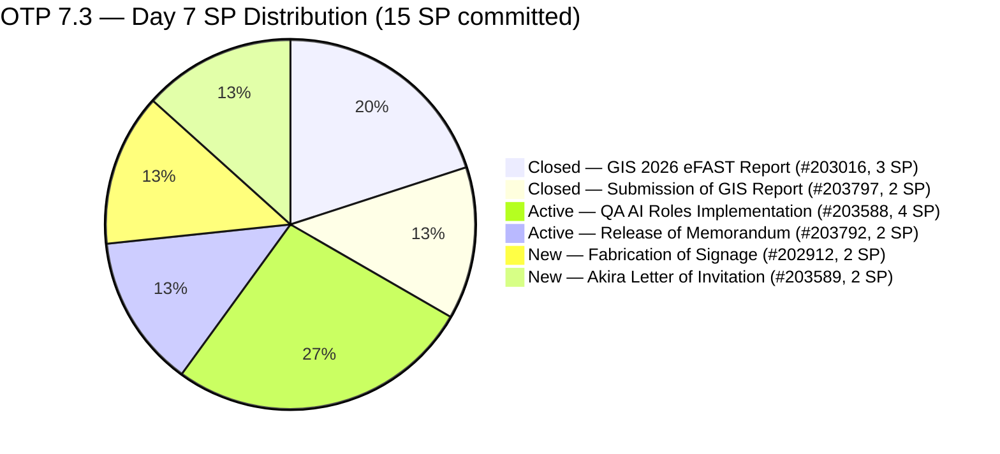
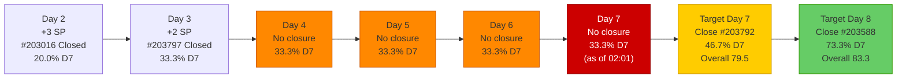
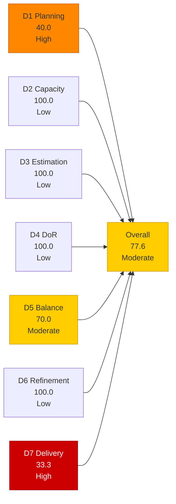
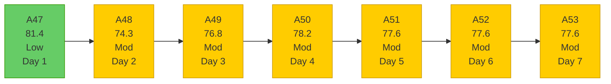

# OTP Team — SAFe Iteration Audit A53
**Date:** 2026-05-10 | **Sprint Day:** 7 of 14 | **Iteration:** 7.3 (May 4 – May 17, 2026)
**Auditor:** Claude Code (ADO SAFe Audit Skill v1) | **Prior Audit:** A52 (2026-05-09 17:03)

---

## 1. Audit Metadata

| Field | Value |
|---|---|
| **Audit ID** | A53 |
| **Report File** | `AUDIT_20260510_0201.md` |
| **Prior Audit** | A52 — `AUDIT_20260509_1703.md` (Overall 77.6, Moderate — 7.3 Day 6) |
| **ADO Project** | OTP (`e7739905-28a3-4ae1-9173-7f6cd13b3494`) |
| **ADO Team** | OTP Team |
| **Iteration** | 7.3 (`86aab8f1-cd46-4fe6-a810-00fba59b46a3`) |
| **Iteration Dates** | May 4 – May 17, 2026 |
| **Sprint Day** | 7 of 14 |
| **Audit Date** | 2026-05-10 02:01 PHT (UTC+8) |
| **Overall Score** | **77.6 — Moderate Risk** |
| **Risk Band** | Moderate (60–79.9) |
| **Visible Backlog Items** | 10 root items |
| **Current Iteration Open Items** | 4 (IterationPath = 7.3, open states) |
| **Full 7.3 Roster** | 6 root items (4 open + 2 Closed) |
| **Capacity Source** | `work_get_team_capacity` — Grace: 1.5 h/day (Documentation 1.0 + Requirements 0.5) |
| **Project Exceptions Applied** | Single-assignee model (Grace) — D2 scored full |

---

## 2. Executive Summary

| Field | Value |
|---|---|
| **Overall Score** | 77.6 — Moderate Risk |
| **Score vs Prior (A52)** | 77.6 → 77.6 (**0.0 — flat, 5th consecutive day**) |
| **Sprint Day** | 7 of 14 |
| **Iteration** | 7.3 (May 4 – May 17, 2026) |
| **Open Items in 7.3** | 4 (#202912, #203588, #203589, #203792) |
| **Committed SP** | 15 SP (6-item full 7.3 roster) |
| **SP Closed** | 5 SP (#203016 = 3, #203797 = 2) |
| **Risk Band** | Moderate (60–79.9) |

**Score flat at 77.6 for the fifth consecutive day (Days 3–7).** No state changes occurred on any of the 4 open items between A52 (May 9 17:03) and A53 (May 10 02:01). All four items (#202912, #203588, #203589, #203792) remain in the same states as Day 3: Active, Active, New, New. The delivery stall now spans 5 days — more than one-third of the sprint window has elapsed without a single closure since Day 3.

**Sprint arithmetic is now critical.** Day 7 of 14 has begun with 10 SP remaining across 4 open items. 7 working days remain. To close at Low Risk (≥80.0 overall), at least one of the two Active items (#203588, 4 SP or #203792, 2 SP) must close today. Closing #203588 alone crosses the Low Risk boundary (overall: 81.4). Closing only #203792 (2 SP) brings the overall to 79.5 — still Moderate but within reach of Low Risk.

---

## 3. Previous Audit Delta (A52 → A53)

| Dimension | A52 Score | A53 Score | Delta | Driver |
|---|---|---|---|---|
| D1 Iteration Planning | 40.0 | 40.0 | = | No change: 4/10; backlog stable at 10 items |
| D2 Team Capacity | 100.0 | 100.0 | = | Grace: 1.5 h/day; single-assignee exception unchanged |
| D3 Estimation | 100.0 | 100.0 | = | All 4 open items estimated; no new items |
| D4 DoR Compliance | 100.0 | 100.0 | = | All 4 open items pass DoR; no new items |
| D5 Work Item Balance | 70.0 | 70.0 | = | All 4 User Story — structural penalty unchanged |
| D6 Backlog Refinement | 100.0 | 100.0 | = | All 10 items fresh (oldest #200073 changed Apr 20, 20 days ago) |
| D7 Delivery Predictability | 33.3 | 33.3 | = | No new closures; stall continues at 5/15 SP |
| **Overall** | **77.6** | **77.6** | **0.0** | All 7 dimensions unchanged |

### Key Events (A52 → A53)

| Event | Impact |
|---|---|
| No item closures (5th consecutive no-closure day, Days 3–7) | D7 stall persists at 33.3; sprint is 50% elapsed with 33.3% delivered |
| No state changes on open items (#202912, #203588, #203589, #203792) | All 4 items have ChangedDate ≤ May 5 — stasis confirmed via ADO batch query |
| No new backlog items added | D1 stable at 40.0; visible backlog steady at 10 items |

---

## 4. Current Iteration Snapshot

**Iteration:** 7.3 | **Period:** May 4 – May 17, 2026 | **Sprint Day:** 7 of 14

| Metric | Value |
|---|---|
| Full 7.3 iteration root items | 6 (#202912, #203016, #203588, #203589, #203792, #203797) |
| Open items in 7.3 (backlog view, IterationPath=7.3) | 4 (#202912, #203588, #203589, #203792) |
| Visible backlog root items | 10 |
| Committed story points | 15 SP |
| SP Closed | 5 SP (#203016 = 3, #203797 = 2) |
| SP Active/Open | 10 SP (4 items) |
| Delivery % | 33.3% (5/15 SP) |
| Assignee | Grace (sole; single-assignee model) |
| Daily capacity | 1.5 h/day (Documentation + Requirements) |
| Days remaining | 7 working days |

### 5-Day Delivery Stall — Burn Rate

### Backlog Path Breakdown (10 visible items)

| IterationPath | Count | Items |
|---|---|---|
| 7.3 (current, open) | 4 | #202912, #203588, #203589, #203792 |
| 7.4 (next sprint) | 3 | #202913, #200073, #203978 |
| 7.6 (future PI7) | 1 | #203864 |
| 8.1 (PI8) | 2 | #201815, #201820 |

---

## 5. Work Item Analysis

### 7.3 Full Iteration Roster (6 items)

| ID | Title | Type | State | SP | Assignee | DoR | ChangedDate | Notes |
|---|---|---|---|---|---|---|---|---|
| #203016 | Generate and Validate GIS 2026 Report for eFAST Submission | User Story | **Closed** | 3 | Grace | ✅ | May 5 | Closed Day 2 — 3 SP credited |
| #203797 | Submission of GIS Report | User Story | **Closed** | 2 | Grace | ✅ | May 6 | Closed Day 3 — 2 SP credited |
| #203588 | Implementation of QA AI Roles | User Story | Active | 4 | Grace | ✅ | May 5 | Active — Day 7; 5 days no state change |
| #203792 | Release of Memorandum | User Story | Active | 2 | Grace | ✅ | May 5 | Active — Day 7; 5 days no state change |
| #202912 | Fabrication of Signage | User Story | New | 2 | Grace | ✅ | May 4 | New — Day 7; 7 days without progress |
| #203589 | Akira to provide signed Letter of Invitation | User Story | New | 2 | Grace | ✅ | May 4 | New — Day 7; external dependency (Akira/Japan Embassy) |

### DoR Verification — Open Items (4 items)

| ID | Description | AC | Status |
|---|---|---|---|
| #203588 | ≥30 chars ✅ (role definition + tooling framework narrative) | ≥20 chars ✅ (4 AC checkboxes: tooling, security, baseline metrics, integration) | ✅ PASS |
| #203792 | ≥30 chars ✅ (memo scope + transition narrative ~350+ chars) | ≥20 chars ✅ (4 AC items: role definition, tech stack, approval, distribution) | ✅ PASS |
| #202912 | ≥30 chars ✅ (safety role + maintenance scope) | ≥20 chars ✅ (safety measures, brgy compliance) | ✅ PASS |
| #203589 | ≥30 chars ✅ (embassy compliance requirement) | ≥20 chars ✅ (accomplished invitation letter) | ✅ PASS |

All 4 open items pass DoR. D4 = 100.0. Consistent since A46.

### Visible Backlog Items (Future Path)

| ID | Title | IterationPath | SP | State | DoR | Notes |
|---|---|---|---|---|---|---|
| #202913 | Installation of Street Signage | 7.4 | 2 | Active | ✅ | Next sprint |
| #200073 | Notification & Due Process (Legal Phase) | 7.4 | 2 | New | ✅ | Full legal AC present |
| #203978 | FTC Approval from SEC of GIS 2026 Report | 7.4 | 1 | New | ✅ | Added May 7 |
| #203864 | Release of TCT | 7.6 | 2 | New | ✅ | Property title transfer |
| #201815 | Physical Installation & Grid Integration | 8.1 | 2 | New | ✅ | Solar installation PI8 |
| #201820 | Monitoring & Handover | 8.1 | 2 | New | ✅ | Solar monitoring PI8 |

---

## 6. SAFe Compliance Scorecard

| Dimension | Score | Band | Formula | Evidence |
|---|---|---|---|---|
| D1 Iteration Planning | 40.0 | High | 4/10 × 100 | 4 open 7.3 items / 10 visible root backlog items |
| D2 Team Capacity | 100.0 | Low | 1/1 × 100 | Grace: 1.5 h/day; single-assignee project exception |
| D3 Estimation | 100.0 | Low | 4/4 × 100 | All 4 open items estimated: #202912=2, #203588=4, #203589=2, #203792=2 SP |
| D4 DoR Compliance | 100.0 | Low | 4/4 × 100 | All 4 open items pass desc ≥30 + AC ≥20 chars |
| D5 Work Item Balance | 70.0 | Moderate | 100 − 30 | All 4 items User Story (100% > 60% dominant) → −30; no absent-US or spike penalties |
| D6 Backlog Refinement | 100.0 | Low | 10/10 fresh; 0 penalties | All 10 items fresh (oldest: #200073 changed Apr 20, 20 days ago); 0 stale_90; 0 untouched |
| D7 Delivery Predictability | 33.3 | High | 5/15 × 100 | 5 SP closed / 15 SP committed; 5th consecutive no-closure day |
| **Overall** | **77.6** | **Moderate** | 543.3 / 7 | Average of 7 dimensions |

### Scoring Detail

- **D1:** round(4/10 × 100, 1) = **40.0** *(4 open 7.3-path backlog items / 10 visible root items; stable since A47)*
- **D2:** round(1/1 × 100, 1) = **100.0** *(Grace sole assignee; 1.5 h/day capacity: Documentation 1.0 + Requirements 0.5; single-assignee project exception applied)*
- **D3:** round(4/4 × 100, 1) = **100.0** *(all 4 open items estimated: 2+4+2+2=10 SP; confirmed via ADO batch query)*
- **D4:** round(4/4 × 100, 1) = **100.0** *(all 4 open items pass description ≥30 + AC ≥20 non-whitespace chars; confirmed via raw ADO field data)*
- **D5:** All 4 open items are User Story (100% > 60% dominant-type threshold) → −30; no absent-US penalty; no spike penalty = **70.0**
- **D6:** base=round(10/10×100,1)=100.0; stale_90=0/10=0%; stale_180=0; untouched_current: #203588 ChangedDate May 5, #203792 May 5, #202912 May 4, #203589 May 4 — all ≥ iteration start May 4 → 0 untouched → **100.0**
- **D7:** Full 7.3 roster: 6 items, 15 SP committed. Closed: #203016(3 SP)+#203797(2 SP)=5 SP. round(5/15 × 100, 1) = **33.3** *(5th consecutive no-closure day — stall since Day 3, May 6)*
- **Overall:** (40.0+100.0+100.0+100.0+70.0+100.0+33.3) / 7 = 543.3 / 7 = **77.6**

---

## 7. Dimension Findings

### D1 — Iteration Planning: 40.0 (High Risk)

**Formula:** `current_iteration_root_items / visible_root_backlog_items × 100 = 4/10 × 100 = 40.0`

D1 is unchanged. The visible backlog structure is stable at 10 items across 4 iteration paths (7.3: 4, 7.4: 3, 7.6: 1, 8.1: 2). The denominator does not decrease until backlog items are closed or removed; the numerator cannot increase without moving future items into 7.3 scope. Both directions require deliberate action. This is a known structural ceiling for OTP's multi-sprint pipeline model.

### D2 — Team Capacity: 100.0 (Low Risk)

Grace: 1.5 h/day (1.0 Documentation + 0.5 Requirements), no days off. Single-assignee project exception in force. D2 = 100.0.

**Remaining sprint bandwidth:** 1.5 h/day × 7 remaining days = **10.5 effective hours**. With 10 SP remaining across 4 open items, the per-SP ratio is now **1.05 h/SP** — the tightest of the sprint and below the natural 1.0 h/SP floor once external coordination overhead (#203589 Akira letter, #202912 vendor fabrication) is factored in.

### D3 — Estimation: 100.0 (Low Risk)

All 4 open current items estimated (#202912=2, #203588=4, #203589=2, #203792=2 = 10 SP). D3 = 100.0. Consistent across A46–A53.

### D4 — DoR Compliance: 100.0 (Low Risk)

All 4 open items confirmed pass DoR via direct ADO field query. D4 = 100.0. Consistent since A46.

### D5 — Work Item Balance: 70.0 (Moderate Risk)

All 4 open sprint items are User Stories (100% dominant type). The >60% threshold triggers −30. D5 = 70.0. This is a structural characteristic of OTP's work model. Adding one non-User-Story item still leaves User Stories at 80% (4/5) — the penalty would persist. Elimination requires 3+ non-US items.

### D6 — Backlog Refinement: 100.0 (Low Risk)

All 10 visible backlog items are fresh (changed within 45 days of May 10, i.e., since March 26). The oldest item is #200073 (changed Apr 20, 20 days ago). The newest are #201815 and #201820 (changed May 4). Zero stale_90 or stale_180 items. All 4 current open items have ChangedDate ≥ May 4 (iteration start) → zero untouched. D6 = 100.0.

### D7 — Delivery Predictability: 33.3 (High Risk — 5-Day Stall)

**Formula:** `closed_story_points / committed_story_points × 100 = 5/15 × 100 = 33.3`

**The delivery stall has now reached 5 consecutive days (Days 3–7).** No closures occurred between Day 3 (May 6) and Day 7 (May 10, 02:01). The sprint is exactly 50% elapsed (7/14 days) with 33.3% delivery — a widening gap that now requires above-baseline velocity in the back half.

| Day | Closure | SP Closed | D7 | Sprint % Elapsed |
|---|---|---|---|---|
| Day 1 (May 4) | None | 0 | 0.0 | 7% |
| Day 2 (May 5) | #203016 (3 SP) | 3 | 20.0 | 14% |
| Day 3 (May 6) | #203797 (2 SP) | 5 | 33.3 | 21% |
| Day 4 (May 7) | None | 5 | 33.3 | 29% |
| Day 5 (May 8) | None | 5 | 33.3 | 36% |
| Day 6 (May 9) | None | 5 | 33.3 | 43% |
| **Day 7 (May 10)** | **None (as of 02:01)** | **5** | **33.3** | **50%** |

Sprint is at the midpoint: 50% elapsed, 33.3% delivered. The two closed items were both administrative compliance tasks (GIS report) completed early in the sprint. The remaining 4 open items present a fundamentally different complexity profile requiring multi-party coordination and approval chains.

**Recovery math:**
- Close #203792 (2 SP): D7 → 46.7, overall → 79.5 (approaching Low Risk)
- Close #203588 (4 SP): D7 → 60.0, overall → **81.4 (Low Risk)**
- Close both (6 SP): D7 → 73.3, overall → 83.3
- Close all 4 (10 SP): D7 → 100.0, overall → 87.1

---

## 8. Risks and Bottlenecks

| # | Risk | Severity | Dimension | Detail |
|---|---|---|---|---|
| R1 | 5-day delivery stall — sprint at 50% elapsed, 33.3% delivered | **Critical** | D7 | No closures since Day 3 (May 6). Five consecutive non-closure days (Days 3–7). Sprint midpoint has been reached with a 16.7-point delivery gap. Any further delay collapses recovery probability without weekend or overtime work |
| R2 | #202912 (Fabrication of Signage) — 7 days New, no task activity | **Critical** | D7 | Physical fabrication item; 7 days without any state change, task child, or assignee note; if fabrication requires vendor lead time > 7 remaining days, carryover to 7.4 is near-certain |
| R3 | #203589 (Akira Letter) — external dependency with unknown status | **High** | D7 | Requires signed letter from Akira (Japanese sponsor company); no evidence of contact or status update in 7 days; Japan Embassy timelines may be incompatible with May 17 sprint end |
| R4 | Capacity floor — 10.5 hours remaining for 10 SP | **High** | D7 | 1.05 h/SP ratio; external coordination overhead (#203589) and physical logistics (#202912) consume untracked time not reflected in ADO capacity; effective ratio likely 0.7–0.8 h/SP for direct work |
| R5 | D7 gap growing — 50% elapsed, 33.3% delivered | **High** | D7 | Gap has widened from 10 points (Day 3) to 16.7 points (Day 7); every day without closure adds 7.1 percentage points to the gap |
| R6 | D1 = 40.0 — structural ceiling | Moderate | D1 | Multi-sprint pipeline is the source; 4/10; further additions to non-7.3 paths will push D1 below 40.0 |
| R7 | D5 = 70.0 — dominant-type penalty persistent | Moderate | D5 | All 4 items User Story; structural across all OTP sprints; cannot resolve without 3+ non-US additions |

---

## 9. Prioritized Recommendations

1. **[CRITICAL — D7, Today]** Close #203792 (Release of Memorandum, 2 SP, Active). This is the most actionable closure available today. The memo is approval-format administrative work — check: (a) Has the QAA role memorandum draft been finalized? (b) Has HR and CTO/Engineering VP signed off (AC2)? (c) Has the memo been distributed via email/Slack/Confluence (AC4)? (d) Has a feedback loop been established (AC5)? If all 4 ACs are met, close the item. A Day-7 closure brings D7 to 46.7, overall to 79.5.

2. **[CRITICAL — D7, Today]** Close #203588 (Implementation of QA AI Roles, 4 SP, Active). The 4 AC items define a framework setup — check: (a) Is the AI testing platform provisioned and SSO-integrated (AC: Tooling Access)? (b) Is the Data Usage Policy signed off (AC: Security Clearance)? (c) Are Manual vs. Automation baseline metrics recorded (AC: Baseline Metrics)? (d) Has the AI tool successfully connected to the code repository (AC: Integration)? If all 4 are complete, close the item. Closing #203588 alone raises overall to 81.4 — the first Low Risk crossing since Day 1 of iteration 7.3.

3. **[HIGH — D7, Today]** Escalate #203589 (Akira Letter of Invitation, 2 SP). Day 7 — this item has been New for 7 days with no evidence of contact. Determine immediately: (a) Has Akira been contacted? (b) Has a letter draft been shared? (c) Is there a Japan Embassy submission deadline before May 17? If the deadline is after May 17, document the external wait state formally and consider moving to 7.4. If the deadline is before May 17, escalate to Akira today via email/phone.

4. **[HIGH — D7, Today]** Initiate or escalate #202912 (Fabrication of Signage, 2 SP). This item has been New for 7 days. If vendor coordination is needed, a purchase order or work order should have been issued by Day 3. Determine: (a) Has the vendor been contacted? (b) Is there a lead time that exceeds the remaining 7 sprint days? If lead time > 7 days, move to 7.4 immediately and remove from current sprint scope to avoid denominator inflation on D7.

5. **[MEDIUM — D5, Sprint Planning for 7.4]** Plan at least 3 non-User-Story item types in 7.4 sprint scope to eliminate the dominant-type penalty. One Enabler is insufficient (4/5=80% still > 60%). Suggested composition for D5=100.0: 2 User Stories + 1 Enabler + 1 Spike = US share 50% (<60%), Spike share 25% (<40%), US present (>0%).

6. **[LOW — Audit Practice]** Continue daily audits through Day 10 (May 14). The stall is critical enough that daily monitoring is warranted; the next closure event is the most important sprint health signal available.

---

## 10. Evidence Gaps and Limitations

| Gap | Impact | Mitigation |
|---|---|---|
| #203016 and #203797 not in backlog view (Closed state) | D1 denominator uses 10 open items; D7 committed SP uses 15 SP (full 6-item roster from prior audit) | Standard ADO behavior; both confirmed Closed via prior audit; states have not changed |
| #202913 in iteration roster with IterationPath=7.4 | Excluded from current_iteration_root_items per IterationPath filter | Consistent with A48–A53 treatment |
| No task-level data pulled for open items | Cannot confirm sub-task progress or partial work on #203588/#203792 | Root-item evidence only; D7 calculated on root item state; task data available on demand |
| Audit run at 02:01 PHT | Day 7 is just beginning; Grace's working hours (typically 08:00–17:00 PHT) have not begun; no closure opportunity has passed yet | D7 figure is accurate as of audit time; closures may occur during business hours today |

---

## 11. Score Trend — OTP Iteration 7.3

**Score has been flat at 77.6 for three consecutive days (A51–A53).** The score plateaued after Day 3 closures and has not moved in 5 days. This is the longest flat-score streak in the 7.3 audit series.

### Path to Low Risk (80.0 target) — 2.4 points needed

| Action | Dimension | Score Impact | New Overall |
|---|---|---|---|
| Close #203792 (2 SP) | D7: 33.3 → 46.7 | +1.9 | 79.5 |
| Close #203588 (4 SP) | D7: 33.3 → 60.0 | +3.8 | **81.4 ✅ Low Risk** |
| Close #203792 + #203588 (6 SP) | D7: 33.3 → 73.3 | +5.7 | 83.3 ✅ |
| Close all 4 items (10 SP) | D7: 33.3 → 100.0 | +9.5 | 87.1 ✅ |

**Minimum action to cross Low Risk:** Close #203588 (Implementation of QA AI Roles, 4 SP, Active). A single closure raises overall from 77.6 to 81.4. This item has been Active since Day 2 (May 5). Today (Day 7) represents the sprint midpoint — the last reasonable date to begin the recovery sequence before back-half risk becomes severe.

---

*Audit A53 produced by Claude Code — ADO SAFe Audit Skill v1. SAFe 6.0 framework. Sprint Day 7 of 14 (sprint midpoint). Key finding: Score flat at 77.6 for 5th consecutive day — D7 delivery stall now spans Days 3–7 (5 days) with no closures. Sprint is 50% elapsed with 33.3% delivered — a 16.7-point delivery gap. Grace has 10.5 effective hours remaining across 10 SP open (1.05 h/SP — tightest ratio of the sprint). Closing #203588 (4 SP, Active) today is the minimum action to cross the 80.0 Low Risk boundary. Two Active items (#203588, #203792) remain available for closure today.*
