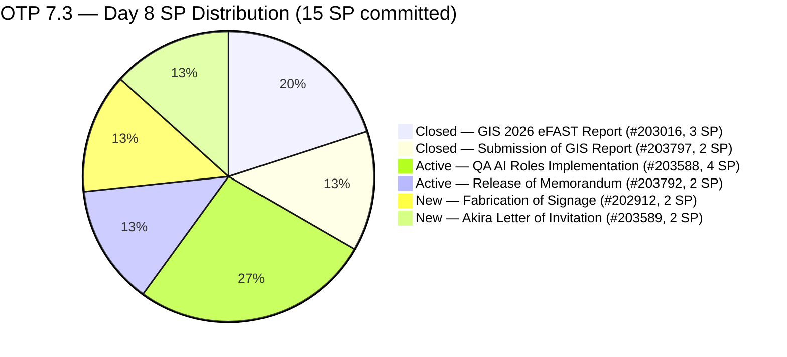
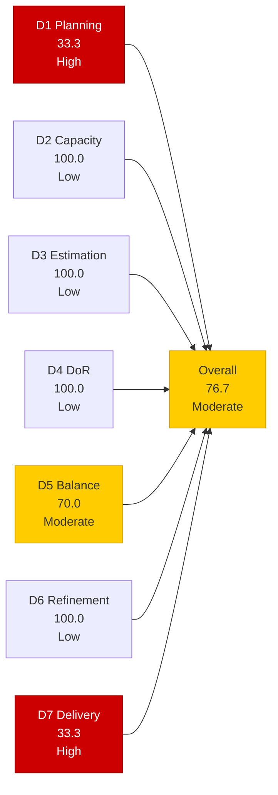
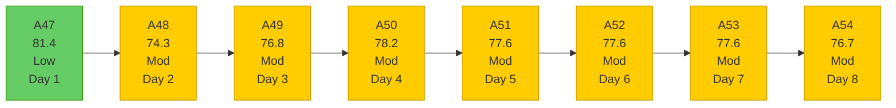

# OTP Team — SAFe Iteration Audit A54
**Date:** 2026-05-11 | **Sprint Day:** 8 of 14 | **Iteration:** 7.3 (May 4 – May 17, 2026)
**Auditor:** Claude Code (ADO SAFe Audit Skill v1) | **Prior Audit:** A53 (2026-05-10 02:01)

---

## 1. Audit Metadata

| Field | Value |
|---|---|
| **Audit ID** | A54 |
| **Report File** | `AUDIT_20260511_0900.md` |
| **Prior Audit** | A53 — `AUDIT_20260510_0201.md` (Overall 77.6, Moderate — 7.3 Day 7) |
| **ADO Project** | OTP (`e7739905-28a3-4ae1-9173-7f6cd13b3494`) |
| **ADO Team** | OTP Team |
| **Iteration** | 7.3 (`86aab8f1-cd46-4fe6-a810-00fba59b46a3`) |
| **Iteration Dates** | May 4 – May 17, 2026 |
| **Sprint Day** | 8 of 14 |
| **Audit Date** | 2026-05-11 09:00 PHT (UTC+8) |
| **Overall Score** | **76.7 — Moderate Risk** |
| **Risk Band** | Moderate (60–79.9) |
| **Visible Backlog Items** | 12 root items |
| **Current Iteration Root Items** | 4 (IterationPath = 7.3) |
| **Full 7.3 Roster** | 6 root items (4 open + 2 Closed) |
| **Capacity Source** | `work_get_iteration_capacities` — Grace: 1.5 h/day (team 64de61f0) |
| **Project Exceptions Applied** | Single-assignee model (Grace) — D2 scored full |

---

## 2. Executive Summary

| Field | Value |
|---|---|
| **Overall Score** | 76.7 — Moderate Risk |
| **Score vs Prior (A53)** | 77.6 → 76.7 (**−0.9 — decline**) |
| **Sprint Day** | 8 of 14 |
| **Iteration** | 7.3 (May 4 – May 17, 2026) |
| **Open Items in 7.3** | 4 (#202912, #203588, #203589, #203792) |
| **Committed SP** | 15 SP (6-item full 7.3 roster) |
| **SP Closed** | 5 SP (#203016 = 3, #203797 = 2) |
| **Risk Band** | Moderate (60–79.9) |

**Score declined −0.9 (77.6 → 76.7) driven by backlog expansion.** Two new PI8 items (#204043 — H1B Renewal, #204044 — FTC GH Derek Schedule) were added to the OTP backlog today (both changed 2026-05-11), expanding the visible backlog from 10 to 12 items. This reduces D1 from 40.0 to 33.3 — the direct cause of the overall score decline. No closures occurred on any of the 4 open 7.3 items.

**Sprint stall enters Day 6 (no closure since Day 3).** All four items (#202912, #203588, #203589, #203792) remain Active or New without state changes since A53. With 4 items open and 6 working days remaining, each remaining day without at least one closure reduces the recovery probability for Low Risk.

**D1 signal warning:** The addition of two more PI8 items is a pattern — the PI8 backlog is growing while PI7/7.3 items remain undelivered. If items #201815, #201820, #204043, and #204044 continue to accumulate in future PIs without resolution of current commitments, D1 will continue declining.

---

## 3. Previous Audit Delta (A53 → A54)

| Dimension | A53 Score | A54 Score | Delta | Driver |
|---|---|---|---|---|
| D1 Iteration Planning | 40.0 | 33.3 | **−6.7** | Backlog expanded from 10 → 12 items (2 new PI8 items: #204043, #204044); 4/12 = 33.3 |
| D2 Team Capacity | 100.0 | 100.0 | 0.0 | Grace: 1.5 h/day; single-assignee exception unchanged |
| D3 Estimation | 100.0 | 100.0 | 0.0 | All 4 current items estimated; new PI8 items not in current iteration |
| D4 DoR Compliance | 100.0 | 100.0 | 0.0 | All 4 current items pass DoR; new items are PI8 (not in scope) |
| D5 Work Item Balance | 70.0 | 70.0 | 0.0 | All 4 User Story — structural penalty unchanged |
| D6 Backlog Refinement | 100.0 | 100.0 | 0.0 | All 12 items fresh (newest: #204043, #204044 changed today May 11) |
| D7 Delivery Predictability | 33.3 | 33.3 | 0.0 | No new closures; 5/15 SP; stall enters Day 6 |
| **Overall** | **77.6** | **76.7** | **−0.9** | D1 decline only; all other dimensions flat |

### Key Events (A53 → A54)

| Event | Impact |
|---|---|
| **2 new PI8 items added** (#204043 H1B Renewal, #204044 FTC GH Derek) | D1 drops 40.0 → 33.3; visible backlog grows 10 → 12; overall −0.9 |
| No item closures (6th consecutive no-closure day, Days 3–8) | D7 stall persists at 33.3; sprint is 57% elapsed with 33.3% delivered |
| No state changes on 4 open items | #202912, #203588, #203589, #203792 unchanged from A53 |

---

## 4. Current Iteration Snapshot

**Iteration:** 7.3 | **Period:** May 4 – May 17, 2026 | **Sprint Day:** 8 of 14

| Metric | Value |
|---|---|
| Full 7.3 iteration root items | 6 (#202912, #203016, #203588, #203589, #203792, #203797) |
| Open items in 7.3 (backlog view) | 4 (#202912, #203588, #203589, #203792) |
| Visible backlog root items | 12 |
| Committed story points | 15 SP |
| SP Closed | 5 SP (#203016 = 3, #203797 = 2) |
| SP Active/Open | 10 SP (4 items) |
| Delivery % | 33.3% (5/15 SP) |
| Assignee | Grace (sole; single-assignee model) |
| Daily capacity | 1.5 h/day |
| Days remaining | 6 working days |

### Backlog Path Breakdown (12 visible items)

| IterationPath | Count | Items |
|---|---|---|
| 7.3 (current, open) | 4 | #202912, #203588, #203589, #203792 |
| 7.4 (next sprint) | 1 | #202913 |
| 7.6 (future PI7) | 1 | #203864 |
| 8.1 (PI8) | 2 | #201815, #201820 |
| PI8 (unscheduled) | 2 | #204043, #204044 (**new today**) |
| PI8 (unscheduled) | 2 | #200679, #200680 |

### Delivery Stall Summary

| Day | Closure | SP Closed | D7 | Sprint % Elapsed |
|---|---|---|---|---|
| Day 2 (May 5) | #203016 (3 SP) | 3 | 20.0 | 14% |
| Day 3 (May 6) | #203797 (2 SP) | 5 | 33.3 | 21% |
| Day 4 (May 7) | None | 5 | 33.3 | 29% |
| Day 5 (May 8) | None | 5 | 33.3 | 36% |
| Day 6 (May 9) | None | 5 | 33.3 | 43% |
| Day 7 (May 10) | None | 5 | 33.3 | 50% |
| **Day 8 (May 11)** | **None** | **5** | **33.3** | **57%** |

---

## 5. Work Item Analysis

### 7.3 Full Iteration Roster (6 items)

| ID | Title | Type | State | SP | Assignee | DoR | ChangedDate | Notes |
|---|---|---|---|---|---|---|---|---|
| #203016 | Generate and Validate GIS 2026 Report for eFAST Submission | User Story | **Closed** | 3 | Grace | ✅ | May 5 | Closed Day 2 — 3 SP credited |
| #203797 | Submission of GIS Report | User Story | **Closed** | 2 | Grace | ✅ | May 6 | Closed Day 3 — 2 SP credited |
| #203588 | Implementation of QA AI Roles | User Story | Active | 4 | Grace | ✅ | May 10 | Active — Day 8; 6 days no state change |
| #203792 | Release of Memorandum | User Story | Active | 2 | Grace | ✅ | May 5 | Active — Day 8; unchanged since Day 2 |
| #202912 | Fabrication of Signage | User Story | New | 2 | Grace | ✅ | May 10 | New — Day 8; 8 days without progress |
| #203589 | Akira to provide signed Letter of Invitation | User Story | New | 2 | Grace | ✅ | May 10 | New — Day 8; external dependency (Akira/Japan Embassy) |

### DoR Verification — Current Open Items (4 items)

| ID | Description | AC | Status |
|---|---|---|---|
| #203588 | ≥30 chars ✅ (role definition + tooling framework narrative) | ≥20 chars ✅ (4 AC checkboxes: Tooling Access, Security Clearance, Baseline Metrics, Integration) | ✅ PASS |
| #203792 | ≥30 chars ✅ (memo scope + transition narrative ~350+ chars) | ≥20 chars ✅ (5 AC items: role definition, tech stack, approval, distribution, feedback loop) | ✅ PASS |
| #202912 | ≥30 chars ✅ (safety role + maintenance scope) | ≥20 chars ✅ (safety measures, brgy compliance) | ✅ PASS |
| #203589 | ≥30 chars ✅ (embassy compliance, sponsoring company verification need) | ≥20 chars ✅ (accomplished invitation letter for Japan Embassy) | ✅ PASS |

All 4 current items pass DoR. D4 = 100.0. Consistent since A46.

### New PI8 Items (Context — not in current iteration scope)

| ID | Title | SP | State | Assignee | ChangedDate | Notes |
|---|---|---|---|---|---|---|
| #204043 | Preparation of H1B Renewal | 2 | New | Grace | May 11 | H1B visa renewal for Adam; compliance item |
| #204044 | FTC GH Derek for schedule and itinerary | 2 | New | Grace | May 11 | Japan visa itinerary coordination with GH Derek |

Both new items have Description and AC present (DoR-compliant). They are assigned to PI8 (unscheduled) and do not affect D3/D4 scoring for the current iteration.

### Full Visible Backlog (12 items)

| ID | Title | IterationPath | SP | State | Assignee | ChangedDate |
|---|---|---|---|---|---|---|
| #202912 | Fabrication of Signage | 7.3 | 2 | New | Grace | May 10 |
| #203588 | Implementation of QA AI Roles | 7.3 | 4 | Active | Grace | May 10 |
| #203589 | Akira Letter of Invitation | 7.3 | 2 | Active | Grace | May 10 |
| #203792 | Release of Memorandum | 7.3 | 2 | Active | Grace | May 5 |
| #202913 | Installation of Street Signage | 7.4 | 2 | Active | Grace | May 4 |
| #203864 | Release of TCT | 7.6 | 2 | New | Grace | May 6 |
| #201815 | Physical Installation & Grid Integration | 8.1 | 2 | New | Grace | May 4 |
| #201820 | Monitoring & Handover | 8.1 | 2 | New | Grace | May 4 |
| #200679 | File RKS Form 5 with DOLE | PI8 | 2 | New | Grace | May 11 |
| #200680 | Calculate Separation Pay | PI8 | 2 | New | Grace | May 11 |
| #204043 | Preparation of H1B Renewal | PI8 | 2 | New | Grace | May 11 |
| #204044 | FTC GH Derek for schedule | PI8 | 2 | New | Grace | May 11 |

---

## 6. SAFe Compliance Scorecard

| Dimension | Score | Band | Formula | Evidence |
|---|---|---|---|---|
| D1 Iteration Planning | 33.3 | High | 4/12 × 100 | 4 open 7.3 items / 12 visible root backlog items |
| D2 Team Capacity | 100.0 | Low | 1/1 × 100 | Grace: 1.5 h/day (team capacity confirmed); single-assignee project exception |
| D3 Estimation | 100.0 | Low | 4/4 × 100 | All 4 current items estimated: #202912=2, #203588=4, #203589=2, #203792=2 SP |
| D4 DoR Compliance | 100.0 | Low | 4/4 × 100 | All 4 current items pass desc ≥30 + AC ≥20 chars |
| D5 Work Item Balance | 70.0 | Moderate | 100 − 30 | All 4 items User Story (100% > 60% dominant) → −30; no absent-US or spike penalties |
| D6 Backlog Refinement | 100.0 | Low | 12/12 fresh; 0 penalties | All 12 items fresh (newest: #204043/#204044 changed May 11; oldest: #201815/#201820 May 4); 0 stale_90; 0 untouched |
| D7 Delivery Predictability | 33.3 | High | 5/15 × 100 | 5 SP closed / 15 SP committed; 6th consecutive no-closure day |
| **Overall** | **76.7** | **Moderate** | 536.6 / 7 | Average of 7 dimensions |

### Scoring Detail

- **D1:** round(4/12 × 100, 1) = **33.3** *(4 open 7.3-path items / 12 visible root items; D1 dropped from 40.0 due to 2 new PI8 items added today)*
- **D2:** round(1/1 × 100, 1) = **100.0** *(Grace sole assignee; 1.5 h/day capacity confirmed; single-assignee project exception applied)*
- **D3:** round(4/4 × 100, 1) = **100.0** *(all 4 current 7.3 items estimated: 2+4+2+2=10 SP; new PI8 items not in scope)*
- **D4:** round(4/4 × 100, 1) = **100.0** *(all 4 current items pass description ≥30 + AC ≥20 non-whitespace chars confirmed via ADO batch query)*
- **D5:** All 4 current items are User Story (100% > 60%) → −30; US present → 0; no spikes → 0. **70.0**
- **D6:** base=round(12/12×100,1)=100.0; stale_90=0 (oldest item: #201815/#201820 changed May 4, 7 days ago); stale_180=0; untouched_current: all 4 current 7.3 items have ChangedDate ≥ May 4 → 0 untouched → **100.0**
- **D7:** Full 7.3 roster: 6 items, 15 SP committed. Closed: #203016(3 SP)+#203797(2 SP)=5 SP. round(5/15 × 100, 1) = **33.3** *(6th consecutive no-closure day — stall since Day 3, May 6)*
- **Overall:** (33.3+100.0+100.0+100.0+70.0+100.0+33.3) / 7 = 536.6 / 7 = **76.7**

### Score Trend — OTP Iteration 7.3

---

## 7. Dimension Findings

### D1 — Iteration Planning: 33.3 (High Risk — New Low)

**Formula:** `current_iteration_root_items / visible_root_backlog_items × 100 = 4/12 × 100 = 33.3`

D1 declined from 40.0 (A53) to 33.3 — the lowest D1 score in the 7.3 audit series. Two new PI8 items were added to the visible backlog today: #204043 (H1B Renewal, Grace, PI8-unscheduled) and #204044 (FTC GH Derek, Grace, PI8-unscheduled). Together with the existing 4 PI8 items (#200679, #200680, #201815, #201820), the PI8 backlog pool now contains 6 items. This means that 50% of the visible backlog is in PI8 — work that is not planned, not estimated with the same urgency, and not contributing to current sprint delivery.

**Pattern concern:** Every PI8 addition dilutes D1 without a corresponding decrease in PI7/7.3 items (since the 7.3 items are open and not closing). The multi-sprint pipeline model is expanding downstream while the current sprint is stalled.

### D2 — Team Capacity: 100.0 (Low Risk)

Grace: 1.5 h/day, no days off. Single-assignee project exception in force. D2 = 100.0.

**Remaining sprint bandwidth:** 1.5 h/day × 6 remaining days = **9.0 effective hours**. With 10 SP remaining across 4 open items, the per-SP ratio has tightened to **0.9 h/SP** — effectively at parity with the sprint's natural velocity floor, leaving no buffer for external coordination overhead (#203589 Akira letter, #202912 vendor fabrication).

### D3 — Estimation: 100.0 (Low Risk)

All 4 current 7.3 items estimated (#202912=2, #203588=4, #203589=2, #203792=2 = 10 SP). The 2 new PI8 items (#204043=2, #204044=2) are also estimated but are out of current scope. D3 = 100.0.

### D4 — DoR Compliance: 100.0 (Low Risk)

All 4 current 7.3 items pass DoR via direct ADO field query. D4 = 100.0. Consistent since A46. The 2 new PI8 items also have Description and AC present (both pass), but they are not in scope for current iteration scoring.

### D5 — Work Item Balance: 70.0 (Moderate Risk)

All 4 current 7.3 items are User Stories (100% dominant type). The >60% threshold applies → −30. D5 = 70.0. This is a structural constraint of OTP's operational model. Elimination requires 3+ non-US item types in the current sprint.

### D6 — Backlog Refinement: 100.0 (Low Risk)

All 12 visible backlog items are fresh. The 2 new PI8 items were changed today (May 11). The oldest items are #201815 and #201820 (changed May 4 — 7 days ago). Zero stale_90 or stale_180 items. All 4 current 7.3 items have ChangedDate ≥ May 4 (iteration start) → zero untouched current items. D6 = 100.0.

The addition of new items demonstrates active backlog grooming, which is a healthy SAFe behavior. However, the pattern of adding future-PI items while current sprint items remain undelivered creates a growing D1 gap.

### D7 — Delivery Predictability: 33.3 (High Risk — 6-Day Stall)

**Formula:** `closed_story_points / committed_story_points × 100 = 5/15 × 100 = 33.3`

**The delivery stall has now extended to 6 consecutive days (Days 3–8).** No closures occurred between Day 3 (May 6) and Day 8 (May 11). The sprint is now 57% elapsed (8/14 days) with only 33.3% delivered — a 23.7-point delivery deficit.

**Recovery math (6 days remaining):**

| Action | D7 → | Overall → | Notes |
|---|---|---|---|
| Close #203792 (2 SP) | 46.7 | 79.3 | Within reach of Low Risk |
| Close #203588 (4 SP) | 60.0 | **81.0 ✅ Low Risk** | Single item crosses threshold |
| Close #203792 + #203588 (6 SP) | 73.3 | 83.0 ✅ | Strong Low Risk |
| Close all 4 (10 SP) | 100.0 | 87.1 ✅ | Sprint completion |

**The minimum action to reach Low Risk is closing #203588 (Implementation of QA AI Roles, 4 SP, Active).** This item has been Active since Day 2 (May 5). At Day 8, all 4 AC checkboxes should have sufficient time for completion.

---

## 8. Risks and Bottlenecks

| # | Risk | Severity | Dimension | Detail |
|---|---|---|---|---|
| R1 | 6-day delivery stall — sprint 57% elapsed, 33.3% delivered | **Critical** | D7 | No closures since Day 3 (May 6). Six consecutive non-closure days. The gap between sprint elapsed % (57%) and delivery % (33.3%) is now 23.7 points — the widest it has been. Six working days remain; full sprint completion requires closing 10 SP (1.67 SP/day) against Grace's 1.5 h/day |
| R2 | D1 declining trend — new PI8 additions eroding planning score | **High** | D1 | D1 dropped from 40.0 → 33.3 today; 6 of 12 visible items are now in PI8. Pattern: backlog grows downstream while current sprint stalls. If 2 more items added next week without 7.3 closure, D1 falls below 30.0 |
| R3 | #202912 (Fabrication of Signage) — 8 days New, zero progress | **High** | D7 | Physical vendor work; 8 days without any state change. Sprint ends May 17. Vendor fabrication lead time > 6 days likely requires immediate carryover decision |
| R4 | #203589 (Akira Letter) — external dependency unresolved Day 8 | **High** | D7 | Japan Embassy visa requirement; no evidence of contact or letter status in 8 days. Embassy processing timelines may be incompatible with May 17 sprint end; carryover to 7.4 should be considered |
| R5 | Capacity compression — 9.0 hours for 10 SP | **High** | D7 | 0.9 h/SP ratio; external coordination overhead for #203589 and vendor logistics for #202912 consume untracked hours; effective delivery window for internal items narrower than capacity math suggests |
| R6 | D5 = 70.0 — dominant-type structural penalty | Moderate | D5 | All 4 items User Story; structural across all OTP sprints; requires 3+ non-US items to eliminate |
| R7 | Backlog growth pattern (PI8) without corresponding D7 progress | Moderate | D1/D7 | 6 PI8 items in visible backlog; adding items to future PIs without closing current items creates a growing planning debt |

---

## 9. Prioritized Recommendations

1. **[CRITICAL — D7, Today]** Close #203588 (Implementation of QA AI Roles, 4 SP, Active). This is the single highest-leverage action available: a closure today raises overall from 76.7 to 81.0 (Low Risk). Review all 4 AC checkboxes: (a) AI testing platform provisioned and SSO-integrated? (b) Data Usage Policy signed off? (c) Manual vs. Automation baseline metrics recorded? (d) AI tool connected to code repository? If all 4 are complete, close the item now. Day 8 is the midpoint+1 — delays beyond today make sprint completion increasingly improbable.

2. **[CRITICAL — D7, Today]** Close #203792 (Release of Memorandum, 2 SP, Active). This administrative memo should be completable today: (a) QAA role memorandum draft finalized? (b) HR and CTO/Engineering VP signed off (AC2)? (c) Memo distributed via email/Slack/Confluence (AC4)? (d) Feedback loop mechanism created (AC5)? Closing #203792 + #203588 together raises D7 to 73.3 and overall to 83.0.

3. **[HIGH — D7, Today — Decision Required]** Disposition #202912 (Fabrication of Signage, 2 SP, New). 8 days elapsed with zero action. Determine today: (a) Has the vendor been contacted? (b) What is the fabrication lead time? If lead time > 6 days, move to 7.4 immediately to remove from D7 denominator pressure. If vendor is ready to begin today, escalate to Active and set a task.

4. **[HIGH — D7, Today — Decision Required]** Disposition #203589 (Akira Letter of Invitation, 2 SP, New). 8 days elapsed without contact evidence. Determine today: (a) Has Akira been formally contacted? (b) Is there a Japan Embassy submission deadline before May 17? If the deadline is compatible with May 17, escalate to Active. If not, move to 7.4 or mark as blocked.

5. **[HIGH — D1, Backlog Hygiene]** Pause adding new PI8 items until current 7.3 items are closed. D1 = 33.3 is the lowest in the 7.3 audit series. Every new unscheduled backlog item that is not in the current iteration further dilutes D1. If new work must be captured, assign it to 7.4 or PI8 but acknowledge the D1 impact in the next sprint planning.

6. **[MEDIUM — Sprint Planning, 7.4]** In 7.4 planning, introduce 3+ non-User-Story item types (Enabler, Spike, Defect) to eliminate the D5 -30 penalty. D5 has been stuck at 70.0 for all 8 days of 7.3.

---

## 10. Evidence Gaps and Limitations

| Gap | Impact | Mitigation |
|---|---|---|
| #203016 and #203797 not in backlog view (Closed) | D7 committed SP uses full 6-item 7.3 roster (15 SP) from prior audit confirmation | Standard ADO behavior; both confirmed Closed in A47–A53 |
| Capacity reported at team level (64de61f0), not individual member | Cannot confirm Grace's specific activity breakdown; team total = 1.5 h/day | Consistent with all prior OTP audits; 1.5 h/day confirmed |
| No task-level data for open 7.3 items | Cannot confirm sub-task progress on #203588 or #203792 | Root-item states are the definitive D7 signal |
| New PI8 items (#204043, #204044) — DoR not checked for current scoring | These items are outside current iteration scope; DoR confirmed present via ADO data | Noted for completeness; no scoring impact |

---

*Audit A54 produced by Claude Code — ADO SAFe Audit Skill v1. SAFe 6.0 framework. Sprint Day 8 of 14. Key finding: Overall score declined 0.9 points (77.6 → 76.7) due to backlog expansion (2 new PI8 items added today, visible backlog 10 → 12). D7 delivery stall enters Day 6 (6 consecutive no-closure days since Day 3). Sprint is 57% elapsed with 33.3% delivered — a 23.7-point gap. Grace has 9.0 effective hours remaining across 10 SP open. Closing #203588 (4 SP, Active) today is the minimum action to cross Low Risk (overall → 81.0). Continued PI8 backlog additions without corresponding 7.3 closures will push D1 below 30.0 before sprint end.*
