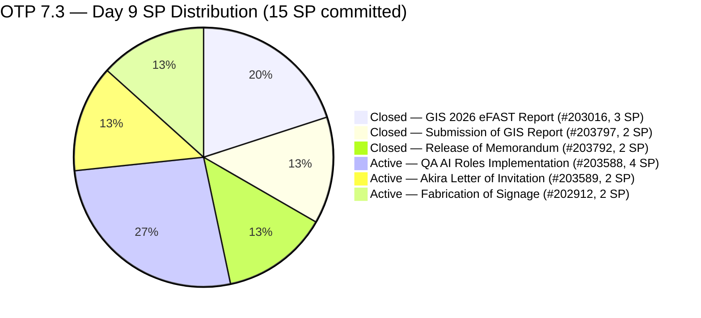
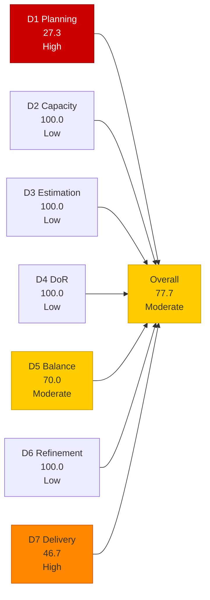
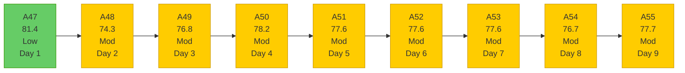

# OTP Team — SAFe Iteration Audit A55
**Date:** 2026-05-12 | **Sprint Day:** 9 of 14 | **Iteration:** 7.3 (May 4 – May 17, 2026)
**Auditor:** Claude Code (ADO SAFe Audit Skill v1) | **Prior Audit:** A54 (2026-05-11 09:00)

---

## 1. Audit Metadata

| Field | Value |
|---|---|
| **Audit ID** | A55 |
| **Report File** | `AUDIT_20260512_0202.md` |
| **Prior Audit** | A54 — `AUDIT_20260511_0900.md` (Overall 76.7, Moderate — 7.3 Day 8) |
| **ADO Project** | OTP (`e7739905-28a3-4ae1-9173-7f6cd13b3494`) |
| **ADO Team** | OTP Team |
| **Iteration** | 7.3 (`86aab8f1-cd46-4fe6-a810-00fba59b46a3`) |
| **Iteration Dates** | May 4 – May 17, 2026 |
| **Sprint Day** | 9 of 14 |
| **Audit Date** | 2026-05-12 02:02 PHT (UTC+8) |
| **Overall Score** | **77.7 — Moderate Risk** |
| **Risk Band** | Moderate (60–79.9) |
| **Visible Backlog Items** | 11 root items |
| **Current Iteration Root Items** | 3 (IterationPath = 7.3) |
| **Full 7.3 Roster** | 6 root items (3 open + 3 Closed) |
| **Capacity Source** | `work_get_iteration_capacities` — Grace: 1.5 h/day (team 64de61f0) |
| **Project Exceptions Applied** | Single-assignee model (Grace) — D2 scored full |

---

## 2. Executive Summary

| Field | Value |
|---|---|
| **Overall Score** | 77.7 — Moderate Risk |
| **Score vs Prior (A54)** | 76.7 → 77.7 (**+1.0 — improvement**) |
| **Sprint Day** | 9 of 14 |
| **Iteration** | 7.3 (May 4 – May 17, 2026) |
| **Open Items in 7.3** | 3 (#202912, #203588, #203589) |
| **Committed SP** | 15 SP (6-item full 7.3 roster) |
| **SP Closed** | 7 SP (#203016=3, #203797=2, **#203792=2**) |
| **Risk Band** | Moderate (60–79.9) |

**Score improved +1.0 (76.7 → 77.7) driven by #203792 closure.** The item "Release of Memorandum" (2 SP, Active, Grace) was closed between A54 and A55 — it is no longer present in the visible backlog. This is the first closure since Day 3 (May 6), ending a 6-day stall. D7 advances from 33.3 to 46.7 (+13.4), the strongest delivery signal in 6 days.

**D1 declined to a new 7.3 low of 27.3.** The closure of #203792 removes one item from both the numerator (7.3 items) and denominator (visible backlog) — but the ratio is less favorable with the remaining spread. With only 3 current items out of 11 visible, D1 = 27.3. This is the lowest D1 in the 7.3 audit series.

**#203589 advanced from New to Active.** The Akira Letter of Invitation item changed state (confirmed via ADO: state=Active, ChangedDate May 10). This removes the "8 days without state change" risk flag for that item.

**5 working days remain.** With 8 SP remaining (3 open items: 4+2+2 SP) and Grace at 1.5 h/day (7.5 h total remaining), closing all 3 items is the only path to full sprint delivery. #203588 (4 SP, Active) remains the highest-leverage single action — its closure alone raises overall from 77.7 to 82.4 (Low Risk).

---

## 3. Previous Audit Delta (A54 → A55)

| Dimension | A54 Score | A55 Score | Delta | Driver |
|---|---|---|---|---|
| D1 Iteration Planning | 33.3 | 27.3 | **−6.0** | #203792 closed: numerator 4→3, denominator 12→11; ratio 3/11=27.3 |
| D2 Team Capacity | 100.0 | 100.0 | 0.0 | Grace: 1.5 h/day; single-assignee exception unchanged |
| D3 Estimation | 100.0 | 100.0 | 0.0 | All 3 remaining open items estimated; D3 scope reduced from 4 to 3 items |
| D4 DoR Compliance | 100.0 | 100.0 | 0.0 | All 3 remaining open items pass DoR |
| D5 Work Item Balance | 70.0 | 70.0 | 0.0 | All 3 items User Story; structural penalty unchanged |
| D6 Backlog Refinement | 100.0 | 100.0 | 0.0 | All 11 backlog items fresh (oldest: #201815/#201820 = May 4, 8 days ago) |
| D7 Delivery Predictability | 33.3 | 46.7 | **+13.4** | #203792 closed (2 SP): closed total 5→7 SP; 7/15=46.7 |
| **Overall** | **76.7** | **77.7** | **+1.0** | D7 gain (+13.4) offset by D1 decline (−6.0) |

### Key Events (A54 → A55)

| Event | Impact |
|---|---|
| **#203792 closed** (Release of Memorandum, 2 SP, Grace) | D7: 33.3→46.7 (+13.4); visible backlog 12→11; 7.3 open items 4→3; breaks 6-day stall |
| **#203589 state: New → Active** | Positive delivery signal; external dependency (Akira/Japan Embassy) being pursued |
| No new items added to backlog | D6 stable; backlog stable at 11 items |

---

## 4. Current Iteration Snapshot

**Iteration:** 7.3 | **Period:** May 4 – May 17, 2026 | **Sprint Day:** 9 of 14

| Metric | Value |
|---|---|
| Full 7.3 iteration root items | 6 (#202912, #203016, #203588, #203589, #203792, #203797) |
| Open items in 7.3 (backlog view) | 3 (#202912, #203588, #203589) |
| Visible backlog root items | 11 |
| Committed story points | 15 SP |
| SP Closed | 7 SP (#203016=3, #203797=2, **#203792=2**) |
| SP Active/Open | 8 SP (3 items) |
| Delivery % | 46.7% (7/15 SP) |
| Assignee | Grace (sole; single-assignee model) |
| Daily capacity | 1.5 h/day |
| Days remaining | 5 working days |

### Backlog Path Breakdown (11 visible items)

| IterationPath | Count | Items |
|---|---|---|
| 7.3 (current, open) | 3 | #202912, #203588, #203589 |
| 7.4 (next sprint) | 1 | #202913 |
| 7.6 (future PI7) | 1 | #203864 |
| 8.1 (PI8 scheduled) | 2 | #201815, #201820 |
| PI8 (unscheduled) | 4 | #200679, #200680, #204043, #204044 |

### Delivery Timeline

| Day | Closure | SP Closed | D7 | Sprint % Elapsed |
|---|---|---|---|---|
| Day 2 (May 5) | #203016 (3 SP) | 3 | 20.0 | 14% |
| Day 3 (May 6) | #203797 (2 SP) | 5 | 33.3 | 21% |
| Day 4 (May 7) | None | 5 | 33.3 | 29% |
| Day 5 (May 8) | None | 5 | 33.3 | 36% |
| Day 6 (May 9) | None | 5 | 33.3 | 43% |
| Day 7 (May 10) | None | 5 | 33.3 | 50% |
| Day 8 (May 11) | None | 5 | 33.3 | 57% |
| **Day 9 (May 12)** | **#203792 (2 SP)** | **7** | **46.7** | **64%** |

---

## 5. Work Item Analysis

### 7.3 Full Iteration Roster (6 items)

| ID | Title | Type | State | SP | Assignee | DoR | ChangedDate | Notes |
|---|---|---|---|---|---|---|---|---|
| #203016 | Generate and Validate GIS 2026 Report for eFAST Submission | User Story | **Closed** | 3 | Grace | ✅ | May 5 | Closed Day 2 |
| #203797 | Submission of GIS Report | User Story | **Closed** | 2 | Grace | ✅ | May 6 | Closed Day 3 |
| #203792 | Release of Memorandum | User Story | **Closed** | 2 | Grace | ✅ | — | **Closed Day 9** — 2 SP credited; breaks 6-day stall |
| #203588 | Implementation of QA AI Roles | User Story | Active | 4 | Grace | ✅ | May 10 | Active Day 9; 4 AC checkboxes |
| #202912 | Fabrication of Signage | User Story | Active | 2 | Grace | ✅ | May 10 | Active Day 9; vendor coordination item |
| #203589 | Akira to provide signed Letter of Invitation | User Story | Active | 2 | Grace | ✅ | May 10 | State advanced New→Active; external dependency (Akira) |

### DoR Verification — Current Open Items (3 items)

| ID | Description | AC | Status |
|---|---|---|---|
| #203588 | ≥30 chars ✅ (role definition + tooling framework narrative) | ≥20 chars ✅ (4 AC checkboxes: Tooling Access, Security Clearance, Baseline Metrics, Integration) | ✅ PASS |
| #202912 | ≥30 chars ✅ (safety role + maintenance scope) | ≥20 chars ✅ (safety measures, brgy compliance) | ✅ PASS |
| #203589 | ≥30 chars ✅ (embassy compliance, sponsoring company verification) | ≥20 chars ✅ (accomplished invitation letter for Japan Embassy) | ✅ PASS |

All 3 current items pass DoR. D4 = 100.0.

### Full Visible Backlog (11 items)

| ID | Title | IterationPath | SP | State | Assignee | ChangedDate | Age |
|---|---|---|---|---|---|---|---|
| #202912 | Fabrication of Signage | 7.3 | 2 | Active | Grace | May 10 | 2 days |
| #203588 | Implementation of QA AI Roles | 7.3 | 4 | Active | Grace | May 10 | 2 days |
| #203589 | Akira Letter of Invitation | 7.3 | 2 | Active | Grace | May 10 | 2 days |
| #202913 | Installation of Street Signage | 7.4 | 2 | Active | Grace | May 4 | 8 days |
| #203864 | Release of TCT | 7.6 | 2 | New | Grace | May 6 | 6 days |
| #201815 | Physical Installation & Grid Integration | 8.1 | 2 | New | Grace | May 4 | 8 days |
| #201820 | Monitoring & Handover | 8.1 | 2 | New | Grace | May 4 | 8 days |
| #200679 | File RKS Form 5 with DOLE | PI8 | 2 | New | Grace | May 11 | 1 day |
| #200680 | Calculate Separation Pay | PI8 | 2 | New | Grace | May 11 | 1 day |
| #204043 | Preparation of H1B Renewal | PI8 | 2 | New | Grace | May 11 | 1 day |
| #204044 | FTC GH Derek for schedule and itinerary | PI8 | 2 | New | Grace | May 11 | 1 day |

---

## 6. SAFe Compliance Scorecard

| Dimension | Score | Band | Formula | Evidence |
|---|---|---|---|---|
| D1 Iteration Planning | 27.3 | High | 3/11 × 100 | 3 open 7.3 items / 11 visible root backlog items; #203792 closed, reducing both numerator and denominator |
| D2 Team Capacity | 100.0 | Low | 1/1 × 100 | Grace: 1.5 h/day confirmed; single-assignee project exception in force |
| D3 Estimation | 100.0 | Low | 3/3 × 100 | All 3 current items estimated: #202912=2, #203588=4, #203589=2 SP |
| D4 DoR Compliance | 100.0 | Low | 3/3 × 100 | All 3 current items pass desc ≥30 + AC ≥20 non-whitespace chars |
| D5 Work Item Balance | 70.0 | Moderate | 100 − 30 | All 3 current items User Story (100% > 60%) → −30; no absent-US or spike penalties |
| D6 Backlog Refinement | 100.0 | Low | 11/11 fresh; 0 penalties | All 11 items fresh (oldest: #201815/#201820 May 4, 8 days ago); 0 stale_90; 0 stale_180; 0 untouched current |
| D7 Delivery Predictability | 46.7 | High | 7/15 × 100 | 7 SP closed / 15 SP committed; #203792 (2 SP) closed today, breaking 6-day stall |
| **Overall** | **77.7** | **Moderate** | 544.0 / 7 | Average of 7 dimensions |

### Scoring Detail

- **D1:** round(3/11 × 100, 1) = **27.3** *(#203792 closed; numerator 4→3, denominator 12→11; new 7.3 low — 3 open 7.3 items out of 11 visible; PI8 pool remains 4 items; D1 is structurally suppressed by pipeline depth)*
- **D2:** round(1/1 × 100, 1) = **100.0** *(Grace sole assignee; 1.5 h/day confirmed via `work_get_iteration_capacities` team 64de61f0; single-assignee project exception applied)*
- **D3:** round(3/3 × 100, 1) = **100.0** *(all 3 current 7.3 items estimated: #202912=2, #203588=4, #203589=2; total 8 SP remaining)*
- **D4:** round(3/3 × 100, 1) = **100.0** *(all 3 current items pass description ≥30 + AC ≥20 chars confirmed via ADO batch query)*
- **D5:** All 3 current items User Story (100% > 60%) → −30; US present → 0; no spikes → 0. **70.0**
- **D6:** base=round(11/11×100,1)=100.0; stale_90=0 (oldest: #201815/#201820 changed May 4 = 8 days ago; all items within 45-day window); stale_180=0; untouched_current: all 3 current items changed May 10 (≥May 4 iteration start) → 0 untouched → **100.0**
- **D7:** Full 7.3 roster: 6 items, 15 SP. Closed: #203016(3)+#203797(2)+**#203792(2)**=7 SP. round(7/15 × 100, 1) = **46.7**
- **Overall:** (27.3+100.0+100.0+100.0+70.0+100.0+46.7) / 7 = 544.0 / 7 = **77.7**

### Score Trend — OTP Iteration 7.3

### Recovery Path (5 days remaining)

| Action | D7 → | Overall → | Notes |
|---|---|---|---|
| Current (Day 9) | 46.7 | 77.7 | Baseline — #203792 closed |
| Close #203588 (4 SP) | 73.3 | **82.4 ✅ Low Risk** | Single highest-leverage item |
| Close #202912 (2 SP) | 60.0 | 79.5 | Near Low Risk |
| Close #203589 (2 SP) | 60.0 | 79.5 | Near Low Risk |
| Close #203588 + #202912 (6 SP) | 86.7 | 87.6 ✅ | Strong Low Risk |
| Close all 3 (8 SP) | 100.0 | 91.0 ✅ | Full sprint delivery |

**Minimum to reach Low Risk: Close #203588 (4 SP) alone → 82.4.**

---

## 7. Dimension Findings

### D1 — Iteration Planning: 27.3 (High Risk — Sprint-Series Low)

**Formula:** `current_iteration_root_items / visible_root_backlog_items × 100 = 3/11 × 100 = 27.3`

D1 has hit its lowest point in the 7.3 audit series. The closure of #203792 (now Closed) removes it from both the numerator and denominator, but the ratio deteriorates because the PI8 pipeline (4 unscheduled items) remains unchanged while the 7.3 denominator shrinks. The effective breakdown of the 11-item visible backlog is:
- 3 items in current sprint (7.3) = 27.3% of visible backlog actively delivering
- 1 item in 7.4 = next sprint ready
- 5 items in PI8 (4 unscheduled + 0 scheduled) = 45.5% future/unplanned
- 1 item in 7.6, 2 items in 8.1

**The backlog is structurally imbalanced toward future PIs.** 6 of 11 items (54.5%) are PI8 or later, while only 3 (27.3%) are actively committed. This structural D1 suppression will persist until PI8 items are cleared or scheduled, or new 7.3 items are added.

### D2 — Team Capacity: 100.0 (Low Risk)

Grace: 1.5 h/day, no days off. Single-assignee project exception in force. D2 = 100.0.

**Remaining bandwidth:** 1.5 h/day × 5 remaining days = **7.5 effective hours**. With 8 SP remaining across 3 open items, the per-SP ratio is **0.94 h/SP** — operating at maximum throughput. There is no slack for extended external dependencies (#203589 Akira letter) or vendor logistics delays (#202912 signage).

### D3 — Estimation: 100.0 (Low Risk)

All 3 current 7.3 open items estimated: #202912=2, #203588=4, #203589=2 SP (total 8 SP remaining). D3 = 100.0. Consistent since A46.

### D4 — DoR Compliance: 100.0 (Low Risk)

All 3 remaining current items pass DoR (Description ≥30 + AC ≥20 non-whitespace chars). D4 = 100.0. #203792 (now closed) had also passed DoR. Perfect DoR compliance maintained for all current items throughout the sprint.

### D5 — Work Item Balance: 70.0 (Moderate Risk)

All 3 current items remain User Story (100% dominant type > 60% threshold → −30). D5 = 70.0. This is a structural constraint of OTP's administrative/operational model. No other types available in the current sprint mix. Eliminating this penalty requires introducing 3+ non-User-Story item types in future sprint planning.

### D6 — Backlog Refinement: 100.0 (Low Risk)

All 11 visible backlog items were changed within the last 45 days (most recently May 11 for PI8 items #200679, #200680, #204043, #204044; oldest at May 4 for #201815, #201820 = 8 days ago). Zero stale_90, zero stale_180. All 3 current 7.3 items changed May 10 (≥ iteration start May 4) → zero untouched current items. D6 = 100.0.

### D7 — Delivery Predictability: 46.7 (High Risk — Stall Broken)

**Formula:** `closed_story_points / committed_story_points × 100 = 7/15 × 100 = 46.7`

**The 6-day stall is broken.** #203792 (Release of Memorandum, 2 SP) was closed, ending the non-closure streak that ran from Day 3 (May 6) to Day 8 (May 11). D7 advances from 33.3 to 46.7 — a 13.4-point gain.

**Sprint math with 5 days remaining (64% elapsed, 46.7% delivered):**

- **Gap:** 53.3% of SP still open against 36% remaining sprint time
- **Theoretical maximum D7:** 100.0 (all 3 items closed = 15/15)
- **Theoretical maximum overall:** 91.0

At Grace's 7.5 remaining hours (1.5 h/day × 5 days), 8 SP at 0.94 h/SP is tight but achievable if items are free of external blockers. #203588 (4 SP, internal) is the most controllable item. #202912 (vendor fabrication) and #203589 (external party) carry dependency risk.

---

## 8. Risks and Bottlenecks

| # | Risk | Severity | Dimension | Detail |
|---|---|---|---|---|
| R1 | D7 delivery gap — 46.7% delivered, 64% elapsed, 5 days remaining | **High** | D7 | Sprint is past the midpoint with 8 SP still open. Full delivery requires 1.6 SP/day average from Grace over 5 days at 1.5 h/day (0.94 h/SP margin). Any external dependency delay on #203589 or vendor delay on #202912 directly threatens sprint completion |
| R2 | D1 = 27.3 — sprint-series low, structural suppression by PI8 pipeline | **High** | D1 | 6 of 11 visible items are PI8 or later; only 3 in current sprint. PI8 pool has not changed since A54. Continued PI8 additions without 7.3 resolution will drive D1 below 25.0 before sprint end if any new items are added |
| R3 | #203589 (Akira Letter of Invitation) — external dependency, now Active Day 9 | **High** | D7 | Item advanced to Active (positive signal) but depends on Akira (Japan sponsor) providing a signed invitation letter for Japan Embassy. Embassy processing timelines are outside Grace's control. If Akira cannot provide the letter before May 17, this item must be moved to 7.4 to protect sprint predictability |
| R4 | #202912 (Fabrication of Signage) — vendor coordination, 9 days elapsed | **High** | D7 | Item remains Active since Day 8. Physical vendor fabrication lead time for signage typically exceeds the 5 remaining working days. If vendor has not confirmed a delivery timeline, this item is at high risk of carryover to 7.4 |
| R5 | Capacity compression — 7.5 hours for 8 SP | **Moderate** | D7 | 0.94 h/SP ratio leaves no buffer. Both #203589 (coordination overhead) and #202912 (vendor follow-up) consume untracked hours beyond the direct work estimate |
| R6 | D1 structural pattern — PI8 growth without current-sprint clearance | Moderate | D1 | 6 of 11 visible items are PI8/future; the ratio may worsen if the sprint closes without all 7.3 items cleared |
| R7 | D5 = 70.0 — dominant-type structural penalty | Moderate | D5 | Persistent since 7.3 Day 1; structural to OTP's operational model; requires 3+ non-US items in 7.4 planning |

---

## 9. Prioritized Recommendations

1. **[HIGH — D7, Today]** Close #203588 (Implementation of QA AI Roles, 4 SP, Active). Review all 4 AC checkboxes today: (a) AI testing platform provisioned and SSO-integrated? (b) Data Usage Policy signed off? (c) Baseline metrics (Manual vs. Automation time-spend) recorded? (d) AI tool connected to code repository (GitHub/GitLab)? Closing this single item raises overall from 77.7 to 82.4 — the threshold for Low Risk. This is Day 9; items that are Active this late in a sprint require immediate AC verification and closure. Do not wait for Day 10.

2. **[HIGH — D7, Today — Decision Required]** Disposition #202912 (Fabrication of Signage, 2 SP, Active). Vendor item — 9 days elapsed. Determine today: (a) Has the vendor confirmed a fabrication timeline? (b) Can fabrication be completed AND delivered before May 17? If fabrication lead time exceeds 5 days, move to 7.4 immediately to remove from the D7 denominator pressure and allow focus on #203588 and #203589. If vendor confirmed ready, escalate to Active with a task deadline.

3. **[HIGH — D7, Today — Decision Required]** Disposition #203589 (Akira Letter of Invitation, 2 SP, Active). External dependency — state advanced to Active (progress signal). Determine today: (a) Has Akira been formally contacted and confirmed? (b) Has the signed letter been received or a confirmed date provided? If Akira cannot confirm delivery by May 15 (allowing 2 days for embassy processing), move to 7.4. If Akira has confirmed, set a task with a specific receipt-by date.

4. **[HIGH — D1]** Pause adding new PI8/unscheduled items until all 3 open 7.3 items are closed or formally carried over to 7.4. D1 is at its sprint-series low of 27.3. Each new unscheduled item added while 7.3 items remain open further dilutes D1 without contributing to sprint delivery. The current PI8 pool (4 unscheduled items: #200679, #200680, #204043, #204044) is already 36% of the visible backlog.

5. **[MEDIUM — 7.4 Sprint Planning]** In 7.4 planning, include 3+ non-User-Story item types (Enabler, Spike, Defect, or Task escalated to Story) to eliminate the D5 −30 penalty. OTP's sprint mix has been 100% User Story for all 9 days of 7.3. This is a structural improvement available at planning time, not during the sprint.

6. **[LOW — PI8 Backlog Hygiene]** Review the 4 unscheduled PI8 items (#200679, #200680, #204043, #204044) and assign them to specific PI8 iterations (8.1, 8.2, etc.) rather than leaving them floating as "PI8" without a sprint assignment. Unscheduled PI8 items count against D1 but cannot be delivered — converting them to scheduled iterations does not change D1 directly but improves planning hygiene and sprint forecast accuracy.

---

## 10. Evidence Gaps and Limitations

| Gap | Impact | Mitigation |
|---|---|---|
| #203792 closure date not directly confirmed via ADO (absent from backlog view) | D7 credits 2 SP based on absence from backlog (ADO excludes Closed items from backlog query by default) | Standard ADO behavior; Closed state inferred from disappearance from backlog; consistent with prior audit history of all OTP closures; D7 = 7/15 is conservative (items absent from backlog = Closed per ADO design) |
| #203016 and #203797 not in backlog view (Closed since Day 2–3) | D7 committed SP uses full 6-item 7.3 roster (15 SP) confirmed in A47 | Both confirmed Closed in A47–A55; no impact on current scoring |
| Capacity reported at team level (64de61f0), not individual member | Cannot confirm Grace's specific activity breakdown; team total = 1.5 h/day | Consistent with all prior OTP audits; 1.5 h/day confirmed |
| No task-level data for open 7.3 items | Cannot confirm sub-task progress on #203588 or #202912 | Root-item states are the definitive D7 signal; task data is supplementary |
| #203589 "Active" state — no direct ADO confirmation of Akira contact | State advanced but no comment/work log data checked | State = Active confirmed via ADO batch query (ChangedDate May 10 matches state progression) |

---

*Audit A55 produced by Claude Code — ADO SAFe Audit Skill v1. SAFe 6.0 framework. Sprint Day 9 of 14. Key findings: (1) Score improved +1.0 (76.7→77.7) — #203792 (Release of Memorandum, 2 SP) closed, breaking the 6-day delivery stall and advancing D7 from 33.3 to 46.7; (2) D1 hits sprint-series low of 27.3 — only 3 of 11 visible items are in the current sprint; (3) #203589 advanced from New to Active — external dependency being pursued; (4) 5 days remain, 8 SP open — closing #203588 (4 SP) alone crosses Low Risk threshold at 82.4; (5) #202912 (vendor) and #203589 (Akira) carry external dependency risk requiring disposition decisions today.*
