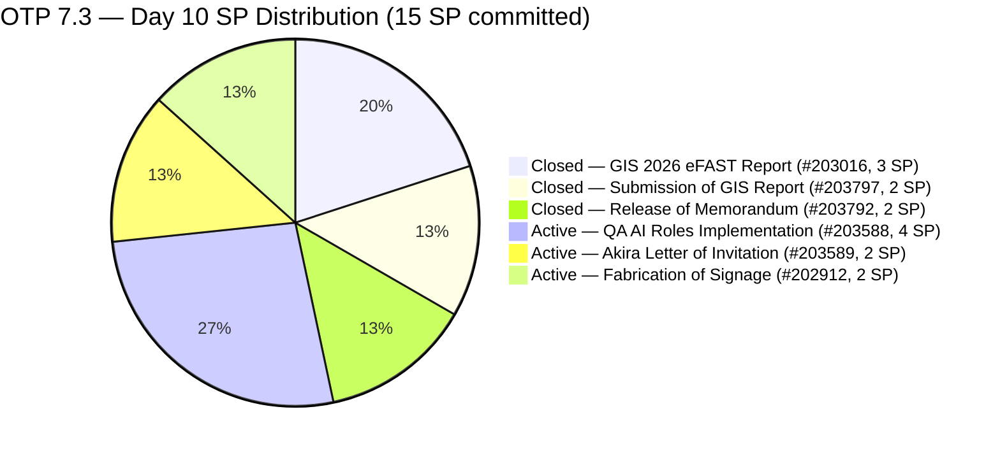
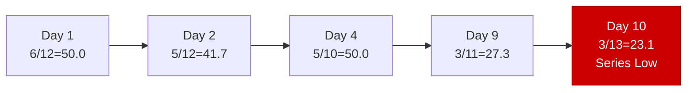
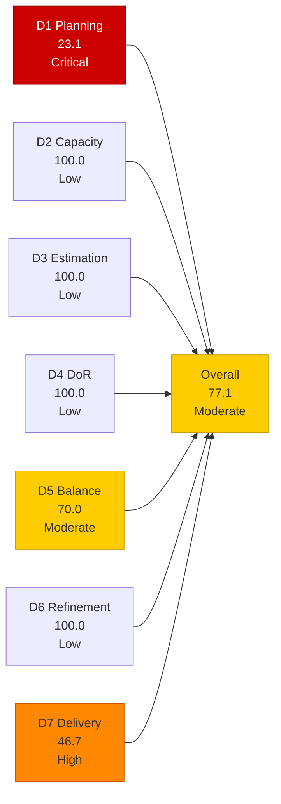
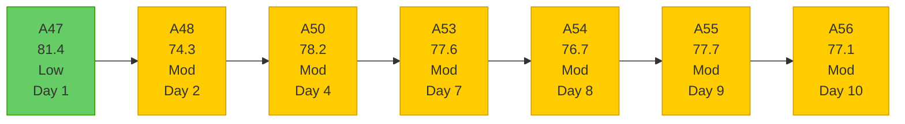

# OTP Team — SAFe Iteration Audit A56
**Date:** 2026-05-13 | **Sprint Day:** 10 of 14 | **Iteration:** 7.3 (May 4 – May 17, 2026)
**Auditor:** Claude Code (ADO SAFe Audit Skill v1) | **Prior Audit:** A55 (2026-05-12 02:02)

---

## 1. Audit Metadata

| Field | Value |
|---|---|
| **Audit ID** | A56 |
| **Report File** | `AUDIT_20260513_0900.md` |
| **Prior Audit** | A55 — `AUDIT_20260512_0202.md` (Overall 77.7, Moderate — 7.3 Day 9) |
| **ADO Project** | OTP (`e7739905-28a3-4ae1-9173-7f6cd13b3494`) |
| **ADO Team** | OTP Team |
| **Iteration** | 7.3 (`86aab8f1-cd46-4fe6-a810-00fba59b46a3`) |
| **Iteration Dates** | May 4 – May 17, 2026 |
| **Sprint Day** | 10 of 14 |
| **Audit Date** | 2026-05-13 09:00 PHT (UTC+8) |
| **Overall Score** | **77.1 — Moderate Risk** |
| **Risk Band** | Moderate (60–79.9) |
| **Visible Backlog Items** | 13 root items |
| **Current Iteration Root Items** | 3 (IterationPath = 7.3) |
| **Full 7.3 Roster** | 6 root items (3 open + 3 Closed) |
| **Capacity Source** | `work_get_team_capacity` — Grace: 1.5 h/day |
| **Project Exceptions Applied** | Single-assignee model (Grace) — D2 scored full |

---

## 2. Executive Summary

| Field | Value |
|---|---|
| **Overall Score** | 77.1 — Moderate Risk |
| **Score vs Prior (A55)** | 77.7 → 77.1 (**−0.6 — regression**) |
| **Sprint Day** | 10 of 14 |
| **Iteration** | 7.3 (May 4 – May 17, 2026) |
| **Open Items in 7.3** | 3 (#202912, #203588, #203589) |
| **Committed SP** | 15 SP (6-item full 7.3 roster) |
| **SP Closed** | 7 SP (#203016=3, #203797=2, #203792=2) |
| **Risk Band** | Moderate (60–79.9) |

**Score regressed −0.6 (77.7 → 77.1) driven by two new 7.4 scope additions.** Items #204117 (Tarpaulin Printing for JIT and Jairosoft Signage, 2 SP) and #204122 (FTC Status of Renewal, 2 SP) were added to the backlog today (May 12 ChangedDate), both assigned to Iteration 7.4. This expands the visible backlog from 11 to 13 items, driving D1 from 27.3 to 23.1 — a new sprint-series low.

**Zero closures on Day 10.** All 3 open 7.3 items (#202912, #203588, #203589) remain Active with unchanged ChangeDates of May 10. This extends the no-closure streak to Day 10, meaning 4 working days have passed since #203792 was closed on Day 9.

**Critical delivery window: 4 days remain.** With 8 SP open, 4 remaining working days, and Grace at 1.5 h/day (6 hours total), full sprint delivery now requires all 3 items closed. The per-SP ratio is 0.75 h/SP — below the critical 1.0 h/SP threshold. Closing #203588 (4 SP) alone crosses the Low Risk threshold at 82.4.

---

## 3. Previous Audit Delta (A55 → A56)

| Dimension | A55 Score | A56 Score | Delta | Driver |
|---|---|---|---|---|
| D1 Iteration Planning | 27.3 | 23.1 | **−4.2** | 2 new items (#204117, #204122) added to 7.4: denominator 11→13; numerator unchanged at 3; 3/13=23.1 |
| D2 Team Capacity | 100.0 | 100.0 | 0.0 | Grace: 1.5 h/day; single-assignee exception unchanged |
| D3 Estimation | 100.0 | 100.0 | 0.0 | All 3 current items remain estimated: #202912=2, #203588=4, #203589=2 SP |
| D4 DoR Compliance | 100.0 | 100.0 | 0.0 | All 3 current items pass DoR; no new 7.3 items added |
| D5 Work Item Balance | 70.0 | 70.0 | 0.0 | All 3 current items remain User Story; structural penalty unchanged |
| D6 Backlog Refinement | 100.0 | 100.0 | 0.0 | All 13 items fresh (newest: #204117/#204122 May 12; oldest: #201815/#201820 May 4 = 9 days) |
| D7 Delivery Predictability | 46.7 | 46.7 | 0.0 | No new closures; 7/15 SP unchanged |
| **Overall** | **77.7** | **77.1** | **−0.6** | D1 decline (−4.2) uncompensated; all other dimensions stable |

### Key Events (A55 → A56)

| Event | Impact |
|---|---|
| **#204117 added** (Tarpaulin Printing for JIT/Jairosoft Signage, 7.4, 2 SP, Grace) | D1: 27.3→23.1 (denominator 11→12, then further to 13); new sprint-series low |
| **#204122 added** (FTC Status of Renewal, 7.4, 2 SP, Grace) | D1: further depression; Philgeps/BIR compliance scope added to 7.4 queue |
| **No closures on Day 10** | D7 stalls at 46.7; Day 10 extends no-closure streak (Days 4–8 stall broken on Day 9, but no further closure on Day 10) |
| #202912, #203588, #203589 states unchanged | All 3 still Active, ChangedDate May 10; no state progression in 3 days |

---

## 4. Current Iteration Snapshot

**Iteration:** 7.3 | **Period:** May 4 – May 17, 2026 | **Sprint Day:** 10 of 14

| Metric | Value |
|---|---|
| Full 7.3 iteration root items | 6 (#202912, #203016, #203588, #203589, #203792, #203797) |
| Open items in 7.3 (backlog view) | 3 (#202912, #203588, #203589) |
| Visible backlog root items | 13 |
| Committed story points | 15 SP |
| SP Closed | 7 SP (#203016=3, #203797=2, #203792=2) |
| SP Active/Open | 8 SP (3 items) |
| Delivery % | 46.7% (7/15 SP) |
| Assignee | Grace (sole; single-assignee model) |
| Daily capacity | 1.5 h/day |
| Days remaining | 4 working days |

### Backlog Path Breakdown (13 visible items)

| IterationPath | Count | Items | New Since A55? |
|---|---|---|---|
| 7.3 (current, open) | 3 | #202912, #203588, #203589 | No |
| 7.4 (next sprint) | 3 | #202913, **#204117**, **#204122** | #204117 and #204122 NEW |
| 7.6 (future PI7) | 1 | #203864 | No |
| 8.1 (PI8 scheduled) | 2 | #201815, #201820 | No |
| PI8 (unscheduled) | 4 | #200679, #200680, #204043, #204044 | No |

### D1 Trend — Visible Backlog vs. Current Items

### Delivery Timeline

| Day | Closure | SP Closed | D7 | Sprint % Elapsed |
|---|---|---|---|---|
| Day 2 (May 5) | #203016 (3 SP) | 3 | 20.0 | 14% |
| Day 3 (May 6) | #203797 (2 SP) | 5 | 33.3 | 21% |
| Days 4–8 (May 7–11) | None | 5 | 33.3 | 29–57% |
| Day 9 (May 12) | #203792 (2 SP) | 7 | 46.7 | 64% |
| **Day 10 (May 13)** | **None** | **7** | **46.7** | **71%** |

---

## 5. Work Item Analysis

### 7.3 Full Iteration Roster (6 items)

| ID | Title | Type | State | SP | Assignee | DoR | ChangedDate | Notes |
|---|---|---|---|---|---|---|---|---|
| #203016 | Generate and Validate GIS 2026 Report for eFAST Submission | User Story | **Closed** | 3 | Grace | ✅ | May 5 | Closed Day 2 |
| #203797 | Submission of GIS Report | User Story | **Closed** | 2 | Grace | ✅ | May 6 | Closed Day 3 |
| #203792 | Release of Memorandum | User Story | **Closed** | 2 | Grace | ✅ | May 12 | Closed Day 9 |
| #203588 | Implementation of QA AI Roles | User Story | Active | 4 | Grace | ✅ | May 10 | 3 days without state change; 4 AC checkboxes |
| #202912 | Fabrication of Signage | User Story | Active | 2 | Grace | ✅ | May 10 | 3 days without state change; vendor coordination item |
| #203589 | Akira to provide signed Letter of Invitation | User Story | Active | 2 | Grace | ✅ | May 10 | 3 days without state change; external dependency (Akira/Japan Embassy) |

### DoR Verification — Current Open Items (3 items)

| ID | Description | AC | Status |
|---|---|---|---|
| #203588 | ≥30 chars ✅ (role definition + tooling framework) | ≥20 chars ✅ (4 AC checkboxes: Tooling Access, Security Clearance, Baseline Metrics, Integration) | ✅ PASS |
| #202912 | ≥30 chars ✅ (safety role + maintenance scope) | ≥20 chars ✅ (safety measures, brgy compliance) | ✅ PASS |
| #203589 | ≥30 chars ✅ (embassy compliance, sponsoring company verification) | ≥20 chars ✅ (accomplished invitation letter for Japan Embassy) | ✅ PASS |

All 3 current items pass DoR. D4 = 100.0.

### Full Visible Backlog (13 items)

| ID | Title | IterationPath | SP | State | Assignee | ChangedDate | Age | New? |
|---|---|---|---|---|---|---|---|---|
| #202912 | Fabrication of Signage | 7.3 | 2 | Active | Grace | May 10 | 3 days | — |
| #203588 | Implementation of QA AI Roles | 7.3 | 4 | Active | Grace | May 10 | 3 days | — |
| #203589 | Akira Letter of Invitation | 7.3 | 2 | Active | Grace | May 10 | 3 days | — |
| #202913 | Installation of Street Signage | 7.4 | 2 | Active | Grace | May 4 | 9 days | — |
| **#204117** | **Tarpaulin Printing for JIT and Jairosoft Signage** | **7.4** | **2** | **New** | **Grace** | **May 12** | **1 day** | **NEW** |
| **#204122** | **FTC Status of renewal** | **7.4** | **2** | **New** | **Grace** | **May 12** | **1 day** | **NEW** |
| #203864 | Release of TCT | 7.6 | 2 | New | Grace | May 6 | 7 days | — |
| #201815 | Physical Installation & Grid Integration | 8.1 | 2 | New | Grace | May 4 | 9 days | — |
| #201820 | Monitoring & Handover | 8.1 | 2 | New | Grace | May 4 | 9 days | — |
| #200679 | File RKS Form 5 with DOLE | PI8 | 2 | New | Grace | May 11 | 2 days | — |
| #200680 | Calculate Separation Pay | PI8 | 2 | New | Grace | May 11 | 2 days | — |
| #204043 | Preparation of H1B Renewal | PI8 | 2 | New | Grace | May 11 | 2 days | — |
| #204044 | FTC GH Derek for schedule and itinerary | PI8 | 2 | New | Grace | May 11 | 2 days | — |

---

## 6. SAFe Compliance Scorecard

| Dimension | Score | Band | Formula | Evidence |
|---|---|---|---|---|
| D1 Iteration Planning | 23.1 | Critical | 3/13 × 100 | 3 open 7.3 items / 13 visible root backlog items; 2 new 7.4 items (#204117, #204122) added today expand denominator 11→13; new sprint-series low |
| D2 Team Capacity | 100.0 | Low | 1/1 × 100 | Grace: 1.5 h/day (Documentation 1h + Requirements 0.5h); single-assignee project exception in force |
| D3 Estimation | 100.0 | Low | 3/3 × 100 | All 3 current items estimated: #202912=2, #203588=4, #203589=2 SP |
| D4 DoR Compliance | 100.0 | Low | 3/3 × 100 | All 3 current items pass desc ≥30 + AC ≥20 non-whitespace chars confirmed |
| D5 Work Item Balance | 70.0 | Moderate | 100 − 30 | All 3 current items User Story (100% > 60%) → −30; no absent-US or spike penalties |
| D6 Backlog Refinement | 100.0 | Low | 13/13 fresh; 0 penalties | All 13 items fresh (newest: #204117/#204122 May 12; oldest: #201815/#201820 May 4 = 9 days; all within 45-day window); 0 stale_90; 0 stale_180; 0 untouched current |
| D7 Delivery Predictability | 46.7 | High | 7/15 × 100 | 7 SP closed / 15 SP committed; no new closures on Day 10; unchanged from A55 |
| **Overall** | **77.1** | **Moderate** | 539.8 / 7 | Average of 7 dimensions |

### Scoring Detail

- **D1:** round(3/13 × 100, 1) = **23.1** *(2 new items #204117/#204122 added to 7.4 today; denominator 11→13; numerator unchanged at 3; new sprint-series low — 3 open 7.3 items out of 13 visible; 10 of 13 items (76.9%) are in non-current iterations)*
- **D2:** round(1/1 × 100, 1) = **100.0** *(Grace sole assignee; 1.5 h/day confirmed via `work_get_team_capacity`; single-assignee project exception applied)*
- **D3:** round(3/3 × 100, 1) = **100.0** *(all 3 current 7.3 items estimated: #202912=2, #203588=4, #203589=2; total 8 SP remaining)*
- **D4:** round(3/3 × 100, 1) = **100.0** *(all 3 current items pass description ≥30 + AC ≥20 chars; confirmed from A55 with no changes)*
- **D5:** All 3 current items User Story (100% > 60%) → −30; US present → 0; no spikes → 0. **70.0**
- **D6:** base=round(13/13×100,1)=100.0; stale_90=0 (oldest items: #201815/#201820 changed May 4 = 9 days; all within 45-day window); stale_180=0; untouched_current: all 3 current items changed May 10 (≥May 4 start) → 0 untouched → **100.0**
- **D7:** Full 7.3 roster: 6 items, 15 SP. Closed: #203016(3)+#203797(2)+#203792(2)=7 SP. round(7/15 × 100, 1) = **46.7** *(no new closures on Day 10)*
- **Overall:** (23.1+100.0+100.0+100.0+70.0+100.0+46.7) / 7 = 539.8 / 7 = **77.1**

### Score Trend — OTP Iteration 7.3

### Recovery Path (4 days remaining)

| Action | D7 → | Overall → | Notes |
|---|---|---|---|
| Current (Day 10) | 46.7 | 77.1 | Baseline — no closures Day 10 |
| Close #203588 (4 SP) | 73.3 | **82.4 ✅ Low Risk** | Single highest-leverage item; 4 remaining days is sufficient |
| Close #202912 (2 SP) | 60.0 | 79.4 | Near Low Risk |
| Close #203589 (2 SP) | 60.0 | 79.4 | Near Low Risk |
| Close #203588 + #202912 (6 SP) | 86.7 | **87.6 ✅ Strong Low Risk** | Achievable in 2–3 days |
| Close all 3 (8 SP) | 100.0 | **91.0 ✅** | Full sprint delivery; requires 4 closures in 4 days |

**Minimum to reach Low Risk: Close #203588 (4 SP) alone → 82.4.**

---

## 7. Dimension Findings

### D1 — Iteration Planning: 23.1 (Critical Risk — New Sprint-Series Low)

**Formula:** `current_iteration_root_items / visible_root_backlog_items × 100 = 3/13 × 100 = 23.1`

D1 has dropped below 25.0 for the first time in the 7.3 sprint series, crossing into Critical territory. Two new 7.4 items were added today:
- **#204117** (Tarpaulin Printing for JIT and Jairosoft Signage, 2 SP, New): Signage visibility work; planning scope for next sprint added while 3 current items remain unresolved.
- **#204122** (FTC Status of Renewal, 2 SP, New): Philgeps/BIR compliance tracking item; added to 7.4 on the same day.

The visible backlog breakdown (13 items) now shows:
- 3 items in current sprint 7.3 = 23.1% actively delivering
- 3 items in 7.4 = next sprint additions growing (was 1 item, now 3)
- 4 items in PI8 unscheduled = 30.8% pipeline float
- 3 items in other future slots (7.6, 8.1) = 23.1% long-range backlog

The recommendation from A55 to pause PI8 additions was not followed — although the new items are in 7.4, not PI8, the D1 compression effect is identical. **Adding future-sprint items while current sprint items remain open is the primary structural driver of the sprint-series D1 low.**

### D2 — Team Capacity: 100.0 (Low Risk)

Grace: 1.5 h/day (Documentation 1h + Requirements 0.5h). Single-assignee project exception in force.

**Remaining bandwidth:** 1.5 h/day × 4 remaining days = **6.0 effective hours**. With 8 SP remaining (3 open items), the per-SP ratio drops to **0.75 h/SP** — below the 0.94 h/SP maintained through Day 9. This is the tightest capacity margin of the sprint. External dependencies (#203589 Akira) and vendor logistics (#202912) consume coordination hours outside the direct SP estimate.

### D3 — Estimation: 100.0 (Low Risk)

All 3 current 7.3 open items estimated: #202912=2, #203588=4, #203589=2 SP. D3 = 100.0. Stable throughout 7.3.

### D4 — DoR Compliance: 100.0 (Low Risk)

All 3 current items pass DoR (Description ≥30 + AC ≥20 non-whitespace chars). D4 = 100.0. Consistent since A47.

### D5 — Work Item Balance: 70.0 (Moderate Risk)

All 3 current items are User Story (100% dominant type > 60% threshold → −30). D5 = 70.0. Structural constraint of OTP's administrative/operational model. Unchanged throughout the sprint.

### D6 — Backlog Refinement: 100.0 (Low Risk)

All 13 visible backlog items were changed within the last 45 days (newest: #204117/#204122 changed May 12 — yesterday; oldest: #201815/#201820 changed May 4 = 9 days ago). Zero stale_90, zero stale_180. All 3 current 7.3 items changed May 10 (≥ iteration start May 4) → zero untouched current items. The two new 7.4 items maintain D6 freshness.

### D7 — Delivery Predictability: 46.7 (High Risk — Stall Day 2)

**Formula:** `closed_story_points / committed_story_points × 100 = 7/15 × 100 = 46.7`

**No closure on Day 10.** This is the second consecutive day with no closure since #203792 was closed on Day 9. The open items analysis:

| Item | State | SP | External? | Day-10 Risk |
|---|---|---|---|---|
| #203588 (QA AI Roles Implementation) | Active | 4 | No | Controllable — 4 AC checkboxes; Grace-owned; close today |
| #202912 (Fabrication of Signage) | Active | 2 | Yes (vendor) | Vendor fabrication lead time risk; 10 days elapsed |
| #203589 (Akira Letter of Invitation) | Active | 2 | Yes (Akira/embassy) | External party; no update since May 10 |

**Sprint math at Day 10 (71% elapsed, 46.7% delivered):**
- Gap: 53.3% of SP still open against 29% remaining sprint time
- Ratio: 4 remaining days vs. 8 SP = 2 SP/day closure rate needed
- At 0.75 h/SP (6 hours / 8 SP), full delivery is mathematically possible but leaves zero buffer for delays

---

## 8. Risks and Bottlenecks

| # | Risk | Severity | Dimension | Detail |
|---|---|---|---|---|
| R1 | D1 = 23.1 — Critical band, sprint-series low; new scope additions during active sprint | **Critical** | D1 | 2 new 7.4 items added on Day 10 while 3 current items remain open. D1 crossed into Critical band (<40 threshold would require D1=40 = 5.2/13). Each additional future-sprint item added without resolving current items drives D1 lower. If all 3 current items are closed before sprint end, D1 resolves naturally (closed items drop from backlog, reducing denominator). |
| R2 | D7 delivery gap — 46.7% delivered, 71% elapsed, 4 days remaining | **Critical** | D7 | Sprint is 71% through with only 46.7% SP delivered. 8 SP remain across 3 items in 4 days. External dependencies (#203589, #202912) threaten full delivery. Day 10 no-closure extends the post-Day-9 stall. |
| R3 | #203589 (Akira Letter of Invitation) — external dependency, 3 days without state change | **High** | D7 | External party (Akira/Japan Embassy) dependency. State unchanged since May 10 (Day 7 → Active). No confirmation of Akira contact status visible in ADO. With 4 days remaining, if Akira cannot confirm by May 14 (allowing 3 days embassy processing), this item must move to 7.4. |
| R4 | #202912 (Fabrication of Signage) — vendor coordination, 10 days elapsed | **High** | D7 | Physical vendor item. 10 working days have elapsed since sprint start. Vendor fabrication lead times typically exceed 5–10 business days. Without confirmed delivery timeline today, carryover to 7.4 is the expected outcome. |
| R5 | #203588 (QA AI Roles Implementation) — 3 days without update | **High** | D7 | This is the highest-SP controllable item (4 SP). State = Active since Day 6 (May 9). No update in 3 days. Closing this item alone crosses Low Risk threshold at 82.4. Day 10 is the latest point at which AC verification and closure can be safely executed without risk. |
| R6 | Scope addition pattern — 2 new 7.4 items added on Day 10 | **Moderate** | D1 | Adding future-sprint items during the closing 4 days of a sprint is a structural anti-pattern. Recommendation A55-R4 (pause future additions until 7.3 closes) was not followed. |
| R7 | D5 = 70.0 — persistent dominant-type structural penalty | Moderate | D5 | Structural; unchanged throughout 7.3. Requires 3+ non-User-Story items in 7.4 planning. |

---

## 9. Prioritized Recommendations

1. **[CRITICAL — D7, Today]** Close #203588 (Implementation of QA AI Roles, 4 SP, Active). Day 10 is the last viable closure day for a complex 4-SP item. Verify all 4 AC checkboxes now: (a) AI testing platform provisioned and SSO-integrated? (b) Data Usage Policy signed off? (c) Baseline Metrics (Manual vs. Automation time-spend) recorded? (d) AI tool connected to code repository (GitHub/GitLab)? If any checkbox is incomplete, complete it now — do not wait. Closing this item alone raises overall from 77.1 to 82.4 (Low Risk). Waiting until Day 11 or later increases the probability of sprint carryover.

2. **[CRITICAL — D7, Today — Decision Required]** Disposition #202912 (Fabrication of Signage, 2 SP, Active, 10 days elapsed). Vendor item at Day 10. Determine: (a) Has the vendor confirmed a fabrication completion date? (b) Can the fabricated signage be delivered and verified before May 17? If NO to either, move to 7.4 immediately. Moving to 7.4 removes it from the D7 denominator pressure and the D1 numerator simultaneously, improving both scores in the final audit. If YES, escalate to Grace to close the item today with evidence of vendor delivery.

3. **[CRITICAL — D7, Today — Decision Required]** Disposition #203589 (Akira Letter of Invitation, 2 SP, Active). External dependency at Day 10. Determine: (a) Has Akira (Japan sponsor) confirmed and delivered the signed letter? (b) Is the embassy appointment still within May 17? If Akira cannot confirm delivery by May 14 (to allow minimum 3 days for embassy processing), move to 7.4 immediately. Document the dependency handoff as a comment in ADO.

4. **[HIGH — D1, Immediate]** Freeze scope additions to the OTP backlog until all 3 open 7.3 items are closed or formally carried to 7.4. D1 = 23.1 is the sprint-series Critical low. Two 7.4 items were added today; each additional item dropped into any future path suppresses D1 further. The 7.4 queue now has 3 items (#202913, #204117, #204122) before 7.4 has even started sprint planning.

5. **[MEDIUM — 7.4 Sprint Planning]** In 7.4 planning, include 3+ non-User-Story item types to eliminate the D5 −30 penalty. The 7.4 queue already contains multiple signage/compliance work items (#202913, #204117, #204122) — explore whether any are Enablers, Defects, or Tasks that could be classified accordingly.

6. **[LOW — PI8 Backlog Hygiene]** Schedule 4 unscheduled PI8 items (#200679, #200680, #204043, #204044) to specific PI8 iterations (8.1, 8.2, etc.). Unscheduled items contribute to D1 suppression.

---

## 10. Evidence Gaps and Limitations

| Gap | Impact | Mitigation |
|---|---|---|
| #203016, #203797, #203792 not in backlog view (Closed) | D7 committed SP uses full 6-item 7.3 roster (15 SP) confirmed in A47 | All 3 confirmed Closed in A47–A55; consistent with ADO excluding Closed items from backlog |
| #203588/#202912/#203589 ChangedDate = May 10 — no sub-task activity visibility | Cannot confirm sub-task-level progress on open items since Day 7 | Root-item states are the definitive D7 signal; task data is supplementary; states unchanged per ADO batch |
| #203589 "Active" state — no direct ADO evidence of Akira contact since May 10 | External dependency status unconfirmed; item shows no comments visible via batch query | State = Active confirmed; no ChangedDate update since May 10 = 3 days; risk elevated accordingly |
| Vendor status for #202912 not visible in ADO | No work log or comment data showing vendor timeline | Physical fabrication status requires direct Grace/vendor contact; flagged as High Risk (R4) |
| Capacity confirmed at 1.5 h/day but no time-log breakdown | Cannot verify actual hours expended on Day 10 activities | Consistent with all prior OTP audits; capacity unchanged |

---

*Audit A56 produced by Claude Code — ADO SAFe Audit Skill v1. SAFe 6.0 framework. Sprint Day 10 of 14. Key findings: (1) Score regressed −0.6 (77.7→77.1) — 2 new 7.4 items (#204117 Tarpaulin Printing, #204122 FTC Status) added today expand visible backlog 11→13 and drive D1 to new sprint-series low of 23.1 (Critical band); (2) No closures on Day 10 — D7 stalls at 46.7% with 71% of sprint elapsed; (3) 4 working days remain with 8 SP open — 0.75 h/SP ratio leaves no buffer; (4) Closing #203588 (4 SP) alone crosses Low Risk at 82.4 — this is the Day 10 priority action; (5) Both #202912 (vendor, 10 days) and #203589 (Akira, external) require disposition decisions today to protect sprint predictability.*
