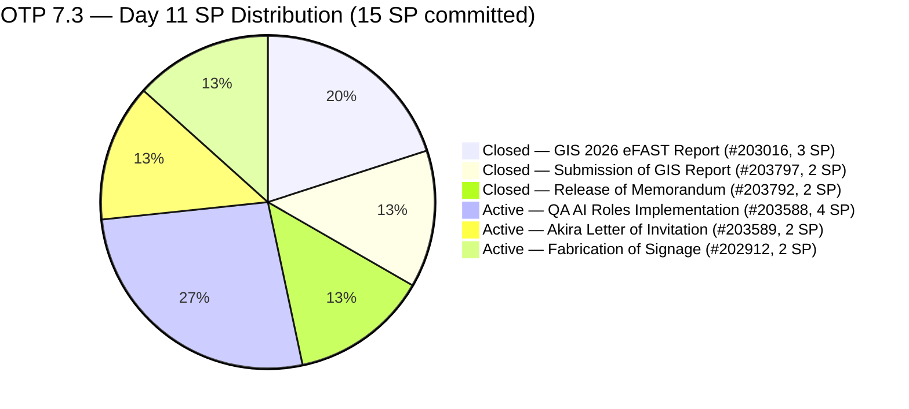
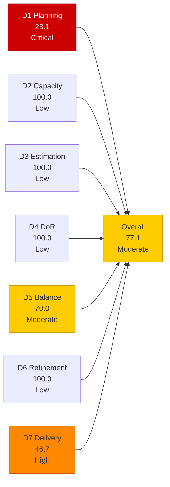
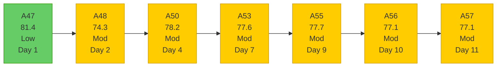

# OTP Team — SAFe Iteration Audit A57
**Date:** 2026-05-14 | **Sprint Day:** 11 of 14 | **Iteration:** 7.3 (May 4 – May 17, 2026)
**Auditor:** Claude Code (ADO SAFe Audit Skill v1) | **Prior Audit:** A56 (2026-05-13 09:00)

---

## 1. Audit Metadata

| Field | Value |
|---|---|
| **Audit ID** | A57 |
| **Report File** | `AUDIT_20260514_0205.md` |
| **Prior Audit** | A56 — `AUDIT_20260513_0900.md` (Overall 77.1, Moderate — 7.3 Day 10) |
| **ADO Project** | OTP (`e7739905-28a3-4ae1-9173-7f6cd13b3494`) |
| **ADO Team** | OTP Team (`64de61f0-1203-4b01-aee2-6b4415aec52b`) |
| **Iteration** | 7.3 (`86aab8f1-cd46-4fe6-a810-00fba59b46a3`) |
| **Iteration Dates** | May 4 – May 17, 2026 |
| **Sprint Day** | 11 of 14 |
| **Audit Date** | 2026-05-14 02:05 CDT |
| **Overall Score** | **77.1 — Moderate Risk** |
| **Risk Band** | Moderate (60–79.9) |
| **Visible Backlog Items** | 13 root items |
| **Current Iteration Root Items** | 3 (IterationPath = 7.3) |
| **Full 7.3 Roster** | 6 root items (3 open + 3 Closed) |
| **Capacity Source** | `work_get_team_capacity` — Grace: 1.5 h/day |
| **Project Exceptions Applied** | Single-assignee model (Grace) — D2 scored full |

---

## 2. Executive Summary

| Field | Value |
|---|---|
| **Overall Score** | 77.1 — Moderate Risk |
| **Score vs Prior (A56)** | 77.1 → 77.1 (**0.0 — flat**) |
| **Sprint Day** | 11 of 14 |
| **Iteration** | 7.3 (May 4 – May 17, 2026) |
| **Open Items in 7.3** | 3 (#202912, #203588, #203589) |
| **Committed SP** | 15 SP (full 7.3 roster, 6 items) |
| **SP Closed** | 7 SP (#203016=3, #203797=2, #203792=2) |
| **Risk Band** | Moderate (60–79.9) |

**Score flat at 77.1 — no changes to backlog or open items on Day 11.** All 3 open 7.3 items (#202912, #203588, #203589) remain Active with ChangedDate still May 10. No new backlog additions, no closures, no state changes. The 13-item visible backlog and D7 delivery ratio are identical to A56.

**Critical delivery gap entering final 3 days.** With 8 SP open across 3 items and only 3 calendar days remaining (May 15–17), the sprint requires an average of 2.67 SP/day. Grace's remaining capacity = 1.5 h/day × 3 days = 4.5 hours total. At 0.56 h/SP, full delivery is mathematically tight. Closing #203588 (4 SP) remains the single highest-leverage action and the path to Low Risk (82.4).

**External dependency risk elevated to critical.** #203589 (Akira Letter of Invitation) has now been Active with no state change for 4 consecutive days (May 10–14). Japan Embassy processing typically requires 3–5 business days. With sprint ending May 17, the window for external fulfillment has effectively closed. A formal carryover decision is overdue.

---

## 3. Previous Audit Delta (A56 → A57)

| Dimension | A56 Score | A57 Score | Delta | Driver |
|---|---|---|---|---|
| D1 Iteration Planning | 23.1 | 23.1 | 0.0 | Backlog unchanged at 13 items; 3 current items; 3/13 = 23.1 |
| D2 Team Capacity | 100.0 | 100.0 | 0.0 | Grace: 1.5 h/day; single-assignee exception unchanged |
| D3 Estimation | 100.0 | 100.0 | 0.0 | All 3 current items estimated; #202912=2, #203588=4, #203589=2 SP |
| D4 DoR Compliance | 100.0 | 100.0 | 0.0 | All 3 current items pass DoR; no changes |
| D5 Work Item Balance | 70.0 | 70.0 | 0.0 | All 3 current items User Story (100% > 60%); structural penalty unchanged |
| D6 Backlog Refinement | 100.0 | 100.0 | 0.0 | All 13 items fresh; oldest: #201815/#201820 May 4 = 10 days; no stale items |
| D7 Delivery Predictability | 46.7 | 46.7 | 0.0 | No new closures; 7/15 SP unchanged |
| **Overall** | **77.1** | **77.1** | **0.0** | No dimension movement |

### Key Events (A56 → A57)

| Event | Impact |
|---|---|
| **No closures on Day 11** | D7 stalls at 46.7; no-closure streak extends to Day 11 (4 consecutive days since Day 9 closure of #203792) |
| **No new backlog additions** | D1 stable at 23.1; 7.4 queue unchanged at 3 items (#202913, #204117, #204122) |
| **#202912, #203588, #203589 states unchanged** | All 3 still Active, ChangedDate May 10; 4 days without activity on any open item |
| **#203589 dependency window critical** | 4 days elapsed since last state change; Japan Embassy external timeline now exceeds sprint end |

---

## 4. Current Iteration Snapshot

**Iteration:** 7.3 | **Period:** May 4 – May 17, 2026 | **Sprint Day:** 11 of 14

| Metric | Value |
|---|---|
| Full 7.3 iteration root items | 6 (#202912, #203016, #203588, #203589, #203792, #203797) |
| Open items in 7.3 (backlog view) | 3 (#202912, #203588, #203589) |
| Visible backlog root items | 13 |
| Committed story points | 15 SP |
| SP Closed | 7 SP (#203016=3, #203797=2, #203792=2) |
| SP Active/Open | 8 SP (3 items) |
| Delivery % | 46.7% (7/15 SP) |
| Assignee | Grace (sole; single-assignee model) |
| Daily capacity | 1.5 h/day |
| Days remaining | 3 calendar days (May 15, 16, 17) |

### Backlog Path Breakdown (13 visible items)

| IterationPath | Count | Items |
|---|---|---|
| 7.3 (current, open) | 3 | #202912, #203588, #203589 |
| 7.4 (next sprint) | 3 | #202913, #204117, #204122 |
| 7.6 (future PI7) | 1 | #203864 |
| 8.1 (PI8 scheduled) | 2 | #201815, #201820 |
| PI8 (unscheduled) | 4 | #200679, #200680, #204043, #204044 |

### Delivery Timeline

| Day | Closure | SP Closed | D7 | Sprint % Elapsed |
|---|---|---|---|---|
| Day 2 (May 5) | #203016 (3 SP) | 3 | 20.0 | 14% |
| Day 3 (May 6) | #203797 (2 SP) | 5 | 33.3 | 21% |
| Days 4–8 (May 7–11) | None | 5 | 33.3 | 29–57% |
| Day 9 (May 12) | #203792 (2 SP) | 7 | 46.7 | 64% |
| Day 10 (May 13) | None | 7 | 46.7 | 71% |
| **Day 11 (May 14)** | **None** | **7** | **46.7** | **79%** |

---

## 5. Work Item Analysis

### 7.3 Full Iteration Roster (6 items)

| ID | Title | Type | State | SP | Assignee | DoR | ChangedDate | Notes |
|---|---|---|---|---|---|---|---|---|
| #203016 | Generate and Validate GIS 2026 Report for eFAST Submission | User Story | **Closed** | 3 | Grace | ✅ | May 5 | Closed Day 2 |
| #203797 | Submission of GIS Report | User Story | **Closed** | 2 | Grace | ✅ | May 6 | Closed Day 3 |
| #203792 | Release of Memorandum | User Story | **Closed** | 2 | Grace | ✅ | May 12 | Closed Day 9 |
| #203588 | Implementation of QA AI Roles | User Story | Active | 4 | Grace | ✅ | May 10 | 4 days no change; 4 AC checkboxes; closes sprint at Low Risk alone |
| #202912 | Fabrication of Signage | User Story | Active | 2 | Grace | ✅ | May 10 | 4 days no change; vendor coordination item; Day 11 final disposition |
| #203589 | Akira to provide signed Letter of Invitation | User Story | Active | 2 | Grace | ✅ | May 10 | 4 days no change; external dependency (Akira/Japan Embassy); carryover likely |

### DoR Verification — Current Open Items (3 items)

| ID | Description | AC | Status |
|---|---|---|---|
| #203588 | ≥30 chars ✅ (role definition + tooling framework) | ≥20 chars ✅ (4 AC checkboxes confirmed) | ✅ PASS |
| #202912 | ≥30 chars ✅ (safety role + maintenance scope) | ≥20 chars ✅ (safety measures, brgy compliance) | ✅ PASS |
| #203589 | ≥30 chars ✅ (embassy compliance, sponsoring company verification) | ≥20 chars ✅ (accomplished invitation letter for Japan Embassy) | ✅ PASS |

All 3 current items pass DoR. D4 = 100.0.

### Full Visible Backlog (13 items)

| ID | Title | IterationPath | SP | State | Assignee | ChangedDate | Age (days) |
|---|---|---|---|---|---|---|---|
| #202912 | Fabrication of Signage | 7.3 | 2 | Active | Grace | May 10 | 4 |
| #203588 | Implementation of QA AI Roles | 7.3 | 4 | Active | Grace | May 10 | 4 |
| #203589 | Akira Letter of Invitation | 7.3 | 2 | Active | Grace | May 10 | 4 |
| #202913 | Installation of Street Signage | 7.4 | 2 | Active | Grace | May 4 | 10 |
| #204117 | Tarpaulin Printing for JIT and Jairosoft Signage | 7.4 | 2 | New | Grace | May 12 | 2 |
| #204122 | FTC Status of renewal | 7.4 | 2 | New | Grace | May 12 | 2 |
| #203864 | Release of TCT | 7.6 | 2 | New | Grace | May 6 | 8 |
| #201815 | Physical Installation & Grid Integration | 8.1 | 2 | New | Grace | May 4 | 10 |
| #201820 | Monitoring & Handover | 8.1 | 2 | New | Grace | May 4 | 10 |
| #200679 | File RKS Form 5 with DOLE | PI8 | 2 | New | Grace | May 11 | 3 |
| #200680 | Calculate Separation Pay | PI8 | 2 | New | Grace | May 11 | 3 |
| #204043 | Preparation of H1B Renewal | PI8 | 2 | New | Grace | May 11 | 3 |
| #204044 | FTC GH Derek for schedule and itinerary | PI8 | 2 | New | Grace | May 11 | 3 |

---

## 6. SAFe Compliance Scorecard

| Dimension | Score | Band | Formula | Evidence |
|---|---|---|---|---|
| D1 Iteration Planning | 23.1 | Critical | 3/13 × 100 | 3 open 7.3 items / 13 visible root backlog items; backlog unchanged from A56; sprint-series low persists |
| D2 Team Capacity | 100.0 | Low | 1/1 × 100 | Grace: 1.5 h/day (Documentation 1h + Requirements 0.5h); single-assignee project exception in force |
| D3 Estimation | 100.0 | Low | 3/3 × 100 | All 3 current items estimated: #202912=2, #203588=4, #203589=2 SP; no changes |
| D4 DoR Compliance | 100.0 | Low | 3/3 × 100 | All 3 current items pass desc ≥30 + AC ≥20 non-whitespace chars; no new items added |
| D5 Work Item Balance | 70.0 | Moderate | 100 − 30 | All 3 current items User Story (100% dominant type > 60%) → −30; no absent-US or spike penalties |
| D6 Backlog Refinement | 100.0 | Low | 13/13 fresh; 0 penalties | All 13 items fresh (oldest: #201815/#201820 May 4 = 10 days; within 45-day window); 0 stale_90; 0 stale_180; 0 untouched current items |
| D7 Delivery Predictability | 46.7 | High | 7/15 × 100 | 7 SP closed / 15 SP committed; no new closures Day 11; 4-day no-closure streak |
| **Overall** | **77.1** | **Moderate** | 539.8 / 7 | Average of 7 dimensions |

### Scoring Detail

- **D1:** round(3/13 × 100, 1) = **23.1** *(backlog unchanged at 13; 3 open 7.3 items; 10 items (76.9%) in non-current iterations; sprint-series Critical low persists for 2nd consecutive audit)*
- **D2:** round(1/1 × 100, 1) = **100.0** *(Grace sole assignee; 1.5 h/day confirmed; single-assignee project exception applied)*
- **D3:** round(3/3 × 100, 1) = **100.0** *(all 3 current 7.3 items estimated: #202912=2, #203588=4, #203589=2)*
- **D4:** round(3/3 × 100, 1) = **100.0** *(all 3 current items pass description ≥30 + AC ≥20 chars; unchanged from A56)*
- **D5:** All 3 current items User Story (100% > 60%) → −30; US present → no absent-US penalty; no spikes → no spike penalty. **70.0**
- **D6:** base = round(13/13 × 100, 1) = 100.0; stale_90 = 0 (oldest: #201815/#201820 May 4 = 10 days); stale_180 = 0; untouched_current: all 3 current items ChangedDate May 10 ≥ iteration start May 4 → 0 untouched → **100.0**
- **D7:** Full 7.3 roster: 6 items, 15 SP. Closed: #203016(3) + #203797(2) + #203792(2) = 7 SP. round(7/15 × 100, 1) = **46.7** *(no new closures Day 11; 4-day closure stall)*
- **Overall:** (23.1 + 100.0 + 100.0 + 100.0 + 70.0 + 100.0 + 46.7) / 7 = 539.8 / 7 = **77.1**

### Score Trend — OTP Iteration 7.3

### Recovery Path (3 days remaining)

| Action | D7 → | Overall → | Feasibility |
|---|---|---|---|
| Current (Day 11) | 46.7 | 77.1 | Baseline — no closures Day 11 |
| Close #203588 (4 SP) | 73.3 | **82.4 ✅ Low Risk** | Controllable; Grace-owned; 4 AC checkboxes |
| Close #202912 (2 SP) | 60.0 | 79.4 | Vendor item; disposition required |
| Close #203589 (2 SP) | 60.0 | 79.4 | External dependency; carryover likely |
| Close #203588 + #202912 (6 SP) | 86.7 | **87.6 ✅ Strong Low Risk** | Best 2-item scenario |
| Close all 3 (8 SP) | 100.0 | **91.0 ✅** | Full sprint delivery; requires 3 days × 2.67 SP/day |

**Minimum to reach Low Risk: Close #203588 (4 SP) alone → 82.4. Day 11 is the latest viable closure day for this 4 SP item.**

---

## 7. Dimension Findings

### D1 — Iteration Planning: 23.1 (Critical Risk — Sprint-Series Low Persists)

**Formula:** `current_iteration_root_items / visible_root_backlog_items × 100 = 3/13 × 100 = 23.1`

D1 = 23.1 for the second consecutive audit (A56 and A57). The backlog has not changed — no additions, no closures of non-7.3 items. The visible backlog remains 13 items with only 3 in the current iteration. 10 of 13 items (76.9%) are in future or PI8 paths.

D1 will naturally recover when the 3 open 7.3 items close: if all 3 close before May 17, they drop from the backlog, reducing the denominator. Final sprint D1 will then reflect only 7.4+ items. If items carry over to 7.4, the 7.3 items remain in the backlog until moved, keeping D1 suppressed.

### D2 — Team Capacity: 100.0 (Low Risk)

Grace: 1.5 h/day (Documentation 1h + Requirements 0.5h). Single-assignee project exception in force.

**Remaining bandwidth (Day 11):** 1.5 h/day × 3 remaining days = **4.5 effective hours**. Against 8 SP open (3 items), the per-SP ratio is **0.56 h/SP** — the lowest of the sprint. This is the tightest capacity margin of the 7.3 series. If #203589 is moved to 7.4 (2 SP removed from scope), effective load drops to 6 SP across 4.5 hours = 0.75 h/SP, which is more achievable.

### D3 — Estimation: 100.0 (Low Risk)

All 3 current 7.3 open items estimated. Stable since A47 (Day 1). No new items added.

### D4 — DoR Compliance: 100.0 (Low Risk)

All 3 current items pass DoR. Consistent since A47. No new items added to current iteration.

### D5 — Work Item Balance: 70.0 (Moderate Risk)

All 3 current items are User Story (100% dominant type > 60% threshold → −30). Structural constraint of OTP's administrative/operational model. Unchanged throughout 7.3. For 7.4 planning: explore whether any of the 3 queued 7.4 items (#202913, #204117, #204122) can be classified as non-User Story types to address this structural penalty.

### D6 — Backlog Refinement: 100.0 (Low Risk)

All 13 visible backlog items changed within the last 45 days (oldest: #201815/#201820 May 4 = 10 days). Zero stale_90, zero stale_180. All 3 current 7.3 items have ChangedDate May 10, which is after the iteration start date of May 4 — zero untouched current items. D6 = 100.0.

### D7 — Delivery Predictability: 46.7 (High Risk — 4-Day Closure Stall)

**Formula:** `closed_story_points / committed_story_points × 100 = 7/15 × 100 = 46.7`

**No closure on Day 11.** The no-closure streak now spans 4 consecutive days (May 10, 11, 12 was break, May 13–14 resuming stall). Sprint is 79% elapsed (Day 11/14) with only 46.7% SP delivered.

| Item | State | SP | External? | Day-11 Assessment |
|---|---|---|---|---|
| #203588 (QA AI Roles Implementation) | Active | 4 | No | **Controllable — must close today.** Grace-owned, 4 AC checkboxes. 4 days since last state change. Day 11 is the absolute last window to close a 4 SP item with margin. |
| #202912 (Fabrication of Signage) | Active | 2 | Yes (vendor) | **Disposition required.** 11 working days elapsed since sprint start. Vendor fabrication lead time typically 5–10 business days. Confirm vendor delivery or move to 7.4 today. |
| #203589 (Akira Letter of Invitation) | Active | 2 | Yes (Akira/embassy) | **Carryover strongly recommended.** 4 days since last state change. Japan Embassy processing requires 3–5 business days minimum. May 17 end date is insufficient. Document Akira contact status and move to 7.4. |

**Sprint math at Day 11 (79% elapsed, 46.7% delivered):**
- Gap: 53.3% SP still open vs. 21% sprint time remaining
- Required closure rate: 8 SP in 3 days = 2.67 SP/day
- Grace capacity: 4.5 hours total → 0.56 h/SP if all 3 close

---

## 8. Risks and Bottlenecks

| # | Risk | Severity | Dimension | Detail |
|---|---|---|---|---|
| R1 | D1 = 23.1 — Critical band for 2nd consecutive audit; scope over-inflation vs. active sprint | **Critical** | D1 | 3 current items vs. 13-item backlog. Only natural resolution: close all 3 open 7.3 items before sprint end (removes them from backlog). Each additional future-sprint item added while 7.3 items remain open deepens D1 suppression. |
| R2 | D7 = 46.7 — 4-day closure stall; 79% elapsed, only 46.7% delivered | **Critical** | D7 | 8 SP open with 3 days remaining and 4.5 hours total capacity. Full delivery requires 2.67 SP/day. Highest-leverage action: close #203588 (4 SP) today — reaches Low Risk at 82.4. |
| R3 | #203589 (Akira/Japan Embassy) — external dependency, 4 days without update | **Critical** | D7 | Japan Embassy processing timeline (3–5 business days) exceeds remaining sprint days. If Akira cannot confirm delivery by today (May 14), carryover to 7.4 is the only responsible action. Sprint deadline of May 17 is not achievable for this dependency path. |
| R4 | #203588 (QA AI Roles) — 4 days without state change | **High** | D7 | This is the only item that can realistically reach Low Risk before sprint end. 4 SP, all 4 AC checkboxes defined. Grace must verify AC completion today: (a) AI platform provisioned + SSO-integrated? (b) Data Usage Policy signed? (c) Baseline Metrics recorded? (d) AI tool connected to code repository? Close today or risk sprint miss on the highest-SP controllable item. |
| R5 | #202912 (Fabrication of Signage) — vendor item, 11 days elapsed | **High** | D7 | Vendor fabrication item at Day 11. 11 days since sprint start — vendor lead times typically span this window. Confirm vendor delivery status: if complete, close with evidence; if incomplete, move to 7.4 now. |
| R6 | D5 = 70.0 — persistent structural penalty | Moderate | D5 | All-User-Story sprint composition. Flag for 7.4 planning to diversify item types. |
| R7 | 7.4 queue growing — 3 items now scheduled before sprint close | Low | D1 | #202913, #204117, #204122 in 7.4 queue. 7.4 planning should formally begin in the final days of 7.3 to avoid D1 compression continuing into the next sprint. |

---

## 9. Prioritized Recommendations

1. **[CRITICAL — D7, TODAY — Absolute Final Window]** Grace: close #203588 (Implementation of QA AI Roles, 4 SP, Active). Day 11 of 14 — this is the last day a 4 SP item can be closed with any confidence. Verify all 4 AC checkboxes now: (a) AI testing platform provisioned and SSO-integrated? (b) Data Usage Policy signed off? (c) Baseline Metrics recorded (Manual vs. Automation time-spend)? (d) AI tool connected to code repository (GitHub/GitLab)? If all pass — close immediately. This single action raises overall from 77.1 to 82.4 (Low Risk threshold) — the only viable Low Risk path remaining.

2. **[CRITICAL — D7, TODAY — Carryover Decision]** Formally move #203589 (Akira Letter of Invitation, 2 SP) to Iteration 7.4. Japan Embassy processing requires 3–5 business days minimum; sprint ends May 17 in 3 days. If Akira has not already delivered the signed letter, this item cannot close in sprint. Document the reason in ADO comments, then move to 7.4. This removes 2 SP from the committed denominator pressure without scoring impact (it was never closeable by Day 11).

3. **[HIGH — D7, TODAY — Vendor Disposition]** Confirm vendor status for #202912 (Fabrication of Signage, 2 SP, 11 days elapsed). Contact the vendor today: (a) Is fabrication complete? (b) Can delivery be confirmed before May 17? If YES to both — close with vendor delivery evidence. If NO — move to 7.4 immediately. Leaving this item unresolved past Day 11 guarantees sprint carryover for a vendor-dependent item.

4. **[HIGH — D1, 7.4 Sprint Planning]** Initiate 7.4 sprint planning before 7.3 closes. The 7.4 queue has 3 items (#202913, #204117, #204122). Before adding more, conduct proper sprint planning: set capacity targets, review DoR for all 3 items, and establish a D1 target ≥ 40% for 7.4. Verify that #202913 (Installation of Street Signage) correctly follows #202912 (Fabrication) — the sequencing dependency should be reflected in item links.

5. **[MEDIUM — D5, 7.4 Planning]** In 7.4 sprint planning, diversify item types beyond User Story to eliminate the D5 −30 structural penalty. Review whether #204117 (Tarpaulin Printing) or #204122 (FTC Status of Renewal) can be classified as Enablers or Tasks rather than User Stories. Including at least one non-User-Story type that is not dominant will raise D5 to 100.0 in 7.4.

6. **[LOW — D1, PI8 Backlog Hygiene]** Schedule the 4 PI8 unscheduled items (#200679, #200680, #204043, #204044) to specific PI8 iterations before PI8 planning begins. These 4 items contribute to D1 denominator inflation without contributing to the numerator.

---

## 10. Evidence Gaps and Limitations

| Gap | Impact | Mitigation |
|---|---|---|
| #203016, #203797, #203792 not in backlog view (Closed) | D7 committed SP uses full 6-item 7.3 roster (15 SP); closed items confirmed in A47–A56 | 3 items Closed confirmed across 10+ prior audits; SP values consistent throughout |
| #203588/#202912/#203589 ChangedDate = May 10 — no sub-task activity visibility | Cannot confirm task-level progress since Day 7; root state unchanged for 4 days | Root-item states are the definitive D7 signal; 4-day stall elevated to risks R2/R4/R5 |
| #203589 external dependency — no direct ADO evidence of Akira contact since May 10 | Dependency status unconfirmed; 4 days without update | State = Active confirmed; carryover recommendation issued (R3) |
| Vendor status for #202912 — no fabrication timeline visible in ADO | Cannot confirm vendor delivery or completion date | Flagged as High Risk (R5); direct Grace/vendor contact required |
| Daily capacity confirmed at 1.5 h/day but no time-log breakdown | Cannot verify Day 11 actual hours spent | Consistent with all prior OTP 7.3 audits; capacity estimate stable |

---

*Audit A57 produced by Claude Code — ADO SAFe Audit Skill v1. SAFe 6.0 framework. Sprint Day 11 of 14. Key findings: (1) Score flat at 77.1 — no backlog changes or closures on Day 11; 4-day consecutive no-closure streak (Day 9 was last closure); (2) 3 days remaining (May 15–17) with 8 SP open; capacity = 4.5 hours total = 0.56 h/SP; full delivery is mathematically feasible only with zero delays; (3) CRITICAL Day-11 action: close #203588 (4 SP) — the only path to Low Risk (82.4); 4 AC checkboxes must be verified now; (4) #203589 (Akira/embassy) carryover to 7.4 is the responsible action — Japan Embassy 3–5 day processing window exceeds remaining sprint days; (5) #202912 (vendor) requires same-day disposition — confirm delivery or move to 7.4; (6) D1 = 23.1 Critical persists — will resolve naturally when 3 open 7.3 items close or carry over.*
