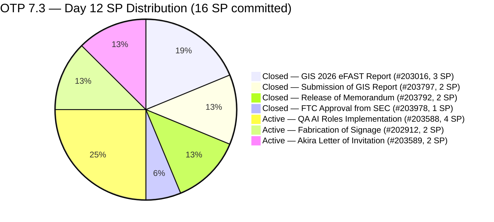
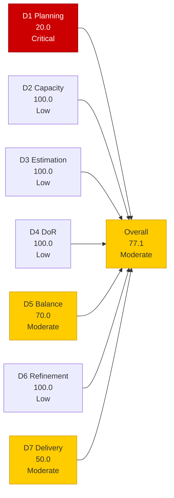
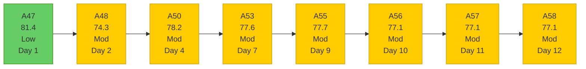

# OTP Team — SAFe Iteration Audit A58
**Date:** 2026-05-15 | **Sprint Day:** 12 of 14 | **Iteration:** 7.3 (May 4 – May 17, 2026)
**Auditor:** Claude Code (ADO SAFe Audit Skill v1) | **Prior Audit:** A57 (2026-05-14 02:05)

---

## 1. Audit Metadata

| Field | Value |
|---|---|
| **Audit ID** | A58 |
| **Report File** | `AUDIT_20260515_0205.md` |
| **Prior Audit** | A57 — `AUDIT_20260514_0205.md` (Overall 77.1, Moderate — 7.3 Day 11) |
| **ADO Project** | OTP (`e7739905-28a3-4ae1-9173-7f6cd13b3494`) |
| **ADO Team** | OTP Team (`64de61f0-1203-4b01-aee2-6b4415aec52b`) |
| **Iteration** | 7.3 (`86aab8f1-cd46-4fe6-a810-00fba59b46a3`) |
| **Iteration Dates** | May 4 – May 17, 2026 |
| **Sprint Day** | 12 of 14 |
| **Audit Date** | 2026-05-15 02:05 |
| **Overall Score** | **77.1 — Moderate Risk** |
| **Risk Band** | Moderate (60–79.9) |
| **Visible Backlog Items** | 15 root items |
| **Current Iteration Root Items** | 3 (open, in backlog view) |
| **Full 7.3 Roster** | 7 root items (3 open + 4 Closed) |
| **Capacity Source** | `work_get_team_capacity` — Grace: 1.5 h/day |
| **Project Exceptions Applied** | Single-assignee model (Grace) — D2 scored full |

---

## 2. Executive Summary

| Field | Value |
|---|---|
| **Overall Score** | 77.1 — Moderate Risk |
| **Score vs Prior (A57)** | 77.1 → 77.1 (**0.0 — flat**) |
| **Sprint Day** | 12 of 14 |
| **Iteration** | 7.3 (May 4 – May 17, 2026) |
| **Open Items in 7.3** | 3 (#202912, #203588, #203589) |
| **Committed SP** | 16 SP (full 7.3 roster, 7 items) |
| **SP Closed** | 8 SP (#203016=3, #203797=2, #203792=2, #203978=1) |
| **Risk Band** | Moderate (60–79.9) |

**Score flat at 77.1 for the third consecutive audit — no closures on Day 12.** The visible backlog grew from 13 to 15 items (2 new items added: #204193 and #204194, both scheduled to Iteration 7.5). A new closed item #203978 (FTC Approval from SEC, 1 SP) appeared in the full 7.3 iteration roster, raising committed SP from 15 to 16 and bringing closed SP from 7 to 8. The delivery ratio holds at exactly 50.0% (8/16 SP), down from 46.7% measured last audit using the 15 SP baseline — net effect is flat.

**Final 2 days of sprint — critical delivery window.** With May 15 (today) and May 16–17 remaining and 8 SP open across 3 items, full delivery requires 2.67 SP/day. Grace's remaining capacity = 1.5 h/day × 2 days = 3.0 hours total. Closing #203588 (4 SP, QA AI Roles) today or tomorrow is the only viable path to Low Risk (82.4). Carryover decisions for #203589 and potentially #202912 are overdue.

**5-day consecutive no-closure streak.** No root items have moved to Closed since Day 9 (#203792, May 12). The 3 open items (#202912, #203588, #203589) remain Active with ChangedDate still May 10 — unchanged for 5 consecutive days.

---

## 3. Previous Audit Delta (A57 → A58)

| Dimension | A57 Score | A58 Score | Delta | Driver |
|---|---|---|---|---|
| D1 Iteration Planning | 23.1 | 20.0 | **−3.1** | Backlog grew from 13 to 15 items (+#204193, +#204194); current 7.3 open items unchanged at 3; 3/15 = 20.0 |
| D2 Team Capacity | 100.0 | 100.0 | 0.0 | Grace: 1.5 h/day; single-assignee exception unchanged |
| D3 Estimation | 100.0 | 100.0 | 0.0 | All 3 current items estimated; unchanged |
| D4 DoR Compliance | 100.0 | 100.0 | 0.0 | All 3 current items pass DoR; unchanged |
| D5 Work Item Balance | 70.0 | 70.0 | 0.0 | All 3 current items User Story (100% > 60%); structural penalty unchanged |
| D6 Backlog Refinement | 100.0 | 100.0 | 0.0 | All 15 items fresh; new items #204193/#204194 changed May 14; no stale items |
| D7 Delivery Predictability | 46.7 | 50.0 | **+3.3** | #203978 (FTC SEC Approval, 1 SP) confirmed Closed in 7.3 roster; committed rose from 15→16 SP; closed rose from 7→8 SP; 8/16 = 50.0 |
| **Overall** | **77.1** | **77.1** | **0.0** | D1 regression offset by D7 gain |

### Key Events (A57 → A58)

| Event | Impact |
|---|---|
| **#203978 confirmed in 7.3 roster** (FTC Approval from SEC, 1 SP, Closed May 11) | D7: committed +1 SP, closed +1 SP; ratio 7/15 → 8/16 = same 50%; score neutral |
| **#204193 added** (Philgeps Document Consolidation, 7.5, 2 SP) | D1: denominator +1 (13→15 backlog); regression −3.1 |
| **#204194 added** (Philgeps Online Submission, 7.5, 2 SP) | D1: same as above |
| **No closures on Day 12** | No-closure streak extends to 5 consecutive days (May 10–15) |
| **Open items #202912, #203588, #203589 states unchanged** | All 3 still Active; ChangedDate May 10 for the 5th consecutive day |

---

## 4. Current Iteration Snapshot

**Iteration:** 7.3 | **Period:** May 4 – May 17, 2026 | **Sprint Day:** 12 of 14

| Metric | Value |
|---|---|
| Full 7.3 iteration root items | 7 (#202912, #203016, #203588, #203589, #203792, #203797, #203978) |
| Open items in 7.3 (backlog view) | 3 (#202912, #203588, #203589) |
| Visible backlog root items | 15 |
| Committed story points | 16 SP |
| SP Closed | 8 SP (#203016=3, #203797=2, #203792=2, #203978=1) |
| SP Active/Open | 8 SP (3 items) |
| Delivery % | 50.0% (8/16 SP) |
| Assignee | Grace (sole; single-assignee model) |
| Daily capacity | 1.5 h/day |
| Days remaining | 2 calendar days (May 16, 17) |

### Backlog Path Breakdown (15 visible items)

| IterationPath | Count | Items |
|---|---|---|
| 7.3 (current, open) | 3 | #202912, #203588, #203589 |
| 7.4 (next sprint) | 3 | #202913, #204117, #204122 |
| 7.5 (future PI7) | 2 | #204193, #204194 |
| 7.6 (future PI7) | 1 | #203864 |
| 8.1 (PI8 scheduled) | 2 | #201815, #201820 |
| PI8 (unscheduled) | 4 | #200679, #200680, #204043, #204044 |

### Delivery Timeline

| Day | Closure | SP Closed | D7 | Sprint % Elapsed |
|---|---|---|---|---|
| Day 2 (May 5) | #203016 (3 SP) | 3 | 18.75 | 14% |
| Day 3 (May 6) | #203797 (2 SP) | 5 | 31.25 | 21% |
| Days 4–8 (May 7–11) | None (#203978 Closed May 11, 1 SP) | 6 | 37.5 | 29–57% |
| Day 9 (May 12) | #203792 (2 SP) | 8 | 50.0 | 64% |
| Days 10–12 (May 13–15) | None | 8 | 50.0 | 71–86% |
| **Day 12 (May 15)** | **None** | **8** | **50.0** | **86%** |

---

## 5. Work Item Analysis

### 7.3 Full Iteration Roster (7 items)

| ID | Title | Type | State | SP | Assignee | DoR | ChangedDate | Notes |
|---|---|---|---|---|---|---|---|---|
| #203016 | Generate and Validate GIS 2026 Report for eFAST Submission | User Story | **Closed** | 3 | Grace | ✅ | May 5 | Closed Day 2 |
| #203797 | Submission of GIS Report | User Story | **Closed** | 2 | Grace | ✅ | May 6 | Closed Day 3 |
| #203978 | FTC Approval from SEC of GIS 2026 Report | User Story | **Closed** | 1 | Grace | ✅ | May 11 | Closed Day 8 |
| #203792 | Release of Memorandum | User Story | **Closed** | 2 | Grace | ✅ | May 12 | Closed Day 9 |
| #203588 | Implementation of QA AI Roles | User Story | Active | 4 | Grace | ✅ | May 10 | 5 days no change; highest-SP open item; closes sprint at Low Risk |
| #202912 | Fabrication of Signage | User Story | Active | 2 | Grace | ✅ | May 10 | 5 days no change; vendor coordination item; disposition required |
| #203589 | Akira to provide signed Letter of Invitation | User Story | Active | 2 | Grace | ✅ | May 10 | 5 days no change; external dependency; carryover strongly recommended |

### DoR Verification — Current Open Items (3 items)

| ID | Description | AC | Status |
|---|---|---|---|
| #203588 | ≥30 chars ✅ (role definition + tooling framework) | ≥20 chars ✅ (4 AC checkboxes confirmed) | ✅ PASS |
| #202912 | ≥30 chars ✅ (safety role + maintenance scope) | ≥20 chars ✅ (safety measures, brgy compliance) | ✅ PASS |
| #203589 | ≥30 chars ✅ (embassy compliance, sponsoring company verification) | ≥20 chars ✅ (accomplished invitation letter for Japan Embassy) | ✅ PASS |

All 3 current items pass DoR. D4 = 100.0.

### Full Visible Backlog (15 items)

| ID | Title | IterationPath | SP | State | ChangedDate | Age (days) | Stale? |
|---|---|---|---|---|---|---|---|
| #202912 | Fabrication of Signage | 7.3 | 2 | Active | May 10 | 5 | No |
| #203588 | Implementation of QA AI Roles | 7.3 | 4 | Active | May 10 | 5 | No |
| #203589 | Akira Letter of Invitation | 7.3 | 2 | Active | May 10 | 5 | No |
| #202913 | Installation of Street Signage | 7.4 | 2 | Active | May 4 | 11 | No |
| #204117 | Tarpaulin Printing for JIT and Jairosoft Signage | 7.4 | 2 | New | May 12 | 3 | No |
| #204122 | FTC Status of renewal | 7.4 | 2 | New | May 12 | 3 | No |
| #204193 | Philgeps Document Consolidation | 7.5 | 2 | New | May 14 | 1 | No |
| #204194 | Philgeps Online Submission | 7.5 | 2 | New | May 14 | 1 | No |
| #203864 | Release of TCT | 7.6 | 2 | New | May 14 | 1 | No |
| #201815 | Physical Installation & Grid Integration | 8.1 | 2 | New | May 4 | 11 | No |
| #201820 | Monitoring & Handover | 8.1 | 2 | New | May 4 | 11 | No |
| #200679 | File RKS Form 5 with DOLE | PI8 | 2 | New | May 11 | 4 | No |
| #200680 | Calculate Separation Pay | PI8 | 2 | New | May 11 | 4 | No |
| #204043 | Preparation of H1B Renewal | PI8 | 2 | New | May 11 | 4 | No |
| #204044 | FTC GH Derek for schedule and itinerary | PI8 | 2 | New | May 11 | 4 | No |

---

## 6. SAFe Compliance Scorecard

| Dimension | Score | Band | Formula | Evidence |
|---|---|---|---|---|
| D1 Iteration Planning | 20.0 | Critical | 3/15 × 100 | 3 open 7.3 items / 15 visible root backlog items; +2 new items (#204193, #204194) expanded denominator from 13 to 15; sprint-series Critical low worsens |
| D2 Team Capacity | 100.0 | Low | 1/1 × 100 | Grace: 1.5 h/day (Documentation 1h + Requirements 0.5h); single-assignee project exception in force |
| D3 Estimation | 100.0 | Low | 3/3 × 100 | All 3 current items estimated: #202912=2, #203588=4, #203589=2 SP |
| D4 DoR Compliance | 100.0 | Low | 3/3 × 100 | All 3 current items pass desc ≥30 + AC ≥20 non-whitespace chars |
| D5 Work Item Balance | 70.0 | Moderate | 100 − 30 | All 3 current items User Story (100% dominant type > 60%) → −30; no absent-US or spike penalties |
| D6 Backlog Refinement | 100.0 | Low | 15/15 fresh; 0 penalties | All 15 items fresh (oldest: #201815/#201820/#202913 May 4 = 11 days; within 45-day window); 0 stale_90; 0 stale_180; 0 untouched current items |
| D7 Delivery Predictability | 50.0 | Moderate | 8/16 × 100 | 8 SP closed / 16 SP committed; #203978 (1 SP) confirmed closed; no new closures Day 12 |
| **Overall** | **77.1** | **Moderate** | 540.0 / 7 | Average of 7 dimensions |

### Scoring Detail

- **D1:** round(3/15 × 100, 1) = **20.0** *(2 new backlog items added: #204193 Philgeps Doc Consolidation 7.5, #204194 Philgeps Online Submission 7.5; backlog grew 13→15; current open 7.3 items unchanged at 3; sprint-series Critical floor now 20.0)*
- **D2:** round(1/1 × 100, 1) = **100.0** *(Grace sole assignee; 1.5 h/day confirmed; single-assignee project exception applied)*
- **D3:** round(3/3 × 100, 1) = **100.0** *(all 3 current 7.3 items estimated: #202912=2, #203588=4, #203589=2)*
- **D4:** round(3/3 × 100, 1) = **100.0** *(all 3 current items pass description ≥30 + AC ≥20 chars)*
- **D5:** All 3 current items User Story (100% > 60%) → −30; US present → no absent-US penalty; no spikes → no spike penalty. **70.0**
- **D6:** base = round(15/15 × 100, 1) = 100.0; stale_90 = 0 (oldest: May 4 = 11 days); stale_180 = 0; untouched_current: all 3 current items ChangedDate May 10 ≥ iteration start May 4 → 0 untouched → **100.0**
- **D7:** Full 7.3 roster: 7 items, 16 SP total. Closed: #203016(3) + #203797(2) + #203792(2) + #203978(1) = 8 SP. round(8/16 × 100, 1) = **50.0** *(#203978 FTC Approval from SEC added to roster, confirmed Closed May 11; no new closures Day 12)*
- **Overall:** (20.0 + 100.0 + 100.0 + 100.0 + 70.0 + 100.0 + 50.0) / 7 = 540.0 / 7 = **77.1**

### Score Trend — OTP Iteration 7.3

### Recovery Path (2 days remaining)

| Action | Closed SP | D7 → | Overall → | Feasibility |
|---|---|---|---|---|
| Current (Day 12) | 8/16 | 50.0 | 77.1 | Baseline — no closures Day 12 |
| Close #203588 (4 SP) | 12/16 | 75.0 | **82.4 ✅ Low Risk** | Controllable; Grace-owned; final window |
| Close #202912 (2 SP) | 10/16 | 62.5 | 80.4 | Vendor item; confirm delivery today |
| Close #203589 (2 SP) | 10/16 | 62.5 | 80.4 | External dependency; carryover recommended |
| Close #203588 + #202912 (6 SP) | 14/16 | 87.5 | **85.4 ✅ Strong Low Risk** | Best 2-item scenario |
| Close all 3 (8 SP) | 16/16 | 100.0 | **91.4 ✅** | Full delivery; requires 4 SP/day over 2 days |

**Minimum to reach Low Risk: Close #203588 (4 SP) alone → 82.4. Day 12 is the absolute last day for this 4 SP item given 2-day sprint remainder.**

---

## 7. Dimension Findings

### D1 — Iteration Planning: 20.0 (Critical Risk — Sprint-Series New Low)

**Formula:** `current_iteration_root_items / visible_root_backlog_items × 100 = 3/15 × 100 = 20.0`

D1 hit a sprint-series low of 20.0 (down from 23.1 in A57). Two Philgeps items were added to the backlog (Iteration 7.5) while no 7.3 items closed. The backlog grew from 13 to 15 items with the current iteration contribution staying at 3. This represents the lowest D1 score in the 7.3 sprint series.

The pattern is notable: the team continues adding future-iteration items during the final days of 7.3 while leaving 3 current-iteration items unresolved. Each new backlog addition that isn't 7.3 suppresses D1 further. At 15 items with only 3 current, 80% of the visible backlog is in future iterations.

D1 will resolve naturally at sprint close: if all 3 open 7.3 items close or carry over, they drop from the backlog. If they carryover to 7.4, they join the existing 3 in 7.4 queue — potentially improving D1 in 7.4 if the denominator doesn't grow proportionally.

### D2 — Team Capacity: 100.0 (Low Risk)

Grace: 1.5 h/day (Documentation 1h + Requirements 0.5h). Single-assignee project exception in force.

**Final 2 days remaining bandwidth:** 1.5 h/day × 2 days = **3.0 effective hours**. Against 8 SP open (3 items) at full delivery, this requires 0.375 h/SP — extremely aggressive. If #203589 carries over (2 SP removed), then 6 SP / 3.0 h = 0.5 h/SP. If only #203588 closes (4 SP), it requires 1.33 h — feasible within the 3-hour remaining budget.

### D3 — Estimation: 100.0 (Low Risk)

All 3 current 7.3 open items estimated. Stable since A47 (Day 1). No changes.

### D4 — DoR Compliance: 100.0 (Low Risk)

All 3 current items pass DoR. Consistent since A47. No new items added to current iteration.

### D5 — Work Item Balance: 70.0 (Moderate Risk — Structural)

All 3 current items are User Story (100% dominant type > 60% threshold → −30). Structural constraint of OTP's administrative/operational model. Unchanged throughout 7.3. This dimension cannot improve within the current sprint; the structural fix requires diversifying item types when planning 7.4.

### D6 — Backlog Refinement: 100.0 (Low Risk)

All 15 visible backlog items changed within the last 45 days (oldest: #201815/#201820/#202913 May 4 = 11 days). New additions #204193/#204194 were touched May 14 (1 day). Zero stale_90, zero stale_180. All 3 current 7.3 items have ChangedDate May 10, which is after the iteration start date of May 4 — zero untouched current items. D6 = 100.0.

### D7 — Delivery Predictability: 50.0 (Moderate Risk — 5-Day Stall)

**Formula:** `closed_story_points / committed_story_points × 100 = 8/16 × 100 = 50.0`

**No closure on Day 12.** The no-closure streak on current open items now spans 5 consecutive days (May 10–15). Sprint is 86% elapsed (Day 12/14) with only 50.0% SP delivered. D7 is now Moderate (rather than High from prior audits) only because the committed SP base increased from 15 to 16 with the confirmation of #203978.

| Item | State | SP | External? | Day-12 Assessment |
|---|---|---|---|---|
| #203588 (QA AI Roles Implementation) | Active | 4 | No | **CRITICAL — Must close today.** Day 12 is the last viable day for a 4 SP item. 5 days since last state change. All 4 AC checkboxes defined: (a) AI platform provisioned + SSO? (b) Data Usage Policy signed? (c) Baseline Metrics recorded? (d) AI tool connected to code repo? Closing today raises overall to 82.4 (Low Risk). |
| #202912 (Fabrication of Signage) | Active | 2 | Yes (vendor) | **Confirm vendor delivery or move to 7.4 today.** 12 working days elapsed. Vendor fabrication lead times typically 5–10 business days. This is a vendor-dependent item at Day 12 — if fabrication is not confirmed complete, carryover is the only responsible action. |
| #203589 (Akira Letter of Invitation) | Active | 2 | Yes (Akira/embassy) | **Move to 7.4 now.** 5 days since last state change. Japan Embassy processing requires 3–5 business days minimum. Sprint ends May 17 in 2 days — this item cannot close within sprint. Formal carryover decision is 3 days overdue. |

---

## 8. Risks and Bottlenecks

| # | Risk | Severity | Dimension | Detail |
|---|---|---|---|---|
| R1 | D7 = 50.0 — 5-day no-closure streak; 86% sprint elapsed, 50% delivered | **Critical** | D7 | 8 SP open with 2 days remaining and 3.0 hours total capacity. Minimum recovery path: close #203588 (4 SP, controllable) today. Full delivery requires 4 SP/day — feasible only if all 3 items are internally controllable. At least 2 of 3 items have external dependencies. |
| R2 | #203588 (QA AI Roles) — 5 consecutive days without state change | **Critical** | D7 | Day 12 is the final window for a 4 SP item. If not closed today, carryover to 7.4 is the only outcome — dropping D7 below 37.5% on the final audit. Grace must verify all 4 AC checkboxes now and close if complete. This is the single highest-leverage action remaining in the sprint. |
| R3 | #203589 (Akira/Japan Embassy) — external dependency, 5 days without update | **Critical** | D7 | Carryover decision is 3+ days overdue. Japan Embassy 3–5 day processing window has definitively exceeded the sprint boundary. If Akira has not confirmed delivery of the signed Letter of Invitation, this item must be formally moved to 7.4 today with documented reason. |
| R4 | D1 = 20.0 — Sprint-series new low; 80% of backlog in non-current iterations | **Critical** | D1 | 2 new 7.5 items added on Day 11 while 3 current items remain open. Pattern shows new backlog additions continuing in final sprint days without resolving current-iteration items. D1 will not improve within 7.3; focus must be on 7.4 planning to ensure D1 ≥ 40% from opening day. |
| R5 | #202912 (Fabrication of Signage) — vendor item, 12 days elapsed | **High** | D7 | 12 working days elapsed since sprint start. Confirm vendor delivery status today: if complete — close with evidence; if incomplete — move to 7.4 immediately. Leaving vendor-dependent item unresolved past Day 12 guarantees sprint carryover. |
| R6 | D5 = 70.0 — persistent structural penalty | Moderate | D5 | All-User-Story sprint composition. Flag for 7.4 planning: include at least one non-User-Story item type to eliminate the −30 dominant-type penalty. The 7.4 queue (#202913, #204117, #204122) is also all User Story — same structural issue will persist into 7.4 unless corrected during sprint planning. |
| R7 | Backlog growth trend in final sprint days | Low | D1 | #204193, #204194 added Day 11; #203864 updated May 14. Adding future-sprint items during the final days of 7.3 is a planning anti-pattern that deepens D1 suppression. Future-sprint items should be added during formal backlog refinement sessions, not during active sprint closures. |

---

## 9. Prioritized Recommendations

1. **[CRITICAL — D7, TODAY — Absolute Final Window]** Grace: close #203588 (Implementation of QA AI Roles, 4 SP, Active). Day 12 of 14 — there is no Day 13 viable window for a 4 SP item. Verify all 4 AC checkboxes now: (a) AI testing platform provisioned and SSO-integrated? (b) Data Usage Policy signed off? (c) Baseline Metrics recorded (Manual vs. Automation time-spend)? (d) AI tool connected to code repository (GitHub/GitLab)? If all pass — close immediately. This is the only action that brings the sprint to Low Risk overall (82.4). If this item does not close today, the sprint will end at Moderate Risk — the same band it has held for 10 of 12 days.

2. **[CRITICAL — D7, TODAY — Overdue Carryover]** Formally move #203589 (Akira Letter of Invitation, 2 SP) to Iteration 7.4 now. This decision is 3 days overdue. Japan Embassy processing (3–5 business days) has definitively exceeded the sprint boundary — the sprint ends in 2 days. Document in ADO: "External dependency on Akira/Japan Embassy. Letter of Invitation processing window exceeds Iteration 7.3 end date. Carrying over to 7.4." Move the item to 7.4 iteration path.

3. **[HIGH — D7, TODAY — Final Vendor Decision]** Confirm vendor status for #202912 (Fabrication of Signage, 2 SP, 12 days elapsed). Contact vendor/Grace today: (a) Is signage fabrication complete? (b) Can delivery be confirmed before May 17? If YES to both — close with vendor delivery confirmation as evidence. If NO — move to 7.4 immediately. Do not leave this item in Active state without a clear vendor delivery date confirmed.

4. **[HIGH — D1, 7.4 Sprint Planning]** Initiate formal 7.4 sprint planning before 7.3 closes (today or tomorrow). The 7.4 queue has 3 items (#202913, #204117, #204122) — all User Story type, which will inherit the D5 structural penalty if not diversified. Sprint planning should: (a) set explicit D1 target ≥ 40% from opening day; (b) review DoR for all 3 items; (c) add at least one Enabler or Spike to improve D5; (d) confirm #202913 (Installation of Street Signage) correctly follows #202912 (Fabrication) as a dependency-sequenced item.

5. **[MEDIUM — D5, 7.4 Planning]** Diversify item types in 7.4 to eliminate the persistent D5 −30 structural penalty. Review whether #204117 (Tarpaulin Printing for JIT/Jairosoft Signage) or #204122 (FTC Status of Renewal) can be reclassified as Enabler or Operational types rather than User Stories. Including at least one non-User-Story type that is not dominant will raise D5 to 100.0 in 7.4.

6. **[MEDIUM — D1, PI Backlog Hygiene]** Schedule the 4 PI8 unscheduled items (#200679, #200680, #204043, #204044) to specific PI8 iterations. These contribute to D1 denominator inflation without supporting the current sprint numerator. Also review the 2 Philgeps items (#204193, #204194 in 7.5) — if they are not needed for sprint tracking until 7.5, adding them during the final days of 7.3 creates unnecessary D1 suppression.

---

## 10. Evidence Gaps and Limitations

| Gap | Impact | Mitigation |
|---|---|---|
| #203016, #203797, #203792, #203978 not in backlog view (Closed) | D7 committed SP uses full 7-item 7.3 roster (16 SP); closed items confirmed via `wit_get_work_items_for_iteration` | 4 items Closed confirmed; #203978 Closed May 11 confirmed via batch query this audit |
| #203588/#202912/#203589 ChangedDate = May 10 — 5 days without activity | Cannot confirm sub-task progress since Day 7; root state unchanged for 5 days | Root-item states are the definitive D7 signal; 5-day stall elevated to Critical risks R1/R2/R3 |
| #203589 external dependency — no ADO evidence of Akira contact since May 10 | Dependency status unconfirmed for 5 days | State = Active confirmed; carryover recommendation formally issued and overdue |
| Vendor status for #202912 — no fabrication completion visible in ADO | Cannot confirm vendor delivery or completion date | Flagged Critical (R5); direct Grace/vendor confirmation required today |
| #203978 SP confirmed as 1 via batch query; appeared in iteration roster but absent from prior audit backlog view | D7 denominator increased by 1 SP (15→16); closed SP increased by 1 (7→8); net D7 ratio unchanged at 50.0% | Item confirmed Closed (May 11) via ADO batch; scoring adjustment is evidence-backed |
| Daily capacity confirmed at 1.5 h/day but no time-log breakdown | Cannot verify actual hours utilized Days 10–12 | Consistent with all prior OTP 7.3 audits; capacity estimate stable |

---

*Audit A58 produced by Claude Code — ADO SAFe Audit Skill v1. SAFe 6.0 framework. Sprint Day 12 of 14. Key findings: (1) Score flat at 77.1 — D1 regression (23.1→20.0) from 2 new backlog items exactly offset by D7 gain (46.7→50.0) from #203978 confirmation; (2) 5-day no-closure streak — open items #202912, #203588, #203589 all unchanged since May 10; (3) D1 = 20.0 is new sprint-series low — 80% of 15-item backlog in non-current iterations; (4) Day 12 of 14 — CRITICAL final window: close #203588 (4 SP) today = only path to Low Risk (82.4); (5) #203589 carryover is 3 days overdue — move to 7.4 today with documented reason; (6) #202912 vendor item requires same-day disposition; (7) 2 days remain, 3.0 hours total capacity, 8 SP open — mathematically tight but feasible if external items are resolved.*
