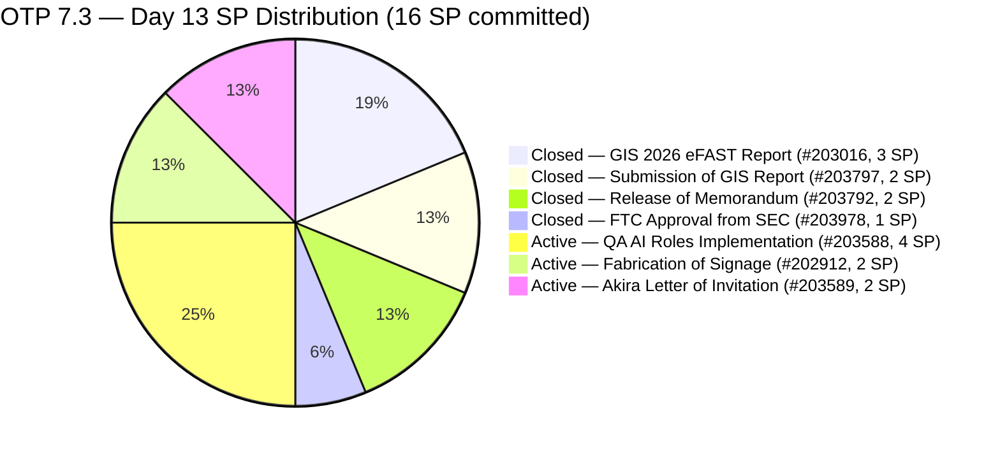
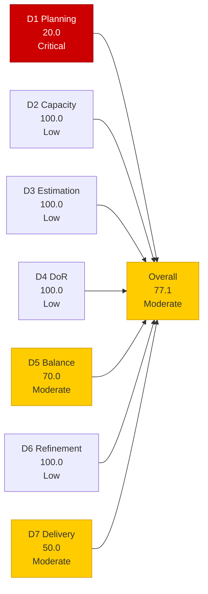
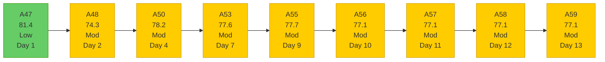

# OTP Team — SAFe Iteration Audit A59
**Date:** 2026-05-16 | **Sprint Day:** 13 of 14 | **Iteration:** 7.3 (May 4 – May 17, 2026)
**Auditor:** Claude Code (ADO SAFe Audit Skill v1) | **Prior Audit:** A58 (2026-05-15 02:05)

---

## 1. Audit Metadata

| Field | Value |
|---|---|
| **Audit ID** | A59 |
| **Report File** | `AUDIT_20260516_0903.md` |
| **Prior Audit** | A58 — `AUDIT_20260515_0205.md` (Overall 77.1, Moderate — 7.3 Day 12) |
| **ADO Project** | OTP (`e7739905-28a3-4ae1-9173-7f6cd13b3494`) |
| **ADO Team** | OTP Team (`64de61f0-1203-4b01-aee2-6b4415aec52b`) |
| **Iteration** | 7.3 (`86aab8f1-cd46-4fe6-a810-00fba59b46a3`) |
| **Iteration Dates** | May 4 – May 17, 2026 |
| **Sprint Day** | 13 of 14 |
| **Audit Date** | 2026-05-16 09:03 UTC |
| **Overall Score** | **77.1 — Moderate Risk** |
| **Risk Band** | Moderate (60–79.9) |
| **Visible Backlog Items** | 15 root items |
| **Current Iteration Root Items** | 3 (IterationPath = 7.3, open in backlog) |
| **Full 7.3 Roster** | 7 root items (3 open + 4 Closed) |
| **Capacity Source** | `work_get_team_capacity` — Grace: 1.5 h/day |
| **Project Exceptions Applied** | Single-assignee model (Grace) — D2 scored full |

---

## 2. Executive Summary

| Field | Value |
|---|---|
| **Overall Score** | 77.1 — Moderate Risk |
| **Score vs Prior (A58)** | 77.1 → 77.1 (**0.0 — flat for 4th consecutive audit**) |
| **Sprint Day** | 13 of 14 |
| **Iteration** | 7.3 (May 4 – May 17, 2026) |
| **Open Items in 7.3** | 3 (#202912, #203588, #203589) |
| **Committed SP** | 16 SP |
| **SP Closed** | 8 SP (#203016=3, #203797=2, #203792=2, #203978=1) |
| **Risk Band** | Moderate (60–79.9) |

**Score flat at 77.1 for the fourth consecutive audit.** No root-item closures since Day 9 (May 12). All three open items (#202912, #203588, #203589) carry ChangedDate of May 10 — a 6-consecutive-day no-activity streak. Today is the penultimate day of the sprint (Day 13 of 14); the sprint closes tomorrow, May 17.

**Final day of meaningful delivery.** Grace has 1.5 h available today. The only item that can raise the overall score to Low Risk (≥ 80) is closing #203588 (QA AI Roles, 4 SP) — this single closure would move D7 from 50.0 to 75.0 and overall from 77.1 to 82.4. With a 6-day stall on all three items and no evidence of activity since May 10, the sprint appears to be heading toward a Moderate Risk close.

**Sprint closure decisions required today.** #203589 (Akira Letter of Invitation) is an external dependency that has definitively exceeded the sprint boundary — formal carryover to 7.4 is overdue. #202912 (Fabrication of Signage) requires final vendor disposition. Sprint retrospective and 7.4 planning should begin today or tomorrow.

---

## 3. Previous Audit Delta (A58 → A59)

| Dimension | A58 Score | A59 Score | Delta | Driver |
|---|---|---|---|---|
| D1 Iteration Planning | 20.0 | 20.0 | 0.0 | 3 open 7.3 items / 15 visible items; no backlog changes |
| D2 Team Capacity | 100.0 | 100.0 | 0.0 | Grace: 1.5 h/day; unchanged |
| D3 Estimation | 100.0 | 100.0 | 0.0 | All 3 current items estimated; unchanged |
| D4 DoR Compliance | 100.0 | 100.0 | 0.0 | All 3 pass DoR; unchanged |
| D5 Work Item Balance | 70.0 | 70.0 | 0.0 | All 3 User Story (100% > 60%); structural penalty unchanged |
| D6 Backlog Refinement | 100.0 | 100.0 | 0.0 | All 15 items fresh; oldest May 4 = 12 days; unchanged |
| D7 Delivery Predictability | 50.0 | 50.0 | 0.0 | No new closures; 8/16 SP unchanged |
| **Overall** | **77.1** | **77.1** | **0.0** | All dimensions flat |

### Key Events (A58 → A59)

| Event | Impact |
|---|---|
| **No root-item closures** (Day 13) | D7 stall extends to 6 consecutive days (May 10–16); no change to score |
| **No backlog changes** | 15 items confirmed; no new additions or removals |
| **#202912, #203588, #203589 states unchanged** | All 3 still Active; ChangedDate May 10 for the 6th consecutive day |
| **Sprint Day 13 of 14** | Final viable delivery day; 1.5 h remaining for Grace |

---

## 4. Current Iteration Snapshot

**Iteration:** 7.3 | **Period:** May 4 – May 17, 2026 | **Sprint Day:** 13 of 14

| Metric | Value |
|---|---|
| Full 7.3 iteration root items | 7 (#202912, #203016, #203588, #203589, #203792, #203797, #203978) |
| Open items in 7.3 (backlog view) | 3 (#202912, #203588, #203589) |
| Visible backlog root items | 15 |
| Committed story points | 16 SP |
| SP Closed | 8 SP (#203016=3, #203797=2, #203792=2, #203978=1) |
| SP Active/Open | 8 SP (3 items) |
| Delivery % | 50.0% (8/16 SP) |
| Assignee | Grace (sole; single-assignee model) |
| Daily capacity | 1.5 h/day |
| Days remaining | 1 calendar day (May 17 — sprint close) |

### Backlog Path Breakdown (15 visible items)

| IterationPath | Count | Items |
|---|---|---|
| 7.3 (current, open) | 3 | #202912, #203588, #203589 |
| 7.4 (next sprint) | 3 | #202913, #204117, #204122 |
| 7.5 (future PI7) | 2 | #204193, #204194 |
| 7.6 (future PI7) | 1 | #203864 |
| 8.1 (PI8 scheduled) | 2 | #201815, #201820 |
| PI8 (unscheduled) | 4 | #200679, #200680, #204043, #204044 |

### Sprint Delivery Timeline

| Day | Closure | SP Closed | D7 | Sprint % Elapsed |
|---|---|---|---|---|
| Day 2 (May 5) | #203016 (3 SP) | 3 | 18.8 | 14% |
| Day 3 (May 6) | #203797 (2 SP) | 5 | 31.3 | 21% |
| Day 8 (May 11) | #203978 (1 SP) | 6 | 37.5 | 57% |
| Day 9 (May 12) | #203792 (2 SP) | 8 | 50.0 | 64% |
| Days 10–13 (May 13–16) | None | 8 | 50.0 | 71–93% |
| **Day 13 (May 16)** | **None** | **8** | **50.0** | **93%** |

---

## 5. Work Item Analysis

### 7.3 Full Iteration Roster (7 items)

| ID | Title | Type | State | SP | Assignee | DoR | ChangedDate | Notes |
|---|---|---|---|---|---|---|---|---|
| #203016 | Generate and Validate GIS 2026 Report for eFAST Submission | User Story | **Closed** | 3 | Grace | ✅ | May 5 | Closed Day 2 |
| #203797 | Submission of GIS Report | User Story | **Closed** | 2 | Grace | ✅ | May 6 | Closed Day 3 |
| #203978 | FTC Approval from SEC of GIS 2026 Report | User Story | **Closed** | 1 | Grace | ✅ | May 11 | Closed Day 8 |
| #203792 | Release of Memorandum | User Story | **Closed** | 2 | Grace | ✅ | May 12 | Closed Day 9 |
| #203588 | Implementation of QA AI Roles | User Story | **Active** | 4 | Grace | ✅ | May 10 | **6 days no change — Day 13 absolute final window** |
| #202912 | Fabrication of Signage | User Story | **Active** | 2 | Grace | ✅ | May 10 | **6 days no change — vendor item; final disposition today** |
| #203589 | Akira to provide signed Letter of Invitation | User Story | **Active** | 2 | Grace | ✅ | May 10 | **6 days no change — external dependency; carryover overdue** |

### DoR Verification — Open Items (3 items)

| ID | Description | AC | Status |
|---|---|---|---|
| #203588 | ≥30 chars ✅ (role definition, tooling framework) | ≥20 chars ✅ (4 AC checkboxes defined) | ✅ PASS |
| #202912 | ≥30 chars ✅ (safety role + maintenance scope) | ≥20 chars ✅ (safety measures, brgy compliance) | ✅ PASS |
| #203589 | ≥30 chars ✅ (embassy compliance, sponsoring company) | ≥20 chars ✅ (invitation letter for Japan Embassy) | ✅ PASS |

### Visible Backlog (15 items) — Age Analysis

| ID | Title | IterationPath | SP | State | ChangedDate | Days Since Change | Stale? |
|---|---|---|---|---|---|---|---|
| #202912 | Fabrication of Signage | 7.3 | 2 | Active | May 10 | 6 | No |
| #203588 | Implementation of QA AI Roles | 7.3 | 4 | Active | May 10 | 6 | No |
| #203589 | Akira Letter of Invitation | 7.3 | 2 | Active | May 10 | 6 | No |
| #202913 | Installation of Street Signage | 7.4 | 2 | Active | May 4 | 12 | No |
| #204117 | Tarpaulin Printing for JIT and Jairosoft Signage | 7.4 | 2 | New | May 12 | 4 | No |
| #204122 | FTC Status of renewal | 7.4 | 2 | New | May 12 | 4 | No |
| #204193 | Philgeps Document Consolidation | 7.5 | 2 | New | May 14 | 2 | No |
| #204194 | Philgeps Online Submission | 7.5 | 2 | New | May 14 | 2 | No |
| #203864 | Release and collect of TCT | 7.6 | 2 | New | May 14 | 2 | No |
| #201815 | Physical Installation & Grid Integration | 8.1 | 2 | New | May 4 | 12 | No |
| #201820 | Monitoring & Handover | 8.1 | 2 | New | May 4 | 12 | No |
| #200679 | File RKS Form 5 with DOLE | PI8 | 2 | New | May 11 | 5 | No |
| #200680 | Calculate Separation Pay | PI8 | 2 | New | May 11 | 5 | No |
| #204043 | Preparation of H1B Renewal | PI8 | 2 | New | May 11 | 5 | No |
| #204044 | FTC GH Derek for schedule and itinerary | PI8 | 2 | New | May 11 | 5 | No |

No items older than 45 days. Zero stale_90. Zero stale_180.

---

## 6. SAFe Compliance Scorecard

| Dimension | Score | Band | Formula | Evidence |
|---|---|---|---|---|
| D1 Iteration Planning | 20.0 | Critical | 3/15 × 100 | 3 open 7.3 items / 15 visible root backlog items; unchanged from A58 |
| D2 Team Capacity | 100.0 | Low | 1/1 × 100 | Grace: 1.5 h/day (Documentation 1h + Requirements 0.5h); single-assignee exception |
| D3 Estimation | 100.0 | Low | 3/3 × 100 | All 3 current items estimated: #202912=2, #203588=4, #203589=2 SP |
| D4 DoR Compliance | 100.0 | Low | 3/3 × 100 | All 3 current items pass Desc ≥30 + AC ≥20 non-whitespace chars |
| D5 Work Item Balance | 70.0 | Moderate | 100 − 30 | All 3 current items User Story (100% > 60% threshold) → −30 |
| D6 Backlog Refinement | 100.0 | Low | 15/15 fresh; 0 penalties | All 15 items fresh (oldest: #201815/#201820/#202913 May 4 = 12 days); 0 stale_90; 0 stale_180; 0 untouched current items |
| D7 Delivery Predictability | 50.0 | Moderate | 8/16 × 100 | 8 SP closed / 16 SP committed; no new closures Day 13; 6-day stall |
| **Overall** | **77.1** | **Moderate** | 540.0 / 7 | Average of 7 dimensions |

### Scoring Detail

- **D1:** round(3/15 × 100, 1) = **20.0** *(no backlog changes; 3 open 7.3 items; 15 visible root items; sprint-series critical floor)*
- **D2:** round(1/1 × 100, 1) = **100.0** *(Grace sole assignee; 1.5 h/day confirmed; single-assignee project exception applied)*
- **D3:** round(3/3 × 100, 1) = **100.0** *(#202912=2 SP, #203588=4 SP, #203589=2 SP; all estimated)*
- **D4:** round(3/3 × 100, 1) = **100.0** *(all 3 pass Desc ≥30 + AC ≥20 non-whitespace)*
- **D5:** All 3 items User Story = 100% dominant type > 60% → −30; US present → no absent-US penalty; no spikes → no spike penalty. **70.0**
- **D6:** base = 100.0 (15/15 fresh); stale_90 = 0; stale_180 = 0; untouched_current = 0 (all 3 ChangedDate May 10 ≥ May 4 start). **100.0**
- **D7:** 7 items in full 7.3 roster; 16 SP committed; 4 Closed = 8 SP. No new closures Day 13. round(8/16 × 100, 1) = **50.0**
- **Overall:** (20.0 + 100.0 + 100.0 + 100.0 + 70.0 + 100.0 + 50.0) / 7 = 540.0 / 7 = **77.1**

### Score Trend — OTP Iteration 7.3

### Final Day Recovery Scenarios

| Action | New Closed SP | D7 → | Overall → | Feasibility |
|---|---|---|---|---|
| Current (Day 13 — no closures) | 8/16 | 50.0 | 77.1 | Baseline — sprint closes at Moderate |
| Close #203588 (4 SP) | 12/16 | 75.0 | **82.4 ✅ Low Risk** | Only path to Low Risk; requires 1.33 h |
| Close #202912 (2 SP) | 10/16 | 62.5 | 80.4 | Vendor delivery confirmation required |
| Close #203589 (2 SP) | 10/16 | 62.5 | 80.4 | External dep — close only with evidence |
| Close #203588 + #202912 | 14/16 | 87.5 | **85.4 ✅ Strong Low** | Best 2-item scenario |
| Close all 3 | 16/16 | 100.0 | **91.4 ✅** | Full delivery; 8 SP / 1.5 h = very aggressive |

---

## 7. Dimension Findings

### D1 — Iteration Planning: 20.0 (Critical Risk)

**Formula:** `3/15 × 100 = 20.0`

D1 remains at its sprint-series low of 20.0 for the fourth consecutive audit (A56 through A59). The backlog is stable at 15 items with 3 open in 7.3. No new items were added; no closed items appeared in the visible backlog view. The structural cause — an expanding backlog of future-sprint items (7.4/7.5/7.6/8.1/PI8) against a fixed 3-item current sprint contribution — will not resolve until sprint close removes closed items or carry-overs shift to 7.4.

D1 will not recover within Iteration 7.3. The primary leverage point is 7.4 sprint planning: if 7.4 opens with the 3 queued items (#202913, #204117, #204122) and the 3 carry-overs likely from 7.3, D1 will open at 6/18 = 33.3% — still High Risk but significantly better than the current 20.0 floor. Adding diverse item types to 7.4 at the same time addresses D5.

### D2 — Team Capacity: 100.0 (Low Risk)

Grace: 1.5 h/day (Documentation 1h + Requirements 0.5h). Single-assignee project exception in force. Remaining capacity = 1.5 h × 1 day = **1.5 hours** (today, Day 13).

**Utilization gap:** 8 SP open across 3 items. If #203588 requires ~1.33 h to close (4 SP / typical OTP velocity), this is within today's capacity — but only if Grace spends the full remaining bandwidth on it today.

### D3 — Estimation: 100.0 (Low Risk)

All 3 current items estimated. Stable since Day 1. No changes.

### D4 — DoR Compliance: 100.0 (Low Risk)

All 3 current items pass Description (≥30 chars) and Acceptance Criteria (≥20 chars). Consistent since Day 1 of 7.3. No new items added to current iteration.

### D5 — Work Item Balance: 70.0 (Moderate Risk — Structural)

All 3 open items are User Story (100% dominant type > 60% threshold → −30). This structural constraint of OTP's operational/compliance backlog model will persist into 7.4 if not deliberately addressed during sprint planning. The 7.4 queue (#202913, #204117, #204122) is similarly all User Story. Introducing at least one Enabler (infrastructure/compliance tool setup) or Spike (investigation item) in 7.4 planning would eliminate the penalty.

### D6 — Backlog Refinement: 100.0 (Low Risk)

All 15 visible backlog items changed within 45 days of May 16 (cutoff = April 1). Oldest items: #201815, #201820, #202913 (May 4 = 12 days). Zero stale_90. Zero stale_180. All 3 current items ChangedDate May 10 ≥ iteration start May 4 → zero untouched. D6 = 100.0.

### D7 — Delivery Predictability: 50.0 (Moderate Risk — 6-Day Stall)

**Formula:** `8/16 × 100 = 50.0`

The sprint is at 93% elapsed (Day 13/14) with 50% delivery. No closures have occurred since Day 9 (May 12) across 6 consecutive days. All three open items show ChangedDate = May 10 — unchanged for 6 days at the ADO root-item level.

| Item | State | SP | Assessment |
|---|---|---|---|
| #203588 (QA AI Roles) | Active | 4 | **Day 13 = absolute last window.** Sprint closes tomorrow. 1.5 h available today. Verify all 4 AC checkboxes; close if complete. This is the only action that achieves Low Risk. |
| #202912 (Fabrication of Signage) | Active | 2 | **Final vendor disposition today.** 13 days elapsed. Vendor fabrication either complete or not — one conversation to confirm. Close with delivery evidence or move to 7.4 with documented reason. |
| #203589 (Akira Letter of Invitation) | Active | 2 | **Move to 7.4 now.** Japan Embassy processing definitively exceeds sprint end. Document the carryover reason in ADO. No path to closure by May 17. |

---

## 8. Risks and Bottlenecks

| # | Risk | Severity | Dimension | Detail |
|---|---|---|---|---|
| R1 | Sprint closes tomorrow (May 17) with 50% SP delivered — 6-day stall | **Critical** | D7 | 8 SP open, 1.5 h remaining today, no evidence of activity since May 10. Sprint will close at Moderate Risk (77.1) unless #203588 closes today. |
| R2 | #203588 (QA AI Roles, 4 SP) — Day 13 = final and only remaining window | **Critical** | D7 | This item must close today to avoid carrying over 4 SP to 7.4. All 4 AC items are well-defined. Grace needs to verify: (a) AI platform provisioned and SSO-integrated? (b) Data Usage Policy signed? (c) Baseline Metrics recorded? (d) AI tool connected to code repo? If all pass — close today. Closing this single item brings overall to 82.4 (Low Risk). |
| R3 | #203589 (Akira Letter of Invitation) — carryover decision 4 days overdue | **Critical** | D7 | Japan Embassy 3–5 day processing window has definitively exceeded the sprint boundary. Sprint closes in 1 day. Moving to 7.4 is the only responsible action. This decision was flagged as overdue in A57, A58, and A59 — it must happen today. |
| R4 | D1 = 20.0 — sprint-series low sustained for 4 audits | **High** | D1 | The pattern of adding future-iteration items during active sprint close without resolving current items creates persistent D1 suppression. 7.4 planning must target D1 ≥ 40% from Day 1: (a) open with 6+ items in 7.4 from all carry-overs + existing queue; (b) confirm all items have DoR before sprint opens. |
| R5 | #202912 (Fabrication of Signage) — vendor disposition deferred 13 days | **High** | D7 | 13 working days without confirmed vendor delivery. Today is the last viable day to confirm and close (if complete) or move to 7.4 (if not). Continued ambiguity has not been acceptable since Day 9. |
| R6 | D5 = 70.0 — structural all-User-Story backlog, will persist in 7.4 | Moderate | D5 | The 7.4 queue (#202913, #204117, #204122) is all User Story. The D5 −30 penalty will repeat in 7.4 unless at least one non-User-Story item is added during 7.4 planning. |
| R7 | 7.4 sprint planning not yet initiated with 1 day remaining in 7.3 | Moderate | D1 | Best practice: sprint planning begins in the penultimate day of the prior sprint. No evidence of 7.4 planning activity in ADO. With carry-overs and 3 existing 7.4 items, planning session should happen today or first thing tomorrow. |

---

## 9. Prioritized Recommendations

1. **[CRITICAL — D7, TODAY — Final Window]** Grace: close #203588 (Implementation of QA AI Roles, 4 SP) today. Day 13 is the last day of the sprint before close on May 17. Verify all 4 AC checkboxes: (a) AI testing platform provisioned and SSO-integrated? (b) Data Usage Policy signed off? (c) Baseline Metrics (Manual vs. Automation time-spend) recorded? (d) AI tool connected to primary code repository (GitHub/GitLab)? If all pass — close immediately. This is the single action that saves the sprint from Moderate Risk (77.1 → 82.4 Low Risk). With 1.5 hours available today, this is feasible.

2. **[CRITICAL — D7, TODAY — Overdue]** Move #203589 (Akira Letter of Invitation, 2 SP) to Iteration 7.4 right now. The carryover decision is 4 days overdue. Japan Embassy processing has definitively exceeded the sprint window. Document in ADO: "External dependency on Akira/Japan Embassy. Letter of Invitation processing exceeds Iteration 7.3 end date. Carrying over to Iteration 7.4." This eliminates future ambiguity and cleans the 7.3 sprint record.

3. **[HIGH — D7, TODAY — Final Decision]** Resolve #202912 (Fabrication of Signage, 2 SP) today: (a) Contact Grace or vendor immediately — is signage fabrication complete and ready for delivery? (b) If YES: close with delivery evidence now. (c) If NO: move to 7.4 with documented reason ("Vendor fabrication not completed within 7.3 window. Carrying over to 7.4."). No third option — this item cannot remain in Active state when the sprint closes tomorrow.

4. **[HIGH — 7.4 Planning, TODAY]** Begin formal 7.4 sprint planning immediately. Carry-overs from 7.3 (#203589 certain, #202912 likely) join the existing 7.4 queue (#202913, #204117, #204122). 7.4 planning should: (a) confirm D1 target ≥ 40% from Day 1; (b) verify DoR for all 5–6 items; (c) add at least one Enabler or Spike to prevent D5 structural penalty; (d) review capacity — Grace remains at 1.5 h/day.

5. **[MEDIUM — D5, 7.4 Planning]** Introduce at least one non-User-Story item type in the 7.4 sprint. Consider: reclassifying #204122 (FTC Status of Renewal) as an Enabler (compliance tracking infrastructure) or adding a Spike for the QA AI platform integration follow-up from #203588. This single change eliminates the persistent D5 −30 penalty.

6. **[MEDIUM — D1, PI Backlog Hygiene]** Schedule the 4 unscheduled PI8 items (#200679, #200680, #204043, #204044) to specific PI8 iterations. These 4 items inflate the D1 denominator while providing no current-sprint numerator contribution. Assigning to PI8 iteration paths (8.1, 8.2, etc.) does not change D1 immediately but establishes cleaner sprint planning for 7.4 onwards.

---

## 10. Evidence Gaps and Limitations

| Gap | Impact | Mitigation |
|---|---|---|
| Closed items (#203016, #203797, #203792, #203978) not visible in backlog | D7 committed SP uses full 7-item 7.3 roster (16 SP); closed items confirmed via prior audit iteration roster | 4 items Closed previously confirmed; #203978 Closed May 11 from A58 batch query; scoring evidence-backed |
| #203588/#202912/#203589 ChangedDate = May 10 (6-day stall) | Cannot confirm sub-task or ADO comment-level progress since May 10 | Root-item states confirmed as Active via ADO batch; 6-day root-level stall is the definitive D7 signal |
| #203589 (Akira Letter) — no ADO evidence of Akira contact since May 10 | External dependency status unverifiable via ADO | State = Active confirmed; carryover recommendation formally issued and 4 days overdue |
| #202912 (Fabrication of Signage) — vendor completion not visible in ADO | Cannot confirm vendor delivery or handoff | Flagged Critical (R5); direct Grace/vendor confirmation required today |
| Remaining capacity = 1.5 h (Day 13) — no time-log to verify utilization | Cannot confirm actual hours used Days 10–13 | Capacity estimate stable and consistent across all 7.3 audits |

---

*Audit A59 produced by Claude Code — ADO SAFe Audit Skill v1. SAFe 6.0 framework. Sprint Day 13 of 14. Key findings: (1) Score flat at 77.1 for 4th consecutive audit — all 7 dimensions unchanged from A58; (2) 6-day no-closure streak (May 10–16) — longest stall of the 7.3 series; (3) Sprint closes tomorrow (May 17); 1.5 h capacity remains today; (4) CRITICAL final window: close #203588 (4 SP) today = only path to Low Risk (82.4); (5) #203589 carryover is 4 days overdue — must move to 7.4 with documented reason today; (6) #202912 final vendor disposition required today; (7) 7.4 sprint planning should begin today; (8) D1 = 20.0 sprint-series floor will persist until 7.4 opens with proportionally higher current-iteration coverage.*
