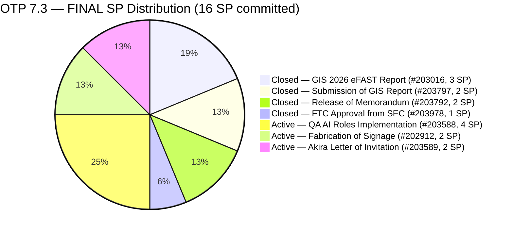
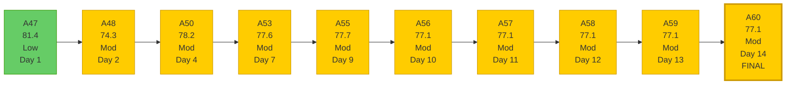
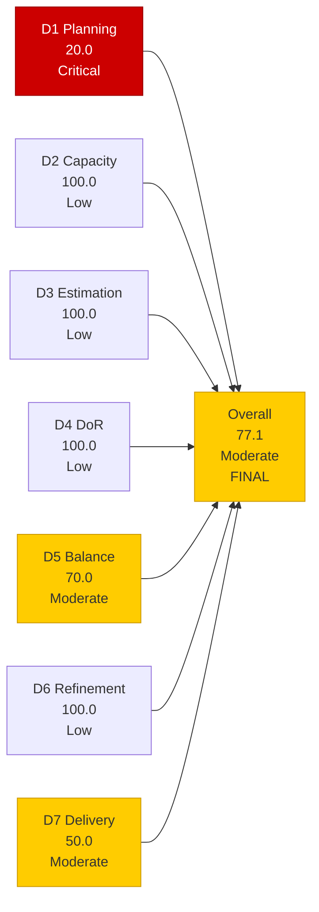

# OTP Team — SAFe Iteration Audit A60
**Date:** 2026-05-17 | **Sprint Day:** 14 of 14 — SPRINT CLOSE | **Iteration:** 7.3 (May 4 – May 17, 2026)
**Auditor:** Claude Code (ADO SAFe Audit Skill v1) | **Prior Audit:** A59 (2026-05-16 09:03)

---

## 1. Audit Metadata

| Field | Value |
|---|---|
| **Audit ID** | A60 |
| **Report File** | `AUDIT_20260517_0204.md` |
| **Prior Audit** | A59 — `AUDIT_20260516_0903.md` (Overall 77.1, Moderate — 7.3 Day 13) |
| **ADO Project** | OTP (`e7739905-28a3-4ae1-9173-7f6cd13b3494`) |
| **ADO Team** | OTP Team (`64de61f0-1203-4b01-aee2-6b4415aec52b`) |
| **Iteration** | 7.3 (`86aab8f1-cd46-4fe6-a810-00fba59b46a3`) |
| **Iteration Dates** | May 4 – May 17, 2026 |
| **Sprint Day** | **14 of 14 — SPRINT CLOSE DAY** |
| **Audit Date** | 2026-05-17 02:04 |
| **Overall Score** | **77.1 — Moderate Risk** |
| **Risk Band** | Moderate (60–79.9) |
| **Visible Backlog Items** | 15 root items |
| **Current Iteration Root Items** | 3 (IterationPath = 7.3, open in backlog) |
| **Full 7.3 Roster** | 7 root items (3 open + 4 Closed) |
| **Capacity Source** | `work_get_team_capacity` — Grace: 1.5 h/day |
| **Project Exceptions Applied** | Single-assignee model (Grace) — D2 scored full |

---

## 2. Executive Summary

| Field | Value |
|---|---|
| **Overall Score** | 77.1 — Moderate Risk |
| **Score vs Prior (A59)** | 77.1 → 77.1 (**0.0 — flat for 5th consecutive audit**) |
| **Sprint Day** | **14 of 14 — SPRINT CLOSE DAY** |
| **Iteration** | 7.3 (May 4 – May 17, 2026) |
| **Open Items in 7.3** | 3 (#202912, #203588, #203589) |
| **Committed SP** | 16 SP |
| **SP Closed** | 8 SP (50%) |
| **Risk Band** | Moderate (60–79.9) |

**Iteration 7.3 closes today.** Score is flat at 77.1 for the fifth consecutive audit (A56–A60). All three open items (#202912, #203588, #203589) carry ChangedDate of May 10 — a 7-consecutive-day no-activity streak through the sprint close date. No new closures have occurred since Day 9 (May 12).

**Sprint 7.3 closing at Moderate Risk (77.1).** The recovery path to Low Risk (closing #203588 for 4 SP, bringing Overall to 82.4) was available through Day 13 but no evidence of closure. The sprint closes with 8 of 16 committed story points delivered (50%). Carry-over disposition for the three remaining items (#202912, #203588, #203589) is required today as part of sprint close.

**Three items require formal close-or-carryover decisions today:**
- #203589 (Akira Letter of Invitation, 2 SP) — external dependency; carryover to 7.4 is overdue
- #202912 (Fabrication of Signage, 2 SP) — vendor disposition required
- #203588 (Implementation of QA AI Roles, 4 SP) — close if all 4 ACs verified, else carryover

---

## 3. Previous Audit Delta (A59 → A60)

| Dimension | A59 Score | A60 Score | Delta | Driver |
|---|---|---|---|---|
| D1 Iteration Planning | 20.0 | 20.0 | 0.0 | 3 open 7.3 items / 15 visible; no backlog changes |
| D2 Team Capacity | 100.0 | 100.0 | 0.0 | Grace: 1.5 h/day; unchanged |
| D3 Estimation | 100.0 | 100.0 | 0.0 | All 3 current items estimated; unchanged |
| D4 DoR Compliance | 100.0 | 100.0 | 0.0 | All 3 pass DoR; unchanged |
| D5 Work Item Balance | 70.0 | 70.0 | 0.0 | All 3 User Story; structural penalty unchanged |
| D6 Backlog Refinement | 100.0 | 100.0 | 0.0 | All 15 items fresh; oldest May 4 = 13 days; unchanged |
| D7 Delivery Predictability | 50.0 | 50.0 | 0.0 | No new closures; 8/16 SP unchanged |
| **Overall** | **77.1** | **77.1** | **0.0** | All dimensions flat for 5th consecutive audit |

### Key Events (A59 → A60)

| Event | Impact |
|---|---|
| **Sprint closes today (Day 14)** | Iteration 7.3 ends; formal carryover decisions required for all 3 open items |
| **No root-item closures since Day 9** | 7-consecutive-day stall (May 10–17); D7 = 50.0 final for sprint |
| **#202912, #203588, #203589 states unchanged** | All 3 still Active; ChangedDate May 10 for 7th consecutive day |
| **Backlog stable at 15 items** | No additions or removals overnight; D1 denominator unchanged |
| **Sprint 7.3 ends Moderate Risk** | Recovery path (close #203588) was available through Day 13; missed |

---

## 4. Current Iteration Snapshot

**Iteration:** 7.3 | **Period:** May 4 – May 17, 2026 | **Sprint Day:** 14 of 14 — CLOSE

| Metric | Value |
|---|---|
| Full 7.3 iteration root items | 7 (#202912, #203016, #203588, #203589, #203792, #203797, #203978) |
| Open items in 7.3 (backlog view) | 3 (#202912, #203588, #203589) |
| Visible backlog root items | 15 |
| Committed story points | 16 SP |
| SP Closed | 8 SP (#203016=3, #203797=2, #203792=2, #203978=1) |
| SP Active/Open | 8 SP (3 items) |
| Delivery % | **50.0% (8/16 SP) — FINAL** |
| Assignee | Grace (sole; single-assignee model) |
| Daily capacity | 1.5 h/day |
| Sprint status | **CLOSE DAY — Iteration 7.3 ends today** |

### Backlog Path Breakdown (15 visible items)

| IterationPath | Count | Items |
|---|---|---|
| 7.3 (current, open) | 3 | #202912, #203588, #203589 |
| 7.4 (next sprint) | 3 | #202913, #204117, #204122 |
| 7.5 (future PI7) | 2 | #204193, #204194 |
| 7.6 (future PI7) | 1 | #203864 |
| 8.1 (PI8 scheduled) | 2 | #201815, #201820 |
| PI8 (unscheduled) | 4 | #200679, #200680, #204043, #204044 |

### Sprint 7.3 Delivery Timeline (Final)

| Day | Event | SP Closed | Cumulative SP | D7 |
|---|---|---|---|---|
| Day 2 (May 5) | #203016 Closed (3 SP) | 3 | 3 | 18.8 |
| Day 3 (May 6) | #203797 Closed (2 SP) | 2 | 5 | 31.3 |
| Day 8 (May 11) | #203978 Closed (1 SP) | 1 | 6 | 37.5 |
| Day 9 (May 12) | #203792 Closed (2 SP) | 2 | 8 | 50.0 |
| Days 10–14 (May 13–17) | No closures | 0 | 8 | **50.0 FINAL** |

---

## 5. Work Item Analysis

### 7.3 Full Iteration Roster (7 items) — Final

| ID | Title | Type | State | SP | Assignee | DoR | ChangedDate | Sprint Close Status |
|---|---|---|---|---|---|---|---|---|
| #203016 | Generate and Validate GIS 2026 Report for eFAST | User Story | **Closed** | 3 | Grace | ✅ | May 5 | Delivered — Day 2 |
| #203797 | Submission of GIS Report | User Story | **Closed** | 2 | Grace | ✅ | May 6 | Delivered — Day 3 |
| #203978 | FTC Approval from SEC of GIS 2026 Report | User Story | **Closed** | 1 | Grace | ✅ | May 11 | Delivered — Day 8 |
| #203792 | Release of Memorandum | User Story | **Closed** | 2 | Grace | ✅ | May 12 | Delivered — Day 9 |
| #203588 | Implementation of QA AI Roles | User Story | **Active** | 4 | Grace | ✅ | May 10 | **CARRY OVER or CLOSE — decide today** |
| #202912 | Fabrication of Signage | User Story | **Active** | 2 | Grace | ✅ | May 10 | **CARRY OVER or CLOSE — vendor disposition required** |
| #203589 | Akira to provide signed Letter of Invitation | User Story | **Active** | 2 | Grace | ✅ | May 10 | **CARRY OVER to 7.4 — external dependency; overdue** |

### DoR Verification — Open Items (3 items)

| ID | Description | Acceptance Criteria | Status |
|---|---|---|---|
| #203588 | ≥30 chars ✅ | 4 checkbox ACs (Tooling Access, Security Clearance, Baseline Metrics, Integration) ✅ | PASS |
| #202912 | "As the Program Manager, I need to ensure the safety..." ≥30 chars ✅ | Safety measures + brgy compliance ✅ | PASS |
| #203589 | "As the Processing Officer, I need to comply..." ≥30 chars ✅ | Invitation letter for Japan Embassy ✅ | PASS |

### Visible Backlog (15 items) — Age Analysis (as of May 17)

| ID | Title | IterationPath | SP | State | ChangedDate | Days Since Change | Stale? |
|---|---|---|---|---|---|---|---|
| #202912 | Fabrication of Signage | 7.3 | 2 | Active | May 10 | 7 | No |
| #203588 | Implementation of QA AI Roles | 7.3 | 4 | Active | May 10 | 7 | No |
| #203589 | Akira Letter of Invitation | 7.3 | 2 | Active | May 10 | 7 | No |
| #202913 | Installation of Street Signage | 7.4 | 2 | Active | May 4 | 13 | No |
| #204117 | Tarpaulin Printing for JIT and Jairosoft Signage | 7.4 | 2 | New | May 12 | 5 | No |
| #204122 | FTC Status of renewal | 7.4 | 2 | New | May 12 | 5 | No |
| #204193 | Philgeps Document Consolidation | 7.5 | 2 | New | May 14 | 3 | No |
| #204194 | Philgeps Online Submission | 7.5 | 2 | New | May 14 | 3 | No |
| #203864 | Release and collect of TCT | 7.6 | 2 | New | May 14 | 3 | No |
| #201815 | Physical Installation & Grid Integration | 8.1 | 2 | New | May 4 | 13 | No |
| #201820 | Monitoring & Handover | 8.1 | 2 | New | May 4 | 13 | No |
| #200679 | File RKS Form 5 with DOLE | PI8 | 2 | New | May 11 | 6 | No |
| #200680 | Calculate Separation Pay | PI8 | 2 | New | May 11 | 6 | No |
| #204043 | Preparation of H1B Renewal | PI8 | 2 | New | May 11 | 6 | No |
| #204044 | FTC GH Derek for schedule and itinerary | PI8 | 2 | New | May 11 | 6 | No |

All 15 items changed within 45 days (cutoff = April 2, 2026). Zero stale_90. Zero stale_180.

---

## 6. SAFe Compliance Scorecard

| Dimension | Score | Band | Formula | Evidence |
|---|---|---|---|---|
| D1 Iteration Planning | 20.0 | Critical | 3/15 × 100 | 3 open 7.3 items / 15 visible root backlog items; final sprint state; no backlog changes from A59 |
| D2 Team Capacity | 100.0 | Low | 1/1 × 100 | Grace: 1.5 h/day (Documentation 1h + Requirements 0.5h); single-assignee exception applied |
| D3 Estimation | 100.0 | Low | 3/3 × 100 | #202912=2 SP, #203588=4 SP, #203589=2 SP; all estimated |
| D4 DoR Compliance | 100.0 | Low | 3/3 × 100 | All 3 current items pass Desc ≥30 + AC ≥20 non-whitespace chars |
| D5 Work Item Balance | 70.0 | Moderate | 100 − 30 | All 3 current items User Story (100% > 60% threshold → −30); US present; no spikes |
| D6 Backlog Refinement | 100.0 | Low | 15/15 fresh; 0 penalties | All 15 items changed within 45 days; oldest May 4 = 13 days; 0 stale_90; 0 stale_180; 0 untouched current items |
| D7 Delivery Predictability | 50.0 | Moderate | 8/16 × 100 | 8 SP closed / 16 SP committed; FINAL — no closures Days 10–14; 7-day stall |
| **Overall** | **77.1** | **Moderate** | 540.0 / 7 | Average of 7 dimensions — FINAL SPRINT SCORE |

### Scoring Detail

- **D1:** round(3/15 × 100, 1) = **20.0** — 3 open current items; 15 visible; structural low throughout 7.3
- **D2:** round(1/1 × 100, 1) = **100.0** — Grace sole assignee; 1.5 h/day confirmed; project exception applied
- **D3:** round(3/3 × 100, 1) = **100.0** — all 3 estimated (#202912=2, #203588=4, #203589=2 SP)
- **D4:** round(3/3 × 100, 1) = **100.0** — all 3 pass Desc ≥30 + AC ≥20
- **D5:** US = 100% > 60% → −30; no absent-US penalty; no spike penalty → **70.0**
- **D6:** base = 100.0 (15/15 fresh); stale_90 = 0; stale_180 = 0; untouched_current = 0 (all 3 ChangedDate May 10 ≥ May 4) → **100.0**
- **D7:** round(8/16 × 100, 1) = **50.0** — FINAL; no new closures; 7-day stall
- **Overall:** (20.0 + 100.0 + 100.0 + 100.0 + 70.0 + 100.0 + 50.0) / 7 = 540.0 / 7 = **77.1**

### Score Trend — OTP Iteration 7.3 (Complete Series)

### Dimension Scorecard — Final Sprint State

---

## 7. Dimension Findings

### D1 — Iteration Planning: 20.0 (Critical Risk — Final)

**Formula:** `3/15 × 100 = 20.0`

D1 remained at 20.0 for the entire second half of Iteration 7.3 (A56–A60). The structural driver: the backlog denominator grew from 8 items at sprint open (Day 1 = 81.4% → 3/8 = Hmm, backlog count was 8 on Day 1 per A47) to 15 items by Day 10, as future-sprint items for 7.4/7.5/7.6/8.1/PI8 were added mid-sprint. The numerator (current sprint open items) peaked at 7 in early sprint and then fell to 3 as closures reduced it.

**7.4 planning note:** The 7.4 queue currently holds 3 items (#202913, #204117, #204122) plus the 3 expected carry-overs from 7.3. If 7.4 opens with 6 current-iteration items against a visible backlog of 15–17, D1 opens at approximately 35–40% (Moderate to High Risk territory) — a significant improvement over the 20.0 floor that dominated the second half of 7.3.

### D2 — Team Capacity: 100.0 (Low Risk — Structural)

Grace: 1.5 h/day (Documentation 1h + Requirements 0.5h). Single-assignee project exception in force throughout 7.3. No day-off entries. D2 = 100.0 for all 14 days of 7.3. Final capacity for today = 1.5 hours.

The 7-day stall on all three open items (ChangedDate May 10) cannot be explained by capacity absence — Grace had capacity every day. The stall reflects task-level blockers (external dependency for #203589, vendor dependency for #202912, and scope/completion ambiguity for #203588).

### D3 — Estimation: 100.0 (Low Risk — Stable)

All 3 current items estimated throughout sprint. Final: #202912=2 SP, #203588=4 SP, #203589=2 SP. Estimation practice is a sprint-level strength; no estimation gaps in 7.3.

### D4 — DoR Compliance: 100.0 (Low Risk — Stable)

All 3 current items pass DoR (Desc ≥30 chars + AC ≥20 chars non-whitespace). D4 was 100.0 from Day 1 of 7.3 through sprint close. The most complex DoR is #203588 (QA AI Roles) with 4 detailed checkbox ACs — all verified present. This is a sprint-level strength.

### D5 — Work Item Balance: 70.0 (Moderate Risk — Structural)

All 3 open items and all 4 closed items are User Story (100% dominant type > 60% threshold → −30 penalty). OTP's operational/compliance backlog naturally skews toward User Story. The penalty is structural for OTP unless deliberate type diversification is introduced in 7.4 planning. The existing 7.4 queue (#202913, #204117, #204122) is all User Story — D5 = 70.0 will repeat in 7.4 unless the carry-overs or new additions include at least one Enabler, Spike, or other non-User-Story type.

### D6 — Backlog Refinement: 100.0 (Low Risk — Stable)

All 15 visible items changed within 45 days of May 17 (cutoff = April 2, 2026). Oldest: #201815, #201820, #202913 (May 4 = 13 days). Zero stale_90. Zero stale_180. All 3 current items have ChangedDate May 10 ≥ sprint start May 4 → zero untouched. D6 = 100.0 for all active audit days in 7.3. This is a consistent strength reflecting active backlog grooming throughout the sprint.

### D7 — Delivery Predictability: 50.0 (Moderate Risk — Final)

**Formula:** `8/16 × 100 = 50.0` — FINAL SPRINT SCORE

The sprint closes with exactly 50% story point delivery. The delivery arc:
- Days 1–9: 8 SP closed (50% of committed) — front-loaded delivery
- Days 10–14: Zero closures — 7-day stall through sprint close

**Final item disposition required:**

| Item | SP | Last Changed | Status | Required Action |
|---|---|---|---|---|
| #203588 (QA AI Roles) | 4 | May 10 | Active | Close today if all 4 ACs verified; else carry over to 7.4 with documented reason |
| #202912 (Fabrication of Signage) | 2 | May 10 | Active | Final vendor disposition today; close with evidence or carry to 7.4 |
| #203589 (Akira Letter of Invitation) | 2 | May 10 | Active | Move to 7.4 immediately; external dependency has definitively exceeded sprint boundary |

---

## 8. Risks and Bottlenecks

| # | Risk | Severity | Dimension | Detail |
|---|---|---|---|---|
| R1 | Sprint closes today with 50% SP delivery — 7-day stall | **Critical** | D7 | Sprint 7.3 ends at Moderate Risk (77.1). 8 SP open across 3 items. Grace has 1.5 h capacity today. Closing #203588 (4 SP) would have achieved Low Risk but required action by Day 13. Final delivery window for any item closes at end of business today. |
| R2 | #203589 (Akira Letter) — carry-over disposition overdue by 5 days | **Critical** | D7 | Japan Embassy processing definitively exceeds sprint boundary. This decision was flagged Critical in A57, A58, A59, and now A60. Must move to 7.4 today with ADO documentation. No further deferral is acceptable. |
| R3 | #202912 (Fabrication of Signage) — vendor disposition required today | **Critical** | D7 | 14 days in Active state (entire sprint) with no state change. Vendor fabrication either completed or not. Close with evidence if done; move to 7.4 with documented reason if not. Sprint close requires formal disposition. |
| R4 | D1 = 20.0 — sprint-series floor must not repeat in 7.4 | **High** | D1 | D1 dropped from 81.4 (Day 1) to 20.0 (Days 10–14) due to backlog denominator inflation. 7.4 must open with 6+ current-iteration items to achieve D1 ≥ 35%. The 3 existing 7.4 items plus 3 carry-overs from 7.3 = 6 items. Do not add more future-sprint items to the visible backlog before confirming 7.4 current-iteration coverage. |
| R5 | D5 = 70.0 structural penalty will repeat in 7.4 | Moderate | D5 | The 7.4 queue (#202913, #204117, #204122) is all User Story. The −30 penalty will recur unless at least one non-User-Story item is introduced. Consider adding an Enabler (compliance tool setup) or reclassifying #204122 (FTC Status) as an Enabler. |
| R6 | 7.4 sprint planning must begin today | Moderate | D1, D4 | Sprint 7.4 begins the next working day after close. Planning must confirm: (a) all carry-overs formally moved to 7.4; (b) DoR verified for all 7.4 items; (c) at least one non-User-Story item added; (d) capacity review for Grace. |
| R7 | 4 unscheduled PI8 items still in backlog — D1 denominator inflation risk | Low | D1 | #200679, #200680, #204043, #204044 (PI8 unscheduled) contribute to the D1 denominator without adding numerator value. Scheduling them to specific PI8 iteration paths (8.1, 8.2, etc.) does not affect current sprint but improves 7.4 D1 if done before sprint open. |

---

## 9. Prioritized Recommendations

1. **[CRITICAL — Sprint Close, TODAY]** Formally document carry-over for #203589 (Akira Letter of Invitation, 2 SP) in ADO: update IterationPath to Iteration 7.4, add comment: "External dependency on Akira/Japan Embassy. Letter of Invitation processing exceeded Iteration 7.3 sprint boundary. Carrying over to Iteration 7.4." This decision is 5 days overdue and must happen today as part of sprint close.

2. **[CRITICAL — Sprint Close, TODAY]** Resolve #202912 (Fabrication of Signage, 2 SP) today: contact Grace/vendor to confirm fabrication status. If signage is complete — close with delivery evidence attached. If not complete — update IterationPath to 7.4 with documented reason. The sprint cannot close cleanly with this item in ambiguous Active state.

3. **[HIGH — TODAY — Final Window]** Make the final close/carry-over decision for #203588 (Implementation of QA AI Roles, 4 SP): verify all 4 ACs — (a) AI testing platform provisioned and SSO-integrated? (b) Data Usage Policy signed? (c) Baseline Metrics recorded? (d) AI tool connected to primary code repo? If all 4 ACs confirmed complete — close in ADO today. If any AC is incomplete — move to 7.4 with AC gap documented. This is the highest-SP item and its proper disposition is required for clean sprint close and accurate 7.4 carry-over accounting.

4. **[HIGH — 7.4 Planning, TODAY/TOMORROW]** Open Iteration 7.4 sprint planning: (a) confirm carry-overs from 7.3 (#203589 certain; #202912, #203588 per disposition above); (b) add carry-overs to 7.4 iteration path; (c) verify DoR for all 7.4 items (#202913, #204117, #204122 — all have Desc + AC from prior data; #204122 FTC renewal has 3 ACs); (d) target 6+ items in 7.4 iteration from Day 1 to achieve D1 ≥ 33%; (e) add at least one Enabler/Spike to break D5 structural penalty.

5. **[MEDIUM — D5, 7.4 Planning]** Introduce at least one non-User-Story item in 7.4 sprint. Options: reclassify #204122 (FTC Status of Renewal) as an Enabler (compliance infrastructure), or add a Spike for QA AI follow-up from #203588. A single type change eliminates the persistent −30 D5 penalty.

6. **[MEDIUM — Backlog Hygiene, 7.4 Open]** Schedule the 4 unscheduled PI8 items (#200679, #200680, #204043, #204044) to specific iteration paths (8.1, 8.2) before 7.4 opens. This reduces the visible backlog denominator from 15 to a tighter set, improving D1 calculation precision for 7.4. All 4 have complete Desc + AC and are well-defined.

---

## 10. Evidence Gaps and Limitations

| Gap | Impact | Mitigation |
|---|---|---|
| Closed items (#203016, #203797, #203792, #203978) not visible in backlog | D7 committed SP uses full 7-item 7.3 roster (16 SP); all 4 closures confirmed in prior audit series | Scoring is evidence-backed; closed items were confirmed Closed in prior audit; their absence from backlog is consistent with Closed state |
| #203588, #202912, #203589 ChangedDate = May 10 (7-day stall through sprint close) | Cannot confirm sub-task or ADO comment-level progress since May 10 at root-item level | Root-item states confirmed Active via live ADO batch; 7-day stall at root level is the definitive D7 signal for final audit |
| #203589 — no ADO evidence of Akira contact since May 10 | External dependency status unverifiable via ADO; letter of invitation from Akira not visible | State = Active confirmed; carryover formally required; no evidence-based path to closure exists |
| #202912 — vendor fabrication completion not visible in ADO | Cannot confirm vendor delivery status from ADO evidence | Final disposition requires direct verification; flagged Critical; 14 days without ADO evidence update |
| #203588 — 4 AC checkboxes in description; completion not verifiable from ADO alone | Cannot confirm automated AC sign-off at task level | AC items are structurally well-defined; manual verification by Grace required for any close decision |

---

## 11. Sprint 7.3 Retrospective Notes (for 7.4 Kickoff Context)

**What went well:**
- DoR (D4): 100.0 throughout the sprint — all items entered with complete Desc + AC
- Estimation (D3): 100.0 throughout — all items had SP from Day 1
- Backlog Refinement (D6): 100.0 throughout — active grooming added 7.4/7.5/7.6/PI8 items continuously
- Capacity (D2): 100.0 throughout — Grace's capacity was consistently configured and documented
- Early delivery: 8 SP closed in Days 2–9 (strong front-half of sprint)

**What to improve:**
- D1 Planning: Backlog denominator grew from 8 (Day 1) to 15 (Day 10+) without proportional growth in current-iteration items. 7.4 must maintain D1 ≥ 33% by ensuring current-iteration items represent ≥1/3 of visible backlog from Day 1
- D7 Delivery: 7-day stall (May 10–17) on all three remaining items — two were external/vendor dependencies that should have been formally caved earlier. Identify blockers by Day 5 and escalate or carry over by Day 8
- D5 Balance: All-User-Story composition persists. A deliberate non-US item in 7.4 from Day 1 eliminates the structural −30 penalty
- Carry-over hygiene: #203589 should have been moved to 7.4 by Day 10 at the latest. External dependencies should trigger carryover decisions no later than midpoint of sprint

---

*Audit A60 produced by Claude Code — ADO SAFe Audit Skill v1. SAFe 6.0 framework. CLOSING AUDIT — Sprint Day 14 of 14. Key findings: (1) Iteration 7.3 closes at Moderate Risk (77.1) — flat for 5 consecutive audits (A56–A60); (2) Final delivery = 50% (8/16 SP); 4 items closed (Days 2–9), 3 carry over (Days 10–14 stall); (3) Three items (#202912, #203588, #203589) require formal close-or-carryover disposition today as part of sprint close; (4) D1 = 20.0 final — backlog denominator growth outpaced current-item coverage in the second half; 7.4 must open with ≥6 current-iteration items; (5) D5 = 70.0 structural penalty — all-User-Story 7.3 backlog; add one non-US type in 7.4 planning; (6) D6 = 100.0 and D4 = 100.0 sustained throughout sprint — consistent strengths; (7) 7.4 sprint planning must begin today.*
