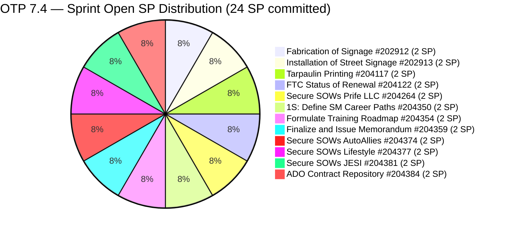
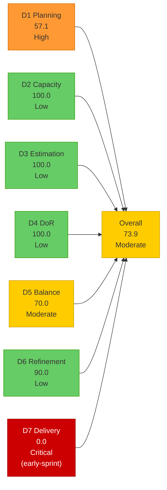
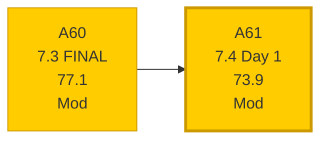

# OTP Team — SAFe Iteration Audit A61
**Date:** 2026-05-18 | **Sprint Day:** 1 of 14 — SPRINT OPEN | **Iteration:** 7.4 (May 18 – May 31, 2026)
**Auditor:** Claude Code (ADO SAFe Audit Skill v1) | **Prior Audit:** A60 (2026-05-17 02:04)

---

## 1. Audit Metadata

| Field | Value |
|---|---|
| **Audit ID** | A61 |
| **Report File** | `AUDIT_20260518_0900.md` |
| **Prior Audit** | A60 — `AUDIT_20260517_0204.md` (Overall 77.1, Moderate — 7.3 Day 14 CLOSE) |
| **ADO Project** | OTP (`e7739905-28a3-4ae1-9173-7f6cd13b3494`) |
| **ADO Team** | OTP Team (`64de61f0-1203-4b01-aee2-6b4415aec52b`) |
| **Iteration** | 7.4 (`72b2008d-7779-4d11-8356-c744f5a69a87`) |
| **Iteration Dates** | May 18 – May 31, 2026 |
| **Sprint Day** | **1 of 14 — SPRINT OPEN** |
| **Audit Date** | 2026-05-18 09:00 PHT |
| **Overall Score** | **73.9 — Moderate Risk** |
| **Risk Band** | Moderate (60–79.9) |
| **Visible Backlog Items** | 21 root items |
| **Current Iteration Root Items** | 12 (IterationPath = 7.4) |
| **Capacity Source** | `work_get_team_capacity` — Grace: 1.0 h/day (Docs 0.5h + Req 0.5h) |
| **Project Exceptions Applied** | Single-assignee model (Grace) — D2 scored full |

---

## 2. Executive Summary

| Field | Value |
|---|---|
| **Overall Score** | 73.9 — Moderate Risk |
| **Score vs Prior (A60)** | 77.1 → 73.9 (**−3.2** — new sprint opening effect) |
| **Sprint Day** | **1 of 14 — SPRINT OPEN** |
| **Iteration** | 7.4 (May 18 – May 31, 2026) |
| **Items in 7.4** | 12 root items, all User Story, all New |
| **Committed SP** | 24 SP (12 items × 2 SP each) |
| **SP Closed** | 0 (early-sprint Day 1 — no closures expected) |
| **Risk Band** | Moderate (60–79.9) |

**Iteration 7.4 opens at Moderate Risk (73.9).** This is a strong opening relative to prior sprint starts. The team enters with 12 well-planned current-iteration items, 100% estimated, and 100% DoR compliant from Day 1 — the planning discipline recommendations from A60 were fully implemented.

**Key improvements over 7.3 opening (A47 = 81.4):** D1 climbs dramatically from the 7.3 mid-sprint floor of 20.0 to 57.1 — the backlog now has 12 of 21 visible items in the current sprint, reversing the denominator-inflation problem that plagued 7.3. DoR and Estimation are both 100.0, a consistency streak extending from 7.3.

**Primary watchpoints for 7.4:**
1. D1 (57.1) — High Risk band; backlog has 9 non-current items that dilute planning coverage. Scheduling future items to specific iterations reduces D1 denominator without removing planned work.
2. D5 (70.0) — All-User-Story composition. The −30 structural penalty persists. A single Enabler or reclassification of a compliance item would eliminate it.
3. D7 (0.0) — Early-sprint; annotated. First delivery opportunity expected Days 2–4.
4. Capacity reduced: Grace's capacity dropped from 1.5 h/day (7.3) to 1.0 h/day (7.4). With 24 SP committed across 14 days at 1.0 h/day, the effective sprint velocity requires strong daily execution.

---

## 3. Previous Audit Delta (A60 → A61)

| Dimension | A60 Score | A61 Score | Delta | Driver |
|---|---|---|---|---|
| D1 Iteration Planning | 20.0 | 57.1 | **+37.1** | 12 of 21 visible items now in 7.4; 7.3 backlog grew to 21 items with new 7.4 additions |
| D2 Team Capacity | 100.0 | 100.0 | 0.0 | Grace configured 1.0 h/day; single-assignee exception; capacity reduced vs 7.3 (1.5→1.0) |
| D3 Estimation | 100.0 | 100.0 | 0.0 | All 12 current items estimated at 2 SP each; no gaps |
| D4 DoR Compliance | 100.0 | 100.0 | 0.0 | All 12 items pass Desc ≥30 + AC ≥20; planning discipline maintained |
| D5 Work Item Balance | 70.0 | 70.0 | 0.0 | All 12 User Story (100% > 60% → −30 penalty); structural; unchanged |
| D6 Backlog Refinement | 100.0 | 90.0 | **−10.0** | 2 items (#204117, #204122) have ChangedDate May 12 < sprint start May 18 → untouched 16.7% → −10 penalty |
| D7 Delivery Predictability | 50.0 | 0.0 | **−50.0** | New sprint, 0 SP closed; early-sprint annotation applies; expected |
| **Overall** | **77.1** | **73.9** | **−3.2** | Sprint transition effect; D7 reset drives primary decline; D1 strongly improved |

### Key Events (A60 → A61)

| Event | Impact |
|---|---|
| **Iteration 7.4 opens (Day 1)** | New sprint; 12 items committed; D7 resets to 0.0 (early-sprint) |
| **7.3 carry-overs executed** | #202912 and #202913 moved to 7.4 IterationPath (confirmed via ADO); #203589 carry-over also expected but not visible in current backlog — possible closure or different disposition |
| **9 new items added to 7.4** | #204264, #204350, #204354, #204359, #204374, #204377, #204381, #204384 (SOW and SM training cluster) + #204359; all carry full DoR from creation |
| **Grace capacity reconfigured** | 1.5 h/day (7.3) → 1.0 h/day (7.4); Documentation 0.5h + Requirements 0.5h |
| **#203589 not in visible backlog** | Akira Letter of Invitation (2 SP) absent from current backlog — either Closed or moved out of team scope; evidence gap noted |
| **#203588 not in visible backlog** | QA AI Roles Implementation (4 SP) absent — either Closed or moved; evidence gap noted |
| **D1 structural improvement** | 7.3 ended at 20.0 (3/15); 7.4 opens at 57.1 (12/21) — planning discipline recommendation from A60 implemented |

---

## 4. Current Iteration Snapshot

**Iteration:** 7.4 | **Period:** May 18 – May 31, 2026 | **Sprint Day:** 1 of 14

| Metric | Value |
|---|---|
| Current iteration root items (7.4) | 12 |
| Visible backlog root items | 21 |
| Committed story points | 24 SP (12 × 2 SP) |
| SP Closed | 0 (Day 1 — early-sprint) |
| Delivery % | 0.0% (early-sprint) |
| Assignee | Grace (sole; single-assignee model) |
| Daily capacity | 1.0 h/day (Docs 0.5 + Req 0.5) |
| Sprint status | Day 1 — OPEN |

### Backlog Path Breakdown (21 visible items)

| IterationPath | Count | Items |
|---|---|---|
| 7.4 (current) | 12 | #202912, #202913, #204117, #204122, #204264, #204350, #204354, #204359, #204374, #204377, #204381, #204384 |
| 7.5 (future PI7) | 2 | #204193, #204194 |
| 7.6 (future PI7) | 1 | #203864 |
| 8.1 (PI8 scheduled) | 2 | #201815, #201820 |
| PI8 (unscheduled) | 4 | #200679, #200680, #204043, #204044 |

### Item Clusters in 7.4

| Cluster | Items | SP | Theme |
|---|---|---|---|
| Signage / Compliance | #202912, #202913, #204117, #204122 | 8 SP | Carry-overs + FTC/Tarpaulin from 7.3 planning |
| SOW Enterprise | #204264, #204374 | 4 SP | Prife LLC + AutoAllies contract execution |
| SOW Commercial | #204377, #204381 | 4 SP | Lifestyle + JESI contract execution |
| SOW Operations | #204384 | 2 SP | ADO contract repository + billing alignment |
| SM Transformation | #204350, #204354, #204359 | 6 SP | Scrum Master career paths, training roadmap, memorandum |

---

## 5. Work Item Analysis

### 7.4 Iteration Root Items (12 items)

| ID | Title | Type | State | SP | Assignee | DoR | ChangedDate | Notes |
|---|---|---|---|---|---|---|---|---|
| #202912 | Fabrication of Signage | User Story | New | 2 | Grace | ✅ | May 18 | Carry-over from 7.3; vendor disposition pending |
| #202913 | Installation of Street Signage | User Story | New | 2 | Grace | ✅ | May 18 | Carry-over from 7.3; depends on #202912 |
| #204117 | Tarpaulin Printing for JIT and Jairosoft Signage | User Story | New | 2 | Grace | ✅ | May 12 | Pre-planned in 7.3; untouched since May 12 |
| #204122 | FTC Status of Renewal | User Story | New | 2 | Grace | ✅ | May 12 | Pre-planned in 7.3; untouched since May 12 |
| #204264 | Secure SOWs for Enterprise Accounts (Prife LLC) | User Story | New | 2 | Grace | ✅ | May 18 | New — SOW cluster; DocuSign route |
| #204350 | 1S: Define SM Career Paths & Tooling | User Story | New | 2 | Grace | ✅ | May 18 | New — SM transformation cluster |
| #204354 | Formulate the Training Roadmap | User Story | New | 2 | Grace | ✅ | May 18 | New — SM transformation cluster |
| #204359 | Finalize and Issue the Memorandum | User Story | New | 2 | Grace | ✅ | May 18 | New — SM transformation cluster; depends on #204350+#204354 |
| #204374 | Secure SOWs for Enterprise Accounts (AutoAllies) | User Story | New | 2 | Grace | ✅ | May 18 | New — SOW cluster; AdobeSign route |
| #204377 | Secure SOWs for Commercial Accounts (Lifestyle) | User Story | New | 2 | Grace | ✅ | May 18 | New — SOW cluster; DocuSign route |
| #204381 | Secure SOWs for Commercial Accounts (JESI) | User Story | New | 2 | Grace | ✅ | May 18 | New — SOW cluster; AdobeSign route |
| #204384 | ADO Contract Repository & Billing Alignment | User Story | New | 2 | Grace | ✅ | May 18 | New — SOW operations; depends on #204264+#204374 |

### DoR Verification — All 12 Current Items

| ID | Description (≥30 chars) | Acceptance Criteria (≥20 chars) | Status |
|---|---|---|---|
| #202912 | "As the Program Manager, I need to ensure..." ✅ | Safety measures + brgy compliance ✅ | PASS |
| #202913 | "As Marketing Officer of JIT, we ensure..." ✅ | "Installed Street signage" (22 chars) ✅ | PASS |
| #204117 | "As Program Manager, I need to install signage..." ✅ | 2 ACs: CFO approval + Printing/installation ✅ | PASS |
| #204122 | "As Compliance Officer, I need to ensure..." ✅ | 3 ACs: BIR Tax Verification, Tax Clearance, Philgeps ✅ | PASS |
| #204264 | As Account Officer... DocuSign route ✅ | Given/When/Then SOW structure ✅ | PASS |
| #204350 | Map data-driven competencies + AI tools... ✅ | Traditional vs AI-augmented matrix ✅ | PASS |
| #204354 | Structured phased learning curriculum... ✅ | 30-60-90 day learning path ✅ | PASS |
| #204359 | Compile career paths + tools + roadmaps... ✅ | ADO Wiki/SharePoint + 100% SM cohort communication ✅ | PASS |
| #204374 | As Account Officer... AdobeSign route ✅ | Given/When/Then SOW structure ✅ | PASS |
| #204377 | As Account Officer... Lifestyle DocuSign ✅ | Given/When/Then SOW structure ✅ | PASS |
| #204381 | As Account Officer... JESI AdobeSign ✅ | Given/When/Then SOW structure ✅ | PASS |
| #204384 | As PMO Controller... link SOW to ADO ✅ | Finance confirm + ADO paths marked Active-Contracted ✅ | PASS |

### Visible Backlog Age Analysis (21 items, as of May 18)

| ID | Title | IterationPath | SP | State | ChangedDate | Days Ago | Fresh? |
|---|---|---|---|---|---|---|---|
| #202912 | Fabrication of Signage | 7.4 | 2 | New | May 18 | 0 | ✅ |
| #202913 | Installation of Street Signage | 7.4 | 2 | New | May 18 | 0 | ✅ |
| #204264 | Secure SOWs Prife LLC | 7.4 | 2 | New | May 18 | 0 | ✅ |
| #204350 | Define SM Career Paths | 7.4 | 2 | New | May 18 | 0 | ✅ |
| #204354 | Formulate Training Roadmap | 7.4 | 2 | New | May 18 | 0 | ✅ |
| #204359 | Finalize and Issue Memorandum | 7.4 | 2 | New | May 18 | 0 | ✅ |
| #204374 | Secure SOWs AutoAllies | 7.4 | 2 | New | May 18 | 0 | ✅ |
| #204377 | Secure SOWs Lifestyle | 7.4 | 2 | New | May 18 | 0 | ✅ |
| #204381 | Secure SOWs JESI | 7.4 | 2 | New | May 18 | 0 | ✅ |
| #204384 | ADO Contract Repository | 7.4 | 2 | New | May 18 | 0 | ✅ |
| #204117 | Tarpaulin Printing | 7.4 | 2 | New | May 12 | 6 | ✅ |
| #204122 | FTC Status of Renewal | 7.4 | 2 | New | May 12 | 6 | ✅ |
| #203864 | Release and collect of TCT | 7.6 | 2 | New | May 14 | 4 | ✅ |
| #204193 | Philgeps Document Consolidation | 7.5 | 2 | New | May 14 | 4 | ✅ |
| #204194 | Philgeps Online Submission | 7.5 | 2 | New | May 14 | 4 | ✅ |
| #200679 | File RKS Form 5 with DOLE | PI8 | 2 | New | May 11 | 7 | ✅ |
| #200680 | Calculate Separation Pay | PI8 | 2 | New | May 11 | 7 | ✅ |
| #204043 | Preparation of H1B Renewal | PI8 | 2 | New | May 11 | 7 | ✅ |
| #204044 | FTC GH Derek schedule | PI8 | 2 | New | May 11 | 7 | ✅ |
| #201815 | Physical Installation & Grid Integration | 8.1 | 2 | New | May 4 | 14 | ✅ |
| #201820 | Monitoring & Handover | 8.1 | 2 | New | May 4 | 14 | ✅ |

**All 21 items fresh** (oldest = May 4 = 14 days; cutoff = April 3 for 45-day window). Zero stale_90. Zero stale_180.

**Untouched current items:** #204117 (May 12) and #204122 (May 12) both have ChangedDate before iteration start May 18 → 2 untouched. 2/12 = 16.7%.

---

## 6. SAFe Compliance Scorecard

| Dimension | Score | Band | Formula | Evidence |
|---|---|---|---|---|
| D1 Iteration Planning | 57.1 | High | 12/21 × 100 | 12 current-iteration root items / 21 visible root backlog items |
| D2 Team Capacity | 100.0 | Low | 1/1 × 100 | Grace: 1.0 h/day configured; single-assignee exception applied |
| D3 Estimation | 100.0 | Low | 12/12 × 100 | All 12 current items: 2 SP each; no gaps |
| D4 DoR Compliance | 100.0 | Low | 12/12 × 100 | All 12 pass Desc ≥30 + AC ≥20 non-whitespace chars |
| D5 Work Item Balance | 70.0 | Moderate | 100 − 30 | All 12 User Story (100% > 60% → −30); US present (no −40); no Spikes (no −20) |
| D6 Backlog Refinement | 90.0 | Low | base 100.0 − 10 | 21/21 fresh (base=100); 0 stale_90; 0 stale_180; untouched=2/12=16.7% (>10%≤30%→−10) |
| D7 Delivery Predictability | 0.0 | Critical | 0/24 × 100 | **Early-sprint (Day 1)** — 0 SP closed / 24 SP committed; no closures expected Day 1 |
| **Overall** | **73.9** | **Moderate** | 517.1 / 7 | Average of 7 dimensions |

### Scoring Detail

- **D1:** round(12/21 × 100, 1) = **57.1** — 12 current; 21 visible; strong improvement from 7.3 floor (20.0)
- **D2:** round(1/1 × 100, 1) = **100.0** — Grace sole assignee; 1.0 h/day; single-assignee exception applied
- **D3:** round(12/12 × 100, 1) = **100.0** — all 12 current items at 2 SP
- **D4:** round(12/12 × 100, 1) = **100.0** — all 12 pass DoR from Day 1
- **D5:** US = 100% > 60% → −30; User Story present → no −40; no Spikes → no −20 → **70.0**
- **D6:** base = 100.0 (21/21 fresh); stale_90 = 0; stale_180 = 0; untouched = 2/12 = 16.7% → −10 → **90.0**
- **D7:** round(0/24 × 100, 1) = **0.0** — **EARLY-SPRINT (Day 1); annotated; no formula adjustment**
- **Overall:** (57.1 + 100.0 + 100.0 + 100.0 + 70.0 + 90.0 + 0.0) / 7 = 517.1 / 7 = **73.9**

### Score Visualization

### Sprint-to-Sprint Trend (7.3 Final → 7.4 Open)

---

## 7. Dimension Findings

### D1 — Iteration Planning: 57.1 (High Risk)

**Formula:** `12/21 × 100 = 57.1`

The most significant recovery in the audit series. D1 opens at 57.1 — compared to 20.0 at the end of 7.3 and 81.4 at 7.3 Day 1 when the backlog had only 8 items. The team entered 7.4 with 12 of 21 visible items assigned to the current iteration, representing 57% planning coverage.

The 9 non-current items (7.5, 7.6, 8.1, PI8) serve as a healthy forward-planning buffer. However, the 4 PI8-unscheduled items (#200679, #200680, #204043, #204044) continue to inflate the denominator without adding D1 numerator. Scheduling them to specific 8.1 or 8.2 iteration paths would push D1 to round(12/17 × 100) = 70.6 — moving from High to Moderate Risk without changing any work.

**7.4 D1 ceiling:** If no items are added to the visible backlog and no 7.4 items close to drop out of the open backlog, D1 will remain at 57.1 until closures reduce the denominator. Items closing from 7.4 leave the backlog; items from future sprints remain. Expect D1 improvement as 7.4 items close.

### D2 — Team Capacity: 100.0 (Low Risk — Structural)

Grace is the sole assignee for all 12 current items. Capacity reconfigured for 7.4: Documentation 0.5 h/day + Requirements 0.5 h/day = 1.0 h/day total (down from 1.5 h/day in 7.3). No days off recorded.

Note: With 24 SP committed and 14 days at 1.0 h/day = 14 hours total, this sprint requires consistent daily throughput. The 7.3 delivery stall (Days 10–14) must not repeat — any external-dependency items should be flagged by Day 5 and carried over by Day 8 if unresolvable.

### D3 — Estimation: 100.0 (Low Risk — Stable)

All 12 current items carry 2 SP each (24 SP total). Uniform estimation is a known OTP pattern. No estimation gaps. This is a consistent strength sustained through 7.3 and into 7.4 Day 1.

### D4 — DoR Compliance: 100.0 (Low Risk — Sprint Strength)

All 12 current items enter 7.4 with complete Descriptions and Acceptance Criteria passing the ≥30/≥20 non-whitespace character thresholds. The new SOW cluster (#204264, #204374, #204377, #204381, #204384) and SM Transformation cluster (#204350, #204354, #204359) all carry well-structured Given/When/Then acceptance criteria. The carry-overs (#202912, #202913) retain their verified DoR from 7.3. Full DoR compliance from sprint Day 1 is a best practice sustained from 7.3.

### D5 — Work Item Balance: 70.0 (Moderate Risk — Structural)

All 12 current items are User Story. The dominant-type penalty (−30) recurs because the 7.4 backlog remains all-User-Story. The prior audit recommended introducing at least one Enabler or Spike to break this pattern. The 7.4 sprint was planned without incorporating a non-User-Story item. Recommendation remains: reclassify #204122 (FTC Status of Renewal) as an Enabler — it is a compliance infrastructure verification item, not a feature delivery. Alternatively, add a Spike for the SOW tooling setup (DocuSign/AdobeSign provisioning) which spans multiple stories.

### D6 — Backlog Refinement: 90.0 (Low Risk)

**Formula:** `base=100.0 − 10 (untouched) = 90.0`

All 21 visible items are fresh (oldest: #201815 and #201820, May 4 = 14 days). Zero stale_90 and zero stale_180. The −10 penalty comes from 2 items (#204117, #204122) whose ChangedDate (May 12) predates the iteration start (May 18). These items were planned during 7.3 but not updated on sprint open day. Updating their descriptions, tasks, or state on Day 1 would clear this penalty for tomorrow's audit.

### D7 — Delivery Predictability: 0.0 (Critical — Early-Sprint)

**Formula:** `0/24 × 100 = 0.0` — **EARLY-SPRINT (Day 1 of 14)**

No closures expected on Day 1. This score is structurally 0.0 for all sprint opening days and is annotated as early-sprint. The relevant comparator is 7.3's final D7 = 50.0 (8/16 SP). The 7.4 target should be ≥80.0 (≥19.2 of 24 SP closed by sprint end) to achieve Low Risk overall. First delivery signal expected Days 2–4.

---

## 8. Risks and Bottlenecks

| # | Risk | Severity | Dimension | Detail |
|---|---|---|---|---|
| R1 | D1 = 57.1 — High Risk on Day 1; 9 non-current items dilute planning coverage | **High** | D1 | 4 PI8-unscheduled items inflate denominator. Scheduling to 8.1/8.2 paths lifts D1 to ~70.6 without scope change. |
| R2 | D5 = 70.0 structural penalty — all-User-Story for second sprint in succession | **High** | D5 | No non-User-Story item entered 7.4 despite A60 recommendation. Single reclassification (#204122 as Enabler) eliminates penalty. |
| R3 | #202912 (Fabrication of Signage) — carried from 7.3 with no vendor resolution evidence | **High** | D7 | Item has been Active/New since sprint open; vendor disposition was flagged Critical in A60. Day 1 carries unresolved vendor dependency. Escalate or close by Day 5. |
| R4 | D7 = 0.0 early-sprint — 24 SP committed vs 1.0 h/day capacity | Moderate | D7 | Grace's capacity decreased from 1.5 to 1.0 h/day. With 12 items and 14 days, average 0.86 SP/day required. Monitor first delivery by Day 3. |
| R5 | SOW cluster (5 items, 10 SP) requires external signature execution | Moderate | D7 | #204264, #204374, #204377, #204381, #204384 depend on DocuSign/AdobeSign and counterparty execution. External signature delays are a D7 risk. Identify completion criteria and escalation paths by Day 3. |
| R6 | SM Transformation cluster has internal dependency chain | Moderate | D7 | #204359 (Memorandum) depends on #204350 (Career Paths) and #204354 (Training Roadmap). If upstream items stall, #204359 is blocked. Plan delivery sequencing. |
| R7 | #204117, #204122 untouched since May 12 — D6 −10 penalty | Low | D6 | Updating these items on Day 1–2 clears the untouched penalty and restores D6 to 100.0. |
| R8 | #203589 and #203588 not in visible backlog — disposition unconfirmed | Low | Evidence | Two 7.3 items are absent. If Closed, D7 for 7.3 final should be recalculated (A60 captured 8/16 SP; closure of these would raise it). If moved to non-OTP scope, note for cross-team tracking. |

---

## 9. Prioritized Recommendations

1. **[HIGH — Today, Day 1]** Resolve #202912 (Fabrication of Signage) vendor dependency immediately. This item entered 7.4 as a carry-over from 7.3 with no evidence of vendor contact in ADO since May 10. Contact Grace or the vendor today and update ADO with disposition. If fabrication is complete — close with evidence. If pending — set a Day 5 deadline for vendor confirmation or carry over to 7.5.

2. **[HIGH — Day 1–2]** Reclassify #204122 (FTC Status of Renewal) as an Enabler work item type in ADO. The item describes compliance infrastructure verification — it is not a feature delivery User Story. This single change reduces the dominant-type share from 100% to 91.7% (11/12 US), still above 60%, but combined with any second change (e.g., #204117 reclassified as a Feature/Enabler) would break the D5 structural penalty and add 30 points to D5 (70.0 → 100.0 overall contribution).

3. **[HIGH — Day 1–2]** Update #204117 and #204122 in ADO (add a task, update description, or record a comment). Both items have ChangedDate May 12 — pre-dating the sprint start. A single touch on Day 1 clears the D6 untouched penalty and restores D6 to 100.0.

4. **[MEDIUM — Day 1–3]** Schedule the 4 unscheduled PI8 items (#200679, #200680, #204043, #204044) to specific iteration paths (8.1 or 8.2). This reduces the visible backlog denominator from 21 to 17 items, lifting D1 from 57.1 to 70.6 — crossing into Moderate Risk territory.

5. **[MEDIUM — Day 3]** Identify SOW execution dependencies for the 5-item SOW cluster. For each of #204264, #204374, #204377, #204381: confirm counterparty contact, expected signature date, and escalation path. Document in ADO comments. #204384 (ADO Contract Repository) should sequence last — set as blocked until at least two SOWs are executed.

6. **[MEDIUM — Day 3–5]** Plan SM Transformation delivery sequence: #204350 (Career Paths) → #204354 (Training Roadmap) → #204359 (Memorandum). Confirm that #204350 and #204354 can close by Day 7 to unblock the Memorandum in the second sprint week.

7. **[LOW — Ongoing]** Confirm disposition of #203589 (Akira Letter) and #203588 (QA AI Roles) — both absent from current backlog. If Closed, update 7.3 retrospective record. If moved to another team/scope, document the transfer reason in ADO for audit continuity.

---

## 10. Evidence Gaps and Limitations

| Gap | Impact | Mitigation |
|---|---|---|
| #203589 and #203588 absent from visible backlog | Cannot confirm whether these 7.3 items were Closed or moved; D7 for A60 final (50.0) based on evidence at time; if these Closed after audit, 7.3 final D7 may differ | Verify in ADO by checking work item state directly; update 7.3 retrospective if Closed |
| D7 = 0.0 early-sprint | Not a true performance indicator on Day 1; early-sprint annotation applied; comparable signal expected from Day 3 onward | Monitor daily; first meaningful D7 signal expected when first item closes |
| #202912 vendor disposition | ADO shows no evidence of vendor contact since May 10 (7 days before sprint open); fabrication completion status unverifiable from ADO alone | Grace must update ADO with vendor confirmation or escalation by Day 3 |
| Uniform 2 SP estimation | All 12 items estimated at exactly 2 SP; no differentiation by complexity; may mask relative delivery risk in the SOW cluster (external dependencies) vs SM cluster (internal) | Consider re-estimating SOW items to 3 SP if external signature risk is high; discuss in sprint planning |
| Grace capacity decrease not explained in ADO | 1.5 h/day (7.3) → 1.0 h/day (7.4) — no documentation in ADO capacity notes explaining reduction | Confirm with Grace whether this reflects a schedule change or recalibration; document in ADO team settings |

---

*Audit A61 produced by Claude Code — ADO SAFe Audit Skill v1. SAFe 6.0 framework. OPENING AUDIT — Sprint Day 1 of 14. Key findings: (1) Iteration 7.4 opens at Moderate Risk (73.9) — D1 recovers strongly from 7.3 floor (20.0→57.1) with 12 of 21 items in current iteration; (2) D2/D3/D4 at 100.0 from Day 1 — planning discipline from 7.3 carried forward; (3) D7 = 0.0 early-sprint (Day 1) — no closures expected; first signal expected Days 2–4; (4) D5 = 70.0 structural penalty — all-User-Story 7.4 backlog; reclassify #204122 as Enabler to break penalty; (5) D6 = 90.0 — #204117 and #204122 untouched since May 12; update on Day 1 to restore 100.0; (6) SOW cluster (5 items, 10 SP) carries external-dependency risk — DocuSign/AdobeSign signature execution required; escalation paths needed by Day 3; (7) #202912 carry-over vendor dependency unresolved since May 10 — escalate today.*
