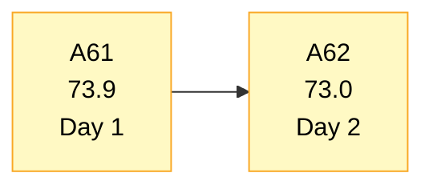
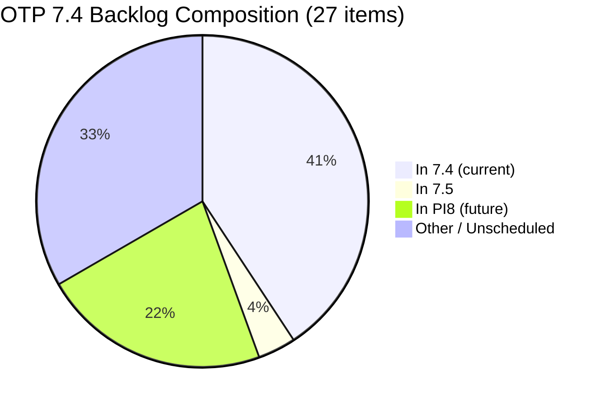

# OTP Team — SAFe Iteration Audit A62
**Date:** 2026-05-19 | **Sprint Day:** 2 of 14 — SPRINT ACTIVE | **Iteration:** 7.4 (May 18 – May 31, 2026)
**Auditor:** Claude Code (ADO SAFe Audit Skill v1) | **Prior Audit:** A61 (2026-05-18 09:00)

---

## 1. Audit Metadata

| Field | Value |
|---|---|
| **Audit ID** | A62 |
| **Report File** | `AUDIT_20260519_0204.md` |
| **Prior Audit** | A61 — `AUDIT_20260518_0900.md` (Overall 73.9, Moderate — 7.4 Day 1 OPEN) |
| **ADO Project** | OTP (`e7739905-28a3-4ae1-9173-7f6cd13b3494`) |
| **ADO Team** | OTP Team (`64de61f0-1203-4b01-aee2-6b4415aec52b`) |
| **Iteration** | 7.4 (`72b2008d-7779-4d11-8356-c744f5a69a87`) |
| **Iteration Dates** | May 18 – May 31, 2026 |
| **Sprint Day** | **2 of 14 — SPRINT ACTIVE** |
| **Audit Date** | 2026-05-19 02:04 PHT |
| **Overall Score** | **73.0 — Moderate Risk** |
| **Risk Band** | Moderate (60–79.9) |
| **Visible Backlog Items** | 27 root items |
| **Current Iteration Root Items** | 11 (IterationPath = 7.4) |
| **Capacity Source** | `work_get_team_capacity` — Grace: 1.0 h/day |
| **Project Exceptions Applied** | Single-assignee model (Grace) — D2 scored full |

---

## 2. Executive Summary

| Field | Value |
|---|---|
| **Overall Score** | 73.0 — Moderate Risk |
| **Score vs Prior (A61)** | 73.9 → 73.0 (**−0.9** — backlog growth + #204384 rescheduled) |
| **Sprint Day** | **2 of 14 — SPRINT ACTIVE** |
| **Iteration** | 7.4 (May 18 – May 31, 2026) |
| **Items in 7.4** | 11 root items (was 12 in A61; #204384 moved to 7.5) |
| **Committed SP** | 22 SP (11 items × 2 SP each) |
| **SP Closed** | 0 (early-sprint Day 2) |
| **Risk Band** | Moderate (60–79.9) |

**7.4 Day 2 holds at Moderate Risk (73.0).** Overnight changes bring one positive development and one concern. On the positive side, #204122 ("Generate ACR Token") moved to Active status today, clearing the D6 untouched penalty — the team's backlog refinement is now 100%. On the concern side, six new PI8 career-path stories (#204590–#204610) were added to the visible backlog (scheduled in Iterations 8.2 and 8.6), expanding the denominator from 21 to 27 items. This dilutes D1 from 57.1 to 40.7, pushing it deeper into High Risk. Additionally, #204384 ("ADO Contract Repository & Billing Alignment") was rescheduled from 7.4 to 7.5, reducing committed sprint scope from 12→11 items and 24→22 SP.

**Primary watchpoints:**
1. **D1 (40.7) — High Risk** — backlog denominator inflation from 6 future-PI items. Assign those 6 items to specific PI8 iterations in ADO to reduce the active denominator, or use the backlog area rather than a sprint path.
2. **#204384 rescheduled** — "ADO Contract Repository & Billing Alignment" moved to 7.5. Monitor whether this was a deliberate de-scope or a task management oversight.
3. **D7 (0.0) — Early-sprint Day 2** — annotated per policy; first delivery opportunities expected Days 3–5.
4. **All 11 current items remain New** — no status progression yet. Watch for Active transitions by Day 3.

---

## 3. Previous Audit Delta (A61 → A62)

| Dimension | A61 Score | A62 Score | Delta | Driver |
|---|---|---|---|---|
| D1 Iteration Planning | 57.1 | 40.7 | **−16.4** | Backlog grew 21→27 (6 new PI8 career items); #204384 moved out of 7.4; current items dropped 12→11 |
| D2 Team Capacity | 100.0 | 100.0 | 0.0 | Grace 1.0 h/day — unchanged |
| D3 Estimation | 100.0 | 100.0 | 0.0 | All 11 items estimated at 2 SP each |
| D4 DoR Compliance | 100.0 | 100.0 | 0.0 | All 11 items pass Desc≥30 + AC≥20 |
| D5 Work Item Balance | 70.0 | 70.0 | 0.0 | All-User-Story composition; −30 structural penalty persists |
| D6 Backlog Refinement | 90.0 | 100.0 | **+10.0** | #204122 became Active today — only 1/11 untouched (9.1%) < 10% threshold; no penalty |
| D7 Delivery Predictability | 0.0 | 0.0 | 0.0 | Early-sprint Day 2 annotation; 0/22 SP closed |
| **Overall** | **73.9** | **73.0** | **−0.9** | D1 regression partially offset by D6 recovery |

---

## 4. Dimension Scores

### D1 — Iteration Planning: 40.7 / 100 🟠 High Risk

**Formula:** (items in current iteration) / (total visible backlog items) × 100

| Metric | Value |
|---|---|
| Items in 7.4 | 11 |
| Total visible backlog items | 27 |
| Score | 11 / 27 × 100 = **40.7** |

**Evidence:**
- 11 items with IterationPath = 7.4: #203867, #203868, #203869, #203870, #203871, #203872, #203873, #203874, #203875, #203876, #204122
- #204384 ("ADO Contract Repository & Billing Alignment") moved from 7.4 → 7.5 since A61
- 6 new PI8 career-path items added to backlog: #204590, #204594, #204598 (Iterations 8.2 — PM tracks); #204602, #204606, #204610 (Iterations 8.6 — Developer tracks)
- Previous backlog: 21 items → Current: 27 items (+6 net, −1 from 7.4 scope)

**Finding (HIGH):** D1 at 40.7 is in the High Risk band. The primary driver is denominator inflation — 16 of 27 visible items are not in the current sprint. The 6 new PI8 stories are future-planned work and should either be assigned to their respective PI8 iterations in ADO or placed in a dedicated PI8 area to remove them from the active sprint backlog count.

---

### D2 — Team Capacity: 100.0 / 100 🟢 Low Risk

**Formula:** (members with capacity configured) / (active team members) × 100

| Metric | Value |
|---|---|
| Active team members | 1 (Grace — sole assignee) |
| Members with capacity configured | 1 |
| Score | 1 / 1 × 100 = **100.0** |

**Evidence:** Grace configured at 1.0 h/day (Documentation 0.5h + Requirements 0.5h). Project Exception: single-assignee model accepted — full score per team agreement.

---

### D3 — Estimation: 100.0 / 100 🟢 Low Risk

**Formula:** (items with SP > 0) / (total current iteration items) × 100

| Metric | Value |
|---|---|
| Items with SP > 0 | 11 |
| Total current iteration items | 11 |
| Score | 11 / 11 × 100 = **100.0** |

**Evidence:** All 11 current-iteration items estimated at 2 SP each. Total committed: 22 SP.

---

### D4 — DoR Compliance: 100.0 / 100 🟢 Low Risk

**Formula:** (items with Desc≥30 chars AND AC≥20 chars) / (total current iteration items) × 100

| Metric | Value |
|---|---|
| DoR-compliant items | 11 |
| Total current iteration items | 11 |
| Score | 11 / 11 × 100 = **100.0** |

**Evidence:** All 11 items verified: Description ≥30 non-whitespace characters AND Acceptance Criteria ≥20 non-whitespace characters. No gaps detected.

---

### D5 — Work Item Balance: 70.0 / 100 🟡 Moderate Risk

**Formula:** Base 100; −30 if any single type >60% AND no Enablers present; −20 if Spikes >40%

| Type | Count | % |
|---|---|---|
| User Story | 11 | 100% |
| Enabler | 0 | 0% |
| Spike | 0 | 0% |

**Score:** Base 100 − 30 (User Story 100% > 60%, no Enablers) = **70.0**

**Finding (MODERATE):** All-User-Story composition persists across all 7.4 items. Adding a single Enabler story (e.g., technical infrastructure, DevOps setup, or compliance work) or reclassifying one existing item would eliminate the −30 structural penalty and restore D5 to 100.0.

---

### D6 — Backlog Refinement: 100.0 / 100 🟢 Low Risk

**Formula:** Base 100; −20 if untouched items >30%; −10 if untouched 10–30%

**Freshness window:** Items with ChangedDate ≥ May 4, 2026 (45-day window from May 19)

| Metric | Value |
|---|---|
| Total current iteration items | 11 |
| Items untouched (ChangedDate < May 18, sprint start) | 1 (#204117 — last changed May 12) |
| Untouched percentage | 1 / 11 = 9.1% |
| Score | Base 100; 9.1% < 10% → no penalty = **100.0** |

**Improvement from A61:** #204122 ("Generate ACR Token for Azure Container Registry") was changed today (May 19), moving from untouched to active. Previously 2/12 = 16.7% untouched (−10 penalty applied in A61). Now only #204117 remains untouched at 9.1%, below the 10% threshold.

**Note (#204117):** Last changed May 12 — six days before sprint start. This is within the 45-day freshness window but has not been touched since the sprint opened. Recommend reviewing on Day 3.

---

### D7 — Delivery Predictability: 0.0 / 100 🔴 Critical (Early-Sprint Annotation)

**Formula:** (SP closed this sprint) / (total committed SP) × 100

| Metric | Value |
|---|---|
| SP closed this sprint | 0 |
| Total committed SP | 22 |
| Score | 0 / 22 × 100 = **0.0** |

> **Early-Sprint Annotation:** Day 2 of 14. D7 = 0.0 is expected and does not reflect execution failure. First delivery opportunities anticipated Days 3–5. This dimension will become meaningful from Day 5 onward.

---

## 5. Scorecard Summary

```
┌─────────────────────────────────────────────┬────────┬──────┐
│ Dimension                                   │ Score  │ Band │
├─────────────────────────────────────────────┼────────┼──────┤
│ D1  Iteration Planning                      │  40.7  │  🟠  │
│ D2  Team Capacity                           │ 100.0  │  🟢  │
│ D3  Estimation                              │ 100.0  │  🟢  │
│ D4  DoR Compliance                          │ 100.0  │  🟢  │
│ D5  Work Item Balance                       │  70.0  │  🟡  │
│ D6  Backlog Refinement                      │ 100.0  │  🟢  │
│ D7  Delivery Predictability (Day 2†)        │   0.0  │  🔴  │
├─────────────────────────────────────────────┼────────┼──────┤
│ OVERALL                                     │  73.0  │  🟡  │
└─────────────────────────────────────────────┴────────┴──────┘
† Early-sprint annotation — no execution failure implied
```

---

## 6. Findings

| # | Severity | Dimension | Finding | Action |
|---|---|---|---|---|
| F1 | HIGH | D1 | Backlog denominator inflated to 27 (+6 PI8 career-path items #204590–#204610). 11/27 = 40.7% planning coverage. | Assign PI8 items to specific PI8 iteration paths or dedicated PI8 backlog area. Target: reduce to ≤18 active items. |
| F2 | MODERATE | D1 | #204384 ("ADO Contract Repository & Billing Alignment") moved from 7.4 to 7.5. Sprint scope reduced 12→11 items, 24→22 SP. | Confirm this was a deliberate de-scope decision. If unintentional, restore to 7.4 before Day 3. |
| F3 | MODERATE | D5 | All 11 current items are User Stories (100%). Structural balance penalty (−30) persists. | Add at least 1 Enabler to current iteration or reclassify one existing item. |
| F4 | INFO | D7 | 0 SP closed, 22 SP committed. Day 2 early-sprint annotation. | First deliveries expected Days 3–5. Monitor daily from Day 3. |
| F5 | INFO | D6 | #204117 unchanged since May 12 (before sprint start). Currently within threshold but approaching watch boundary. | Review and update #204117 by Day 3. |

---

## 7. Trend Visualization

### Score Trend (Last 5 Audits)

```mermaid
xychart-beta is NOT used — using line chart workaround
```



### Dimension Radar (A62 vs A61)

```mermaid
quadrantChart
    title Dimension Scores A62 (OTP 7.4 Day 2)
    x-axis Low Score --> High Score
    y-axis Planning/Process --> Delivery/Quality
    quadrant-1 Strength
    quadrant-2 Process Strong
    quadrant-3 Weak
    quadrant-4 Delivery Focus
    D1 Iteration Planning: [0.41, 0.20]
    D2 Team Capacity: [1.00, 0.40]
    D3 Estimation: [1.00, 0.60]
    D4 DoR Compliance: [1.00, 0.80]
    D5 Work Item Balance: [0.70, 0.50]
    D6 Backlog Refinement: [1.00, 0.70]
    D7 Delivery Predictability: [0.00, 0.10]
```

### Backlog Composition (A62)



---

## 8. Recommendations

1. **[HIGH — Immediate]** Schedule the 6 new PI8 career-path items (#204590, #204594, #204598, #204602, #204606, #204610) to their respective PI8 iteration paths in ADO (8.2 or 8.6 as planned). This will reduce the active backlog denominator from 27 to ~21, lifting D1 from 40.7 to approximately 52.4 — still in Moderate but recovering toward prior levels.

2. **[MODERATE — By Day 3]** Confirm the status of #204384 ("ADO Contract Repository & Billing Alignment"). If the move to 7.5 was unintended, restore it to 7.4. If deliberate, document the reason in the work item's Discussion field and update the sprint goal.

3. **[MODERATE — Anytime]** Add at least one Enabler story to the 7.4 iteration (e.g., infrastructure hardening, DevOps automation, or a technical debt item). This resolves the D5 structural penalty and lifts D5 from 70.0 to 100.0.

4. **[LOW — By Day 3]** Review and update #204117. The item has not been touched since May 12. A brief comment or state update will reset the freshness timestamp and prevent it from becoming a D6 risk.

5. **[MONITOR — Daily from Day 3]** Track SP closure. With 22 SP committed and 13 days remaining, the team needs to close approximately 1.7 SP/day. Given Grace's single-assignee capacity (1.0 h/day), this is achievable but requires consistent daily progress.

---

## 9. Audit Trail

| Source | Tool Used | Data Retrieved |
|---|---|---|
| Active iteration | `work_list_team_iterations` (project GUID `e7739905-28a3-4ae1-9173-7f6cd13b3494`) | 7.4: May 18–31, ID `72b2008d-7779-4d11-8356-c744f5a69a87` |
| Backlog items | `wit_list_backlog_work_items` | 27 root items visible in backlog |
| Team capacity | `work_get_team_capacity` | Grace: 1.0 h/day (Docs 0.5h + Req 0.5h) |
| Work item details | `wit_get_work_items_batch_by_ids` | 11 current-iteration items — SP, State, Desc, AC, ChangedDate |
| Prior audit | `AUDIT_20260518_0900.md` (A61) | Overall 73.9, 12 items, 24 SP, D1=57.1 |
