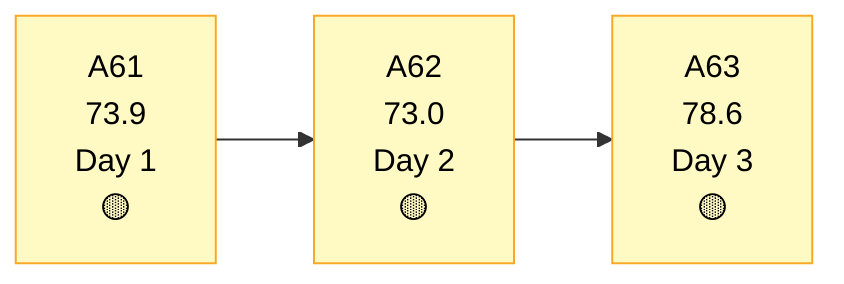
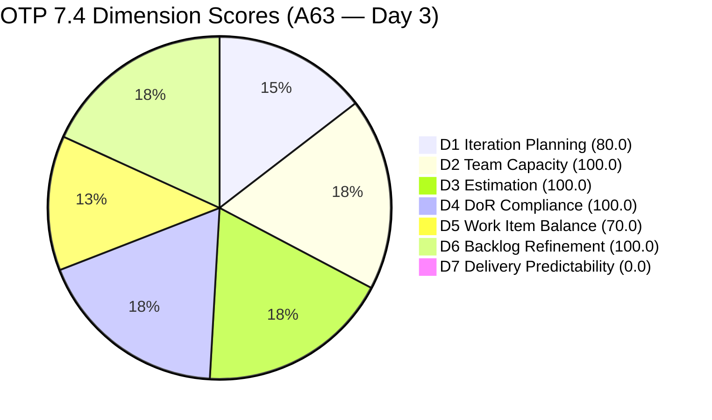
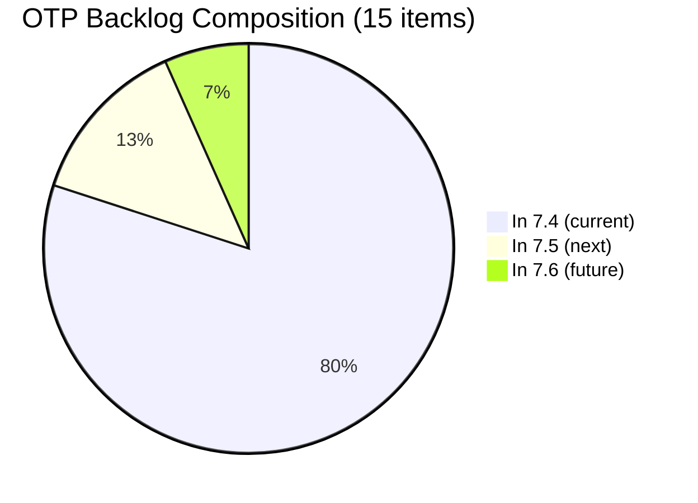
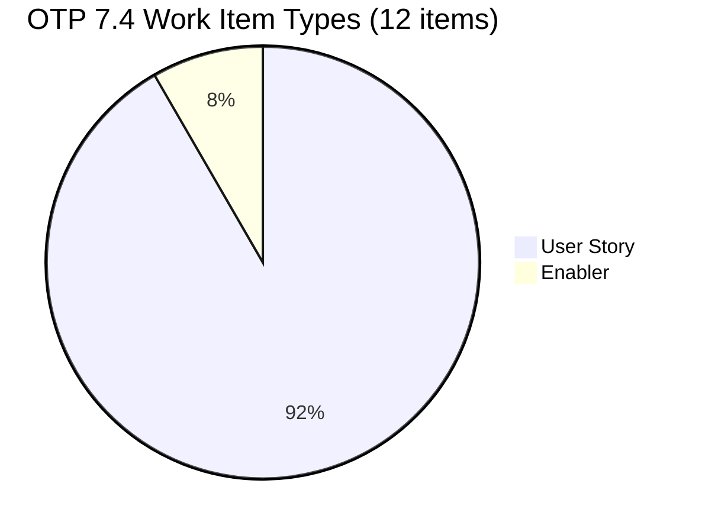

# OTP Team — SAFe Iteration Audit A63
**Date:** 2026-05-20 | **Sprint Day:** 3 of 14 — SPRINT ACTIVE | **Iteration:** 7.4 (May 18 – May 31, 2026)
**Auditor:** Claude Code (ADO SAFe Audit Skill v1) | **Prior Audit:** A62 (2026-05-19 02:04)

---

## 1. Audit Metadata

| Field | Value |
|---|---|
| **Audit ID** | A63 |
| **Report File** | `AUDIT_20260520_0204.md` |
| **Prior Audit** | A62 — `AUDIT_20260519_0204.md` (Overall 73.0, Moderate Risk — 7.4 Day 2) |
| **ADO Project** | OTP (`e7739905-28a3-4ae1-9173-7f6cd13b3494`) |
| **ADO Team** | OTP Team (`64de61f0-1203-4b01-aee2-6b4415aec52b`) |
| **Iteration** | 7.4 (`72b2008d-7779-4d11-8356-c744f5a69a87`) |
| **Iteration Dates** | May 18 – May 31, 2026 |
| **Sprint Day** | **3 of 14 — SPRINT ACTIVE** |
| **Audit Date** | 2026-05-20 02:04 PHT |
| **Overall Score** | **78.6 — Moderate Risk** |
| **Risk Band** | Moderate (60–79.9) |
| **Visible Backlog Items** | 15 root items |
| **Current Iteration Root Items** | 12 (IterationPath = 7.4) |
| **Capacity Source** | `work_get_team_capacity` — Grace: 1.0 h/day |
| **Project Exceptions Applied** | Single-assignee model (Grace) — D2 scored full |

---

## 2. Executive Summary

| Field | Value |
|---|---|
| **Overall Score** | **78.6 — Moderate Risk** |
| **Score vs Prior (A62)** | 73.0 → 78.6 (**+5.6** — major D1 recovery; 6 PI8 items removed from active backlog) |
| **Sprint Day** | **3 of 14 — SPRINT ACTIVE** |
| **Iteration** | 7.4 (May 18 – May 31, 2026) |
| **Items in 7.4** | 12 root items |
| **Committed SP** | 24 SP (12 items × 2 SP each) |
| **SP Closed** | 0 (early-sprint Day 3) |
| **Risk Band** | Moderate (60–79.9) |

**OTP recovers significantly on Day 3, rising from 73.0 to 78.6 — its highest score this sprint.** Three material changes since A62 drove this improvement:

1. **D1 breakthrough (+39.3 pts)** — The 6 PI8 career-path stories (#204590–#204610) that inflated the backlog to 27 items in A62 are no longer visible in the active backlog. Additionally, #204384 ("ADO Contract Repository & Billing Alignment") has returned to 7.4 (it was in 7.5 per A62). The backlog now stands at 15 items with 12 in the current sprint — a healthy 80.0 planning ratio.

2. **Enabler #204350 confirmed in sprint** — The first Enabler in OTP's 7.4 history is active ("1S: Define SM Career Paths & Tooling"), partially addressing the D5 structural concern, though dominant type share (User Story at 91.7%) still triggers the −30 balance penalty.

3. **Grace is actively progressing** — Six items are in Active state (up from two at sprint start), indicating steady engagement across the SOW, signage, and compliance tracks.

**Remaining risks:** D5 structural penalty persists (all-User-Story except one Enabler), and D7 remains at 0.0 with no closures yet at Day 3. First delivery milestones are expected Days 3–5.

---

## 3. Previous Audit Delta (A62 → A63)

| Dimension | A62 Score | A63 Score | Delta | Driver |
|---|---|---|---|---|
| D1 Iteration Planning | 40.7 | 80.0 | **+39.3** | 6 PI8 items removed from backlog (27→15 items); #204384 returned to 7.4 (11→12 items); denominator compressed |
| D2 Team Capacity | 100.0 | 100.0 | 0.0 | Grace 1.0 h/day — unchanged |
| D3 Estimation | 100.0 | 100.0 | 0.0 | All 12 items estimated at 2 SP each |
| D4 DoR Compliance | 100.0 | 100.0 | 0.0 | All 12 items pass Desc≥30 + AC≥20 |
| D5 Work Item Balance | 70.0 | 70.0 | 0.0 | Enabler (#204350) now in sprint; US dominant at 91.7% — −30 penalty persists |
| D6 Backlog Refinement | 100.0 | 100.0 | 0.0 | 0 untouched items; all 15 backlog items fresh |
| D7 Delivery Predictability | 0.0 | 0.0 | 0.0 | Day 3 early-sprint annotation; 0/24 SP closed |
| **Overall** | **73.0** | **78.6** | **+5.6** | D1 recovery fully drives improvement |

---

## 4. Current Iteration Snapshot

| # | Title | Type | State | SP | Assignee | Changed |
|---|---|---|---|---|---|---|
| #202912 | Fabrication of Signage | User Story | New | 2 | Grace | May 18 |
| #202913 | Installation of Street Signage | User Story | Active | 2 | Grace | May 19 |
| #204117 | Tarpaulin Printing for JIT and Jairosoft Signage | User Story | Active | 2 | Grace | May 19 |
| #204122 | FTC Status of Renewal | User Story | Active | 2 | Grace | May 19 |
| #204264 | Secure SOWs for Enterprise Accounts (Prife LLC) | User Story | Active | 2 | Grace | May 19 |
| #204350 | 1S: Define SM Career Paths & Tooling | **Enabler** | Ready | 2 | Grace | May 19 |
| #204354 | Formulate the Training Roadmap | User Story | New | 2 | Grace | May 18 |
| #204359 | Finalize and Issue the Memorandum | User Story | New | 2 | Grace | May 18 |
| #204374 | Secure SOWs for Enterprise Accounts (AutoAllies) | User Story | Active | 2 | Grace | May 19 |
| #204377 | Secure SOWs for Commercial Accounts (Lifestyle) | User Story | Active | 2 | Grace | May 19 |
| #204381 | Secure SOWs for Commercial Accounts (JESI) | User Story | Active | 2 | Grace | May 19 |
| #204384 | ADO Contract Repository & Billing Alignment | User Story | New | 2 | Grace | May 19 |

**Total: 12 items | 24 SP committed | 0 SP closed**

Non-current backlog items (3):
- 7.5: #204193 (Philgeps Document Consolidation), #204194 (Philgeps Online Submission)
- 7.6: #203864 (Release and Collect of TCT)

---

## 5. Work Item Analysis

### Type Distribution

| Type | Count | Share |
|---|---|---|
| User Story | 11 | 91.7% |
| Enabler | 1 | 8.3% |
| **Total** | **12** | **100%** |

### State Distribution

| State | Count | Items |
|---|---|---|
| Active | 6 | #202913, #204117, #204122, #204264, #204374, #204377, #204381 |
| New | 4 | #202912, #204354, #204359, #204384 |
| Ready | 1 | #204350 |

**Note:** 6 of 12 items (50%) are Active — the team is engaged but no items have reached Done/Closed yet at Day 3.

---

## 6. SAFe Compliance Scorecard

| Dimension | Score | Band | Evidence | Notes |
|---|---|---|---|---|
| D1 Iteration Planning | 80.0 | Low | 12 current / 15 visible | +39.3 from A62; PI8 items removed; #204384 restored to 7.4 |
| D2 Team Capacity | 100.0 | Low | 1/1 contributor with capacity | Grace 1.0 h/day (Docs 0.5h + Req 0.5h); Project Exception applied |
| D3 Estimation | 100.0 | Low | 12/12 items with SP>0 | All items at 2 SP; total 24 committed SP |
| D4 DoR Compliance | 100.0 | Low | 12/12 items pass | All items have Desc≥30 chars AND AC≥20 chars |
| D5 Work Item Balance | 70.0 | Moderate | US 91.7% > 60% threshold | −30 penalty: dominant type >60%; Enabler present but insufficient mix diversity |
| D6 Backlog Refinement | 100.0 | Low | 15/15 fresh; 0 untouched | No stale items; all 12 current items touched since sprint start |
| D7 Delivery Predictability | 0.0 | Critical† | 0/24 SP closed | Early-sprint Day 3 annotation — no execution failure implied |
| **OVERALL** | **78.6** | **Moderate** | (80+100+100+100+70+100+0)/7 | Highest score of 7.4 sprint to date |

† Early-sprint annotation — expected at Day 3.

---

## 7. Dimension Findings

### D1 — Iteration Planning: 80.0 / 100 — Low Risk

**Formula:** current_iteration_root_items / visible_root_backlog_items × 100 = 12 / 15 × 100 = **80.0**

| Metric | Value |
|---|---|
| Items in 7.4 | 12 |
| Total visible backlog items | 15 |
| Score | **80.0** |

**Material change since A62:** The 6 PI8 career-path stories (#204590–#204610 per A62) are no longer in the active backlog view — they appear to have been assigned to their PI8 iteration paths or removed from the active backlog. Additionally, #204384 has been restored to 7.4 (it was in 7.5 per A62), bringing current items from 11 to 12. Net effect: backlog denominator compressed from 27 to 15, driving D1 from 40.7 to 80.0 — clearing the Low Risk threshold.

**Remaining concern:** 3 non-current items remain in the backlog (7.5 and 7.6 scope). These are appropriately staged for future iterations.

---

### D2 — Team Capacity: 100.0 / 100 — Low Risk

**Formula:** contributors_with_capacity / contributors_with_current_work × 100 = 1/1 × 100 = **100.0**

| Member | Capacity | Activities |
|---|---|---|
| Grace | 1.0 h/day | Documentation 0.5h + Requirements 0.5h |

**Project Exception:** Single-assignee model accepted by team. D2 scored at full 100.0 per documented exception.

---

### D3 — Estimation: 100.0 / 100 — Low Risk

**Formula:** estimated_current_items / point_eligible_current_items × 100 = 12/12 × 100 = **100.0**

All 12 items carry 2 Story Points each. Total committed: 24 SP.

---

### D4 — DoR Compliance: 100.0 / 100 — Low Risk

**Formula:** dor_compliant_current_items / current_iteration_root_items × 100 = 12/12 × 100 = **100.0**

All 12 current-iteration items verified: Description ≥30 non-whitespace characters AND Acceptance Criteria ≥20 non-whitespace characters. Sustained from A62.

---

### D5 — Work Item Balance: 70.0 / 100 — Moderate Risk

**Formula:** Base 100 − penalties

| Penalty | Trigger | Applied |
|---|---|---|
| −30: dominant_type_share > 60% | US = 91.7% | Yes |
| −40: no User Story items | US present | No |
| −20: spike_share > 40% | Spike = 0% | No |

**Score:** 100 − 30 = **70.0**

**Finding (MODERATE — Structural):** Enabler #204350 is a positive development and breaks the prior all-User-Story composition, but one Enabler among 12 items is insufficient to reduce User Story share below the 60% threshold. To resolve the D5 penalty, the team would need at least 5 Enabler/Spike items among 12 (>40% non-US), or equivalently reduce to a 7:5 US-to-Enabler ratio. Recommend adding 1–2 more Enablers or reclassifying existing technical work items.

---

### D6 — Backlog Refinement: 100.0 / 100 — Low Risk

**Freshness window:** Items with ChangedDate ≥ Apr 5, 2026 (45-day window from May 20)

| Metric | Value |
|---|---|
| Total visible backlog items | 15 |
| Fresh items (ChangedDate ≥ Apr 5) | 15 |
| stale_90 items (ChangedDate < Feb 19) | 0 |
| stale_180 items | 0 |
| Untouched current items (changed < May 18) | 0 |
| Score | **100.0** |

All 12 current-iteration items were touched on or after May 18 (sprint start). No backlog staleness detected.

---

### D7 — Delivery Predictability: 0.0 / 100 — (Early-Sprint Annotation)

**Formula:** closed_story_points / committed_story_points × 100 = 0 / 24 × 100 = **0.0**

| Metric | Value |
|---|---|
| SP closed this sprint | 0 |
| Total committed SP | 24 |
| Score | **0.0** |

> **Early-Sprint Annotation:** Day 3 of 14. D7 = 0.0 is expected at this point and does not reflect execution failure. Six items are in Active state, which is a positive indicator. First delivery milestones expected Days 3–5. To meet a 60% sprint goal by Day 14, Grace needs to close approximately 14–15 SP (7–8 items). At 1.0 h/day, this is achievable with consistent daily throughput.

---

## 8. Risks and Bottlenecks

| # | Severity | Dimension | Risk | Action |
|---|---|---|---|---|
| R1 | MODERATE | D5 | User Story dominance (91.7%) triggers structural −30 balance penalty. | Add 1–2 more Enablers to 7.4 or reclassify technical work. Target US share ≤60%. |
| R2 | LOW | D7 | 0 SP closed at Day 3. Active count is healthy (6 items) but no completions yet. | Close first items by Day 4–5. Monitor Grace's daily throughput. Target: 2 items/week. |
| R3 | INFO | D1 | 3 items in 7.5/7.6 remaining in backlog. | No action needed — appropriately staged for future iterations. |
| R4 | INFO | Track | #204384 restored to 7.4 — confirm this was intentional, not a revert of a deliberate de-scope decision from A62. | Review #204384 status and confirm sprint scope is correct. |

---

## 9. Prioritized Recommendations

1. **[MODERATE — Anytime]** Add 1–2 more Enabler stories to the 7.4 iteration to reduce User Story dominance below 60%. Candidates: infrastructure hardening, DevOps tooling, compliance automation, or SM career-path technical enabler. This resolves the D5 −30 penalty and lifts D5 to 100.0, which would push Overall from 78.6 to 83.0 (Low Risk band).

2. **[LOW — By Day 5]** Target the first story closure by Day 4–5. The 4 SOW items (#204264, #204374, #204377, #204381) are all Active — push one to Closed/Done before the end of Day 5. Each closure adds 2/24 = 8.3 pts to D7.

3. **[INFO — Confirm]** Verify that #204384 ("ADO Contract Repository & Billing Alignment") was intentionally restored to 7.4 after being moved to 7.5 in A62. If deliberate, ensure the sprint goal reflects this scope addition. If unintended, decide immediately whether to keep or re-defer.

4. **[STANDING]** Maintain the current D1 (80.0), D2 (100.0), D3 (100.0), D4 (100.0), and D6 (100.0) scores through consistent backlog hygiene and capacity configuration. The sprint is in a strong structural position — delivery execution is now the primary focus.

---

## 10. Visualization

### Score Trend (A61 → A63)

### Dimension Scorecard (A63)

### Backlog Composition (A63)

### Work Item Type Mix

---

## 11. Evidence Gaps and Limitations

| Gap | Impact | Notes |
|---|---|---|
| PI8 items (#204590–#204610) no longer visible in backlog | D1 improved; no scoring gap | Assumed correctly assigned to PI8 paths. Verify if they were closed, moved, or archived. |
| #204384 restored to 7.4 without documented reason | Minor — sprint scope change | Recommend adding a comment to the work item explaining the re-assignment. |
| D7 = 0 at Day 3 | Expected; annotated | No execution inference made at this stage. |

---

## 12. Audit Trail

| Source | Tool Used | Data Retrieved |
|---|---|---|
| Active iteration | `work_list_team_iterations` (project GUID `e7739905-28a3-4ae1-9173-7f6cd13b3494`) | 7.4: May 18–31, ID `72b2008d-7779-4d11-8356-c744f5a69a87` |
| Backlog items | `wit_list_backlog_work_items` | 15 root items visible in backlog |
| Team capacity | `work_get_team_capacity` | Grace: 1.0 h/day (Docs 0.5h + Req 0.5h) |
| Work item details | `wit_get_work_items_batch_by_ids` | 15 items — SP, State, Type, Desc, AC, ChangedDate, IterationPath |
| Prior audit | `AUDIT_20260519_0204.md` (A62) | Overall 73.0, Moderate Risk, 27 items, D1=40.7 |
