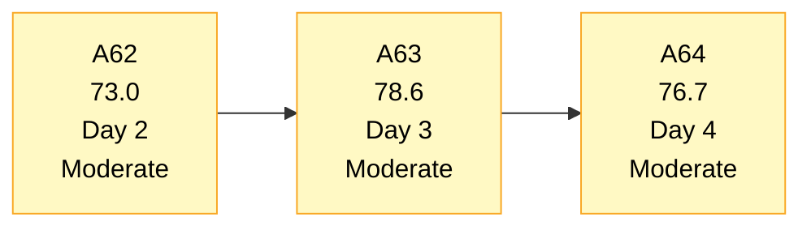
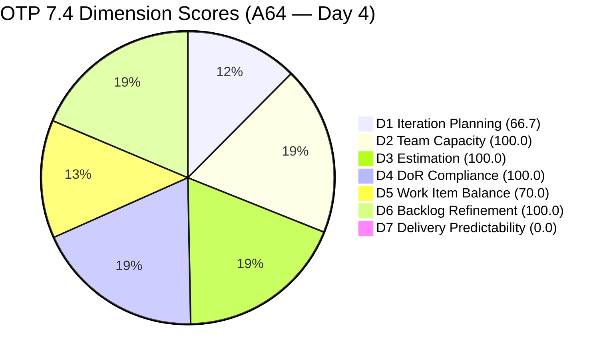
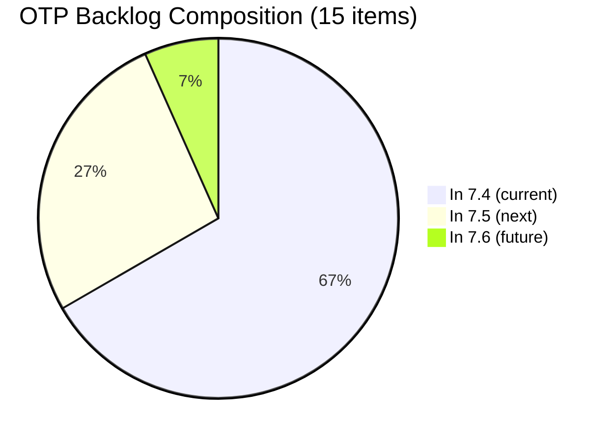
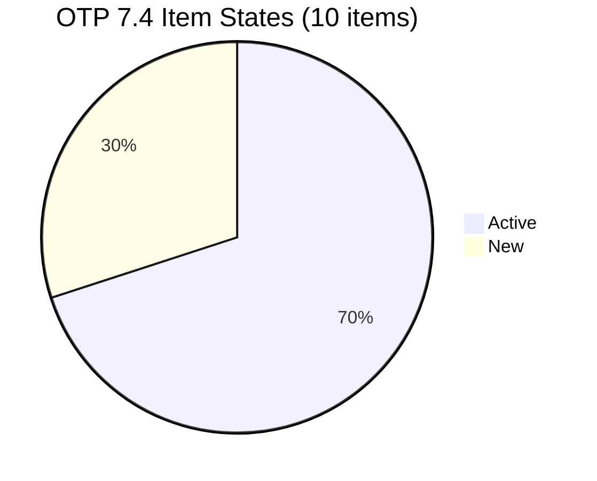
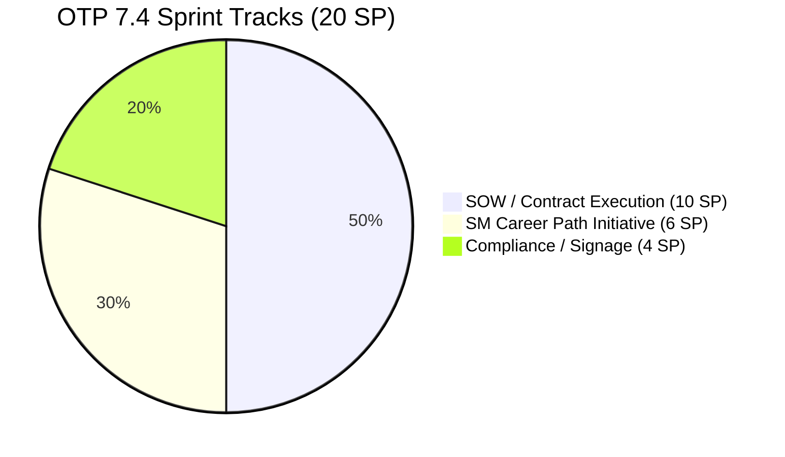

# OTP Team — SAFe Iteration Audit A64
**Date:** 2026-05-21 | **Sprint Day:** 4 of 14 — SPRINT ACTIVE | **Iteration:** 7.4 (May 18 – May 31, 2026)
**Auditor:** Claude Code (ADO SAFe Audit Skill v1) | **Prior Audit:** A63 (2026-05-20 02:04)

---

## 1. Audit Metadata

| Field | Value |
|---|---|
| **Audit ID** | A64 |
| **Report File** | `AUDIT_20260521_0915.md` |
| **Prior Audit** | A63 — `AUDIT_20260520_0204.md` (Overall 78.6, Moderate Risk — 7.4 Day 3) |
| **ADO Project** | OTP (`e7739905-28a3-4ae1-9173-7f6cd13b3494`) |
| **ADO Team** | OTP Team (`64de61f0-1203-4b01-aee2-6b4415aec52b`) |
| **Iteration** | 7.4 (`72b2008d-7779-4d11-8356-c744f5a69a87`) |
| **Iteration Dates** | May 18 – May 31, 2026 |
| **Sprint Day** | **4 of 14 — SPRINT ACTIVE** |
| **Audit Date** | 2026-05-21 09:15 PHT |
| **Overall Score** | **76.7 — Moderate Risk** |
| **Risk Band** | Moderate (60–79.9) |
| **Visible Backlog Items** | 15 root items |
| **Current Iteration Root Items** | 10 (IterationPath = 7.4) |
| **Capacity Source** | `work_get_team_capacity` — Grace: 1.0 h/day |
| **Project Exceptions Applied** | Single-assignee model (Grace) — D2 scored full |

---

## 2. Executive Summary

| Field | Value |
|---|---|
| **Overall Score** | **76.7 — Moderate Risk** |
| **Score vs Prior (A63)** | 78.6 → 76.7 (**−1.9** — scope reduction: 2 items moved to 7.5 overnight) |
| **Sprint Day** | **4 of 14 — SPRINT ACTIVE** |
| **Iteration** | 7.4 (May 18 – May 31, 2026) |
| **Items in 7.4** | 10 root items (down from 12 in A63) |
| **Committed SP** | 20 SP (10 items × 2 SP each) |
| **SP Closed** | 0 (early-sprint Day 4) |
| **Risk Band** | Moderate (60–79.9) |

**OTP registers a minor regression on Day 4 (78.6 → 76.7), driven entirely by a deliberate sprint scope reduction overnight.** Two signage items (#202912 "Fabrication of Signage" and #202913 "Installation of Street Signage") were moved from 7.4 to 7.5, with ChangedDate 2026-05-20T23:09–23:10Z (early May 21 PHT). This reduces the current sprint to 10 items and compresses committed SP from 24 to 20. The denominator (15 visible backlog items) is unchanged, dropping D1 from 80.0 to 66.7.

The structural picture remains solid:
- Grace holds 7 of 10 items in Active state — strong mid-sprint engagement
- D2, D3, D4, D6 all remain at 100.0
- D5 structural penalty (User Story dominance at 90%) is unchanged
- D7 = 0.0 is expected at Day 4; first closures anticipated Days 4–6

With 10 remaining items and a 14-day sprint, the team has comfortable runway to deliver. The scope reduction is a net positive for sprint focus.

---

## 3. Previous Audit Delta (A63 → A64)

| Dimension | A63 Score | A64 Score | Delta | Driver |
|---|---|---|---|---|
| D1 Iteration Planning | 80.0 | 66.7 | **−13.3** | #202912 and #202913 moved to 7.5 (12→10 current items); denominator unchanged at 15 |
| D2 Team Capacity | 100.0 | 100.0 | 0.0 | Grace 1.0 h/day — unchanged |
| D3 Estimation | 100.0 | 100.0 | 0.0 | All 10 remaining items estimated at 2 SP |
| D4 DoR Compliance | 100.0 | 100.0 | 0.0 | All 10 items pass Desc≥30 + AC≥20 |
| D5 Work Item Balance | 70.0 | 70.0 | 0.0 | US dominant at 90% — −30 penalty unchanged |
| D6 Backlog Refinement | 100.0 | 100.0 | 0.0 | No stale items; 0 untouched in 7.4 |
| D7 Delivery Predictability | 0.0 | 0.0 | 0.0 | Day 4 early-sprint annotation; 0/20 SP closed |
| **Overall** | **78.6** | **76.7** | **−1.9** | D1 drop fully driven by deliberate signage scope deferral |

**Key structural change:** #202912 and #202913 ("Fabrication of Signage" and "Installation of Street Signage") were deliberately moved from 7.4 to 7.5 late on May 20. These items are still in-progress work; the move reflects a planning decision to defer physical signage activities to the next sprint. This is scope management, not scope loss — no cause for alarm. The 7.4 sprint now has a tighter, more focused set of 10 items.

---

## 4. Current Iteration Snapshot

| # | Title | Type | State | SP | Assignee | Changed |
|---|---|---|---|---|---|---|
| #204117 | Tarpaulin Printing for JIT and Jairosoft Signage | User Story | Active | 2 | Grace | May 19 |
| #204122 | FTC Status of Renewal | User Story | Active | 2 | Grace | May 19 |
| #204264 | Secure SOWs for Enterprise Accounts (Prife LLC) | User Story | Active | 2 | Grace | May 20 |
| #204350 | 1S: Define SM Career Paths & Tooling | Enabler | Active | 2 | Grace | May 20 |
| #204354 | Formulate the Training Roadmap | User Story | New | 2 | Grace | May 18 |
| #204359 | Finalize and Issue the Memorandum | User Story | New | 2 | Grace | May 18 |
| #204374 | Secure SOWs for Enterprise Accounts (AutoAllies) | User Story | Active | 2 | Grace | May 19 |
| #204377 | Secure SOWs for Commercial Accounts (Lifestyle) | User Story | Active | 2 | Grace | May 20 |
| #204381 | Secure SOWs for Commercial Accounts (JESI) | User Story | Active | 2 | Grace | May 19 |
| #204384 | ADO Contract Repository & Billing Alignment | User Story | New | 2 | Grace | May 19 |

**Total: 10 items | 20 SP committed | 0 SP closed**

Items moved out of 7.4 since A63:
- 7.5 (deferred): #202912 (Fabrication of Signage), #202913 (Installation of Street Signage)

Non-current backlog items (5 total):
- 7.5: #202912, #202913 (deferred today), #204193 (Philgeps Doc Consolidation), #204194 (Philgeps Online Submission)
- 7.6: #203864 (Release and Collect of TCT)

---

## 5. Work Item Analysis

### Type Distribution

| Type | Count | Share |
|---|---|---|
| User Story | 9 | 90.0% |
| Enabler | 1 | 10.0% |
| **Total** | **10** | **100%** |

### State Distribution

| State | Count | Items |
|---|---|---|
| Active | 7 | #204117, #204122, #204264, #204350, #204374, #204377, #204381 |
| New | 3 | #204354, #204359, #204384 |

**Note:** 7 of 10 items (70%) are Active — Grace is highly engaged at Day 4. No items have reached Closed/Done yet. #204350 (Enabler) moved to Active since A63's "Ready" state — positive progression.

### Sprint Focus Tracks

| Track | Items | SP |
|---|---|---|
| SOW / Contract Execution | #204264, #204374, #204377, #204381, #204384 | 10 SP |
| Compliance / Signage | #204117, #204122 | 4 SP |
| SM Career Path Initiative | #204350, #204354, #204359 | 6 SP |

---

## 6. SAFe Compliance Scorecard

| Dimension | Score | Band | Evidence | Notes |
|---|---|---|---|---|
| D1 Iteration Planning | 66.7 | Moderate | 10 current / 15 visible | −13.3 from A63; #202912/#202913 deferred to 7.5 overnight |
| D2 Team Capacity | 100.0 | Low | 1/1 contributor with capacity | Grace 1.0 h/day (Docs 0.5h + Req 0.5h); Project Exception applied |
| D3 Estimation | 100.0 | Low | 10/10 items with SP>0 | All items at 2 SP; total 20 SP committed |
| D4 DoR Compliance | 100.0 | Low | 10/10 items pass | All items: Desc≥30 chars AND AC≥20 chars confirmed |
| D5 Work Item Balance | 70.0 | Moderate | US 90.0% > 60% threshold | −30 penalty: dominant type >60%; 1 Enabler insufficient to dilute |
| D6 Backlog Refinement | 100.0 | Low | 15/15 fresh; 0 untouched | Freshness window Apr 6; all items touched May 18–20 |
| D7 Delivery Predictability | 0.0 | Critical† | 0/20 SP closed | Early-sprint Day 4 — expected; 7 Active items signal momentum |
| **OVERALL** | **76.7** | **Moderate** | (66.7+100+100+100+70+100+0)/7 | Minor regression from A63 due to deliberate scope deferral |

† Early-sprint annotation — expected at Day 4. Per rubric, Day 1–5 qualifies for low-delivery annotation.

---

## 7. Dimension Findings

### D1 — Iteration Planning: 66.7 / 100 — Moderate Risk

**Formula:** current_iteration_root_items / visible_root_backlog_items × 100 = 10/15 × 100 = **66.7**

| Metric | Value |
|---|---|
| Items in 7.4 | 10 |
| Total visible backlog items | 15 |
| Score | **66.7** |

**Material change since A63:** Items #202912 ("Fabrication of Signage") and #202913 ("Installation of Street Signage") were moved from 7.4 to 7.5, effective late May 20 (ChangedDate 23:09–23:10Z UTC). Both items are physical/operational in nature (street signage fabrication and installation), and deferring them to 7.5 is a reasonable sprint planning decision. The visible backlog denominator remains at 15, so the ratio dropped from 12/15 = 80.0 to 10/15 = 66.7.

**Context:** D1 = 66.7 places OTP back in Moderate (vs Low at 80.0 yesterday). The 5 non-current items (4 in 7.5, 1 in 7.6) are all appropriately staged for future iterations.

---

### D2 — Team Capacity: 100.0 / 100 — Low Risk

**Formula:** contributors_with_capacity / contributors_with_current_work × 100 = 1/1 × 100 = **100.0**

| Member | Capacity | Activities |
|---|---|---|
| Grace | 1.0 h/day | Documentation 0.5h + Requirements 0.5h |

**Project Exception:** Single-assignee model accepted by team. D2 scored at full 100.0 per documented exception in workspace CLAUDE.md.

---

### D3 — Estimation: 100.0 / 100 — Low Risk

**Formula:** estimated_current_items / point_eligible_current_items × 100 = 10/10 × 100 = **100.0**

All 10 items carry 2 Story Points each. Total committed: 20 SP. No estimation gaps.

---

### D4 — DoR Compliance: 100.0 / 100 — Low Risk

**Formula:** dor_compliant_current_items / current_iteration_root_items × 100 = 10/10 × 100 = **100.0**

All 10 current-iteration items verified: Description ≥30 non-whitespace characters AND Acceptance Criteria ≥20 non-whitespace characters. Sustained from A63. DoR discipline remains a key strength for OTP.

---

### D5 — Work Item Balance: 70.0 / 100 — Moderate Risk

**Formula:** Base 100 − penalties

| Penalty | Trigger | Applied |
|---|---|---|
| −30: dominant_type_share > 60% | US = 90.0% | Yes |
| −40: no User Story items | US present (9 items) | No |
| −20: spike_share > 40% | Spike = 0% | No |

**Score:** 100 − 30 = **70.0**

**Finding (MODERATE — Structural):** Removing the two signage User Stories (#202912, #202913) did not improve the type ratio. User Stories now represent 9 of 10 items (90.0% vs 91.7% in A63). The structural imbalance persists. The single Enabler (#204350, now Active) remains insufficient to move User Story share below 60%. To clear the D5 penalty, at least 5 items would need to be non-User-Story type (i.e., 5+ of 10). Recommend adding 1–2 technical Enablers or reclassifying existing items.

---

### D6 — Backlog Refinement: 100.0 / 100 — Low Risk

**Freshness window:** Items with ChangedDate ≥ Apr 6, 2026 (45-day window from May 21)

| Metric | Value |
|---|---|
| Total visible backlog items | 15 |
| Fresh items (ChangedDate ≥ Apr 6) | 15 |
| stale_90 items (ChangedDate < Feb 20) | 0 |
| stale_180 items | 0 |
| Untouched current items (changed < May 18) | 0 |
| Score | **100.0** |

All 10 current-iteration items have ChangedDate of May 18, 19, or 20 — all within the sprint window. No backlog staleness detected.

---

### D7 — Delivery Predictability: 0.0 / 100 — (Early-Sprint Annotation)

**Formula:** closed_story_points / committed_story_points × 100 = 0/20 × 100 = **0.0**

| Metric | Value |
|---|---|
| SP closed this sprint | 0 |
| Total committed SP | 20 |
| Score | **0.0** |

> **Early-Sprint Annotation:** Day 4 of 14. D7 = 0.0 is expected in the first 5 sprint days and does not reflect execution failure. Seven items are in Active state (70% of sprint), which is a strong engagement signal. The sprint commitment has been right-sized to 20 SP (down from 24 in A63). To achieve a 60% sprint goal by Day 14, Grace needs to close approximately 12 SP (6 items). At 1.0 h/day capacity across 10 remaining sprint days, this requires consistent throughput of roughly 1 item every 2 days — achievable with the current Active engagement.

---

## 8. Risks and Bottlenecks

| # | Severity | Dimension | Risk | Action |
|---|---|---|---|---|
| R1 | MODERATE | D1 | Iteration planning ratio at 66.7 (10/15). 5 non-current items staged for 7.5/7.6. | No immediate action needed — items are correctly staged. Monitor that 7.5 items (#202912, #202913) are not silently deferred further. |
| R2 | MODERATE | D5 | User Story dominance (90.0%) triggers structural −30 balance penalty. | Add 1–2 more Enablers to 7.4 or reclassify technical work items. Target US share ≤60%. Resolving would lift D5 to 100.0 and Overall to ~83.0 (Low Risk). |
| R3 | LOW | D7 | 0 SP closed at Day 4. Active count is high (7 items) but no completions yet. | Target first closure by Day 5–6. The 4 SOW items (#204264, #204374, #204377, #204381) are all Active — any one is a candidate for Day 5 closure. |
| R4 | INFO | Scope | #202912 and #202913 deferred to 7.5 late May 20. | Confirm deferral was deliberate and record the reason (physical logistics, material delivery timing, etc.) in a work item comment for sprint review traceability. |

---

## 9. Prioritized Recommendations

1. **[MODERATE — Anytime]** Add 1–2 Enablers to the 7.4 sprint to reduce User Story dominance below 60%. With 10 items, adding 4+ Enablers/non-US items (to make the ratio ≤6:10) is the target. Candidates: infrastructure hardening, SM tooling automation, or compliance framework technical work. This resolves the D5 −30 penalty and lifts Overall from 76.7 to 83.0 (Low Risk band).

2. **[LOW — By Day 6]** Target the first story closure. The 4 Active SOW items (#204264, #204374, #204377, #204381) are well-suited for near-term closure: they are business process items (route SOW through AdobeSign) with clear binary outcomes. Close one before end of Day 6 to establish sprint velocity.

3. **[INFO — Document]** Add a comment to #202912 and #202913 explaining the reason for the 7.4 → 7.5 deferral (logistics, material lead time, etc.). This ensures sprint review traceability and prevents the items from appearing as "unresolved scope changes" in future audits.

4. **[STANDING]** Maintain the current D2 (100.0), D3 (100.0), D4 (100.0), and D6 (100.0) scores. The sprint is structurally well-managed — the D1 and D5 issues are known structural constraints. Delivery execution (D7) is now the primary focus.

---

## 10. Visualization

### Score Trend (A62 → A64)

### Dimension Scorecard (A64)

### Backlog Composition (A64)

### Work Item State Distribution

### Sprint Focus Track Breakdown

---

## 11. Evidence Gaps and Limitations

| Gap | Impact | Notes |
|---|---|---|
| #202912 and #202913 moved to 7.5 late May 20 without documented reason | D1 decreased from A63; no scoring gap | Assumed deliberate deferral. Recommend team adds comment to both items explaining logistics reason. |
| D7 = 0 at Day 4 | Expected; annotated | Early-sprint Day 4 annotation applied per rubric. No execution inference made. |
| Grace capacity at 1.0 h/day for 20 SP sprint | Theoretical throughput constraint noted | At 1.0 h/day, 10 remaining sprint days = 10h capacity. Estimated completion depends on actual effort/item. Track actual throughput starting Day 5. |

---

## 12. Audit Trail

| Source | Tool Used | Data Retrieved |
|---|---|---|
| Active iteration | `work_list_team_iterations` (project GUID `e7739905-28a3-4ae1-9173-7f6cd13b3494`, team GUID `64de61f0-1203-4b01-aee2-6b4415aec52b`) | 7.4: May 18–31, ID `72b2008d-7779-4d11-8356-c744f5a69a87` |
| Backlog items | `wit_list_backlog_work_items` (backlogId `Microsoft.RequirementCategory`) | 15 root items visible in backlog |
| Team capacity | `work_get_team_capacity` (iterationId `72b2008d-7779-4d11-8356-c744f5a69a87`) | Grace: 1.0 h/day (Docs 0.5h + Req 0.5h) |
| Work item details | `wit_get_work_items_batch_by_ids` | 15 items — SP, State, Type, Desc, AC, ChangedDate, IterationPath |
| Prior audit | `AUDIT_20260520_0204.md` (A63) | Overall 78.6, Moderate Risk, 12 items, 24 SP |
