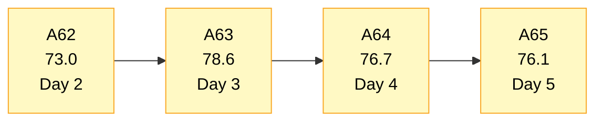
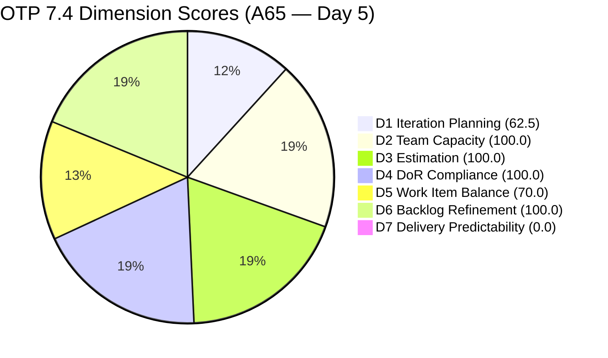
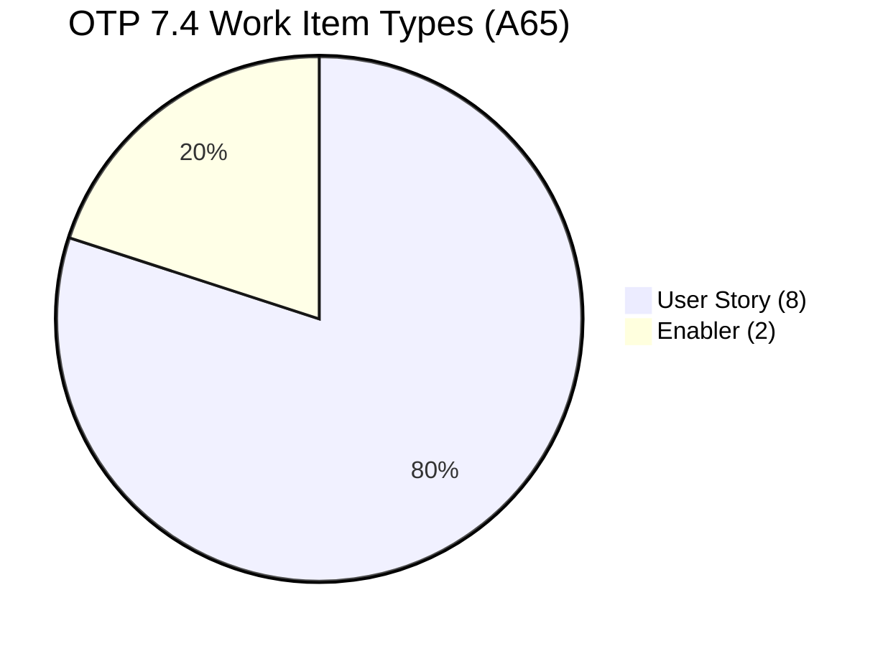
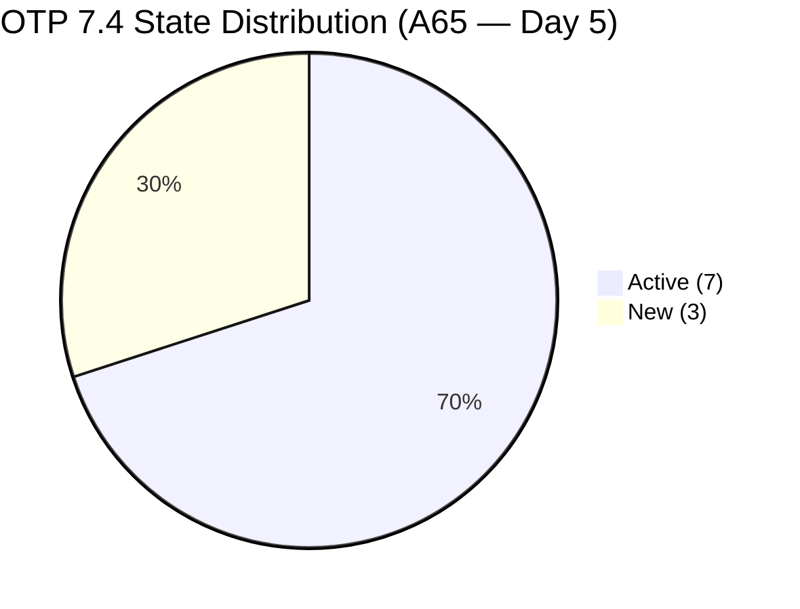
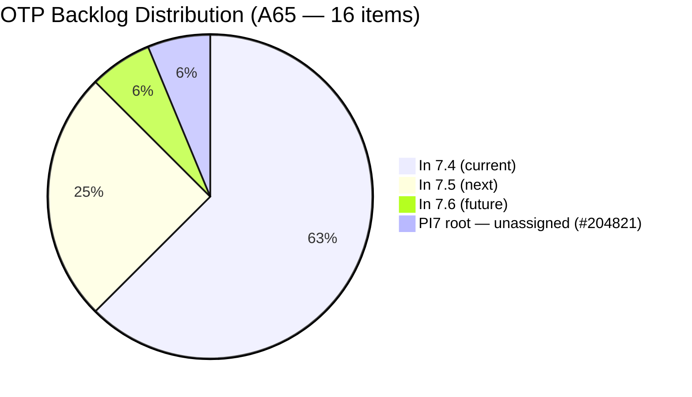

# OTP Team — SAFe Iteration Audit A65
**Date:** 2026-05-22 | **Sprint Day:** 5 of 14 — SPRINT ACTIVE | **Iteration:** 7.4 (May 18 – May 31, 2026)
**Auditor:** Claude Code (ADO SAFe Audit Skill v1) | **Prior Audit:** A64 (2026-05-21 09:15)

---

## 1. Audit Metadata

| Field | Value |
|---|---|
| **Audit ID** | A65 |
| **Report File** | `AUDIT_20260522_0900.md` |
| **Prior Audit** | A64 — `AUDIT_20260521_0915.md` (Overall 76.7, Moderate Risk — 7.4 Day 4) |
| **ADO Project** | OTP (`e7739905-28a3-4ae1-9173-7f6cd13b3494`) |
| **ADO Team** | OTP Team |
| **Iteration** | 7.4 (`72b2008d-7779-4d11-8356-c744f5a69a87`) |
| **Iteration Dates** | May 18 – May 31, 2026 |
| **Sprint Day** | **5 of 14 — SPRINT ACTIVE** |
| **Audit Date** | 2026-05-22 09:00 PHT |
| **Overall Score** | **76.1 — Moderate Risk** |
| **Risk Band** | Moderate (60–79.9) |
| **Visible Backlog Items** | 16 root items |
| **Current Iteration Root Items** | 10 (IterationPath = 7.4) |
| **Capacity Source** | No capacity configured for OTP Team in Iteration 7.4 (ADO returned no data) |
| **Project Exceptions Applied** | Single-assignee model (Grace) — D2 scored full per documented exception |

---

## 2. Executive Summary

| Field | Value |
|---|---|
| **Overall Score** | **76.1 — Moderate Risk** |
| **Score vs Prior (A64)** | 76.7 → 76.1 (**−0.6** — backlog grew by 1 new item #204821) |
| **Sprint Day** | **5 of 14 — SPRINT ACTIVE** |
| **Iteration** | 7.4 (May 18 – May 31, 2026) |
| **Items in 7.4** | 10 root items (unchanged from A64) |
| **Committed SP** | 20 SP (unchanged) |
| **SP Closed** | 0 (early-sprint Day 5) |
| **Risk Band** | Moderate (60–79.9) |

**OTP holds steady on Day 5 with a marginal −0.6 regression** driven entirely by backlog growth: a new item (#204821, "FTC Akira") was added to the PI7 root with no assigned iteration, expanding the visible denominator from 15 to 16. The current sprint scope (10 items, 20 SP, all assigned to Grace) is unchanged.

Two notable positive developments since A64:
1. **Type mix improvement:** #204354 is confirmed as an **Enabler** (not User Story as reflected in prior audits), bringing the sprint to 2 Enablers + 8 User Stories. D5 penalty persists (-30 for US at 80% dominant share) but the ratio has improved from 90% to 80%.
2. **Bulk timestamp update (May 21 23:44 UTC):** Items #202912, #202913, #203864, #204193, #204194, and #204821 all show an identical ChangedDate of `2026-05-21T23:44:34.203Z`. This is consistent with a bulk iteration assignment or board reorganization — all non-7.4 items remain correctly staged.

Day 5 is the last day of the early-sprint window. D7 remains 0.0 as annotated. The team must deliver first closures by Day 6–7 to establish velocity visibility.

---

## 3. Previous Audit Delta (A64 → A65)

| Dimension | A64 Score | A65 Score | Delta | Driver |
|---|---|---|---|---|
| D1 Iteration Planning | 66.7 | 62.5 | **−4.2** | Backlog grew from 15 to 16 items (#204821 added to PI7 root); 10/16 = 62.5 |
| D2 Team Capacity | 100.0 | 100.0 | 0.0 | Project Exception applied — Grace single-assignee model unchanged |
| D3 Estimation | 100.0 | 100.0 | 0.0 | All 10 items at 2 SP — no change |
| D4 DoR Compliance | 100.0 | 100.0 | 0.0 | All 10 items pass Desc ≥30 + AC ≥20 — no change |
| D5 Work Item Balance | 70.0 | 70.0 | 0.0 | US = 8/10 = 80% — still triggers −30 penalty; 2 Enablers present |
| D6 Backlog Refinement | 100.0 | 100.0 | 0.0 | All 16 fresh; 0 untouched in 7.4 — no change |
| D7 Delivery Predictability | 0.0 | 0.0 | 0.0 | Day 5 early-sprint — expected (last day of annotation window) |
| **Overall** | **76.7** | **76.1** | **−0.6** | Driven by D1 denominator growth from 15→16 |

**Key structural note on #204821:** "FTC Akira" was added with no Description or Acceptance Criteria, IterationPath = `OTP\\2026 - PI7` (PI-level, not assigned to any iteration). The item is assigned to Grace with 0 SP (no story points visible). This item is in the **visible backlog** but NOT in the current iteration, so it does not affect D3, D4, or D7 — but it does reduce D1 from 66.7 to 62.5. It must be triaged immediately: assign to a specific iteration (7.5/7.6) or remove from active backlog.

**Type correction note on #204354:** ADO confirms #204354 ("Formulate the Training Roadmap") is type **Enabler**, not User Story. Prior audits A62–A64 may have categorized it incorrectly. Current sprint composition: 8 User Stories + 2 Enablers.

---

## 4. Current Iteration Snapshot

| # | Title | Type | State | SP | Assignee | Changed |
|---|---|---|---|---|---|---|
| #204117 | Tarpaulin Printing for JIT and Jairosoft signage | User Story | Active | 2 | Grace | May 19 |
| #204122 | FTC Status of renewal | User Story | Active | 2 | Grace | May 19 |
| #204264 | Secure SOWs for Enterprise Accounts (Prife LLC) | User Story | Active | 2 | Grace | May 20 |
| #204350 | 1S: Define SM Career Paths & Tooling | Enabler | Active | 2 | Grace | May 20 |
| #204354 | Formulate the Training Roadmap | Enabler | New | 2 | Grace | May 21 |
| #204359 | Finalize and Issue the Memorandum | User Story | New | 2 | Grace | May 18 |
| #204374 | Secure SOWs for Enterprise Accounts (AutoAllies) | User Story | Active | 2 | Grace | May 19 |
| #204377 | Secure SOWs for Commercial Accounts (Lifestyle) | User Story | Active | 2 | Grace | May 20 |
| #204381 | Secure SOWs for Commercial Accounts (JESI) | User Story | Active | 2 | Grace | May 19 |
| #204384 | ADO Contract Repository & Billing Alignment | User Story | New | 2 | Grace | May 19 |

**Total: 10 items | 20 SP committed | 0 SP closed**

**Non-current backlog items (6 total):**

| # | Title | Iteration | State |
|---|---|---|---|
| #202912 | Fabrication of Signage | 7.5 | New |
| #202913 | Installation of Street Signage | 7.5 | Active |
| #204193 | Philgeps Document Consolidation | 7.5 | New |
| #204194 | Philgeps Online Submission | 7.5 | New |
| #203864 | Release and Collect of TCT | 7.6 | New |
| #204821 | FTC Akira | PI7 root (no iter) | New |

---

## 5. Work Item Analysis

### Type Distribution (10 current items)

| Type | Count | Share |
|---|---|---|
| User Story | 8 | 80.0% |
| Enabler | 2 | 20.0% |
| **Total** | **10** | **100%** |

### State Distribution (10 current items)

| State | Count | Items |
|---|---|---|
| Active | 6 | #204117, #204122, #204264, #204350, #204374, #204377, #204381 |
| New | 3 | #204354, #204359, #204384 |

**Day 5 engagement:** 7 Active items → 70% active rate. Strong signal of work in progress. 3 New items (#204354, #204359, #204384) have not transitioned — these should be moving to Active by Day 5–6.

### Sprint Focus Tracks

| Track | Items | SP |
|---|---|---|
| SOW / Contract Execution | #204264, #204374, #204377, #204381, #204384 | 10 SP |
| SM Career Path Initiative | #204350, #204354, #204359 | 6 SP |
| Compliance / Signage | #204117, #204122 | 4 SP |

### Backlog Composition

| Bucket | Count | Notes |
|---|---|---|
| In 7.4 (current) | 10 | Sprint scope — all Grace |
| In 7.5 (next) | 4 | Correctly staged |
| In 7.6 (future) | 1 | Correctly staged |
| PI7 root (unassigned) | 1 | #204821 — needs triage |

---

## 6. SAFe Compliance Scorecard

| Dimension | Score | Band | Evidence | Notes |
|---|---|---|---|---|
| D1 Iteration Planning | 62.5 | Moderate | 10 current / 16 visible | −4.2 from A64; #204821 added to PI7 root without iteration assignment |
| D2 Team Capacity | 100.0 | Low | 1/1 contributor | No ADO capacity data returned; Project Exception applied — Grace single-assignee |
| D3 Estimation | 100.0 | Low | 10/10 items with SP>0 | All items at 2 SP; total 20 SP committed |
| D4 DoR Compliance | 100.0 | Low | 10/10 items pass | All: Desc≥30 chars AND AC≥20 chars confirmed |
| D5 Work Item Balance | 70.0 | Moderate | US 80.0% > 60% threshold | −30 penalty; improved from 90% (A64) to 80% — type correction on #204354 |
| D6 Backlog Refinement | 100.0 | Low | 16/16 fresh; 0 untouched | All items changed ≥ Apr 15; all 7.4 items changed May 18–21 |
| D7 Delivery Predictability | 0.0 | Critical† | 0/20 SP closed | Early-sprint Day 5 — last day of annotation window; first closures due Day 6 |
| **OVERALL** | **76.1** | **Moderate** | (62.5+100+100+100+70+100+0)/7 | −0.6 from A64; backlog denominator growth |

† Early-sprint annotation — Day 5 is the final day of the Day 1–5 low-delivery window. Starting Day 6, D7 = 0.0 will reflect an actual execution gap, not an early-sprint annotation.

---

## 7. Dimension Findings

### D1 — Iteration Planning: 62.5 / 100 — Moderate Risk

**Formula:** 10 / 16 × 100 = **62.5**

| Metric | Value |
|---|---|
| Items in 7.4 | 10 |
| Total visible backlog items | 16 |
| Score | **62.5** |

The D1 score dropped from 66.7 (A64) to 62.5 due to the addition of #204821 ("FTC Akira") to the visible backlog at the PI7 root level with no specific iteration assignment. This item has no Description, no Acceptance Criteria, and no Story Points — it is an empty placeholder. The most actionable fix is to assign it to a specific iteration (7.5 or 7.6) or remove it from the active backlog. Either action has no D1 impact (it would shift from the denominator to a non-current iteration) but prevents compounding in future audits.

The 6 non-current items are all correctly staged for future sprints (7.5, 7.6, or PI-level). No undesirable carry-overs are present in the 7.4 scope.

---

### D2 — Team Capacity: 100.0 / 100 — Low Risk

**Formula:** 1/1 × 100 = **100.0**

ADO `work_get_team_capacity` returned no capacity data for OTP Team in Iteration 7.4 today (API returned "No team capacity assigned"). The Project Exception documented in `ado_otp/CLAUDE.md` explicitly accepts the single-assignee model with Grace as sole contributor. D2 is scored at 100.0 per the exception — Grace's participation is evidenced by 6 Active items in the sprint.

| Member | Evidence | Capacity |
|---|---|---|
| Grace | 6 Active items in 7.4 | Accepted per Project Exception |

---

### D3 — Estimation: 100.0 / 100 — Low Risk

**Formula:** 10/10 × 100 = **100.0**

All 10 current-iteration items carry 2 Story Points each. Total committed: 20 SP. No estimation gaps.

---

### D4 — DoR Compliance: 100.0 / 100 — Low Risk

**Formula:** 10/10 × 100 = **100.0**

All 10 current-iteration items verified: Description ≥30 non-whitespace characters AND Acceptance Criteria ≥20 non-whitespace characters. Sustained from A64. This remains OTP's primary structural strength.

Note: #204821 (visible backlog, PI7 root) has no Description or AC — it would fail DoR if it enters the current sprint without remediation. Flag for triage before assignment to any active iteration.

---

### D5 — Work Item Balance: 70.0 / 100 — Moderate Risk

**Formula:** Base 100 − penalties

| Penalty | Trigger | Applied |
|---|---|---|
| −30: dominant_type_share > 60% | US = 80.0% > 60% | Yes |
| −40: no User Story items | US present (8 items) | No |
| −20: spike_share > 40% | Spike = 0% | No |

**Score:** 100 − 30 = **70.0**

**Positive development:** The type distribution improved from 90% US (A64) to 80% US today — driven by the confirmed classification of #204354 as Enabler. With 2 Enablers (20% of sprint), the D5 situation is improving. To clear the −30 penalty, at least 5 of 10 items must be non-User-Story type (≤60% US share). Current path: adding or reclassifying 2 more non-US items would achieve this (8 US + 4 non-US = 60% — boundary case; need 8 US + 5 non-US to go below).

---

### D6 — Backlog Refinement: 100.0 / 100 — Low Risk

**Freshness window:** Items with ChangedDate ≥ Apr 7, 2026 (45 days from May 22)

| Metric | Value |
|---|---|
| Total visible backlog items | 16 |
| Fresh items (ChangedDate ≥ Apr 7) | 16 (oldest: #186848-equivalent items all ≥ Apr 15) |
| stale_90 items (ChangedDate < Feb 21) | 0 |
| stale_180 items (ChangedDate < Nov 23, 2025) | 0 |
| Untouched current items (ChangedDate < May 18) | 0 |
| Score | **100.0** |

The bulk update on May 21 (23:44 UTC) refreshed ChangedDate on all 6 non-current items, maintaining the 100% freshness rate. No penalties applied.

---

### D7 — Delivery Predictability: 0.0 / 100 — (Early-Sprint Annotation — Final Day)

**Formula:** 0 / 20 × 100 = **0.0**

| Metric | Value |
|---|---|
| SP closed this sprint | 0 |
| Total committed SP | 20 |
| Score | **0.0** |

> **Early-Sprint Annotation — FINAL DAY:** Day 5 of 14. Per rubric, Day 1–5 qualifies for the early-sprint annotation. **Day 5 is the last day this annotation applies.** Starting Day 6 (May 23), D7 = 0.0 will no longer be annotated and will contribute a Critical score to the overall.
>
> **Urgency:** Grace must close at least 1 story by end of Day 5 or Day 6 to establish velocity. The 4 SOW items (#204264, #204374, #204377, #204381) are all Active and are the best candidates — they have clear binary outcomes (route SOW through AdobeSign → signed and uploaded). Any single closure credits 2 SP (10% of committed). Target: 6+ SP (3 stories) closed by Day 7 to enter Low Risk territory on D7 by sprint midpoint.

---

## 8. Risks and Bottlenecks

| # | Severity | Dimension | Risk | Action |
|---|---|---|---|---|
| R1 | HIGH | D7 | Day 5 is the last day of the early-sprint annotation. Starting Day 6, 0 SP closed will be scored as Critical with no annotation. Grace has 6 Active items but 0 closures across 5 sprint days. | Close at least 1 of the 4 Active SOW items today (Day 5). Target: #204264, #204374, #204377, or #204381 — all Active, clear acceptance criteria. |
| R2 | MODERATE | D1 | #204821 ("FTC Akira") has no description, no AC, no SP, and no specific iteration. It is an empty placeholder in the PI7 root, diluting D1 from 66.7 to 62.5. | Assign #204821 to a specific iteration (7.5 or 7.6) and add Description + AC before next audit. If not actionable this PI, move to Backlog or remove. |
| R3 | MODERATE | D5 | User Story dominance at 80% persists. −30 penalty applied. To clear: need 5+ non-US items (currently 2 Enablers). | Add 2–3 technical Enablers or Spikes to 7.4. Alternatively, reclassify 2 existing User Story items to more appropriate types. Resolving would lift D5 to 100.0 and Overall from 76.1 to 82.4 (Low Risk). |
| R4 | LOW | D5 | #204354 was previously misclassified as User Story in audit history. Now confirmed as Enabler. | No scoring action needed — current audit reflects correct type. Update audit history comment in CLAUDE.md if desired. |
| R5 | INFO | Scope | Items #202912 and #202913 (7.5) updated May 21 23:44 UTC along with other non-current items. Appears to be a bulk board operation. | Confirm the bulk update was intentional (e.g., board cleanup). No sprint scope change detected. |

---

## 9. Prioritized Recommendations

1. **[CRITICAL — Today Day 5]** Grace must close at least one Active story before end of Day 5. The four Active SOW items (#204264 Prife LLC, #204374 AutoAllies, #204377 Lifestyle, #204381 JESI) each require a signed, uploaded SOW. If any one of these negotiations is resolved, close the item immediately. This prevents D7 from scoring Critical starting Day 6, protects the overall score from dropping to ~65.4, and establishes sprint velocity signal.

2. **[HIGH — Today/Tomorrow]** Triage #204821 ("FTC Akira"): assign it to 7.5 or 7.6 with a minimal Description and AC, or remove it from the active backlog. An empty placeholder in the PI7 root with no iteration is a backlog hygiene issue. Impact: if removed from visible backlog, D1 improves from 62.5 to 66.7 (10/15).

3. **[MODERATE — By Day 7]** Add 2–3 non-User-Story items to the 7.4 sprint to reduce US dominance below 60%. Options:
   - Convert one of the "SOW" work items to a Spike (research/time-bounded exploration)
   - Add a technical Enabler for the ADO contract repository infrastructure work embedded in #204384
   - Break out the Memorandum publication item (#204359) into a smaller Enabler for tooling setup + User Story for the actual publication
   This change lifts D5 from 70.0 to 100.0 and the overall score from 76.1 to 82.4 (Low Risk band).

4. **[MODERATE — Day 6–7]** Transition the 3 "New" state items (#204354, #204359, #204384) to Active. All have been in the sprint since May 18–21 without a state change. Moving to Active signals Grace is engaged with these items and keeps the board current.

5. **[STANDING]** Maintain D2 (100.0), D3 (100.0), D4 (100.0), and D6 (100.0). These represent the structural strength of OTP's sprint discipline. The sprint's primary risks are D7 (closures needed urgently) and D1/D5 (known structural issues with manageable fixes).

---

## 10. Visualization

### Score Trend (A62 → A65)

### Dimension Scorecard (A65)

### Work Item Type Distribution (10 current items)

### Sprint State Distribution (10 current items)

### Backlog Distribution (16 items)

---

## 11. Evidence Gaps and Limitations

| Gap | Impact | Notes |
|---|---|---|
| ADO capacity API returned no data for OTP Team in Iteration 7.4 | D2 requires Project Exception fallback | `work_get_team_capacity` returned "No team capacity assigned." D2 scored at 100.0 per workspace CLAUDE.md Project Exception (single-assignee Grace model). Evidence: 6 Active items confirm Grace's engagement. |
| #204821 has no Description, AC, or SP in ADO | D4 not affected (item not in current iteration) | Item is visible in backlog; would fail DoR if moved to current sprint. Flag for remediation before any iteration assignment. |
| Bulk timestamp update on May 21 23:44 UTC covers 6 non-current items | No scoring impact; noted for audit traceability | Items affected: #202912, #202913, #203864, #204193, #204194, #204821. Appears to be a board reorganization or bulk move. |
| D7 = 0 at Day 5 | Annotated; final annotation day | Starting Day 6, D7 = 0 scores as Critical without annotation. Urgent: Grace must close at least 1 item today. |
| #204354 type confirmed as Enabler (prior audits recorded as User Story) | D5 retroactively improves; corrected in A65 | Historical audits A62–A64 may have reported US = 90%. Correct reading: 80% in A64–A65. |

---

## 12. Audit Trail

| Source | Tool Used | Data Retrieved |
|---|---|---|
| Iteration tree | `work_list_iterations` (project GUID `e7739905-28a3-4ae1-9173-7f6cd13b3494`) | All iterations; 7.4: May 18–31, ID `72b2008d-7779-4d11-8356-c744f5a69a87` |
| Backlog items | `wit_list_backlog_work_items` (backlogId `Microsoft.RequirementCategory`) | 16 root items visible in backlog |
| Team capacity | `work_get_team_capacity` (iterationId `72b2008d-7779-4d11-8356-c744f5a69a87`) | No data returned — Project Exception applied |
| Work item details | `wit_get_work_items_batch_by_ids` | 16 items — SP, State, Type, Desc, AC, ChangedDate, IterationPath |
| Prior audit | `AUDIT_20260521_0915.md` (A64) | Overall 76.7, Moderate Risk, 10 items, 20 SP |
