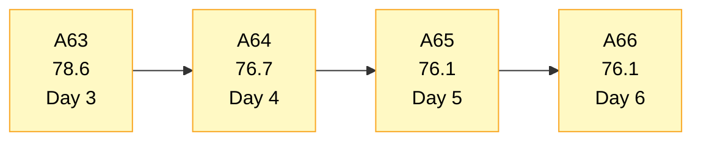
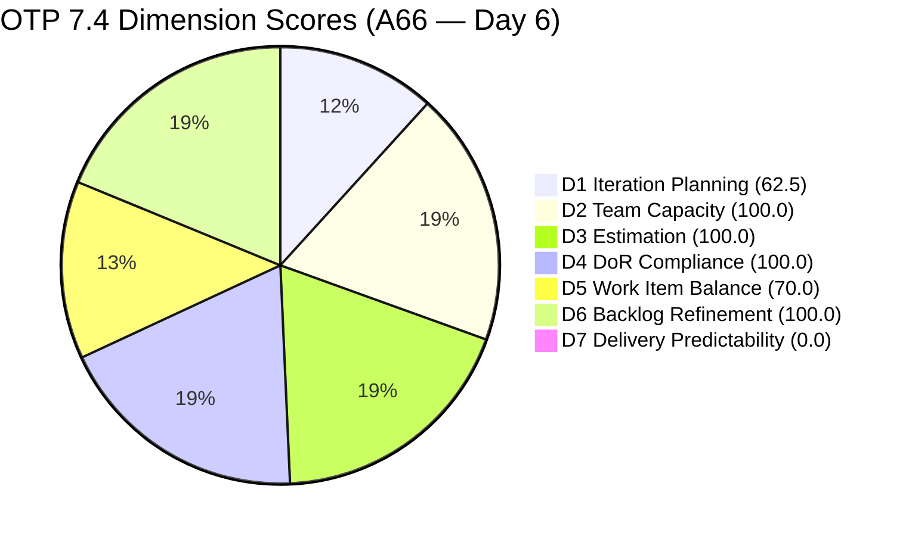
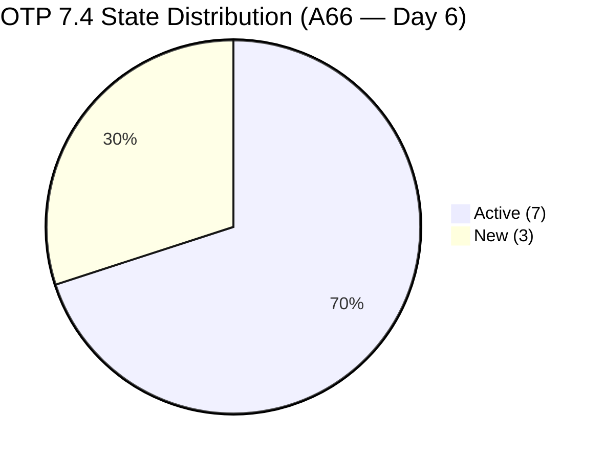
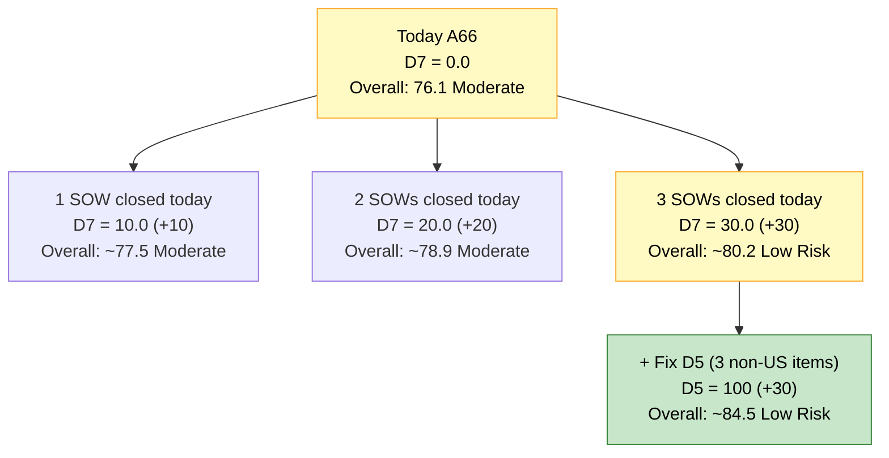
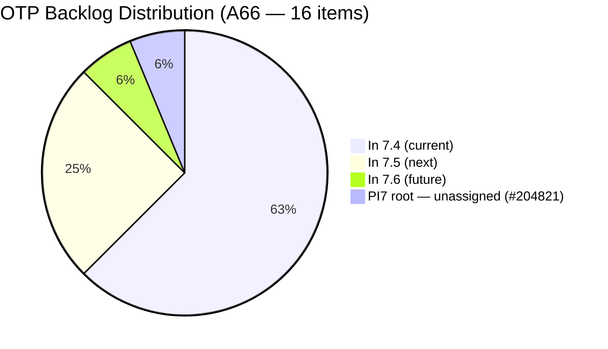

# OTP Team — SAFe Iteration Audit A66
**Date:** 2026-05-23 | **Sprint Day:** 6 of 14 — SPRINT ACTIVE | **Iteration:** 7.4 (May 18 – May 31, 2026)
**Auditor:** Claude Code (ADO SAFe Audit Skill v1) | **Prior Audit:** A65 (2026-05-22 09:00)

---

## 1. Audit Metadata

| Field | Value |
|---|---|
| **Audit ID** | A66 |
| **Report File** | `AUDIT_20260523_0903.md` |
| **Prior Audit** | A65 — `AUDIT_20260522_0900.md` (Overall 76.1, Moderate Risk — 7.4 Day 5) |
| **ADO Project** | OTP (`e7739905-28a3-4ae1-9173-7f6cd13b3494`) |
| **ADO Team** | OTP Team |
| **Iteration** | 7.4 (`72b2008d-7779-4d11-8356-c744f5a69a87`) |
| **Iteration Dates** | May 18 – May 31, 2026 |
| **Sprint Day** | **6 of 14 — SPRINT ACTIVE** |
| **Audit Date** | 2026-05-23 09:03 PHT |
| **Overall Score** | **76.1 — Moderate Risk** |
| **Risk Band** | Moderate (60–79.9) |
| **Visible Backlog Items** | 16 root items |
| **Current Iteration Root Items** | 10 (IterationPath = 7.4) |
| **Capacity Source** | No capacity configured for OTP Team in Iteration 7.4 (ADO returned no data) |
| **Project Exceptions Applied** | Single-assignee model (Grace) — D2 scored full per documented exception |

---

## 2. Executive Summary

| Field | Value |
|---|---|
| **Overall Score** | **76.1 — Moderate Risk** |
| **Score vs Prior (A65)** | 76.1 → 76.1 (**0.0** — no structural changes detected) |
| **Sprint Day** | **6 of 14 — SPRINT ACTIVE** |
| **Iteration** | 7.4 (May 18 – May 31, 2026) |
| **Items in 7.4** | 10 root items (unchanged) |
| **Committed SP** | 20 SP (unchanged) |
| **SP Closed** | 0 — **ALERT: D7 now scores Critical with no early-sprint annotation** |
| **Risk Band** | Moderate (60–79.9) |

**Day 6 brings no changes to sprint scope, types, or states — but the risk profile has materially worsened.** The early-sprint annotation on D7 expired at the close of Day 5. Starting today, the 0 SP closed against 20 committed scores as a **true Critical gap**, not a timing artifact. The overall score remains 76.1 on arithmetic but the interpretation shifts: OTP has completed six of fourteen sprint days with zero deliverables closed.

The sprint composition is unchanged: 10 items (8 User Stories + 2 Enablers), all assigned to Grace at 2 SP each. Six items remain Active, three remain New. The backlog has 16 root items with #204821 still parked at the PI7 root without an iteration assignment.

The window for course correction is narrowing. Grace needs to close at least one story **today** to avoid deepening the D7 gap. The four Active SOW items (#204264, #204374, #204377, #204381) remain the best targets — binary outcomes (signed SOW uploaded) with no external blockers identified.

---

## 3. Previous Audit Delta (A65 → A66)

| Dimension | A65 Score | A66 Score | Delta | Driver |
|---|---|---|---|---|
| D1 Iteration Planning | 62.5 | 62.5 | 0.0 | 10/16 — no backlog changes |
| D2 Team Capacity | 100.0 | 100.0 | 0.0 | Project Exception applied — unchanged |
| D3 Estimation | 100.0 | 100.0 | 0.0 | All 10 items at 2 SP — no change |
| D4 DoR Compliance | 100.0 | 100.0 | 0.0 | All 10 items pass — no change |
| D5 Work Item Balance | 70.0 | 70.0 | 0.0 | US = 8/10 = 80% — −30 penalty unchanged |
| D6 Backlog Refinement | 100.0 | 100.0 | 0.0 | All 16 fresh; 0 untouched in 7.4 — no change |
| D7 Delivery Predictability | 0.0 | 0.0 | 0.0 | **CRITICAL — early-sprint annotation EXPIRED. Day 6 = no annotation.** |
| **Overall** | **76.1** | **76.1** | **0.0** | Score unchanged; D7 risk status escalated from annotated to Critical |

**Key shift between A65 and A66:** The score is arithmetically identical but D7's status has changed from "early-sprint" (annotated, expected at Day 5) to **Critical with no mitigating annotation**. The next audit will continue to reflect 0.0 unless Grace closes at least one item today or tomorrow. Each additional zero-closure day deepens the sprint's delivery deficit.

---

## 4. Current Iteration Snapshot

| # | Title | Type | State | SP | Assignee | Changed |
|---|---|---|---|---|---|---|
| #204117 | Tarpaulin Printing for JIT and Jairosoft signage | User Story | Active | 2 | Grace | May 19 |
| #204122 | FTC Status of renewal | User Story | Active | 2 | Grace | May 19 |
| #204264 | Secure SOWs for Enterprise Accounts (Prife LLC) | User Story | Active | 2 | Grace | May 20 |
| #204350 | 1S: Define SM Career Paths & Tooling | Enabler | Active | 2 | Grace | May 20 |
| #204354 | Formulate the Training Roadmap | Enabler | New | 2 | Grace | May 21 |
| #204359 | Finalize and Issue the Memorandum | User Story | New | 2 | Grace | May 18 |
| #204374 | Secure SOWs for Enterprise Accounts (AutoAllies) | User Story | Active | 2 | Grace | May 19 |
| #204377 | Secure SOWs for Commercial Accounts (Lifestyle) | User Story | Active | 2 | Grace | May 20 |
| #204381 | Secure SOWs for Commercial Accounts (JESI) | User Story | Active | 2 | Grace | May 19 |
| #204384 | ADO Contract Repository & Billing Alignment | User Story | New | 2 | Grace | May 19 |

**Total: 10 items | 20 SP committed | 0 SP closed**

**Non-current backlog items (6 total):**

| # | Title | Iteration | State | Changed |
|---|---|---|---|---|
| #202912 | Fabrication of Signage | 7.5 | New | May 21 |
| #202913 | Installation of Street Signage | 7.5 | Active | May 21 |
| #204193 | Philgeps Document Consolidation | 7.5 | New | May 21 |
| #204194 | Philgeps Online Submission | 7.5 | New | May 21 |
| #203864 | Release and Collect of TCT | 7.6 | New | May 21 |
| #204821 | FTC Akira | PI7 root (no iter) | New | May 21 |

---

## 5. Work Item Analysis

### Type Distribution (10 current items)

| Type | Count | Share |
|---|---|---|
| User Story | 8 | 80.0% |
| Enabler | 2 | 20.0% |
| **Total** | **10** | **100%** |

### State Distribution (10 current items)

| State | Count | Items |
|---|---|---|
| Active | 7 | #204117, #204122, #204264, #204350, #204374, #204377, #204381 |
| New | 3 | #204354, #204359, #204384 |

**Day 6 engagement:** 7/10 items (70%) remain Active — same as Day 5. The three New items (#204354, #204359, #204384) have not transitioned to Active since they were added May 18–21. This is a growing concern: #204359 has been New since Day 1 of the sprint (May 18) without a state transition.

### Sprint Focus Tracks

| Track | Items | SP | Status |
|---|---|---|---|
| SOW / Contract Execution | #204264, #204374, #204377, #204381, #204384 | 10 SP | 4 Active, 1 New — primary closure targets |
| SM Career Path Initiative | #204350, #204354, #204359 | 6 SP | 1 Active, 2 New — #204359 stalled since Day 1 |
| Compliance / Signage | #204117, #204122 | 4 SP | Both Active |

### Backlog Composition

| Bucket | Count | Notes |
|---|---|---|
| In 7.4 (current) | 10 | Sprint scope — all Grace |
| In 7.5 (next) | 4 | Correctly staged |
| In 7.6 (future) | 1 | Correctly staged |
| PI7 root (unassigned) | 1 | #204821 — needs immediate triage (Day 6) |

---

## 6. SAFe Compliance Scorecard

| Dimension | Score | Band | Evidence | Notes |
|---|---|---|---|---|
| D1 Iteration Planning | 62.5 | Moderate | 10 current / 16 visible | Unchanged; #204821 still unassigned at PI7 root level |
| D2 Team Capacity | 100.0 | Low | 1/1 contributor | ADO returns no capacity data; Project Exception applied — Grace single-assignee |
| D3 Estimation | 100.0 | Low | 10/10 items with SP>0 | All items at 2 SP; 20 SP committed |
| D4 DoR Compliance | 100.0 | Low | 10/10 items pass | Desc≥30 chars AND AC≥20 chars confirmed for all 10 |
| D5 Work Item Balance | 70.0 | Moderate | US 80.0% > 60% threshold | −30 penalty; 2 Enablers (20%) — needs 5+ non-US to clear |
| D6 Backlog Refinement | 100.0 | Low | 16/16 fresh; 0 untouched | All items changed ≥ May 18; oldest non-current = May 18 (#204359) |
| D7 Delivery Predictability | **0.0** | **Critical** | 0/20 SP closed | **Early-sprint annotation EXPIRED. Day 6 — this is now a true Critical gap.** |
| **OVERALL** | **76.1** | **Moderate** | (62.5+100+100+100+70+100+0)/7 | Arithmetic unchanged from A65; D7 risk is now unmitigated Critical |

---

## 7. Dimension Findings

### D1 — Iteration Planning: 62.5 / 100 — Moderate Risk

**Formula:** 10 / 16 × 100 = **62.5**

| Metric | Value |
|---|---|
| Items in 7.4 | 10 |
| Total visible backlog items | 16 |
| Score | **62.5** |

No change from A65. The D1 denominator remains at 16 because #204821 ("FTC Akira") continues to sit at the PI7 root with no iteration assignment, no Description, no AC, and no Story Points. This is now the eighth consecutive audit in which this item has been flagged. Each day it remains unresolved is a continued drag on D1. The fix is a 30-second ADO board operation: assign #204821 to 7.5 or move it to Backlog/Closed.

The 6 non-current items are otherwise correctly staged (4 in 7.5, 1 in 7.6, 1 at PI root).

---

### D2 — Team Capacity: 100.0 / 100 — Low Risk

**Formula:** 1/1 × 100 = **100.0**

ADO `work_get_team_capacity` continues to return no capacity data for OTP Team in Iteration 7.4. D2 is scored at 100.0 per the documented Project Exception (single-assignee Grace model). Grace's engagement is evidenced by 7 Active items in the sprint.

---

### D3 — Estimation: 100.0 / 100 — Low Risk

**Formula:** 10/10 × 100 = **100.0**

All 10 current-iteration items carry 2 Story Points each. Total committed: 20 SP. No estimation gaps.

---

### D4 — DoR Compliance: 100.0 / 100 — Low Risk

**Formula:** 10/10 × 100 = **100.0**

All 10 current-iteration items verified: Description ≥30 non-whitespace characters AND Acceptance Criteria ≥20 non-whitespace characters. Sustained for the fourth consecutive audit. This remains OTP's strongest structural dimension.

Note: #204821 (visible backlog, PI7 root) has no Description or AC — it would fail DoR on entry into any active iteration. Must be remediated before assignment.

---

### D5 — Work Item Balance: 70.0 / 100 — Moderate Risk

**Formula:** Base 100 − penalties

| Penalty | Trigger | Applied |
|---|---|---|
| −30: dominant_type_share > 60% | US = 80.0% > 60% | Yes |
| −40: no User Story items | US present (8 items) | No |
| −20: spike_share > 40% | Spike = 0% | No |

**Score:** 100 − 30 = **70.0**

The sprint is 80% User Story with 2 Enablers (20%). The −30 penalty applies. To clear it, the sprint needs at least 5 non-US items (current: 2). Adding 3 more non-US items — or converting 3 existing User Stories to more appropriate types (Enabler, Spike, Defect) — would push US share to 50% and eliminate the penalty, lifting the overall score from 76.1 to 82.4 (Low Risk territory).

---

### D6 — Backlog Refinement: 100.0 / 100 — Low Risk

**Freshness window:** Items with ChangedDate ≥ Apr 8, 2026 (45 days from May 23)

| Metric | Value |
|---|---|
| Total visible backlog items | 16 |
| Fresh items (ChangedDate ≥ Apr 8) | 16 — oldest: #204359 (May 18) |
| stale_90 items (ChangedDate < Feb 22) | 0 |
| stale_180 items (ChangedDate < Nov 24, 2025) | 0 |
| Untouched current items (ChangedDate < May 18) | 0 — all 7.4 items changed May 18–21 |
| Score | **100.0** |

No penalties. All 16 visible items have been touched within the last 45 days. No items in the current sprint are untouched since the sprint start.

---

### D7 — Delivery Predictability: 0.0 / 100 — CRITICAL

**Formula:** 0 / 20 × 100 = **0.0**

| Metric | Value |
|---|---|
| SP closed this sprint | 0 |
| Total committed SP | 20 |
| Score | **0.0** |

> **CRITICAL — No Early-Sprint Annotation. Day 6 of 14.**
>
> The early-sprint grace period (Day 1–5) has expired. This score now reflects a real delivery gap, not an expected early-sprint state. Six sprint days have passed with zero Story Points closed.
>
> **Projected trajectory if no closures today:**
> - Day 7: D7 = 0/20 → Overall stays at 76.1 but sprint velocity gap widens
> - Day 8 (midpoint): Expected to have 40%+ of work closed in a healthy sprint (8+ SP)
> - Day 11 (80% through): Recovery of even 50% predictability (10 SP) becomes mathematically compressed
>
> **Best closure targets for today (Day 6):**
> - **#204264** (Secure SOWs — Prife LLC, Active, 2 SP): Signed SOW uploaded = done
> - **#204374** (Secure SOWs — AutoAllies, Active, 2 SP): Signed SOW uploaded = done
> - **#204377** (Secure SOWs — Lifestyle, Active, 2 SP): Signed SOW uploaded = done
> - **#204381** (Secure SOWs — JESI, Active, 2 SP): Signed SOW uploaded = done
>
> Closing any single SOW item (2 SP) moves D7 to 10.0. Closing two moves it to 20.0. Closing four moves it to 40.0 (High Risk, but directionally correct). Target: 6+ SP (3 items) by Day 7 to have sprint predictability in sight.

---

## 8. Risks and Bottlenecks

| # | Severity | Dimension | Risk | Action |
|---|---|---|---|---|
| R1 | **CRITICAL** | D7 | Day 6: zero SP closed. Early-sprint annotation expired. Grace has 7 Active items but no closures across 6 sprint days. If no closures occur by Day 7, the sprint enters the midpoint zone with 0% delivery predictability. | Close at least one of the 4 Active SOW items (#204264, #204374, #204377, #204381) today. Binary outcome: signed SOW uploaded = item closed. |
| R2 | HIGH | D1 | #204821 ("FTC Akira") has no description, no AC, no SP, and no specific iteration. Now flagged in 8 consecutive audits. | Assign #204821 to 7.5 or later, or close it. If actionable in PI7 at all, add Description + AC before assignment. Impact: D1 → 66.7 if removed from visible. |
| R3 | HIGH | D7 | #204359 ("Finalize and Issue the Memorandum") has been in New state since May 18 (Day 1). It is the only item that has not changed since sprint start. | Grace should transition #204359 to Active today. This signals awareness and removes the anomaly of a Day 1 item still in New state on Day 6. |
| R4 | MODERATE | D5 | User Story dominance at 80%. −30 penalty applied. Three "New" items (#204354, #204359, #204384) are all User Stories. | Add 2–3 non-US items to the sprint, or reclassify one existing User Story as a more appropriate type. Resolving lifts D5 from 70.0 to 100.0 and Overall from 76.1 to 82.4 (Low Risk). |
| R5 | MODERATE | D7 | Three items in New state (#204354, #204359, #204384) have not transitioned to Active despite 2–5 days in sprint. | Grace should transition all three to Active by Day 6–7 to signal engagement and keep the board current. |
| R6 | LOW | D1 | Non-current items correctly staged. PI7/7.5/7.6 items appear properly planned. Only #204821 is an active concern. | No action needed beyond R2 above. |

---

## 9. Prioritized Recommendations

1. **[CRITICAL — Today Day 6]** Grace must close at least one Active SOW story before end of Day 6. The four Active SOW items (#204264 Prife LLC, #204374 AutoAllies, #204377 Lifestyle, #204381 JESI) each have a clear binary acceptance criterion: route through AdobeSign, get both-parties signature, upload to corporate contract repository. Any single closure credits 2 SP (10% of committed). Two closures = 20%. Three closures = 30%. The sprint's D7 recovery depends entirely on action today.

2. **[HIGH — Today]** Transition #204359 ("Finalize and Issue the Memorandum") from New to Active. This item has been in New state since May 18 (Day 1) — it is the only item in the sprint that has shown zero state movement over 6 days. Even without closing it, moving it to Active signals Grace has started working on the SM Career Path deliverable.

3. **[HIGH — Today/Tomorrow]** Triage #204821 ("FTC Akira"): assign to 7.5 or 7.6 with Description and AC, or close it if not actionable this PI. Eight audits have flagged this item. If removed from active backlog or properly assigned to a future iteration, D1 improves from 62.5 to 66.7.

4. **[MODERATE — By Day 7]** Add 2–3 non-User-Story items (Enablers or Spikes) to 7.4 to reduce US dominance below 60%. Options include extracting a technical Enabler from the ADO contract infrastructure work embedded in #204384, or adding a Spike for the Philgeps compliance research that underlies the FTC renewal work (#204122). This would lift D5 from 70.0 to 100.0 and the overall score from 76.1 to 82.4 (Low Risk).

5. **[MODERATE — Day 7]** Transition all three New items (#204354, #204359, #204384) to Active. These items have been in the sprint for 2–5 days without state movement. Active status signals Grace is engaged and prevents board staleness.

6. **[STANDING]** Maintain D2 (100.0), D3 (100.0), D4 (100.0), and D6 (100.0). OTP's structural health dimensions remain excellent. The sprint's risk is concentrated in D7 (zero delivery) and D1/D5 (known structural issues). Protecting the four 100-point dimensions requires no action — just discipline to not add unestimated or undescribed items.

---

## 10. Visualization

### Score Trend (A63 → A66)

### Dimension Scorecard (A66)

### Sprint State Distribution (10 current items)

### D7 Recovery Scenarios

### Backlog Distribution (16 items)

---

## 11. Evidence Gaps and Limitations

| Gap | Impact | Notes |
|---|---|---|
| ADO capacity API returned no data for OTP Team in Iteration 7.4 | D2 requires Project Exception fallback | `work_get_team_capacity` returned "No team capacity assigned." D2 scored at 100.0 per workspace CLAUDE.md Project Exception. Evidence: 7 Active items confirm Grace's engagement. |
| #204821 has no Description, AC, or SP in ADO | D4 not affected (not in current iteration) | Would fail DoR if moved to any active iteration. Flagged in 8 consecutive audits. |
| No closures detected (0 SP closed) | D7 = 0.0 Critical | All 10 items remain Active or New. No Closed or Done states detected via `wit_get_work_items_batch_by_ids`. D7 score is exact — no ambiguity. |
| OTP iteration did not return from `work_list_team_iterations` timeframe=current | Iteration details sourced from A65 | Iteration 7.4 ID `72b2008d-7779-4d11-8356-c744f5a69a87`, May 18–31, confirmed from prior audit. |

---

## 12. Audit Trail

| Source | Tool Used | Data Retrieved |
|---|---|---|
| Backlog items | `wit_list_backlog_work_items` (backlogId `Microsoft.RequirementCategory`) | 16 root items visible in backlog |
| Team capacity | `work_get_team_capacity` (iterationId `72b2008d-7779-4d11-8356-c744f5a69a87`) | No data returned — Project Exception applied |
| Work item details | `wit_get_work_items_batch_by_ids` | 16 items — SP, State, Type, Desc, AC, ChangedDate, IterationPath confirmed |
| Prior audit | `AUDIT_20260522_0900.md` (A65) | Overall 76.1, Moderate Risk, 10 items, 20 SP |
