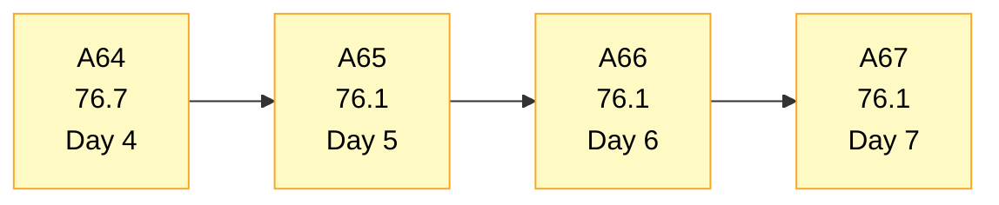
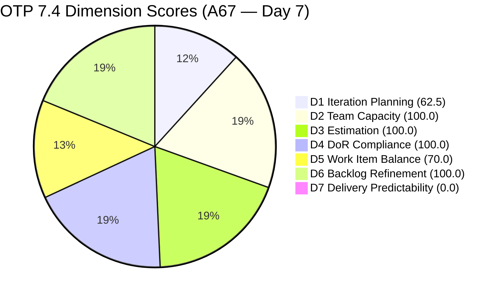
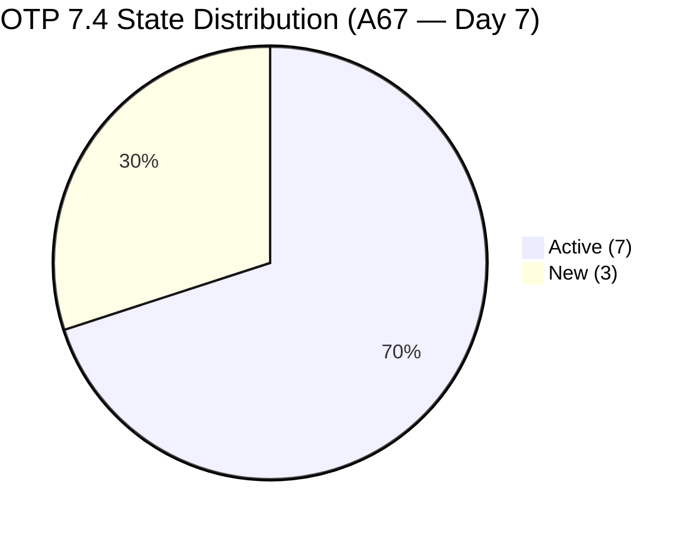
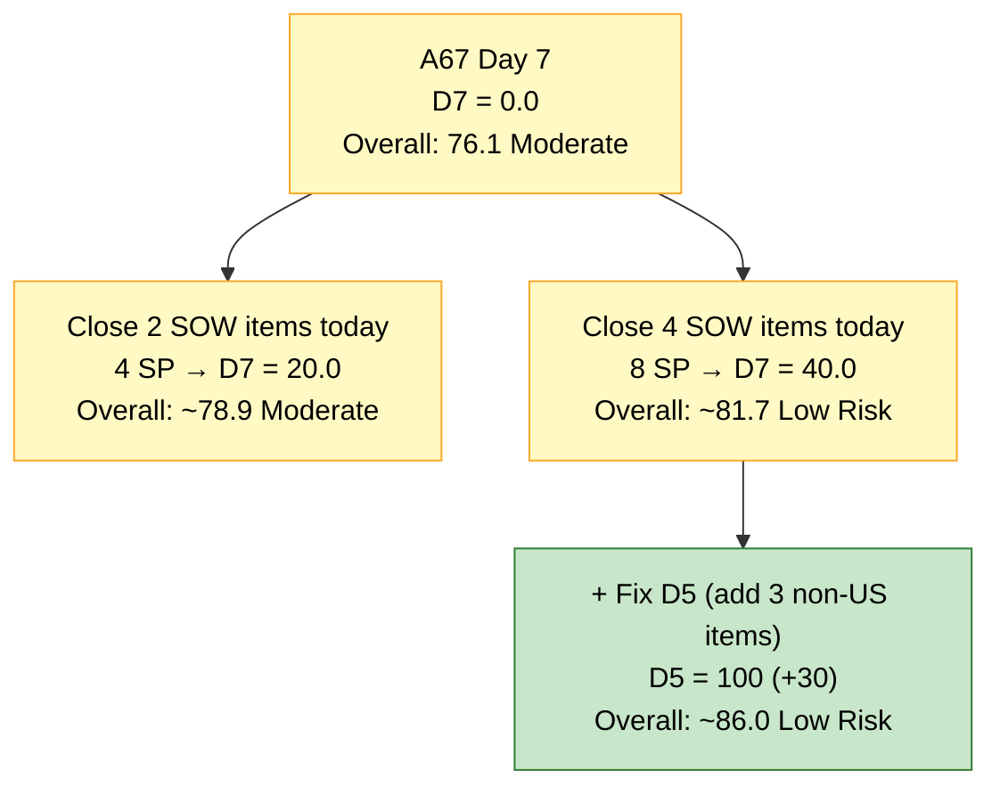
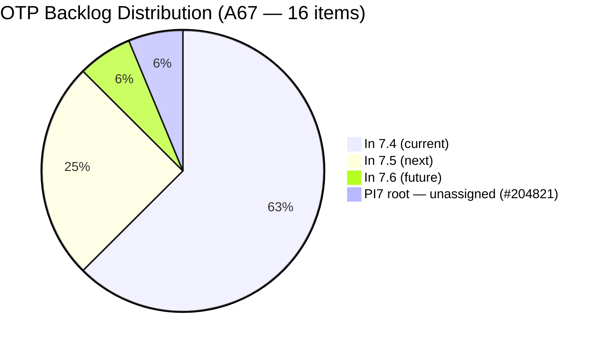

# OTP Team — SAFe Iteration Audit A67
**Date:** 2026-05-24 | **Sprint Day:** 7 of 14 — SPRINT ACTIVE | **Iteration:** 7.4 (May 18 – May 31, 2026)
**Auditor:** Claude Code (ADO SAFe Audit Skill v1) | **Prior Audit:** A66 (2026-05-23 09:03)

---

## 1. Audit Metadata

| Field | Value |
|---|---|
| **Audit ID** | A67 |
| **Report File** | `AUDIT_20260524_0903.md` |
| **Prior Audit** | A66 — `AUDIT_20260523_0903.md` (Overall 76.1, Moderate Risk — 7.4 Day 6) |
| **ADO Project** | OTP (`e7739905-28a3-4ae1-9173-7f6cd13b3494`) |
| **ADO Team** | OTP Team |
| **Iteration** | 7.4 (`72b2008d-7779-4d11-8356-c744f5a69a87`) |
| **Iteration Dates** | May 18 – May 31, 2026 |
| **Sprint Day** | **7 of 14 — SPRINT ACTIVE** |
| **Audit Date** | 2026-05-24 09:03 PHT |
| **Overall Score** | **76.1 — Moderate Risk** |
| **Risk Band** | Moderate (60–79.9) |
| **Visible Backlog Items** | 16 root items |
| **Current Iteration Root Items** | 10 (IterationPath = 7.4) |
| **Capacity Source** | No capacity configured for OTP Team in Iteration 7.4 — ADO returned no data |
| **Project Exceptions Applied** | Single-assignee model (Grace) — D2 scored full per documented exception |

---

## 2. Executive Summary

| Field | Value |
|---|---|
| **Overall Score** | **76.1 — Moderate Risk** |
| **Score vs Prior (A66)** | 76.1 → 76.1 (**0.0** — no structural changes detected) |
| **Sprint Day** | **7 of 14 — SPRINT ACTIVE** |
| **Iteration** | 7.4 (May 18 – May 31, 2026) |
| **Items in 7.4** | 10 root items (unchanged) |
| **Committed SP** | 20 SP (unchanged) |
| **SP Closed** | 0 — **CRITICAL: 7 sprint days elapsed with zero deliverables closed** |
| **Risk Band** | Moderate (60–79.9) |

**Day 7 is a critical threshold.** The sprint is now halfway through its 14-day runway with zero Story Points closed. All structural dimensions remain unchanged — scope, states, assignments, and estimation are identical to A66. The arithmetic score holds at 76.1 Moderate Risk, but the delivery risk has materially deepened: the team has passed the midpoint entry zone without a single closure.

The sprint composition remains: 10 items (8 User Stories + 2 Enablers), all assigned to Grace at 2 SP each. Seven items remain Active, three remain New. The backlog has 16 root items with #204821 still parked at the PI7 root without an iteration assignment, description, or acceptance criteria — now flagged in 9 consecutive audits.

Grace must close at least one story today to prevent the sprint from entering Day 8 with D7 = 0. The four Active SOW items (#204264, #204374, #204377, #204381) remain the clearest targets with binary, verifiable acceptance criteria. The window for a healthy sprint recovery is narrowing rapidly.

---

## 3. Previous Audit Delta (A66 → A67)

| Dimension | A66 Score | A67 Score | Delta | Driver |
|---|---|---|---|---|
| D1 Iteration Planning | 62.5 | 62.5 | 0.0 | 10/16 — no backlog changes |
| D2 Team Capacity | 100.0 | 100.0 | 0.0 | Project Exception applied — unchanged |
| D3 Estimation | 100.0 | 100.0 | 0.0 | All 10 items at 2 SP — no change |
| D4 DoR Compliance | 100.0 | 100.0 | 0.0 | All 10 items pass — no change |
| D5 Work Item Balance | 70.0 | 70.0 | 0.0 | US = 8/10 = 80% — −30 penalty unchanged |
| D6 Backlog Refinement | 100.0 | 100.0 | 0.0 | All 16 fresh; 0 untouched in 7.4 — no change |
| D7 Delivery Predictability | 0.0 | 0.0 | 0.0 | **CRITICAL — Day 7: zero SP closed; sprint midpoint imminent** |
| **Overall** | **76.1** | **76.1** | **0.0** | Score unchanged; delivery gap deepens with each passing day |

**Zero change for the second consecutive audit.** No items closed, no new items added, no state transitions recorded since May 21 (three days ago). This absence of board activity across Days 5, 6, and 7 is itself a risk signal — an active sprint should produce daily state changes as work progresses.

---

## 4. Current Iteration Snapshot

| # | Title | Type | State | SP | Assignee | Changed |
|---|---|---|---|---|---|---|
| #204117 | Tarpaulin Printing for JIT and Jairosoft signage | User Story | Active | 2 | Grace | May 19 |
| #204122 | FTC Status of renewal | User Story | Active | 2 | Grace | May 19 |
| #204264 | Secure SOWs for Enterprise Accounts (Prife LLC) | User Story | Active | 2 | Grace | May 20 |
| #204350 | 1S: Define SM Career Paths & Tooling | Enabler | Active | 2 | Grace | May 20 |
| #204354 | Formulate the Training Roadmap | Enabler | New | 2 | Grace | May 21 |
| #204359 | Finalize and Issue the Memorandum | User Story | New | 2 | Grace | **May 18** (Day 1 — no movement in 7 days) |
| #204374 | Secure SOWs for Enterprise Accounts (AutoAllies) | User Story | Active | 2 | Grace | May 19 |
| #204377 | Secure SOWs for Commercial Accounts (Lifestyle) | User Story | Active | 2 | Grace | May 20 |
| #204381 | Secure SOWs for Commercial Accounts (JESI) | User Story | Active | 2 | Grace | May 19 |
| #204384 | ADO Contract Repository & Billing Alignment | User Story | New | 2 | Grace | May 19 |

**Total: 10 items | 20 SP committed | 0 SP closed**

**Non-current backlog items (6 total):**

| # | Title | Iteration | State | Changed |
|---|---|---|---|---|
| #202912 | Fabrication of Signage | 7.5 | New | May 21 |
| #202913 | Installation of Street Signage | 7.5 | Active | May 21 |
| #204193 | Philgeps Document Consolidation | 7.5 | New | May 21 |
| #204194 | Philgeps Online Submission | 7.5 | New | May 21 |
| #203864 | Release and Collect of TCT | 7.6 | New | May 21 |
| #204821 | FTC Akira | PI7 root (no iter) | New | May 21 |

---

## 5. Work Item Analysis

### Type Distribution (10 current items)

| Type | Count | Share |
|---|---|---|
| User Story | 8 | 80.0% |
| Enabler | 2 | 20.0% |
| **Total** | **10** | **100%** |

### State Distribution (10 current items)

| State | Count | Items |
|---|---|---|
| Active | 7 | #204117, #204122, #204264, #204350, #204374, #204377, #204381 |
| New | 3 | #204354, #204359, #204384 |

**Day 7 board stagnation:** All 10 items show identical state to A66. The last board change was May 21 (#204354 updated). No state transitions have occurred since May 19–21. At Day 7 of 14, a healthy sprint should have at least 3–4 items closed or in a terminal state. The board reflects zero progress motion.

**Critical anomaly — #204359:** "Finalize and Issue the Memorandum" has been in **New** state since May 18 (Day 1 of the sprint) with no state change in 7 consecutive days. This is the only item in the sprint that has never transitioned, and it depends on two other items (#204350, #204354) being completed first — which makes it a potential dependency blocker.

### Sprint Focus Tracks

| Track | Items | SP | Status |
|---|---|---|---|
| SOW / Contract Execution | #204264, #204374, #204377, #204381, #204384 | 10 SP | 4 Active, 1 New — primary closure targets |
| SM Career Path Initiative | #204350, #204354, #204359 | 6 SP | 1 Active, 2 New — sequential dependency risk |
| Compliance / Signage | #204117, #204122 | 4 SP | Both Active — no movement since May 19 |

### Backlog Composition

| Bucket | Count | Notes |
|---|---|---|
| In 7.4 (current) | 10 | Sprint scope — all Grace |
| In 7.5 (next) | 4 | Correctly staged |
| In 7.6 (future) | 1 | Correctly staged |
| PI7 root (unassigned) | 1 | #204821 — flagged in 9 consecutive audits; no Desc, AC, or SP |

---

## 6. SAFe Compliance Scorecard

| Dimension | Score | Band | Evidence | Notes |
|---|---|---|---|---|
| D1 Iteration Planning | 62.5 | Moderate | 10 current / 16 visible | Unchanged; #204821 still unassigned at PI7 root (9th consecutive flag) |
| D2 Team Capacity | 100.0 | Low | 1/1 contributor | ADO returns no capacity data; Project Exception applied — Grace sole assignee |
| D3 Estimation | 100.0 | Low | 10/10 items with SP>0 | All items at 2 SP; 20 SP committed |
| D4 DoR Compliance | 100.0 | Low | 10/10 items pass | Desc≥30 chars AND AC≥20 chars confirmed for all 10 |
| D5 Work Item Balance | 70.0 | Moderate | US 80.0% > 60% threshold | −30 penalty; 2 Enablers (20%) insufficient to clear |
| D6 Backlog Refinement | 100.0 | Low | 16/16 fresh; 0 untouched | All items changed May 18–21; none predate sprint start |
| D7 Delivery Predictability | **0.0** | **Critical** | 0/20 SP closed | **CRITICAL — Day 7 of 14. No early-sprint annotation. Half-sprint with zero delivery.** |
| **OVERALL** | **76.1** | **Moderate** | (62.5+100+100+100+70+100+0)/7 | Three consecutive audits at 76.1 — structural lock-in at Moderate risk |

---

## 7. Dimension Findings

### D1 — Iteration Planning: 62.5 / 100 — Moderate Risk

**Formula:** 10 / 16 × 100 = **62.5**

| Metric | Value |
|---|---|
| Items in 7.4 | 10 |
| Total visible backlog items | 16 |
| Score | **62.5** |

No change from A66. This is the ninth consecutive audit at exactly 62.5. #204821 ("FTC Akira") continues to sit at the PI7 root with no iteration assignment, no Description, no AC, and no Story Points. If #204821 is assigned to 7.5 or closed, the visible backlog drops to 15 and D1 improves to 10/15 = 66.7. The non-current items are otherwise correctly staged (4 in 7.5, 1 in 7.6).

---

### D2 — Team Capacity: 100.0 / 100 — Low Risk

**Formula:** 1/1 × 100 = **100.0**

ADO `work_get_team_capacity` returned no data for OTP Team in Iteration 7.4 (confirmed again today). D2 is scored at 100.0 per the documented Project Exception (single-assignee Grace model). Evidence of engagement: 7 Active items in the sprint remain in Grace's ownership.

---

### D3 — Estimation: 100.0 / 100 — Low Risk

**Formula:** 10/10 × 100 = **100.0**

All 10 current-iteration items carry 2 Story Points each. Total committed: 20 SP. Unchanged since sprint start.

---

### D4 — DoR Compliance: 100.0 / 100 — Low Risk

**Formula:** 10/10 × 100 = **100.0**

All 10 current-iteration items verified: Description ≥30 non-whitespace characters AND Acceptance Criteria ≥20 non-whitespace characters. This is OTP's strongest and most consistent structural dimension — sustained for the fifth consecutive audit at 100.0.

Note: #204821 (PI7 root) has no Description or AC and would fail DoR if moved to any active iteration.

---

### D5 — Work Item Balance: 70.0 / 100 — Moderate Risk

**Formula:** Base 100 − penalties

| Penalty | Trigger | Applied |
|---|---|---|
| −30: dominant_type_share > 60% | US = 80.0% > 60% | Yes |
| −40: no User Story items | US present (8 items) | No |
| −20: spike_share > 40% | Spike = 0% | No |

**Score:** 100 − 30 = **70.0**

The sprint is 80% User Story with 2 Enablers. To clear the −30 penalty, US share must drop below 60%, requiring at least 5 non-US items (currently 2). Resolving D5 would lift the overall score from 76.1 to 82.4 (Low Risk band).

---

### D6 — Backlog Refinement: 100.0 / 100 — Low Risk

**Freshness window:** Items with ChangedDate ≥ Apr 9, 2026 (45 days from May 24)

| Metric | Value |
|---|---|
| Total visible backlog items | 16 |
| Fresh items (ChangedDate ≥ Apr 9) | 16 — oldest: #204359 (May 18) |
| stale_90 items (ChangedDate < Feb 23) | 0 |
| stale_180 items (ChangedDate < Nov 25, 2025) | 0 |
| Untouched current items (ChangedDate < May 18) | 0 — all 7.4 items changed May 18–21 |
| Score | **100.0** |

No penalties. D6 remains clean despite the board stagnation on the delivery side. All 16 visible items were touched within the last week.

---

### D7 — Delivery Predictability: 0.0 / 100 — CRITICAL

**Formula:** 0 / 20 × 100 = **0.0**

| Metric | Value |
|---|---|
| SP closed this sprint | 0 |
| Total committed SP | 20 |
| Score | **0.0** |

> **CRITICAL — Day 7 of 14. No Early-Sprint Annotation.**
>
> The sprint has consumed exactly half its runway (7 of 14 days) with zero Story Points delivered. In a healthy sprint, the midpoint should reflect approximately 40–60% of committed SP closed. OTP is at 0%.
>
> **Remaining recovery window:**
> - Days 8–14 = 7 days remaining
> - To reach Moderate Risk (40 SP = 40% threshold): need 8 SP closed (4 items) — achievable if Grace closes 1 item per day
> - To reach Low Risk (80% = 16 SP): need 16 SP (8 items) in 7 days — very compressed but technically possible
>
> **Best immediate closure targets (Day 7):**
> - **#204264** (Secure SOWs — Prife LLC, Active, 2 SP): Route through AdobeSign, upload signed copy = done
> - **#204374** (Secure SOWs — AutoAllies, Active, 2 SP): Same binary AC
> - **#204377** (Secure SOWs — Lifestyle, Active, 2 SP): Same binary AC
> - **#204381** (Secure SOWs — JESI, Active, 2 SP): Same binary AC
>
> Closing 2 SOW items today (4 SP): D7 = 20.0, Overall = ~78.9 (still Moderate). Closing 4 SOW items today (8 SP): D7 = 40.0, Overall = ~81.7 (Low Risk). The sprint's entire risk profile pivots on Day 7–8 delivery action.

---

## 8. Risks and Bottlenecks

| # | Severity | Dimension | Risk | Action |
|---|---|---|---|---|
| R1 | **CRITICAL** | D7 | Day 7: sprint midpoint reached with zero SP closed. Three consecutive audit days (A65→A67) with no board activity. If D7 remains 0 through Day 8, recovering to even Moderate (40%) predictability becomes extremely difficult. | Grace: close at least one of the 4 Active SOW items (#204264, #204374, #204377, #204381) today. Binary ACs — AdobeSign execution is the sole remaining action. |
| R2 | HIGH | D7 | Board inactivity for 3+ days: last state change was May 21. No items have moved from Active to Closed or from New to Active since A65. | Grace must record any board update today — state transition, comment, or progress note. Board activity is a proxy for work in progress. |
| R3 | HIGH | D1 | #204821 ("FTC Akira") flagged in 9 consecutive audits. Still at PI7 root with no Desc, AC, SP, or iteration assignment. | Assign #204821 to 7.5 or 7.6 with Description and AC added, or close it. 30-second ADO operation. Lifts D1 to 66.7 if removed from visible. |
| R4 | HIGH | D7 | #204359 ("Finalize and Issue the Memorandum") in New state for 7 consecutive days since sprint start. It has sequential dependency on #204350 and #204354. | Grace: transition #204359 to Active or acknowledge it is blocked pending #204350 completion. Add a comment to the item noting the dependency. |
| R5 | MODERATE | D5 | User Story dominance at 80%. −30 penalty applied for 7 consecutive days. | Add 2–3 non-US items to sprint, or reclassify existing User Stories. Lifts D5 from 70 → 100 and Overall from 76.1 → 82.4. |
| R6 | MODERATE | D7 | Three New items (#204354, #204359, #204384) have not transitioned to Active despite 3–7 days in sprint. New items with no board activity signal potential abandonment. | Grace: transition all three New items to Active by end of Day 7 to confirm intent to complete them before sprint close. |

---

## 9. Prioritized Recommendations

1. **[CRITICAL — Today Day 7]** Grace must close at least one Active SOW story before end of Day 7. The four Active SOW items (#204264 Prife LLC, #204374 AutoAllies, #204377 Lifestyle, #204381 JESI) each have binary ACs: route through AdobeSign → both parties sign → upload to corporate contract repository. Any single closure credits 2 SP (10% of committed). Closing two raises D7 to 20%, pushing the overall score to ~78.9. Closing four raises D7 to 40%, breaching the Low Risk boundary at 81.7.

2. **[CRITICAL — Today]** Update the ADO board with any board activity — state transition, attachment, or progress comment — on at least three items. Three consecutive audit days with zero board changes is itself a risk indicator. Even New→Active transitions on #204354, #204359, and #204384 would signal engagement.

3. **[HIGH — Today]** Transition #204359 ("Finalize and Issue the Memorandum") from New to Active, or explicitly flag it as blocked pending #204350. This item has been static since May 18 (Day 1). Add a comment if it is blocked by its predecessor stories — this is a legitimate dependency, but it must be visible on the board.

4. **[HIGH — Today/Tomorrow]** Triage #204821 ("FTC Akira") — assign to 7.5 or 7.6 with Description and AC added, or close it. Nine audits have flagged this. D1 improves from 62.5 to 66.7 upon resolution.

5. **[MODERATE — By Day 8]** Add 2–3 non-User-Story items (Enablers or Spikes) to Iteration 7.4 to reduce US share below 60%. For example: extract a technical Enabler from the ADO infrastructure work within #204384, or add a Spike for the FTC Akira compliance research (#204122 track). This would lift D5 from 70.0 to 100.0 and the overall score from 76.1 to 82.4 (Low Risk).

6. **[STANDING]** Protect D2 (100.0), D3 (100.0), D4 (100.0), and D6 (100.0). These four dimensions remain OTP's strongest structural assets. Maintain discipline — do not add unestimated or undescribed items to the sprint.

---

## 10. Visualization

### Score Trend (A64 → A67)

### Dimension Scorecard (A67)

### Sprint State Distribution (10 current items)

### D7 Recovery Scenarios — From Day 7

### Backlog Distribution (16 items)

---

## 11. Evidence Gaps and Limitations

| Gap | Impact | Notes |
|---|---|---|
| ADO capacity API returned no data for OTP Team in Iteration 7.4 | D2 requires Project Exception fallback | `work_get_team_capacity` returned "No team capacity assigned." D2 scored at 100.0 per workspace CLAUDE.md Project Exception. Evidence of engagement: 7 Active items confirm Grace's ownership. |
| `work_list_team_iterations` timeframe=current returns empty for OTP | Iteration details sourced from prior audit chain | Iteration 7.4 ID `72b2008d-7779-4d11-8356-c744f5a69a87`, May 18–31, confirmed from A63 forward. |
| #204821 has no Description, AC, or SP | D4 not affected (not in current iteration) | Would fail DoR if moved to any active iteration. Flagged in 9 consecutive audits. |
| Zero closures detected (0 SP closed) | D7 = 0.0 Critical | All 10 items confirmed as Active or New via `wit_get_work_items_batch_by_ids`. No Closed or Done states detected. Score is exact — no ambiguity. |

---

## 12. Audit Trail

| Source | Tool Used | Data Retrieved |
|---|---|---|
| Backlog items | `wit_list_backlog_work_items` (backlogId `Microsoft.RequirementCategory`) | 16 root items visible in backlog |
| Team capacity | `work_get_team_capacity` (iterationId `72b2008d-7779-4d11-8356-c744f5a69a87`) | No data returned — Project Exception applied |
| Work item details | `wit_get_work_items_batch_by_ids` (16 items) | SP, State, Type, Desc, AC, ChangedDate, IterationPath confirmed for all 16 |
| Prior audit | `AUDIT_20260523_0903.md` (A66) | Overall 76.1, Moderate Risk, 10 items, 20 SP |
