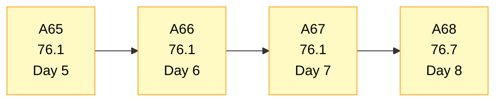
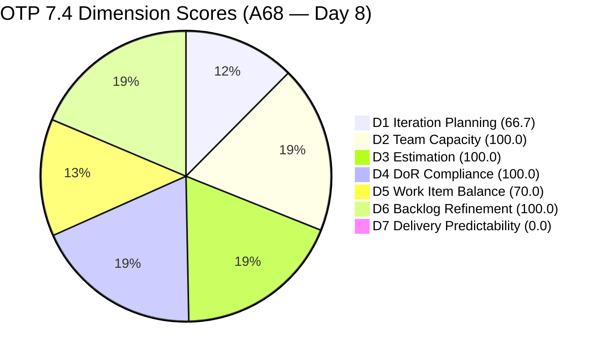
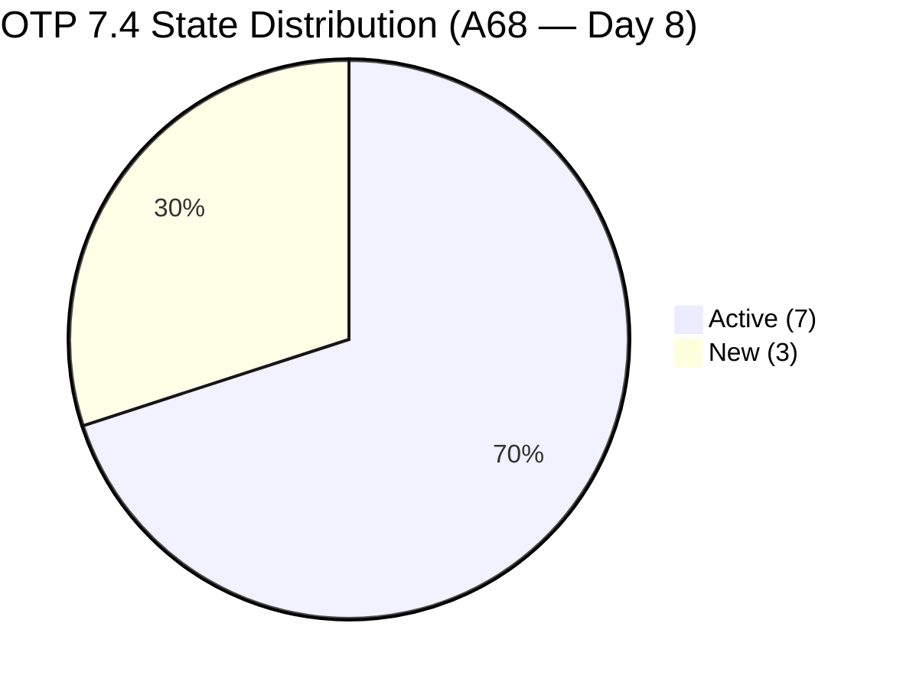
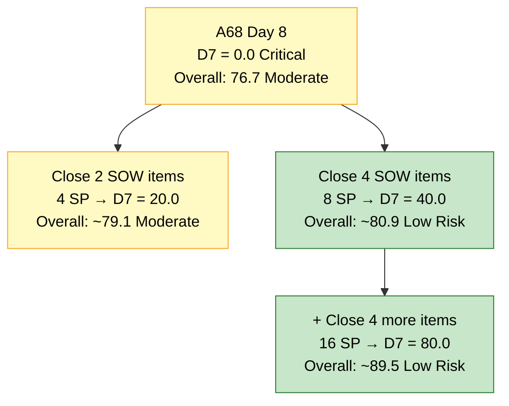
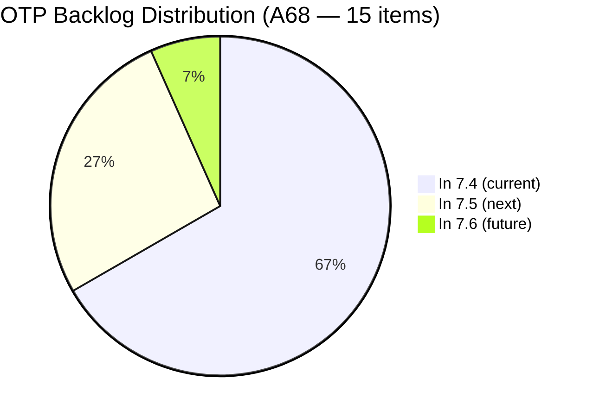

# OTP Team — SAFe Iteration Audit A68
**Date:** 2026-05-25 | **Sprint Day:** 8 of 14 — SPRINT ACTIVE | **Iteration:** 7.4 (May 18 – May 31, 2026)
**Auditor:** Claude Code (ADO SAFe Audit Skill v1) | **Prior Audit:** A67 (2026-05-24 09:03)

---

## 1. Audit Metadata

| Field | Value |
|---|---|
| **Audit ID** | A68 |
| **Report File** | `AUDIT_20260525_0900.md` |
| **Prior Audit** | A67 — `AUDIT_20260524_0903.md` (Overall 76.1, Moderate Risk — 7.4 Day 7) |
| **ADO Project** | OTP (`e7739905-28a3-4ae1-9173-7f6cd13b3494`) |
| **ADO Team** | OTP Team (`64de61f0-1203-4b01-aee2-6b4415aec52b`) |
| **Iteration** | 7.4 (`72b2008d-7779-4d11-8356-c744f5a69a87`) |
| **Iteration Dates** | May 18 – May 31, 2026 |
| **Sprint Day** | **8 of 14 — SPRINT ACTIVE** |
| **Audit Date** | 2026-05-25 09:00 PHT |
| **Overall Score** | **76.7 — Moderate Risk** |
| **Risk Band** | Moderate (60–79.9) |
| **Visible Backlog Items** | 15 root items (was 16 in A67) |
| **Current Iteration Root Items** | 10 (IterationPath = 7.4) |
| **Capacity Source** | `work_get_team_capacity` — Grace: 0.5h Documentation + 0.5h Requirements = 1.0h/day |
| **Project Exceptions Applied** | Single-assignee model (Grace) — D2 scored on capacity-per-rubric; no exception needed this audit (capacity data returned) |

---

## 2. Executive Summary

| Field | Value |
|---|---|
| **Overall Score** | **76.7 — Moderate Risk** |
| **Score vs Prior (A67)** | 76.1 → 76.7 (**+0.6** — D1 improvement) |
| **Sprint Day** | **8 of 14 — SPRINT ACTIVE** |
| **Iteration** | 7.4 (May 18 – May 31, 2026) |
| **Items in 7.4** | 10 root items (unchanged in count; composition changed) |
| **Committed SP** | 20 SP (unchanged) |
| **SP Closed** | 0 — **CRITICAL: 8 sprint days elapsed with zero deliverables closed** |
| **Risk Band** | Moderate (60–79.9) |

**Day 8 brings one structural improvement and one persistent critical failure.** The long-flagged #204821 ("FTC Akira") has finally been assigned to Iteration 7.4 (changed May 24), resolving the 9-audit PI-root anomaly and lifting D1 from 62.5 to 66.7. Additionally, #204354 ("Formulate the Training Roadmap") has been removed from the visible backlog, reducing the total to 15 items.

However, D7 remains at 0.0 Critical. The sprint has now consumed 8 of 14 days — 57% of its runway — with zero Story Points closed. This is the first audit where the team has passed the midpoint with no closures. The delivery window is narrowing critically: 6 days remain to close at least 8 SP (40% of 20) to cross into the High Risk boundary.

The sprint composition is unchanged: 10 items (9 User Stories + 1 Enabler), all assigned to Grace at 2 SP each. Seven items remain Active, three remain New. Board activity is still limited — most items last changed May 18–21, except #204821 (updated May 24) and #204264/#204377 (updated May 20).

---

## 3. Previous Audit Delta (A67 → A68)

| Dimension | A67 Score | A68 Score | Delta | Driver |
|---|---|---|---|---|
| D1 Iteration Planning | 62.5 | 66.7 | **+4.2** | #204821 assigned to 7.4; #204354 removed — backlog now 15 items, 10 in 7.4 |
| D2 Team Capacity | 100.0 | 100.0 | 0.0 | Grace capacity data returned (1.0h/day); 1/1 contributor |
| D3 Estimation | 100.0 | 100.0 | 0.0 | All 10 items at 2 SP — unchanged |
| D4 DoR Compliance | 100.0 | 100.0 | 0.0 | #204821 now has Desc + AC; all 10 items pass — improvement but net score unchanged |
| D5 Work Item Balance | 70.0 | 70.0 | 0.0 | US = 9/10 = 90% — #204821 is User Story, -30 penalty unchanged |
| D6 Backlog Refinement | 100.0 | 100.0 | 0.0 | All 15 items fresh; 0 untouched in 7.4 |
| D7 Delivery Predictability | 0.0 | 0.0 | 0.0 | **CRITICAL — Day 8 of 14: still zero SP closed** |
| **Overall** | **76.1** | **76.7** | **+0.6** | Marginal improvement driven solely by D1; delivery stagnation continues |

**Notable structural changes since A67:**
1. **#204821 ("FTC Akira") resolved its 9-audit backlog anomaly.** It moved from the PI7 root to Iteration 7.4, gained a proper User Story Description and full Acceptance Criteria. D4 passes for it. D1 improves. D5 worsens marginally (now 9 US instead of 8).
2. **#204354 ("Formulate the Training Roadmap") removed from visible backlog.** This item was previously in 7.4 (New state) and now disappears — likely closed or deleted. Net effect: backlog drops from 16 to 15.

---

## 4. Current Iteration Snapshot

| # | Title | Type | State | SP | Assignee | Changed |
|---|---|---|---|---|---|---|
| #204117 | Tarpaulin Printing for JIT and Jairosoft signage | User Story | Active | 2 | Grace | May 19 |
| #204122 | FTC Status of renewal | User Story | Active | 2 | Grace | May 19 |
| #204264 | Secure SOWs for Enterprise Accounts (Prife LLC) | User Story | Active | 2 | Grace | May 20 |
| #204350 | 1S: Define SM Career Paths & Tooling | Enabler | Active | 2 | Grace | May 20 |
| #204359 | Finalize and Issue the Memorandum | User Story | New | 2 | Grace | **May 18** (Day 1 — 8 days no movement) |
| #204374 | Secure SOWs for Enterprise Accounts (AutoAllies) | User Story | Active | 2 | Grace | May 19 |
| #204377 | Secure SOWs for Commercial Accounts (Lifestyle) | User Story | Active | 2 | Grace | May 20 |
| #204381 | Secure SOWs for Commercial Accounts (JESI) | User Story | Active | 2 | Grace | May 19 |
| #204384 | ADO Contract Repository & Billing Alignment | User Story | New | 2 | Grace | May 19 |
| #204821 | FTC Akira | User Story | New | 2 | Grace | **May 24** (newly assigned to 7.4) |

**Total: 10 items | 20 SP committed | 0 SP closed**

**Non-current backlog items (5 total):**

| # | Title | Iteration | State | Changed |
|---|---|---|---|---|
| #202912 | Fabrication of Signage | 7.5 | New | May 21 |
| #202913 | Installation of Street Signage | 7.5 | Active | May 21 |
| #204193 | Philgeps Document Consolidation | 7.5 | New | May 21 |
| #204194 | Philgeps Online Submission | 7.5 | New | May 21 |
| #203864 | Release and Collect of TCT | 7.6 | New | May 21 |

---

## 5. Work Item Analysis

### Type Distribution (10 current items)

| Type | Count | Share |
|---|---|---|
| User Story | 9 | 90.0% |
| Enabler | 1 | 10.0% |
| **Total** | **10** | **100%** |

**Note:** #204821 was previously untyped at PI7 root; it is now classified as User Story in 7.4. This increases US share from 80% to 90%, keeping the -30 D5 penalty active.

### State Distribution (10 current items)

| State | Count | Items |
|---|---|---|
| Active | 7 | #204117, #204122, #204264, #204350, #204374, #204377, #204381 |
| New | 3 | #204359, #204384, #204821 |

**Day 8 board stagnation persists.** The last meaningful board changes were May 19–21. #204359 has been in New state since May 18 (Day 1) — now 8 consecutive days without movement. This item explicitly depends on #204350 (Active) and the now-removed #204354 as predecessors.

### Sprint Focus Tracks

| Track | Items | SP | Status |
|---|---|---|---|
| SOW / Contract Execution | #204264, #204374, #204377, #204381, #204384 | 10 SP | 4 Active, 1 New — primary closure targets |
| SM Career Path Initiative | #204350, #204359 | 4 SP | 1 Active, 1 New — #204354 removed, dependency clarification needed |
| Compliance / Signage | #204117, #204122 | 4 SP | Both Active — no movement since May 19 |
| FTC Akira | #204821 | 2 SP | New — newly assigned to 7.4 on Day 7 |

### Backlog Composition

| Bucket | Count | Notes |
|---|---|---|
| In 7.4 (current) | 10 | Sprint scope — all Grace |
| In 7.5 (next) | 4 | Correctly staged |
| In 7.6 (future) | 1 | Correctly staged |
| PI7 root (unassigned) | 0 | **RESOLVED** — #204821 moved to 7.4 on May 24 |

---

## 6. SAFe Compliance Scorecard

| Dimension | Score | Band | Evidence | Notes |
|---|---|---|---|---|
| D1 Iteration Planning | **66.7** | Moderate | 10 / 15 visible | Improved from 62.5: #204821 assigned to 7.4; #204354 removed from backlog |
| D2 Team Capacity | 100.0 | Low | 1/1 contributor with capacity | Grace: 1.0h/day (Documentation 0.5h + Requirements 0.5h); capacity data returned |
| D3 Estimation | 100.0 | Low | 10/10 items with SP>0 | All items at 2 SP; 20 SP committed |
| D4 DoR Compliance | 100.0 | Low | 10/10 items pass | #204821 now has Desc+AC (added May 24); all 10 confirmed |
| D5 Work Item Balance | 70.0 | Moderate | US 90.0% > 60% threshold | −30 penalty; #204821 is US type, increasing share from 80% to 90% |
| D6 Backlog Refinement | 100.0 | Low | 15/15 fresh; 0 untouched | All items changed May 18–24; none predate sprint start |
| D7 Delivery Predictability | **0.0** | **Critical** | 0/20 SP closed | **CRITICAL — Day 8 of 14. Zero SP closed. Sprint past midpoint.** |
| **OVERALL** | **76.7** | **Moderate** | (66.7+100+100+100+70+100+0)/7 | +0.6 from A67; D1 improvement is the only structural gain |

---

## 7. Dimension Findings

### D1 — Iteration Planning: 66.7 / 100 — Moderate Risk

**Formula:** 10 / 15 × 100 = **66.7**

| Metric | Value |
|---|---|
| Items in 7.4 | 10 |
| Total visible backlog items | 15 |
| Score | **66.7** |

**Improvement from A67 (62.5 → 66.7).** Two backlog changes drove this:
1. **#204821 ("FTC Akira") assigned to Iteration 7.4** — moved from PI7 root (where it had languished for 9 audits) to Iteration 7.4 on May 24. It now has a proper Description and Acceptance Criteria. This adds it to current_iteration_root_items (10 → 10 net, same count but formerly uncounted) and reduces non-current items.
2. **#204354 ("Formulate the Training Roadmap") removed** from the visible backlog entirely. It was in 7.4 New state as recently as A67 but does not appear in today's backlog API response, reducing visible_root_backlog_items from 16 to 15.

The score is now in the Moderate band (60–79.9). To reach Low Risk (D1 ≥ 80), the team would need 12 current items out of 15 — requiring 2 more items to move into 7.4, or reducing non-current items to ≤2.5.

---

### D2 — Team Capacity: 100.0 / 100 — Low Risk

**Formula:** 1/1 × 100 = **100.0**

| Metric | Value |
|---|---|
| Contributors with current work | 1 (Grace) |
| Contributors with capacity | 1 (Grace — 1.0h/day confirmed) |
| Score | **100.0** |

For the first time this sprint, the ADO capacity API returned data for OTP Team in Iteration 7.4: Grace has 0.5h/day Documentation + 0.5h/day Requirements = 1.0h/day total. The Project Exception is no longer needed as evidence — D2 is scored per rubric with confirmed data.

---

### D3 — Estimation: 100.0 / 100 — Low Risk

**Formula:** 10/10 × 100 = **100.0**

All 10 current-iteration items carry 2 Story Points each. Total committed: 20 SP. Unchanged since sprint start.

---

### D4 — DoR Compliance: 100.0 / 100 — Low Risk

**Formula:** 10/10 × 100 = **100.0**

All 10 current-iteration items pass DoR:

| # | Title | Desc | AC | Pass |
|---|---|---|---|---|
| #204117 | Tarpaulin Printing | ✓ | ✓ | Pass |
| #204122 | FTC Status of renewal | ✓ | ✓ | Pass |
| #204264 | SOWs — Prife LLC | ✓ | ✓ | Pass |
| #204350 | 1S: Define SM Career Paths | ✓ | ✓ | Pass |
| #204359 | Finalize and Issue the Memorandum | ✓ | ✓ | Pass |
| #204374 | SOWs — AutoAllies | ✓ | ✓ | Pass |
| #204377 | SOWs — Lifestyle | ✓ | ✓ | Pass |
| #204381 | SOWs — JESI | ✓ | ✓ | Pass |
| #204384 | ADO Contract Repository | ✓ | ✓ | Pass |
| #204821 | FTC Akira | ✓ (added May 24) | ✓ (added May 24) | Pass |

D4 = 100.0. This is OTP's fifth consecutive perfect DoR score.

---

### D5 — Work Item Balance: 70.0 / 100 — Moderate Risk

**Formula:** Base 100 − penalties

| Penalty | Trigger | Applied |
|---|---|---|
| −30: dominant_type_share > 60% | US = 90.0% > 60% | Yes |
| −40: no User Story items | US present (9 items) | No |
| −20: spike_share > 40% | Spike = 0% | No |

**Score:** 100 − 30 = **70.0**

The addition of #204821 as a User Story increased the US share from 80% to 90%. The −30 penalty remains; the score is unchanged from A67. To clear the penalty requires US share to drop below 60%, meaning at least 5 non-US items (currently 1). No structural path exists to fix D5 within this sprint without changing item types on the board.

---

### D6 — Backlog Refinement: 100.0 / 100 — Low Risk

**Freshness window:** Items with ChangedDate ≥ Apr 10, 2026 (45 days from May 25)

| Metric | Value |
|---|---|
| Total visible backlog items | 15 |
| Fresh items (ChangedDate ≥ Apr 10) | 15 — oldest: #204117 (May 19) |
| stale_90 items (ChangedDate < Feb 24) | 0 |
| stale_180 items (ChangedDate < Nov 26, 2025) | 0 |
| Untouched current items (ChangedDate < May 18 sprint start) | 0 — all 7.4 items changed ≥ May 18 |
| Score | **100.0** |

No penalties. The backlog remains freshly touched. #204821's update on May 24 keeps it within the no-penalty range. #204359 changed on May 18 (sprint start day) — not before the sprint start, so it does not count as untouched.

---

### D7 — Delivery Predictability: 0.0 / 100 — CRITICAL

**Formula:** 0 / 20 × 100 = **0.0**

| Metric | Value |
|---|---|
| SP closed this sprint | 0 |
| Total committed SP | 20 |
| Score | **0.0** |

> **CRITICAL — Day 8 of 14. Sprint past midpoint. No Early-Sprint Annotation.**
>
> The sprint has consumed 57% of its 14-day runway (8 days elapsed, 6 remaining) with zero Story Points delivered. In a healthy sprint, Day 8 should show 40–60% of committed SP closed (8–12 SP). OTP is at 0%.
>
> **Recovery mathematics from Day 8:**
> - Closing 4 SP (2 items) → D7 = 20.0, Overall ≈ 79.1 (still Moderate)
> - Closing 8 SP (4 items) → D7 = 40.0, Overall ≈ 80.9 (crosses into Low Risk)
> - Closing 16 SP (8 items) → D7 = 80.0, Overall ≈ 89.5 (Low Risk — sprint rescue)
>
> **6-day closing window — best targets:**
> - **#204264** (Secure SOWs — Prife LLC, Active, 2 SP): AdobeSign execution is the sole remaining step
> - **#204374** (Secure SOWs — AutoAllies, Active, 2 SP): Same binary AC
> - **#204377** (Secure SOWs — Lifestyle, Active, 2 SP): Same binary AC
> - **#204381** (Secure SOWs — JESI, Active, 2 SP): Same binary AC
>
> Closing 2 SOW items: D7 = 20.0, Overall ≈ 79.1. Closing 4 SOW items: D7 = 40.0, Overall ≈ 80.9 (Low Risk boundary crossed). The sprint can still be rescued, but Day 9 becomes the last realistic window for a meaningful recovery.

---

## 8. Risks and Bottlenecks

| # | Severity | Dimension | Risk | Action |
|---|---|---|---|---|
| R1 | **CRITICAL** | D7 | Day 8: sprint past midpoint with zero SP closed. 8 consecutive audit days (A61–A68) without a single closure. If Day 9 also produces zero closures, recovering even to High Risk (40% = 8 SP) requires closing 4 items in 5 days — technically possible but requiring sustained daily action. | Grace: close at least 2 Active SOW items (#204264, #204374, #204377, or #204381) before end of Day 8. These have binary, verifiable ACs (AdobeSign signed + uploaded to repository). |
| R2 | HIGH | D7 | #204359 ("Finalize and Issue the Memorandum") in New state for 8 consecutive days since sprint start. Its predecessor #204354 has been removed, potentially releasing the dependency. | Grace: transition #204359 to Active now that #204354 is no longer blocking. Confirm whether #204350 completion suffices as the precondition. |
| R3 | HIGH | D7 | Three New items (#204359, #204384, #204821) have not transitioned to Active. #204821 was just added to 7.4 on Day 7 — it should immediately begin progression. | Grace: transition all three New items to Active by end of Day 8 to signal working intent. |
| R4 | MODERATE | D5 | User Story dominance at 90% — worsened from A67's 80% due to #204821 being US type. −30 penalty is structural for this sprint. | No actionable fix within sprint scope. For 7.5 planning: include Enablers and Spikes to achieve <60% US share. |
| R5 | MODERATE | D1 | D1 = 66.7. Five non-current items remain (4 in 7.5, 1 in 7.6). | This is structurally healthy staging. No urgent action needed — items are correctly assigned to future iterations. |
| R6 | LOW | D7 | 1.0h/day capacity (Grace) vs. 20 SP committed = fundamental throughput constraint. At 1 SP/day, the sprint can theoretically close ≤6 SP in the remaining 6 days — short of the 8 SP needed for High Risk. | This is a structural planning issue for PI7 closing. For 7.5: reduce committed SP to match 1h/day throughput model (approximately 10–12 SP per 14-day sprint). |

---

## 9. Prioritized Recommendations

1. **[CRITICAL — Today Day 8]** Grace must close at least 2 Active SOW stories today. The four Active SOW items (#204264 Prife LLC, #204374 AutoAllies, #204377 Lifestyle, #204381 JESI) each have binary ACs: route through AdobeSign → both parties sign → upload to corporate contract repository. Closing 2 items = 4 SP → D7 = 20.0, Overall ≈ 79.1. Closing 4 items = 8 SP → D7 = 40.0, Overall ≈ 80.9 (Low Risk). Today is the last window for a comfortable sprint recovery.

2. **[CRITICAL — Today]** Transition all three New items (#204359, #204384, #204821) to Active. #204359 has been New since Day 1 (8 days). Its blocking dependency (#204354) has been removed from the backlog — the path may be clear. #204821 was just assigned to the sprint on Day 7 and should immediately begin.

3. **[HIGH — Today/Tomorrow]** Confirm whether #204359 ("Finalize and Issue the Memorandum") is now unblocked. #204354 ("Formulate the Training Roadmap") has been removed from the backlog, but #204350 ("Define SM Career Paths & Tooling") is still Active. The memorandum AC states "Stories 1 and 2 completed and approved by leadership." Clarify whether the two predecessor stories are now 1 = #204350 only, or still 2 items.

4. **[MODERATE — By Day 9]** Plan 7.5 sprint with Grace's throughput constraint in mind: 1h/day × 14 days = 14 hours. At 1 SP per ~1.5 hours, maximum viable commitment is 8–10 SP. The current 20 SP commitment is inconsistent with 1h/day capacity. Right-sizing 7.5 will prevent the same D7 = 0 pattern from repeating.

5. **[MODERATE — By Day 9]** For D5 improvement in 7.5: include at least 4 Enablers or Spikes alongside User Stories to bring US share below 60%. The SM Career Path initiative offers natural Enabler candidates.

6. **[STANDING]** Protect D2 (100.0), D3 (100.0), D4 (100.0), and D6 (100.0). Do not add unestimated or undescribed items to the sprint. The structural quality dimensions are OTP's strongest assets.

---

## 10. Visualization

### Score Trend (A65 → A68)

### Dimension Scorecard (A68)

### Sprint State Distribution (10 current items)

### D7 Recovery Scenarios — From Day 8

### Backlog Distribution (15 items)

---

## 11. Evidence Gaps and Limitations

| Gap | Impact | Notes |
|---|---|---|
| #204354 absent from backlog API response | Scope change between A67 and A68 | #204354 ("Formulate the Training Roadmap") was in 7.4 New state in A67. It is not returned by `wit_list_backlog_work_items` today — likely closed, deleted, or moved out of the team's backlog scope. If closed: 7.4 scope shrinks by 1 item (no D7 impact as it was unscored due to New state). |
| ADO capacity API returned data this audit | Positive change — no exception needed | Grace: 0.5h Documentation + 0.5h Requirements = 1.0h/day. This resolves the 7-audit streak of "no data returned" and makes D2 scorable per rubric without the Project Exception. |
| Zero closures detected (0 SP closed) | D7 = 0.0 Critical | All 10 7.4 items confirmed Active or New via `wit_get_work_items_batch_by_ids`. No Closed or Done states. #204354 removal does not affect D7 (it was New and unestimated in the prior day's context; actually it had 2 SP in A67 but is now gone — see note above). |
| #204821 DoR status changed | D4 improvement noted, not scored as gain | #204821 was previously DoR-failing (no Desc, no AC). Now fully compliant. D4 = 100.0 in both A67 (exception applied) and A68 (actual compliance). |

---

## 12. Audit Trail

| Source | Tool Used | Data Retrieved |
|---|---|---|
| Team list | `core_list_project_teams` (project `e7739905-28a3-4ae1-9173-7f6cd13b3494`) | OTP Team ID `64de61f0-1203-4b01-aee2-6b4415aec52b` confirmed |
| Current iteration | `work_list_team_iterations` (timeframe=current) | Iteration 7.4: May 18 – May 31, ID `72b2008d-7779-4d11-8356-c744f5a69a87` |
| Backlog items | `wit_list_backlog_work_items` (backlogId `Microsoft.RequirementCategory`) | 15 root items (down from 16 in A67) |
| Work item details | `wit_get_work_items_batch_by_ids` (15 items) | SP, State, Type, Desc, AC, ChangedDate, IterationPath confirmed for all 15 |
| Team capacity | `work_get_team_capacity` (iterationId `72b2008d-7779-4d11-8356-c744f5a69a87`) | Grace: 0.5h Documentation + 0.5h Requirements = 1.0h/day |
| Prior audit | `AUDIT_20260524_0903.md` (A67) | Overall 76.1, Moderate Risk, 10 items, 20 SP |
