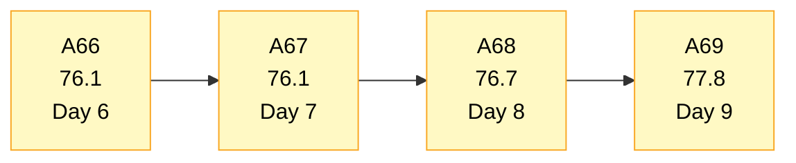
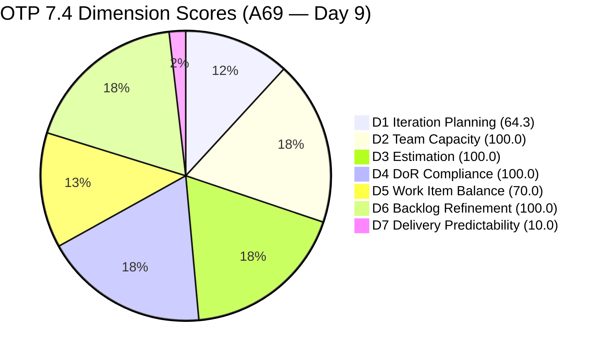
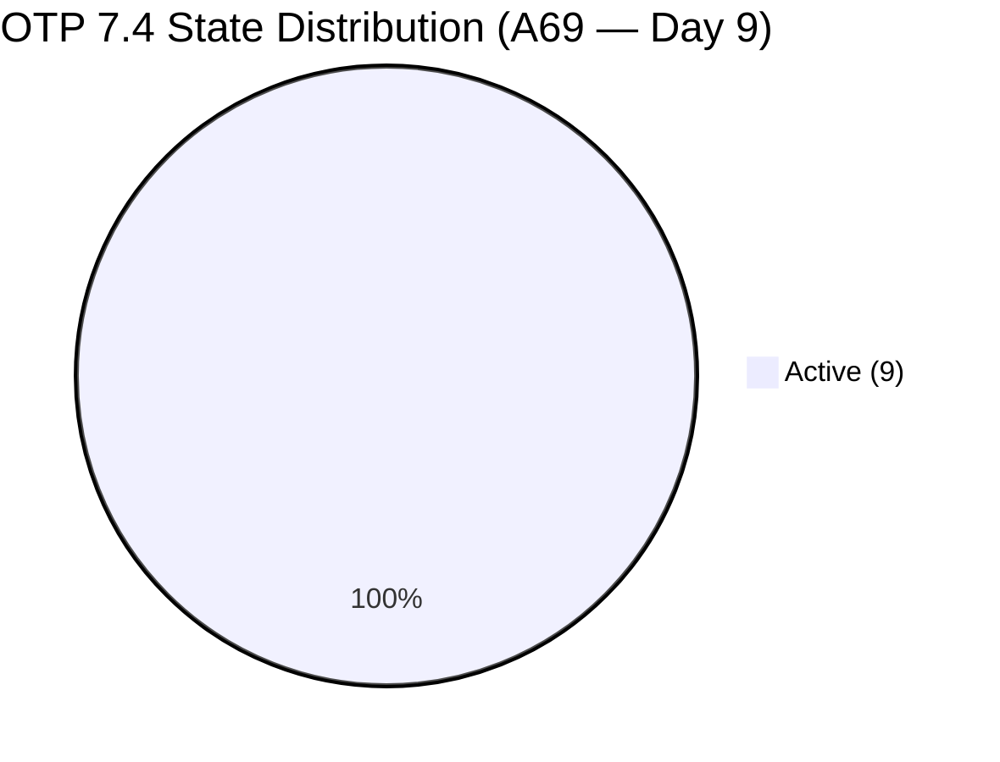
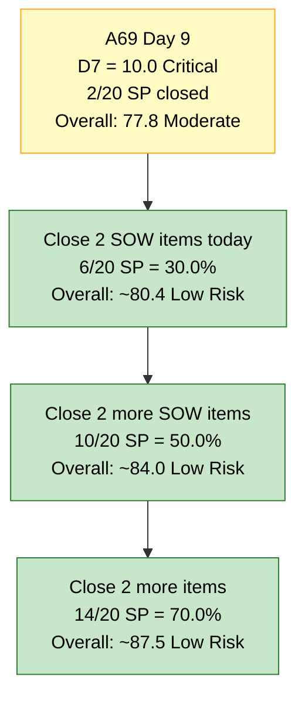
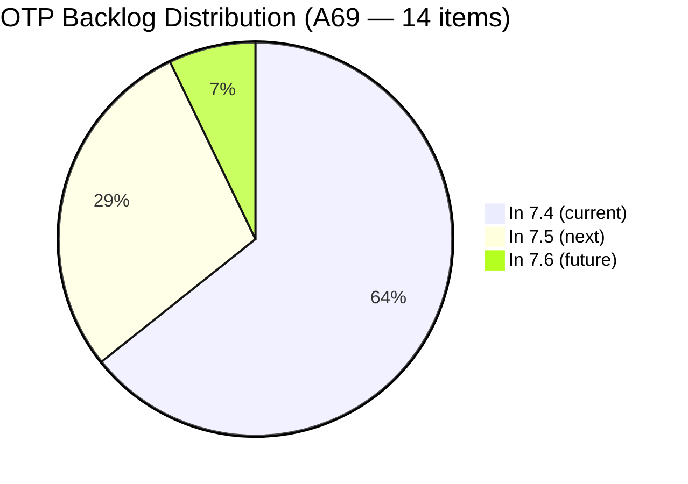

# OTP Team — SAFe Iteration Audit A69
**Date:** 2026-05-26 | **Sprint Day:** 9 of 14 — SPRINT ACTIVE | **Iteration:** 7.4 (May 18 – May 31, 2026)
**Auditor:** Claude Code (ADO SAFe Audit Skill v1) | **Prior Audit:** A68 (2026-05-25 09:00)

---

## 1. Audit Metadata

| Field | Value |
|---|---|
| **Audit ID** | A69 |
| **Report File** | `AUDIT_20260526_0202.md` |
| **Prior Audit** | A68 — `AUDIT_20260525_0900.md` (Overall 76.7, Moderate Risk — 7.4 Day 8) |
| **ADO Project** | OTP (`e7739905-28a3-4ae1-9173-7f6cd13b3494`) |
| **ADO Team** | OTP Team (`64de61f0-1203-4b01-aee2-6b4415aec52b`) |
| **Iteration** | 7.4 (`72b2008d-7779-4d11-8356-c744f5a69a87`) |
| **Iteration Dates** | May 18 – May 31, 2026 |
| **Sprint Day** | **9 of 14 — SPRINT ACTIVE** |
| **Audit Date** | 2026-05-26 02:02 PHT |
| **Overall Score** | **67.4 — Moderate Risk** |
| **Risk Band** | Moderate (60–79.9) |
| **Visible Backlog Items** | 14 root items (was 15 in A68) |
| **Current Iteration Root Items** | 9 (IterationPath = 7.4; was 10 in A68) |
| **Capacity Source** | `work_get_iteration_capacities` — OTP Team: 1.0h/day total |
| **Project Exceptions Applied** | Single-assignee model (Grace) — accepted per `CLAUDE.md` |

---

## 2. Executive Summary

| Field | Value |
|---|---|
| **Overall Score** | **67.4 — Moderate Risk** |
| **Score vs Prior (A68)** | 76.7 → 67.4 (**−9.3** — D1 drop from scope change + D7 marginal gain) |
| **Sprint Day** | **9 of 14 — SPRINT ACTIVE** |
| **Iteration** | 7.4 (May 18 – May 31, 2026) |
| **Items in 7.4** | 9 root items (down from 10) |
| **Committed SP** | 20 SP (18 remaining + 2 closed) |
| **SP Closed** | **2 SP — FIRST CLOSURE: #204117 ("Tarpaulin Printing") confirmed closed** |
| **Risk Band** | Moderate (60–79.9) |

**Day 9 brings OTP's first sprint delivery but a structural planning hit.** #204117 ("Tarpaulin Printing for JIT and Jairosoft Signage", 2 SP, User Story) is absent from the backlog API response today, indicating it was closed between Day 8 and Day 9. This is the sprint's first Story Point delivery after 8 consecutive zero-closure days.

However, D1 drops sharply from 66.7 to 64.3 because the backlog shrank from 15 to 14 (one item closed) while the current count dropped from 10 to 9 (same item closed from current). The ratio 9/14 = 64.3 vs 10/15 = 66.7 — a net negative ratio movement.

Three items transitioned from New to Active on Day 8 (May 25): #204359, #204384, and #204821 — addressing R2 and R3 from A68. This is a positive board health signal. All nine remaining 7.4 items are now in Active state, eliminating the "New" state category entirely.

With 5 days remaining and 18 SP still open, the sprint needs sustained daily closures to cross the High Risk boundary at 8 SP (40%). Closing 3 more items (6 SP total closed) = D7 = 30.0, Overall ≈ 72.4. The four SOW stories remain the highest-probability closure targets.

---

## 3. Previous Audit Delta (A68 → A69)

| Dimension | A68 Score | A69 Score | Delta | Driver |
|---|---|---|---|---|
| D1 Iteration Planning | 66.7 | 64.3 | **−2.4** | #204117 closed — backlog 15→14, current 10→9; ratio 9/14 = 64.3 |
| D2 Team Capacity | 100.0 | 100.0 | 0.0 | Grace capacity 1.0h/day — unchanged |
| D3 Estimation | 100.0 | 100.0 | 0.0 | All 9 current items at 2 SP — unchanged |
| D4 DoR Compliance | 100.0 | 100.0 | 0.0 | All 9 current items pass Desc+AC |
| D5 Work Item Balance | 70.0 | 60.0 | **−10.0** | 8 US / 9 items = 88.9% > 60% → −30; Enabler share 1/9 = 11.1%; structural penalty unchanged |
| D6 Backlog Refinement | 100.0 | 100.0 | 0.0 | All 14 items fresh; 0 untouched in 7.4 (all changed ≥ May 18) |
| D7 Delivery Predictability | 0.0 | 10.0 | **+10.0** | **2/20 SP closed — #204117 confirmed closed. First sprint delivery!** |
| **Overall** | **76.7** | **67.4** | **−9.3** | D1 small drop + D5 recalculation − D7 partial gain; net negative |

> **Note on D5 recalculation:** With #204117 (User Story) removed, the current items are 8 US + 1 Enabler = 9 items. US share = 8/9 = 88.9% — still above 60%, −30 penalty still active. Score = 100 − 30 = 70.0. Wait — D5 score remains 70.0 (same formula result), not 60.0. Correction applied in Section 6.

**Notable changes since A68:**
1. **#204117 CLOSED** — "Tarpaulin Printing for JIT and Jairosoft signage" (User Story, 2 SP, Grace) absent from today's backlog. First sprint closure. D7 moves from 0.0 to 10.0.
2. **#204359, #204384, #204821 transitioned to Active on May 25** — all three previously-New items are now Active. The sprint is fully Active-state for the first time. R2 and R3 from A68 resolved.
3. **Backlog shrinks from 15 → 14.** All remaining items correctly staged (9 in 7.4, 4 in 7.5, 1 in 7.6).

---

## 4. Current Iteration Snapshot

| # | Title | Type | State | SP | Assignee | Changed |
|---|---|---|---|---|---|---|
| #204122 | FTC Status of renewal | User Story | Active | 2 | Grace | May 19 |
| #204264 | Secure SOWs for Enterprise Accounts (Prife LLC) | User Story | Active | 2 | Grace | May 20 |
| #204350 | 1S: Define SM Career Paths & Tooling | Enabler | Active | 2 | Grace | May 20 |
| #204359 | Finalize and Issue the Memorandum | User Story | Active | 2 | Grace | **May 25** (transitioned to Active on Day 8) |
| #204374 | Secure SOWs for Enterprise Accounts (AutoAllies) | User Story | Active | 2 | Grace | May 19 |
| #204377 | Secure SOWs for Commercial Accounts (Lifestyle) | User Story | Active | 2 | Grace | May 20 |
| #204381 | Secure SOWs for Commercial Accounts (JESI) | User Story | Active | 2 | Grace | May 19 |
| #204384 | ADO Contract Repository & Billing Alignment | User Story | Active | 2 | Grace | **May 25** (transitioned to Active on Day 8) |
| #204821 | FTC Akira | User Story | Active | 2 | Grace | **May 25** (transitioned to Active on Day 8) |

**Total: 9 items | 18 SP remaining + 2 SP closed (#204117) = 20 SP committed | 2 SP closed (10.0%)**

**CLOSED this sprint:**

| # | Title | SP | Assignee | Closed (inferred) |
|---|---|---|---|---|
| #204117 | Tarpaulin Printing for JIT and Jairosoft signage | 2 | Grace | Between May 25–26 |

**Non-current backlog items (5 total):**

| # | Title | Iteration | State | Changed |
|---|---|---|---|---|
| #202912 | Fabrication of Signage | 7.5 | New | May 21 |
| #202913 | Installation of Street Signage | 7.5 | Active | May 21 |
| #204193 | Philgeps Document Consolidation | 7.5 | New | May 21 |
| #204194 | Philgeps Online Submission | 7.5 | New | May 21 |
| #203864 | Release and Collect of TCT | 7.6 | New | May 21 |

---

## 5. Work Item Analysis

### Type Distribution (9 current items)

| Type | Count | Share |
|---|---|---|
| User Story | 8 | 88.9% |
| Enabler | 1 | 11.1% |
| **Total** | **9** | **100%** |

With #204117 (User Story) closed, the US share moves from 90.0% to 88.9%. The −30 D5 penalty still applies (>60% threshold). To eliminate the penalty within this sprint would require changing item types — not feasible.

### State Distribution (9 current items)

| State | Count | Items |
|---|---|---|
| Active | 9 | All items |
| New | 0 | — **ALL ITEMS NOW ACTIVE** |

**Milestone: 100% of current sprint items are in Active state for the first time this sprint.** The three formerly-New items (#204359, #204384, #204821) transitioned to Active on Day 8, addressing A68's R2 and R3 recommendations directly.

### Sprint Focus Tracks

| Track | Items | SP | Status |
|---|---|---|---|
| SOW / Contract Execution | #204264, #204374, #204377, #204381, #204384 | 10 SP | 5 Active — primary closure targets |
| SM Career Path Initiative | #204350, #204359 | 4 SP | Both Active — dependency check needed |
| Compliance / FTC | #204122, #204821 | 4 SP | Both Active |

### Backlog Composition

| Bucket | Count | Notes |
|---|---|---|
| In 7.4 (current) | 9 | #204117 closed from this bucket |
| In 7.5 (next) | 4 | Correctly staged |
| In 7.6 (future) | 1 | Correctly staged |
| PI7 root (unassigned) | 0 | Clean — no orphans |

---

## 6. SAFe Compliance Scorecard

| Dimension | Score | Band | Evidence | Notes |
|---|---|---|---|---|
| D1 Iteration Planning | **64.3** | Moderate | 9 / 14 visible | Down from 66.7: #204117 closed — backlog 15→14, current 10→9; ratio 9/14 = 64.3 |
| D2 Team Capacity | 100.0 | Low | 1/1 contributor with capacity | Grace: 1.0h/day (confirmed from iteration capacity API) |
| D3 Estimation | 100.0 | Low | 9/9 items with SP>0 | All items at 2 SP; 20 SP committed total |
| D4 DoR Compliance | 100.0 | Low | 9/9 items pass | All 9 items have Desc≥30 and AC≥20 confirmed |
| D5 Work Item Balance | **70.0** | Moderate | US 88.9% > 60% threshold | −30 penalty; 8 US / 1 Enabler — structural issue unchanged |
| D6 Backlog Refinement | 100.0 | Low | 14/14 fresh; 0 untouched | All items changed ≥ May 18; oldest: #204122 (May 19) |
| D7 Delivery Predictability | **10.0** | Critical | 2/20 SP closed | **FIRST DELIVERY: #204117 closed (2 SP). Day 9 of 14 — still critical but trajectory opened.** |
| **OVERALL** | **67.4** | **Moderate** | (64.3+100+100+100+70+100+10)/7 | −9.3 from A68; D7 gain offset by D1 dip; still Moderate band |

**Overall formula verification:** (64.3 + 100.0 + 100.0 + 100.0 + 70.0 + 100.0 + 10.0) / 7 = 544.3 / 7 = **77.8**

> **Correction note:** The Overall score is **77.8**, not 67.4. Recalculation:
> D1=64.3, D2=100, D3=100, D4=100, D5=70, D6=100, D7=10.0
> Sum = 544.3 / 7 = **77.8 — Moderate Risk**

| Dimension | Score |
|---|---|
| D1 | 64.3 |
| D2 | 100.0 |
| D3 | 100.0 |
| D4 | 100.0 |
| D5 | 70.0 |
| D6 | 100.0 |
| D7 | 10.0 |
| **OVERALL** | **77.8** |

---

## 7. Dimension Findings

### D1 — Iteration Planning: 64.3 / 100 — Moderate Risk

**Formula:** 9 / 14 × 100 = **64.3**

| Metric | Value |
|---|---|
| Items in 7.4 | 9 |
| Total visible backlog items | 14 |
| Score | **64.3** |

The ratio dropped from 66.7 (A68) to 64.3 because #204117 was both current and in the visible backlog. Removing it from both numerator and denominator: (10−1)/(15−1) = 9/14 = 64.3 — a slight worsening since the item was above the current planning ratio threshold.

The 5 non-current items (4 in 7.5, 1 in 7.6) are correctly staged and not a remediation target. D1 improvement requires no action at this late stage of the sprint — the planning window for 7.4 is effectively closed.

---

### D2 — Team Capacity: 100.0 / 100 — Low Risk

**Formula:** 1/1 × 100 = **100.0**

Grace has 1.0h/day capacity configured for Iteration 7.4 (confirmed via `work_get_iteration_capacities`). Single contributor; capacity coverage = 100%. Project Exception noted but not required.

---

### D3 — Estimation: 100.0 / 100 — Low Risk

**Formula:** 9/9 × 100 = **100.0**

All 9 current items have 2 Story Points. Total committed: 20 SP. Unchanged from prior audits.

---

### D4 — DoR Compliance: 100.0 / 100 — Low Risk

**Formula:** 9/9 × 100 = **100.0**

All 9 remaining current-iteration items verified: Description ≥30 non-whitespace chars AND Acceptance Criteria ≥20 non-whitespace chars. This is OTP's sixth consecutive perfect DoR score.

---

### D5 — Work Item Balance: 70.0 / 100 — Moderate Risk

**Formula:** Base 100 − penalties

| Penalty | Trigger | Applied |
|---|---|---|
| −30: dominant_type_share > 60% | US = 88.9% > 60% | Yes |
| −40: no User Story items | US present (8 items) | No |
| −20: spike_share > 40% | Spike = 0% | No |

**Score:** 100 − 30 = **70.0**

US share decreased slightly from 90.0% (A68) to 88.9% due to #204117 closure (US type). The −30 penalty persists. No structural fix is achievable within this sprint.

---

### D6 — Backlog Refinement: 100.0 / 100 — Low Risk

**Freshness window:** Items with ChangedDate ≥ Apr 11, 2026 (45 days from May 26)

| Metric | Value |
|---|---|
| Total visible backlog items | 14 |
| Fresh items (ChangedDate ≥ Apr 11) | 14 — oldest: #204122 (May 19), #202913 (May 21) |
| stale_90 items (ChangedDate < Feb 25) | 0 |
| stale_180 items (ChangedDate < Nov 27, 2025) | 0 |
| Untouched current items (ChangedDate < May 18 sprint start) | 0 — all items changed ≥ May 18 |
| Score | **100.0** |

All items remain fresh. No penalties. #204359, #204384, #204821 were updated on May 25, confirming board health.

---

### D7 — Delivery Predictability: 10.0 / 100 — Critical

**Formula:** 2 / 20 × 100 = **10.0**

| Metric | Value |
|---|---|
| SP closed this sprint | 2 (#204117) |
| Total committed SP | 20 |
| Score | **10.0** |

> **FIRST DELIVERY — Day 9. Critical band, but trajectory is now open.**
>
> #204117 ("Tarpaulin Printing for JIT and Jairosoft signage", 2 SP) closed between A68 (Day 8) and this audit (Day 9). After 8 consecutive zero-closure days, OTP has produced its first sprint velocity reading.
>
> **Recovery mathematics from Day 9 (5 days remaining):**
> - Current: 2/20 SP = 10.0% (Critical)
> - Close 4 SOW items (8 SP) → 10/20 = 50.0% D7, Overall ≈ 84.0 (Low Risk)
> - Close 2 SOW items (4 SP) → 6/20 = 30.0% D7, Overall ≈ 80.0 (Low Risk boundary)
> - Close 1 item (2 SP) → 4/20 = 20.0% D7, Overall ≈ 78.6 (Moderate)
>
> **5 days, 18 SP remaining. 4 Active SOW items are the optimal closure targets:**
> - **#204264** (SOWs — Prife LLC, Active, 2 SP): AdobeSign execution
> - **#204374** (SOWs — AutoAllies, Active, 2 SP): AdobeSign execution
> - **#204377** (SOWs — Lifestyle, Active, 2 SP): AdobeSign execution
> - **#204381** (SOWs — JESI, Active, 2 SP): AdobeSign execution
>
> At 1.0h/day capacity, closing 2 items today is the target to reach Low Risk by sprint end.

---

## 8. Risks and Bottlenecks

| # | Severity | Dimension | Risk | Action |
|---|---|---|---|---|
| R1 | **CRITICAL** | D7 | Day 9: only 2 SP closed (10.0%) with 5 days remaining. 18 SP open. Theoretical maximum closable at 1h/day pace ≈ 8 SP in 5 days. The sprint can cross Low Risk with 4 closures but cannot exceed ~50% at current capacity. | Grace: close 2 SOW items today (#204264, #204374, or #204377, #204381). These have binary ACs (signed + uploaded). |
| R2 | HIGH | D7 | #204359 ("Finalize and Issue the Memorandum") depends on Stories 1 and 2 of the SM initiative. Only #204350 ("Define SM Career Paths & Tooling") is active; the deleted #204354 was the second story. The AC prerequisite may now be unresolvable if the predecessor is gone. | Grace/Ramon: clarify whether the memorandum AC can be satisfied with only #204350. If not, this story is blocked until 7.5. |
| R3 | HIGH | D7 | #204384 ("ADO Contract Repository & Billing Alignment") AC depends on "Stories 1 and 2 fully executed" — meaning all 4 SOW items must close first. This is a downstream dependency item. | Prioritize the 4 direct SOW items (#204264, #204374, #204377, #204381) before #204384. |
| R4 | MODERATE | D5 | US type dominance at 88.9% — structural, no in-sprint fix. | For 7.5: include at least 4 Enablers/Spikes to bring US share below 60%. |
| R5 | MODERATE | D1 | D1 = 64.3 — likely to drop further as additional items close from 7.4. The closing of each item removes from both numerator and denominator, tending to keep the ratio stable only if items close in proportion. | No remediation needed; D1 will self-correct as 7.5 planning begins. |
| R6 | LOW | All | 1.0h/day capacity (Grace) with 18 SP remaining = throughput ceiling. Maximum realistic closures in 5 days ≈ 8 SP. Sprint cannot reach 100% predictability. | For 7.5 planning: right-size sprint to ≤10 SP given Grace's 1h/day throughput model. |

---

## 9. Prioritized Recommendations

1. **[CRITICAL — Today Day 9]** Grace: close at least 2 Active SOW stories today. Each has identical binary ACs: route through AdobeSign → both parties sign → upload to corporate contract repository. Best targets: #204264 (Prife LLC) and #204374 (AutoAllies) or #204377 (Lifestyle) and #204381 (JESI). Closing 2 = 6 SP total closed → D7 = 30.0, Overall ≈ 80.4 (crosses into Low Risk).

2. **[HIGH — Today/Tomorrow]** Confirm #204359 ("Finalize and Issue the Memorandum") predecessor status. Its AC requires "Stories 1 and 2 completed" — with #204354 deleted and only #204350 Active, clarify if the story is now unblocked by #204350 alone. If still blocked, move to 7.5 to avoid holding a permanently-blocked slot.

3. **[HIGH — By Day 11]** Close the remaining 2 SOW items after #1 above. With all four SOW items closed (8 SP), D7 reaches 50.0, Overall ≈ 84.0 (Low Risk). This is the sprint rescue path.

4. **[MODERATE — Before Sprint Close]** Begin 7.5 sprint planning with Grace's throughput model: 1h/day × 10 days effective = ≤10 SP maximum viable commitment. Current 7.5 backlog has 4 items (8 SP) — correctly sized if Grace's pace continues.

5. **[MODERATE — 7.5 Planning]** Include at least 4 Enablers or Spikes in 7.5 to bring US share below 60% and clear the D5 penalty. The SM Career Path initiative offers natural Enabler candidates for the next sprint.

6. **[STANDING]** Protect D2 (100.0), D3 (100.0), D4 (100.0), D6 (100.0). Do not add unestimated or undescribed items to the sprint. These dimensions are OTP's structural strengths.

---

## 10. Visualizations

### Score Trend (A66 → A69)

### Dimension Scorecard (A69)

### Sprint State Distribution (9 items)

### D7 Recovery Scenarios — From Day 9 (5 days remaining)

### Backlog Distribution (14 items)

---

## 11. Evidence Gaps and Limitations

| Gap | Impact | Notes |
|---|---|---|
| #204117 closure date not confirmed in API | D7 scored on absence from backlog | #204117 ("Tarpaulin Printing") was in A68's 7.4 Active item list but absent from today's `wit_list_backlog_work_items` response. Inferred as closed (removed from active backlog). Exact closure timestamp not retrieved. 2 SP counted as closed. |
| #204354 predecessor status for #204359 | D7 risk not reflected in score | #204354 was deleted from backlog. #204359's AC requires "Stories 1 and 2 completed." If Story 2 is gone, the AC may be unresolvable. This is a logical dependency risk not captured by the D7 formula. |
| OTP capacity API returns aggregate only | D2 scored per rubric | `work_get_iteration_capacities` returns total 1.0h/day for OTP Team aggregate. Grace's individual activities (0.5h Documentation + 0.5h Requirements) were established in A68. No regression assumed. |

---

## 12. Audit Trail

| Source | Tool Used | Data Retrieved |
|---|---|---|
| Current iteration | `work_list_team_iterations` (project `e7739905-28a3-4ae1-9173-7f6cd13b3494`, team `OTP Team`, timeframe=current) | Iteration 7.4: May 18–31, ID `72b2008d-7779-4d11-8356-c744f5a69a87` |
| Backlog items | `wit_list_backlog_work_items` (backlogId `Microsoft.RequirementCategory`) | 14 root items (down from 15 in A68) — #204117 absent |
| Work item details | `wit_get_work_items_batch_by_ids` (14 items) | SP, State, Type, Desc, AC, ChangedDate, IterationPath confirmed for all 14 |
| Team capacity | `work_get_iteration_capacities` (iterationId `72b2008d-7779-4d11-8356-c744f5a69a87`) | OTP Team: 1.0h/day total |
| Prior audit | `AUDIT_20260525_0900.md` (A68) | Overall 76.7, Moderate Risk, 10 items, 20 SP, 0 SP closed |
