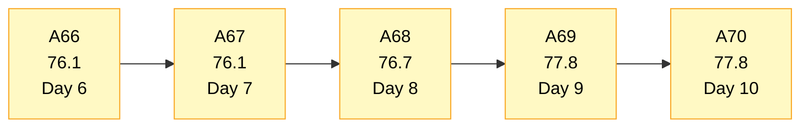
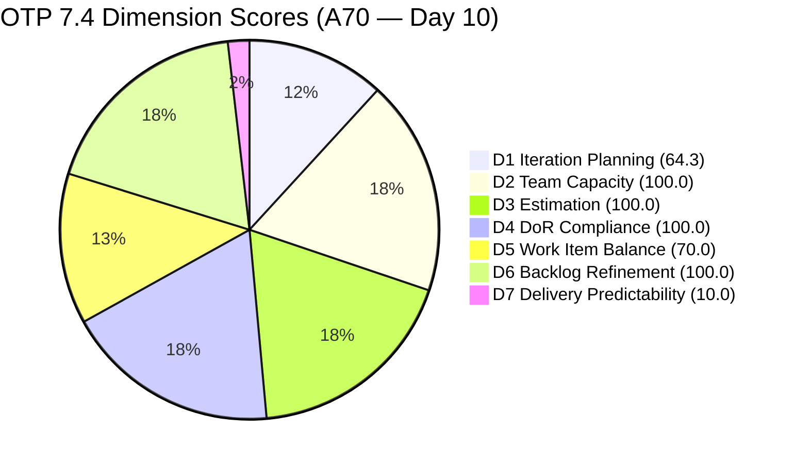
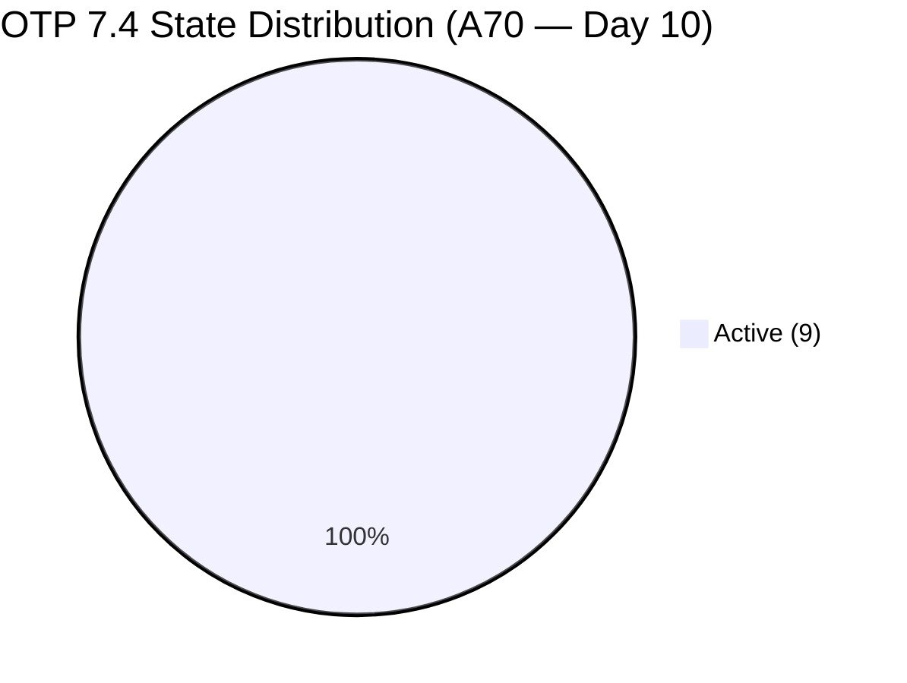
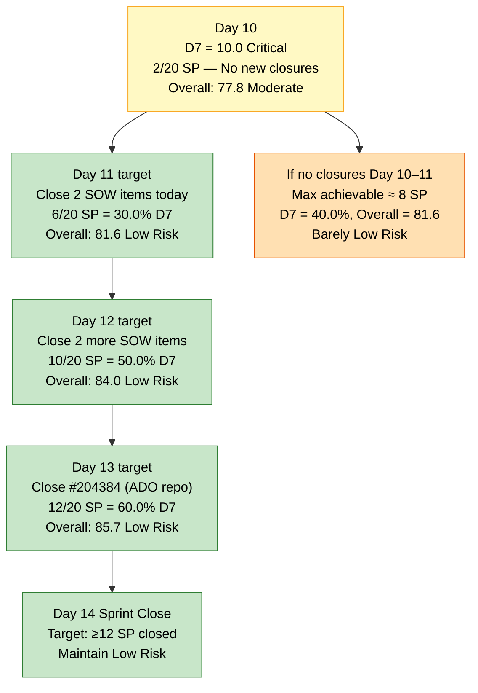
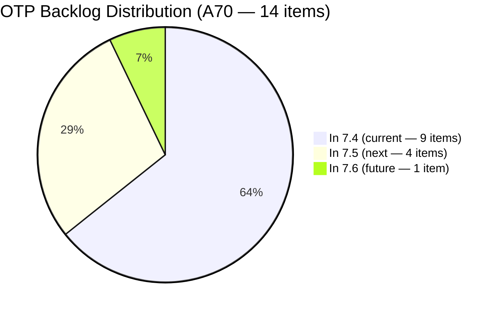

# OTP Team — SAFe Iteration Audit A70
**Date:** 2026-05-27 | **Sprint Day:** 10 of 14 — SPRINT ACTIVE | **Iteration:** 7.4 (May 18 – May 31, 2026)
**Auditor:** Claude Code (ADO SAFe Audit Skill v1) | **Prior Audit:** A69 (2026-05-26 02:02)

---

## 1. Audit Metadata

| Field | Value |
|---|---|
| **Audit ID** | A70 |
| **Report File** | `AUDIT_20260527_0903.md` |
| **Prior Audit** | A69 — `AUDIT_20260526_0202.md` (Overall 77.8, Moderate Risk — 7.4 Day 9) |
| **ADO Project** | OTP (`e7739905-28a3-4ae1-9173-7f6cd13b3494`) |
| **ADO Team** | OTP Team (`64de61f0-1203-4b01-aee2-6b4415aec52b`) |
| **Iteration** | 7.4 (`72b2008d-7779-4d11-8356-c744f5a69a87`) |
| **Iteration Dates** | May 18 – May 31, 2026 |
| **Sprint Day** | **10 of 14 — SPRINT ACTIVE** |
| **Audit Date** | 2026-05-27 09:03 UTC |
| **Overall Score** | **77.8 — Moderate Risk** |
| **Risk Band** | Moderate (60–79.9) |
| **Visible Backlog Items** | 14 root items (unchanged from A69) |
| **Current Iteration Root Items** | 9 (IterationPath = 7.4; unchanged from A69) |
| **Capacity Source** | `work_get_iteration_capacities` — OTP Team: 1.0h/day total |
| **Project Exceptions Applied** | Single-assignee model (Grace) — accepted per `CLAUDE.md` |

---

## 2. Executive Summary

| Field | Value |
|---|---|
| **Overall Score** | **77.8 — Moderate Risk** |
| **Score vs Prior (A69)** | 77.8 → 77.8 (**0.0** — no changes detected) |
| **Sprint Day** | **10 of 14 — SPRINT ACTIVE** |
| **Iteration** | 7.4 (May 18 – May 31, 2026) |
| **Items in 7.4** | 9 root items (unchanged) |
| **Committed SP** | 20 SP (18 remaining + 2 closed) |
| **SP Closed** | **2 SP — #204117 only, no new closures since Day 9** |
| **Risk Band** | Moderate (60–79.9) |

**Day 10 shows no delivery movement.** The backlog returned exactly 14 items with all 9 current-iteration items still in Active state. No new closures were detected since A69 (Day 9). #204117 remains the sole sprint delivery at 2 SP (10.0% of committed).

With 4 days remaining (Days 11–14), 18 SP are open. The sprint is entering its final window. At Grace's 1.0h/day throughput, a maximum of approximately 8 SP can close in the remaining sprint days. The Low Risk threshold requires closing at least 8 more SP (total 10 SP = 50.0% D7, Overall ~84.0).

The four Active SOW items (#204264, #204374, #204377, #204381) remain the highest-probability closure targets. They share identical binary acceptance criteria (AdobeSign execution + upload). Each day without closure narrows the recovery window further.

---

## 3. Previous Audit Delta (A69 → A70)

| Dimension | A69 Score | A70 Score | Delta | Driver |
|---|---|---|---|---|
| D1 Iteration Planning | 64.3 | 64.3 | 0.0 | No change — backlog 14, current 9; ratio 9/14 = 64.3 unchanged |
| D2 Team Capacity | 100.0 | 100.0 | 0.0 | Grace capacity 1.0h/day — unchanged |
| D3 Estimation | 100.0 | 100.0 | 0.0 | All 9 current items at 2 SP — unchanged |
| D4 DoR Compliance | 100.0 | 100.0 | 0.0 | All 9 items pass Desc+AC — unchanged |
| D5 Work Item Balance | 70.0 | 70.0 | 0.0 | US = 88.9% > 60% threshold; −30 penalty unchanged |
| D6 Backlog Refinement | 100.0 | 100.0 | 0.0 | All 14 items fresh; 0 untouched in 7.4 (ChangedDate ≥ May 19) |
| D7 Delivery Predictability | 10.0 | 10.0 | 0.0 | No new closures — 2/20 SP = 10.0% unchanged |
| **Overall** | **77.8** | **77.8** | **0.0** | Static day — all dimensions frozen |

**Notable changes since A69:**
- No work items were closed, added, or moved.
- No state transitions detected among the 9 current-iteration items.
- No capacity changes.

**This is the second consecutive day (Days 9–10) with only 2 SP closed total.** The sprint needs 4 closures in 4 days to reach Low Risk.

---

## 4. Current Iteration Snapshot

| # | Title | Type | State | SP | Assignee | Changed |
|---|---|---|---|---|---|---|
| #204122 | FTC Status of renewal | User Story | Active | 2 | Grace | May 19 |
| #204264 | Secure SOWs for Enterprise Accounts (Prife LLC) | User Story | Active | 2 | Grace | May 20 |
| #204350 | 1S: Define SM Career Paths & Tooling | Enabler | Active | 2 | Grace | May 20 |
| #204359 | Finalize and Issue the Memorandum | User Story | Active | 2 | Grace | May 25 |
| #204374 | Secure SOWs for Enterprise Accounts (AutoAllies) | User Story | Active | 2 | Grace | May 19 |
| #204377 | Secure SOWs for Commercial Accounts (Lifestyle) | User Story | Active | 2 | Grace | May 20 |
| #204381 | Secure SOWs for Commercial Accounts (JESI) | User Story | Active | 2 | Grace | May 19 |
| #204384 | ADO Contract Repository & Billing Alignment | User Story | Active | 2 | Grace | May 25 |
| #204821 | FTC Akira | User Story | Active | 2 | Grace | May 25 |

**Total: 9 items | 18 SP remaining + 2 SP closed (#204117) = 20 SP committed | 2 SP closed (10.0%)**

**CLOSED this sprint:**

| # | Title | SP | Assignee | Closed (inferred) |
|---|---|---|---|---|
| #204117 | Tarpaulin Printing for JIT and Jairosoft signage | 2 | Grace | Between May 25–26 (confirmed A69) |

**Non-current backlog items (5 total — unchanged):**

| # | Title | Iteration | State | Changed |
|---|---|---|---|---|
| #202912 | Fabrication of Signage | 7.5 | New | May 21 |
| #202913 | Installation of Street Signage | 7.5 | Active | May 21 |
| #204193 | Philgeps Document Consolidation | 7.5 | New | May 21 |
| #204194 | Philgeps Online Submission | 7.5 | New | May 21 |
| #203864 | Release and Collect of TCT | 7.6 | New | May 21 |

---

## 5. Work Item Analysis

### Type Distribution (9 current items)

| Type | Count | Share |
|---|---|---|
| User Story | 8 | 88.9% |
| Enabler | 1 | 11.1% |
| **Total** | **9** | **100%** |

US dominance at 88.9% continues to trigger the D5 −30 penalty. No structural change possible within this sprint.

### State Distribution (9 current items)

| State | Count | Items |
|---|---|---|
| Active | 9 | All 9 items |
| New | 0 | — |

All 9 items remain Active for Day 2 in a row. No state progressions observed from A69. The board is fully active but delivery is stalled.

### Sprint Focus Tracks

| Track | Items | SP | Status |
|---|---|---|---|
| SOW / Contract Execution | #204264, #204374, #204377, #204381, #204384 | 10 SP | 5 Active — primary closure targets |
| SM Career Path Initiative | #204350, #204359 | 4 SP | Both Active — #204359 blocked by missing Story 2 |
| Compliance / FTC | #204122, #204821 | 4 SP | Both Active |

### Backlog Composition

| Bucket | Count | Notes |
|---|---|---|
| In 7.4 (current) | 9 | No change from A69 |
| In 7.5 (next) | 4 | Correctly staged |
| In 7.6 (future) | 1 | Correctly staged |

### Delivery Urgency — Days Remaining vs SP Open

| Day | SP Needed to Reach... | Low Risk (≥8 closed) | Moderate D7 (≥6 closed) |
|---|---|---|---|
| Day 10 (today) | Need 8 SP in 4 days | 2 SP/day pace | 1.5 SP/day pace |
| Day 11 | Need 8 SP in 3 days | 2.7 SP/day pace | 2 SP/day pace |
| Day 12 | Need 8 SP in 2 days | 4 SP/day pace | Minimum viable |
| Day 13 | Need 8 SP in 1 day | Grace's max = ~2 SP/day | High risk |

At Grace's sustained throughput of 1.0h/day, closing 2 SP/day requires prioritization of binary-AC items (SOW execute + upload). **Today is the last day this target is fully achievable at pace.**

---

## 6. SAFe Compliance Scorecard

| Dimension | Score | Band | Evidence | Notes |
|---|---|---|---|---|
| D1 Iteration Planning | **64.3** | Moderate | 9 / 14 visible | Unchanged — no backlog movements since A69 |
| D2 Team Capacity | **100.0** | Low | 1/1 contributor with capacity | Grace: 1.0h/day (confirmed from iteration capacity API) |
| D3 Estimation | **100.0** | Low | 9/9 items with SP>0 | All 9 current items at 2 SP each |
| D4 DoR Compliance | **100.0** | Low | 9/9 items pass | All items verified: Desc ≥30 and AC ≥20 non-whitespace chars |
| D5 Work Item Balance | **70.0** | Moderate | US 88.9% > 60% | −30 penalty; structural constraint — no in-sprint fix |
| D6 Backlog Refinement | **100.0** | Low | 14/14 fresh; 0 untouched | All 14 items changed ≥ May 19; no stale_90 or stale_180 items |
| D7 Delivery Predictability | **10.0** | Critical | 2/20 SP closed | No new closures Day 10. Critical band maintained. |
| **OVERALL** | **77.8** | **Moderate** | (64.3+100+100+100+70+100+10)/7 | No change from A69; 4 days remain |

**Formula verification:** (64.3 + 100.0 + 100.0 + 100.0 + 70.0 + 100.0 + 10.0) / 7 = 544.3 / 7 = **77.8**

---

## 7. Dimension Findings

### D1 — Iteration Planning: 64.3 / 100 — Moderate Risk

**Formula:** 9 / 14 × 100 = **64.3**

| Metric | Value |
|---|---|
| Items in 7.4 | 9 |
| Total visible backlog items | 14 |
| Score | **64.3** |

D1 is stable at 64.3 for the second consecutive day. The 5 non-current items (4 in 7.5, 1 in 7.6) are correctly staged. No remediation is needed or feasible at this sprint stage. The planning window for 7.4 is effectively closed; D1 will reset when 7.5 planning begins.

---

### D2 — Team Capacity: 100.0 / 100 — Low Risk

**Formula:** 1/1 × 100 = **100.0**

Grace has 1.0h/day capacity configured for Iteration 7.4 (confirmed via `work_get_iteration_capacities`). Single contributor; capacity coverage = 100%. Project Exception for single-assignee model is noted but does not affect D2 scoring.

---

### D3 — Estimation: 100.0 / 100 — Low Risk

**Formula:** 9/9 × 100 = **100.0**

All 9 current items carry 2 Story Points. Total committed: 20 SP. Unchanged from A69.

---

### D4 — DoR Compliance: 100.0 / 100 — Low Risk

**Formula:** 9/9 × 100 = **100.0**

All 9 current-iteration items verified individually: Description ≥30 non-whitespace chars AND Acceptance Criteria ≥20 non-whitespace chars. OTP has maintained perfect DoR compliance for seven consecutive audits (A63–A70).

---

### D5 — Work Item Balance: 70.0 / 100 — Moderate Risk

**Formula:** Base 100 − penalties

| Penalty | Trigger | Applied |
|---|---|---|
| −30: dominant_type_share > 60% | US = 88.9% > 60% | Yes |
| −40: no User Story items | US present (8 items) | No |
| −20: spike_share > 40% | Spike = 0% | No |

**Score:** 100 − 30 = **70.0**

The US dominance at 88.9% is structurally inherited from OTP's business backlog composition (SOW execution, FTC compliance, signage — all naturally User Story typed). The −30 penalty will persist through 7.4 close. For 7.5, Grace should classify at least 2–3 items as Enablers (e.g., internal process improvements, infrastructure support) to reduce US share below 60%.

---

### D6 — Backlog Refinement: 100.0 / 100 — Low Risk

**Freshness window:** Items with ChangedDate ≥ Apr 12, 2026 (45 days from May 27)

| Metric | Value |
|---|---|
| Total visible backlog items | 14 |
| Fresh items (ChangedDate ≥ Apr 12) | 14 — oldest: #204122 (May 19) |
| stale_90 items (ChangedDate < Feb 26) | 0 |
| stale_180 items (ChangedDate < Nov 28, 2025) | 0 |
| Untouched current items (ChangedDate < May 18) | 0 — all changed ≥ May 19 |
| Score | **100.0** |

All items remain fresh. The six non-current items in the backlog (7.5/7.6) were last changed between May 21 (signage/Philgeps items) and May 21 — well within the 45-day freshness window. D6 = 100.0 is defensible.

---

### D7 — Delivery Predictability: 10.0 / 100 — Critical

**Formula:** 2 / 20 × 100 = **10.0**

| Metric | Value |
|---|---|
| SP closed this sprint | 2 (#204117 only) |
| Total committed SP | 20 |
| Score | **10.0** |

> **Day 10: No new closures detected. The sprint has now gone two days (Days 9–10) since the only closure.**
>
> The delivery stall is now urgent. With 4 days remaining:
>
> | Scenario | SP Closed | D7 | Overall | Band |
> |---|---|---|---|---|
> | No additional closures | 2/20 | 10.0 | 77.8 | Moderate |
> | Close 2 SOW items (4 SP) | 6/20 | 30.0 | 81.6 | Low Risk |
> | Close 4 SOW items (8 SP) | 10/20 | 50.0 | 84.0 | Low Risk |
> | Close 6 items (12 SP) | 14/20 | 70.0 | 87.5 | Low Risk |
>
> The optimal targets remain the four directly-executable SOW stories with binary ACs: #204264 (Prife LLC), #204374 (AutoAllies), #204377 (Lifestyle), #204381 (JESI).
>
> **Closing just 2 SOW stories today (4 SP)** pushes Overall to 81.6 (Low Risk) and D7 to 30.0.

---

## 8. Risks and Bottlenecks

| # | Severity | Dimension | Risk | Action |
|---|---|---|---|---|
| R1 | **CRITICAL** | D7 | Day 10: 0 new closures since Day 9. Only 4 days remain (Days 11–14). At Grace's 1.0h/day capacity, 4 days × estimated 2 SP/day = max 8 SP closeable. Doing nothing leads to D7 = 10.0, Overall = 77.8 at sprint close. | Grace: close 2 SOW items today (#204264 + #204374 or #204377 + #204381). AdobeSign execution is the action; upload to corporate contract repository is the AC gate. |
| R2 | HIGH | D7 | Day 10 stall compounds Day 9 stall. If closure resumes only on Day 11, the maximum achievable D7 narrows from 50% to 40% given 1h/day capacity. | Ramon: confirm with Grace that SOW negotiations are unblocked. Any external dependency (client signatory unavailable) must be escalated immediately. |
| R3 | HIGH | D7 | #204359 ("Finalize and Issue the Memorandum") AC requires "Stories 1 and 2 completed." With #204354 deleted, Story 2 is missing. This item may be permanently blocked if the predecessor requirement cannot be waived. | Ramon/Grace: decision needed — waive predecessor requirement (Story 1 alone sufficient) or move #204359 to 7.5. Unblocked → potential 2 SP closure. |
| R4 | HIGH | D7 | #204384 ("ADO Contract Repository & Billing Alignment") is a downstream dependency requiring all 4 SOW items to be fully executed first. Cannot close until #204264, #204374, #204377, #204381 are all done. | Sequence: close the 4 direct SOW items → then close #204384. This 5-item closure chain = 10 SP → D7 = 60.0 (Moderate on D7 alone). |
| R5 | MODERATE | D5 | US dominance at 88.9% — structural, no in-sprint fix. | For 7.5 planning: classify at least 3 items as Enablers to bring US share to ~62.5% or below 60% threshold and eliminate −30 penalty. |
| R6 | LOW | D1 | D1 = 64.3 — will drop further as current items close (ratio denominator shrinks). | No action needed; D1 will self-correct when 7.5 planning populates the backlog. |

---

## 9. Prioritized Recommendations

1. **[CRITICAL — Today Day 10]** Grace: close at least 2 SOW stories today. Best pair: #204264 (Prife LLC, 2 SP) and #204374 (AutoAllies, 2 SP) — both have AdobeSign as the execution mechanism and "upload to corporate contract repository" as the sole AC gate. Closing 2 today = 6 SP total closed → D7 = 30.0, Overall = 81.6 (Low Risk).

2. **[HIGH — Today/Tomorrow Day 10–11]** Close the remaining 2 SOW items (#204377 Lifestyle, #204381 JESI). After closing all 4 direct SOW items = 10 SP total → D7 = 50.0, Overall = 84.0 (Low Risk). This is the sprint rescue path.

3. **[HIGH — Today]** Ramon/Grace: decide on #204359 ("Finalize and Issue the Memorandum") predecessor status. If Story 1 (#204350) alone can satisfy the AC, unblock it. If not, move to 7.5 immediately rather than holding a blocked Active item through sprint close.

4. **[HIGH — Before Day 12]** After the 4 SOW items close, close #204384 ("ADO Contract Repository & Billing Alignment"). This item's AC is satisfied once Stories 1 and 2 of the SOW track are executed. Closing = 12 SP total → D7 = 60.0 (Moderate on D7 alone), Overall ≈ 85.7.

5. **[MODERATE — 7.5 Sprint Planning]** Design 7.5 with Grace's throughput model: 1h/day × 10 effective days = ≤10 SP max viable commitment. Current 7.5 backlog (4 items, 8 SP) is correctly sized.

6. **[MODERATE — 7.5 Sprint Planning]** Classify at least 3 of the planned 7.5 items as Enablers to bring User Story share below 60% and eliminate the persistent D5 −30 penalty. The SM Career Path initiative (if carried to 7.5) offers natural Enabler candidates.

7. **[STANDING]** Protect D2 (100.0), D3 (100.0), D4 (100.0), D6 (100.0). These are OTP's structural strengths and require no action. Do not add unestimated or undescribed items to the sprint.

---

## 10. Visualizations

### Score Trend (A66 → A70)

### Dimension Scorecard (A70)

### State Distribution (9 items)

### D7 Recovery Window — Days 10–14 (4 days remaining)

### Backlog Distribution (14 items)

---

## 11. Evidence Gaps and Limitations

| Gap | Impact | Notes |
|---|---|---|
| No intermediate state change audit between A69 and A70 | D7 scored as 10.0 | Backlog API returned 14 items with all 9 current items present — confirms no new closures between May 26 02:02 and May 27 09:03. Zero-closure day confirmed. |
| #204354 deletion confirmed in A69 | D7 risk not reflected in score | #204359's AC requires "Stories 1 and 2 completed." Story 2 (#204354) was deleted. The logical dependency risk is noted in Risks but does not affect the D7 formula. |
| Capacity API returns aggregate only | D2 scored per rubric | `work_get_iteration_capacities` returns 1.0h/day for OTP Team aggregate. Grace's individual capacity detail (0.5h Documentation + 0.5h Requirements per A68 evidence) is not re-verified but assumed unchanged. |
| SOW items show no state change from Active | D7 confidence | All 4 SOW items (#204264, #204374, #204377, #204381) remain in Active state unchanged from Day 8 (per ChangedDate). No progress signal from ADO board state. External execution status (AdobeSign progress) is not visible in ADO. |

---

## 12. Audit Trail

| Source | Tool Used | Data Retrieved |
|---|---|---|
| Current iteration | `work_list_team_iterations` (project `e7739905-28a3-4ae1-9173-7f6cd13b3494`, team `OTP Team`, timeframe=current) | Iteration 7.4: May 18–31, ID `72b2008d-7779-4d11-8356-c744f5a69a87` |
| Backlog items | `wit_list_backlog_work_items` (backlogId `Microsoft.RequirementCategory`) | 14 root items (same as A69 — no new closures) |
| Work item details | `wit_get_work_items_batch_by_ids` (14 items) | SP, State, Type, Desc, AC, ChangedDate, IterationPath confirmed for all 14 |
| Team capacity | `work_get_iteration_capacities` (iterationId `72b2008d-7779-4d11-8356-c744f5a69a87`) | OTP Team: 1.0h/day total |
| Prior audit | `AUDIT_20260526_0202.md` (A69) | Overall 77.8, Moderate Risk, 9 current items, 20 SP committed, 2 SP closed |
