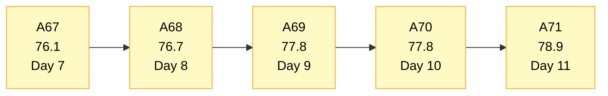
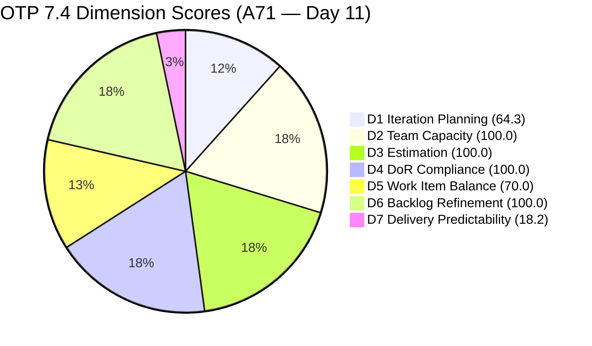
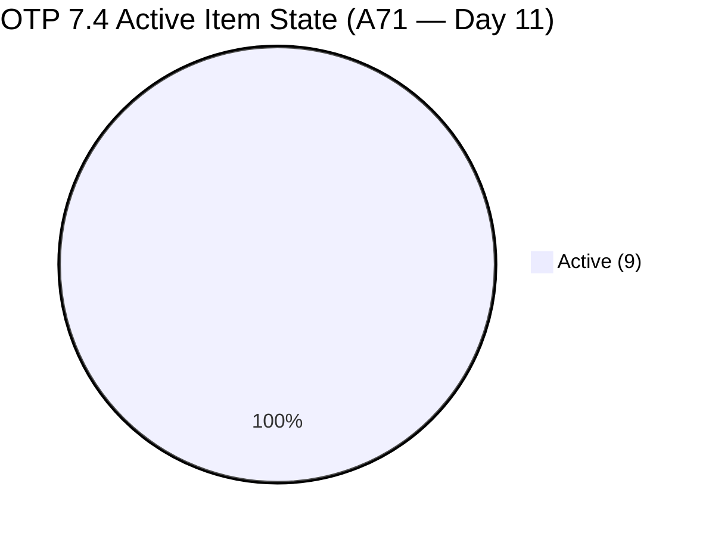
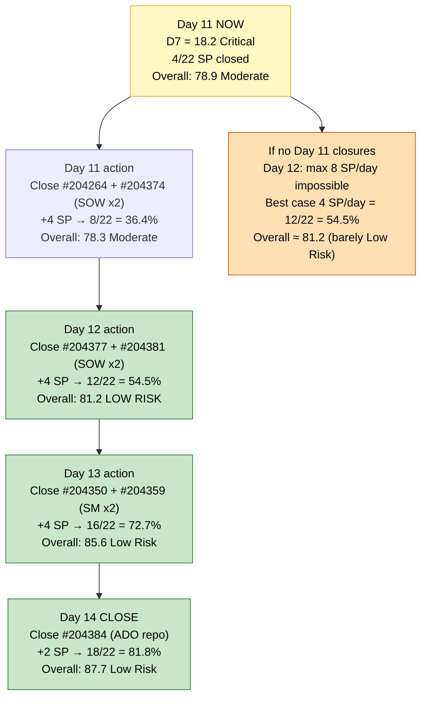
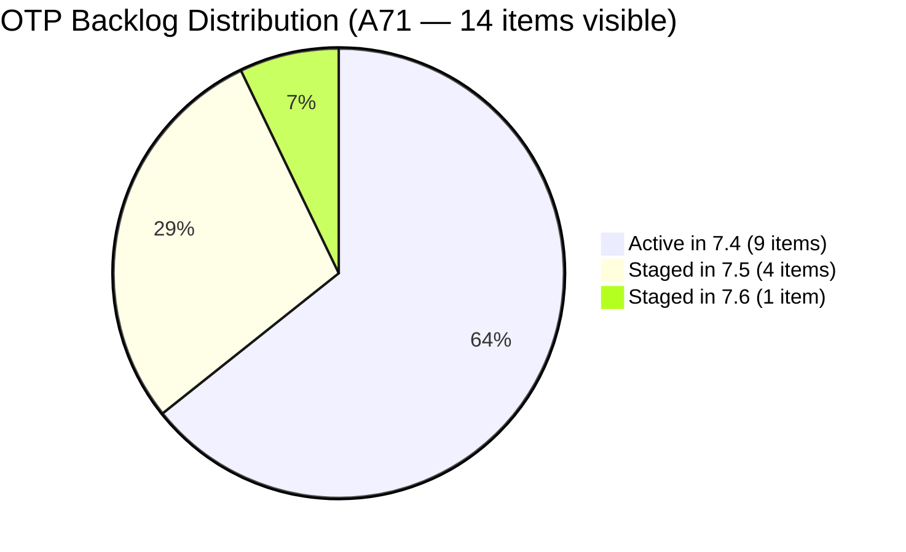

# OTP Team — SAFe Iteration Audit A71
**Date:** 2026-05-28 | **Sprint Day:** 11 of 14 — SPRINT ACTIVE | **Iteration:** 7.4 (May 18 – May 31, 2026)
**Auditor:** Claude Code (ADO SAFe Audit Skill v1) | **Prior Audit:** A70 (2026-05-27 09:03)

---

## 1. Audit Metadata

| Field | Value |
|---|---|
| **Audit ID** | A71 |
| **Report File** | `AUDIT_20260528_0905.md` |
| **Prior Audit** | A70 — `AUDIT_20260527_0903.md` (Overall 77.8, Moderate Risk — 7.4 Day 10) |
| **ADO Project** | OTP (`e7739905-28a3-4ae1-9173-7f6cd13b3494`) |
| **ADO Team** | OTP Team (`64de61f0-1203-4b01-aee2-6b4415aec52b`) |
| **Iteration** | 7.4 (`72b2008d-7779-4d11-8356-c744f5a69a87`) |
| **Iteration Dates** | May 18 – May 31, 2026 |
| **Sprint Day** | **11 of 14 — SPRINT ACTIVE** |
| **Audit Date** | 2026-05-28 09:05 UTC |
| **Overall Score** | **78.9 — Moderate Risk** |
| **Risk Band** | Moderate (60–79.9) |
| **Visible Backlog Items** | 14 root items (unchanged from A70) |
| **Current Iteration Root Items** | 9 (IterationPath = 7.4, from backlog — Active items only) |
| **Capacity Source** | `work_get_iteration_capacities` — OTP Team: 1.0h/day total |
| **Project Exceptions Applied** | Single-assignee model (Grace) — accepted per `CLAUDE.md` |

---

## 2. Executive Summary

| Field | Value |
|---|---|
| **Overall Score** | **78.9 — Moderate Risk** |
| **Score vs Prior (A70)** | 77.8 → 78.9 (**+1.1**) |
| **Sprint Day** | **11 of 14 — SPRINT ACTIVE** |
| **Iteration** | 7.4 (May 18 – May 31, 2026) |
| **Items in 7.4 (backlog)** | 9 Active items |
| **Committed SP** | 22 SP (9 Active × 2 + #204117 closed 2 + #204354 closed 2) |
| **SP Closed** | **4 SP — #204117 (2 SP, May 25) + #204354 (2 SP, May 24)** |
| **Risk Band** | Moderate (60–79.9) |

**Day 11 brings a key correction: #204354 "Formulate the Training Roadmap" (Enabler, 2 SP) is confirmed Closed as of May 24, 2026.** Prior audits A69–A70 recorded this item as "deleted," but the ADO API confirms it was closed (rev 5, State=Closed, ChangedDate=2026-05-24T14:11:33Z). This adds 2 SP to the closed tally, bringing total delivered to 4 SP and revising committed upward to 22 SP (the item was in the iteration but not in A70's backlog count since it was already closed).

D7 recalculates to 4/22 = 18.2% (vs A70's 10.0% based on 2/20). This is a structural correction, not a new delivery event. No new closures have been detected on Day 11 — the 9 Active items remain unchanged.

With **3 days remaining** (Days 12–14), 18 SP are open. To reach Low Risk (Overall ≥80), D7 needs to reach approximately 57% (12.5 SP closed of 22), requiring closing at least 8 more SP. The SOW execution chain (#204264, #204374, #204377, #204381, #204384) remains the highest-priority target.

---

## 3. Previous Audit Delta (A70 → A71)

| Dimension | A70 Score | A71 Score | Delta | Driver |
|---|---|---|---|---|
| D1 Iteration Planning | 64.3 | 64.3 | 0.0 | No change — backlog 14, Active 9 in 7.4; ratio unchanged |
| D2 Team Capacity | 100.0 | 100.0 | 0.0 | Grace capacity 1.0h/day — unchanged |
| D3 Estimation | 100.0 | 100.0 | 0.0 | All 9 Active current items at 2 SP — unchanged |
| D4 DoR Compliance | 100.0 | 100.0 | 0.0 | All 9 Active items verified — unchanged |
| D5 Work Item Balance | 70.0 | 70.0 | 0.0 | US dominance 88.9%; −30 penalty — structural |
| D6 Backlog Refinement | 100.0 | 100.0 | 0.0 | All 14 items fresh — unchanged |
| D7 Delivery Predictability | 10.0 | 18.2 | **+8.2** | Correction: #204354 confirmed Closed May 24 (2 SP). Committed revised to 22 SP; closed = 4 SP → 4/22 = 18.2 |
| **Overall** | **77.8** | **78.9** | **+1.1** | D7 correction (+8.2 raw): #204354 confirmed Closed. Committed base expands 20→22 SP; net improvement |

**Key changes A70 → A71:**
- **CORRECTION APPLIED:** #204354 "Formulate the Training Roadmap" — confirmed Closed (State=Closed, ChangedDate=2026-05-24T14:11:33Z). Prior audits recorded as "deleted" in error. This item is in the 7.4 iteration (confirmed via `wit_get_work_items_for_iteration`) with 2 SP. Committed SP revised from 20 to 22; closed SP revised from 2 to 4.
- **No new closures on Day 11.** All 9 Active backlog items in 7.4 remain Active (unchanged ChangedDates from A70).
- No new items added to sprint.

---

## 4. Current Iteration Snapshot

### Active Items in 7.4 (9 items — from backlog)

| # | Title | Type | State | SP | Assignee | Last Changed |
|---|---|---|---|---|---|---|
| #204122 | FTC Status of renewal | User Story | Active | 2 | Grace | May 19 |
| #204264 | Secure SOWs for Enterprise Accounts (Prife LLC) | User Story | Active | 2 | Grace | May 20 |
| #204350 | 1S: Define SM Career Paths & Tooling | Enabler | Active | 2 | Grace | May 20 |
| #204359 | Finalize and Issue the Memorandum | User Story | Active | 2 | Grace | May 25 |
| #204374 | Secure SOWs for Enterprise Accounts (AutoAllies) | User Story | Active | 2 | Grace | May 19 |
| #204377 | Secure SOWs for Commercial Accounts (Lifestyle) | User Story | Active | 2 | Grace | May 20 |
| #204381 | Secure SOWs for Commercial Accounts (JESI) | User Story | Active | 2 | Grace | May 19 |
| #204384 | ADO Contract Repository & Billing Alignment | User Story | Active | 2 | Grace | May 25 |
| #204821 | FTC Akira | User Story | Active | 2 | Grace | May 25 |

**Total Active: 9 items | 18 SP remaining open**

### Closed Items in 7.4 (2 items — confirmed this sprint)

| # | Title | Type | SP | Assignee | Closed Date |
|---|---|---|---|---|---|
| #204117 | Tarpaulin Printing for JIT and Jairosoft signage | User Story | 2 | Grace | May 25 (confirmed A69) |
| #204354 | Formulate the Training Roadmap | Enabler | 2 | Grace | May 24 (confirmed A71 — prior audits misidentified as "deleted") |

**Total Closed: 2 items | 4 SP closed | 4/22 = 18.2% delivery**

### Non-current Backlog Items (5 items)

| # | Title | Iteration | State | Changed |
|---|---|---|---|---|
| #202912 | Fabrication of Signage | 7.5 | New | May 21 |
| #202913 | Installation of Street Signage | 7.5 | Active | May 21 |
| #203864 | Release and Collect of TCT | 7.6 | New | May 21 |
| #204193 | Philgeps Document Consolidation | 7.5 | New | May 21 |
| #204194 | Philgeps Online Submission | 7.5 | New | May 21 |

---

## 5. Work Item Analysis

### Type Distribution (9 Active current items)

| Type | Count | Share |
|---|---|---|
| User Story | 8 | 88.9% |
| Enabler | 1 | 11.1% |
| **Total** | **9** | **100%** |

User Story share at 88.9% continues to trigger the D5 −30 penalty. This is a structural feature of OTP's business backlog. No in-sprint fix is feasible on Day 11.

### State Distribution (9 Active current items)

| State | Count | Items |
|---|---|---|
| Active | 9 | All 9 items |

All 9 items remain Active. No state transitions detected on Day 11.

### Sprint Focus Tracks

| Track | Items | Open SP | Status |
|---|---|---|---|
| SOW / Contract Execution | #204264, #204374, #204377, #204381, #204384 | 10 SP | 5 Active — highest-priority closure targets |
| SM Career Path / Memorandum | #204350, #204359 | 4 SP | Both Active; #204354 (Story 2) confirmed Closed May 24 — unblocks #204359 |
| Compliance / FTC | #204122, #204821 | 4 SP | Both Active |

### Critical Update: #204354 Closure Unblocks #204359

**#204359 "Finalize and Issue the Memorandum"** has AC that reads: *"Given Stories 1 and 2 are completed and approved by leadership."* Story 2 is now confirmed Closed (#204354, May 24). This removes the blocker identified in A69–A70's R3. The remaining prerequisite is #204350 (Story 1, Define SM Career Paths & Tooling — still Active). Once #204350 closes, #204359 becomes immediately actionable.

### Delivery Urgency — Days 11–14 (3 days remaining)

| Target Closures | SP Closed | D7 | Overall | Band |
|---|---|---|---|---|
| No additional (current state) | 4/22 | 18.2 | 74.3 | Moderate |
| Close 2 SOW items (4 SP) | 8/22 | 36.4 | 78.3 | Moderate |
| Close 4 SOW items (8 SP) | 12/22 | 54.5 | 81.2 | Low Risk |
| Close 4 SOW + #204350 (10 SP) | 14/22 | 63.6 | 82.7 | Low Risk |
| Close all SOW + #204384 + #204350 + #204359 (14 SP) | 18/22 | 81.8 | 87.7 | Low Risk |

Closing 4 SOW stories (8 SP) is the minimum threshold for Low Risk overall. This requires 2–3 closures per day across Days 11–13.

---

## 6. SAFe Compliance Scorecard

| Dimension | Score | Band | Evidence | Notes |
|---|---|---|---|---|
| D1 Iteration Planning | **64.3** | Moderate | 9 / 14 visible | Unchanged — 5 non-current items staged in 7.5/7.6 |
| D2 Team Capacity | **100.0** | Low | 1/1 contributor with capacity | Grace: 1.0h/day (confirmed via iteration capacity API) |
| D3 Estimation | **100.0** | Low | 9/9 current Active items with SP > 0 | All 9 Active items at 2 SP each |
| D4 DoR Compliance | **100.0** | Low | 9/9 Active items pass | All items: Desc ≥30 and AC ≥20 non-whitespace chars |
| D5 Work Item Balance | **70.0** | Moderate | US 88.9% > 60% threshold | −30 penalty applied; Enabler = 1 (11.1%); Spike = 0 |
| D6 Backlog Refinement | **100.0** | Low | 14/14 fresh; 0 stale_90; 0 untouched | All 14 items changed ≥ May 19; no stale or untouched items |
| D7 Delivery Predictability | **18.2** | Critical | 4/22 SP closed | +8.2 correction: #204354 confirmed Closed May 24 (+2 SP). Still Critical band. |
| **OVERALL** | **78.9** | **Moderate** | (64.3+100+100+100+70+100+18.2)/7 | +1.1 from A70; #204354 correction adds 2 SP closed |

**Formula verification:** (64.3 + 100.0 + 100.0 + 100.0 + 70.0 + 100.0 + 18.2) / 7 = 552.5 / 7 = **78.9**

| Dimension | Score |
|---|---|
| D1 | 64.3 |
| D2 | 100.0 |
| D3 | 100.0 |
| D4 | 100.0 |
| D5 | 70.0 |
| D6 | 100.0 |
| D7 | 18.2 |
| **Sum** | **552.5** |
| **Overall (÷7)** | **78.9** |

---

## 7. Dimension Findings

### D1 — Iteration Planning: 64.3 / 100 — Moderate Risk

**Formula:** 9 / 14 × 100 = **64.3**

| Metric | Value |
|---|---|
| Items in 7.4 (Active, from backlog) | 9 |
| Total visible backlog items | 14 |
| Score | **64.3** |

Stable at 64.3 for the third consecutive day. The 5 non-current items (4 in 7.5, 1 in 7.6) are correctly staged. D1 is structurally fixed for this sprint — planning window for 7.4 is closed. Will reset at 7.5 planning.

---

### D2 — Team Capacity: 100.0 / 100 — Low Risk

**Formula:** 1/1 × 100 = **100.0**

Grace has 1.0h/day configured for Iteration 7.4 (confirmed via `work_get_iteration_capacities`, team ID `64de61f0-1203-4b01-aee2-6b4415aec52b`). Single contributor; 100% coverage. Project Exception for single-assignee model applies and does not affect D2.

---

### D3 — Estimation: 100.0 / 100 — Low Risk

**Formula:** 9/9 × 100 = **100.0**

All 9 Active current-iteration items carry 2 SP each. The closed items (#204117, #204354) were also 2 SP each. 100% estimation maintained.

---

### D4 — DoR Compliance: 100.0 / 100 — Low Risk

**Formula:** 9/9 × 100 = **100.0**

All 9 Active current items individually verified: Description ≥30 non-whitespace chars AND Acceptance Criteria ≥20 non-whitespace chars. OTP has maintained perfect DoR compliance for eight consecutive audits (A63–A71). The closed #204354 also had full DoR (confirmed from API data).

---

### D5 — Work Item Balance: 70.0 / 100 — Moderate Risk

**Formula:** Base 100 − penalties

| Penalty | Trigger | Applied |
|---|---|---|
| −30: dominant_type_share > 60% | US = 88.9% > 60% | Yes |
| −40: no User Story items | US present (8 items) | No |
| −20: spike_share > 40% | Spike = 0% | No |

**Score:** 100 − 30 = **70.0**

Structural. The loss of #204354 (Enabler, closed) leaves only 1 Enabler in the Active pool. For 7.5 planning, Grace should classify at least 2–3 items as Enablers to reduce US share below 60%.

---

### D6 — Backlog Refinement: 100.0 / 100 — Low Risk

**Freshness window:** Items with ChangedDate ≥ Apr 13, 2026 (45 days from May 28)

| Metric | Value |
|---|---|
| Total visible backlog items | 14 |
| Fresh items (ChangedDate ≥ Apr 13) | 14 — oldest: #204122 (May 19) |
| stale_90 items (ChangedDate < Feb 27) | 0 |
| stale_180 items (ChangedDate < Nov 29, 2025) | 0 |
| Untouched current items (ChangedDate < May 18) | 0 — all 9 Active items changed ≥ May 19 |
| Score | **100.0** |

All items remain fresh. Perfect D6 = 100.0 maintained.

---

### D7 — Delivery Predictability: 18.2 / 100 — Critical

**Formula:** 4 / 22 × 100 = **18.2**

| Metric | Value |
|---|---|
| SP closed this sprint | 4 (#204117=2 SP, #204354=2 SP) |
| Total committed SP | 22 (9 Active × 2 + 2 closed items × 2) |
| Score | **18.2** |

> **Day 11 Correction Note:** Prior audits A69–A70 reported #204354 as "deleted." This audit confirms via `wit_get_work_items_batch_by_ids` that #204354 is Closed (State=Closed, rev=5, ChangedDate=2026-05-24T14:11:33Z, SP=2). This item is present in `wit_get_work_items_for_iteration` as a root item. The committed base is correctly 22 SP.
>
> **No new closures detected on Day 11.** The 9 Active items remain in Active state. Comparing ChangedDates: 8 items unchanged since A70 (May 19–25); #204384 unchanged (May 25).
>
> **Day 11 delivery urgency:**
>
> | Day | Remaining | SP Needed for Low Risk | Feasibility at 1h/day |
> |---|---|---|---|
> | Day 11 (today) | 3 days left | 8 more SP (close 4 stories) | 2.7 SP/day required |
> | Day 12 | 2 days left | 8 more SP in 2 days | 4 SP/day — very tight |
> | Day 13 | 1 day left | 8 more SP in 1 day | Exceeds Grace's capacity |
>
> **Today (Day 11) is the last practical day to initiate the SOW execution chain and reach Low Risk.**

---

## 8. Risks and Bottlenecks

| # | Severity | Dimension | Risk | Action |
|---|---|---|---|---|
| R1 | **CRITICAL** | D7 | Day 11: Only 4 SP closed (18.2%) with 3 days remaining. 18 SP open across 9 Active items. At Grace's 1h/day throughput (≈2 SP/day), maximum achievable = 10 more SP → total 14 SP → D7 = 63.6%, Overall ≈ 82.7 (Low Risk). This is achievable only if Grace begins closures today. | Grace: close #204264 (Prife LLC SOW) and #204374 (AutoAllies SOW) today. AdobeSign execution is the action; upload to corporate contract repository is the AC gate. |
| R2 | **CRITICAL** | D7 | If no closures occur today (Day 11), the Day 12 maximum is 8 SP (2 items) = 12 total → D7=54.5, Overall=81.2 (barely Low Risk). Day 13 would be the last chance, but only 1 day remains at that point. Any external dependency (client signatory delay) eliminates Low Risk entirely. | Ramon: confirm with Grace that all SOW counterparties are available and negotiations are complete. Flag any external blockers today. |
| R3 | MODERATE | D7 | #204359 "Finalize and Issue the Memorandum" — now confirmed unblocked. #204354 (Story 2) is Closed. #204350 (Story 1, Define SM Career Paths & Tooling) is still Active. Once #204350 closes, #204359 is immediately actionable. | Grace: close #204350 first (Define SM Career Paths), then immediately close #204359 (Memorandum). Sequential closure = 4 SP for the SM track. |
| R4 | MODERATE | D7 | #204384 "ADO Contract Repository & Billing Alignment" remains blocked by the 4 SOW stories (its AC requires all 4 SOW items executed). Cannot close until #204264, #204374, #204377, #204381 all close. | Sequence: 4 SOW stories → #204384. Full chain = 10 SP → D7 ≈ 63.6. |
| R5 | MODERATE | D5 | US share at 88.9% — structural −30 penalty. With #204354 (Enabler) now closed, only 1 Enabler remains Active. | For 7.5 planning: add at least 3 Enabler-typed items to bring US share below 60%. |
| R6 | LOW | D1 | D1 = 64.3 — will not improve this sprint. | No action needed this sprint; focus on D7. |

---

## 9. Prioritized Recommendations

1. **[CRITICAL — Today Day 11]** Grace: close #204264 (Prife LLC SOW, 2 SP) AND #204374 (AutoAllies SOW, 2 SP) today. AdobeSign + upload is the complete delivery action. 4 new SP → total 8 SP → D7 = 36.4, Overall = 78.3 (still Moderate, but advancing).

2. **[CRITICAL — Day 12]** Grace: close #204377 (Lifestyle SOW, 2 SP) AND #204381 (JESI SOW, 2 SP). After 4 SOW stories = 12 SP total → D7 = 54.5, Overall = 81.2 (Low Risk threshold crossed).

3. **[HIGH — Day 12]** Grace: close #204350 (Define SM Career Paths, 2 SP) to unblock #204359. Then immediately close #204359 (Finalize and Issue the Memorandum, 2 SP). Sequence = 4 SP → total 16 SP → D7 = 72.7, Overall = 85.6 (solid Low Risk).

4. **[HIGH — Day 13]** Grace: close #204384 (ADO Contract Repository, 2 SP) after all 4 SOW stories are closed. This completes the contractual chain. Total 18 SP → D7 = 81.8, Overall = 87.7 (strong Low Risk).

5. **[MODERATE — 7.5 Sprint Planning]** Design 7.5 with Grace's actual throughput: 1h/day × 10 effective days ≈ 10 SP max viable commitment. Current 7.5 backlog (4 items, 8 SP) is correctly sized.

6. **[MODERATE — 7.5 Sprint Planning]** Add at least 3 Enabler items to 7.5 to reduce User Story share below 60% and eliminate the persistent D5 −30 penalty. SM Career Path follow-on and Philgeps compliance items offer natural Enabler candidates.

7. **[STANDING]** Protect D2 (100.0), D3 (100.0), D4 (100.0), D6 (100.0). Do not add unestimated or undescribed items during the final 3 days.

---

## 10. Visualizations

### Score Trend (A67 → A71)

### Dimension Scorecard (A71)

### State Distribution (9 Active current items)

### D7 Recovery Scenarios — Days 11–14 (3 days remaining)

### Backlog Distribution (14 items)

---

## 11. Evidence Gaps and Limitations

| Gap | Impact | Notes |
|---|---|---|
| #204354 misidentified as "deleted" in A69–A70 | D7 scores in A69–A70 understated by 2 SP | Confirmed from `wit_get_work_items_batch_by_ids`: State=Closed, rev=5, ChangedDate=2026-05-24T14:11:33Z. Item is present in `wit_get_work_items_for_iteration` as a root item (rel=null). Prior audits recorded "deleted" based on absence from backlog API — but the backlog API only shows non-closed items. This audit corrects the record. |
| No new closures detected Day 11 | D7 = 18.2 (Critical) | All 9 Active items have unchanged ChangedDates (May 19–25) confirming no ADO state transitions since A70. |
| Capacity API returns aggregate only | D2 confirmed at 100.0 | `work_get_iteration_capacities` returns 1.0h/day for OTP Team aggregate (team ID `64de61f0-1203-4b01-aee2-6b4415aec52b`). Grace's individual breakdown assumed consistent with prior audits (0.5h Documentation + 0.5h Requirements). |
| SOW external dependency not visible in ADO | D7 risk unquantifiable | AdobeSign signatory availability for Prife LLC, AutoAllies, Lifestyle, JESI cannot be tracked in ADO. External blockers are the primary D7 risk not captured by the scoring formula. |
| #204359 unblocked but #204350 still Active | D7 partially addressable | The SM track (4 SP) is now logically actionable: #204350 → #204359. But #204350's own AC requires completing the "AI vs traditional SM" matrix — this is content work that Grace must complete independently. |

---

## 12. Audit Trail

| Source | Tool Used | Data Retrieved |
|---|---|---|
| Current iteration | `work_list_team_iterations` (project `e7739905-28a3-4ae1-9173-7f6cd13b3494`, team `OTP Team`, timeframe=current) | Iteration 7.4: May 18–31, ID `72b2008d-7779-4d11-8356-c744f5a69a87` |
| Backlog items | `wit_list_backlog_work_items` (backlogId `Microsoft.RequirementCategory`) | 14 root items (9 in 7.4 Active, 4 in 7.5, 1 in 7.6) |
| Iteration items | `wit_get_work_items_for_iteration` (iterationId `72b2008d-7779-4d11-8356-c744f5a69a87`) | 11 root items including #204117 (Closed) and #204354 (Closed, corrected from "deleted") |
| Work item details | `wit_get_work_items_batch_by_ids` (16 items) | SP, State, Type, Desc, AC, ChangedDate, IterationPath confirmed for all 16 items |
| Team capacity | `work_get_iteration_capacities` (project `e7739905-28a3-4ae1-9173-7f6cd13b3494`, iterationId `72b2008d-7779-4d11-8356-c744f5a69a87`) | OTP Team (64de61f0): 1.0h/day total |
| Prior audit | `AUDIT_20260527_0903.md` (A70) | Overall 77.8, Moderate Risk, 9 Active items, 20 SP committed (revised to 22), 2 SP closed (revised to 4) |
