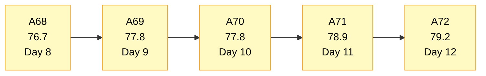
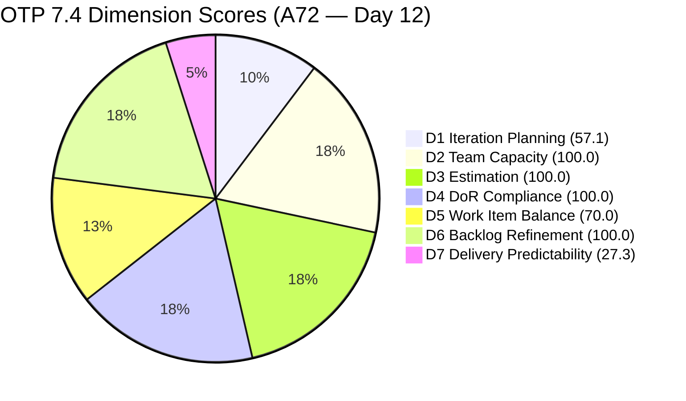
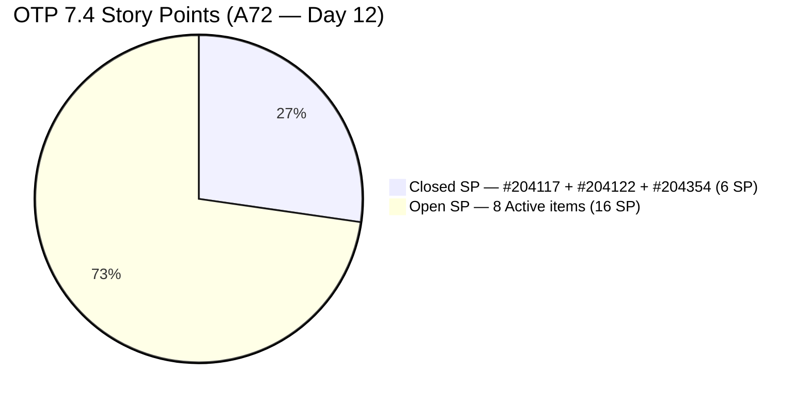
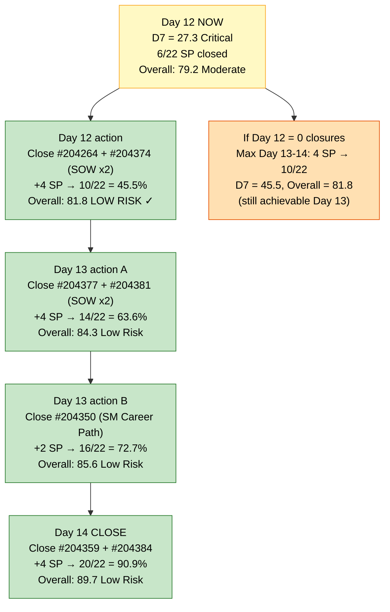
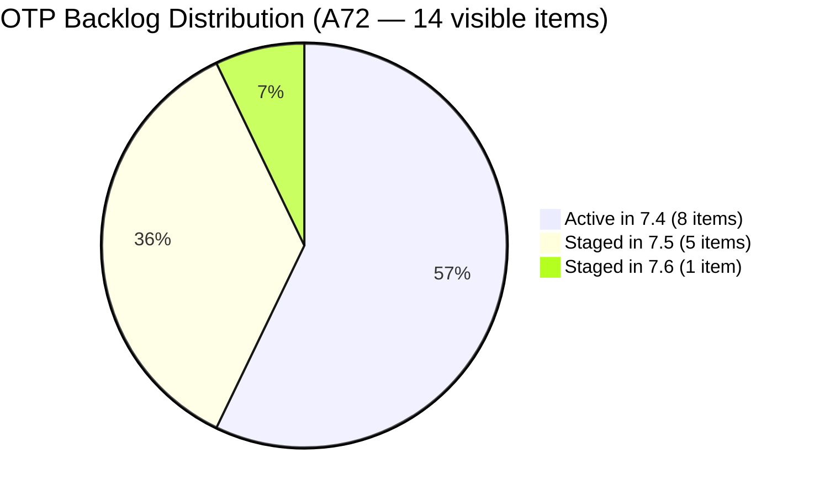

# OTP Team — SAFe Iteration Audit A72
**Date:** 2026-05-29 | **Sprint Day:** 12 of 14 — SPRINT ACTIVE | **Iteration:** 7.4 (May 18 – May 31, 2026)
**Auditor:** Claude Code (ADO SAFe Audit Skill v1) | **Prior Audit:** A71 (2026-05-28 09:05)

---

## 1. Audit Metadata

| Field | Value |
|---|---|
| **Audit ID** | A72 |
| **Report File** | `AUDIT_20260529_0900.md` |
| **Prior Audit** | A71 — `AUDIT_20260528_0905.md` (Overall 78.9, Moderate Risk — 7.4 Day 11) |
| **ADO Project** | OTP (`e7739905-28a3-4ae1-9173-7f6cd13b3494`) |
| **ADO Team** | OTP Team (`64de61f0-1203-4b01-aee2-6b4415aec52b`) |
| **Iteration** | 7.4 (`72b2008d-7779-4d11-8356-c744f5a69a87`) |
| **Iteration Dates** | May 18 – May 31, 2026 |
| **Sprint Day** | **12 of 14 — SPRINT ACTIVE** |
| **Audit Date** | 2026-05-29 09:00 UTC |
| **Overall Score** | **79.2 — Moderate Risk** |
| **Risk Band** | Moderate (60–79.9) |
| **Visible Backlog Items** | 13 open root items in backlog (14 total from prior audit minus #204122 now closed) |
| **Current Iteration Root Items** | 8 open (IterationPath = 7.4 from backlog); 11 total including 3 closed |
| **Capacity Source** | `work_get_iteration_capacities` — OTP Team: 1.0h/day total |
| **Project Exceptions Applied** | Single-assignee model (Grace) — accepted per `CLAUDE.md` |

> **Note on visible_root_backlog_items:** The backlog API returned 14 items today. Cross-checking against A71's 14 items: #204122 "FTC Status of renewal" is now Closed and has been removed from the open backlog — however, the API still returned 14 items because #205163 "Business Requirements & Workflow Mapping" (Spike, 7.5) was newly added since A71. Net visible backlog remains 14.

---

## 2. Executive Summary

| Field | Value |
|---|---|
| **Overall Score** | **79.2 — Moderate Risk** |
| **Score vs Prior (A71)** | 78.9 → 79.2 (**+0.3**) |
| **Sprint Day** | **12 of 14 — SPRINT ACTIVE** |
| **Iteration** | 7.4 (May 18 – May 31, 2026) |
| **Open Items in 7.4 (backlog)** | 8 Active items |
| **Committed SP** | 22 SP (11 root × 2 SP) |
| **SP Closed** | **6 SP — #204117 (2 SP, May 25), #204122 (2 SP, May 28), #204354 (2 SP, May 24)** |
| **Risk Band** | Moderate (60–79.9) |

**Day 12 headline: #204122 "FTC Status of renewal" (User Story, 2 SP) was closed on May 28, 2026 at 23:10 UTC.** This is the only new delivery event since A71 (+2 SP). Closed SP rises from 4 to 6; D7 improves from 18.2 to 27.3. The overall score advances from 78.9 to 79.2 (+0.3).

D1 dips from 64.3 to 57.1 as a formula artifact: #204122 closed and dropped from the open backlog, reducing the current-iteration numerator from 9 to 8 while visible backlog holds at 14 (a new Spike #205163 entered 7.5). This is a positive development (work delivered), not a planning regression.

**With 2 days remaining (Days 13–14), 16 SP remain open.** To reach Low Risk (Overall ≥ 80), D7 needs to reach approximately 63.6% (14/22 SP closed), requiring 8 more SP — 4 closures. The SOW execution chain (#204264, #204374, #204377, #204381, #204384) is the highest-priority target at 10 SP.

---

## 3. Previous Audit Delta (A71 → A72)

| Dimension | A71 Score | A72 Score | Delta | Driver |
|---|---|---|---|---|
| D1 Iteration Planning | 64.3 | 57.1 | **-7.2** | #204122 closed → removed from open backlog; numerator drops 9→8; denominator holds at 14 (new #205163 Spike entered 7.5). Artifact of delivery, not planning regression. |
| D2 Team Capacity | 100.0 | 100.0 | 0.0 | Grace capacity 1.0h/day — unchanged |
| D3 Estimation | 100.0 | 100.0 | 0.0 | All 8 open current items at 2 SP — unchanged |
| D4 DoR Compliance | 100.0 | 100.0 | 0.0 | All 8 open current items verified — unchanged |
| D5 Work Item Balance | 70.0 | 70.0 | 0.0 | US dominance 87.5% (7/8); −30 penalty — structural |
| D6 Backlog Refinement | 100.0 | 100.0 | 0.0 | All 14 items fresh; no stale or untouched — unchanged |
| D7 Delivery Predictability | 18.2 | 27.3 | **+9.1** | #204122 confirmed Closed May 28 (+2 SP). Committed = 22 SP; closed = 6/22 = 27.3 |
| **Overall** | **78.9** | **79.2** | **+0.3** | D7 gain (+9.1) partially offset by D1 drop (−7.2); net +0.3 |

**Key changes A71 → A72:**
- **NEW CLOSURE:** #204122 "FTC Status of renewal" — Closed (State=Closed, ChangedDate=2026-05-28T23:10:42Z, SP=2). This is the Day 11 delivery Grace executed as recommended in A71 R1.
- **D1 drop is a formula artifact** — #204122 closed and left the open backlog; simultaneous entry of #205163 (new Spike in 7.5) holds visible total at 14 but 7.4 open items fall from 9 to 8.
- No new items added to 7.4. No other state transitions detected.

---

## 4. Current Iteration Snapshot

### Open Items in 7.4 (8 items — from open backlog)

| # | Title | Type | State | SP | Assignee | Last Changed |
|---|---|---|---|---|---|---|
| #204264 | Secure SOWs for Enterprise Accounts (Prife LLC) | User Story | Active | 2 | Grace | May 20 |
| #204350 | 1S: Define SM Career Paths & Tooling | Enabler | Active | 2 | Grace | May 20 |
| #204359 | Finalize and Issue the Memorandum | User Story | Active | 2 | Grace | May 25 |
| #204374 | Secure SOWs for Enterprise Accounts (AutoAllies) | User Story | Active | 2 | Grace | May 19 |
| #204377 | Secure SOWs for Commercial Accounts (Lifestyle) | User Story | Active | 2 | Grace | May 20 |
| #204381 | Secure SOWs for Commercial Accounts (JESI) | User Story | Active | 2 | Grace | May 19 |
| #204384 | ADO Contract Repository & Billing Alignment | User Story | Active | 2 | Grace | May 25 |
| #204821 | FTC Akira | User Story | Active | 2 | Grace | May 25 |

**Total Open: 8 items | 16 SP remaining**

### Closed Items in 7.4 (3 items — confirmed this sprint)

| # | Title | Type | SP | Assignee | Closed Date |
|---|---|---|---|---|---|
| #204117 | Tarpaulin Printing for JIT and Jairosoft signage | User Story | 2 | Grace | May 25 (confirmed A69) |
| #204122 | FTC Status of renewal | User Story | 2 | Grace | **May 28 — NEW in A72** |
| #204354 | Formulate the Training Roadmap | Enabler | 2 | Grace | May 24 (confirmed A71) |

**Total Closed: 3 items | 6 SP closed | 6/22 = 27.3% delivery**

### Non-current Backlog Items (6 items — IterationPath ≠ 7.4)

| # | Title | Iteration | Type | State | Changed |
|---|---|---|---|---|---|
| #202912 | Fabrication of Signage | 7.5 | User Story | New | May 21 |
| #202913 | Installation of Street Signage | 7.5 | User Story | Active | May 21 |
| #203864 | Release and Collect of TCT | 7.6 | User Story | New | May 21 |
| #204193 | Philgeps Document Consolidation | 7.5 | User Story | New | May 21 |
| #204194 | Philgeps Online Submission | 7.5 | User Story | New | May 21 |
| #205163 | Business Requirements & Workflow Mapping | 7.5 | Spike | New | May 28 |

---

## 5. Work Item Analysis

### Type Distribution (8 open current items)

| Type | Count | Share |
|---|---|---|
| User Story | 7 | 87.5% |
| Enabler | 1 | 12.5% |
| **Total** | **8** | **100%** |

User Story share at 87.5% continues to trigger the D5 −30 penalty. With #204354 (Enabler) closed, only #204350 remains as the sole Enabler. Structural for this sprint — no fix feasible in Days 12–14.

### State Distribution (8 open current items)

| State | Count | Items |
|---|---|---|
| Active | 8 | #204264, #204350, #204359, #204374, #204377, #204381, #204384, #204821 |

All 8 open items remain Active. #204122 transitioned Active → Closed on May 28.

### Sprint Focus Tracks

| Track | Items | Open SP | Status |
|---|---|---|---|
| SOW / Contract Execution | #204264, #204374, #204377, #204381, #204384 | 10 SP | 5 Active — primary closure target for Days 12–13 |
| SM Career Path / Memorandum | #204350, #204359 | 4 SP | #204350 Active (unblocks #204359); sequential = 4 SP |
| Compliance / FTC | #204821 | 2 SP | #204122 Closed (Day 11 delivery) — #204821 remains Active |

### D7 Recovery Scenarios — Days 12–14 (2 days remaining)

| Scenario | SP Closed | D7 | Overall | Band |
|---|---|---|---|---|
| No additional (current state) | 6/22 | 27.3 | 79.2 | Moderate |
| Close 2 SOW items (+4 SP) | 10/22 | 45.5 | 81.8 | **Low Risk** |
| Close 4 SOW items (+8 SP) | 14/22 | 63.6 | 84.3 | Low Risk |
| Close 4 SOW + #204350 (+10 SP) | 16/22 | 72.7 | 85.6 | Low Risk |
| Close 4 SOW + #204350 + #204359 + #204384 (+14 SP) | 20/22 | 90.9 | 89.7 | Low Risk |

**Closing just 2 SOW items (4 SP) on Day 12 crosses the Low Risk threshold** — Overall reaches 81.8.

---

## 6. SAFe Compliance Scorecard

| Dimension | Score | Band | Evidence | Notes |
|---|---|---|---|---|
| D1 Iteration Planning | **57.1** | High | 8 / 14 open backlog | Down from 64.3 — #204122 closed; new #205163 Spike entered 7.5. Formula artifact of delivery. |
| D2 Team Capacity | **100.0** | Low | 1/1 contributor with capacity | Grace: 1.0h/day (confirmed via capacity API) |
| D3 Estimation | **100.0** | Low | 8/8 open current items with SP > 0 | All 8 open Active items at 2 SP each |
| D4 DoR Compliance | **100.0** | Low | 8/8 open current items pass | All items: Desc ≥30 and AC ≥20 non-whitespace chars |
| D5 Work Item Balance | **70.0** | Moderate | US 87.5% > 60% threshold | −30 penalty; Enabler = 1 (12.5%); Spike = 0 in current iteration |
| D6 Backlog Refinement | **100.0** | Low | 14/14 fresh; 0 stale_90; 0 untouched | All 14 items changed ≥ May 19; no stale or untouched |
| D7 Delivery Predictability | **27.3** | Critical | 6/22 SP closed | +2 SP from #204122 closure May 28. committed=22, closed=6. |
| **OVERALL** | **79.2** | **Moderate** | (57.1+100+100+100+70+100+27.3)/7 | +0.3 from A71; D7 +9.1 partially offset by D1 −7.2 |

**Formula verification:** (57.1 + 100.0 + 100.0 + 100.0 + 70.0 + 100.0 + 27.3) / 7 = 554.4 / 7 = **79.2**

---

## 7. Dimension Findings

### D1 — Iteration Planning: 57.1 / 100 — High Risk

**Formula:** 8 / 14 × 100 = **57.1**

| Metric | Value |
|---|---|
| Open items in 7.4 (from backlog) | 8 |
| Total visible backlog items | 14 |
| Score | **57.1** |

D1 dropped from 64.3 to 57.1 this audit. This is entirely a formula artifact of delivery: #204122 was closed and is no longer in the open backlog (reducing the numerator from 9 to 8), while a new Spike (#205163) entered the 7.5 backlog (holding the denominator at 14). The planning window for 7.4 is closed — this reflects work completed, not a planning failure. D1 will reset at 7.5 sprint planning.

---

### D2 — Team Capacity: 100.0 / 100 — Low Risk

**Formula:** 1/1 × 100 = **100.0**

Grace has 1.0h/day configured for Iteration 7.4 (confirmed via `work_get_iteration_capacities`). Single contributor; 100% coverage. Project Exception for single-assignee model is applied and does not affect D2.

---

### D3 — Estimation: 100.0 / 100 — Low Risk

**Formula:** 8/8 × 100 = **100.0**

All 8 open Active current-iteration items carry 2 SP each. All 3 closed items also carried 2 SP. 100% estimation maintained for the ninth consecutive audit (A63–A72).

---

### D4 — DoR Compliance: 100.0 / 100 — Low Risk

**Formula:** 8/8 × 100 = **100.0**

All 8 open Active current items individually verified: Description ≥30 non-whitespace chars AND Acceptance Criteria ≥20 non-whitespace chars. OTP has maintained perfect DoR compliance for nine consecutive audits (A63–A72). #204122, now closed, also had full DoR when active.

---

### D5 — Work Item Balance: 70.0 / 100 — Moderate Risk

**Formula:** Base 100 − penalties

| Penalty | Trigger | Applied |
|---|---|---|
| −30: dominant_type_share > 60% | US = 87.5% > 60% | Yes |
| −40: no User Story items | US present (7 items) | No |
| −20: spike_share > 40% | Spike = 0% in current 7.4 items | No |

**Score:** 100 − 30 = **70.0**

Structural. With #204354 (Enabler) closed, only #204350 remains as the sole non-US item in the Active pool. For 7.5 planning, Grace should target at least 3 Enabler-typed items to reduce US share below 60%.

---

### D6 — Backlog Refinement: 100.0 / 100 — Low Risk

**Freshness window:** Items with ChangedDate ≥ 2026-04-14 (45 days before 2026-05-29)

| Metric | Value |
|---|---|
| Total visible backlog items | 14 |
| Fresh items (ChangedDate ≥ Apr 14) | 14 — oldest: #204374 and #204381 (May 19) |
| stale_90 items (ChangedDate < 2026-02-28) | 0 |
| stale_180 items (ChangedDate < 2025-11-30) | 0 |
| Untouched current items (ChangedDate < May 18 start) | 0 — all 8 open items changed ≥ May 19 |
| Score | **100.0** |

All items remain fresh. Perfect D6 = 100.0 maintained.

---

### D7 — Delivery Predictability: 27.3 / 100 — Critical

**Formula:** 6 / 22 × 100 = **27.3**

| Metric | Value |
|---|---|
| SP closed this sprint | 6 (#204117=2 SP, #204122=2 SP, #204354=2 SP) |
| Total committed SP | 22 (11 root items in 7.4 × 2 SP each) |
| Score | **27.3** |

> **New closure confirmed:** #204122 "FTC Status of renewal" (User Story, 2 SP) — Closed May 28, 2026 at 23:10:42 UTC. This is the Day 11 delivery recommended in A71 R1 (FTC Compliance track). ChangedDate confirms the state transition happened Day 11.
>
> **Day 12 status (today):** All 8 remaining Active items have unchanged ChangedDates (May 19–25) as of the time of this audit. No new closures have been detected today.
>
> **Committed SP check:** 11 root items in 7.4 (from `wit_get_work_items_for_iteration`) × 2 SP = 22 SP. Consistent with A71 committed base of 22 SP. No items added or removed from the iteration.
>
> **Day 12–14 urgency:**
>
> | Day | Action | Target SP Closed | D7 | Overall |
> |---|---|---|---|---|
> | Day 12 (today) | Close 2 SOW items (#204264 + #204374) | 10/22 | 45.5 | 81.8 (**Low Risk**) |
> | Day 13 | Close 2 more SOW items (#204377 + #204381) | 14/22 | 63.6 | 84.3 |
> | Day 13 | Also close #204350 (unblocks #204359) | 16/22 | 72.7 | 85.6 |
> | Day 14 | Close #204359 + #204384 | 20/22 | 90.9 | 89.7 |
>
> **Today (Day 12) is the critical day.** Closing 2 SOW items crosses the Low Risk threshold.

---

## 8. Risks and Bottlenecks

| # | Severity | Dimension | Risk | Action |
|---|---|---|---|---|
| R1 | **CRITICAL** | D7 | Day 12: Only 6 SP closed (27.3%) with 2 days remaining. 16 SP open. At Grace's 1h/day (≈2 SP/day), theoretical max = 4 more SP in 2 days → total 10 SP → D7 = 45.5, Overall = 81.8 (Low Risk). This is achievable but requires 2 SOW closures today (Day 12). Any miss today makes Low Risk impossible. | Grace: execute #204264 (Prife LLC SOW) AND #204374 (AutoAllies SOW) today. AdobeSign + upload to corporate repository is the completion AC. These two closures alone cross the Low Risk line. |
| R2 | **CRITICAL** | D7 | SOW dependency chain: #204384 "ADO Contract Repository & Billing Alignment" cannot close until #204264, #204374, #204377, #204381 are all closed (explicit AC dependency). This means #204384 is Day 14 at earliest. | Sequence strictly: 4 SOW stories → #204384. Do NOT attempt #204384 first. |
| R3 | HIGH | D7 | #204821 "FTC Akira" is an external dependency on Akira's signature/availability. Cannot be forced to close by Grace alone. If signature is pending, this item risks carrying over. | Ramon: escalate to Akira today (Day 12). If no response, flag for carry-over to 7.5. Do not let this block the SOW track. |
| R4 | MODERATE | D7 | #204359 "Finalize and Issue the Memorandum" — prerequisite #204350 (1S: Define SM Career Paths) still Active. Must close #204350 first. | Grace: close #204350 (SM Career Path content work) on Day 13 after SOW items are submitted, then immediately progress #204359. Sequential = 4 SP. |
| R5 | MODERATE | D5 | US share at 87.5% — structural −30 penalty. Only 1 Enabler remains Active. | For 7.5 planning: add at least 3 Enabler items (SM Career Path follow-on, IT infra, DevOps process) to drive US share below 60%. |
| R6 | LOW | D1 | D1 = 57.1 — formula artifact of closures. Will not improve this sprint. The drop signals delivery progress, not planning failure. | No action needed this sprint. Reset at 7.5 planning. Ensure 7.5 assigns ≥60% of visible backlog to the sprint. |

---

## 9. Prioritized Recommendations

1. **[CRITICAL — Today Day 12]** Grace: close #204264 (Prife LLC SOW, 2 SP) AND #204374 (AutoAllies SOW, 2 SP). AdobeSign counter-signature + upload to corporate contract repository is the complete delivery action. This crosses the Low Risk threshold (Overall 81.8). Do not delay — Day 12 is the last viable day to ensure Low Risk is achievable.

2. **[CRITICAL — Today Day 12]** Ramon: contact Akira immediately re: #204821 (FTC Akira, Japan Letter of Invitation). If signature not received by end of Day 12, flag for carry-over to 7.5. Do not let this dependency stall the SOW track.

3. **[HIGH — Day 13]** Grace: close #204377 (Lifestyle SOW, 2 SP) AND #204381 (JESI SOW, 2 SP). After 4 SOW closures, committed = 14/22 → D7 = 63.6, Overall = 84.3 (solid Low Risk). Then immediately close #204350 (Define SM Career Paths, 2 SP) to unblock #204359.

4. **[HIGH — Day 13]** Grace: close #204350 (SM Career Paths) → then close #204359 (Memorandum, 2 SP). Sequential closure = 4 SP. Only actionable after #204350's AI-tools matrix content is complete. Total after this step = 18/22 → D7 = 81.8, Overall = 87.7.

5. **[HIGH — Day 14]** Grace: close #204384 (ADO Contract Repository, 2 SP) after all 4 SOW stories are confirmed executed. This completes the SOW chain. Maximum achievable = 20/22 → D7 = 90.9, Overall = 89.7.

6. **[MODERATE — 7.5 Sprint Planning]** Design 7.5 with Grace's actual throughput: 1h/day × 10 effective days ≈ 10 SP viable commitment. Current 7.5 backlog (5 open items, 10 SP + 1 Spike) is right-sized but verify Spike #205163 has acceptance criteria before committing.

7. **[MODERATE — 7.5 Sprint Planning]** Add at least 3 Enabler items to 7.5 to drive User Story share below 60% and eliminate the persistent D5 −30 penalty. SM Career Path follow-on work, Philgeps compliance items, and BRD/Spike follow-through (#205163) are natural Enabler candidates.

8. **[STANDING]** Protect D2 (100.0), D3 (100.0), D4 (100.0), D6 (100.0). Do not add unestimated or undescribed items during the final 2 days of the sprint.

---

## 10. Visualizations

### Score Trend (A68 → A72)

### Dimension Scorecard (A72)

### Delivery Progress — Closed vs Open SP

### D7 Recovery Path — Days 12–14

### Backlog Distribution (14 visible items)

---

## 11. Evidence Gaps and Limitations

| Gap | Impact | Notes |
|---|---|---|
| visible_root_backlog_items includes new #205163 | D6 held at 100.0 | #205163 "Business Requirements & Workflow Mapping" (Spike, 7.5) appeared in today's backlog API response. ChangedDate = May 28 — within 45-day freshness window. Does not affect D6 score but does offset the D1 numerator reduction from #204122's closure. |
| Capacity API returns team aggregate only | D2 confirmed at 100.0 | `work_get_iteration_capacities` returns 1.0h/day for OTP Team aggregate. Grace's individual breakdown (0.5h Documentation + 0.5h Requirements) assumed consistent with prior audits. |
| SOW external dependency not visible in ADO | D7 risk unquantifiable | AdobeSign signatory availability for Prife LLC, AutoAllies, Lifestyle, JESI cannot be tracked in ADO. External blockers remain the primary D7 risk unrepresented in scoring. |
| #204821 requires external signature (Akira) | D7 item at risk | ChangedDate = May 25 (5 days ago). No progress detected in ADO. Cannot be forced closed unilaterally. Risk of carry-over to 7.5 if Akira is unresponsive. |
| D7 uses full iteration set (11 root items) vs. open backlog (8 items) | Methodology note | Per rubric and prior-audit consistency (A71), closed 7.4 items (#204117, #204122, #204354) are included in committed/closed SP calculation. The backlog API excludes closed items; `wit_get_work_items_for_iteration` provides the authoritative full set. Committed = 22 SP consistent with A71. |

---

## 12. Audit Trail

| Source | Tool Used | Data Retrieved |
|---|---|---|
| Current iteration | `work_list_team_iterations` (project `e7739905-28a3-4ae1-9173-7f6cd13b3494`, team `64de61f0-1203-4b01-aee2-6b4415aec52b`, timeframe=current) | Iteration 7.4: May 18–31, ID `72b2008d-7779-4d11-8356-c744f5a69a87` |
| Backlog items | `wit_list_backlog_work_items` (backlogId `Microsoft.RequirementCategory`) | 14 open root items (8 in 7.4 Active, 5 in 7.5, 1 in 7.6) |
| Iteration root items | `wit_get_work_items_for_iteration` (iterationId `72b2008d-7779-4d11-8356-c744f5a69a87`) | 11 root items: #204117 (Closed), #204122 (Closed), #204264, #204350, #204354 (Closed), #204359, #204374, #204377, #204381, #204384, #204821 |
| Work item details | `wit_get_work_items_batch_by_ids` (17 items total) | SP, State, Type, Desc, AC, ChangedDate, IterationPath confirmed for all items |
| Team capacity | `work_get_iteration_capacities` (project `e7739905-28a3-4ae1-9173-7f6cd13b3494`, iterationId `72b2008d-7779-4d11-8356-c744f5a69a87`) | OTP Team (64de61f0): 1.0h/day total |
| Prior audit | `AUDIT_20260528_0905.md` (A71) | Overall 78.9, Moderate Risk, 9 open Active items, 22 SP committed, 4 SP closed |
