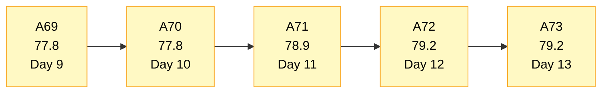
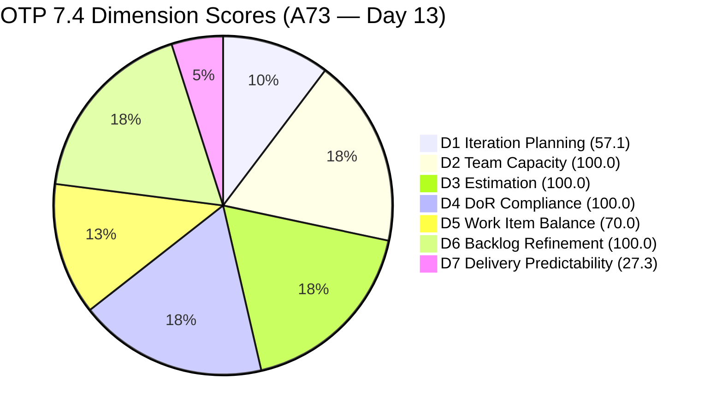
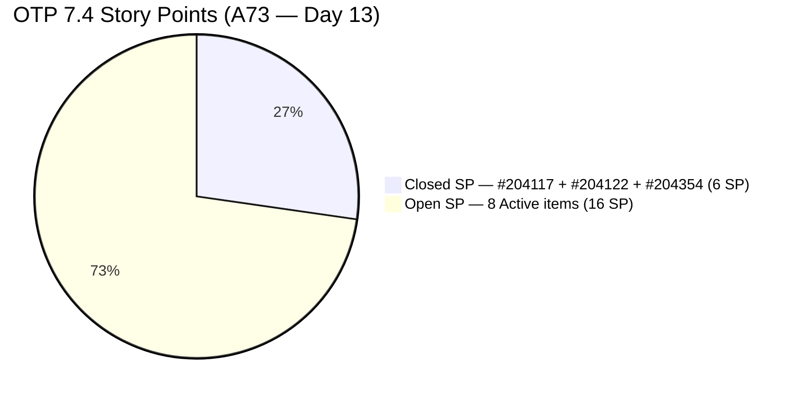
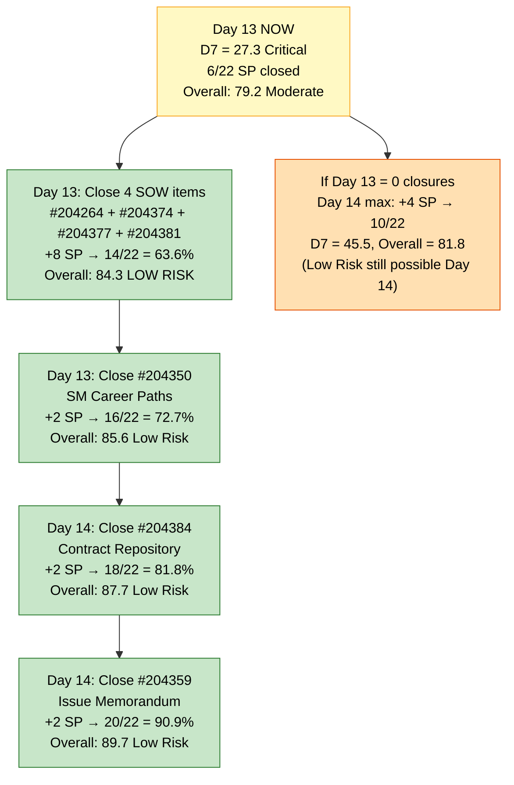
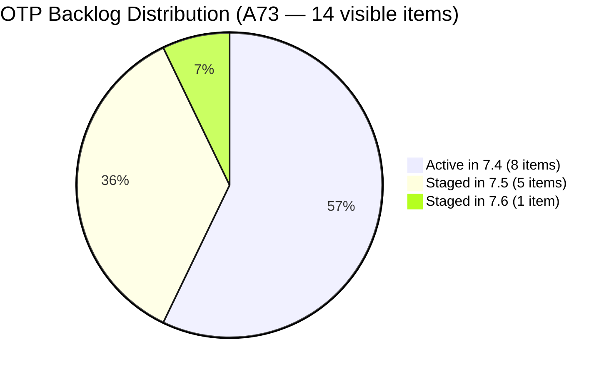

# OTP Team — SAFe Iteration Audit A73
**Date:** 2026-05-30 | **Sprint Day:** 13 of 14 — SPRINT ACTIVE | **Iteration:** 7.4 (May 18 – May 31, 2026)
**Auditor:** Claude Code (ADO SAFe Audit Skill v1) | **Prior Audit:** A72 (2026-05-29 09:00)

---

## 1. Audit Metadata

| Field | Value |
|---|---|
| **Audit ID** | A73 |
| **Report File** | `AUDIT_20260530_0900.md` |
| **Prior Audit** | A72 — `AUDIT_20260529_0900.md` (Overall 79.2, Moderate Risk — 7.4 Day 12) |
| **ADO Project** | OTP (`e7739905-28a3-4ae1-9173-7f6cd13b3494`) |
| **ADO Team** | OTP Team (`64de61f0-1203-4b01-aee2-6b4415aec52b`) |
| **Iteration** | 7.4 (`72b2008d-7779-4d11-8356-c744f5a69a87`) |
| **Iteration Dates** | May 18 – May 31, 2026 |
| **Sprint Day** | **13 of 14 — SPRINT ACTIVE** |
| **Audit Date** | 2026-05-30 09:00 UTC |
| **Overall Score** | **79.2 — Moderate Risk** |
| **Risk Band** | Moderate (60–79.9) |
| **Visible Backlog Items** | 14 open root items |
| **Current Iteration Root Items** | 8 open (IterationPath = 7.4 from backlog) |
| **Capacity Source** | `work_get_iteration_capacities` — OTP Team: 1.0h/day total |
| **Project Exceptions Applied** | Single-assignee model (Grace) — accepted per `CLAUDE.md` |

> **Sprint Day 13 note:** This is the penultimate day of Iteration 7.4. No state changes were detected since A72 (May 29). All 8 Active items remain in the same state. The score holds at 79.2 — the final day (May 31) is the last opportunity to close SP and move the score. Closing 2 SOW items today still achieves Low Risk (Overall 81.8).

---

## 2. Executive Summary

| Field | Value |
|---|---|
| **Overall Score** | **79.2 — Moderate Risk** |
| **Score vs Prior (A72)** | 79.2 → 79.2 (**0.0 — no change**) |
| **Sprint Day** | **13 of 14 — SPRINT ACTIVE** |
| **Iteration** | 7.4 (May 18 – May 31, 2026) |
| **Open Items in 7.4 (backlog)** | 8 Active items |
| **Committed SP** | 22 SP (11 root items × 2 SP) |
| **SP Closed** | **6 SP — #204117 (2 SP), #204122 (2 SP), #204354 (2 SP)** |
| **Risk Band** | Moderate (60–79.9) |

**Day 13 headline: Zero closures detected since A72 (Day 12).** All 8 Active items retain unchanged ChangedDates (May 19–25). The score holds at 79.2 — Moderate Risk. With only 1 day remaining (Day 14, May 31), the sprint closes at End of Day tomorrow.

**Day 13 is now the critical delivery day.** Closing 2 SOW items (+4 SP → 10/22 = 45.5%) elevates Overall to 81.8 (Low Risk). Closing 4 SOW items takes it to 84.3. If Day 13 passes with zero closures, the sprint will end at Moderate Risk with only 6/22 SP delivered (27.3%).

The SOW execution cluster (#204264, #204374, #204377, #204381, #204384) totaling 10 SP remains the highest-leverage target.

---

## 3. Previous Audit Delta (A72 → A73)

| Dimension | A72 Score | A73 Score | Delta | Driver |
|---|---|---|---|---|
| D1 Iteration Planning | 57.1 | 57.1 | 0.0 | 8/14 — no items added or closed |
| D2 Team Capacity | 100.0 | 100.0 | 0.0 | Grace capacity 1.0h/day — unchanged |
| D3 Estimation | 100.0 | 100.0 | 0.0 | All 8 open current items at 2 SP — unchanged |
| D4 DoR Compliance | 100.0 | 100.0 | 0.0 | All 8 open current items verified — unchanged |
| D5 Work Item Balance | 70.0 | 70.0 | 0.0 | US dominance 87.5%; −30 penalty — structural |
| D6 Backlog Refinement | 100.0 | 100.0 | 0.0 | All 14 items fresh; 0 stale; 0 untouched — unchanged |
| D7 Delivery Predictability | 27.3 | 27.3 | 0.0 | No new closures. Committed = 22 SP; closed = 6 SP (27.3%) |
| **Overall** | **79.2** | **79.2** | **0.0** | No state changes detected in 24 hours |

**Key observations A72 → A73:**
- No work item state transitions detected in the 24-hour window between Day 12 and Day 13.
- All 8 open Active items have ChangedDates of May 19–25 — none updated on May 29 or May 30.
- The sprint closes tomorrow (May 31). Today (Day 13) is the last full working day for delivery.

---

## 4. Current Iteration Snapshot

### Open Items in 7.4 (8 items — from open backlog)

| # | Title | Type | State | SP | Assignee | Last Changed | Days Stalled |
|---|---|---|---|---|---|---|---|
| #204264 | Secure SOWs for Enterprise Accounts (Prife LLC) | User Story | Active | 2 | Grace | May 20 | 10 days |
| #204350 | 1S: Define SM Career Paths & Tooling | Enabler | Active | 2 | Grace | May 20 | 10 days |
| #204359 | Finalize and Issue the Memorandum | User Story | Active | 2 | Grace | May 25 | 5 days |
| #204374 | Secure SOWs for Enterprise Accounts (AutoAllies) | User Story | Active | 2 | Grace | May 19 | 11 days |
| #204377 | Secure SOWs for Commercial Accounts (Lifestyle) | User Story | Active | 2 | Grace | May 20 | 10 days |
| #204381 | Secure SOWs for Commercial Accounts (JESI) | User Story | Active | 2 | Grace | May 19 | 11 days |
| #204384 | ADO Contract Repository & Billing Alignment | User Story | Active | 2 | Grace | May 25 | 5 days |
| #204821 | FTC Akira | User Story | Active | 2 | Grace | May 25 | 5 days |

**Total Open: 8 items | 16 SP remaining | Sprint closes tomorrow (May 31)**

### Closed Items in 7.4 (3 items — confirmed this sprint)

| # | Title | Type | SP | Assignee | Closed Date |
|---|---|---|---|---|---|
| #204117 | Tarpaulin Printing for JIT and Jairosoft signage | User Story | 2 | Grace | May 25 |
| #204122 | FTC Status of renewal | User Story | 2 | Grace | May 28 |
| #204354 | Formulate the Training Roadmap | Enabler | 2 | Grace | May 24 |

**Total Closed: 3 items | 6 SP closed | 6/22 = 27.3% delivery**

### Non-current Backlog Items (6 items — IterationPath ≠ 7.4)

| # | Title | Iteration | Type | State | Changed |
|---|---|---|---|---|---|
| #202912 | Fabrication of Signage | 7.5 | User Story | New | May 21 |
| #202913 | Installation of Street Signage | 7.5 | User Story | Active | May 21 |
| #203864 | Release and Collect of TCT | 7.6 | User Story | New | May 21 |
| #204193 | Philgeps Document Consolidation | 7.5 | User Story | New | May 21 |
| #204194 | Philgeps Online Submission | 7.5 | User Story | New | May 21 |
| #205163 | Business Requirements & Workflow Mapping | 7.5 | Spike | New | May 28 |

---

## 5. Work Item Analysis

### Type Distribution (8 open current items)

| Type | Count | Share |
|---|---|---|
| User Story | 7 | 87.5% |
| Enabler | 1 | 12.5% |
| **Total** | **8** | **100%** |

User Story share at 87.5% continues to trigger the D5 −30 penalty. No Spike items in 7.4. Structural for the remaining sprint duration — no fix available before close.

### State Distribution (8 open current items)

| State | Count | Items |
|---|---|---|
| Active | 8 | All 8 remaining open items |

All 8 remain Active with no state changes on Day 13.

### Sprint Focus Tracks — Day 13 Priority Order

| Track | Items | SP | Priority | Notes |
|---|---|---|---|---|
| SOW Execution Chain | #204264, #204374, #204377, #204381 | 8 SP | CRITICAL TODAY | 4 independent SOW closures — no internal dependency; each can close as AdobeSign executes |
| SOW Follow-up | #204384 | 2 SP | HIGH — after SOW chain | Requires #204264 + #204374 + #204377 + #204381 all executed first |
| FTC / Compliance | #204821 | 2 SP | HIGH — external dep | Requires Akira signature; Ramon must escalate now |
| SM Career Path | #204350 | 2 SP | MODERATE | Unblocks #204359; close today to allow Memorandum tomorrow |
| SM Memorandum | #204359 | 2 SP | MODERATE — Day 14 | Requires #204350 closed first |

### D7 Scenarios — Day 13–14 (final sprint days)

| Scenario | Additional SP | SP Closed | D7 | Overall | Band |
|---|---|---|---|---|---|
| No action (current state) | 0 | 6/22 | 27.3 | 79.2 | Moderate |
| Close 2 SOW items (+4 SP) | +4 | 10/22 | 45.5 | 81.8 | **Low Risk** |
| Close 4 SOW items (+8 SP) | +8 | 14/22 | 63.6 | 84.3 | Low Risk |
| Close 4 SOW + #204350 (+10 SP) | +10 | 16/22 | 72.7 | 85.6 | Low Risk |
| Close 4 SOW + #204350 + #204821 (+12 SP) | +12 | 18/22 | 81.8 | 87.7 | Low Risk |
| Close all 5 SOW + #204350 + #204821 (+14 SP) | +14 | 20/22 | 90.9 | 89.7 | Low Risk |

**Day 13 is the last viable delivery day.** Day 14 (May 31) is sprint close — any item not closed by end of May 31 carries over to 7.5.

---

## 6. SAFe Compliance Scorecard

| Dimension | Score | Band | Evidence | Notes |
|---|---|---|---|---|
| D1 Iteration Planning | **57.1** | High | 8 / 14 open backlog | Stable — formula artifact of prior deliveries. 7.4 planning window closed. |
| D2 Team Capacity | **100.0** | Low | 1/1 contributor with capacity | Grace: 1.0h/day (confirmed via capacity API) |
| D3 Estimation | **100.0** | Low | 8/8 open current items with SP > 0 | All 8 open Active items at 2 SP each |
| D4 DoR Compliance | **100.0** | Low | 8/8 open current items pass | All items: Desc ≥30 and AC ≥20 non-whitespace chars verified |
| D5 Work Item Balance | **70.0** | Moderate | US 87.5% > 60% threshold | −30 penalty; structural for sprint end |
| D6 Backlog Refinement | **100.0** | Low | 14/14 fresh; 0 stale_90; 0 untouched | All 14 items changed ≥ Apr 15; no stale or untouched |
| D7 Delivery Predictability | **27.3** | Critical | 6/22 SP closed | No new closures since A72. 16 SP remain open on Day 13. |
| **OVERALL** | **79.2** | **Moderate** | (57.1+100+100+100+70+100+27.3)/7 | Unchanged from A72 — no state transitions in 24-hour window. |

**Formula verification:** (57.1 + 100.0 + 100.0 + 100.0 + 70.0 + 100.0 + 27.3) / 7 = 554.4 / 7 = **79.2**

---

## 7. Dimension Findings

### D1 — Iteration Planning: 57.1 / 100 — High Risk

**Formula:** 8 / 14 × 100 = **57.1**

| Metric | Value |
|---|---|
| Open items in 7.4 (from backlog) | 8 |
| Total visible backlog items | 14 |
| Score | **57.1** |

Stable at 57.1 — unchanged from A72. No new items entered or exited either numerator or denominator in the 24-hour window. D1 is a formula artifact of the sprint's delivery pattern: as closed items leave the active backlog, the numerator shrinks. This is the final sprint day pair — D1 will not recover within this iteration. Reset expected at 7.5 sprint planning.

---

### D2 — Team Capacity: 100.0 / 100 — Low Risk

**Formula:** 1/1 × 100 = **100.0**

Grace retains 1.0h/day configured capacity for Iteration 7.4 (confirmed via `work_get_iteration_capacities`: OTP Team `64de61f0` = 1.0h/day, 0 days off). Single contributor with work; 100% coverage. Project Exception for single-assignee model applied — no bus factor penalty per CLAUDE.md.

---

### D3 — Estimation: 100.0 / 100 — Low Risk

**Formula:** 8/8 × 100 = **100.0**

All 8 open Active current-iteration items carry 2 SP each. 100% estimation maintained. Now the tenth consecutive audit with perfect estimation (A63–A73).

---

### D4 — DoR Compliance: 100.0 / 100 — Low Risk

**Formula:** 8/8 × 100 = **100.0**

All 8 open Active current items individually verified: Description ≥30 non-whitespace chars AND Acceptance Criteria ≥20 non-whitespace chars. Full per-item confirmation:

| # | Title | Desc ≥30 | AC ≥20 | Pass |
|---|---|---|---|---|
| #204264 | Secure SOWs (Prife LLC) | ✓ | ✓ | Pass |
| #204350 | 1S: Define SM Career Paths | ✓ | ✓ | Pass |
| #204359 | Finalize and Issue Memorandum | ✓ | ✓ | Pass |
| #204374 | Secure SOWs (AutoAllies) | ✓ | ✓ | Pass |
| #204377 | Secure SOWs (Lifestyle) | ✓ | ✓ | Pass |
| #204381 | Secure SOWs (JESI) | ✓ | ✓ | Pass |
| #204384 | ADO Contract Repository | ✓ | ✓ | Pass |
| #204821 | FTC Akira | ✓ | ✓ | Pass |

OTP has maintained perfect DoR compliance for ten consecutive audits (A63–A73).

---

### D5 — Work Item Balance: 70.0 / 100 — Moderate Risk

**Formula:** Base 100 − penalties

| Penalty | Trigger | Applied |
|---|---|---|
| −30: dominant_type_share > 60% | US = 87.5% > 60% | Yes |
| −40: no User Story items | US present (7 of 8 items) | No |
| −20: spike_share > 40% | Spike = 0% in 7.4 current items | No |

**Score:** 100 − 30 = **70.0**

Structural. Only #204350 (Enabler) remains as the sole non-US item. For 7.5 sprint planning, the team should target a minimum of 3 Enabler-typed items to bring User Story share below 60% and eliminate the persistent −30 penalty.

---

### D6 — Backlog Refinement: 100.0 / 100 — Low Risk

**Freshness window:** Items with ChangedDate ≥ 2026-04-15 (45 days before 2026-05-30)

| Metric | Value |
|---|---|
| Total visible backlog items | 14 |
| Fresh items (ChangedDate ≥ Apr 15) | 14 — oldest: #204374 and #204381 (May 19) |
| stale_90 items (ChangedDate < 2026-03-01) | 0 |
| stale_180 items (ChangedDate < 2025-11-30) | 0 |
| Untouched current items (ChangedDate < May 18 start) | 0 — all 8 open items changed ≥ May 19 |
| Score | **100.0** |

All 14 items remain within the freshness window. D6 = 100.0 continues.

---

### D7 — Delivery Predictability: 27.3 / 100 — Critical

**Formula:** 6 / 22 × 100 = **27.3**

| Metric | Value |
|---|---|
| SP closed this sprint | 6 (#204117=2 SP, #204122=2 SP, #204354=2 SP) |
| Total committed SP | 22 (11 root items in 7.4 × 2 SP each) |
| Score | **27.3** |

No new closures detected between A72 (Day 12) and A73 (Day 13). All 8 remaining Active items retain their May 19–25 ChangedDates — zero state transitions in the 24-hour window. This is the most urgent finding of this audit.

**Day 13 urgency table:**

| Day | Action | Cumulative SP Closed | D7 | Overall |
|---|---|---|---|---|
| Day 13 (TODAY) — 2 SOW closures | Close #204264 + #204374 | 10/22 | 45.5 | 81.8 (**Low Risk**) |
| Day 13 — 4 SOW closures | + #204377 + #204381 | 14/22 | 63.6 | 84.3 |
| Day 13 — Close #204350 | + SM Career Path | 16/22 | 72.7 | 85.6 |
| Day 14 (FINAL) | Close #204821 + #204384 + #204359 | 22/22 | 100.0 | 92.9 |
| Sprint closes with no Day 13 action | 6/22 | 27.3 | 79.2 | Moderate |

AdobeSign execution for 4 SOW items (#204264, #204374, #204377, #204381) is independent — each can close without waiting for the others.

---

## 8. Risks and Bottlenecks

| # | Severity | Dimension | Risk | Action |
|---|---|---|---|---|
| R1 | **CRITICAL** | D7 | Day 13 zero-closure streak: Day 12 delivered 0 SP; Day 13 must reverse this. With 16 SP open and Grace's throughput of ~2 SP/day, theoretical maximum for Days 13–14 = 4 SP. Closing 4 SP today raises D7 to 45.5 and Overall to 81.8 (Low Risk). Closing 0 today leaves Day 14 as the final chance with the same 4 SP max. | Grace: prioritize AdobeSign execution for ALL 4 independent SOW items (#204264, #204374, #204377, #204381) simultaneously. Upload to corporate contract repository is the delivery-complete criterion for each. |
| R2 | **CRITICAL** | D7 | #204384 "ADO Contract Repository & Billing Alignment" has an explicit AC dependency on 4 SOW stories being executed first. If SOW items are closed on Day 13, #204384 can close on Day 14. | Do not attempt #204384 until all 4 precursor SOW items are Closed. Sequence strictly. |
| R3 | HIGH | D7 | #204821 "FTC Akira" — external dependency on Akira's signature for the Japan Letter of Invitation. No progress detected since May 25 (5 days). Sprint ends tomorrow. | Ramon: escalate to Akira today (Day 13) with explicit deadline. If signature not received by EOD today, this item carries over to 7.5. Flag in ADO. |
| R4 | HIGH | D7 | #204359 "Finalize and Issue the Memorandum" — requires #204350 closed first. #204350 must close on Day 13 for #204359 to be closeable on Day 14. | Grace: close #204350 (SM Career Path content) today immediately after submitting SOW items. This enables a Day 14 memorandum close. |
| R5 | MODERATE | D5 | US share 87.5% — structural −30 penalty. Persists for final 2 sprint days. | For 7.5 sprint planning: add ≥3 Enabler items to drive US share below 60%. SM Career Path follow-on, Philgeps compliance (#204193, #204194), and BRD spike (#205163) are natural candidates. |
| R6 | LOW | D1 | D1 = 57.1 — persistent formula artifact of delivery. Will not improve within this sprint. | Reset at 7.5 planning: assign ≥9 of visible backlog items to 7.5 to target D1 ≥ 60.0 at sprint start. |

---

## 9. Prioritized Recommendations

1. **[CRITICAL — TODAY Day 13]** Grace: initiate AdobeSign execution for ALL 4 SOW items simultaneously — #204264 (Prife LLC, 2 SP), #204374 (AutoAllies, 2 SP), #204377 (Lifestyle, 2 SP), #204381 (JESI, 2 SP). Each requires: (a) counter-signature obtained, (b) fully executed SOW uploaded to corporate contract repository. Close each item in ADO immediately upon confirmation. Closing all 4 today drives SP closed to 14/22 (D7 = 63.6, Overall = 84.3 — solid Low Risk).

2. **[CRITICAL — TODAY Day 13]** Ramon: escalate to Akira (FTC Japan Letter of Invitation). The sprint closes tomorrow. If Akira's signature is not confirmed by EOD today, flag #204821 for carry-over to 7.5 immediately. Do not let this external dependency delay the SOW track.

3. **[HIGH — TODAY Day 13]** Grace: close #204350 (1S: Define SM Career Paths & Tooling, 2 SP) after SOW submissions. The AI-tools matrix and competency mapping content should be finalized now. Closing #204350 today enables #204359 (Memorandum) to close on Day 14.

4. **[HIGH — Day 14]** Grace: close #204384 (ADO Contract Repository & Billing Alignment, 2 SP) once all 4 precursor SOW items are confirmed Closed. Finance must confirm receipt of contracts. Then close #204359 (Finalize and Issue the Memorandum, 2 SP) after #204350 is confirmed Closed. These two Day 14 closures push the sprint to 20/22 SP (D7 = 90.9, Overall = 89.7).

5. **[MODERATE — Day 14 or 7.5 Sprint Planning]** Confirm carry-over list for 7.5 before sprint close (May 31). Items at risk of carry-over: #204821 (FTC Akira — external sig), and any SOW item not executed by EOD today. Update IterationPath for carry-overs to 7.5 on May 31 to keep the backlog clean.

6. **[MODERATE — 7.5 Sprint Planning]** Design 7.5 with Grace's actual throughput: 1h/day × 10 effective days ≈ 10 SP viable commitment. Current 7.5 staged backlog (5 open items, 10 SP + 1 Spike) is appropriately sized. Verify Spike #205163 has AC before sprint start.

7. **[MODERATE — 7.5 Sprint Planning]** Add ≥3 Enabler items to 7.5 to drive User Story share below 60% and eliminate the D5 −30 penalty. Recommended: SM Career Path follow-on work, Philgeps compliance (#204193 Document Consolidation, #204194 Online Submission), and BRD follow-up from #205163.

8. **[STANDING]** Protect D2 (100.0), D3 (100.0), D4 (100.0), D6 (100.0). Do not add unestimated or undescribed items on Day 13 or Day 14. Clean sprint close.

---

## 10. Visualizations

### Score Trend (A69 → A73)

### Dimension Scorecard (A73)

### Delivery Progress — Closed vs Open SP

### Final Day Recovery Path — Days 13–14

### Backlog Distribution (14 visible items)

---

## 11. Evidence Gaps and Limitations

| Gap | Impact | Notes |
|---|---|---|
| Capacity API returns team aggregate only | D2 confirmed at 100.0 | `work_get_iteration_capacities` returns 1.0h/day for OTP Team aggregate (teamId `64de61f0`). Grace's individual breakdown assumed consistent with prior audits. |
| SOW external dependencies not visible in ADO | D7 risk unquantifiable | AdobeSign counter-signature availability for Prife LLC, AutoAllies, Lifestyle, and JESI is an external dependency that cannot be tracked in ADO. Execution speed is the primary D7 risk unrepresented in scoring. |
| #204821 requires Akira's external signature | D7 item at risk | ChangedDate = May 25 (5 days ago). No progress detected in ADO. Cannot be forced closed by Grace alone. High carry-over risk if Akira is unresponsive by EOD today. |
| D7 uses full iteration set (11 root items) | Methodology note | Per rubric and prior-audit consistency (A72), closed 7.4 items (#204117, #204122, #204354) are included in committed/closed SP. Committed = 22 SP consistent with A69–A72. |
| #204359 sequentially dependent on #204350 | D7 calculation impact | #204359 cannot reach Closed state until #204350 is Closed first per its explicit AC. This reduces Day 13 achievable SP if #204350 is not closed today. |

---

## 12. Audit Trail

| Source | Tool Used | Data Retrieved |
|---|---|---|
| Current iteration | `work_list_team_iterations` (project `e7739905-28a3-4ae1-9173-7f6cd13b3494`, team `64de61f0-1203-4b01-aee2-6b4415aec52b`, timeframe=current) | Iteration 7.4: May 18–31, ID `72b2008d-7779-4d11-8356-c744f5a69a87` |
| Backlog items | `wit_list_backlog_work_items` (backlogId `Microsoft.RequirementCategory`) | 14 open root items (8 in 7.4, 5 in 7.5, 1 in 7.6) |
| Work item details | `wit_get_work_items_batch_by_ids` (14 items) | SP, State, Type, Desc, AC, ChangedDate, IterationPath confirmed for all items |
| Team capacity | `work_get_iteration_capacities` (project `e7739905-28a3-4ae1-9173-7f6cd13b3494`, iterationId `72b2008d-7779-4d11-8356-c744f5a69a87`) | OTP Team (64de61f0): 1.0h/day; 0 days off |
| Prior audit | `AUDIT_20260529_0900.md` (A72) | Overall 79.2, Moderate Risk, 8 open Active items, 22 SP committed, 6 SP closed |
